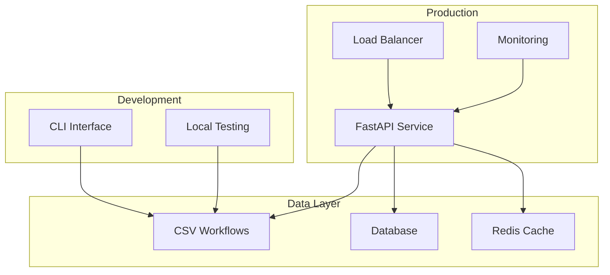
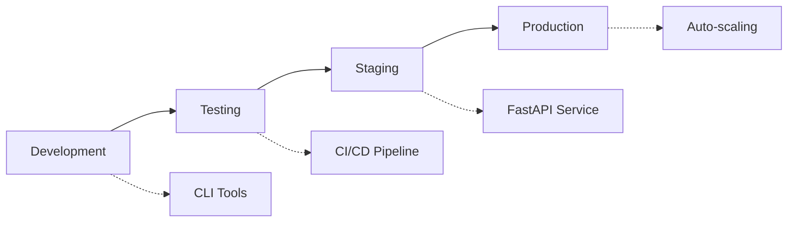

# Deployment Overview

<div style={{marginBottom: '1rem', fontSize: '0.9rem', color: '#666'}}>
  <span>📍 <a href="/docs/intro">AgentMap</a> → <strong>Deployment</strong></span>
</div>

AgentMap provides flexible deployment options to suit different use cases, from local CLI development to scalable production services. This guide helps you choose the right deployment approach and provides implementation guidance.

## Deployment Options

### 🖥️ Command-Line Interface (CLI)

**Best for**: Development, testing, automation scripts, and batch processing

- **Quick setup**: No additional infrastructure required
- **Direct execution**: Run workflows directly from terminal
- **Scaffolding support**: Generate missing agent implementations
- **Debugging tools**: Built-in graph inspection and validation

```bash
# Install and run immediately
pip install agentmap
agentmap run --graph MyWorkflow --state '{"input": "value"}'
```

**[Get Started with CLI Deployment →](./cli-deployment)**

### 🚀 FastAPI Standalone Service

**Best for**: Web applications, microservices, and API-first architectures

- **HTTP API**: RESTful interface for workflow execution
- **Auto-documentation**: Swagger/OpenAPI integration
- **Async execution**: Non-blocking workflow processing
- **Health monitoring**: Built-in health checks and metrics

```python
from agentmap.services.fastapi import AgentMapAPI

app = AgentMapAPI()
# Accessible at http://localhost:8000/docs
```

**[Deploy FastAPI Service →](./fastapi-standalone)**

### 🔗 FastAPI Integration

**Best for**: Embedding workflows into existing applications

- **Flexible integration**: Add workflows to existing FastAPI apps
- **Custom middleware**: Authentication, logging, monitoring
- **Shared services**: Reuse existing database connections and services
- **Custom routing**: Integrate workflows into your URL structure

```python
from fastapi import FastAPI
from agentmap.services.fastapi import include_agentmap_routes

app = FastAPI()
include_agentmap_routes(app, prefix="/workflows")
```

**[Integrate with Existing Apps →](./fastapi-integration)**

## Quick Start by Use Case

### 🧪 Development & Testing

```bash
# Install AgentMap
pip install agentmap

# Create a simple workflow
echo "TestGraph,start,InputAgent,Get input,input,result" > test.csv

# Run immediately
agentmap run --graph TestGraph --csv test.csv --state '{"input": "hello"}'
```

### 📊 Data Processing Pipeline

```bash
# Install with data processing extras
pip install agentmap[data]

# Use CLI for batch processing
agentmap run --graph DataPipeline --csv pipeline.csv
```

### 🌐 Web Service

```python
# main.py
from agentmap.services.fastapi import AgentMapAPI

app = AgentMapAPI(
    csv_file="workflows.csv",
    enable_docs=True,
    enable_monitoring=True
)

if __name__ == "__main__":
    import uvicorn
    uvicorn.run(app, host="0.0.0.0", port=8000)
```

```bash
# Deploy
python main.py
```

### 🏢 Enterprise Integration

```python
# enterprise_app.py
from fastapi import FastAPI, Depends
from agentmap.services.fastapi import include_agentmap_routes
from your_auth import get_current_user

app = FastAPI(title="Enterprise Workflows")

# Add AgentMap with authentication
include_agentmap_routes(
    app, 
    prefix="/api/workflows",
    dependencies=[Depends(get_current_user)]
)
```

## Architecture Considerations

### 🏗️ System Architecture



### 🔄 Workflow Lifecycle



## Performance & Scaling

### 📈 Performance Characteristics

| Deployment Type | Latency | Throughput | Scalability | Resource Usage |
|----------------|---------|------------|-------------|----------------|
| CLI | Low | Medium | Vertical | Low |
| FastAPI Standalone | Medium | High | Horizontal | Medium |
| FastAPI Integration | Medium | High | Horizontal | Shared |

### 🎯 Scaling Strategies

**Vertical Scaling** (CLI & Single Instance):
- Increase CPU and memory
- Optimize workflow design
- Use local caching

**Horizontal Scaling** (FastAPI Services):
- Load balancing across instances
- Shared state management
- Database connection pooling

**Hybrid Scaling**:
- CLI for batch processing
- FastAPI for real-time requests
- Shared workflow definitions

## Configuration Management

### 🔧 Environment-Specific Settings

```yaml
# deployment/development.yaml
environment: development
debug: true
log_level: DEBUG
workflows:
  csv_path: "./workflows/"
  enable_hot_reload: true

# deployment/production.yaml  
environment: production
debug: false
log_level: INFO
workflows:
  csv_path: "/app/workflows/"
  enable_caching: true
monitoring:
  enable_metrics: true
  health_check_interval: 30
```

### 🔐 Security Configuration

```python
# Security settings for production
SECURITY_CONFIG = {
    'api_key_required': True,
    'rate_limiting': True,
    'input_validation': True,
    'output_sanitization': True,
    'allowed_origins': ['https://yourdomain.com'],
    'max_request_size': '10MB'
}
```

## Monitoring & Observability

### 📊 Built-in Monitoring

All deployment options include:

- **Health Checks**: Service availability monitoring
- **Metrics Collection**: Performance and usage statistics  
- **Logging**: Structured logging with correlation IDs
- **Error Tracking**: Comprehensive error reporting

### 🔍 Monitoring Integration

```python
# Add custom monitoring
from agentmap.services.monitoring import MetricsCollector

metrics = MetricsCollector()
metrics.track_workflow_execution(graph_name, duration, success)
```

**[Learn More About Monitoring →](./monitoring)**

## Deployment Checklist

### ✅ Pre-Deployment

- [ ] Validate all workflow CSV files
- [ ] Test with sample data
- [ ] Verify all custom agents are implemented
- [ ] Check service dependencies
- [ ] Configure environment variables
- [ ] Set up monitoring and logging

### ✅ Production Deployment

- [ ] Configure load balancing (if using FastAPI)
- [ ] Set up database connections
- [ ] Configure caching layer
- [ ] Enable security features
- [ ] Set up automated backups
- [ ] Configure alerting

### ✅ Post-Deployment

- [ ] Verify health checks
- [ ] Test critical workflows
- [ ] Monitor performance metrics
- [ ] Validate log aggregation
- [ ] Test disaster recovery procedures

## Common Deployment Patterns

### 🏃‍♂️ Quick Prototype

```bash
# Fastest way to deploy a workflow
agentmap run --graph QuickTest --state '{"input": "test"}'
```

### 🔄 Continuous Integration

```yaml
# .github/workflows/agentmap.yml
name: Test AgentMap Workflows
on: [push, pull_request]
jobs:
  test:
    runs-on: ubuntu-latest
    steps:
      - uses: actions/checkout@v2
      - name: Install AgentMap
        run: pip install agentmap
      - name: Validate Workflows
        run: agentmap validate-csv workflows/
      - name: Test Workflows
        run: agentmap run --graph TestSuite
```

### 🐳 Container Deployment

```dockerfile
# Dockerfile
FROM python:3.11-slim

WORKDIR /app
COPY requirements.txt .
RUN pip install -r requirements.txt

COPY workflows/ ./workflows/
COPY main.py .

EXPOSE 8000
CMD ["python", "main.py"]
```

### ☁️ Cloud Deployment

**AWS Lambda** (for small workflows):
```python
# lambda_handler.py
from agentmap import AgentMap

def lambda_handler(event, context):
    agent_map = AgentMap(csv_file="workflows.csv")
    result = agent_map.run_graph("ProcessData", event)
    return {"statusCode": 200, "body": result}
```

**Kubernetes** (for scalable services):
```yaml
# k8s-deployment.yaml
apiVersion: apps/v1
kind: Deployment
metadata:
  name: agentmap-service
spec:
  replicas: 3
  selector:
    matchLabels:
      app: agentmap
  template:
    spec:
      containers:
      - name: agentmap
        image: your-repo/agentmap:latest
        ports:
        - containerPort: 8000
```

## Next Steps

Choose your deployment approach:

1. **Start with CLI** for development and testing → [CLI Deployment Guide](./cli-deployment)
2. **Deploy FastAPI service** for production APIs → [FastAPI Standalone Guide](./fastapi-standalone)  
3. **Integrate with existing apps** → [FastAPI Integration Guide](./fastapi-integration)
4. **Set up monitoring** → [Monitoring Guide](./monitoring)

## Support & Resources

- **[Configuration Reference](./configuration)**: Complete configuration options
- **[CLI Commands Reference](deployment/cli-commands)**: Command-line interface documentation
- **[Troubleshooting](./troubleshooting)**: Common issues and solutions
- **[Performance Optimization](./performance)**: Optimization best practices

---

**Quick Links:**
- [CLI Deployment](./cli-deployment) | [FastAPI Standalone](./fastapi-standalone) | [Integration Guide](./fastapi-integration)
- [Configuration](./configuration) | [Monitoring](./monitoring) | [Troubleshooting](./troubleshooting)
