# Lesson 3: Custom Agent Development

Ready to build your own intelligent agents? In this lesson, you'll learn to create custom agents by extending the BaseAgent class, implementing specialized business logic, and using AgentMap's powerful protocol system.

## Learning Objectives

By the end of this lesson, you will:
- ✅ Understand BaseAgent architecture and inheritance patterns
- ✅ Implement custom `process()` methods with business logic
- ✅ Use AgentMap's scaffolding tools to generate agent templates
- ✅ Integrate custom agents into workflows
- ✅ Apply CapableAgent protocols for service injection
- ✅ Handle errors and logging in custom agents

## Overview: What We're Building

We'll create a **Smart Expense Validator** that:
1. **Validates** expense data using custom business rules
2. **Categorizes** expenses automatically
3. **Calculates** tax implications and budgets
4. **Flags** suspicious or policy-violating expenses
5. **Generates** detailed validation reports

```mermaid
flowchart LR
    A[💰 Expense Data<br/>CSV Input] --> B[🔍 Custom Validator<br/>Business Rules]
    B --> C[📊 Smart Analysis<br/>AI Categorization]
    C --> D[⚠️ Policy Check<br/>Compliance Rules]
    D --> E[📋 Validation Report<br/>Results & Flags]
    
    style A fill:#e1f5fe
    style B fill:#f3e5f5
    style C fill:#fff3e0
    style D fill:#ffebee
    style E fill:#e8f5e8
```



## Step 1: Understanding Custom Agent Architecture

### BaseAgent Foundation

All AgentMap agents inherit from `BaseAgent` and implement the `process()` method:

```python
from agentmap.agents.base_agent import BaseAgent
from typing import Dict, Any

class MyCustomAgent(BaseAgent):
    """Custom agent extending BaseAgent functionality."""
    
    def __init__(self, name: str, prompt: str, context: Dict[str, Any] = None, **kwargs):
        super().__init__(name, prompt, context, **kwargs)
        # Custom initialization logic here
    
    def process(self, inputs: Dict[str, Any]) -> Any:
        """
        Custom processing logic - this is where your agent's intelligence lives.
        
        Args:
            inputs: Dictionary containing input data from previous agents
            
        Returns:
            Any: Processed result that gets passed to next agent
        """
        # Your custom logic here
        return processed_result
```

### Key Agent Components

1. **Initialization**: Set up agent state and configuration
2. **Process Method**: Core business logic implementation
3. **Logging**: Built-in logging capabilities via `self.log_info()`
4. **Context Access**: Configuration via `self.context`
5. **Error Handling**: Graceful failure management

## Step 2: Download the Lesson Files

Let's get all the files we'll need for this lesson:

import DownloadButton from '@site/src/components/DownloadButton';

### Workflow File
<DownloadButton 
  filename="lesson3.csv"
  contentPath="/downloads/lessons/lesson3/lesson3.csv"
>
  📄 Download Workflow Configuration
</DownloadButton>

### Sample Expense Data
<DownloadButton 
  filename="sample_expenses.csv"
  contentPath="/downloads/lessons/lesson3/sample_expenses.csv"
>
  📊 Download Sample Expense Data
</DownloadButton>

### Custom Agent Implementation
<DownloadButton 
  filename="expense_validator.py"
  contentPath="/downloads/lessons/lesson3/expense_validator.py"
>
  🐍 Download Custom Agent Code
</DownloadButton>

## Step 3: Understanding the Custom Agent Code

### Class Structure Analysis

Let's break down the `ExpenseValidatorAgent` implementation:

#### 1. **Class Declaration and Inheritance**
```python
class ExpenseValidatorAgent(BaseAgent):
    """Custom agent that validates expense data against business rules."""
```

**Key Points**:
- Inherits from `BaseAgent` to get core functionality
- Docstring explains the agent's purpose
- Clear naming convention (`*Agent` suffix)

#### 2. **Initialization Method**
```python
def __init__(self, name: str, prompt: str, context: Dict[str, Any] = None, **kwargs):
    super().__init__(name, prompt, context, **kwargs)
    
    # Initialize validation rules from context
    self.max_amount = self.context.get('max_amount', 1000)
    self.required_fields = self.context.get('required_fields', ['amount', 'description', 'date'])
    self.allowed_categories = self.context.get('allowed_categories', [])
    
    self.log_info(f"ExpenseValidator initialized with max_amount: ${self.max_amount}")
```

**Key Points**:
- Calls parent constructor first
- Extracts configuration from context
- Provides sensible defaults
- Uses built-in logging

#### 3. **Core Process Method**
```python
def process(self, inputs: Dict[str, Any]) -> Any:
    """Validate expense data against business rules."""
    try:
        expense_data = inputs.get('expense_data', [])
        # Main processing logic here
        return result
    except Exception as e:
        error_msg = f"ExpenseValidator process failed: {str(e)}"
        self.log_error(error_msg)
        return {"error": error_msg}
```

**Key Points**:
- Single entry point for agent logic
- Handles inputs from previous agents
- Returns structured output
- Comprehensive error handling

#### 4. **Helper Methods**
```python
def _validate_single_expense(self, expense: Dict[str, Any], index: int) -> Dict[str, Any]:
def _clean_description(self, description: str) -> str:
def _parse_date(self, date_str: str) -> datetime:
def _generate_validation_summary(self, stats: Dict[str, Any]) -> str:
```

**Key Points**:
- Private methods (underscore prefix) for internal logic
- Single responsibility principle
- Reusable, testable components
- Clear input/output contracts

## Step 4: Setting Up the Custom Agent

### Project Structure

Create this directory structure:
```
agentmap-learning/
├── lesson3.csv              # Workflow definition
├── expense_validator.py     # Custom agent code
├── sample_expenses.csv      # Test data
└── data/                    # Output directory
    ├── validation_report.txt
    └── (other outputs)
```

### Agent Registration

AgentMap automatically discovers custom agents if they follow naming conventions:

1. **File naming**: `{agent_name}.py`
2. **Class naming**: `{AgentName}Agent`
3. **Factory function**: `create_{agent_name}_agent`

For our `expense_validator` type in CSV:
- File: `expense_validator.py`
- Class: `ExpenseValidatorAgent`  
- Factory: `create_expense_validator_agent`

### Running the Workflow

```bash
# Make sure all files are in place
ls -la
# lesson3.csv  expense_validator.py  sample_expenses.csv

# Create data directory
mkdir -p data

# Run the workflow
agentmap run lesson3.csv
```

## Step 5: Understanding the Workflow Execution

### Execution Flow

1. **LoadExpenses**: Reads `sample_expenses.csv` using CSVReaderAgent
2. **ValidateExpenses**: Our custom agent processes the data
3. **CategorizeExpenses**: AI analyzes and categorizes validated expenses
4. **GenerateReport**: Creates summary report
5. **SaveReport**: Saves final report to file

### Custom Agent Integration

In the CSV, our custom agent is referenced like any built-in agent:

```csv
ExpenseValidation,ValidateExpenses,Custom validation with business rules,expense_validator,CategorizeExpenses,ErrorHandler,expense_data,validation_results,,"{""max_amount"": 1000, ""required_fields"": [""amount"", ""description"", ""date""], ""allowed_categories"": [""Travel"", ""Office"", ""Meals"", ""Equipment"", ""Software""]}"
```

**Key Configuration**:
- `type`: `expense_validator` (matches file name)
- `context`: JSON configuration for validation rules
- `input_fields`: `expense_data` from previous agent
- `output_field`: `validation_results` for next agent

## Step 6: Examining the Results

### Validation Output

After running, check the validation results:

```bash
cat data/validation_report.txt
```

You should see something like:
```
📊 **EXPENSE VALIDATION REPORT**

[
  {
    "original_expense": "Uber to client meeting",
    "amount": 25.50,
    "suggested_category": "Travel",
    "confidence": 0.95,
    "suspicious": false,
    "reason": "Clear business transportation expense"
  },
  {
    "original_expense": "Expensive dinner",
    "amount": 300.00,
    "suggested_category": "Meals",
    "confidence": 0.7,
    "suspicious": true,
    "reason": "Unusually high meal cost, employee identification unclear"
  }
]

✅ **Validation Complete**: All expenses have been processed through custom business rules and AI categorization.
```

### Understanding the Custom Logic

Our agent identified several issues:
- **High amounts**: Flagged expenses over the limit
- **Missing receipts**: Noted policy violations
- **Suspicious employees**: Caught "Unknown" and "Anonymous" entries
- **Invalid dates**: Detected future dates or bad formats

## Step 7: Advanced Custom Agent Patterns

### Using CapableAgent Protocols

For agents that need external services, implement capability protocols:

```python
from agentmap.services.protocols import LLMCapableAgent, StorageCapableAgent

class AdvancedExpenseAgent(BaseAgent, LLMCapableAgent, StorageCapableAgent):
    """Agent with multiple service capabilities."""
    
    def configure_llm_service(self, llm_service):
        """Configure LLM service for AI processing."""
        self._llm_service = llm_service
    
    def configure_storage_service(self, storage_service):
        """Configure storage service for data persistence."""
        self._storage_service = storage_service
    
    def process(self, inputs: Dict[str, Any]) -> Any:
        # Use both LLM and storage services
        ai_analysis = self._llm_service.call_llm(...)
        self._storage_service.write(...)
        return result
```

### Error Handling Best Practices

```python
def process(self, inputs: Dict[str, Any]) -> Any:
    try:
        # Main processing logic
        result = self._main_processing(inputs)
        self.log_info("Processing completed successfully")
        return result
        
    except ValidationError as e:
        # Specific business errors
        self.log_warning(f"Validation failed: {e}")
        return {"error": str(e), "type": "validation"}
        
    except Exception as e:
        # Unexpected errors
        self.log_error(f"Unexpected error: {e}")
        return {"error": "Internal processing error", "type": "system"}
```

### Context-Driven Configuration

```python
def __init__(self, name: str, prompt: str, context: Dict[str, Any] = None, **kwargs):
    super().__init__(name, prompt, context, **kwargs)
    
    # Extract complex configuration
    self.rules = self._parse_validation_rules(self.context.get('rules', {}))
    self.thresholds = self.context.get('thresholds', {})
    self.enabled_features = self.context.get('features', [])
    
def _parse_validation_rules(self, rules_config: Dict) -> Dict:
    """Parse and validate configuration rules."""
    # Complex configuration parsing logic
    return parsed_rules
```

## Step 8: Exercises and Extensions

### Exercise 1: Add More Validation Rules

Extend the validator with additional business rules:

```python
def _validate_single_expense(self, expense: Dict[str, Any], index: int) -> Dict[str, Any]:
    # ... existing validation ...
    
    # Add new validations
    # 1. Weekend expense validation
    if self._is_weekend(result['date_parsed']):
        result['validation_flags'].append("Weekend expense requires justification")
    
    # 2. Duplicate detection
    if self._is_potential_duplicate(expense):
        result['validation_flags'].append("Potential duplicate expense")
    
    # 3. Category-specific validation
    category = self._predict_category(description)
    if category == "Meals" and amount > 50:
        result['validation_flags'].append("High meal expense requires approval")
    
    return result
```

### Exercise 2: Add Statistical Analysis

Include more sophisticated analysis:

```python
def _generate_advanced_stats(self, validation_results: List[Dict]) -> Dict:
    """Generate advanced statistical analysis."""
    stats = {
        'expense_by_category': {},
        'spending_patterns': {},
        'anomaly_detection': {},
        'compliance_score': 0.0
    }
    
    # Category analysis
    for result in validation_results:
        category = result.get('predicted_category', 'Unknown')
        if category not in stats['expense_by_category']:
            stats['expense_by_category'][category] = {'count': 0, 'total': 0.0}
        
        stats['expense_by_category'][category]['count'] += 1
        stats['expense_by_category'][category]['total'] += result['amount']
    
    return stats
```

### Exercise 3: Create a Report Generator Agent

Build a second custom agent that formats reports:

```python
class ExpenseReportGeneratorAgent(BaseAgent):
    """Generates formatted expense reports from validation data."""
    
    def process(self, inputs: Dict[str, Any]) -> Any:
        validation_data = inputs.get('validation_results', {})
        
        # Generate different report formats
        reports = {
            'executive_summary': self._generate_executive_summary(validation_data),
            'detailed_report': self._generate_detailed_report(validation_data),
            'compliance_report': self._generate_compliance_report(validation_data)
        }
        
        return reports
```

## Key Concepts Learned

### 1. **BaseAgent Architecture**
- Inheritance from BaseAgent provides core functionality
- `process()` method is the main entry point
- Context provides configuration flexibility
- Built-in logging and error handling

### 2. **Custom Business Logic**
- Implement domain-specific validation rules
- Use helper methods for code organization
- Provide meaningful error messages and flags
- Generate actionable insights and reports

### 3. **Integration Patterns**
- Follow naming conventions for automatic discovery
- Use context for configuration
- Structure input/output for workflow compatibility
- Handle errors gracefully

### 4. **Service Integration**
- CapableAgent protocols enable service injection
- Multiple capabilities can be combined
- Services are automatically configured by the framework
- Type-safe service access patterns

## Best Practices for Custom Agents

### 1. **Code Organization**
- Use clear, descriptive class names
- Implement single responsibility principle
- Separate business logic into helper methods
- Provide comprehensive docstrings

### 2. **Error Handling**
- Use try-catch blocks appropriately
- Log errors at the right level
- Return structured error information
- Provide recovery strategies when possible

### 3. **Configuration**
- Use context for all configuration
- Provide sensible defaults
- Validate configuration on initialization
- Document all configuration options

### 4. **Testing**
- Write unit tests for helper methods
- Test with various input scenarios
- Validate error handling paths
- Use mock data for external dependencies

## Troubleshooting

### Issue: Agent not found
**Solution**: Check naming conventions:
- File: `{agent_type}.py`
- Class: `{AgentType}Agent`
- Factory: `create_{agent_type}_agent`

### Issue: Configuration not loading
**Solution**: Verify context JSON syntax in CSV:
```json
{"key": "value", "list": ["item1", "item2"]}
```

### Issue: Process method errors
**Solution**: Add comprehensive error handling:
```python
try:
    # processing logic
except Exception as e:
    self.log_error(f"Error: {e}")
    return {"error": str(e)}
```

## Next Steps

Excellent progress! You've mastered:
- ✅ Custom agent development with BaseAgent inheritance
- ✅ Business logic implementation in process() methods
- ✅ Context-driven configuration and validation
- ✅ Error handling and logging best practices
- ✅ Integration with AgentMap workflows

In Lesson 4, we'll explore the most advanced topic: orchestrating multiple custom agents using intelligent routing and coordination strategies.

**[Continue to Lesson 4: Multi-Agent Orchestration →](./04-orchestration)**

---

## Additional Resources

- **[Custom Agent Development Guide](/docs/guides/development/agents/agent-development)**
- **[BaseAgent API Reference](/docs/reference/agents/custom-agents)**
- **[CapableAgent Protocols](/docs/reference/capabilities/)**
- **[Service Injection Patterns](/docs/contributing/service-injection)**

---

*💡 **Pro Tip**: Start simple with your custom agents and gradually add complexity. The patterns you learn here scale to sophisticated business logic implementations. Also, consider creating reusable validation libraries that multiple agents can share!*
