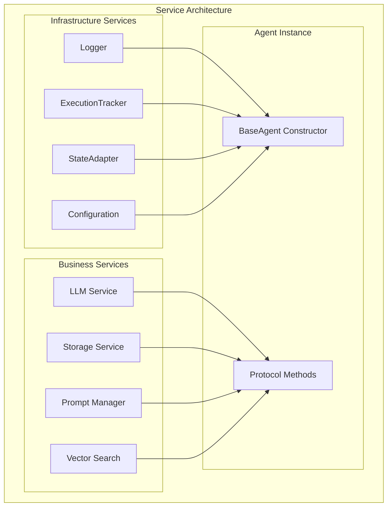

# Services Overview

AgentMap uses a clean architecture with protocol-based dependency injection to provide services to agents. This creates clear separation between infrastructure concerns and business logic while maintaining type safety and testability.

## Service Architecture

### Two-Layer Service Design

AgentMap separates services into two distinct layers:



**Infrastructure Services** (Constructor Injection):
- Core services that ALL agents need
- Injected via constructor parameters
- Required for proper agent operation
- Examples: Logging, execution tracking, state management

**Business Services** (Protocol-Based Configuration):
- Specialized services that SOME agents need
- Configured post-construction via protocols
- Optional but typed when needed
- Examples: LLM, storage, vector search

## Infrastructure vs Business Services

### Infrastructure Services

Infrastructure services are injected via the constructor and provide core functionality:

```python
class BaseAgent:
    def __init__(
        self,
        name: str,
        prompt: str,
        context: Optional[Dict[str, Any]] = None,
        # Infrastructure services - required for all agents
        logger: Optional[logging.Logger] = None,
        execution_tracker_service: Optional[ExecutionTrackingService] = None,
        state_adapter_service: Optional[StateAdapterService] = None
    ):
        # Store infrastructure services
        self._logger = logger
        self._execution_tracker_service = execution_tracker_service
        self._state_adapter_service = state_adapter_service
```

**Core Infrastructure Services**:

| Service | Purpose | Required |
|---------|---------|----------|
| **Logger** | Structured logging throughout the system | Yes |
| **ExecutionTracker** | Performance monitoring and debugging | Yes |
| **StateAdapter** | State format conversion and access | Yes |
| **ConfigService** | Application configuration access | No |

### Business Services

Business services are configured post-construction using protocol-based injection:

```python
from agentmap.services.protocols import LLMCapableAgent, StorageCapableAgent

class MyAgent(BaseAgent, LLMCapableAgent, StorageCapableAgent):
    """Agent that uses both LLM and storage services"""
    
    def configure_llm_service(self, llm_service: LLMServiceProtocol):
        """Configure LLM service - called by framework"""
        self._llm_service = llm_service
        
    def configure_storage_service(self, storage_service: StorageServiceProtocol):
        """Configure storage service - called by framework"""
        self._storage_service = storage_service
```

**Core Business Services**:

| Service | Purpose | Protocol |
|---------|---------|----------|
| **LLM Service** | Language model interactions | `LLMCapableAgent` |
| **Storage Service** | Data persistence operations | `StorageCapableAgent` |
| **Prompt Manager** | Template and prompt management | `PromptCapableAgent` |
| **Vector Search** | Embedding and similarity search | `VectorCapableAgent` |

## Protocol-Based Injection

### Service Protocols

AgentMap uses Python protocols to define service contracts:

```python
from typing import Protocol, Any, Dict, List, Optional

class LLMServiceProtocol(Protocol):
    """Protocol for LLM service implementations"""
    
    def call_llm(
        self,
        provider: str,
        messages: List[Dict[str, Any]],
        model: Optional[str] = None,
        **kwargs
    ) -> str:
        """Call LLM with messages and return response"""
        ...

class StorageServiceProtocol(Protocol):
    """Protocol for storage service implementations"""
    
    def read(
        self,
        collection: str,
        document_id: Optional[str] = None,
        **kwargs
    ) -> Any:
        """Read data from storage"""
        ...
    
    def write(
        self,
        collection: str,
        data: Any,
        document_id: Optional[str] = None,
        **kwargs
    ) -> Any:
        """Write data to storage"""
        ...
```

### Agent Protocol Implementation

Agents implement capability protocols to receive relevant services:

```python
class LLMCapableAgent(Protocol):
    """Protocol for agents that can use LLM services"""
    
    def configure_llm_service(self, llm_service: LLMServiceProtocol) -> None:
        """Configure LLM service for this agent"""
        ...

class StorageCapableAgent(Protocol):
    """Protocol for agents that can use storage services"""
    
    def configure_storage_service(self, storage_service: StorageServiceProtocol) -> None:
        """Configure storage service for this agent"""
        ...
```

## Service Categories

### LLM Services

Language model services provide AI capabilities:

```python
class LLMService:
    """Multi-provider LLM service"""
    
    def call_llm(
        self,
        provider: str,  # "openai", "anthropic", "google"
        messages: List[Dict[str, Any]],
        model: Optional[str] = None,
        temperature: float = 0.7,
        max_tokens: Optional[int] = None,
        **kwargs
    ) -> str:
        """Call specified LLM provider with messages"""
        
    def get_available_providers(self) -> List[str]:
        """Get list of configured providers"""
        
    def get_provider_models(self, provider: str) -> List[str]:
        """Get available models for provider"""
```

**Usage in Agents**:
```python
def process(self, inputs: Dict[str, Any]) -> Any:
    messages = [{"role": "user", "content": inputs.get("query", "")}]
    response = self.llm_service.call_llm(
        provider="anthropic",
        messages=messages,
        model="claude-3-5-sonnet-20241022"
    )
    return response
```

### Storage Services

Data persistence services for various storage types:

```python
class StorageManager:
    """Unified interface for all storage services"""
    
    def get_service(self, storage_type: str, provider: str = None) -> StorageServiceProtocol:
        """Get storage service by type and provider"""
        
    def list_services(self) -> Dict[str, List[str]]:
        """List available storage services by type"""
```

**Storage Types**:
- **CSV Storage**: Pandas-based CSV operations
- **JSON Storage**: Document-based JSON storage
- **File Storage**: File system operations
- **Vector Storage**: Embedding and similarity search
- **Database Storage**: SQL and NoSQL database access

**Usage in Agents**:
```python
def process(self, inputs: Dict[str, Any]) -> Any:
    collection = inputs.get("collection", "default")
    data = self.storage_service.read(collection, format="records")
    
    # Process data
    processed = self.transform_data(data)
    
    # Save results
    result = self.storage_service.write(collection, processed, mode="append")
    return result
```

### Execution Services

System execution and monitoring services:

```python
class ExecutionTrackingService:
    """Service for tracking workflow execution"""
    
    def create_tracker(self, graph_name: str) -> ExecutionTracker:
        """Create execution tracker for workflow"""
        
    def record_node_start(self, node_name: str, inputs: Dict[str, Any]) -> None:
        """Record node execution start"""
        
    def record_node_result(
        self,
        node_name: str,
        success: bool,
        result: Any = None,
        error: str = None
    ) -> None:
        """Record node execution result"""
```

## Dependency Injection Container

### Service Registration

All services are registered in the DI container:

```python
class Container:
    """Dependency injection container"""
    
    # Infrastructure services
    def logging_service(self) -> LoggingService:
        return self._get_or_create('_logging_service', LoggingService)
    
    def execution_tracking_service(self) -> ExecutionTrackingService:
        return self._get_or_create('_execution_tracking_service',
            lambda: ExecutionTrackingService(
                config=self.app_config_service(),
                logger=self.logging_service()
            )
        )
    
    # Business services
    def llm_service(self) -> Optional[LLMService]:
        try:
            return self._get_or_create('_llm_service',
                lambda: LLMService(
                    config=self.app_config_service(),
                    logger=self.logging_service()
                )
            )
        except Exception:
            return None  # Graceful degradation
    
    def storage_manager(self) -> StorageManager:
        return self._get_or_create('_storage_manager',
            lambda: StorageManager(
                config=self.storage_config_service(),
                logger=self.logging_service()
            )
        )
```

### Service Lifecycle

1. **Lazy Creation**: Services created when first requested
2. **Singleton Pattern**: One instance per container
3. **Dependency Resolution**: Dependencies automatically injected
4. **Graceful Degradation**: Optional services return None if unavailable
5. **Error Isolation**: Service failures don't crash the system

## Service Configuration

### Environment-Based Configuration

Services are configured via environment variables and config files:

```python
# Environment variables
AGENTMAP_LLM_OPENAI_API_KEY=your_api_key
AGENTMAP_LLM_ANTHROPIC_API_KEY=your_api_key
AGENTMAP_STORAGE_CSV_PATH=./data
AGENTMAP_EXECUTION_TRACKING_ENABLED=true

# Configuration file (agentmap.yaml)
llm:
  default_provider: anthropic
  providers:
    openai:
      model: gpt-4
      temperature: 0.7
    anthropic:
      model: claude-3-5-sonnet-20241022
      temperature: 0.7

storage:
  csv:
    default_provider: local
    providers:
      local:
        base_path: ./data
  
execution:
  tracking:
    enabled: true
    detail_level: normal
```

### Runtime Service Discovery

Agents can discover available services at runtime:

```python
def process(self, inputs: Dict[str, Any]) -> Any:
    # Check service availability
    if hasattr(self, '_llm_service') and self._llm_service:
        # Use LLM service for processing
        return self.process_with_llm(inputs)
    else:
        # Fallback to rule-based processing
        return self.process_with_rules(inputs)
```

## Service Testing

### Mock Service Injection

Services can be easily mocked for testing:

```python
def test_agent_with_mock_services():
    from unittest.mock import Mock
    
    # Create mock services
    mock_llm = Mock()
    mock_storage = Mock()
    mock_logger = Mock()
    
    # Configure mock behaviors
    mock_llm.call_llm.return_value = "Mock response"
    mock_storage.read.return_value = {"test": "data"}
    
    # Create agent with mocks
    agent = MyAgent(
        name="TestAgent",
        prompt="Test prompt",
        logger=mock_logger,
        execution_tracker_service=Mock(),
        state_adapter_service=Mock()
    )
    
    # Configure business services
    agent.configure_llm_service(mock_llm)
    agent.configure_storage_service(mock_storage)
    
    # Test agent behavior
    result = agent.process({"input": "test"})
    assert result == "Mock response"
```

### Integration Testing

Real services can be used for integration testing:

```python
def test_agent_integration():
    from agentmap.di.containers import Container
    
    # Use real container with real services
    container = Container()
    
    # Create agent with real services
    agent = container.agent_factory_service().create_agent_by_type(
        agent_type="llm",
        name="TestAgent",
        context={"input_fields": ["query"], "output_field": "response"}
    )
    
    # Test with real services
    result = agent.process({"query": "What is the capital of France?"})
    assert "Paris" in result
```

## Best Practices

### Service Design

1. **Protocol First**: Define protocols before implementations
2. **Single Responsibility**: Each service has one clear purpose
3. **Dependency Injection**: Never create services directly
4. **Graceful Degradation**: Handle missing optional services

### Agent Integration

1. **Declare Capabilities**: Implement relevant capability protocols
2. **Service Validation**: Check service availability before use
3. **Error Handling**: Handle service failures gracefully
4. **Configuration**: Use context for service-specific configuration

### Testing Strategy

1. **Unit Tests**: Mock all dependencies
2. **Integration Tests**: Use real services selectively
3. **Service Tests**: Test service implementations independently
4. **Container Tests**: Test dependency injection configuration

## Next Steps

- **[Storage Services Overview](./storage-services-overview)** - Deep dive into storage architecture
- **[Service Injection Patterns](/docs/contributing/service-injection)** - Advanced injection patterns
- **[Dependency Injection Reference](/docs/reference/dependency-injection)** - Complete DI system documentation
- **[Custom Agent Development](../agents/custom-agents)** - Building agents with service injection
