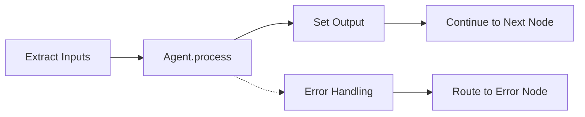

import AgentCatalog from '@site/src/components/AgentCatalog';

# Built-in Agents

AgentMap provides a comprehensive set of built-in agents for common workflow tasks. All agents inherit from `BaseAgent` and implement a `process()` method for data transformation.

## Agent Architecture

### BaseAgent Foundation

Every AgentMap agent follows the same architectural pattern:

```python
class BaseAgent:
    def __init__(self, name: str, prompt: str, context: Dict[str, Any] = None):
        self.name = name
        self.prompt = prompt
        self.context = context or {}
        self.input_fields = self.context.get("input_fields", [])
        self.output_field = self.context.get("output_field", None)
    
    def process(self, inputs: Dict[str, Any]) -> Any:
        """Transform inputs to output - implemented by each agent type"""
        raise NotImplementedError("Subclasses must implement process()")
```

**Key Principles**:
- **Single Responsibility**: Each agent has one clear purpose
- **Data Flow**: Input fields → `process()` method → output field  
- **Error Handling**: Built-in exception handling and error routing
- **Service Injection**: Optional services (LLM, storage) injected via protocols

### Agent Execution Flow



1. **Input Extraction**: System extracts values from state using `input_fields`
2. **Processing**: Agent's `process()` method transforms inputs
3. **Output Integration**: Result stored in state using `output_field`
4. **Flow Control**: Success routes to `next_node`, errors to `error_node`

## Agent Categories

### 🧠 LLM Agents
AI-powered agents using language models for reasoning and generation:

| Agent Type | Purpose | Key Features |
|------------|---------|--------------|
| **llm** | General LLM processing | Multi-provider support, routing, memory |
| **summary** | Text summarization | Configurable length, format options |
| **classification** | Content classification | Custom categories, confidence scoring |

### 💾 Storage Agents
Data persistence and retrieval from various storage systems:

| Agent Type | Purpose | Key Features |
|------------|---------|--------------|
| **csv_reader** | Read CSV files | Collection-based access, format options |
| **csv_writer** | Write CSV data | Append/overwrite modes, validation |
| **json_reader** | Read JSON documents | Path-based access, collection support |
| **json_writer** | Write JSON data | Document management, nested paths |

### 📁 File Agents
File system operations for document processing:

| Agent Type | Purpose | Key Features |
|------------|---------|--------------|
| **file_reader** | Read file contents | Multiple formats, encoding detection |
| **file_writer** | Write file contents | Path creation, backup options |
| **directory_list** | List directory contents | Filtering, recursive scanning |

### 🔧 Control Flow Agents
Workflow orchestration and routing logic:

| Agent Type | Purpose | Key Features |
|------------|---------|--------------|
| **orchestrator** | Intelligent routing | Multi-strategy node selection |
| **branching** | Conditional routing | Rule-based decision making |
| **graph** | Subgraph execution | Compose workflows, input/output mapping |
| **tool** | Tool selection & execution | Auto-matching, LangChain tools, multi-strategy |

### 🏗️ Core Agents
Basic building blocks for data flow and workflow control:

| Agent Type | Purpose | Key Features |
|------------|---------|--------------|
| **input** | User input collection | Interactive prompts, validation |
| **echo** | Data passthrough | State inspection, debugging |
| **default** | Custom processing | Placeholder for custom logic |

## Graph Agent

The **Graph Agent** lets you compose workflows by running one graph inside another. A node of type `graph` executes an entire subgraph and returns its result to the parent workflow. This is the primary mechanism for building modular, reusable workflows in AgentMap.

### When to Use

- **Modular design** — Break a large workflow into smaller, self-contained graphs that can be developed and tested independently.
- **Reusable sub-processes** — Call the same validation or processing graph from multiple parent workflows.
- **Cross-file composition** — Reference a subgraph defined in a different CSV file.

### CSV Configuration

The Graph Agent uses the **Context** column to specify which subgraph to execute via the `{workflow=...}` syntax. The **Prompt** column is free for a human-readable description.

#### Workflow reference syntax

| Context value | Meaning |
|---|---|
| `{workflow=::SubgraphName}` | Embedded subgraph defined in the same CSV |
| `{workflow=other_csv::SubgraphName}` | External subgraph in a different CSV file |
| `{workflow_field=state_key}` | Dynamic — reads the workflow reference from `state[state_key]` at runtime |

#### Embedded subgraph (same CSV file)

Use `::` with no filename prefix to reference a graph in the same CSV:

```csv
GraphName,Node,AgentType,Input_Fields,Output_Field,Success_Next,Failure_Next,Context,Prompt
MainWorkflow,validate,graph,raw_data,validated_data,process,handle_error,{workflow=::DataValidation},Run validation
```

`DataValidation` is defined in the same CSV:

```csv
DataValidation,check_format,default,,,check_rules,format_error,,Validate format
DataValidation,check_rules,default,,,done,rules_error,,Validate rules
DataValidation,done,echo,,,,,,Validation passed
```

#### External subgraph (separate CSV file)

Prefix the graph name with the CSV path:

```csv
GraphName,Node,AgentType,Input_Fields,Output_Field,Success_Next,Failure_Next,Context,Prompt
MainWorkflow,analyze,graph,,analysis_result,report,handle_error,{workflow=analysis.csv::AnalysisWorkflow},Run analysis
```

#### Dynamic subgraph (resolved from state)

Use `{workflow_field=...}` to read the workflow reference from the initial state at runtime. The state value should be a string in `::GraphName` or `file.csv::GraphName` format:

```csv
GraphName,Node,AgentType,Input_Fields,Output_Field,Success_Next,Failure_Next,Context,Prompt
MainWorkflow,run_step,graph,data,step_result,next,error,{workflow_field=next_graph_ref},Run dynamic step
```

### Input / Output Mapping

By default the Graph Agent passes all parent state fields into the subgraph. You can control exactly which fields are forwarded and how they are renamed.

| Technique | Input_Fields example | Behavior |
|-----------|---------------------|----------|
| Pass all state | *(empty)* | Every field in the current state is forwarded |
| Select specific fields | `raw_data\|user_id` | Only listed fields are forwarded |
| Rename fields | `sub_input=raw_data` | Parent field `raw_data` is passed as `sub_input` |
| Function mapping | `func:mymodule.transform_state` | A Python function transforms the state before forwarding |

Output mapping works similarly via the **Output_Field** column:

| Output_Field value | Behavior |
|-------------------|----------|
| `result` | The entire subgraph result is stored in `result` |
| `parent_field=sub_field` | Only `sub_field` from the subgraph result is stored as `parent_field` |

### Full Example

```csv
GraphName,Node,AgentType,Input_Fields,Output_Field,Success_Next,Failure_Next,Context,Prompt
MainWorkflow,start,input,user_input,raw_data,validate,,,,Collect input
MainWorkflow,validate,graph,raw_data,validated_data,process,retry,{workflow=::DataValidation},Run validation subgraph
MainWorkflow,process,default,validated_data,processed,report,error,,Core processing
MainWorkflow,retry,graph,raw_data,validated_data,process,error,{workflow=::DataValidation},Retry validation
MainWorkflow,report,echo,processed,final,,,,,Show results

DataValidation,check_format,default,,,check_rules,format_err,,Check format
DataValidation,check_rules,default,,,done,rules_err,,Check rules
DataValidation,done,echo,,,,,,Valid
DataValidation,format_err,echo,,,,,,Format invalid
DataValidation,rules_err,echo,,,,,,Rules failed
```

### How It Works

Subgraph bundles are **pre-resolved** before the parent graph starts executing. During the run pipeline, `GraphRunnerService` scans all `graph`-type nodes, resolves their `{workflow=...}` references into ready-to-execute bundles, and stores them in the execution state. When a Graph Agent node executes, it reads its pre-resolved bundle from state and delegates to `GraphRunnerService.run()`.

### Key Behaviors

- **Pre-resolution** — All subgraph bundles are resolved before graph execution begins, so missing references fail fast rather than mid-execution.
- **Nested tracking** — Subgraph execution is recorded inside the parent execution tracker, so logs and summaries include the full call tree.
- **Error propagation** — If the subgraph fails, the error is captured and the parent routes to the configured `error_node`.
- **State isolation** — The subgraph runs with its own copy of state. Only the mapped output is returned to the parent.

---

## Tool Agent

The **Tool Agent** selects and executes [LangChain tools](https://python.langchain.com/docs/concepts/tools/) from within a workflow node. You write plain Python functions decorated with `@tool`, point the agent at the file containing them, and AgentMap handles discovery, selection, and execution.

### When to Use

- **Call Python functions** from a CSV-defined workflow without writing a custom agent.
- **Auto-select** the right tool when multiple tools are available and the best match depends on the input.
- **Chain tools** by wiring multiple Tool Agent nodes together in the graph.

### Writing Tools

Tools are standard LangChain tool functions. Place them in a Python file anywhere in your project:

```python
# tools/math_tools.py
from langchain_core.tools import tool

@tool
def add(a: int, b: int) -> int:
    """Add two numbers together."""
    return a + b

@tool
def multiply(a: int, b: int) -> int:
    """Multiply two numbers together."""
    return a * b
```

### CSV Configuration

The Tool Agent requires two extra columns beyond the standard set:

| Column | Purpose | Example |
|--------|---------|---------|
| **Tool_Source** | Path to the Python file containing `@tool` functions | `tools/math_tools.py` |
| **Available_Tools** | Pipe-separated list of tool names to make available | `add\|multiply` |

#### Single tool

When only one tool is listed, the agent executes it directly without any selection logic:

```csv
GraphName,Node,AgentType,Tool_Source,Available_Tools,Prompt,Input_Fields,Output_Field,Success_Next
SimpleCalc,Calculate,tool_agent,tools/math_tools.py,add,Add the numbers,a|b,result,ShowResult
```

#### Multiple tools with auto-selection

List several tools and the agent picks the best match based on the prompt and input:

```csv
GraphName,Node,AgentType,Tool_Source,Available_Tools,Prompt,Input_Fields,Output_Field,Success_Next,Context
MathNode,Compute,tool_agent,tools/math_tools.py,add|multiply,Calculate the result,a|b,answer,Next,"{""matching_strategy"": ""algorithm""}"
```

#### Inline tool descriptions

Override or supplement the tool's docstring with a description in parentheses. This helps the selection logic when docstrings are generic:

```csv
Available_Tools
add("adds two numbers")|multiply("multiplies two numbers")
```

### Matching Strategies

When multiple tools are available, the agent uses a matching strategy to decide which one to invoke. Set the strategy in the **context** column:

| Strategy | Description |
|----------|-------------|
| `tiered` *(default)* | Tries fast algorithmic matching first, then falls back to LLM-based selection |
| `algorithm` | Pure algorithmic matching — no LLM calls, fastest option |
| `llm` | Uses an LLM to reason about which tool best fits the input |

```csv
Context
"{""matching_strategy"": ""algorithm""}"
```

You can also set a **confidence threshold** (0.0–1.0) that controls when the tiered strategy escalates from algorithmic to LLM matching:

```csv
Context
"{""matching_strategy"": ""tiered"", ""confidence_threshold"": 0.9}"
```

### Input Mapping

The Tool Agent automatically maps workflow state fields to tool parameters:

1. **Exact name match** — If a state field name matches a tool parameter name, it maps directly.
2. **Positional match** — Fields listed in `input_fields` are mapped to tool parameters in order.
3. **Single-parameter shortcut** — For tools with one parameter, the first input field value is used regardless of name.

### Full Example

```csv
GraphName,Node,AgentType,Tool_Source,Available_Tools,Prompt,Input_Fields,Output_Field,Success_Next,Failure_Next,Context
TextFlow,Start,input,,,Enter some text,text,text,ToUpper,,
TextFlow,ToUpper,tool_agent,tools/string_tools.py,uppercase,Convert to uppercase,text,upper_text,Reverse,Error,"{""matching_strategy"": ""algorithm""}"
TextFlow,Reverse,tool_agent,tools/string_tools.py,reverse,Reverse the text,upper_text,reversed_text,Show,Error,"{""matching_strategy"": ""algorithm""}"
TextFlow,Show,echo,,,Result: {reversed_text},reversed_text,final,,,
TextFlow,Error,echo,,,Something went wrong,error,error_msg,,,
```

### Key Behaviors

- **Direct execution** — When only one tool is available, the agent skips selection and invokes it immediately.
- **Parameter mapping** — State fields are automatically matched to tool function parameters by name or position.
- **Error routing** — If a tool raises an exception, the workflow routes to the configured `error_node`.

---

## Interactive Agent Catalog

Explore all available agents with examples and configuration options:

<AgentCatalog />

## Agent Implementation Examples

### LLM Agent with Process Method

```python
class LLMAgent(BaseAgent, LLMCapableAgent):
    """LLM agent demonstrating process() method implementation"""
    
    def configure_llm_service(self, llm_service: LLMServiceProtocol):
        self._llm_service = llm_service
    
    def process(self, inputs: Dict[str, Any]) -> Any:
        # Extract input data
        user_query = inputs.get('query', '')
        context = inputs.get('context', '')
        
        # Build messages for LLM
        messages = [
            {"role": "system", "content": self.prompt},
            {"role": "user", "content": f"Query: {user_query}\nContext: {context}"}
        ]
        
        # Call LLM service
        response = self.llm_service.call_llm(
            provider="anthropic",
            messages=messages,
            model="claude-3-5-sonnet-20241022"
        )
        
        return response
```

### Storage Agent with Process Method

```python
class CSVReaderAgent(BaseAgent, StorageCapableAgent):
    """CSV reader agent with storage service injection"""
    
    def configure_storage_service(self, storage_service: StorageServiceProtocol):
        self._storage_service = storage_service
    
    def process(self, inputs: Dict[str, Any]) -> Any:
        # Extract input parameters
        collection = inputs.get('collection', 'default')
        document_id = inputs.get('document_id')
        format_type = self.context.get('format', 'records')
        
        # Read data using storage service
        data = self.storage_service.read(
            collection=collection,
            document_id=document_id,
            format=format_type
        )
        
        return data
```

### Custom Agent Example

```python
class WeatherAgent(BaseAgent):
    """Custom weather agent showing process() method pattern"""
    
    def process(self, inputs: Dict[str, Any]) -> Any:
        location = inputs.get('location', 'Unknown')
        
        # Simulate weather API call
        weather_data = {
            'location': location,
            'temperature': '72°F',
            'conditions': 'Sunny',
            'humidity': '45%'
        }
        
        # Format response based on prompt
        if 'brief' in self.prompt.lower():
            return f"{weather_data['conditions']}, {weather_data['temperature']}"
        else:
            return weather_data
```

## CSV Configuration Patterns

### Basic Agent Configuration

```csv
workflow,node,description,type,next_node,error_node,input_fields,output_field,prompt
MyFlow,Process,Process user input,llm,End,Error,user_input,ai_response,Answer this question: {user_input}
```

### Agent with Context Configuration

```csv
workflow,node,description,type,next_node,error_node,input_fields,output_field,prompt,context
MyFlow,Classify,Classify content,llm,Route,Error,content,category,Classify this content,"{""provider"": ""openai"", ""temperature"": 0.1}"
```

### Memory-Enabled Agent

```csv
workflow,node,description,type,next_node,error_node,input_fields,output_field,prompt,context
ChatBot,Respond,Generate response,llm,Listen,Error,user_input|conversation,response,You are a helpful assistant,"{""memory_key"": ""conversation"", ""max_memory_messages"": 10}"
```

## Service Integration

### Protocol-Based Service Injection

Agents that need business services implement specific protocols:

```python
# LLM-capable agents
class MyAgent(BaseAgent, LLMCapableAgent):
    def configure_llm_service(self, llm_service: LLMServiceProtocol):
        self._llm_service = llm_service

# Storage-capable agents  
class MyAgent(BaseAgent, StorageCapableAgent):
    def configure_storage_service(self, storage_service: StorageServiceProtocol):
        self._storage_service = storage_service

# Multiple capabilities
class MyAgent(BaseAgent, LLMCapableAgent, StorageCapableAgent):
    def configure_llm_service(self, llm_service: LLMServiceProtocol):
        self._llm_service = llm_service
    
    def configure_storage_service(self, storage_service: StorageServiceProtocol):
        self._storage_service = storage_service
```

### Infrastructure Service Access

All agents have access to infrastructure services:

```python
def process(self, inputs: Dict[str, Any]) -> Any:
    # Logging
    self.logger.info(f"Processing inputs: {list(inputs.keys())}")
    
    # Execution tracking
    self.execution_tracker_service.record_node_start(self.name, inputs)
    
    # State operations
    current_state = self.state_adapter_service.get_current_state()
    
    # Your processing logic
    result = self.custom_processing(inputs)
    
    return result
```

## Error Handling Patterns

### Built-in Error Handling

```python
def process(self, inputs: Dict[str, Any]) -> Any:
    try:
        # Processing logic
        return self.do_processing(inputs)
    except Exception as e:
        # Errors are automatically caught and routed to error_node
        self.logger.error(f"Processing failed: {e}")
        raise  # Re-raise for proper error routing
```

### Graceful Degradation

```python
def process(self, inputs: Dict[str, Any]) -> Any:
    # Try primary method
    if self._llm_service:
        try:
            return self._llm_service.call_llm(messages=messages)
        except Exception as e:
            self.logger.warning(f"LLM failed, using fallback: {e}")
    
    # Fallback method
    return self.simple_text_processing(inputs)
```

## Best Practices

### Agent Design

1. **Single Purpose**: Each agent should have one clear responsibility
2. **Stateless Processing**: Avoid storing state in agent instances
3. **Error Resilient**: Handle exceptions gracefully with clear error messages
4. **Service Optional**: Design agents to work with or without optional services

### Process Method Guidelines

1. **Input Validation**: Validate required inputs at the start
2. **Clear Returns**: Return simple values that can be JSON serialized
3. **Logging**: Log key processing steps for debugging
4. **Documentation**: Include docstrings explaining input/output contracts

### Configuration Patterns

1. **Use Context**: Store configuration in the `context` field
2. **Default Values**: Provide sensible defaults for optional parameters
3. **Input Fields**: Explicitly declare required input fields
4. **Output Field**: Always specify the output field name

## Next Steps

- **[Custom Agent Development](./custom-agents)** - Build your own agent types
