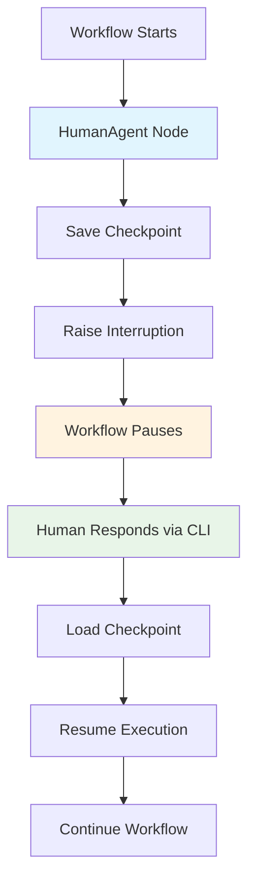

# HumanAgent

The `HumanAgent` enables powerful human-in-the-loop workflows by pausing execution at designated points and waiting for human input before continuing. This agent is essential for approval workflows, manual data entry, quality reviews, and any process requiring human judgment or intervention.

:::info Related Documentation
- [Agent Development Contract](../guides/development/agents/agent-development-contract) - Agent interface requirements and patterns
- [Advanced Agent Types](../guides/development/agents/advanced-agent-types) - Context configuration reference
- [Reference: Agent Types](../reference/agent-types) - Built-in agent types and basic usage
:::

## Key Features

- **Workflow Interruption**: Pauses execution at designated nodes for human input
- **Persistent State Management**: Automatically saves workflow state using checkpoints
- **Multiple Interaction Types**: Supports text input, approval, choice selection, editing, and conversation modes
- **CLI Resume Functionality**: Resume interrupted workflows from command line
- **Timeout Handling**: Optional timeout with configurable default actions
- **Flexible Data Integration**: Seamlessly integrates human responses into workflow state

## How It Works



The HumanAgent operates by:

1. **Interrupting Execution**: When reached, the agent raises an `ExecutionInterruptedException`
2. **Saving State**: Creates a checkpoint with current workflow state and interaction request
3. **Waiting for Response**: Workflow pauses until human provides response via CLI
4. **Resuming Execution**: CLI resume command loads checkpoint and continues workflow with human input

## Basic Usage

### CSV Configuration

```csv title="Basic HumanAgent Workflow"
GraphName,Node,AgentType,Prompt,Context,Edge,Input_Fields,Output_Field
approval_flow,start,default,Initialize workflow,,human_review,data,processed_data
approval_flow,human_review,human,Please review: {processed_data},,completion,processed_data,approval_decision
approval_flow,completion,default,Workflow complete,,,,approval_decision,final_result
```

### Resume with CLI

When the workflow hits the `human_review` node, it will pause and display information about the interruption. Resume using:

```bash title="Basic Resume Command"
agentmap resume <thread_id> approve
```

## Interaction Types

The HumanAgent supports five distinct interaction types, each designed for specific use cases:

### 1. Text Input (Default)

For collecting free-form text responses from users.

```csv title="Text Input Configuration"
GraphName,Node,AgentType,Prompt,Context,Edge,Input_Fields,Output_Field
survey_flow,collect_feedback,human,Please provide your feedback: {topic},,next,topic,user_feedback
```

**CLI Resume:**
```bash
agentmap resume thread-123 respond --data '{"feedback": "This feature works great!"}'
```

### 2. Approval

For yes/no or approve/reject decisions.

```csv title="Approval Workflow"
GraphName,Node,AgentType,Prompt,Context,Edge,Input_Fields,Output_Field
approval_flow,review_action,human,Approve deletion of user {user_id}?,"{\"interaction_type\": \"approval\", \"options\": [\"approve\", \"reject\"]}",next,user_id,approval_status
```

**CLI Resume:**
```bash
# Approve the action
agentmap resume thread-456 approve

# Reject the action  
agentmap resume thread-456 reject
```

### 3. Choice Selection

For selecting from multiple predefined options.

```csv title="Choice Selection"
GraphName,Node,AgentType,Prompt,Context,Edge,Input_Fields,Output_Field
routing_flow,select_priority,human,Choose priority level for {task_name},"{\"interaction_type\": \"choice\", \"options\": [\"low\", \"medium\", \"high\", \"urgent\"]}",process,task_name,priority_level
```

**CLI Resume:**
```bash
agentmap resume thread-789 choose --data '{"choice": "high"}'
```

### 4. Edit

For reviewing and modifying existing content.

```csv title="Content Editing"
GraphName,Node,AgentType,Prompt,Context,Edge,Input_Fields,Output_Field
content_flow,review_content,human,Edit this content: {draft_content},"{\"interaction_type\": \"edit\"}",finalize,draft_content,final_content
```

**CLI Resume:**
```bash
agentmap resume thread-101 edit --data-file edited_content.json
```

**edited_content.json:**
```json
{
  "content": "This is the revised content after human review.",
  "changes": ["Fixed typos", "Improved clarity", "Added examples"],
  "approved": true
}
```

### 5. Conversation

For multi-turn conversational interactions.

```csv title="Conversational Flow"
GraphName,Node,AgentType,Prompt,Context,Edge,Input_Fields,Output_Field
chat_flow,human_chat,human,Continue the conversation: {conversation_history},"{\"interaction_type\": \"conversation\"}",next,conversation_history,human_response
```

**CLI Resume:**
```bash
agentmap resume thread-202 respond --data '{"message": "I need more information about pricing options."}'
```

## Configuration Options

### Context Parameters

Configure HumanAgent behavior through the Context field:

```json title="Complete Configuration Example"
{
  "interaction_type": "approval",
  "options": ["approve", "reject", "needs_review"],
  "timeout_seconds": 3600,
  "default_action": "needs_review",
  "description": "Review critical system changes"
}
```

**Configuration Parameters:**

| Parameter | Description | Default | Options |
|-----------|-------------|---------|----------|
| `interaction_type` | Type of interaction | `"text_input"` | `"text_input"`, `"approval"`, `"choice"`, `"edit"`, `"conversation"` |
| `options` | Available choices for choice/approval types | `[]` | Array of strings |
| `timeout_seconds` | Time limit for response | `None` | Integer (seconds) |
| `default_action` | Action if timeout occurs | `None` | String |
| `description` | Node description for documentation | `""` | String |

### Advanced Configuration Examples

**Timeout with Default Action:**
```csv title="Timeout Configuration"
GraphName,Node,AgentType,Prompt,Context,Edge,Input_Fields,Output_Field
urgent_flow,emergency_approval,human,Emergency action needed: {emergency_details},"{\"interaction_type\": \"approval\", \"timeout_seconds\": 300, \"default_action\": \"approve\", \"options\": [\"approve\", \"reject\"]}",execute,emergency_details,emergency_decision
```

**Multi-option Choice:**
```csv title="Multi-option Choice"
GraphName,Node,AgentType,Prompt,Context,Edge,Input_Fields,Output_Field
assignment_flow,assign_reviewer,human,Select reviewer for {document_type},"{\"interaction_type\": \"choice\", \"options\": [\"senior_engineer\", \"security_expert\", \"product_manager\", \"external_consultant\"]}",notify,document_type,assigned_reviewer
```

## CLI Resume Command

### Basic Syntax

```bash
agentmap resume <thread_id> <action> [options]
```

**Parameters:**
- `thread_id`: Unique identifier for the interrupted workflow
- `action`: Response action (approve, reject, choose, respond, edit, etc.)
- `--data`: JSON string with additional data
- `--data-file`: Path to JSON file containing response data
- `--config`: Custom configuration file path

### Resume Examples

**Simple Approval:**
```bash
agentmap resume workflow-123 approve
```

**Text Response with Data:**
```bash
agentmap resume workflow-456 respond --data '{"comment": "Looks good, proceed with deployment"}'
```

**Choice Selection:**
```bash
agentmap resume workflow-789 choose --data '{"selection": 2, "reasoning": "Best option for current requirements"}'
```

**Complex Data from File:**
```bash
agentmap resume workflow-101 edit --data-file review_results.json
```

**review_results.json:**
```json
{
  "edited_content": "Revised documentation content...",
  "changes_made": [
    "Updated API endpoints",
    "Added authentication examples", 
    "Fixed formatting issues"
  ],
  "reviewer_notes": "Ready for publication",
  "status": "approved"
}
```

## Workflow Patterns

### 1. Sequential Approval Chain

Multiple human nodes for step-by-step approvals:

```csv title="Sequential Approval Workflow"
GraphName,Node,AgentType,Prompt,Context,Edge,Input_Fields,Output_Field
approval_chain,submit_request,default,Initialize approval request,,technical_review,request_data,prepared_request
approval_chain,technical_review,human,Technical review for {prepared_request},"{\"interaction_type\": \"approval\", \"options\": [\"approve\", \"reject\", \"needs_changes\"]}",security_review,prepared_request,technical_approval
approval_chain,security_review,human,Security review for {prepared_request},"{\"interaction_type\": \"approval\", \"options\": [\"approve\", \"reject\", \"needs_security_review\"]}",final_approval,prepared_request,security_approval
approval_chain,final_approval,human,Final approval for {prepared_request},"{\"interaction_type\": \"approval\", \"options\": [\"approve\", \"reject\"]}",execute,prepared_request,final_decision
approval_chain,execute,default,Execute approved request,,,,final_decision,execution_result
```

### 2. Parallel Review Process

Multiple reviewers working simultaneously:

```csv title="Parallel Review Workflow"
GraphName,Node,AgentType,Prompt,Context,Edge,Input_Fields,Output_Field
parallel_review,start,default,Distribute for review,,reviewer_1,document,review_copy
parallel_review,reviewer_1,human,Review section A: {review_copy},"{\"interaction_type\": \"edit\"}",consolidate,review_copy,review_1
parallel_review,reviewer_2,human,Review section B: {review_copy},"{\"interaction_type\": \"edit\"}",consolidate,review_copy,review_2
parallel_review,reviewer_3,human,Review section C: {review_copy},"{\"interaction_type\": \"edit\"}",consolidate,review_copy,review_3
parallel_review,consolidate,summary,Consolidate all reviews,,final_review,review_1|review_2|review_3,consolidated_review
parallel_review,final_review,human,Final review of consolidated changes,"{\"interaction_type\": \"approval\"}",complete,consolidated_review,final_approval
parallel_review,complete,default,Review process complete,,,,final_approval,completed_document
```

### 3. Content Creation Pipeline

Human-guided content creation with multiple touchpoints:

```csv title="Content Creation Pipeline"
GraphName,Node,AgentType,Prompt,Context,Edge,Input_Fields,Output_Field
content_pipeline,draft_outline,human,Create content outline for {topic},"{\"interaction_type\": \"text_input\"}",write_draft,topic,content_outline
content_pipeline,write_draft,llm,Write first draft based on outline: {content_outline},,human_review,content_outline,first_draft
content_pipeline,human_review,human,Review and edit draft: {first_draft},"{\"interaction_type\": \"edit\"}",final_polish,first_draft,reviewed_draft
content_pipeline,final_polish,llm,Apply final polish to content: {reviewed_draft},,quality_check,reviewed_draft,polished_content
content_pipeline,quality_check,human,Final quality check: {polished_content},"{\"interaction_type\": \"approval\", \"options\": [\"approve\", \"needs_revision\"]}",publish,polished_content,quality_approval
content_pipeline,publish,default,Publish approved content,,,,quality_approval,publication_result
```

### 4. Error Handling and Escalation

Human intervention for error resolution:

```csv title="Error Handling Workflow"
GraphName,Node,AgentType,Prompt,Context,Edge,Input_Fields,Output_Field
error_handling,automated_process,default,Run automated process,,error_check,input_data,process_result
error_handling,error_check,default,Check for errors in result,,human_intervention,process_result,error_status
error_handling,human_intervention,human,Error detected: {error_status}. Choose action:,"{\"interaction_type\": \"choice\", \"options\": [\"retry\", \"manual_fix\", \"escalate\", \"abort\"]}",action_handler,error_status,intervention_choice
error_handling,action_handler,default,Execute chosen intervention,,final_result,intervention_choice,action_result
error_handling,final_result,default,Process complete,,,,action_result,final_output
```

## Best Practices

### 1. Clear and Actionable Prompts

**Good:**
```csv
approval_flow,security_review,human,Review security implications of API endpoint {endpoint_name}. Check authentication and authorization.,"{\"interaction_type\": \"approval\"}",next,endpoint_name,security_approval
```

**Avoid:**
```csv
approval_flow,check_stuff,human,Look at this thing,"{\"interaction_type\": \"approval\"}",next,thing,result
```

### 2. Meaningful Context Information

Provide context that helps humans make informed decisions:

```csv title="Rich Context Example"
GraphName,Node,AgentType,Prompt,Context,Edge,Input_Fields,Output_Field
deployment_flow,deployment_approval,human,Approve deployment to {environment}? Changes: {change_summary}. Risk level: {risk_level}.,"{\"interaction_type\": \"approval\", \"options\": [\"approve\", \"reject\", \"request_changes\"]}",deploy,environment|change_summary|risk_level,deployment_decision
```

### 3. Appropriate Timeout Values

Set reasonable timeouts based on the urgency and complexity of the decision:

```json title="Timeout Guidelines"
{
  "urgent_decisions": "300-600 seconds (5-10 minutes)",
  "routine_approvals": "3600-7200 seconds (1-2 hours)", 
  "complex_reviews": "86400 seconds (24 hours)",
  "non_urgent_tasks": "604800 seconds (1 week)"
}
```

### 4. Comprehensive Options

For choice-type interactions, provide clear, comprehensive options:

```csv title="Clear Options Example"
GraphName,Node,AgentType,Prompt,Context,Edge,Input_Fields,Output_Field
incident_response,severity_assessment,human,Assess incident severity for {incident_description},"{\"interaction_type\": \"choice\", \"options\": [\"low_minor_impact\", \"medium_some_users_affected\", \"high_significant_impact\", \"critical_service_down\"]}",response_plan,incident_description,severity_level
```

### 5. State Preservation

Ensure all necessary context is captured in input fields:

```csv title="Complete State Capture"
GraphName,Node,AgentType,Prompt,Context,Edge,Input_Fields,Output_Field
review_flow,comprehensive_review,human,Review request {request_id}: {request_details} from {user_name} at {timestamp},"{\"interaction_type\": \"approval\"}",decision,request_id|request_details|user_name|timestamp,review_decision
```

## Troubleshooting

### Common Issues

**1. Thread ID Not Found**
```bash
❌ Error: Thread 'invalid-thread-id' not found in storage
```
**Solution:** Verify the thread ID from the interruption message and ensure checkpoints are properly saved.

**2. Invalid JSON Data**
```bash
❌ Invalid JSON in --data: Expecting property name enclosed in double quotes
```
**Solution:** Ensure JSON is properly formatted:
```bash
# Correct
agentmap resume thread-123 respond --data '{"key": "value"}'

# Incorrect
agentmap resume thread-123 respond --data '{key: value}'
```

**3. Storage Service Not Available**
```bash
❌ Storage services are not available. Please check your configuration.
```
**Solution:** Verify storage configuration in your `agentmap_config.yaml`:
```yaml
storage_services:
  - type: "json"
    config:
      storage_dir: "storage"
```

**4. Checkpoint Save Failures**
```bash
⚠️ Failed to save checkpoint: Storage error
```
**Solution:** Check storage directory permissions and available disk space.

### Debugging Tips

**1. Enable Debug Logging**
```yaml title="agentmap_config.yaml"
logging:
  level: "DEBUG"
  enable_agent_logging: true
```

**2. Verify Checkpoint Existence**
Check storage directory for checkpoint files:
```bash
ls -la storage/graph_checkpoints/
```

**3. Test Resume Command**
Use a simple approval first to verify CLI functionality:
```bash
agentmap resume test-thread approve
```

**4. Validate JSON Data**
Use a JSON validator before complex data submissions:
```bash
echo '{"key": "value"}' | python -m json.tool
```

### Error Recovery

**1. Missing Checkpoints**
If checkpoints are lost, restart the workflow from the beginning:
```bash
agentmap run --graph workflow_name --state '{"initial": "data"}'
```

**2. Corrupted State**
Clear corrupted checkpoints and restart:
```bash
rm storage/graph_checkpoints/corrupted-thread-*
agentmap run --graph workflow_name
```

**3. Timeout Handling**
For workflows with timeouts, ensure default actions are meaningful:
```json
{
  "timeout_seconds": 3600,
  "default_action": "escalate_to_manager"
}
```

## Integration with Other Agents

### With LLM Agents

Combine human oversight with AI processing:

```csv title="Human-AI Collaboration"
GraphName,Node,AgentType,Prompt,Context,Edge,Input_Fields,Output_Field
hybrid_flow,ai_analysis,llm,Analyze this data: {raw_data},,human_review,raw_data,ai_analysis
hybrid_flow,human_review,human,Review AI analysis: {ai_analysis}. Approve or provide corrections?,"{\"interaction_type\": \"edit\"}",final_processing,ai_analysis,verified_analysis
hybrid_flow,final_processing,default,Process verified analysis,,,,verified_analysis,final_result
```

### With Storage Agents

Persist human decisions for audit trails:

```csv title="Audit Trail Workflow"
GraphName,Node,AgentType,Prompt,Context,Edge,Input_Fields,Output_Field
audit_flow,decision_point,human,Make critical decision for {case_id},"{\"interaction_type\": \"choice\", \"options\": [\"approve\", \"reject\", \"defer\"]}",log_decision,case_id,human_decision
audit_flow,log_decision,json_writer,Log decision to audit trail,,complete,human_decision|case_id,audit_record
audit_flow,complete,default,Decision logged and executed,,,,audit_record,completion_status
```

### With GraphAgent

Create reusable human interaction subgraphs:

```csv title="Reusable Human Interaction"
GraphName,Node,AgentType,Prompt,Context,Edge,Input_Fields,Output_Field
main_flow,process_data,default,Process incoming data,,approval_subgraph,data,processed_data
main_flow,approval_subgraph,graph,Standard approval process,,finalize,processed_data,approval_result
main_flow,finalize,default,Complete processing,,,,approval_result,final_output

approval_subgraph,review,human,Review: {input_data},"{\"interaction_type\": \"approval\"}",approve_action,input_data,review_decision
approval_subgraph,approve_action,default,Execute approval action,,,,review_decision,approval_result
```

## Performance Considerations

### Checkpoint Storage

- **Use appropriate storage backends** for your scale (JSON for development, database for production)
- **Implement cleanup policies** for old checkpoints
- **Monitor storage usage** to prevent disk space issues

### Timeout Management

- **Set realistic timeouts** based on business requirements
- **Implement escalation paths** for critical timeouts
- **Log timeout events** for process improvement

### Concurrent Workflows

- **Design for multiple interrupted workflows** running simultaneously
- **Use unique thread IDs** to prevent conflicts
- **Implement proper locking** if using shared storage

The HumanAgent provides essential human-in-the-loop capabilities that enable AgentMap workflows to seamlessly integrate human judgment, oversight, and intervention where automated processing alone is insufficient. By following the patterns and best practices outlined in this guide, you can build robust, interactive workflows that combine the efficiency of automation with the insight and decision-making capabilities of human operators.
