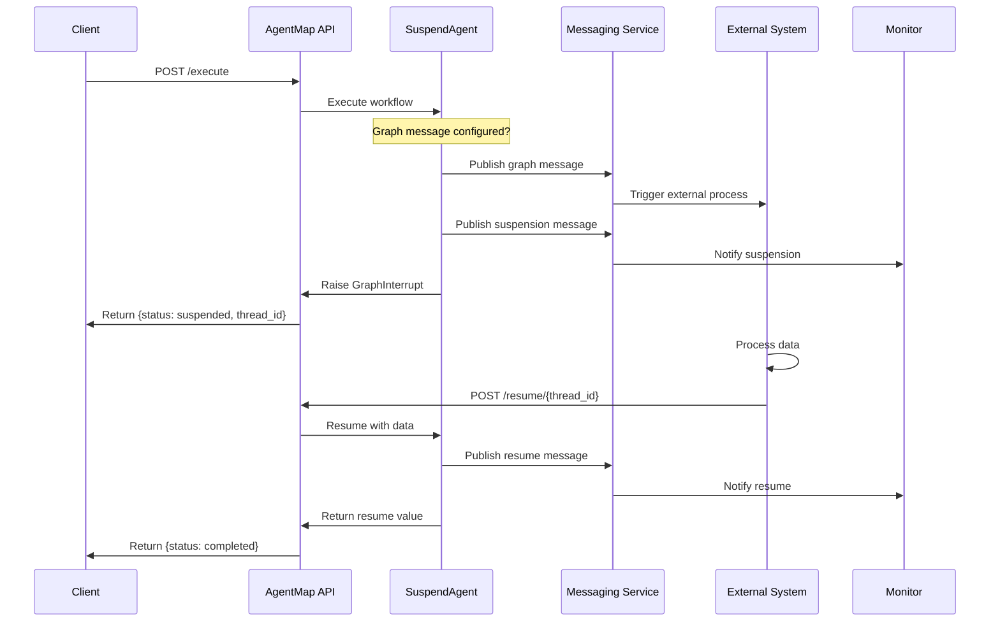

# SuspendAgent Messaging Features

The `SuspendAgent` provides powerful messaging capabilities that enable event-driven workflows, real-time monitoring, and seamless integration with external systems. These features transform workflows from polling-based to push-based notification models, enabling serverless architectures and proactive workflow management.

## Overview

SuspendAgent messaging features enable:

- **Suspension Notifications**: Publish messages when workflows suspend, enabling push-based monitoring instead of polling
- **Resume Notifications**: Publish messages when workflows resume, providing complete lifecycle visibility
- **Graph Messages**: Trigger external processes (like serverless functions) at suspension points
- **Raw Return Values**: Return resume values directly without wrapper structures for cleaner downstream processing
- **Backward Compatibility**: All features are opt-in; existing workflows continue working unchanged

## Key Benefits

### Event-Driven Architecture
- **Push vs. Poll**: Receive instant notifications instead of polling for suspended workflows
- **Serverless Integration**: Trigger Lambda functions, Azure Functions, or Cloud Functions when workflows suspend
- **Webhook Support**: Integrate with webhooks, message queues, and notification services

### Observability
- **Real-Time Monitoring**: Track workflow suspensions and resumes in real-time
- **Audit Trails**: Complete lifecycle tracking for compliance and debugging
- **Performance Metrics**: Measure suspension durations and identify bottlenecks

### Developer Experience
- **Cleaner Code**: Eliminate boilerplate unwrapping code for resume values
- **Flexible Integration**: Configure messaging through CSV context without code changes
- **Error Resilience**: Messaging failures don't prevent workflow execution

## Three-Template Messaging Architecture

SuspendAgent supports **three distinct message types**, each designed for a specific use case:

1. **Graph Trigger Messages** (`default_graph_trigger`) - Trigger another AgentMap graph via serverless
2. **Node Suspend Messages** (`default_node_suspend`) - Trigger external process/service for out-of-band processing
3. **Auto-Resume Messages** (`default_auto_resume`) - Serverless function auto-resumes parent workflow

Each message type has a distinct payload structure and serverless consumption pattern. See [Configuration Reference](#configuration-reference) for details on enabling each type.

## Core Features

### 1. Suspension Messages (Node Suspend Pattern)

Published when a workflow suspends, providing visibility into when and why workflows pause execution. This message type is designed for **external processing** and uses the `inputs` field (not renamed to `state`).

**When to Use:**
- Monitor all suspended workflows in real-time dashboards
- Alert operations teams when workflows suspend unexpectedly
- Track suspension patterns for performance optimization
- Integrate with monitoring tools (Datadog, CloudWatch, Application Insights)

**Message Payload:**
```json
{
  "event_type": "workflow_suspended",
  "thread_id": "3a1a9c33-f219-4eb9-af75-8ad7e5831bf0",
  "node_name": "wait_approval",
  "workflow": "customer_service",
  "graph": "approval_flow",
  "timestamp": "2025-10-17T14:30:00.123456Z",
  "inputs": {
    "request_id": "REQ-12345",
    "amount": 50000
  },
  "context": {
    "correlation_id": "corr-abc123",
    "department": "finance"
  }
}
```

### 2. Resume Messages (Auto-Resume Pattern)

Published when a workflow resumes, completing the observability loop and enabling downstream processes to react to workflow continuation. This message type includes `action: "resume"` field to enable **serverless auto-resume** functionality.

**When to Use:**
- Track complete workflow lifecycle from start to finish
- Measure suspension durations for SLA monitoring
- Trigger post-approval processes automatically
- Log approval decisions for audit compliance

**Message Payload:**
```json
{
  "event_type": "workflow_resumed",
  "action": "resume",
  "thread_id": "3a1a9c33-f219-4eb9-af75-8ad7e5831bf0",
  "resume_value": {
    "action": "approve",
    "approved_by": "manager@company.com",
    "comments": "Verified with customer"
  },
  "node_name": "wait_approval",
  "workflow": "customer_service",
  "graph": "approval_flow",
  "timestamp": "2025-10-17T14:35:00.654321Z",
  "suspension_duration_seconds": 300.53,
  "context": {
    "correlation_id": "corr-abc123"
  }
}
```

**Serverless Auto-Resume:** The `action: "resume"` field tells the serverless handler to automatically resume the workflow with the `resume_value`. See [Serverless Resume Support](#serverless-resume-support) for implementation details.

### 3. Graph Messages (Graph Trigger Pattern)

Published before suspension to trigger **another AgentMap graph** via serverless, ideal for sub-workflow patterns and distributed execution. This message type uses the `state` field (renamed from `inputs`) for serverless handler compatibility.

**When to Use:**
- Launch serverless functions to process data while workflow is suspended
- Trigger external approval systems or notification services
- Start background jobs that will eventually resume the workflow
- Integrate with event buses (Azure Service Bus, AWS EventBridge, Google Pub/Sub)

**Message Payload:**
```json
{
  "event_type": "workflow_graph_trigger",
  "graph": "batch_processing",
  "state": {
    "batch_id": "BATCH-789",
    "dataset_path": "s3://bucket/data.csv"
  },
  "thread_id": "3a1a9c33-f219-4eb9-af75-8ad7e5831bf0",
  "node_name": "process_batch",
  "workflow": "data_pipeline",
  "timestamp": "2025-10-17T14:30:00.123456Z",
  "context": {
    "processing_mode": "async",
    "priority": "high"
  }
}
```

**Serverless Consumption:** The serverless handler uses the `graph` field to determine which graph to execute and `state` field as inputs. This enables sub-workflow patterns where one graph triggers another.

### 4. Raw Return Values

SuspendAgent now returns resume values directly without wrapping them in a dictionary structure, eliminating boilerplate unwrapping code in downstream nodes.

**Before (Wrapped):**
```python
# Old behavior - resume value wrapped
{
  "resume_value": {"transaction_id": "TXN-123", "status": "approved"},
  "node_name": "approval_node"
}

# Downstream node had to unwrap:
transaction_data = inputs["approval_result"]["resume_value"]
```

**Now (Raw):**
```python
# New behavior - resume value returned directly
{"transaction_id": "TXN-123", "status": "approved"}

# Downstream node uses directly:
transaction_data = inputs["approval_result"]
```

## Configuration Reference

All messaging features are configured through the `context` field in your workflow CSV. Configuration is opt-in; features are only enabled when explicitly configured.

### Context Configuration Options

| Parameter | Type | Description | Default |
|-----------|------|-------------|---------|
| `send_suspend_message` | flag | Enable suspension message publishing | Not enabled |
| `send_resume_message` | flag | Enable resume message publishing | Not enabled |
| `send_graph_message` | flag | Enable graph message publishing | Not enabled |
| `suspend_message_template` | string | Template name for suspension messages | `"default_suspend"` |
| `resume_message_template` | string | Template name for resume messages | `"default_resume"` |
| `graph_message_template` | string | Template name for graph messages | `"default_graph"` |
| `suspend_message_topic` | string | Topic/queue for suspension messages | `"workflow_events"` |
| `resume_message_topic` | string | Topic/queue for resume messages | `"workflow_events"` |
| `graph_message_topic` | string | Topic/queue for graph messages | `"workflow_events"` |

**Note:** In the CSV, the presence of a flag (like `send_suspend_message`) in the context indicates it should be enabled. You do not need to set it to `true` explicitly.

### Message Templates

Message templates are configured in your `config.yaml` using Python `string.Template` syntax with `$variable` placeholders:

```yaml
messaging:
  message_templates:
    # Graph Trigger Template - Used to trigger another AgentMap graph
    default_graph_trigger:
      event_type: "$event_type"
      graph: "$graph"  # Which graph to execute
      state: "$inputs"  # Inputs for serverless handler (renamed from inputs)
      thread_id: "$thread_id"
      node_name: "$node_name"
      workflow: "$workflow"
      timestamp: "$timestamp"
      context: "$context"

    # Node Suspend Template - Used to trigger external process/service
    default_node_suspend:
      event_type: "$event_type"
      thread_id: "$thread_id"
      node_name: "$node_name"
      workflow: "$workflow"
      graph: "$graph"
      timestamp: "$timestamp"
      inputs: "$inputs"  # NOT "state" - for external processing reference
      context: "$context"

    # Auto Resume Template - Used for serverless auto-resume triggers
    default_auto_resume:
      event_type: "$event_type"
      action: "resume"  # Tells serverless handler to resume
      thread_id: "$thread_id"
      resume_value: "$resume_value"
      node_name: "$node_name"
      workflow: "$workflow"
      graph: "$graph"
      timestamp: "$timestamp"
      suspension_duration_seconds: "$suspension_duration_seconds"
      context: "$context"
```

### Serverless Resume Support

The serverless base handler (`BaseHandler` in `agentmap.deployment.serverless`) now supports automatic resume via message brokers. This enables the **auto-resume pattern** where a message triggers workflow resumption without manual HTTP API calls.

**How It Works:**

1. SuspendAgent publishes a resume message with `action: "resume"`
2. Message broker delivers message to serverless function
3. Serverless handler detects `action == "resume"` in parsed data
4. Handler builds a resume token and calls `resume_workflow()` from runtime facade
5. Workflow resumes and completes

**Implementation** (in `base_handler.py`):

```python
async def handle_request(self, event: Dict[str, Any], context: Any = None) -> Dict[str, Any]:
    # Parse trigger using strategy pattern
    trigger_type, parsed_data = self.trigger_parser.parse(event)

    # Check for resume action (auto-resume via message)
    if parsed_data.get("action") == "resume":
        return await self._handle_resume_action(parsed_data, correlation_id)

    # ... normal execution flow

async def _handle_resume_action(
    self, parsed_data: Dict[str, Any], correlation_id: str
) -> Dict[str, Any]:
    thread_id = parsed_data.get("thread_id")
    if not thread_id:
        raise InvalidInputs("Resume action requires thread_id")

    resume_value = parsed_data.get("resume_value")

    # Build resume token for runtime facade
    resume_token = json.dumps({
        "thread_id": thread_id,
        "response_action": "continue",
        "response_data": resume_value
    })

    # Use runtime facade for resume
    result = resume_workflow(
        resume_token=resume_token,
        config_file=self.config_file
    )

    return self._format_http_response(result, correlation_id)
```

**Use Case Example:**

```csv
workflow,graph,name,agent_type,prompt,context,input_fields,output_field,edges
auto_resume_flow,main,start,input,Provide data,,user_input,input_data,
auto_resume_flow,main,process_step1,default,Process step 1,,"input_data",step1_result,start
auto_resume_flow,main,suspend_for_async,suspend,Async processing,"{""send_resume_message"": true, ""resume_message_template"": ""default_auto_resume"", ""resume_message_topic"": ""auto_resume_queue""}",step1_result,async_result,process_step1
auto_resume_flow,main,process_step2,default,Process step 2,,"async_result",final_result,suspend_for_async
auto_resume_flow,main,end,echo,Complete,,"final_result",,process_step2
```

**Message Flow:**

1. Workflow suspends at `suspend_for_async` node
2. Resume message published to `auto_resume_queue`:
   ```json
   {
     "action": "resume",
     "thread_id": "...",
     "resume_value": {"status": "complete", "data": "..."}
   }
   ```
3. Serverless function consumes message and automatically resumes workflow
4. Workflow continues to `process_step2` and completes

## Usage Examples

### Example 1: Basic Suspension with Messaging

Enable suspension and resume messages for workflow monitoring:

```csv title="Basic Messaging Workflow"
workflow,graph,name,agent_type,prompt,context,input_fields,output_field,edges
monitoring_flow,main,start,input,Provide request data,,user_input,request_data,
monitoring_flow,main,suspend_point,suspend,Waiting for external process,"{""send_suspend_message"": true, ""send_resume_message"": true}",request_data,process_result,start
monitoring_flow,main,complete,echo,Request completed,,"process_result",final_output,suspend_point
```

**What happens:**
1. Workflow executes and reaches `suspend_point`
2. Suspension message published to `workflow_events` topic
3. Workflow pauses, checkpoint saved
4. External process resumes workflow via HTTP API
5. Resume message published with suspension duration
6. Workflow continues to `complete` node

**Monitoring Integration:**
```python
# Example: Consume messages for monitoring
def handle_suspension_message(message):
    """Alert when workflow suspends"""
    alert_operations_team(
        workflow=message['workflow'],
        thread_id=message['thread_id'],
        timestamp=message['timestamp']
    )

def handle_resume_message(message):
    """Track suspension duration"""
    duration = message['suspension_duration_seconds']
    metrics.record('workflow.suspension.duration', duration)

    if duration > 300:  # > 5 minutes
        log_sla_breach(message['thread_id'], duration)
```

### Example 2: Custom Topics and Templates

Use custom message templates and topics for different workflow types:

```csv title="Custom Messaging Configuration"
workflow,graph,name,agent_type,prompt,context,input_fields,output_field,edges
approval_flow,main,start,input,Enter approval request,,request_input,approval_request,
approval_flow,main,wait_approval,suspend,Approval required,"{""send_suspend_message"": true, ""send_resume_message"": true, ""suspend_message_template"": ""approval_request"", ""resume_message_template"": ""approval_response"", ""suspend_message_topic"": ""approvals"", ""resume_message_topic"": ""approvals""}",approval_request,approval_decision,start
approval_flow,main,process,default,Process approval,,"approval_decision",result,wait_approval
approval_flow,main,end,echo,Complete,,"result",,process
```

**Template Configuration (config.yaml):**
```yaml
messaging:
  templates:
    approval_request:
      type: "approval_required"
      notification:
        subject: "Approval Required: {{inputs.request_type}}"
        body: "Request {{inputs.request_id}} requires approval. Amount: {{inputs.amount}}"
        recipients: "{{context.approvers}}"
      webhook_url: "https://approvals.company.com/notify"

    approval_response:
      type: "approval_completed"
      notification:
        subject: "Approval {{resume_value.action}}: {{inputs.request_type}}"
        body: "Approved by: {{resume_value.approved_by}}"
        audit_required: true
```

### Example 3: Event-Driven Serverless Workflow

Trigger serverless functions when workflow suspends:

```csv title="Serverless Integration Workflow"
workflow,graph,name,agent_type,prompt,context,input_fields,output_field,edges
batch_process,main,start,input,Batch parameters,,batch_params,validated_params,
batch_process,main,validate,default,Validate parameters,,"batch_params",validation_result,start
batch_process,main,launch_job,suspend,Launch batch processing,"{""send_graph_message"": true, ""send_resume_message"": true, ""graph_message_template"": ""batch_launcher"", ""graph_message_topic"": ""batch_jobs""}",validated_params,job_result,validate
batch_process,main,aggregate,default,Aggregate results,,"job_result",final_results,launch_job
batch_process,main,complete,echo,Job complete,,"final_results",,aggregate
```

**Serverless Function (AWS Lambda Example):**
```python
# Lambda function triggered by graph message
import boto3
import json

def lambda_handler(event, context):
    """Process batch job and resume workflow"""

    # Parse graph message
    message = json.loads(event['Records'][0]['body'])
    thread_id = message['thread_id']
    batch_params = message['inputs']['validated_params']

    # Process batch job
    results = process_batch_job(batch_params)

    # Resume workflow via HTTP API
    agentmap_api = "https://agentmap.company.com"
    response = requests.post(
        f"{agentmap_api}/resume/{thread_id}",
        json={
            "action": "complete",
            "data": {
                "job_id": results['job_id'],
                "status": "success",
                "records_processed": results['count'],
                "output_location": results['output_path']
            }
        },
        headers={"X-API-Key": os.environ['AGENTMAP_API_KEY']}
    )

    return {"statusCode": 200, "body": "Workflow resumed"}
```

**Infrastructure (Terraform):**
```hcl
# SQS queue for batch jobs
resource "aws_sqs_queue" "batch_jobs" {
  name = "agentmap-batch-jobs"
}

# Lambda function
resource "aws_lambda_function" "batch_processor" {
  function_name = "agentmap-batch-processor"
  handler       = "index.lambda_handler"
  runtime       = "python3.11"

  environment {
    variables = {
      AGENTMAP_API_KEY = var.agentmap_api_key
    }
  }
}

# SQS trigger for Lambda
resource "aws_lambda_event_source_mapping" "batch_trigger" {
  event_source_arn = aws_sqs_queue.batch_jobs.arn
  function_name    = aws_lambda_function.batch_processor.arn
  batch_size       = 1
}
```

### Example 4: Raw Return Values for API Integration

Use raw return values to simplify downstream processing:

```csv title="API Integration with Raw Values"
workflow,graph,name,agent_type,prompt,context,input_fields,output_field,edges
api_flow,main,start,input,API request data,,api_params,request_data,
api_flow,main,submit_api,default,Submit to API,,"request_data",request_id,start
api_flow,main,wait_response,suspend,Wait for API callback,,request_id,api_response,submit_api
api_flow,main,process,llm,Process API response,"{""provider"": ""anthropic""}","api_response",processed_data,wait_response
api_flow,main,end,echo,Complete,,"processed_data",,process
```

**API Callback Handler:**
```python
# External API calls this webhook when done
@app.post("/webhooks/api_callback")
async def handle_api_callback(request: Request):
    """Resume workflow with API response"""

    data = await request.json()

    # API returns complete response object
    api_response = {
        "transaction_id": data['transaction_id'],
        "status": data['status'],
        "amount": data['amount'],
        "timestamp": data['timestamp'],
        "metadata": data['metadata']
    }

    # Resume workflow - SuspendAgent returns this directly
    # No wrapper dict, downstream node gets raw response
    agentmap.resume(
        thread_id=data['thread_id'],
        action="complete",
        data=api_response
    )

    return {"status": "resumed"}
```

**Downstream LLM Agent (no unwrapping needed):**
```python
# Process node receives api_response directly
def process(self, inputs: Dict[str, Any]) -> Any:
    # Before: had to unwrap
    # api_data = inputs['api_response']['resume_value']

    # Now: use directly
    api_data = inputs['api_response']

    prompt = f"""
    Process this API response:
    Transaction: {api_data['transaction_id']}
    Status: {api_data['status']}
    Amount: ${api_data['amount']}

    Generate confirmation message for customer.
    """

    return self.llm_service.call_llm(messages=[
        {"role": "user", "content": prompt}
    ])
```

## Integration with HTTP API

Messaging features work seamlessly with the HTTP API for suspend/resume operations.

### Execute Workflow with Messaging

When you execute a workflow via HTTP API, suspension messages are published automatically:

```bash
# Execute workflow
curl -X POST "http://127.0.0.1:8000/execute/approval_flow/main" \
  -H "X-API-Key: your-api-key" \
  -H "Content-Type: application/json" \
  -d '{
    "inputs": {
      "request_id": "REQ-12345",
      "amount": 50000,
      "requester": "john@company.com"
    },
    "execution_id": "exec_001"
  }'
```

**Response:**
```json
{
  "success": false,
  "status": "suspended",
  "message": "Graph 'approval_flow::main' suspended awaiting resume",
  "thread_id": "3a1a9c33-f219-4eb9-af75-8ad7e5831bf0",
  "execution_id": "exec_001"
}
```

**Suspension message published to topic:**
```json
{
  "event_type": "workflow_suspended",
  "thread_id": "3a1a9c33-f219-4eb9-af75-8ad7e5831bf0",
  "node_name": "wait_approval",
  "workflow": "approval_flow",
  "graph": "main",
  "timestamp": "2025-10-17T14:30:00.123Z",
  "inputs": {
    "request_id": "REQ-12345",
    "amount": 50000,
    "requester": "john@company.com"
  }
}
```

### Resume Workflow with Messaging

When you resume via HTTP API, resume messages are published automatically:

```bash
# Resume workflow
curl -X POST "http://127.0.0.1:8000/resume/3a1a9c33-f219-4eb9-af75-8ad7e5831bf0" \
  -H "X-API-Key: your-api-key" \
  -H "Content-Type: application/json" \
  -d '{
    "action": "approve",
    "data": {
      "approved_by": "manager@company.com",
      "timestamp": "2025-10-17T14:35:00Z",
      "comments": "Approved after verification"
    }
  }'
```

**Response:**
```json
{
  "success": true,
  "status": "completed",
  "message": "Successfully resumed thread",
  "thread_id": "3a1a9c33-f219-4eb9-af75-8ad7e5831bf0",
  "outputs": {
    "approval_decision": {
      "action": "approve",
      "approved_by": "manager@company.com",
      "comments": "Approved after verification"
    }
  }
}
```

**Resume message published to topic:**
```json
{
  "event_type": "workflow_resumed",
  "thread_id": "3a1a9c33-f219-4eb9-af75-8ad7e5831bf0",
  "node_name": "wait_approval",
  "workflow": "approval_flow",
  "graph": "main",
  "timestamp": "2025-10-17T14:35:05.678Z",
  "resume_value": {
    "action": "approve",
    "approved_by": "manager@company.com",
    "comments": "Approved after verification"
  },
  "suspension_duration_seconds": 305.555
}
```

## Message Flow Architecture



## Error Handling

### Configuration Errors

If messaging is requested but the messaging service is not configured, the agent raises an error:

```python
# Context requests messaging but service not configured
ValueError: Messaging service required but not configured for agent 'wait_approval'
```

**Solution:** Configure messaging service in your `config.yaml`:

```yaml
messaging:
  enabled: true
  provider: "azure_service_bus"  # or aws_sqs, google_pubsub, etc.
  connection_string: "${MESSAGING_CONNECTION_STRING}"
```

### Messaging Failures

If message publishing fails (network error, service unavailable, etc.), the error is logged but the workflow continues:

```
[ERROR] Failed to publish suspension message: ConnectionError: Unable to reach messaging service
[INFO] [SuspendAgent] wait_approval suspending execution
```

**The workflow still suspends successfully**. Messaging is an observability enhancement, not a critical dependency.

### Graceful Degradation

```python
# SuspendAgent handles messaging failures gracefully
def _publish_suspension_message(self, thread_id: str, inputs: Dict[str, Any]) -> None:
    try:
        # Attempt to publish message
        self._messaging_service.publish_message(...)
        self.log_info("Published suspension message")
    except Exception as e:
        # Log error but don't raise - workflow execution continues
        self.log_error(f"Failed to publish suspension message: {e}")
        # Workflow will still suspend correctly
```

## Backward Compatibility

All messaging features are **fully backward compatible** with existing workflows:

### Existing Workflows

Workflows without messaging configuration continue to work exactly as before:

```csv
# Old workflow - no messaging, still works
workflow,graph,name,agent_type,prompt,context,input_fields,output_field,edges
old_flow,main,suspend_node,suspend,Wait for callback,,request_id,response,start
```

**Behavior:** Suspends and resumes normally, no messages published.

### Migration Path

To adopt messaging features, simply add context configuration:

```csv
# Updated workflow - messaging enabled
workflow,graph,name,agent_type,prompt,context,input_fields,output_field,edges
old_flow,main,suspend_node,suspend,Wait for callback,"{""send_suspend_message"": true, ""send_resume_message"": true}",request_id,response,start
```

**No code changes required**. Configuration is declarative via CSV.

### Return Value Compatibility

Return values are now always raw (not wrapped), which is cleaner for new workflows and requires minimal changes for existing ones:

**If downstream nodes expect wrapped structure:**
```python
# Old downstream node expecting wrapper
result = inputs['suspension_result']['resume_value']

# Update to use raw value
result = inputs['suspension_result']
```

**HumanAgent Compatibility:**

HumanAgent extends SuspendAgent and continues to work with all messaging features:

```csv
# HumanAgent inherits messaging capabilities
workflow,graph,name,agent_type,prompt,context,input_fields,output_field,edges
human_flow,main,approval,human,Approve request?,"{""interaction_type"": ""approval"", ""send_suspend_message"": true, ""send_resume_message"": true}",request_data,approval_result,start
```

## Troubleshooting

### Issue: Messages Not Published

**Symptoms:**
- Workflow suspends but no messages appear in topic/queue
- No errors in logs

**Solutions:**

1. **Verify messaging service is configured:**
```yaml
# config.yaml
messaging:
  enabled: true
  provider: "azure_service_bus"
```

2. **Check context configuration:**
```csv
# Ensure flags are present in context
context,"{""send_suspend_message"": true}"
```

3. **Verify topic/queue exists:**
```bash
# Azure Service Bus
az servicebus topic show --name workflow_events --namespace-name your-namespace

# AWS SQS
aws sqs get-queue-url --queue-name workflow_events
```

4. **Enable debug logging:**
```yaml
logging:
  level: "DEBUG"
  enable_agent_logging: true
```

### Issue: ValueError - Messaging Service Not Configured

**Symptoms:**
```
ValueError: Messaging service required but not configured for agent 'wait_approval'
```

**Cause:** Context requests messaging but service is not configured in config.yaml

**Solution:** Configure messaging service:

```yaml
# config.yaml
messaging:
  enabled: true
  provider: "your_provider"
  connection_string: "${MESSAGING_CONNECTION_STRING}"

  # Optional: Default topics
  default_topic: "workflow_events"
```

### Issue: Message Template Not Found

**Symptoms:**
```
[WARNING] Template 'custom_template' not found, using default template
```

**Cause:** Custom template specified in context but not defined in config.yaml

**Solution:** Define the template:

```yaml
messaging:
  templates:
    custom_template:
      type: "custom_event"
      fields:
        - thread_id
        - node_name
        - custom_field: "{{inputs.my_field}}"
```

### Issue: Downstream Nodes Fail After Upgrade

**Symptoms:**
- Downstream nodes expecting wrapped resume values fail
- KeyError: 'resume_value'

**Cause:** Downstream nodes expect old wrapped format

**Solution:** Update downstream nodes to use raw values:

```python
# Before
result = inputs['field_name']['resume_value']
data = inputs['field_name']['node_name']

# After
result = inputs['field_name']
# node_name no longer available (use logging if needed)
```

### Issue: Duplicate Messages

**Symptoms:**
- Multiple messages published for single suspension
- Message consumers processing duplicates

**Cause:** Async message publishing may retry on transient failures

**Solution:** Implement idempotent message handling:

```python
# Message consumer with idempotency
processed_threads = set()

def handle_message(message):
    thread_id = message['thread_id']

    # Check if already processed
    if thread_id in processed_threads:
        logger.info(f"Duplicate message for {thread_id}, skipping")
        return

    # Process message
    process_suspension(message)

    # Mark as processed
    processed_threads.add(thread_id)
```

## Best Practices

### 1. Use Appropriate Message Types

- **Suspension messages**: For monitoring, alerting, and audit trails
- **Resume messages**: For post-processing, metrics, and notifications
- **Graph messages**: For triggering external processes and serverless functions

### 2. Configure Custom Topics

Use separate topics for different workflow types:

```csv
# Production approvals - high priority topic
context,"{""send_suspend_message"": true, ""suspend_message_topic"": ""prod_approvals""}"

# Development workflows - low priority topic
context,"{""send_suspend_message"": true, ""suspend_message_topic"": ""dev_events""}"
```

### 3. Implement Idempotent Consumers

Always design message consumers to handle duplicates:

```python
def process_message(message):
    # Use unique identifier
    message_id = f"{message['thread_id']}_{message['timestamp']}"

    # Check if processed
    if is_processed(message_id):
        return

    # Process and mark complete
    handle_event(message)
    mark_processed(message_id)
```

### 4. Monitor Message Lag

Track time between suspension and message delivery:

```python
def handle_suspension_message(message):
    suspend_time = datetime.fromisoformat(message['timestamp'])
    receive_time = datetime.utcnow()
    lag = (receive_time - suspend_time).total_seconds()

    metrics.record('messaging.lag_seconds', lag)

    if lag > 5:  # Alert if lag > 5 seconds
        alert_ops_team(f"High messaging lag: {lag}s")
```

### 5. Secure Sensitive Data

Avoid including sensitive information in message payloads:

```yaml
# Use custom template to exclude sensitive fields
messaging:
  templates:
    secure_approval:
      type: "approval_required"
      fields:
        - thread_id
        - node_name
        - request_id: "{{inputs.request_id}}"
        # Exclude: password, api_key, ssn, etc.
```

### 6. Test Messaging Failures

Ensure workflows handle messaging failures gracefully:

```python
# Integration test
def test_suspend_with_messaging_failure():
    """Verify workflow suspends even if messaging fails"""

    # Simulate messaging service failure
    mock_messaging_service.publish_message.side_effect = Exception("Service unavailable")

    # Execute workflow
    result = agentmap.execute("test_workflow", "main", {"input": "data"})

    # Workflow should still suspend successfully
    assert result['status'] == 'suspended'
    assert result['thread_id'] is not None
```

## Performance Considerations

### Message Publishing Latency

Messaging operations are designed to add minimal latency:

- **Asynchronous publishing**: Messages published via `asyncio.create_task()`, non-blocking
- **Target latency**: < 50ms p99 for message publishing
- **Workflow impact**: Messaging does not delay suspension or resume

### Throughput

For high-throughput workflows:

- Configure message batching in messaging service
- Use appropriate message queue scaling
- Monitor queue depth and consumer lag

### Storage

Message payloads are not stored by AgentMap:

- Messages published to configured messaging service only
- Use external message broker for persistence and replay
- Configure retention policies in messaging service

## Next Steps

- **[HumanAgent Guide](./human_agent)**: Build human-in-the-loop workflows with messaging
- **[HTTP API Reference](../deployment/06-http-api-reference)**: API endpoints for suspend/resume
- **[Deployment Patterns](../deployment)**: Deploy AgentMap with messaging services
- **[Custom Agents](./custom-agents)**: Build custom agents with messaging capabilities

---

**Quick Links:**
- [Built-in Agents Overview](./built-in-agents) | [Custom Agent Development](./custom-agents)
- [HTTP API Integration](../deployment/06-http-api-reference) | [Configuration Reference](../deployment/configuration)
