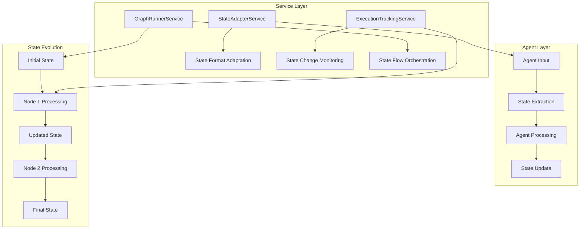
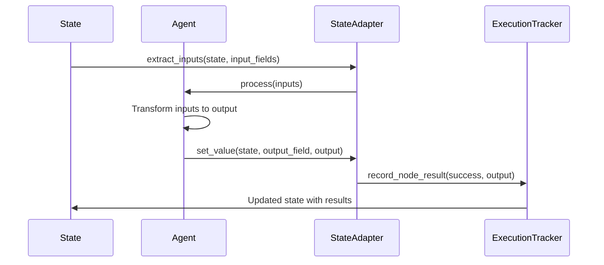

# State Management & Data Flow

AgentMap uses a service-based architecture for state management, with the StateAdapterService handling different state formats and the ExecutionTrackingService monitoring state evolution through the workflow.

## State Management Architecture

### Clean Architecture Approach

State management is handled by specialized services following clean architecture principles:



### Core Services

1. **StateAdapterService**: Adapts between different state formats
2. **ExecutionTrackingService**: Tracks state changes during execution
3. **GraphRunnerService**: Orchestrates state flow through the graph

## State Structure & Evolution

The state is typically a dictionary that contains:

- **Input fields** from the initial state
- **Output fields** from each node's execution
- **System fields** like `last_action_success`
- **Optional memory fields** for conversational agents

### Example State Evolution

```python title="State progression through a workflow"
# Initial state
state = {"input": "Hello, world!"}

# After Node1 (Echo)
state = {
    "input": "Hello, world!",
    "echoed": "Hello, world!",  # output_field from Node1
    "last_action_success": True
}

# After Node2 (OpenAI)  
state = {
    "input": "Hello, world!",
    "echoed": "Hello, world!",
    "response": "Greetings, human!",  # output_field from Node2
    "last_action_success": True
}
```

:::info State Immutability
AgentMap treats state transitions as immutable operations. Each agent receives the current state and returns an updated state without modifying the original.
:::

## StateAdapterService

The StateAdapterService provides a clean interface for state operations across different state formats.

### Service Interface

```python title="StateAdapterService core methods"
class StateAdapterService:
    """Service for adapting state between different formats"""
    
    def adapt_initial_state(self, state: Any, schema: Type = None) -> Dict[str, Any]:
        """Adapt initial state to required format"""
        if isinstance(state, dict):
            return state
        elif hasattr(state, 'dict'):  # Pydantic model
            return state.dict()
        else:
            return {"input": state}  # Wrap simple values
    
    def extract_value(self, state: Any, key: str, default: Any = None) -> Any:
        """Extract value from state regardless of format"""
        if isinstance(state, dict):
            return state.get(key, default)
        elif hasattr(state, '__getattribute__'):
            return getattr(state, key, default)
        return default
    
    def update_state(self, state: Any, key: str, value: Any) -> Any:
        """Update state value maintaining format"""
        if isinstance(state, dict):
            state[key] = value
            return state
        # Handle other formats as needed
```

### Usage in Services

```python title="StateAdapterService integration"
class GraphRunnerService:
    def __init__(self, state_adapter_service: StateAdapterService, ...):
        self.state_adapter = state_adapter_service
        # ... other dependencies
    
    def run_graph(self, graph_name: str, initial_state: Any) -> ExecutionResult:
        # Adapt state to standard format
        adapted_state = self.state_adapter.adapt_initial_state(
            initial_state, 
            self.get_state_schema(graph_name)
        )
        
        # Execute with adapted state
        result = self.execute(adapted_state)
        return result
```

## State Flow in Agent Lifecycle

### Complete Agent Execution Flow



### Detailed Lifecycle Steps

1. **Input Extraction**:
   - Agent's `run` method extracts input fields from state using StateAdapterService
   - Only fields listed in `Input_Fields` are accessible to the agent

2. **Processing**:
   - Agent's `process` method transforms inputs to output
   - Custom logic determines the result based on agent implementation

3. **Output Integration**:
   - Output is stored in the field specified by `Output_Field`
   - StateAdapterService handles different state formats transparently

4. **Success/Failure Tracking**:
   - `last_action_success` flag is set based on execution result
   - ExecutionTrackingService records node execution details

5. **Routing**:
   - Next node is determined based on routing rules and `last_action_success`

### Memory Integration

For agents with memory (like LLM agents), there's additional state handling:

```python title="Memory state evolution"
# After LLM agent with memory
state = {
    "input": "Hello",
    "response": "Hi there!",
    "chat_memory": {
        "_type": "langchain_memory",
        "memory_type": "buffer",
        "messages": [
            {"type": "human", "content": "Hello"},
            {"type": "ai", "content": "Hi there!"}
        ]
    },
    "last_action_success": True
}
```

:::tip Memory Serialization
1. **Memory Serialization/Deserialization**: Memory objects are serialized when stored in state and deserialized when retrieved by an agent
2. **Memory Flow**: Memory is passed between nodes via a designated memory field (e.g., `chat_memory`)
3. **Memory Updates**: Agents can add to the memory during processing
:::

## ExecutionTrackingService

The ExecutionTrackingService provides comprehensive tracking of state evolution throughout workflow execution.

### Service Interface

```python title="ExecutionTrackingService core functionality"
class ExecutionTrackingService:
    """Service for tracking workflow execution"""
    
    def create_tracker(self, graph_name: str) -> ExecutionTracker:
        """Create a new execution tracker"""
        return ExecutionTracker(
            graph_name=graph_name,
            track_outputs=self.config.track_outputs,
            track_inputs=self.config.track_inputs
        )

class ExecutionTracker:
    """Tracks execution of a single workflow"""
    
    def track_node_start(self, node_name: str, inputs: Dict[str, Any]):
        """Track when a node starts executing"""
        
    def track_node_complete(self, node_name: str, outputs: Any, success: bool):
        """Track when a node completes"""
        
    def get_summary(self) -> ExecutionSummary:
        """Get execution summary with all tracking data"""
```

### Tracking Configuration

```yaml title="Execution tracking configuration"
# In agentmap_config.yaml
execution:
  tracking:
    enabled: true              # Enable tracking
    track_outputs: false       # Track output values (can be large)
    track_inputs: false        # Track input values
    track_duration: true       # Track execution times
```

### Using Execution Tracking

```python title="Execution tracking in practice"
# The GraphRunnerService automatically tracks execution
result = runner.run_graph("MyWorkflow", {"input": "data"})

# Access tracking data
summary = result.execution_summary
print(f"Total duration: {summary.total_duration}s")
print(f"Execution path: {' → '.join(summary.execution_path)}")

# Check node-level details
for node, details in summary.node_results.items():
    print(f"{node}: {'✓' if details.success else '✗'} ({details.duration}s)")
```

:::info Execution Tracking Benefits
Execution tracking is useful for:
- **Debugging**: Understanding workflow execution flow
- **Performance**: Monitoring bottlenecks and optimization opportunities  
- **Reliability**: Identifying failing nodes and error patterns
- **Analytics**: Understanding usage patterns and performance metrics
:::

## State Formats & Compatibility

### Supported State Types

AgentMap supports multiple state formats through the StateAdapterService:

import Tabs from '@theme/Tabs';
import TabItem from '@theme/TabItem';

<Tabs>
<TabItem value="dict" label="Dictionary (Default)">

```python
# Standard dictionary state
state = {
    "user_input": "Hello",
    "response": "Hi there!",
    "last_action_success": True
}
```

</TabItem>
<TabItem value="pydantic" label="Pydantic Models">

```python
from pydantic import BaseModel

class WorkflowState(BaseModel):
    user_input: str
    response: Optional[str] = None
    last_action_success: bool = True

# Automatically converted to dict for processing
state = WorkflowState(user_input="Hello")
```

</TabItem>
<TabItem value="custom" label="Custom Objects">

```python
class CustomState:
    def __init__(self):
        self.user_input = ""
        self.response = ""
        self.last_action_success = True
    
    def to_dict(self):
        return self.__dict__

# StateAdapter handles conversion
```

</TabItem>
</Tabs>

## Error Handling & Recovery

### Error State Management

When an agent encounters an error:

1. **Error Logging**: The error is logged with context
2. **Success Flag**: `last_action_success` is set to `False`
3. **Error Field**: An `error` field may be added to state
4. **Routing**: Routing follows the `Failure_Next` path
5. **Recovery**: Custom error handling can be implemented in agents

### Error Handling Example

```python title="Error handling in agent processing"
def process_with_error_handling(self, inputs: Dict[str, Any]) -> Any:
    """Agent processing with comprehensive error handling."""
    try:
        # Normal processing logic
        result = self.perform_operation(inputs)
        return result
    except ValidationError as e:
        self.logger.error(f"Validation failed: {e}")
        return {"error": f"Validation error: {e}", "recoverable": True}
    except ExternalServiceError as e:
        self.logger.error(f"External service failed: {e}")
        return {"error": f"Service unavailable: {e}", "retry_recommended": True}
    except Exception as e:
        self.logger.error(f"Unexpected error: {e}")
        return {"error": f"Processing failed: {e}", "recoverable": False}
```

### CSV Error Handling Pattern

```csv title="Error handling workflow pattern"
GraphName,Node,AgentType,Success_Next,Failure_Next,Input_Fields,Output_Field,Description
ErrorFlow,ProcessData,custom_processor,Success,HandleError,raw_data,processed_data,"Process incoming data"
ErrorFlow,HandleError,error_handler,Retry,FinalFailure,error,recovery_plan,"Handle processing errors"
ErrorFlow,Retry,custom_processor,Success,FinalFailure,raw_data,processed_data,"Retry processing with recovery"
ErrorFlow,Success,echo,,,processed_data,final_output,"Processing completed successfully"
ErrorFlow,FinalFailure,echo,,,error,final_output,"Processing failed after retry"
```

## Best Practices

### State Management Guidelines

1. **Keep State Simple**: Use dictionaries for most workflows
2. **Minimize State Size**: Only include necessary data to reduce memory usage
3. **Use Descriptive Field Names**: Make state fields self-documenting
4. **Handle Optional Fields**: Always provide defaults for optional state fields
5. **Memory Lifecycle**: Understand memory serialization for conversational agents

### Performance Considerations

1. **State Size**: Large state objects impact performance
2. **Memory Management**: Clean up unused memory objects
3. **Tracking Overhead**: Disable detailed tracking in production if not needed
4. **Field Access**: Extract only needed fields in agents

### Debugging Tips

1. **Use Execution Tracking**: Enable tracking to understand state flow
2. **Log State Transitions**: Add logging in custom agents to trace state changes
3. **Validate State Schema**: Ensure consistent state structure across nodes
4. **Test Error Paths**: Verify error handling and recovery mechanisms

## Related Documentation

- **[Agent Development](/docs/guides/development/agents/agent-development)**: Creating custom agents that work with state
- **[Memory Management](/docs/guides/development/agent-memory/memory-management)**: Managing conversational state and persistence
- **[Execution Tracking](/docs/guides/deploying/monitoring)**: Execution tracking and debugging workflows
- **[Service Injection](/docs/contributing/service-injection)**: Service architecture and injection patterns
