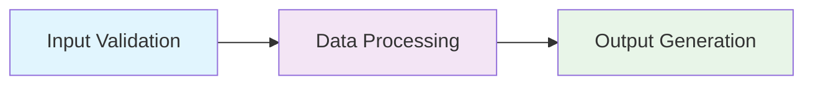
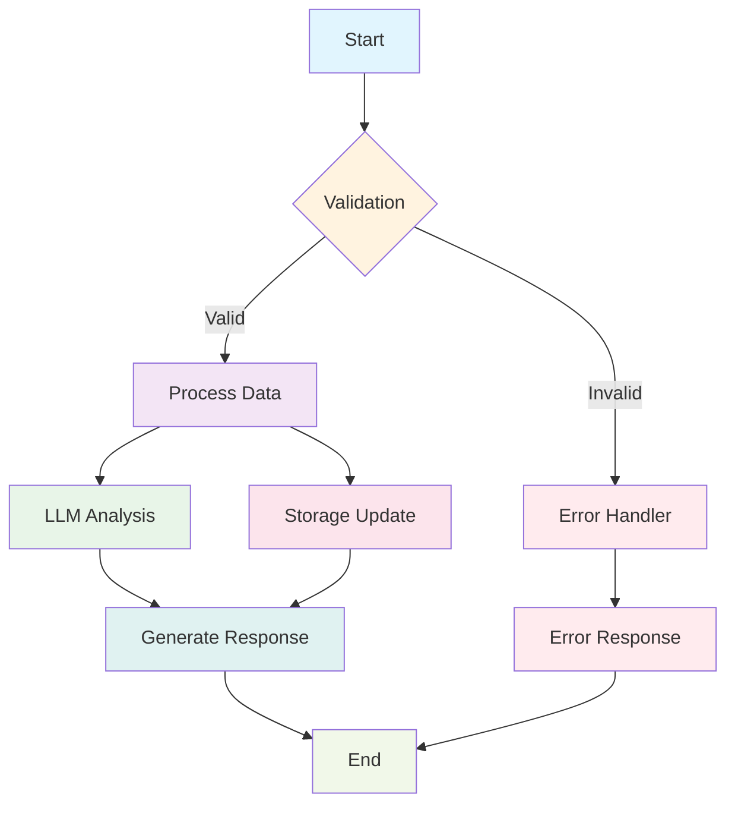
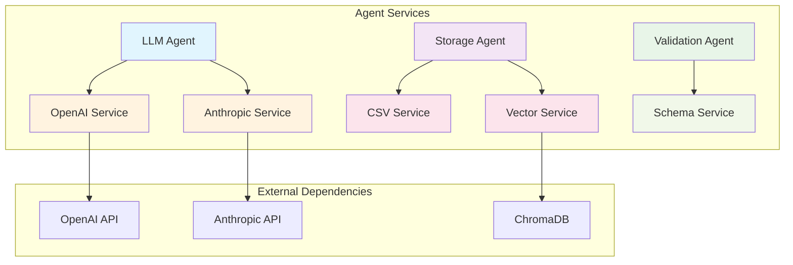

# CLI Graph Inspector

<div style={{marginBottom: '1rem', fontSize: '0.9rem', color: '#666'}}>
  <span>📍 <a href="/docs/intro">AgentMap</a> → <a href="/docs/deployment">Deployment</a> → <strong>CLI Graph Inspector</strong></span>
</div>

:::warning Implementation Status

**⚠️ DEVELOPMENT IN PROGRESS**: While the CLI command structure is fully implemented, some core inspection methods are not yet available. The command will fail at runtime until the following methods are implemented:

- `get_agent_resolution_status()` in GraphRunnerService
- `_load_graph_definition_for_execution()` in GraphRunnerService  
- `get_service_info()` on agent instances

**Current Status**: Documentation reflects intended functionality. Implementation gaps prevent actual usage.

**For Developers**: See [Implementation Notes](#implementation-notes) section below for detailed technical requirements.

:::

The AgentMap CLI Graph Inspector is a powerful diagnostic tool that provides deep insights into your workflow graphs, agent configurations, service dependencies, and execution readiness. This tool is essential for deployment validation, helping you understand how your graphs are structured, identify potential issues before deployment, and optimize performance for production environments.

## Overview

The `inspect-graph` command analyzes your workflow graphs and provides detailed information about:

- **Graph Structure**: Node counts, agent types, and resolution status
- **Agent Configuration**: Service availability, protocol implementations, and configuration details
- **Dependency Resolution**: Which agents can be resolved and why others cannot
- **Service Status**: LLM, storage, and other service availability
- **Performance Insights**: Resolution rates and potential bottlenecks

## Basic Usage

### Simple Graph Inspection

```bash
agentmap inspect-graph MyWorkflow
```

This provides a complete overview of the specified graph, including all nodes and their configurations.

### Inspect Specific Node

```bash
agentmap inspect-graph MyWorkflow --node ProcessingNode
```

Focus on a specific node within the graph for detailed analysis.

### Use Custom CSV File

```bash
agentmap inspect-graph MyWorkflow --csv ./workflows/custom.csv
```

Inspect graphs from a specific CSV file instead of the default configuration.

## Command Options

| Option | Short | Description | Default |
|--------|-------|-------------|---------|
| `--csv` | `-c` | Path to CSV workflow file | Config default |
| `--config` | | Path to custom config file | None |
| `--node` | `-n` | Inspect specific node only | All nodes |
| `--services` | | Show service availability | `true` |
| `--no-services` | | Hide service availability | |
| `--protocols` | | Show protocol implementations | `true` |
| `--no-protocols` | | Hide protocol implementations | |
| `--config-details` | | Show detailed configuration | `false` |
| `--resolution` | | Show agent resolution details | `false` |

## Output Format

### Graph Overview Section

```
🔍 Inspecting Graph: CustomerOnboarding
==================================================

📊 Graph Overview:
   Resolved Name: CustomerOnboarding
   Total Nodes: 7
   Unique Agent Types: 4
   All Resolvable: ✅
   Resolution Rate: 100.0%
```

### Node Details Section

```
🤖 Node: validate_input
   Agent Type: ValidationAgent
   Description: Validate customer input data
   📋 Services:
      llm: ✅
      storage: ✅
      validation: ✅
   🔌 Protocols:
      BaseAgent: ✅
      LLMCapable: ✅
      ValidationCapable: ✅
   📝 Configuration:
      Input Fields: ['customer_data', 'validation_rules']
      Output Field: validation_result
```

### Issues Summary

```
⚠️  Issues Found (2):
   payment_processor: Missing required service dependencies
      Missing: stripe, payment_gateway
      Error: ServiceResolutionError: stripe service not available
   email_notification: Agent type not resolvable
      Missing: sendgrid
      Error: ImportError: No module named 'sendgrid'
```

## Interactive Examples

### Example 1: Complete Workflow Inspection

```bash
# Inspect a complete customer onboarding workflow
agentmap inspect-graph CustomerOnboarding --config-details

# Expected output:
# 📊 Graph Overview:
#    Total Nodes: 5
#    Unique Agent Types: 3
#    All Resolvable: ✅
#    Resolution Rate: 100.0%
#
# 🤖 Node: start_onboarding
#    Agent Type: InputAgent
#    Services: ✅ All available
#    Ready for execution: ✅
```

### Example 2: Troubleshooting Failed Resolution

```bash
# Inspect a problematic graph with resolution issues
agentmap inspect-graph PaymentWorkflow --resolution

# Expected output:
# ❌ Issues Found (1):
#    process_payment: Agent resolution failed
#       Error: ImportError: No module named 'stripe'
#       Missing dependencies: stripe>=5.0.0
#       
# 💡 Suggested fix: pip install stripe>=5.0.0
```

### Example 3: Service Dependency Analysis

```bash
# Check service availability for a specific node
agentmap inspect-graph DataPipeline --node etl_processor --services

# Expected output:
# 🤖 Node: etl_processor
#    📋 Services:
#       llm: ✅ (OpenAI available)
#       storage: ✅ (CSV, JSON available)
#       vector: ❌ (ChromaDB not installed)
#       cloud: ❌ (Firebase credentials missing)
```

## Graph Structure Visualization

The inspector provides insights that can be visualized using Mermaid diagrams:

### Simple Linear Flow



### Complex Branching Workflow



### Service Dependency Map



## Troubleshooting Guide

### Common Issues and Solutions

#### 1. Agent Resolution Failures

**Problem**: `❌ Agent type not resolvable`

**Symptoms**:
```
⚠️  Issues Found (1):
   custom_processor: Agent type 'CustomProcessor' not resolvable
   Error: ModuleNotFoundError: No module named 'custom_agents.processor'
```

**Solutions**:
1. **Check agent location**:
   ```bash
   # Verify custom agent file exists
   ls agentmap/agents/custom/custom_processor.py
   ```

2. **Run scaffold command**:
   ```bash
   agentmap scaffold --graph MyWorkflow
   ```

3. **Verify Python path**:
   ```python
   # In your custom agent file
   from agentmap.agents.base_agent import BaseAgent
   
   class CustomProcessor(BaseAgent):
       def process(self, inputs):
           return "processed_result"
   ```

#### 2. Service Dependency Issues

**Problem**: `❌ Missing required service dependencies`

**Symptoms**:
```
📋 Services:
   llm: ❌ (No LLM providers available)
   storage: ✅
   validation: ✅
```

**Solutions**:
1. **Install missing dependencies**:
   ```bash
   # For LLM services
   pip install agentmap[llm]
   # Or specific providers
   pip install openai anthropic
   ```

2. **Check environment variables**:
   ```bash
   echo $OPENAI_API_KEY
   echo $ANTHROPIC_API_KEY
   ```

3. **Verify configuration**:
   ```yaml
   # In agentmap_config.yaml
   llm:
     default_provider: openai
     providers:
       openai:
         api_key: ${OPENAI_API_KEY}
   ```

#### 3. Configuration Errors

**Problem**: Invalid node configuration

**Symptoms**:
```
📝 Configuration:
   Input Fields: []
   Output Field: None
   ⚠️ Warning: No input fields specified
```

**Solutions**:
1. **Update CSV configuration**:
   ```csv
   graph_name,node_nameagent_type,description,input_fields,output_field
   MyGraph,ProcessNode,LLMAgent,Process data,"input_data,rules",processed_output
   ```

2. **Verify required fields**:
   - Ensure `input_fields` column contains comma-separated field names
   - Verify `output_field` specifies the expected output key
   - Check `agent_type` matches available agent implementations

#### 4. Protocol Implementation Issues

**Problem**: Missing protocol implementations

**Symptoms**:
```
🔌 Protocols:
   BaseAgent: ✅
   LLMCapable: ❌
   StorageCapable: ✅
```

**Solutions**:
1. **Implement missing protocols**:
   ```python
   from agentmap.agents.protocols import LLMCapable
   
   class MyAgent(BaseAgent, LLMCapable):
       def process_with_llm(self, inputs, llm_service):
           # Implementation here
           pass
   ```

2. **Check agent inheritance**:
   ```python
   # Verify your agent inherits from correct base classes
   class CustomAgent(LLMAgent):  # LLMAgent includes LLMCapable
       pass
   ```

### Advanced Troubleshooting

#### Performance Analysis

Use the inspector to identify performance bottlenecks:

```bash
# Check resolution efficiency
agentmap inspect-graph MyWorkflow --resolution

# Look for patterns:
# - Low resolution rates (< 90%)
# - Multiple missing dependencies
# - Complex agent hierarchies
```

#### Service Health Diagnosis

Combine with diagnostic commands for comprehensive analysis:

```bash
# System-wide dependency check
agentmap diagnose

# Graph-specific inspection  
agentmap inspect-graph MyWorkflow --services

# Cache status check
agentmap validate-cache --stats
```

## Performance Analysis

### Resolution Rate Optimization

**Target Metrics**:
- Resolution Rate: > 95%
- Service Availability: 100% for required services
- Protocol Compliance: 100% for used protocols

**Optimization Strategies**:

1. **Minimize Custom Agents**: Use built-in agents when possible
2. **Optimize Dependencies**: Install only required service packages
3. **Service Pooling**: Reuse service instances across nodes
4. **Lazy Loading**: Load services only when needed

### Graph Complexity Analysis

```bash
# Analyze graph complexity
agentmap inspect-graph ComplexWorkflow --config-details

# Key metrics to monitor:
# - Node count (recommend < 20 per graph)
# - Unique agent types (recommend < 10)
# - Service dependencies (minimize external deps)
# - Protocol variations (standardize where possible)
```

### Memory and Resource Planning

**Service Resource Requirements**:
- **LLM Services**: 100-500MB per provider
- **Vector Storage**: 200MB-2GB depending on data
- **File Storage**: Minimal overhead
- **Network Services**: Connection pooling recommended

## Best Practices

### 1. Graph Design Principles

**Atomic Responsibility**:
```csv
# Good: Single responsibility per node
graph_name,node_nameagent_type,description
DataPipeline,ValidateInput,ValidationAgent,Validate input schema
DataPipeline,ProcessData,LLMAgent,Process with AI
DataPipeline,SaveResults,StorageAgent,Save to database

# Avoid: Multi-responsibility nodes
DataPipeline,ProcessEverything,CustomAgent,Validate, process, and save
```

**Service Efficiency**:
```csv
# Good: Reuse compatible agent types
graph_name,node_nameagent_type,description
Workflow,Step1,LLMAgent,Analyze input
Workflow,Step2,LLMAgent,Generate response
Workflow,Step3,LLMAgent,Validate output

# Better: Minimize service switching
graph_name,node_nameagent_type,description  
Workflow,BatchProcess,LLMAgent,Analyze input and generate response
Workflow,SaveOutput,StorageAgent,Save results
```

### 2. Dependency Management

**Progressive Dependency Loading**:
```bash
# Start with minimal dependencies
pip install agentmap

# Add services as needed
pip install agentmap[llm]     # When using LLM agents
pip install agentmap[storage] # When using storage agents
pip install agentmap[all]     # For full functionality
```

**Environment Isolation**:
```bash
# Use virtual environments for different workflows
python -m venv workflow_env
source workflow_env/bin/activate
pip install agentmap[specific_needs]
```

### 3. Testing and Validation

**Pre-deployment Inspection**:
```bash
# Always inspect before deploying
agentmap inspect-graph ProductionWorkflow --resolution --config-details

# Verify all services are available
agentmap diagnose

# Test with minimal data
agentmap run --graph ProductionWorkflow --state '{"test": true}'
```

**Continuous Monitoring**:
```bash
# Include in CI/CD pipelines
agentmap validate-all --warnings-as-errors
agentmap inspect-graph MyWorkflow --resolution | grep "Resolution Rate: 100"
```

### 4. Documentation Standards

**Graph Documentation**:
```csv
# Include clear, descriptive contexts
graph_name,node_nameagent_type,context,description
CustomerFlow,ValidateData,ValidationAgent,"Validates customer input against business rules","Ensure all required fields are present and valid"
CustomerFlow,ProcessOrder,LLMAgent,"Processes order using AI analysis","Analyze order details and generate processing instructions"
```

**Service Dependencies**:
```yaml
# Document service requirements in config
# agentmap_config.yaml
documentation:
  service_requirements:
    llm: "Required for AI processing nodes"
    storage: "Required for data persistence"
    validation: "Required for input validation"
```

## Integration with Other CLI Commands

### Workflow Integration

```bash
# Complete development workflow
agentmap validate-csv --csv workflow.csv
agentmap inspect-graph MyWorkflow --resolution
agentmap scaffold --graph MyWorkflow
agentmap inspect-graph MyWorkflow  # Verify scaffolding worked
agentmap run --graph MyWorkflow --state '{"test": true}'
```

### Debugging Workflow

```bash
# Systematic debugging approach
agentmap diagnose                    # System health
agentmap validate-config             # Configuration issues
agentmap inspect-graph MyWorkflow    # Graph-specific issues
agentmap validate-csv --csv data.csv # Data validation
```

### Performance Optimization Workflow

```bash
# Performance analysis sequence
agentmap inspect-graph MyWorkflow --config-details
agentmap validate-cache --stats
agentmap run --graph MyWorkflow --profile  # If available
agentmap inspect-graph MyWorkflow          # Post-optimization check
```

## Implementation Notes

:::info For Developers

This section provides technical details about implementation gaps that need to be addressed before the graph inspector can function properly.

:::

### Required Method Implementations

The following methods are called by the CLI but not yet implemented:

#### 1. GraphRunnerService.get_agent_resolution_status()

```python
def get_agent_resolution_status(self, graph_def: dict) -> dict:
    """
    Analyze agent resolution status for all nodes in the graph.
    
    Args:
        graph_def: Graph definition dictionary from CSV parsing
        
    Returns:
        dict: {
            'total_nodes': int,
            'resolved_nodes': int, 
            'resolution_rate': float,
            'node_status': {
                'node_name': {
                    'resolvable': bool,
                    'agent_type': str,
                    'error': str | None,
                    'services': dict,
                    'protocols': dict
                }
            }
        }
    """
    # Implementation needed
    pass
```

#### 2. GraphRunnerService._load_graph_definition_for_execution()

```python
def _load_graph_definition_for_execution(self, csv_path: str, graph_name: str) -> tuple[dict, str]:
    """
    Load and validate graph definition from CSV file.
    
    Args:
        csv_path: Path to CSV workflow file
        graph_name: Name of the graph to load
        
    Returns:
        tuple: (graph_definition_dict, resolved_graph_name)
        
    Raises:
        GraphLoadError: If graph cannot be loaded or validated
    """
    # Implementation needed
    pass
```

#### 3. Agent.get_service_info()

```python
def get_service_info(self) -> dict:
    """
    Get service availability and status for this agent.
    
    Returns:
        dict: {
            'llm': {'available': bool, 'provider': str | None, 'error': str | None},
            'storage': {'available': bool, 'types': list[str], 'error': str | None},
            'validation': {'available': bool, 'schemas': list[str], 'error': str | None},
            # ... other services as applicable
        }
    """
    # Implementation needed on base agent classes
    pass
```

### Implementation Priorities

1. **High Priority**: `_load_graph_definition_for_execution()` - Core functionality blocker
2. **High Priority**: `get_agent_resolution_status()` - Main inspection logic
3. **Medium Priority**: `get_service_info()` - Service status details

### Testing Approach

Once implemented, test with:

```bash
# Test basic functionality
agentmap inspect-graph TestGraph

# Test error handling
agentmap inspect-graph NonExistentGraph

# Test specific node inspection
agentmap inspect-graph TestGraph --node TestNode

# Test service inspection
agentmap inspect-graph TestGraph --services --protocols
```

### Integration Requirements

The inspector integrates with:
- **CSV Parser**: For graph definition loading
- **Agent Registry**: For agent type resolution
- **Service Manager**: For service availability checking
- **Configuration System**: For custom config file support

## See Also

- [CLI Commands Reference](./04-cli-commands) - Complete CLI command documentation
- [CLI Validation Commands](./08-cli-validation) - Workflow validation tools
- [Diagnostic Commands](./09-cli-diagnostics) - System health and troubleshooting
- [Workflow Resume Commands](./10-cli-resume) - Resuming interrupted workflows
- **[Agent Types Reference](reference/agent-types)** - Available agent types and configurations
- **[CSV Schema Reference](reference/csv-schema)** - Workflow file format specification
- **[Configuration Guide](/docs/deployment/)** - Configuration options and setup
- **[Execution Tracking](/docs/deployment)** - Advanced debugging techniques
- **[Testing Patterns](/docs/guides/development/testing)** - Testing strategies for workflows

## Related Tools

- **Graph Validation**: `agentmap validate-csv` - Validate workflow files
- **System Diagnostics**: `agentmap diagnose` - Check system dependencies
- **Configuration Management**: `agentmap config` - View and manage configuration
- **Cache Management**: `agentmap validate-cache` - Manage validation cache
- **Agent Scaffolding**: `agentmap scaffold` - Generate missing agent implementations