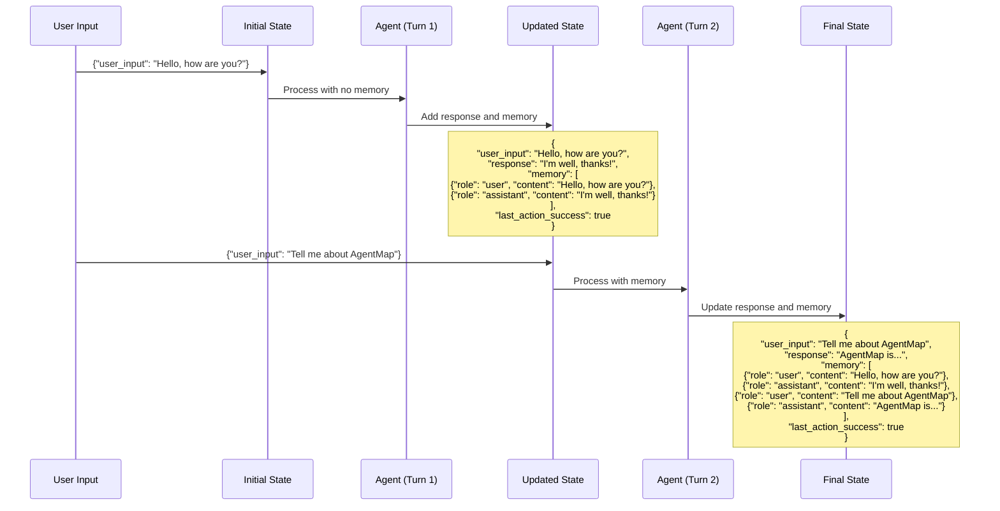

# Memory Management in AgentMap

## Introduction

Memory capabilities are essential for creating conversational and context-aware agents within AgentMap workflows. This guide explains how AgentMap implements memory for LLM-based agents, how to configure memory declaratively, and best practices for memory management.

:::info Key Benefits
- **Conversational Context**: Maintain conversation history across agent interactions
- **Declarative Configuration**: Set up memory using simple CSV configuration
- **Flexible Memory Keys**: Use custom field names for different memory contexts
- **Automatic Serialization**: Memory state is automatically managed between nodes
:::

## Memory Architecture Overview

AgentMap implements memory as an optional feature for LLM-based agents (OpenAI, Anthropic, Google), allowing workflows to maintain conversation history and context between interactions without persisting data outside of workflow execution.

### Memory Flow Visualization

```mermaid
flowchart TD
    subgraph "Memory Components"
        A[LLMAgent Base] --> B[Memory Initialization]
        B --> C{Memory Configuration}
        C --> D[Message Management]
        D --> E[Memory Truncation]
    end
    
    subgraph "Execution Flow"
        AA[Initial State] --> BB[Node 1 Execution]
        BB --> CC[Memory Serialization]
        CC --> DD[Updated State]
        DD --> EE[Node 2 Execution]
        EE --> FF[Memory Deserialization]
        FF --> GG[Memory Update]
        GG --> HH[Memory Serialization]
        HH --> II[Updated State]
    end
    
    subgraph "Agent Memory Process"
        AAA[Extract State] --> BBB[Deserialize Memory]
        BBB --> CCC[Generate Response]
        CCC --> DDD[Save to Memory]
        DDD --> EEE[Serialize Memory]
        EEE --> FFF[Update State]
    end
    
    style A fill:#e1f5fe,stroke:#01579b,stroke-width:2px
    style C fill:#fff3e0,stroke:#e65100,stroke-width:2px
    style CC fill:#f3e5f5,stroke:#4a148c,stroke-width:2px
    style FF fill:#f3e5f5,stroke:#4a148c,stroke-width:2px
    style HH fill:#f3e5f5,stroke:#4a148c,stroke-width:2px
```



### Key Components

1. **LLMAgent Base Class**: Provides memory initialization and management
2. **Memory Serialization Utilities**: Enable memory to be passed between nodes
3. **State Adapter Integration**: Special handling for memory objects
4. **Declarative Configuration**: CSV-based configuration through Context field

## Declarative Memory Configuration

Memory is configured declaratively through the Context field in your CSV workflow definition:

```csv
GraphName,Node,Edge,Context,AgentType,Success_Next,Failure_Next,Input_Fields,Output_Field,Prompt
ChatBot,Conversation,{"memory_key":"chat_history","max_memory_messages":10},Chat with memory,claude,Next,Error,user_input|chat_history,response,Human: {user_input}
```

### Memory Configuration Parameters

| Parameter | Description | Default | Type |
|-----------|-------------|---------|------|
| `memory_key` | State field to store memory | `"memory"` | String |
| `max_memory_messages` | Maximum number of messages to keep | `None` (unlimited) | Integer or null |

### Basic Configuration Structure

```json
{
  "memory_key": "conversation_history",
  "max_memory_messages": 10
}
```

## Memory Implementation Details

AgentMap's memory system uses a simple array-based approach for storing conversation history:

### Message Structure

Each message in memory is stored as a dictionary with:
- `role`: Either "user", "assistant", or "system"
- `content`: The actual message text

### Memory Functions

The following functions are available for memory management:

:::tip Memory Management Functions
- `get_memory(state, memory_key)`: Retrieves memory from state
- `add_message(state, role, content, memory_key)`: Adds a message to memory
- `add_user_message(state, content, memory_key)`: Adds a user message
- `add_assistant_message(state, content, memory_key)`: Adds an assistant message
- `add_system_message(state, content, memory_key)`: Adds a system message
- `clear_memory(state, memory_key)`: Clears all messages from memory
- `truncate_memory(state, max_messages, memory_key)`: Limits memory to a maximum number of messages
:::

## State Evolution with Memory



## Memory Implementation Examples

### Basic Chatbot with Memory

```csv
ChatBot,GetInput,,Get user input,Input,Respond,,message,user_input,What can I help you with?
ChatBot,Respond,{"memory_key":"chat_history"},Generate response,OpenAI,GetInput,,user_input|chat_history,response,"You are a helpful assistant. Human: {user_input}"
```

### Multi-Agent Workflow with Shared Memory

```csv
Support,GetQuery,,Get user query,Input,Classify,,query,user_query,How can we help you today?
Support,Classify,{"memory_key":"conversation_history","max_memory_messages":5},Classify query intent,Claude,RouteQuery,,user_query|conversation_history,query_type,Classify this query: {user_query}
Support,RouteQuery,,Route to specialist,Branching,ProductSpecialist|TechSupport,,query_type,routing_decision,
Support,ProductSpecialist,{"memory_key":"conversation_history","max_memory_messages":5},Product specialist,OpenAI,GetQuery,,user_query|conversation_history,response,"You are a product specialist. User: {user_query}"
Support,TechSupport,{"memory_key":"conversation_history","max_memory_messages":5},Technical support,OpenAI,GetQuery,,user_query|conversation_history,response,"You are a technical support agent. User: {user_query}"
```

### Multi-Turn Conversation with Message Limitation

```csv
Interview,Welcome,,Welcome user,Default,GetQuestion,,user,welcome_message,Welcome to the interview!
Interview,GetQuestion,{"memory_key":"interview_history","max_memory_messages":8},Ask interview question,Claude,GetAnswer,,question_number|interview_history,current_question,"You are an interviewer. Ask question #{question_number}."
Interview,GetAnswer,,Get user answer,Input,EvaluateAnswer,,current_question,user_answer,
Interview,EvaluateAnswer,{"memory_key":"interview_history","max_memory_messages":8},Evaluate answer,Claude,GetQuestion,,user_answer|interview_history,evaluation,"Evaluate this interview answer: {user_answer}"
```

## Interactive Configuration Example

import CodeBlock from '@theme/CodeBlock';
import Tabs from '@theme/Tabs';
import TabItem from '@theme/TabItem';

<Tabs>
<TabItem value="basic" label="Basic Memory" default>

```csv
GraphName,Node,Edge,Context,AgentType,Success_Next,Failure_Next,Input_Fields,Output_Field,Prompt
ChatBot,Conversation,{"memory_key":"chat_history"},Chat with memory,claude,Next,Error,user_input|chat_history,response,Human: {user_input}
```

</TabItem>
<TabItem value="limited" label="Limited Memory">

```csv
GraphName,Node,Edge,Context,AgentType,Success_Next,Failure_Next,Input_Fields,Output_Field,Prompt
ChatBot,Conversation,{"memory_key":"chat_history","max_memory_messages":10},Chat with limited memory,claude,Next,Error,user_input|chat_history,response,Human: {user_input}
```

</TabItem>
<TabItem value="shared" label="Shared Memory">

```csv
GraphName,Node,Edge,Context,AgentType,Success_Next,Failure_Next,Input_Fields,Output_Field,Prompt
Support,Classifier,{"memory_key":"support_session"},Classify query,claude,Router,Error,user_query|support_session,intent,Classify: {user_query}
Support,Responder,{"memory_key":"support_session"},Generate response,claude,End,Error,user_query|support_session,response,Respond: {user_query}
```

</TabItem>
</Tabs>

## Best Practices

### 1. Be Explicit About Memory Keys
Always specify a memory_key that makes semantic sense for your workflow:

```json
{"memory_key": "customer_interaction_history"}
```

### 2. Limit Memory Size for Long Conversations
Prevent unlimited memory growth in extended conversations:

```json
{"memory_key": "chat_history", "max_memory_messages": 15}
```

### 3. Share Memory Between Related Agents
Use the same memory_key for agents that should share context:

```csv
SupportFlow,Classifier,{"memory_key":"support_history"},Classify query,Claude,...
SupportFlow,Responder,{"memory_key":"support_history"},Generate response,Claude,...
```

### 4. Consider Memory Scope
:::warning Memory Persistence
Memory persists only during a single graph execution. Implement your own persistence mechanism if you need memory to survive between separate workflow runs.
:::

### 5. Include System Instructions
Set initial context with system messages in your prompts:

```csv
ChatBot,Respond,{"memory_key":"chat_history"},Generate response,OpenAI,GetInput,,user_input|chat_history,response,"You are a helpful assistant with these rules: 1) Be concise 2) Use examples"
```

## Troubleshooting

| Issue | Possible Solution |
|-------|-------------------|
| Memory not persisting between nodes | Ensure memory_key is consistent and included in Input_Fields |
| Memory not initializing | Check that LLM agent is correctly configured |
| Growing response times | Use max_memory_messages to limit memory size |
| Incorrect memory content | Verify memory field is properly included in agent input fields |

## Related Guides

- [LangChain Memory Integration](./langchain-memory-integration) - Advanced memory features with LangChain
- [Orchestration Patterns](./orchestration-patterns) - Dynamic workflow routing
- [Agent Development Contract](../agent-development-contract) - Building custom agents
- [State Management and Data Flow](../../state-management) - Understanding AgentMap state

## Conclusion

AgentMap's memory system provides a simple but effective way to create stateful agent workflows. By using declarative configuration, you can easily implement conversational agents that maintain context across interactions without complexity.

Memory is designed to enhance agent capabilities within the boundaries of AgentMap's orchestration framework, providing just enough statefulness for effective conversations while respecting the separation between workflow orchestration and application state management.
