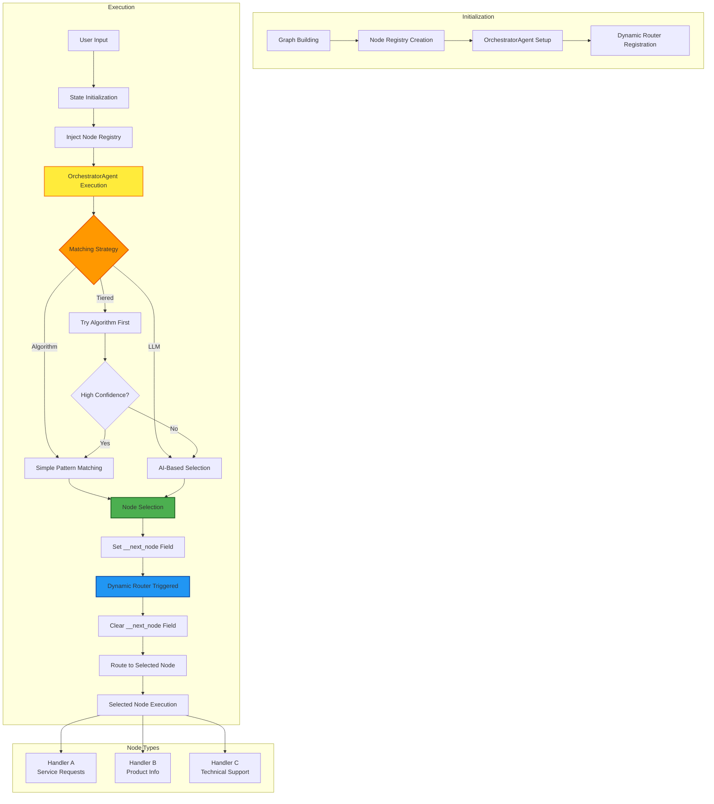
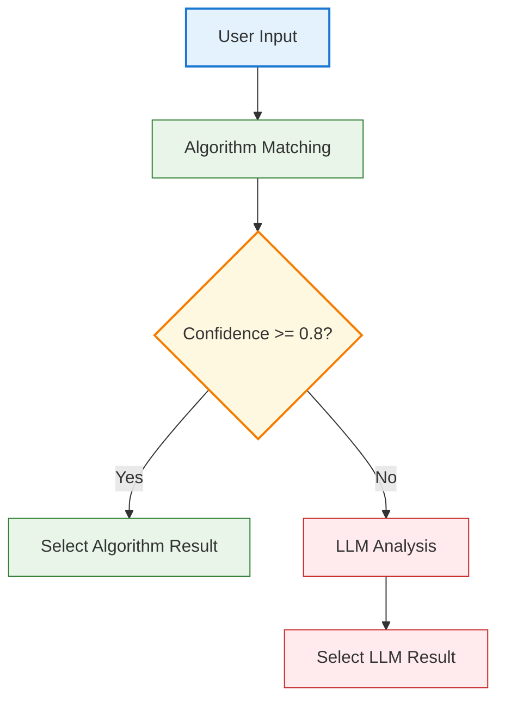
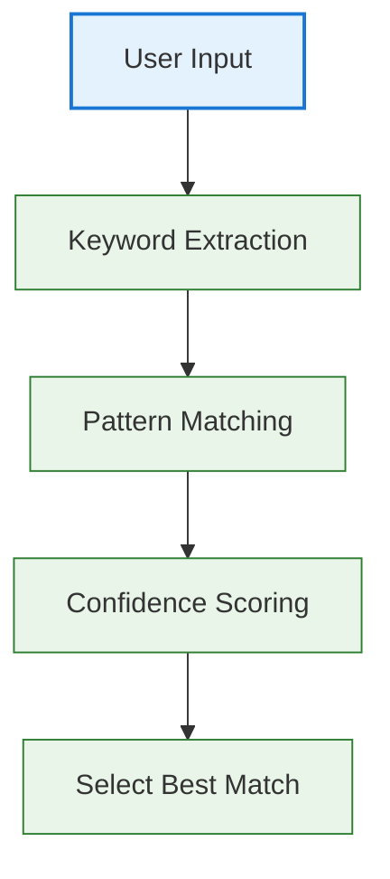
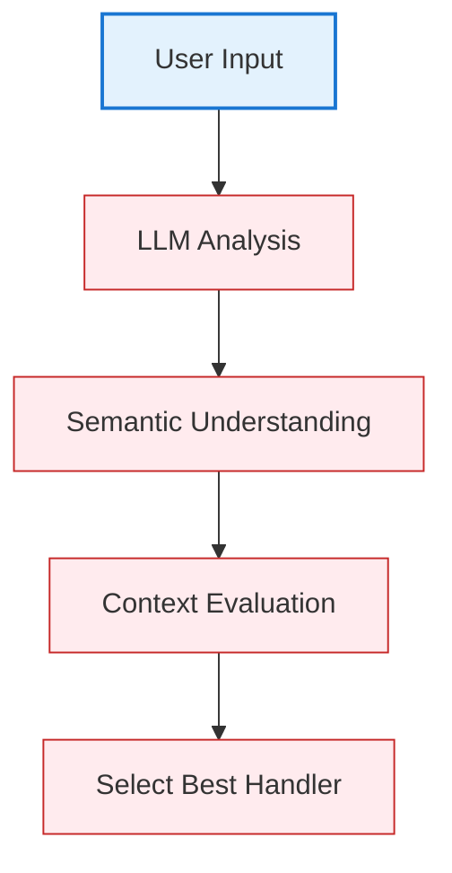

# Orchestration Patterns with OrchestratorAgent

## Introduction

The `OrchestratorAgent` is a specialized agent in the AgentMap framework that dynamically routes workflow execution based on user input. It acts as an intelligent "switchboard" that analyzes input text and selects the most appropriate node to handle a request, enabling conversational interfaces and adaptive workflows without hardcoded routing logic.

:::info Key Benefits
- **Intelligent Routing**: Automatically selects the best handler based on user input
- **Conversational Interfaces**: Build adaptive chatbots and assistant workflows
- **Zero Hardcoding**: No need to define complex conditional routing logic
- **Multiple Strategies**: Algorithmic, LLM-based, or hybrid routing approaches
:::

## Flow Diagram



## Key Features

- **Intelligent Node Selection**: Analyzes text input to determine the most appropriate handler based on node metadata
- **Multiple Matching Strategies**: Uses algorithmic, LLM-based, or tiered approaches for optimal node selection
- **Dynamic Routing**: Routes to selected nodes without requiring predefined edge configuration
- **Metadata-Driven**: Works with node descriptions and context metadata for informed decisions
- **Filtering Capabilities**: Can limit node selection to specific types or a predetermined list
- **Fallback Handling**: Includes default routing for cases when no suitable match is found

## How OrchestratorAgent Works

### 1. Initialization Phase

During graph initialization, the system:
- Builds a node registry containing metadata for all nodes
- Identifies OrchestratorAgent nodes in the graph
- Registers dynamic routers for each orchestrator node
- Injects the node registry into the initial state

### 2. Selection Phase

When the OrchestratorAgent executes, it:
- Receives user input text and the node registry
- Applies any configured filters to limit the available nodes
- Uses the configured matching strategy to select the best node
- Sets the `__next_node` field in the state with the selected node name

### 3. Routing Phase

After selection, the system:
- Triggers the dynamic router for the orchestrator node
- Detects the `__next_node` field in the state
- Clears the field to prevent routing loops
- Routes execution to the selected node

## Configuration Options

The OrchestratorAgent supports the following configuration options:

| Option | Description | Default |
|--------|-------------|---------|
| `llm_type` | LLM provider for semantic matching | `"openai"` |
| `temperature` | Temperature for LLM selection | `0.2` |
| `default_target` | Fallback node when no match is found | `None` |
| `matching_strategy` | Method for node selection | `"tiered"` |
| `confidence_threshold` | Minimum confidence to skip LLM in tiered mode | `0.8` |
| `node_filter` | Filter for available nodes | `"all"` |

### Matching Strategies

import Tabs from '@theme/Tabs';
import TabItem from '@theme/TabItem';

<Tabs>
<TabItem value="tiered" label="Tiered Strategy" default>

#### Tiered Strategy (`"tiered"`)

Combines algorithmic and LLM-based approaches for optimal performance:



**Best for**: Most applications where you want speed and accuracy

</TabItem>
<TabItem value="algorithm" label="Algorithm Strategy">

#### Algorithm Strategy (`"algorithm"`)

Uses pattern matching and keyword analysis:



**Best for**: High-speed applications with predictable input patterns

</TabItem>
<TabItem value="llm" label="LLM Strategy">

#### LLM Strategy (`"llm"`)

Uses large language models for semantic understanding:



**Best for**: Complex, nuanced inputs requiring deep understanding

</TabItem>
</Tabs>

### Node Filtering Options

You can filter the nodes available for selection using the following formats:

- `"all"`: Include all nodes (default)
- `"nodeType:type"`: Only include nodes of a specific type
- `"node1|node2|node3"`: Only include specified nodes

## Usage Examples

### Basic Orchestration Setup

```csv
GraphName,Node,Edge,AgentType,Input_Fields,Output_Field,Prompt,Context
Router,Orchestrator,,orchestrator,available_nodes|user_input,next_node,"Select the best node to handle the user's request",llm_type:openai,matching_strategy:tiered
Router,ProductInfo,,openai,user_query,response,"I handle product information requests.",
Router,TechSupport,,openai,user_query,response,"I handle technical support questions.",
Router,OrderStatus,,openai,user_query,response,"I handle order status inquiries.",
```

### Code Example

```python
from agentmap.runner import run_graph

# Run the graph with user input
result = run_graph("Router", {
    "user_input": "I need help setting up my new device"
})

# Result will contain the output from the TechSupport node
```

## Advanced Usage

### Custom Node Descriptions

For better node selection, provide detailed descriptions in the node context:

```csv
GraphName,Node,Edge,AgentType,Input_Fields,Output_Field,Prompt,Context
Router,Orchestrator,,orchestrator,available_nodes|user_input,next_node,"Route based on intent",
Router,ProductInfo,,openai,user_query,response,"Product info response","description:I answer questions about product features, pricing, availability, and comparisons between different products."
Router,TechSupport,,openai,user_query,response,"Technical support response","description:I help with device setup, troubleshooting, configuration issues, and technical problems."
Router,OrderStatus,,openai,user_query,response,"Order status response","description:I provide information about order tracking, shipping status, delivery estimates, and order modifications."
```

### Limiting Available Nodes

Restrict the orchestrator to only consider specific nodes:

```csv
GraphName,Node,Edge,AgentType,Input_Fields,Output_Field,Prompt,Context
Router,Orchestrator,,orchestrator,available_nodes|user_input,next_node,"Select the best handler","node_filter:ProductInfo|OrderStatus"
```

### Type-Based Filtering

Route only to nodes of a specific type:

```csv
GraphName,Node,Edge,AgentType,Input_Fields,Output_Field,Prompt,Context
Router,Orchestrator,,orchestrator,available_nodes|user_input,next_node,"Select the best handler","node_filter:nodeType:specialist"
```

## Implementing OrchestratorAgent

To add OrchestratorAgent to your project:

1. **Define Node Structure**: Create nodes with descriptive metadata using the Context field
2. **Configure OrchestratorAgent**: Add an orchestrator node to your graph with appropriate input fields
3. **Connect Outputs**: Ensure the output of one node connects to the input of the next
4. **Populate Initial State**: Provide the user input in the initial state

## Technical Implementation

### Required Components

The OrchestratorAgent implementation requires several components:

1. **Node Registry Utility**: Creates and manages metadata for all nodes
2. **Dynamic Router**: Handles runtime routing based on OrchestratorAgent decisions
3. **GraphAssembler Enhancements**: Detects orchestrator nodes during graph building
4. **Runner Integration**: Injects node registry into the initial state

### Implementation Files

The implementation consists of the following key files:

1. `agentmap/utils/node_registry.py`: Utilities for building and populating node registries
2. `agentmap/agents/builtins/orchestrator_agent.py`: The OrchestratorAgent implementation
3. `agentmap/graph/assembler.py`: Enhanced assembler with dynamic routing support
4. `agentmap/runner.py`: Modified runner with node registry injection

## Orchestration Patterns

### Conversational Agents

The OrchestratorAgent excels at building conversational interfaces that can dynamically route user queries to specialized handlers:

```csv
GraphName,Node,Edge,AgentType,Input_Fields,Output_Field,Prompt,Context
ConvoBot,Router,,orchestrator,nodes|user_input,next_node,"Route user query","matching_strategy:llm"
ConvoBot,Greeting,,openai,user_input,response,"I handle greetings and introductions.","description:Welcome users, handle hellos, goodbyes, and casual conversation starters"
ConvoBot,FAQ,,openai,user_input,response,"I answer frequently asked questions about our services.","description:Answer common questions about services, features, pricing, and policies"
ConvoBot,Appointment,,openai,user_input,response,"I help schedule appointments and manage bookings.","description:Schedule meetings, book appointments, check availability, and manage calendar"
ConvoBot,Feedback,,openai,user_input,response,"I collect and process user feedback.","description:Gather user opinions, handle complaints, process reviews and suggestions"
```

### Multi-Step Workflows

Orchestrators can be used to create adaptive workflows that change based on user input:

```csv
GraphName,Node,Edge,AgentType,Input_Fields,Output_Field,Prompt,Context
Support,Triage,,orchestrator,nodes|ticket_description,next_node,"Route support ticket",
Support,Basic,,openai,ticket_description,resolution,"I handle basic troubleshooting steps.","description:Simple issues like password resets, basic setup, and common questions"
Support,Advanced,,openai,ticket_description,resolution,"I handle complex technical issues.","description:Advanced troubleshooting, system configurations, and technical problems"
Support,Billing,,openai,ticket_description,resolution,"I handle billing and payment issues.","description:Payment problems, subscription issues, billing inquiries, and account management"
Support,Escalation,,openai,ticket_description,resolution,"I handle escalated customer complaints.","description:Complex complaints, urgent issues, and high-priority customer concerns"
```

### Interactive FAQ Systems

Build intelligent FAQ systems that route queries to specialized knowledge bases:

```csv
GraphName,Node,Edge,AgentType,Input_Fields,Output_Field,Prompt,Context
FAQ,Classifier,,orchestrator,nodes|question,next_node,"Classify question by topic",
FAQ,ProductFAQ,,openai,question,answer,"I answer product-related questions.","description:Product features, specifications, compatibility, and usage instructions"
FAQ,ServiceFAQ,,openai,question,answer,"I answer service-related questions.","description:Service plans, support options, maintenance, and service availability"
FAQ,ShippingFAQ,,openai,question,answer,"I answer shipping-related questions.","description:Delivery times, shipping costs, tracking, and shipping policies"
FAQ,ReturnsFAQ,,openai,question,answer,"I answer questions about returns and refunds.","description:Return policies, refund processes, exchange options, and warranty claims"
```

## Orchestration with Memory

Combine orchestration with memory for stateful conversations:

```csv
GraphName,Node,Edge,AgentType,Input_Fields,Output_Field,Prompt,Context
SmartBot,Router,,"orchestrator",nodes|user_input|conversation_memory,next_node,"Route based on input and conversation history","memory:{""type"":""buffer_window"",""k"":5}"
SmartBot,GeneralChat,,"claude",user_input|conversation_memory,response,"I handle general conversation and chitchat.","memory:{""type"":""buffer_window"",""k"":5},description:Casual conversation, greetings, and general discussion"
SmartBot,TaskHelper,,"claude",user_input|conversation_memory,response,"I help with specific tasks and requests.","memory:{""type"":""buffer_window"",""k"":5},description:Task assistance, goal achievement, and specific help requests"
SmartBot,InfoProvider,,"claude",user_input|conversation_memory,response,"I provide information and answer questions.","memory:{""type"":""buffer_window"",""k"":5},description:Information queries, factual questions, and knowledge requests"
```

## Troubleshooting

### Common Issues

| Issue | Possible Solution |
|-------|-------------------|
| Orchestrator doesn't route to any node | Check that node registry is properly populated in the state |
| Node selection is inaccurate | Improve node descriptions or adjust matching strategy |
| Error about missing nodes | Verify node names match exactly between selection and definition |
| LLM selection not working | Check LLM credentials and connectivity |

### Debugging Tips

- Enable debug logging to see detailed information about node selection
- Check the `__node_registry` field in the state to verify node metadata
- Inspect the output of the OrchestratorAgent to see which node was selected
- Monitor the dynamic router execution to ensure proper routing

### Performance Optimization

1. **Use Tiered Strategy**: Combines speed of algorithms with accuracy of LLMs
2. **Optimize Node Descriptions**: Clear, specific descriptions improve selection accuracy
3. **Filter Node Options**: Reduce search space with appropriate node filters
4. **Adjust Confidence Thresholds**: Fine-tune when to use LLM vs algorithmic matching

## Interactive Configuration Builder

import CodeBlock from '@theme/CodeBlock';

<Tabs>
<TabItem value="simple" label="Simple Orchestration" default>

```csv
GraphName,Node,Edge,AgentType,Input_Fields,Output_Field,Prompt,Context
Router,Orchestrator,,orchestrator,available_nodes|user_input,next_node,"Route user request",
Router,Handler1,,openai,user_input,response,"I handle type 1 requests",
Router,Handler2,,openai,user_input,response,"I handle type 2 requests",
```

</TabItem>
<TabItem value="filtered" label="Filtered Orchestration">

```csv
GraphName,Node,Edge,AgentType,Input_Fields,Output_Field,Prompt,Context
Router,Orchestrator,,orchestrator,available_nodes|user_input,next_node,"Route user request","node_filter:Handler1|Handler2"
Router,Handler1,,openai,user_input,response,"I handle type 1 requests",
Router,Handler2,,openai,user_input,response,"I handle type 2 requests",
Router,Handler3,,openai,user_input,response,"I handle type 3 requests",
```

</TabItem>
<TabItem value="memory" label="Orchestration with Memory">

```csv
GraphName,Node,Edge,AgentType,Input_Fields,Output_Field,Prompt,Context
Router,Orchestrator,,orchestrator,available_nodes|user_input|chat_history,next_node,"Route based on input and history","memory:{""type"":""buffer"",""memory_key"":""chat_history""}"
Router,Handler1,,openai,user_input|chat_history,response,"I handle type 1 requests","memory:{""type"":""buffer"",""memory_key"":""chat_history""}"
Router,Handler2,,openai,user_input|chat_history,response,"I handle type 2 requests","memory:{""type"":""buffer"",""memory_key"":""chat_history""}"
```

</TabItem>
</Tabs>

## Related Guides

- [Memory Management](./memory-management) - Basic memory concepts for orchestrated workflows
- [LangChain Memory Integration](./langchain-memory-integration) - Advanced memory with orchestration
- [Prompt Management](./prompt-management) - Managing prompts in orchestrated workflows
- [Agent Development Contract](../agent-development-contract) - Building custom orchestration agents

## Conclusion

The OrchestratorAgent represents a powerful pattern for building flexible, intelligent workflows in the AgentMap framework. By leveraging dynamic routing and metadata-driven node selection, you can create systems that respond to user input with appropriate handlers without complex conditional edge logic.

By leveraging the OrchestratorAgent, you can create much more flexible and adaptive graph workflows that respond intelligently to user input without requiring complex predefined routing rules. This enables the creation of sophisticated conversational interfaces and adaptive workflows that feel natural and responsive to user needs.
