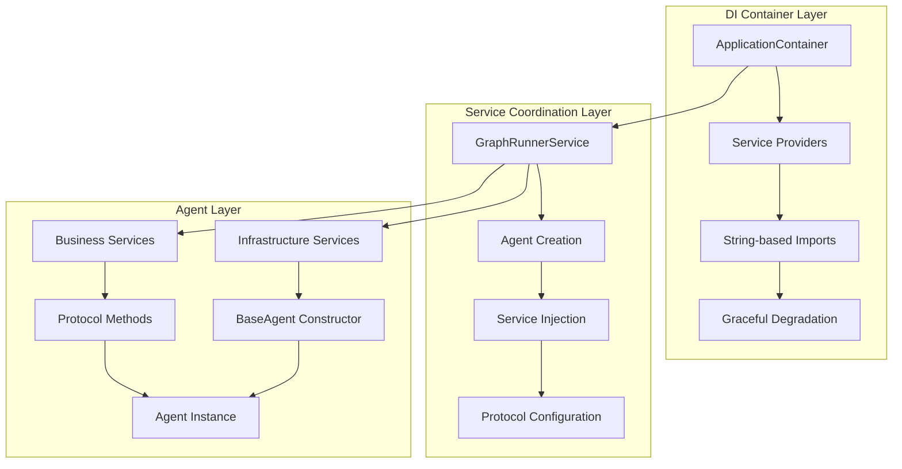
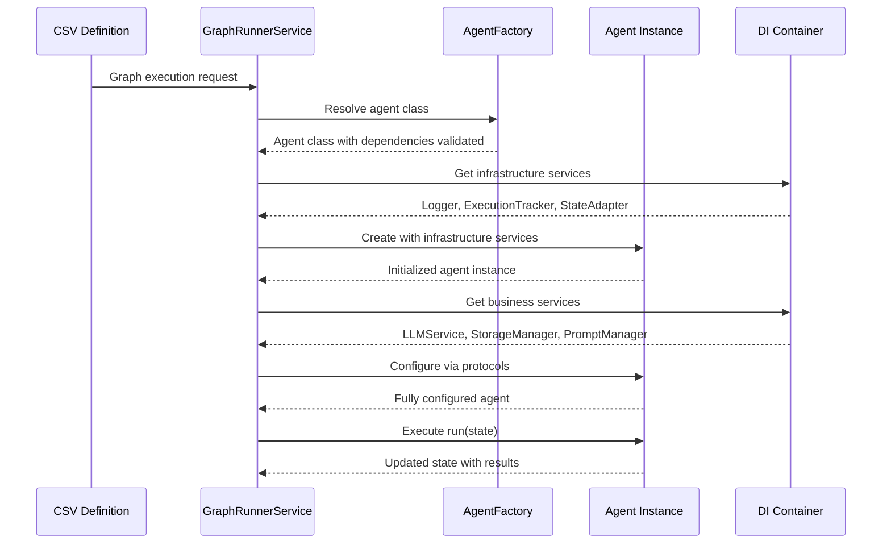

# Service Injection Patterns

This guide explains AgentMap's protocol-based dependency injection system, which provides clean separation between infrastructure and business services while maintaining flexibility and testability.

:::info Related Documentation
- [Agent Development Contract](./agent-development-contract) - Required agent interface and patterns
- [Advanced Agent Types](./advanced-agent-types) - Context configuration for services
- [Reference: Agent Types](../../reference/agent-types) - Built-in agents using service injection
:::

## Architecture Overview

AgentMap uses a sophisticated dependency injection architecture with clear layers and responsibilities:



## Service Architecture Layers

### Layer 1: Infrastructure Services
Core services that **ALL** agents need, injected via constructor:

- **Logger**: Centralized logging with agent context
- **ExecutionTrackingService**: Node execution tracking and performance monitoring  
- **StateAdapterService**: State management and data flow operations

### Layer 2: Business Services
Specialized services configured post-construction via protocols:

- **LLMService**: Language model operations and intelligent routing
- **StorageServiceManager**: Unified storage operations (CSV, JSON, vector, etc.)
- **PromptManagerService**: Template resolution and variable substitution

## Dependency Injection Container

### ApplicationContainer Architecture

The `ApplicationContainer` uses string-based providers to avoid circular dependencies and implements graceful degradation:

```python title="ApplicationContainer Structure" {9,16,25,37}
from dependency_injector import containers, providers

class ApplicationContainer(containers.DeclarativeContainer):
    """Main application container with clean string-based providers."""
    
    # LEVEL 1: Configuration Services
    config_service = providers.Singleton(
        "agentmap.services.config.config_service.ConfigService"
    )
    
    app_config_service = providers.Singleton(
        "agentmap.services.config.app_config_service.AppConfigService",
        config_service,
        config_path
    )
    
    # LEVEL 2: Infrastructure Services  
    logging_service = providers.Singleton(
        _create_and_initialize_logging_service,
        app_config_service
    )
    
    state_adapter_service = providers.Singleton(
        "agentmap.services.state_adapter_service.StateAdapterService"
    )
    
    execution_tracking_service = providers.Singleton(
        "agentmap.services.execution_tracking_service.ExecutionTrackingService",
        app_config_service,
        logging_service
    )
    
    # LEVEL 3: Business Services
    llm_service = providers.Singleton(
        "agentmap.services.llm_service.LLMService",
        app_config_service,
        logging_service,
        llm_routing_service
    )
    
    storage_service_manager = providers.Singleton(
        _create_storage_service_manager,
        storage_config_service,
        logging_service
    )
    
    # LEVEL 4: Coordination Services
    graph_runner_service = providers.Singleton(
        "agentmap.services.graph_runner_service.GraphRunnerService",
        # All services injected here
        graph_definition_service,
        graph_execution_service,
        # ... many other services
        llm_service,
        storage_service_manager,
        execution_tracking_service,
        state_adapter_service
    )
```

### Key Container Features

#### String-Based Providers
Avoid circular dependencies by using string imports:
```python title="String-Based Provider Example" {3}
# Instead of direct imports that cause cycles
llm_service = providers.Singleton(
    "agentmap.services.llm_service.LLMService",  # String import
    dependencies...
)
```

#### Graceful Degradation
Services handle missing dependencies gracefully:
```python title="Graceful Degradation Pattern" {6,9,16}
@staticmethod
def _create_storage_service_manager(storage_config_service, logging_service):
    """Create storage service with graceful failure handling."""
    try:
        if storage_config_service is None:
            logger = logging_service.get_logger("agentmap.storage")
            logger.info("Storage configuration not available - storage services disabled")
            return None
        
        from agentmap.services.storage.manager import StorageServiceManager
        return StorageServiceManager(storage_config_service, logging_service)
    except Exception as e:
        # Handle gracefully and continue without storage
        return None
```

## Service Injection Workflow

### Complete Injection Lifecycle



### GraphRunnerService Coordination

The `GraphRunnerService` orchestrates the entire injection process:

```python title="Complete Agent Creation with Service Injection" {6,16,29,38,48}
def _create_agent_instance(self, node, graph_name: str):
    """Create agent with complete service injection."""
    
    # Step 1: Resolve agent class using AgentFactory
    agent_cls = self._resolve_agent_class(node.agent_type)
    
    # Step 2: Create context with field information
    context = {
        "input_fields": node.inputs,
        "output_field": node.output,
        "description": node.description or ""
    }
    
    # Step 3: Inject infrastructure services via constructor
    agent_signature = inspect.signature(agent_cls.__init__)
    agent_params = list(agent_signature.parameters.keys())
    
    constructor_args = {
        "name": node.name,
        "prompt": node.prompt or "",
        "context": context,
        "logger": self.logger,
        "execution_tracker_service": self.execution_tracking_service.create_tracker(),
        "state_adapter_service": self.state_adapter_service
    }
    
    # Optional infrastructure services
    if "prompt_manager_service" in agent_params and self.prompt_manager_service:
        constructor_args["prompt_manager_service"] = self.prompt_manager_service
    
    agent_instance = agent_cls(**constructor_args)
    
    # Step 4: Configure business services via protocols
    self._configure_agent_services(agent_instance)
    
    return agent_instance

def _configure_agent_services(self, agent: Any) -> None:
    """Configure business services using protocol checking."""
    from agentmap.services.protocols import (
        LLMCapableAgent, StorageCapableAgent, PromptCapableAgent
    )
    
    if isinstance(agent, LLMCapableAgent):
        agent.configure_llm_service(self.llm_service)
        self.logger.debug(f"✅ Configured LLM service for {agent.name}")
    
    if isinstance(agent, StorageCapableAgent):
        agent.configure_storage_service(self.storage_service_manager)
        self.logger.debug(f"✅ Configured storage service for {agent.name}")
    
    if isinstance(agent, PromptCapableAgent):
        if self.prompt_manager_service:
            agent.configure_prompt_service(self.prompt_manager_service)
            self.logger.debug(f"✅ Configured prompt service for {agent.name}")
```

## Protocol-Based Service Configuration

### Agent Capability Protocols

Agents declare their service needs by implementing capability protocols:

```python title="Service Capability Protocols" {4,11,18}
from agentmap.services.protocols import (
    LLMCapableAgent, 
    StorageCapableAgent, 
    PromptCapableAgent
)

@runtime_checkable
class LLMCapableAgent(Protocol):
    """Protocol for agents that can use LLM services."""
    
    def configure_llm_service(self, llm_service: LLMServiceProtocol) -> None:
        """Configure LLM service for this agent."""
        ...

@runtime_checkable
class StorageCapableAgent(Protocol):
    """Protocol for agents that can use storage services."""
    
    def configure_storage_service(self, storage_service: StorageServiceProtocol) -> None:
        """Configure storage service for this agent."""
        ...

@runtime_checkable
class PromptCapableAgent(Protocol):
    """Protocol for agents that can use prompt manager services."""
    
    def configure_prompt_service(self, prompt_service: PromptManagerServiceProtocol) -> None:
        """Configure prompt manager service for this agent."""
        ...
```

## Complete Implementation Examples

### LLM-Capable Agent

```python title="Complete LLM Agent Implementation" {5,16,22,29,38,56}
from typing import Dict, Any, Optional
import logging
from agentmap.agents.base_agent import BaseAgent
from agentmap.services.execution_tracking_service import ExecutionTrackingService
from agentmap.services.state_adapter_service import StateAdapterService
from agentmap.services.protocols import LLMCapableAgent, LLMServiceProtocol

class MyLLMAgent(BaseAgent, LLMCapableAgent):
    """Agent that uses LLM services with modern injection pattern."""
    
    def __init__(
        self, 
        name: str, 
        prompt: str, 
        context: Optional[Dict[str, Any]] = None,
        # Infrastructure services
        logger: Optional[logging.Logger] = None,
        execution_tracker_service: Optional[ExecutionTrackingService] = None,
        state_adapter_service: Optional[StateAdapterService] = None
    ):
        """Initialize with infrastructure services."""
        super().__init__(
            name=name,
            prompt=prompt,
            context=context,
            logger=logger,
            execution_tracker_service=execution_tracker_service,
            state_adapter_service=state_adapter_service
        )
        
        # Configuration from context
        self.provider = self.context.get("provider", "anthropic")
        self.model = self.context.get("model", "claude-3-sonnet-20240229")
        self.temperature = self.context.get("temperature", 0.7)
        self.routing_enabled = self.context.get("routing_enabled", False)
    
    # Protocol implementation
    def configure_llm_service(self, llm_service: LLMServiceProtocol) -> None:
        """Configure LLM service for this agent."""
        self._llm_service = llm_service
        self.log_debug("LLM service configured")
    
    @property
    def llm_service(self) -> LLMServiceProtocol:
        """Get LLM service, raising if not configured."""
        if self._llm_service is None:
            raise ValueError(f"LLM service not configured for agent '{self.name}'")
        return self._llm_service
    
    def process(self, inputs: Dict[str, Any]) -> Any:
        """Process inputs using LLM service."""
        user_input = inputs.get("query", "")
        
        if self.routing_enabled:
            # Use intelligent routing
            routing_context = {
                "task_type": self.context.get("task_type", "general"),
                "complexity_override": self.context.get("complexity_override"),
                "cost_optimization": self.context.get("cost_optimization", True)
            }
            
            response = self.llm_service.call_llm(
                provider="auto",  # Will be determined by routing
                messages=[{"role": "user", "content": user_input}],
                routing_context=routing_context
            )
        else:
            # Use specified provider
            response = self.llm_service.call_llm(
                provider=self.provider,
                messages=[{"role": "user", "content": user_input}],
                model=self.model,
                temperature=self.temperature
            )
        
        return response
```

### Storage-Capable Agent

```python title="Complete Storage Agent Implementation" {5,16,22,29,37,44,50}
class MyStorageAgent(BaseAgent, StorageCapableAgent):
    """Agent that uses storage services with modern injection pattern."""
    
    def __init__(
        self, 
        name: str, 
        prompt: str, 
        context: Optional[Dict[str, Any]] = None,
        # Infrastructure services
        logger: Optional[logging.Logger] = None,
        execution_tracker_service: Optional[ExecutionTrackingService] = None,
        state_adapter_service: Optional[StateAdapterService] = None
    ):
        """Initialize with infrastructure services."""
        super().__init__(
            name=name,
            prompt=prompt,
            context=context,
            logger=logger,
            execution_tracker_service=execution_tracker_service,
            state_adapter_service=state_adapter_service
        )
        
        # Storage configuration from context
        self.storage_type = self.context.get("storage_type", "csv")
        self.collection_name = self.context.get("collection", "default")
    
    # Protocol implementation
    def configure_storage_service(self, storage_service: StorageServiceProtocol) -> None:
        """Configure storage service for this agent."""
        self._storage_service = storage_service
        self.log_debug("Storage service configured")
    
    @property
    def storage_service(self) -> StorageServiceProtocol:
        """Get storage service, raising if not configured."""
        if self._storage_service is None:
            raise ValueError(f"Storage service not configured for agent '{self.name}'")
        return self._storage_service
    
    def process(self, inputs: Dict[str, Any]) -> Any:
        """Process inputs using storage service."""
        operation = inputs.get("operation", "read")
        collection = inputs.get("collection", self.collection_name)
        
        if operation == "read":
            data = self.storage_service.read(collection)
            self.log_info(f"Read {len(data) if data else 0} items from {collection}")
            return data
        elif operation == "write":
            data = inputs.get("data", [])
            result = self.storage_service.write(collection, data)
            self.log_info(f"Wrote data to {collection}")
            return result
        else:
            raise ValueError(f"Unknown storage operation: {operation}")
```

### Multi-Protocol Agent

```python title="Multi-Protocol Agent Implementation" {1,5,18,22,33,36,40,46,66,86}
class MyAdvancedAgent(BaseAgent, LLMCapableAgent, StorageCapableAgent, PromptCapableAgent):
    """Agent implementing multiple protocols for comprehensive service access."""
    
    def __init__(
        self, 
        name: str, 
        prompt: str, 
        context: Optional[Dict[str, Any]] = None,
        # Infrastructure services
        logger: Optional[logging.Logger] = None,
        execution_tracker_service: Optional[ExecutionTrackingService] = None,
        state_adapter_service: Optional[StateAdapterService] = None,
        prompt_manager_service: Optional[Any] = None
    ):
        """Initialize with all infrastructure services."""
        super().__init__(
            name=name,
            prompt=prompt,
            context=context,
            logger=logger,
            execution_tracker_service=execution_tracker_service,
            state_adapter_service=state_adapter_service
        )
        
        # Store prompt manager service
        self._prompt_manager_service = prompt_manager_service
        
        # Resolve prompt if service available
        self.resolved_prompt = self._resolve_prompt(prompt)
    
    # LLM Protocol
    def configure_llm_service(self, llm_service: LLMServiceProtocol) -> None:
        self._llm_service = llm_service
        self.log_debug("LLM service configured")
    
    # Storage Protocol  
    def configure_storage_service(self, storage_service: StorageServiceProtocol) -> None:
        self._storage_service = storage_service
        self.log_debug("Storage service configured")
    
    # Prompt Protocol
    def configure_prompt_service(self, prompt_service: Any) -> None:
        if prompt_service and not self._prompt_manager_service:
            self._prompt_manager_service = prompt_service
            self.resolved_prompt = self._resolve_prompt(self.prompt)
            self.log_debug("Prompt service configured post-construction")
    
    def _resolve_prompt(self, prompt: str) -> str:
        """Resolve prompt using PromptManagerService if available."""
        if self._prompt_manager_service:
            try:
                return self._prompt_manager_service.resolve_prompt(prompt)
            except Exception as e:
                self.log_warning(f"Failed to resolve prompt: {e}")
        return prompt
    
    def process(self, inputs: Dict[str, Any]) -> Any:
        """Process with multiple services available."""
        # Load data from storage
        collection = inputs.get("collection", "data")
        data = self._storage_service.read(collection)
        
        # Process with LLM
        prompt_text = f"{self.resolved_prompt}\n\nData: {data}"
        llm_response = self._llm_service.call_llm(
            provider="anthropic",
            messages=[{"role": "user", "content": prompt_text}]
        )
        
        # Store result back to storage
        result_collection = inputs.get("result_collection", f"{collection}_processed")
        self._storage_service.write(result_collection, {
            "original_data": data,
            "llm_response": llm_response,
            "timestamp": "now"
        })
        
        return llm_response
    
    def _get_child_service_info(self) -> Optional[Dict[str, Any]]:
        """Provide service information for debugging."""
        return {
            "services": {
                "prompt_manager_available": self._prompt_manager_service is not None,
                "llm_service_configured": hasattr(self, '_llm_service'),
                "storage_service_configured": hasattr(self, '_storage_service')
            },
            "protocols": {
                "implements_llm_capable": True,
                "implements_storage_capable": True,
                "implements_prompt_capable": True
            },
            "configuration": {
                "prompt_resolved": self.resolved_prompt != self.prompt,
                "supports_multi_service": True
            }
        }
```

## Context Configuration for Services

### LLM Service Configuration

```yaml title="LLM Service Context Configuration"
# In CSV Context column or context dictionary
{
  "routing_enabled": true,
  "task_type": "analysis",
  "complexity_override": "high",
  "provider_preference": ["anthropic", "openai"],
  "excluded_providers": ["google"],
  "model_override": "claude-3-opus-20240229",
  "temperature": 0.3,
  "max_cost_tier": 3,
  "cost_optimization": true,
  "prefer_quality": true,
  "memory_key": "conversation_history",
  "max_memory_messages": 10
}
```

### Storage Service Configuration

```yaml title="Storage Service Context Configuration"
{
  "storage_type": "vector",
  "collection": "documents",
  "provider": "chroma",
  "embedding_model": "text-embedding-ada-002",
  "persist_directory": "./vector_db",
  "similarity_threshold": 0.8
}
```

### Prompt Service Configuration

```yaml title="Prompt Service Context Configuration"
{
  "prompt_template": "prompt:analysis_template",
  "variable_mapping": {
    "user_input": "query",
    "context_data": "background"
  },
  "template_format": "jinja2"
}
```

## Debugging and Troubleshooting

### Service Information Debugging

Use the `get_service_info()` method to diagnose service injection issues:

```python title="Service Information Debugging" {3}
# Get comprehensive service information
service_info = agent.get_service_info()
print(json.dumps(service_info, indent=2))

# Output example:
{
  "agent_name": "MyLLMAgent",
  "agent_type": "MyLLMAgent",
  "services": {
    "logger_available": true,
    "execution_tracker_available": true,
    "state_adapter_available": true,
    "llm_service_configured": true,
    "storage_service_configured": false,
    "prompt_manager_available": true
  },
  "protocols": {
    "implements_llm_capable": true,
    "implements_storage_capable": false,
    "implements_prompt_capable": true
  },
  "configuration": {
    "input_fields": ["query"],
    "output_field": "response",
    "description": "LLM processing agent"
  },
  "llm_configuration": {
    "routing_enabled": true,
    "provider_name": "auto",
    "model": null,
    "temperature": 0.7,
    "prompt_resolved": true
  }
}
```

### Common Service Injection Issues

#### Issue 1: Missing Infrastructure Services
**Error**: `ValueError: Logger not provided to agent 'MyAgent'`

**Cause**: Agent instantiated without required infrastructure services

**Solution**: Ensure GraphRunnerService provides all infrastructure services:
```python title="Correct Infrastructure Service Injection" {3}
# Correct instantiation
agent = MyAgent(
    name="test",
    prompt="test",
    context={},
    logger=logger,
    execution_tracker_service=tracker,
    state_adapter_service=state_adapter
)
```

#### Issue 2: Business Service Not Configured
**Error**: `ValueError: LLM service not configured for agent 'MyAgent'`

**Cause**: Agent implements LLMCapableAgent but service not configured

**Solution**: Verify protocol implementation and service configuration:
```python title="Business Service Configuration Verification" {2,5,10}
# Check protocol implementation
assert isinstance(agent, LLMCapableAgent)

# Configure service
agent.configure_llm_service(llm_service)

# Verify configuration
try:
    _ = agent.llm_service  # Should not raise
    print("LLM service properly configured")
except ValueError as e:
    print(f"Configuration issue: {e}")
```

#### Issue 3: Service Dependencies Missing
**Error**: Service creation fails with dependency errors

**Cause**: Required dependency services not available in container

**Solution**: Check container configuration and graceful degradation:
```python title="Service Dependency Verification" {4,10,13}
# Check service availability
container = ApplicationContainer()
try:
    llm_service = container.llm_service()
    print("LLM service available")
except Exception as e:
    print(f"LLM service unavailable: {e}")

# Check for graceful degradation
storage_manager = container.storage_service_manager()
if storage_manager is None:
    print("Storage services gracefully disabled")
```

### CLI Debugging Tools

Use the built-in CLI tools for service inspection:

```bash title="CLI Debugging Commands"
# Inspect graph with service information
agentmap inspect-graph my_workflow --config-details

# Check system dependencies  
agentmap diagnose

# Validate CSV and agent resolution
agentmap validate-csv --csv my_workflow.csv --check-agents
```

### Testing Service Injection

```python title="Complete Service Injection Test" {6,17,26,32,38}
def test_agent_service_injection():
    """Test complete service injection workflow."""
    from unittest.mock import Mock
    
    # Create mock services
    mock_logger = Mock()
    mock_tracker = Mock()
    mock_state_adapter = Mock()
    mock_llm_service = Mock()
    
    # Create agent with infrastructure services
    agent = MyLLMAgent(
        name="test",
        prompt="test prompt",
        context={"routing_enabled": True},
        logger=mock_logger,
        execution_tracker_service=mock_tracker,
        state_adapter_service=mock_state_adapter
    )
    
    # Verify infrastructure services
    assert agent.logger == mock_logger
    assert agent.execution_tracker_service == mock_tracker
    assert agent.state_adapter_service == mock_state_adapter
    
    # Verify protocol implementation
    assert isinstance(agent, LLMCapableAgent)
    
    # Configure business service
    agent.configure_llm_service(mock_llm_service)
    
    # Verify business service configuration
    assert agent.llm_service == mock_llm_service
    
    # Test service info debugging
    service_info = agent.get_service_info()
    assert service_info["services"]["llm_service_configured"] == True
    assert service_info["protocols"]["implements_llm_capable"] == True
```

## Best Practices

### Agent Development Guidelines

1. **Single Responsibility**: Each agent should have one clear purpose
2. **Protocol Implementation**: Only implement protocols for services you actually use
3. **Graceful Degradation**: Handle missing optional services gracefully
4. **Service Documentation**: Use `_get_child_service_info()` for debugging support
5. **Context Configuration**: Use context for service-specific configuration

### Service Configuration Guidelines

1. **Infrastructure vs Business**: Keep clear separation between infrastructure and business services
2. **Protocol-Based Design**: Use protocols for type-safe service configuration
3. **Lazy Loading**: Configure services only when needed
4. **Error Handling**: Provide clear error messages for service configuration issues
5. **Testing**: Mock services at the protocol level for clean unit tests

### Performance Considerations

1. **Singleton Services**: Most services are singletons for efficiency
2. **Service Reuse**: Same service instances are shared across agents
3. **Graceful Degradation**: Missing services don't block other functionality
4. **Lazy Initialization**: Services are created only when accessed

## Advanced Service Patterns

### Custom Service Protocols

Create your own service protocols for domain-specific functionality:

```python title="Custom Service Protocol" {4,9}
from typing import Protocol, runtime_checkable, Any
from abc import abstractmethod

@runtime_checkable
class CustomServiceProtocol(Protocol):
    """Protocol for agents that need custom domain functionality."""
    
    @abstractmethod
    def configure_custom_service(self, service: Any) -> None:
        """Configure custom service for this agent."""
        ...
```

### Service Composition

Combine multiple services for complex functionality:

```python title="Service Composition Pattern" {1,7,13,19}
class CompositeAgent(BaseAgent, LLMCapableAgent, StorageCapableAgent):
    """Agent that combines multiple service types."""
    
    def process(self, inputs: Dict[str, Any]) -> Any:
        # Load context from storage
        context_data = self.storage_service.read("context")
        
        # Use LLM with enhanced context
        enhanced_prompt = f"{self.prompt}\n\nContext: {context_data}"
        response = self.llm_service.call_llm(
            provider="anthropic",
            messages=[{"role": "user", "content": enhanced_prompt}]
        )
        
        # Store result for future use
        self.storage_service.write("results", {
            "response": response,
            "timestamp": "now"
        })
        
        return response
```

### Service Lifecycle Management

Handle service initialization and cleanup:

```python title="Service Lifecycle Management" {8,14,20}
class LifecycleAwareAgent(BaseAgent, CustomServiceProtocol):
    """Agent that manages service lifecycle."""
    
    def configure_custom_service(self, service: Any) -> None:
        self.custom_service = service
        
        # Initialize service state
        self.custom_service.initialize()
        self.log_info("Custom service initialized")
    
    def process(self, inputs: Dict[str, Any]) -> Any:
        # Use service with proper lifecycle
        try:
            result = self.custom_service.process(inputs)
            return result
        finally:
            # Cleanup if needed
            self.custom_service.cleanup()
```

The service injection system provides a robust, flexible foundation for agent development while maintaining clean architecture principles and enabling comprehensive testing and debugging capabilities.

## Next Steps

After understanding service injection:

1. **Learn Agent Contract**: Read [Agent Development Contract](./agent-development-contract) for required patterns and interfaces
2. **Configure Service Context**: Explore [Advanced Agent Types](./advanced-agent-types) for service-specific configuration options
3. **Study Built-in Examples**: Review [Reference: Agent Types](../../reference/agent-types) to see service injection in practice
4. **Build Custom Agents**: Check [Tutorial: Building Custom Agents](../../tutorials/building-custom-agents) for complete development examples with service injection
5. **Host Integration**: Learn [Host Service Integration](./host-service-integration) for extending AgentMap with custom services

:::tip Service Development
The service injection system is designed to be extensible. Start with AgentMap's built-in services and gradually add your own domain-specific services using the same patterns.
:::
