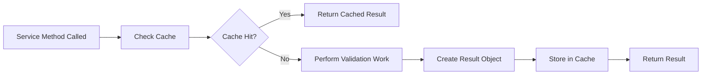

# Cache Service Integration Guide

<div style={{marginBottom: '1rem', fontSize: '0.9rem', color: '#666'}}>
  <span>📍 <a href="/docs/intro">AgentMap</a> → <a href="/docs/guides">Guides</a> → <a href="/docs/guides/development">Development</a> → <strong>Cache Service Integration</strong></span>
</div>

This guide provides complete instructions for integrating your services with AgentMap's **unified AvailabilityCacheService**. Learn the standard patterns, see practical examples, and avoid common pitfalls when building cache-integrated services.

:::tip Integration Success Pattern
The key to successful cache integration: **Services do the work, cache stores the results**. Always follow the check cache → do work → populate cache pattern for optimal performance and maintainability.
:::

## Integration Overview

### Standard Integration Pattern

Every cache-integrated service follows this consistent pattern:



### Core Integration Steps

1. **Dependency Injection**: Receive cache service in constructor
2. **Cache Check**: Always check cache first using categorized keys
3. **Work Performance**: Do actual validation/business logic on cache miss
4. **Result Enhancement**: Add metadata and timestamps to results
5. **Cache Population**: Store enriched results for future use
6. **Graceful Degradation**: Handle cache unavailability without failure

## Basic Service Integration

### Service Constructor Setup

```python
from typing import Optional, Dict, Any
from datetime import datetime, timezone
from agentmap.services.logging_service import LoggingService

class YourFeatureService:
    """Example service with cache integration."""
    
    def __init__(
        self,
        logging_service: LoggingService,
        availability_cache_service=None  # Optional dependency
    ):
        """Initialize with dependency injection."""
        self.logger = logging_service.get_class_logger(self)
        self.availability_cache = availability_cache_service
        
        # Log cache integration status
        cache_status = "enabled" if self.availability_cache else "disabled"
        self.logger.debug(f"YourFeatureService initialized with cache {cache_status}")
```

### Standard Check Method Template

```python
def check_feature_availability(self, feature_key: str) -> Dict[str, Any]:
    """
    Standard template for cache-integrated availability checking.
    
    Args:
        feature_key: Specific feature to check (e.g., 'openai', 'csv', 'firebase')
        
    Returns:
        Availability result with metadata
    """
    
    # 1. Check cache first
    cached_result = self._get_cached_availability("your_category", feature_key)
    if cached_result:
        self.logger.debug(f"Cache hit for feature: {feature_key}")
        return cached_result
    
    # 2. Perform actual validation work
    self.logger.debug(f"Cache miss, validating feature: {feature_key}")
    
    try:
        # This is where YOUR business logic goes
        is_available = self._perform_feature_validation(feature_key)
        
        # Create successful result
        validation_result = {
            "available": is_available,
            "validated_at": datetime.now(timezone.utc).isoformat(),
            "feature_key": feature_key,
            "validation_method": "your_method_name",
            "details": self._get_feature_details(feature_key)
        }
        
    except Exception as e:
        # Create failure result
        validation_result = {
            "available": False,
            "error": str(e),
            "validated_at": datetime.now(timezone.utc).isoformat(),
            "feature_key": feature_key,
            "validation_method": "your_method_name"
        }
        
        self.logger.warning(f"Feature validation failed for {feature_key}: {e}")
    
    # 3. Cache the result
    self._set_cached_availability("your_category", feature_key, validation_result)
    
    return validation_result

def _perform_feature_validation(self, feature_key: str) -> bool:
    """
    Implement your specific validation logic here.
    This method contains the actual work your service performs.
    """
    # Your business logic implementation
    pass

def _get_feature_details(self, feature_key: str) -> Dict[str, Any]:
    """
    Gather additional details about the feature for result enhancement.
    """
    # Your detail gathering logic
    return {"detail_key": "detail_value"}
```

### Cache Helper Methods

```python
def _get_cached_availability(self, category: str, key: str) -> Optional[Dict[str, Any]]:
    """Get cached availability using unified cache service."""
    if not self.availability_cache:
        return None
        
    try:
        result = self.availability_cache.get_availability(category, key)
        if result:
            self.logger.debug(f"Retrieved cached availability for {category}.{key}")
        return result
    except Exception as e:
        self.logger.debug(f"Cache lookup failed for {category}.{key}: {e}")
        return None

def _set_cached_availability(self, category: str, key: str, result: Dict[str, Any]) -> bool:
    """Set cached availability using unified cache service."""
    if not self.availability_cache:
        self.logger.debug(f"Cache not available, skipping storage for {category}.{key}")
        return False
        
    try:
        success = self.availability_cache.set_availability(category, key, result)
        if success:
            self.logger.debug(f"Cached availability for {category}.{key}")
        else:
            self.logger.warning(f"Failed to cache availability for {category}.{key}")
        return success
    except Exception as e:
        self.logger.debug(f"Cache storage failed for {category}.{key}: {e}")
        return False
```

## Real-World Integration Examples

### Dependency Checker Service Integration

```python
class DependencyCheckerService:
    """Real example from AgentMap's dependency checking service."""
    
    def __init__(
        self,
        logging_service: LoggingService,
        features_registry_service: FeaturesRegistryService,
        availability_cache_service=None
    ):
        self.logger = logging_service.get_class_logger(self)
        self.features_registry = features_registry_service
        self.availability_cache = availability_cache_service
        
        # Define dependency mappings
        self.LLM_DEPENDENCIES = {
            "openai": ["langchain_openai"],
            "anthropic": ["langchain_anthropic"],
            "google": ["langchain_google_genai"]
        }
        
        self.STORAGE_DEPENDENCIES = {
            "csv": ["pandas"],
            "vector": ["langchain", "chromadb"],
            "firebase": ["firebase_admin"]
        }
    
    def check_llm_dependency(self, provider: str) -> Dict[str, Any]:
        """Check LLM provider dependency availability with caching."""
        
        # 1. Check cache using categorized key
        cached_result = self._get_cached_availability("dependency.llm", provider)
        if cached_result:
            return cached_result
        
        # 2. Perform dependency validation
        required_packages = self.LLM_DEPENDENCIES.get(provider, [])
        if not required_packages:
            result = {
                "available": False,
                "error": f"Unknown LLM provider: {provider}",
                "validated_at": datetime.now(timezone.utc).isoformat(),
                "provider": provider
            }
        else:
            try:
                # Validate each required package
                missing_packages = []
                for package in required_packages:
                    if not self.check_dependency(package):
                        missing_packages.append(package)
                
                is_available = len(missing_packages) == 0
                
                result = {
                    "available": is_available,
                    "validated_at": datetime.now(timezone.utc).isoformat(),
                    "provider": provider,
                    "required_packages": required_packages,
                    "missing_packages": missing_packages,
                    "validation_method": "import_test"
                }
                
                if not is_available:
                    result["error"] = f"Missing packages: {', '.join(missing_packages)}"
                    
            except Exception as e:
                result = {
                    "available": False,
                    "error": str(e),
                    "validated_at": datetime.now(timezone.utc).isoformat(),
                    "provider": provider,
                    "validation_method": "import_test"
                }
        
        # 3. Cache the result
        self._set_cached_availability("dependency.llm", provider, result)
        
        # 4. Update features registry with result
        self.features_registry.update_llm_provider_status(provider, result["available"])
        
        return result
    
    def check_storage_dependency(self, storage_type: str) -> Dict[str, Any]:
        """Check storage dependency availability with caching."""
        
        cached_result = self._get_cached_availability("dependency.storage", storage_type)
        if cached_result:
            return cached_result
        
        required_packages = self.STORAGE_DEPENDENCIES.get(storage_type, [])
        
        try:
            missing_packages = []
            installed_versions = {}
            
            for package in required_packages:
                if self.check_dependency(package):
                    # Get version information if available
                    try:
                        mod = importlib.import_module(package)
                        if hasattr(mod, "__version__"):
                            installed_versions[package] = mod.__version__
                    except Exception:
                        pass
                else:
                    missing_packages.append(package)
            
            is_available = len(missing_packages) == 0
            
            result = {
                "available": is_available,
                "validated_at": datetime.now(timezone.utc).isoformat(),
                "storage_type": storage_type,
                "required_packages": required_packages,
                "missing_packages": missing_packages,
                "installed_versions": installed_versions,
                "validation_method": "import_test"
            }
            
            if not is_available:
                result["error"] = f"Missing packages: {', '.join(missing_packages)}"
                
        except Exception as e:
            result = {
                "available": False,
                "error": str(e),
                "validated_at": datetime.now(timezone.utc).isoformat(),
                "storage_type": storage_type,
                "validation_method": "import_test"
            }
        
        self._set_cached_availability("dependency.storage", storage_type, result)
        return result
```

### LLM Provider Service Integration

```python
class LLMProviderService:
    """Example LLM provider service with cache integration."""
    
    def __init__(self, logging_service, availability_cache_service=None):
        self.logger = logging_service.get_class_logger(self)
        self.availability_cache = availability_cache_service
        
        # Provider configuration
        self.PROVIDER_ENDPOINTS = {
            "openai": "https://api.openai.com/v1/models",
            "anthropic": "https://api.anthropic.com/v1/messages",
            "google": "https://generativelanguage.googleapis.com"
        }
    
    def check_provider_availability(self, provider: str) -> Dict[str, Any]:
        """Check if LLM provider API is available and accessible."""
        
        # Check cache first
        cached_result = self._get_cached_availability("llm_provider", provider)
        if cached_result:
            return cached_result
        
        # Perform API availability check
        endpoint = self.PROVIDER_ENDPOINTS.get(provider)
        if not endpoint:
            result = {
                "available": False,
                "error": f"Unknown provider: {provider}",
                "validated_at": datetime.now(timezone.utc).isoformat(),
                "provider": provider
            }
        else:
            try:
                # Attempt API connection test
                is_available, api_details = self._test_api_connection(provider, endpoint)
                
                result = {
                    "available": is_available,
                    "validated_at": datetime.now(timezone.utc).isoformat(),
                    "provider": provider,
                    "endpoint": endpoint,
                    "validation_method": "api_test",
                    "details": api_details
                }
                
                if not is_available:
                    result["error"] = api_details.get("error", "API unavailable")
                    
            except Exception as e:
                result = {
                    "available": False,
                    "error": str(e),
                    "validated_at": datetime.now(timezone.utc).isoformat(),
                    "provider": provider,
                    "endpoint": endpoint,
                    "validation_method": "api_test"
                }
        
        # Cache the result
        self._set_cached_availability("llm_provider", provider, result)
        return result
    
    def _test_api_connection(self, provider: str, endpoint: str) -> Tuple[bool, Dict[str, Any]]:
        """Test API connection and return availability status with details."""
        import requests
        
        try:
            # Quick connection test with timeout
            response = requests.get(endpoint, timeout=5)
            
            return True, {
                "status_code": response.status_code,
                "response_time_ms": response.elapsed.total_seconds() * 1000,
                "headers_present": "content-type" in response.headers
            }
        except requests.exceptions.Timeout:
            return False, {"error": "Connection timeout"}
        except requests.exceptions.ConnectionError:
            return False, {"error": "Connection failed"}
        except Exception as e:
            return False, {"error": str(e)}
```

### Storage Service Integration

```python
class StorageService:
    """Example storage service with cache integration."""
    
    def __init__(self, logging_service, availability_cache_service=None):
        self.logger = logging_service.get_class_logger(self)
        self.availability_cache = availability_cache_service
    
    def check_storage_availability(self, storage_type: str) -> Dict[str, Any]:
        """Check if storage type is available and functional."""
        
        cached_result = self._get_cached_availability("storage", storage_type)
        if cached_result:
            return cached_result
        
        # Dispatch to specific storage validation
        validation_methods = {
            "csv": self._validate_csv_storage,
            "json": self._validate_json_storage,
            "vector": self._validate_vector_storage,
            "firebase": self._validate_firebase_storage
        }
        
        validator = validation_methods.get(storage_type)
        if not validator:
            result = {
                "available": False,
                "error": f"Unsupported storage type: {storage_type}",
                "validated_at": datetime.now(timezone.utc).isoformat(),
                "storage_type": storage_type
            }
        else:
            try:
                result = validator()
                result.update({
                    "validated_at": datetime.now(timezone.utc).isoformat(),
                    "storage_type": storage_type
                })
            except Exception as e:
                result = {
                    "available": False,
                    "error": str(e),
                    "validated_at": datetime.now(timezone.utc).isoformat(),
                    "storage_type": storage_type
                }
        
        self._set_cached_availability("storage", storage_type, result)
        return result
    
    def _validate_csv_storage(self) -> Dict[str, Any]:
        """Validate CSV storage capabilities."""
        import pandas as pd
        import tempfile
        import os
        
        try:
            # Test CSV read/write operations
            with tempfile.NamedTemporaryFile(mode='w', suffix='.csv', delete=False) as temp_file:
                temp_path = temp_file.name
                
                # Test data
                test_data = pd.DataFrame({
                    'col1': [1, 2, 3],
                    'col2': ['a', 'b', 'c']
                })
                
                # Test write
                test_data.to_csv(temp_path, index=False)
                
                # Test read
                read_data = pd.read_csv(temp_path)
                
                # Cleanup
                os.unlink(temp_path)
                
                return {
                    "available": True,
                    "pandas_version": pd.__version__,
                    "test_operations": ["read", "write"],
                    "validation_method": "file_test"
                }
                
        except Exception as e:
            return {
                "available": False,
                "error": str(e),
                "validation_method": "file_test"
            }
    
    def _validate_vector_storage(self) -> Dict[str, Any]:
        """Validate vector storage capabilities."""
        try:
            import chromadb
            
            # Test in-memory vector database
            client = chromadb.Client()
            collection = client.create_collection("test_collection")
            
            # Test basic operations
            collection.add(
                documents=["test document"],
                ids=["test_id"]
            )
            
            results = collection.query(
                query_texts=["test"],
                n_results=1
            )
            
            return {
                "available": True,
                "chromadb_version": chromadb.__version__,
                "test_operations": ["create", "add", "query"],
                "validation_method": "memory_test"
            }
            
        except Exception as e:
            return {
                "available": False,
                "error": str(e),
                "validation_method": "memory_test"
            }
```

## Advanced Integration Patterns

### Cross-Service Cache Reuse

Services can benefit from cache entries created by other services:

```python
class OptimizedLLMService:
    """Example service that reuses dependency cache entries."""
    
    def get_provider_readiness(self, provider: str) -> Dict[str, Any]:
        """
        Check provider readiness by combining dependency and API availability.
        Demonstrates cross-service cache reuse pattern.
        """
        
        # First check if dependencies are available (from DependencyCheckerService)
        dependency_result = self._get_cached_availability("dependency.llm", provider)
        if dependency_result and not dependency_result.get("available", False):
            return {
                "ready": False,
                "reason": "Dependencies not available",
                "dependency_details": dependency_result,
                "checked_at": datetime.now(timezone.utc).isoformat()
            }
        
        # Then check API availability (from LLMProviderService)
        api_result = self._get_cached_availability("llm_provider", provider)
        if api_result and not api_result.get("available", False):
            return {
                "ready": False,
                "reason": "API not available",
                "api_details": api_result,
                "dependency_details": dependency_result,
                "checked_at": datetime.now(timezone.utc).isoformat()
            }
        
        # Both checks passed or need fresh validation
        return {
            "ready": True,
            "dependency_available": dependency_result.get("available", False),
            "api_available": api_result.get("available", False),
            "dependency_details": dependency_result,
            "api_details": api_result,
            "checked_at": datetime.now(timezone.utc).isoformat()
        }
```

### Bulk Operations with Caching

```python
class BatchValidationService:
    """Example service demonstrating bulk operations with caching."""
    
    def validate_multiple_dependencies(self, providers: List[str]) -> Dict[str, Dict[str, Any]]:
        """Validate multiple providers efficiently using cache."""
        
        results = {}
        cache_hits = 0
        cache_misses = 0
        
        for provider in providers:
            # Check cache first
            cached_result = self._get_cached_availability("dependency.llm", provider)
            if cached_result:
                results[provider] = cached_result
                cache_hits += 1
            else:
                # Perform validation for cache miss
                validation_result = self._validate_single_dependency(provider)
                results[provider] = validation_result
                
                # Cache the result
                self._set_cached_availability("dependency.llm", provider, validation_result)
                cache_misses += 1
        
        # Add summary statistics
        results["_summary"] = {
            "total_providers": len(providers),
            "cache_hits": cache_hits,
            "cache_misses": cache_misses,
            "cache_hit_rate": cache_hits / len(providers) if providers else 0,
            "validated_at": datetime.now(timezone.utc).isoformat()
        }
        
        return results
```

### Cache Invalidation Integration

```python
class ConfigAwareService:
    """Example service that triggers cache invalidation on config changes."""
    
    def __init__(self, logging_service, config_service, availability_cache_service=None):
        self.logger = logging_service.get_class_logger(self)
        self.config_service = config_service
        self.availability_cache = availability_cache_service
        
        # Register config files for automatic invalidation
        if self.availability_cache:
            config_files = self.config_service.get_config_file_paths()
            for config_file in config_files:
                self.availability_cache.register_config_file(config_file)
    
    def update_configuration(self, new_config: Dict[str, Any]) -> bool:
        """Update configuration and invalidate related cache entries."""
        
        try:
            # Update configuration
            success = self.config_service.update_config(new_config)
            
            if success and self.availability_cache:
                # Invalidate cache entries that depend on this config
                affected_categories = self._get_affected_cache_categories(new_config)
                
                for category in affected_categories:
                    self.availability_cache.invalidate_cache(category)
                    self.logger.info(f"Invalidated cache category: {category}")
            
            return success
            
        except Exception as e:
            self.logger.error(f"Configuration update failed: {e}")
            return False
    
    def _get_affected_cache_categories(self, config_changes: Dict[str, Any]) -> List[str]:
        """Determine which cache categories are affected by config changes."""
        affected = []
        
        if "llm_providers" in config_changes:
            affected.extend(["dependency.llm", "llm_provider"])
        
        if "storage_config" in config_changes:
            affected.extend(["dependency.storage", "storage"])
        
        if "api_keys" in config_changes:
            affected.append("llm_provider")
        
        return affected
```

## Testing Cache-Integrated Services

### Unit Testing Patterns

```python
import unittest
from unittest.mock import Mock, patch
from datetime import datetime, timezone

class TestYourCacheIntegratedService(unittest.TestCase):
    
    def setUp(self):
        """Set up test fixtures."""
        self.mock_logger = Mock()
        self.mock_cache = Mock()
        
        # Initialize service with mocked dependencies
        self.service = YourFeatureService(
            logging_service=self.mock_logger,
            availability_cache_service=self.mock_cache
        )
    
    def test_cache_hit_scenario(self):
        """Test service behavior when cache hit occurs."""
        # Arrange
        expected_result = {
            "available": True,
            "validated_at": datetime.now(timezone.utc).isoformat(),
            "feature_key": "test_feature"
        }
        
        self.mock_cache.get_availability.return_value = expected_result
        
        # Act
        result = self.service.check_feature_availability("test_feature")
        
        # Assert
        self.assertEqual(result, expected_result)
        self.mock_cache.get_availability.assert_called_once_with("your_category", "test_feature")
        self.mock_cache.set_availability.assert_not_called()  # No cache write on hit
    
    def test_cache_miss_scenario(self):
        """Test service behavior when cache miss occurs."""
        # Arrange
        self.mock_cache.get_availability.return_value = None  # Cache miss
        self.mock_cache.set_availability.return_value = True
        
        # Act
        result = self.service.check_feature_availability("test_feature")
        
        # Assert
        self.assertTrue(result["available"] in [True, False])  # Should have availability result
        self.assertIn("validated_at", result)
        self.assertEqual(result["feature_key"], "test_feature")
        
        # Verify cache operations
        self.mock_cache.get_availability.assert_called_once_with("your_category", "test_feature")
        self.mock_cache.set_availability.assert_called_once()
    
    def test_cache_unavailable_graceful_degradation(self):
        """Test service behavior when cache service is unavailable."""
        # Arrange
        service_without_cache = YourFeatureService(
            logging_service=self.mock_logger,
            availability_cache_service=None  # No cache service
        )
        
        # Act
        result = service_without_cache.check_feature_availability("test_feature")
        
        # Assert
        self.assertIsNotNone(result)  # Service should still work
        self.assertIn("available", result)
        self.assertIn("validated_at", result)
    
    def test_cache_error_handling(self):
        """Test service behavior when cache operations fail."""
        # Arrange
        self.mock_cache.get_availability.side_effect = Exception("Cache error")
        self.mock_cache.set_availability.return_value = False
        
        # Act
        result = self.service.check_feature_availability("test_feature")
        
        # Assert
        self.assertIsNotNone(result)  # Service should still work despite cache errors
        self.assertIn("available", result)
```

### Integration Testing

```python
class TestCacheIntegrationE2E(unittest.TestCase):
    """End-to-end integration tests with real cache service."""
    
    def setUp(self):
        """Set up real cache service for integration testing."""
        import tempfile
        from pathlib import Path
        from agentmap.services.config.availability_cache_service import AvailabilityCacheService
        
        # Create temporary cache file
        self.temp_dir = tempfile.mkdtemp()
        self.cache_file_path = Path(self.temp_dir) / "test_cache.json"
        
        # Real cache service
        self.cache_service = AvailabilityCacheService(
            cache_file_path=self.cache_file_path,
            logger=Mock()
        )
        
        # Service with real cache
        self.service = YourFeatureService(
            logging_service=Mock(),
            availability_cache_service=self.cache_service
        )
    
    def tearDown(self):
        """Clean up test fixtures."""
        import shutil
        shutil.rmtree(self.temp_dir, ignore_errors=True)
    
    def test_full_cache_lifecycle(self):
        """Test complete cache lifecycle with real cache service."""
        feature_key = "integration_test_feature"
        
        # First call should be cache miss
        result1 = self.service.check_feature_availability(feature_key)
        self.assertIsNotNone(result1)
        
        # Second call should be cache hit
        result2 = self.service.check_feature_availability(feature_key)
        self.assertEqual(result1["validated_at"], result2["validated_at"])  # Same timestamp = cache hit
        
        # Invalidate cache
        self.cache_service.invalidate_cache("your_category", feature_key)
        
        # Third call should be cache miss again
        result3 = self.service.check_feature_availability(feature_key)
        self.assertNotEqual(result1["validated_at"], result3["validated_at"])  # Different timestamp = fresh validation
```

## Performance Optimization

### Cache Hit Rate Optimization

```python
class PerformanceOptimizedService:
    """Example service with cache performance optimizations."""
    
    def __init__(self, logging_service, availability_cache_service=None):
        self.logger = logging_service.get_class_logger(self)
        self.availability_cache = availability_cache_service
        
        # Performance tracking
        self._cache_stats = {
            "hits": 0,
            "misses": 0,
            "errors": 0
        }
    
    def check_with_fallback_optimization(self, feature_key: str) -> Dict[str, Any]:
        """
        Optimized check with intelligent fallback to related cache entries.
        """
        
        # Primary cache check
        result = self._get_cached_availability("primary_category", feature_key)
        if result:
            self._cache_stats["hits"] += 1
            return result
        
        # Fallback: check related categories that might have useful info
        fallback_categories = [
            f"dependency.{feature_key}",
            f"related.{feature_key}",
            f"backup.{feature_key}"
        ]
        
        for category in fallback_categories:
            related_result = self._get_cached_availability(category, feature_key)
            if related_result:
                # Adapt related result for current use
                adapted_result = self._adapt_related_result(related_result, feature_key)
                if adapted_result:
                    self._cache_stats["hits"] += 1
                    return adapted_result
        
        # No cache hits, perform fresh validation
        self._cache_stats["misses"] += 1
        return self._perform_fresh_validation(feature_key)
    
    def get_cache_performance_stats(self) -> Dict[str, Any]:
        """Get cache performance statistics for monitoring."""
        total_requests = self._cache_stats["hits"] + self._cache_stats["misses"]
        hit_rate = self._cache_stats["hits"] / total_requests if total_requests > 0 else 0
        
        return {
            "cache_hits": self._cache_stats["hits"],
            "cache_misses": self._cache_stats["misses"],
            "cache_errors": self._cache_stats["errors"],
            "hit_rate_percentage": hit_rate * 100,
            "total_requests": total_requests
        }
```

### Bulk Cache Operations

```python
def validate_multiple_features_optimized(self, feature_keys: List[str]) -> Dict[str, Dict[str, Any]]:
    """Optimized bulk validation with batch cache operations."""
    
    results = {}
    to_validate = []
    
    # Batch cache check
    for feature_key in feature_keys:
        cached_result = self._get_cached_availability("your_category", feature_key)
        if cached_result:
            results[feature_key] = cached_result
        else:
            to_validate.append(feature_key)
    
    # Batch validation for cache misses
    if to_validate:
        fresh_results = self._batch_validate_features(to_validate)
        
        # Batch cache storage
        for feature_key, result in fresh_results.items():
            results[feature_key] = result
            self._set_cached_availability("your_category", feature_key, result)
    
    return results

def _batch_validate_features(self, feature_keys: List[str]) -> Dict[str, Dict[str, Any]]:
    """Perform batch validation more efficiently than individual calls."""
    # Implement your batch validation logic here
    # This might involve parallel processing, single API calls for multiple items, etc.
    pass
```

## Common Integration Pitfalls

### ❌ Anti-Patterns to Avoid

**1. Cache Service Performing Business Logic**:
```python
# DON'T do this - cache shouldn't perform validation
def check_dependency(self, package):
    if self.availability_cache:
        return self.availability_cache.validate_package(package)  # Wrong!
```

**2. Ignoring Cache Failures**:
```python
# DON'T do this - handle cache failures gracefully
def check_feature(self, feature):
    result = self.availability_cache.get_availability("category", feature)
    return result["available"]  # Wrong! Could be None
```

**3. Inconsistent Key Naming**:
```python
# DON'T do this - use consistent categorized keys
self.cache.get_availability("deps", "openai")        # Inconsistent
self.cache.get_availability("dep_llm", "anthropic")  # Inconsistent
self.cache.get_availability("llm_dep", "google")     # Inconsistent

# DO this - consistent categorized naming
self.cache.get_availability("dependency.llm", "openai")
self.cache.get_availability("dependency.llm", "anthropic")
self.cache.get_availability("dependency.llm", "google")
```

**4. Missing Error Handling**:
```python
# DON'T do this - no error handling
def _get_cached_availability(self, category, key):
    return self.availability_cache.get_availability(category, key)  # Wrong!

# DO this - proper error handling
def _get_cached_availability(self, category, key):
    if not self.availability_cache:
        return None
    try:
        return self.availability_cache.get_availability(category, key)
    except Exception as e:
        self.logger.debug(f"Cache access failed: {e}")
        return None
```

### ✅ Best Practices Summary

1. **Always Check Cache First**: Never skip cache check even if you think it's unlikely to hit
2. **Handle Cache Unavailability**: Service should work even without cache
3. **Use Consistent Categories**: Follow the established categorized key patterns
4. **Enrich Results with Metadata**: Include timestamps, validation methods, and details
5. **Log Cache Operations**: Debug-level logging for cache hits/misses helps with troubleshooting
6. **Graceful Error Handling**: Cache errors should never break service functionality
7. **Performance Monitoring**: Track cache hit rates and optimization opportunities

## Related Documentation

### 🏗️ **Architecture Documentation**
- **[Unified Availability Cache Architecture](../../contributing/architecture/unified-availability-cache)**: Complete architectural overview
- **[Service Integration Patterns](../../contributing/service-injection)**: General service integration guidelines

### 🔧 **Development Guides**
- **[Testing Patterns](testing)**: Testing cache-integrated services
- **[Best Practices](best-practices)**: General development best practices
- **[Error Handling](error-handling)**: Comprehensive error handling strategies

### 🚀 **Operations Guides**
- **[Cache Management](../../deployment/cache-management)**: Administrative cache management
- **[Performance Optimization](../../guides/performance/optimization)**: System performance tuning
- **[Troubleshooting](../../guides/troubleshooting)**: Common issues and solutions

### 📖 **Reference Documentation**
- **[Configuration Reference](/docs/reference/configuration)**: Cache configuration options
- **[API Reference](/docs/reference/api)**: Complete API documentation

## Next Steps

1. **Implement Basic Integration**: Start with the standard template for your service
2. **Add Error Handling**: Implement comprehensive error handling and graceful degradation
3. **Write Tests**: Create unit and integration tests for your cache integration
4. **Monitor Performance**: Track cache hit rates and optimize based on usage patterns
5. **Consider Advanced Patterns**: Implement cross-service cache reuse and bulk operations as needed

The unified cache service provides a powerful foundation for high-performance availability checking across all AgentMap services. Follow these patterns for optimal integration success!
