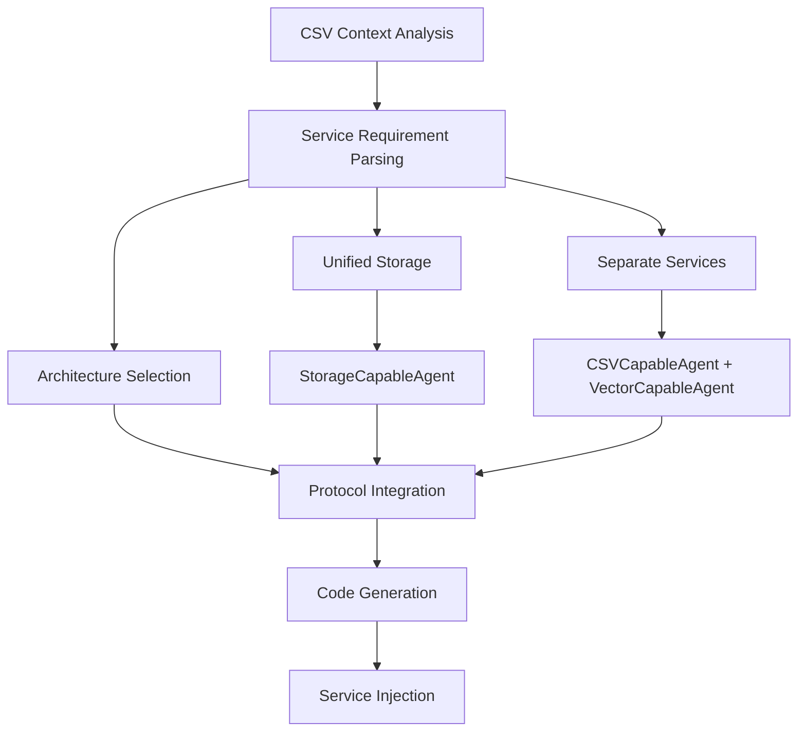

# Service Integration with Scaffolding

AgentMap's **service-aware scaffolding system** automatically integrates services into your agents based on CSV context configuration. This guide covers how to leverage scaffolding for sophisticated multi-service agent development with LLM, storage, vector, and memory services.

:::tip Why Service Integration Matters
Service integration allows agents to leverage external capabilities like AI models, databases, and storage systems. The scaffolding system makes this **10x easier** by automatically generating the correct protocol inheritance, service injection, and usage patterns.
:::

## Service Integration Architecture

### Service-Aware Scaffolding Flow



### Service Categories

**Core Services:**
- **LLM Services**: OpenAI, Anthropic, Google language models
- **Storage Services**: CSV, JSON, File, Vector, Memory operations
- **Memory Services**: Conversation history, session management
- **Vector Services**: Semantic search, embeddings, similarity
- **Node Registry**: Dynamic routing, graph metadata access

## LLM Service Integration

### Basic LLM Integration

**CSV Configuration:**
```csv
graph_name,node_name,agent_type,context,input_fields,output_field,prompt
AIWorkflow,Analyzer,IntelligentAnalyzer,"{""services"": [""llm""]}",user_query,analysis,"Analyze: {user_query}"
```

**Generated Agent:**
```python
from agentmap.agents.base_agent import BaseAgent
from agentmap.services.protocols import LLMCapableAgent
from typing import Dict, Any

class IntelligentAnalyzerAgent(BaseAgent, LLMCapableAgent):
    """
    Analyze: {user_query} with LLM capabilities
    
    Available Services:
    - self.llm_service: LLM service for calling language models
    """
    
    def __init__(self):
        super().__init__()
        self.llm_service: LLMServiceProtocol = None
    
    def process(self, inputs: Dict[str, Any]) -> Any:
        user_query_value = inputs.get("user_query")
        
        # LLM SERVICE:
        if hasattr(self, 'llm_service') and self.llm_service:
            response = self.llm_service.call_llm(
                provider="openai",  # or "anthropic", "google"
                messages=[{"role": "user", "content": user_query_value}],
                model="gpt-4"  # optional
            )
            return response.get("content")
        
        return f"Basic analysis of {user_query_value}"
```

### Advanced LLM Patterns

**Multi-Provider Strategy:**
```python
class AdvancedLLMAgent(BaseAgent, LLMCapableAgent):
    def process(self, inputs: Dict[str, Any]) -> Any:
        query = inputs.get("query")
        provider_strategy = inputs.get("provider", "openai")
        
        # Provider-specific configurations
        provider_configs = {
            "openai": {"model": "gpt-4", "temperature": 0.7},
            "anthropic": {"model": "claude-3-opus-20240229", "temperature": 0.5},
            "google": {"model": "gemini-pro", "temperature": 0.6}
        }
        
        config = provider_configs.get(provider_strategy, provider_configs["openai"])
        
        response = self.llm_service.call_llm(
            provider=provider_strategy,
            messages=[{"role": "user", "content": query}],
            **config
        )
        
        return {
            "response": response.get("content"),
            "provider_used": provider_strategy,
            "model": config["model"]
        }
```

**Memory-Enhanced LLM:**
```python
class MemoryEnhancedLLMAgent(BaseAgent, LLMCapableAgent, MemoryCapableAgent):
    def process(self, inputs: Dict[str, Any]) -> Any:
        current_message = inputs.get("message")
        session_id = inputs.get("session_id", "default")
        
        # Retrieve conversation history
        conversation_history = []
        if hasattr(self, 'memory_service') and self.memory_service:
            history = self.memory_service.get(f"conversation_{session_id}")
            if history:
                conversation_history = history.get("messages", [])
        
        # Build message context
        messages = conversation_history + [{"role": "user", "content": current_message}]
        
        # Generate response
        response = self.llm_service.call_llm(
            provider="anthropic",
            messages=messages,
            model="claude-3-opus-20240229"
        )
        
        # Update conversation history
        if hasattr(self, 'memory_service') and self.memory_service:
            conversation_history.append({"role": "user", "content": current_message})
            conversation_history.append({"role": "assistant", "content": response.get("content")})
            
            self.memory_service.set(f"conversation_{session_id}", {
                "messages": conversation_history[-20:],  # Keep last 20 messages
                "updated": datetime.now().isoformat()
            })
        
        return response.get("content")
```

## Storage Service Integration

### Unified Storage Architecture

When you request `"storage"` in your context, the scaffolding system generates agents with unified storage access:

**CSV Configuration:**
```csv
Context
"{""services"": [""storage""]}"
```

**Generated Agent:**
```python
class UnifiedStorageAgent(BaseAgent, StorageCapableAgent):
    def __init__(self):
        super().__init__()
        self.storage_service: StorageServiceProtocol = None
    
    def process(self, inputs: Dict[str, Any]) -> Any:
        data = inputs.get("data")
        
        # Unified interface for all storage types
        if hasattr(self, 'storage_service') and self.storage_service:
            # Read from different storage types
            csv_data = self.storage_service.read("csv", "input.csv")
            json_config = self.storage_service.read("json", "config.json")
            
            # Process and write to different formats
            processed_result = self._process_data(data, csv_data, json_config)
            
            # Write results
            self.storage_service.write("json", "results.json", processed_result)
            self.storage_service.write("csv", "summary.csv", self._to_csv_format(processed_result))
            
            return processed_result
        
        return {"error": "Storage service not available"}
```

### Separate Storage Services

When you request specific storage types, the scaffolding system generates agents with dedicated service protocols:

**CSV Configuration:**
```csv
Context
"{""services"": [""csv"", ""json"", ""vector""]}"
```

**Generated Agent:**
```python
class MultiStorageAgent(BaseAgent, CSVCapableAgent, JSONCapableAgent, VectorCapableAgent):
    def __init__(self):
        super().__init__()
        self.csv_service: Any = None  # CSV storage service
        self.json_service: Any = None  # JSON storage service
        self.vector_service: Any = None  # Vector storage service
    
    def process(self, inputs: Dict[str, Any]) -> Any:
        query = inputs.get("query")
        
        # CSV operations
        if hasattr(self, 'csv_service') and self.csv_service:
            csv_data = self.csv_service.read("training_data.csv")
        
        # JSON operations
        if hasattr(self, 'json_service') and self.json_service:
            config = self.json_service.read("model_config.json")
        
        # Vector operations
        if hasattr(self, 'vector_service') and self.vector_service:
            similar_docs = self.vector_service.search(
                collection="knowledge_base",
                query=query,
                limit=5
            )
        
        # Process and combine results
        result = self._combine_data_sources(csv_data, config, similar_docs, query)
        
        # Store results
        self.json_service.write("analysis_results.json", result)
        
        return result
```

## Vector Service Integration

### Semantic Search Agents

**CSV Configuration:**
```csv
graph_name,node_name,agent_type,context,input_fields,output_field,prompt
SearchWorkflow,SemanticSearch,DocumentRetriever,"{""services"": [""vector""]}",search_query,relevant_docs,"Find docs for: {search_query}"
```

**Generated Agent:**
```python
class DocumentRetrieverAgent(BaseAgent, VectorCapableAgent):
    def process(self, inputs: Dict[str, Any]) -> Any:
        search_query = inputs.get("search_query")
        
        if hasattr(self, 'vector_service') and self.vector_service:
            # Semantic search
            relevant_docs = self.vector_service.search(
                collection="documents",
                query=search_query,
                limit=10
            )
            
            # Format results
            formatted_results = []
            for doc in relevant_docs:
                formatted_results.append({
                    "content": doc.get("content", ""),
                    "metadata": doc.get("metadata", {}),
                    "similarity_score": doc.get("score", 0.0)
                })
            
            return {
                "query": search_query,
                "results": formatted_results,
                "total_found": len(formatted_results)
            }
        
        return {"error": "Vector service not available"}
```

### RAG (Retrieval-Augmented Generation) Patterns

**Multi-Service RAG Agent:**
```csv
Context
"{""services"": [""llm"", ""vector"", ""storage""]}"
```

**Enhanced Implementation:**
```python
class RAGAgent(BaseAgent, LLMCapableAgent, VectorCapableAgent, StorageCapableAgent):
    def process(self, inputs: Dict[str, Any]) -> Any:
        user_question = inputs.get("question")
        
        # 1. Vector search for relevant context
        relevant_context = []
        if hasattr(self, 'vector_service') and self.vector_service:
            search_results = self.vector_service.search(
                collection="knowledge_base",
                query=user_question,
                limit=5
            )
            relevant_context = [doc.get("content", "") for doc in search_results]
        
        # 2. Build RAG prompt
        context_text = "\\n\\n".join(relevant_context)
        rag_prompt = f\"\"\"\n        Context information:\n        {context_text}\n        \n        Question: {user_question}\n        \n        Please answer the question based on the provided context. If the context doesn't contain enough information, say so.\n        \"\"\"\n        \n        # 3. Generate response with LLM\n        response = None\n        if hasattr(self, 'llm_service') and self.llm_service:\n            llm_response = self.llm_service.call_llm(\n                provider="anthropic",\n                messages=[{"role": "user", "content": rag_prompt}],\n                model="claude-3-opus-20240229"\n            )\n            response = llm_response.get("content")\n        \n        # 4. Store interaction for analytics\n        if hasattr(self, 'storage_service') and self.storage_service:\n            interaction_data = {\n                "timestamp": datetime.now().isoformat(),\n                "question": user_question,\n                "context_sources": len(relevant_context),\n                "response": response,\n                "retrieval_results": search_results\n            }\n            \n            self.storage_service.write(\n                "json",\n                f"rag_interactions/{hash(user_question)}.json",\n                interaction_data\n            )\n        \n        return {\n            "answer": response,\n            "sources_used": len(relevant_context),\n            "confidence": "high" if len(relevant_context) >= 3 else "medium"\n        }\n```

## Memory Service Integration

### Session Management

**CSV Configuration:**
```csv
Context  
"{""services"": [""memory"", ""llm""]}"
```

**Generated Agent:**
```python
class SessionAwareAgent(BaseAgent, MemoryCapableAgent, LLMCapableAgent):
    def process(self, inputs: Dict[str, Any]) -> Any:
        user_input = inputs.get("input")
        session_id = inputs.get("session_id", "default_session")
        
        # Initialize or retrieve session state
        session_state = self._get_session_state(session_id)\n        \n        # Update session with new input\n        session_state["interaction_count"] += 1\n        session_state["last_inputs"].append(user_input)\n        session_state["last_inputs"] = session_state["last_inputs"][-10:]  # Keep last 10\n        \n        # Generate contextual response\n        context_prompt = f\"\"\"\n        Session Context:\n        - Interaction #{session_state["interaction_count"]}\n        - Previous inputs: {session_state["last_inputs"]}\n        - User preferences: {session_state.get("preferences", {})}\n        \n        Current input: {user_input}\n        \n        Respond appropriately considering the session context.\n        \"\"\"\n        \n        response = self.llm_service.call_llm(\n            provider="openai",\n            messages=[{"role": "user", "content": context_prompt}],\n            model="gpt-4"\n        )\n        \n        # Update session state\n        session_state["last_response"] = response.get("content")\n        self._save_session_state(session_id, session_state)\n        \n        return {\n            "response": response.get("content"),\n            "session_info": {\n                "interaction_count": session_state["interaction_count"],\n                "session_id": session_id\n            }\n        }\n    \n    def _get_session_state(self, session_id: str) -> dict:\n        \"\"\"Retrieve or initialize session state\"\"\"\n        if hasattr(self, 'memory_service') and self.memory_service:\n            session_data = self.memory_service.get(f"session_{session_id}")\n            if session_data:\n                return session_data\n        \n        # Initialize new session\n        return {\n            "interaction_count": 0,\n            "last_inputs": [],\n            "preferences": {},\n            "created_at": datetime.now().isoformat()\n        }\n    \n    def _save_session_state(self, session_id: str, state: dict):\n        \"\"\"Save session state to memory\"\"\"\n        if hasattr(self, 'memory_service') and self.memory_service:\n            state["updated_at"] = datetime.now().isoformat()\n            self.memory_service.set(f"session_{session_id}", state)\n```

## Multi-Service Agent Patterns

### Comprehensive AI Agent

**Ultimate Service Integration:**
```csv
Context\n"{""services"": [""llm"", ""vector"", ""storage"", ""memory"", ""node_registry""]}"
```

**Generated Foundation:**
```python
class ComprehensiveAIAgent(BaseAgent, LLMCapableAgent, VectorCapableAgent, StorageCapableAgent, MemoryCapableAgent, NodeRegistryUser):
    \"\"\"
    Agent with access to all service types for maximum flexibility
    \"\"\"\n    \n    def process(self, inputs: Dict[str, Any]) -> Any:\n        task_type = inputs.get("task_type", "general")\n        user_input = inputs.get("input")\n        session_id = inputs.get("session_id", "default")\n        \n        # Route based on task type using node registry\n        if hasattr(self, 'node_registry') and self.node_registry:\n            available_specialists = self._get_available_specialists()\n            if task_type in available_specialists:\n                return available_specialists[task_type]\n        \n        # Default comprehensive processing\n        return self._comprehensive_processing(user_input, session_id)\n    \n    def _comprehensive_processing(self, user_input: str, session_id: str) -> dict:\n        result = {"processing_stages": []}\n        \n        # Stage 1: Memory retrieval\n        if hasattr(self, 'memory_service') and self.memory_service:\n            context = self.memory_service.get(f"context_{session_id}") or {}\n            result["processing_stages"].append("memory_retrieved")\n        \n        # Stage 2: Vector search for relevant information\n        if hasattr(self, 'vector_service') and self.vector_service:\n            relevant_docs = self.vector_service.search(\n                collection="knowledge_base",\n                query=user_input,\n                limit=3\n            )\n            context["relevant_docs"] = relevant_docs\n            result["processing_stages"].append("vector_search_completed")\n        \n        # Stage 3: LLM processing with full context\n        if hasattr(self, 'llm_service') and self.llm_service:\n            enhanced_prompt = self._build_enhanced_prompt(user_input, context)\n            \n            llm_response = self.llm_service.call_llm(\n                provider="anthropic",\n                messages=[{"role": "user", "content": enhanced_prompt}],\n                model="claude-3-opus-20240229"\n            )\n            \n            result["response"] = llm_response.get("content")\n            result["processing_stages"].append("llm_processing_completed")\n        \n        # Stage 4: Storage for analytics and future reference\n        if hasattr(self, 'storage_service') and self.storage_service:\n            interaction_record = {\n                "timestamp": datetime.now().isoformat(),\n                "session_id": session_id,\n                "input": user_input,\n                "response": result.get("response"),\n                "context_used": len(context.get("relevant_docs", [])),\n                "processing_stages": result["processing_stages"]\n            }\n            \n            self.storage_service.write(\n                "json",\n                f"comprehensive_interactions/{session_id}_{datetime.now().strftime('%Y%m%d_%H%M%S')}.json",\n                interaction_record\n            )\n            result["processing_stages"].append("storage_completed")\n        \n        # Stage 5: Update memory for future interactions\n        if hasattr(self, 'memory_service') and self.memory_service:\n            updated_context = {\n                "last_interaction": datetime.now().isoformat(),\n                "last_input": user_input,\n                "last_response": result.get("response"),\n                "interaction_count": context.get("interaction_count", 0) + 1\n            }\n            \n            self.memory_service.set(f"context_{session_id}", updated_context)\n            result["processing_stages"].append("memory_updated")\n        \n        return result\n    \n    def _get_available_specialists(self) -> dict:\n        \"\"\"Use node registry to find available specialist agents\"\"\"\n        specialists = {}\n        \n        if hasattr(self, 'node_registry') and self.node_registry:\n            for node_name, node_info in self.node_registry.items():\n                agent_type = node_info.get("agent_type", "")\n                if "specialist" in agent_type.lower():\n                    task_type = node_info.get("task_type", "general")\n                    specialists[task_type] = node_name\n        \n        return specialists\n    \n    def _build_enhanced_prompt(self, user_input: str, context: dict) -> str:\n        \"\"\"Build comprehensive prompt with all available context\"\"\"\n        prompt_parts = [f"User Input: {user_input}"]\n        \n        if context.get("relevant_docs"):\n            docs_text = "\\n".join([doc.get("content", "") for doc in context["relevant_docs"]])\n            prompt_parts.append(f"Relevant Context:\\n{docs_text}")\n        \n        if context.get("last_response"):\n            prompt_parts.append(f"Previous Response: {context['last_response']}")\n        \n        if context.get("interaction_count", 0) > 0:\n            prompt_parts.append(f"Interaction #{context['interaction_count'] + 1} in this session")\n        \n        prompt_parts.append("\\nPlease provide a comprehensive response considering all available context.")\n        \n        return "\\n\\n".join(prompt_parts)\n```

## Node Registry Integration

### Dynamic Routing Agents

**CSV Configuration:**
```csv
Context
"{""services"": [""node_registry"", ""llm""]}"
```

**Generated Agent:**
```python
class DynamicRoutingAgent(BaseAgent, NodeRegistryUser, LLMCapableAgent):
    def process(self, inputs: Dict[str, Any]) -> Any:
        user_query = inputs.get("query")
        \n        # Analyze query to determine best routing\n        if hasattr(self, 'llm_service') and self.llm_service:\n            routing_analysis = self.llm_service.call_llm(\n                provider="openai",\n                messages=[{\n                    "role": "user",\n                    "content": f"Analyze this query and suggest the best agent type: {user_query}"\n                }],\n                model="gpt-4"\n            )\n            \n            suggested_type = routing_analysis.get("content", "").lower()\n        \n        # Use node registry to find appropriate target\n        if hasattr(self, 'node_registry') and self.node_registry:\n            for node_name, node_info in self.node_registry.items():\n                agent_type = node_info.get("agent_type", "").lower()\n                description = node_info.get("description", "").lower()\n                \n                # Match based on suggested type or description\n                if suggested_type in agent_type or suggested_type in description:\n                    return {\n                        "routing_decision": node_name,\n                        "reason": f"Matched {suggested_type} with {agent_type}",\n                        "confidence": "high"\n                    }\n            \n            # Fallback to default routing\n            available_nodes = list(self.node_registry.keys())\n            return {\n                "routing_decision": available_nodes[0] if available_nodes else "default",\n                "reason": "Default routing - no specific match found",\n                "confidence": "low",\n                "available_options": available_nodes\n            }\n        \n        return {"routing_decision": "default", "reason": "Node registry not available"}\n```

## Best Practices

### Service Configuration Guidelines

**✅ Recommended Patterns:**
```csv\n# Clear, specific service requirements\nContext\n"{""services"": [""llm"", ""storage""]}"\n\n# Multi-service for complex agents\nContext\n"{""services"": [""llm"", ""vector"", ""memory""]}"\n\n# Unified storage for multiple formats\nContext\n"{""services"": [""storage""]}"\n```

**❌ Avoid:**
```csv\n# Unclear or missing service specs\nContext\n"some services"\n\n# Redundant service combinations\nContext\n"{""services"": [""storage"", ""csv"", ""json""]}"\n```

### Error Handling Patterns

**Service Availability Checks:**\n```python\ndef process(self, inputs: Dict[str, Any]) -> Any:\n    # Always check service availability\n    if not (hasattr(self, 'llm_service') and self.llm_service):\n        return {"error": "LLM service not available", "fallback": "basic_processing"}\n    \n    # Graceful degradation\n    try:\n        response = self.llm_service.call_llm(...)\n        return response.get("content")\n    except Exception as e:\n        self.logger.error(f"LLM service error: {e}")\n        return {"error": str(e), "fallback_response": "Service temporarily unavailable"}\n```

### Performance Optimization

**Service Caching:**\n```python\nclass OptimizedAgent(BaseAgent, LLMCapableAgent, VectorCapableAgent):\n    def __init__(self):\n        super().__init__()\n        self._cache = {}\n        self._cache_ttl = 3600  # 1 hour\n    \n    def process(self, inputs: Dict[str, Any]) -> Any:\n        query = inputs.get("query")\n        cache_key = hash(query)\n        \n        # Check cache first\n        if cache_key in self._cache:\n            cached_result = self._cache[cache_key]\n            if time.time() - cached_result["timestamp"] < self._cache_ttl:\n                return cached_result["data"]\n        \n        # Process and cache result\n        result = self._expensive_processing(query)\n        self._cache[cache_key] = {\n            "data": result,\n            "timestamp": time.time()\n        }\n        \n        return result\n```

## Troubleshooting

### Common Service Integration Issues

**Problem: Services not injected**\n```python\n# Check if service injection is working\nif not hasattr(self, 'llm_service'):\n    self.logger.error("LLM service not injected - check context configuration")\n```\n\n**Problem: Wrong service architecture**\n```csv\n# If you need unified storage, use:\nContext\n"{""services"": [""storage""]}"\n\n# If you need specific services, use:\nContext\n"{""services"": [""csv"", ""json""]}"\n```\n\n**Problem: Service availability during testing**\n```python\n# Always provide fallback behavior\ndef process(self, inputs: Dict[str, Any]) -> Any:\n    if hasattr(self, 'llm_service') and self.llm_service:\n        # Use LLM service\n        return self._llm_processing(inputs)\n    else:\n        # Fallback for testing or service unavailability\n        return self._fallback_processing(inputs)\n```

## Related Documentation

### 🚀 **Getting Started**\n- **[Development Workflow](/docs/getting-started#development-workflow-with-scaffolding)**: Service integration in development cycle\n- **[Scaffolding Guide](scaffolding)**: Complete scaffolding system overview\n\n### 🛠️ **Development Guides**\n- **[Agent Development](agents/)**: Building service-integrated agents\n- **[Host Service Integration](services/host-service-integration)**: Custom service development\n- **[Best Practices](best-practices)**: Service integration patterns\n\n### 📖 **Reference Documentation**\n- **[Service Catalog](/docs/reference/service-catalog)**: All available services\n- **[LLM Service Reference](/docs/reference/services/llm-service)**: LLM service details\n- **[Storage Services Overview](/docs/reference/services/storage-services-overview)**: Storage service patterns\n\n### 🔧 **Advanced Topics**\n- **[Service Injection Patterns](/docs/contributing/service-injection)**: AgentMap's DI system\n- **[Testing Patterns](testing)**: Testing service-integrated agents\n- **[Performance Optimization](/docs/guides/development/best-practices)**: Service performance patterns\n