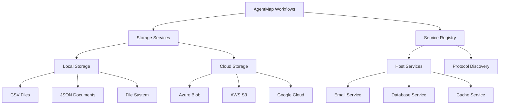

# Infrastructure Guides

This section covers AgentMap's infrastructure components, including storage services, cloud integrations, and service registry patterns. These guides help you integrate AgentMap with existing systems and scale your workflows effectively.

## Available Guides

### [Storage Services Overview](/docs/guides/development/services/storage/storage-services-overview)
Learn about AgentMap's unified storage service system supporting CSV, JSON, and file operations with consistent APIs and behavior patterns.

**Key Topics:**
- Unified storage interface across all backends
- CSV service with smart ID detection
- JSON service with direct storage model
- File service with LangChain integration
- Query and filtering capabilities
- Performance optimization strategies

### [Cloud Storage Integration](/docs/guides/development/services/storage/cloud-storage-integration)
Extend AgentMap to major cloud storage providers including Azure Blob Storage, AWS S3, and Google Cloud Storage.

**Key Topics:**
- Multi-cloud provider support
- Authentication and security patterns
- URI-based cloud storage access
- Environment-specific configurations
- Error handling and troubleshooting
- Performance optimization for cloud operations

### [Service Registry Patterns](/docs/guides/development/services/service-registry-patterns)
Integrate AgentMap with existing application infrastructure through protocol-based service discovery and dependency injection.

**Key Topics:**
- Protocol-based service contracts
- Host service registration and discovery
- Automatic agent configuration
- Service lifecycle management
- Health monitoring and metrics
- Testing service integrations

## Quick Start

### Basic Storage Setup

```yaml
# storage_config.yaml
storage:
  csv:
    provider: csv
    options:
      base_directory: "./data/csv"
      encoding: "utf-8"
  
  json:
    provider: json
    options:
      base_directory: "./data/json"
      encoding: "utf-8"
      indent: 2
  
  file:
    provider: file
    options:
      base_directory: "./data/files"
      encoding: "utf-8"
      allow_binary: true
```

### Cloud Storage Configuration

```yaml
# Add cloud providers
json:
  providers:
    azure:
      connection_string: "env:AZURE_STORAGE_CONNECTION_STRING"
      default_container: "documents"
    
    aws:
      region: "us-west-2"
      access_key: "env:AWS_ACCESS_KEY_ID"
      secret_key: "env:AWS_SECRET_ACCESS_KEY"
      default_bucket: "my-documents"
    
    gcp:
      project_id: "env:GCP_PROJECT_ID"
      credentials_file: "path/to/service-account.json"
      default_bucket: "documents"
```

### Service Registry Setup

```python
from agentmap.di import initialize_di

# Initialize container and registry
container = initialize_di()
registry = container.host_service_registry()

# Register host services
registry.register_service_provider(
    service_name="email_service",
    provider=MyEmailService(),
    protocols=[EmailServiceProtocol],
    metadata={"provider": "smtp", "version": "1.0"}
)
```

## Architecture Overview



## Common Use Cases

### Data Processing Pipeline
1. **Read data** from CSV files or cloud storage
2. **Process data** using custom agents with business logic
3. **Store results** in JSON format or database
4. **Send notifications** via email service
5. **Cache results** for improved performance

### Multi-Cloud Workflow
1. **Ingest data** from Azure Blob Storage
2. **Process and transform** data using AgentMap agents
3. **Store intermediate results** in AWS S3
4. **Final output** to Google Cloud Storage
5. **Metadata tracking** in host database service

### Service Integration
1. **Register host services** in service registry
2. **Automatic discovery** by protocol matching
3. **Agent configuration** with required services
4. **Workflow execution** with integrated services
5. **Health monitoring** and error handling

## Best Practices

### Storage
- Use appropriate storage backend for your data type
- Implement proper error handling for missing documents
- Choose optimal formats (dict/records/dataframe) for performance
- Enable caching for frequently accessed data

### Cloud Integration
- Use environment variables for credentials
- Implement proper authentication and authorization
- Monitor costs and optimize storage lifecycles
- Plan for disaster recovery and backup strategies

### Service Registry
- Define clear protocol contracts before implementation
- Implement comprehensive health checks
- Use lazy loading for expensive service initialization
- Monitor service performance and availability

## Security Considerations

- **Credentials Management**: Use environment variables and secret management systems
- **Access Control**: Implement least privilege access patterns
- **Encryption**: Enable encryption in transit and at rest
- **Audit Logging**: Track all storage and service operations
- **Network Security**: Secure communication channels

## Troubleshooting

### Storage Issues
- Check file permissions and directory access
- Verify encoding settings for text files
- Test connectivity for cloud storage providers
- Monitor storage quotas and limits

### Service Registry Issues
- Verify service registration before use
- Check protocol implementations and method signatures
- Test service health and availability
- Review agent configuration patterns

## Related Documentation

- [Configuration Reference](/docs/reference/configuration) - Complete configuration options
- [Agent Development Guide](/docs/guides/development/agents/agent-development) - Building storage-capable agents
- [Security Guide](/docs/guides/deploying/deployment) - Security best practices
- [Performance Optimization](/docs/guides/deploying/monitoring) - Optimization strategies

---

**Next:** Choose a specific guide to dive deeper into AgentMap's infrastructure capabilities.
