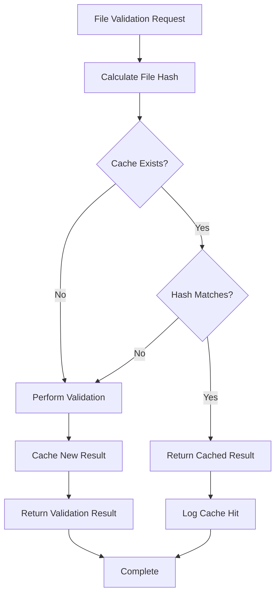

# Validation Cache Management

<div style={{marginBottom: '1rem', fontSize: '0.9rem', color: '#666'}}>
  <span>📍 <a href="/docs/intro">AgentMap</a> → <a href="/docs/guides">Guides</a> → <a href="/docs/guides/development">Development</a> → <strong>Validation Cache</strong></span>
</div>

The validation cache system provides intelligent performance optimization for AgentMap's validation processes. By caching validation results and using file hash-based change detection, the system dramatically speeds up development iterations while ensuring accuracy.

## Cache System Overview

### How Caching Works

The validation cache operates on a simple but effective principle:

1. **File Analysis**: Calculate MD5 hash of file contents
2. **Cache Lookup**: Check for existing cached results using file hash
3. **Cache Hit**: Return cached results if file hasn't changed
4. **Cache Miss**: Perform full validation and cache the results
5. **Change Detection**: Automatic cache invalidation when file changes



### Performance Benefits

**First Validation**: Full validation performed, typically 100-500ms
**Subsequent Validations**: Cache retrieval, typically 5-20ms
**Performance Improvement**: 20-100x faster for unchanged files

## Cache Architecture

### Cache Directory Structure

The validation cache is stored in a dedicated directory structure:

```
~/.agentmap/validation_cache/
├── workflow1.csv_a1b2c3d4e5f6...json    # CSV validation cache
├── config.yaml_f6e5d4c3b2a1...json      # Config validation cache  
├── custom_workflow.csv_9876543...json   # Another CSV cache
└── storage_config.yaml_fedcba...json    # Storage config cache
```

**Cache File Naming Convention**:
- Format: `{filename}_{hash}.json`
- Example: `customer_workflow.csv_a1b2c3d4e5f6789012345678901234567890.json`

### Cache File Structure

Each cache file contains comprehensive validation data:

```json
{
  "cached_at": "2024-01-15T10:30:45.123456",
  "result": {
    "file_path": "./workflows/customer_workflow.csv",
    "file_type": "csv", 
    "is_valid": true,
    "errors": [],
    "warnings": [
      {
        "level": "warning",
        "message": "Unknown agent type: 'CustomEmailAgent'",
        "line_number": 3,
        "field_name": "AgentType",
        "value": "CustomEmailAgent",
        "suggestion": "Check spelling or ensure agent is properly registered"
      }
    ],
    "info": [
      {
        "level": "info",
        "message": "CSV contains 8 rows and 6 columns"
      },
      {
        "level": "info", 
        "message": "Found 1 graph(s): 'customer_onboarding' (8 nodes)"
      }
    ],
    "file_hash": "a1b2c3d4e5f6789012345678901234567890",
    "validation_time": "2024-01-15T10:30:45.123456"
  }
}
```

## Cache Key Generation

### MD5 Hash Calculation

The system uses MD5 hashing for fast, reliable change detection:

```python
# Conceptual cache key generation
def generate_cache_key(file_path: Path) -> str:
    with open(file_path, 'rb') as f:
        file_content = f.read()
    file_hash = hashlib.md5(file_content).hexdigest()
    return f"{file_path.name}_{file_hash}"
```

**Why MD5?**
- **Speed**: Fast calculation for frequent validation
- **Sensitivity**: Detects any content change, however small
- **Collision Resistance**: Practically impossible for different file contents
- **Compact**: 32-character hex string for efficient storage

### Change Detection Examples

```bash
# Original file
echo "GraphName,Node,AgentType" > workflow.csv
# Hash: a1b2c3d4e5f6...
# Cache: workflow.csv_a1b2c3d4e5f6...json

# Minor change (add single character)  
echo "GraphName,Node,AgentType " > workflow.csv  # Added space
# Hash: f6e5d4c3b2a1...  (completely different)
# Cache: workflow.csv_f6e5d4c3b2a1...json (new cache file)

# File restored
echo "GraphName,Node,AgentType" > workflow.csv
# Hash: a1b2c3d4e5f6...  (matches original)
# Cache: Uses workflow.csv_a1b2c3d4e5f6...json (original cache)
```

## Cache Expiration and Cleanup

### Automatic Expiration

Cache entries automatically expire after 24 hours by default:

- **Purpose**: Ensure validation logic updates are applied
- **Check**: Performed on every cache access
- **Cleanup**: Expired entries are automatically removed

### Manual Cache Management

You can manually control cache behavior through CLI commands:

```bash
# View cache statistics
agentmap validate cache --stats

# Clear specific file cache  
agentmap validate cache --file workflows/customer_flow.csv

# Clear all cache
agentmap validate cache --clear

# Clean up expired entries only
agentmap validate cache --cleanup
```

## Cache Statistics and Monitoring

### Cache Statistics Command

The `--stats` option provides comprehensive cache insights:

```bash
agentmap validate cache --stats
```

**Sample Output**:
```
📊 Validation Cache Statistics
Total cache entries: 23
Valid cache entries: 18
Expired cache entries: 3
Corrupted cache entries: 2
Cache directory: ~/.agentmap/validation_cache
Total cache size: 256 KB

Recent cache activity:
✅ workflows/main.csv (cached 2 hours ago)
✅ agentmap_config.yaml (cached 4 hours ago) 
⏰ workflows/old_flow.csv (expired 2 days ago)
❌ workflows/broken_cache.csv (corrupted cache file)
```

### Cache Performance Metrics

**Hit Rate Calculation**:
```
Cache Hit Rate = (Cache Hits) / (Total Validation Requests) × 100%

Example Development Session:
- Total validations: 45
- Cache hits: 38  
- Cache misses: 7
- Hit rate: 84.4%
- Time saved: ~2.5 seconds per hit × 38 = 95 seconds
```

## Cache Management Commands

### View Cache Statistics

Display comprehensive cache information:

```bash
agentmap validate cache --stats
```

**Output Details**:
- Total number of cache files
- Valid vs expired vs corrupted entries
- Cache directory location and size
- Recent cache activity
- Performance metrics

### Clear All Cache

Remove all cached validation results:

```bash
agentmap validate cache --clear
```

**Use Cases**:
- Force complete re-validation of all files
- Troubleshoot cache-related issues
- Clean slate after system updates
- CI/CD pipelines requiring fresh validation

### Clear Specific File Cache

Remove cache for a specific file:

```bash
agentmap validate cache --file workflows/customer_flow.csv
```

**Use Cases**:
- Force re-validation of specific file
- Troubleshoot file-specific cache issues
- After manual file editing outside normal workflow

### Cleanup Expired Entries

Remove only expired cache entries:

```bash
agentmap validate cache --cleanup
```

**Use Cases**:
- Regular maintenance
- Reclaim disk space
- Automated cleanup scripts
- Performance optimization

## Cache Integration with Validation

### Default Cache Behavior

By default, all validation commands use caching:

```bash
# These commands use cache by default
agentmap validate csv --csv workflow.csv
agentmap validate config --config config.yaml
agentmap validate all
```

### Bypassing Cache

Use `--no-cache` to force fresh validation:

```bash
# Force fresh validation (bypass cache)
agentmap validate csv --csv workflow.csv --no-cache
agentmap validate config --config config.yaml --no-cache  
agentmap validate all --no-cache
```

**When to Use `--no-cache`**:
- CI/CD pipelines requiring guaranteed fresh validation
- Troubleshooting cache-related issues
- After system updates or agent registry changes
- When validation logic has been updated

### Cache-Aware Development

The cache integrates seamlessly with development workflow:

```bash
# First validation: Full validation performed and cached
agentmap validate csv --csv new_workflow.csv
# Time: 250ms, Result cached

# Edit file in editor and save
# Hash changes automatically

# Second validation: Cache miss, fresh validation  
agentmap validate csv --csv new_workflow.csv
# Time: 280ms, New result cached

# Third validation (no changes): Cache hit
agentmap validate csv --csv new_workflow.csv  
# Time: 15ms, Cached result returned
```

## Performance Optimization

### Development Workflow Optimization

**Recommended Practices**:

1. **Let Cache Work**: Don't use `--no-cache` during development
2. **Incremental Changes**: Make small changes to leverage cache hits
3. **Regular Cleanup**: Periodically clean expired cache entries
4. **Monitor Performance**: Check cache hit rates for optimization insights

### Cache Storage Optimization

**Disk Space Management**:
- Average cache file size: 2-10 KB
- Typical project cache usage: 50-500 KB
- Automatic cleanup prevents unlimited growth
- Manual cleanup available for space-constrained environments

### Network and I/O Benefits

**Local Development**:
- Eliminates repeated file parsing
- Reduces I/O overhead for large CSV files
- Enables instant validation feedback
- Improves editor integration responsiveness

## Troubleshooting Cache Issues

### Common Cache Problems

**Cache Miss Despite No Changes**
```bash
# Check file timestamps and content
ls -la workflow.csv
md5sum workflow.csv

# Clear cache and re-validate
agentmap validate cache --file workflow.csv
agentmap validate csv --csv workflow.csv
```

**Corrupted Cache Files**
```bash
# System automatically removes corrupted cache
# Or manually clear cache
agentmap validate cache --clear
```

**Performance Issues**
```bash
# Check cache statistics
agentmap validate cache --stats

# Clean up expired entries
agentmap validate cache --cleanup

# Check disk space
df -h ~/.agentmap/validation_cache
```

### Cache Debugging

**Debug Cache Behavior**:
```bash
# Enable debug logging (if available)
export AGENTMAP_LOG_LEVEL=DEBUG

# Run validation with verbose output
agentmap validate csv --csv workflow.csv --verbose

# Check cache directory directly
ls -la ~/.agentmap/validation_cache/
```

### Recovery Procedures

**Complete Cache Reset**:
```bash
# Stop any running AgentMap processes
# Clear all cache
agentmap validate cache --clear

# Verify cache directory is empty
ls ~/.agentmap/validation_cache/

# Run fresh validation
agentmap validate all
```

## Best Practices

### Development Environment

1. **Cache Utilization**: Always allow cache to work during development
2. **Regular Monitoring**: Check cache stats periodically
3. **Cleanup Schedule**: Run cleanup weekly or monthly
4. **Backup Awareness**: Cache is disposable - no backup needed

### CI/CD Integration

1. **Fresh Validation**: Use `--no-cache` in CI/CD pipelines
2. **Clean Environment**: Ensure no cache from previous builds
3. **Performance Balance**: Consider cache for repeated CI validations
4. **Error Isolation**: Clear cache when debugging CI issues

### Team Development

1. **Individual Caches**: Each developer has separate cache
2. **No Sharing**: Don't share cache files between team members
3. **Documentation**: Document cache management in team guidelines
4. **Troubleshooting**: Include cache clearing in debugging procedures

## Advanced Cache Configuration

### Custom Cache Directory

While the cache directory is typically `~/.agentmap/validation_cache`, advanced users can customize this through environment variables or configuration:

```bash
# Set custom cache directory (if supported)
export AGENTMAP_CACHE_DIR="/custom/cache/path"
```

### Cache Retention Policy

The default 24-hour expiration can be adjusted for specific use cases:

- **Development**: 24 hours (default) for frequent changes
- **Production**: Longer retention for stable environments
- **CI/CD**: Shorter retention or no cache for isolation

## Related Documentation

- **[Validation System Overview](./validation)**: Complete validation system architecture
- **[CSV Validation Guide](./csv-validation)**: CSV-specific validation details  
- **[Config Validation Guide](./config-validation)**: Configuration validation specifics
- **[Validation Best Practices](./validation-best-practices)**: Workflow integration guidance
- **[CLI Commands Reference](/docs/deployment/08-cli-validation)**: Command-line validation tools

## Next Steps

1. **Monitor Cache Performance**: Run `agentmap validate cache --stats` to check current cache efficiency
2. **Optimize Development**: Let cache work during development, use `--no-cache` only when needed
3. **Set Up Maintenance**: Include cache cleanup in regular maintenance procedures
4. **Learn Best Practices**: Review [validation best practices](./validation-best-practices) for optimal workflow integration
