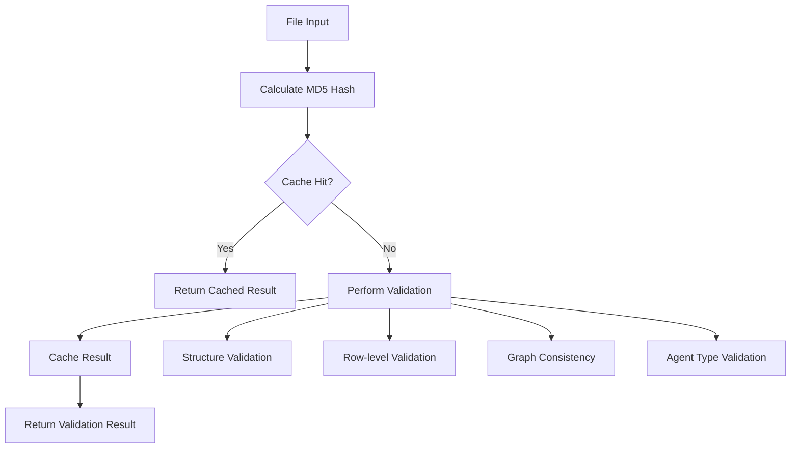

# Validation System Overview

<div style={{marginBottom: '1rem', fontSize: '0.9rem', color: '#666'}}>
  <span>📍 <a href="/docs/intro">AgentMap</a> → <a href="/docs/guides">Guides</a> → <a href="/docs/guides/development">Development</a> → <strong>Validation System</strong></span>
</div>

AgentMap provides a sophisticated validation system that ensures the integrity and correctness of your workflow definitions and configuration files. The validation system helps catch errors early in the development process, provides detailed feedback, and maintains performance through intelligent caching.

## System Architecture

The validation system is built around a modular architecture with specialized services handling different aspects of validation:

### Core Components

- **ValidationService**: Main orchestrator that coordinates all validation activities
- **CSVValidationService**: Handles CSV workflow file validation with graph consistency checks
- **ConfigValidationService**: Validates YAML configuration files and settings
- **ValidationCacheService**: Manages MD5-based caching for performance optimization

### Validation Workflow



## Validation Levels

The system provides three levels of feedback to help you understand the state of your files:

### ❌ Errors
- **Impact**: Block execution and compilation
- **Examples**: Missing required columns, invalid node references, schema violations
- **Action Required**: Must be fixed before proceeding

### ⚠️ Warnings  
- **Impact**: Allow execution but indicate potential issues
- **Examples**: Unknown agent types, large prompts, missing API keys
- **Action Recommended**: Should be reviewed and addressed

### ℹ️ Info
- **Impact**: Informational messages about your workflow
- **Examples**: Graph statistics, entry points, terminal nodes
- **Action Optional**: Provides useful insights for optimization

## Caching Mechanism

The validation system uses intelligent caching to improve performance:

### Cache Key Generation
- **File Hash**: MD5 hash of file contents for change detection
- **Cache Location**: `~/.agentmap/validation_cache/`
- **File Format**: `{filename}_{hash}.json`

### Cache Management
- **Expiry**: 24 hours by default
- **Invalidation**: Automatic when file content changes
- **Cleanup**: Built-in expired cache removal

### Performance Benefits
- **First Validation**: Full validation performed, result cached
- **Subsequent Validations**: Instant cache retrieval if file unchanged
- **Development Speed**: Faster iteration cycles during development

## Validation Components

### [CSV Validation](./csv-validation)
Comprehensive validation of workflow definition files including:
- Column structure and naming (with alias support)
- Row-level data validation using Pydantic models
- Graph consistency and topology checks
- Agent type verification against registry
- Routing logic validation

### [Config Validation](./config-validation)
Complete validation of YAML configuration files including:
- Schema validation using Pydantic ConfigModel
- Path existence and accessibility checks
- LLM provider configuration verification
- Cross-reference validation between sections
- Environment variable validation

### [Cache Management](./validation-cache)
Efficient caching system providing:
- MD5-based change detection
- Automatic cache expiry and cleanup
- Cache statistics and monitoring
- Manual cache control commands

## Integration Points

### Development Workflow
```bash
# Validate during development
agentmap validate csv --csv workflows/my_workflow.csv

# Validate before compilation
agentmap validate all --fail-on-warnings

# CI/CD integration
agentmap validate all --no-cache --fail-on-warnings
```

### CLI Integration
The validation system integrates seamlessly with AgentMap's CLI:
- **Individual Validation**: `validate csv`, `validate config`
- **Comprehensive Validation**: `validate all`
- **Cache Management**: `validate cache --stats`, `validate cache --clear`

### Compilation Integration
Validation is automatically triggered during compilation:
- **Pre-compilation Checks**: Ensure valid workflow before processing
- **Error Blocking**: Invalid workflows prevent compilation
- **Performance**: Cached results speed up repeated compilations

## Best Practices

### Development Phase
1. **Validate Early**: Run validation after significant changes
2. **Use Cache**: Let caching speed up development iterations  
3. **Address Warnings**: Don't ignore warnings - they prevent future issues
4. **Monitor Info**: Use info messages to optimize workflow design

### CI/CD Integration
1. **Mandatory Validation**: Include validation in build pipelines
2. **Fail on Warnings**: Use `--fail-on-warnings` for production deployments
3. **No Cache**: Use `--no-cache` for clean CI/CD validation
4. **Error Reporting**: Capture validation output for debugging

### Production Deployment
1. **Complete Validation**: Always run `validate all` before deployment
2. **Environment Checks**: Ensure API keys and paths are configured
3. **Graph Verification**: Confirm workflow topology is correct
4. **Agent Availability**: Verify all agent types are accessible

## Troubleshooting

### Common Issues

**Cache Problems**
```bash
# Clear cache for fresh validation
agentmap validate cache --clear

# Check cache statistics
agentmap validate cache --stats
```

**Performance Issues**
```bash
# Skip cache for one-time validation
agentmap validate csv --no-cache

# Clean up expired cache entries
agentmap validate cache --cleanup
```

**Validation Errors**
- Check [CSV Validation Guide](./csv-validation) for specific CSV issues
- Review [Config Validation Guide](./config-validation) for configuration problems
- Use `--help` with any validation command for detailed options

## Related Documentation

- **[CSV Validation Guide](./csv-validation)**: Detailed CSV validation capabilities
- **[Config Validation Guide](./config-validation)**: Configuration file validation
- **[Validation Cache Management](./validation-cache)**: Cache system details
- **[Validation Best Practices](./validation-best-practices)**: Development workflow integration
- **[CLI Commands Reference](/docs/deployment/08-cli-validation)**: Command-line validation tools
- **[CSV Schema Reference](/docs/reference/csv-schema)**: Complete CSV format specification

## Next Steps

1. **Learn CSV Validation**: Review the [CSV validation guide](./csv-validation) for workflow validation
2. **Configure Validation**: Set up [config validation](./config-validation) for your environment  
3. **Optimize Performance**: Understand [cache management](./validation-cache) for faster development
4. **Best Practices**: Follow [validation best practices](./validation-best-practices) for efficient workflows
