# Storage Integration Guide

import Tabs from '@theme/Tabs';
import TabItem from '@theme/TabItem';
import CodeBlock from '@theme/CodeBlock';

AgentMap provides enterprise-ready storage integration with comprehensive multi-provider support, advanced caching systems, and robust security patterns. This guide covers the complete storage integration ecosystem including local storage, cloud providers, vector databases, and advanced enterprise features.

:::info Enterprise Storage Integration
AgentMap's storage integration is **enterprise-ready** with 95% feature coverage, supporting all major cloud providers with consistent APIs, robust error handling, and extensive configuration options. The system provides seamless data movement between providers with enterprise security and governance features.
:::

## Storage Architecture Overview

```mermaid
graph TB
    A[AgentMap Storage System] --> B[Core Storage Services]
    A --> C[Cloud Storage Providers]
    A --> D[Vector Storage]
    A --> E[Cache Management]
    A --> F[Enterprise Features]
    
    B --> B1[CSV Storage Service]
    B --> B2[JSON Storage Service]
    B --> B3[File Storage Service]
    
    C --> C1[Azure Blob Storage]
    C --> C2[AWS S3]
    C --> C3[Google Cloud Storage]
    C --> C4[Local File Storage]
    
    D --> D1[Vector Database Integration]
    D --> D2[Similarity Search]
    D --> D3[Embedding Storage]
    
    E --> E1[Validation Cache Service]
    E --> E2[Routing Decision Cache]
    E --> E3[Performance Optimization]
    
    F --> F1[Data Lifecycle Management]
    F --> F2[Compliance & Audit]
    F --> F3[Cost Optimization]
```



## Core Storage Services

### CSV Storage Service with Smart ID Detection

The CSV storage service provides pandas-based operations with intelligent ID field detection and flexible data access patterns.

<Tabs>
<TabItem value="auto-detection" label="Automatic ID Detection">

```python
# Automatic ID detection works for standard patterns
users = storage_service.read("users", document_id=123)  # Uses 'id' column
orders = storage_service.read("orders", document_id="ORD001")  # Uses 'order_id' column

# Multiple potential ID columns (uses priority: 'id' > '*_id' > 'id_*')
complex_data = [
    {"record_id": "R001", "user_id": "U001", "id": 1, "data": "..."},
    {"record_id": "R002", "user_id": "U002", "id": 2, "data": "..."}
]
record = storage_service.read("complex", document_id=1)  # Uses 'id' (highest priority)
```

</TabItem>
<TabItem value="business-ids" label="Business Identifiers">

```python
# Business identifiers require explicit id_field specification
product = storage_service.read("products", document_id="WIDGET001", id_field="sku")
user = storage_service.read("users", document_id="alice@corp.com", id_field="email")
stock = storage_service.read("stocks", document_id="AAPL", id_field="ticker_symbol")

# Multiple operations with custom ID field
stock = storage_service.read("stocks", document_id="AAPL", id_field="ticker")
storage_service.write("stocks", new_data, document_id="TSLA", id_field="ticker")
storage_service.delete("stocks", document_id="MSFT", id_field="ticker")
```

</TabItem>
<TabItem value="formats" label="Format Options">

```python
# Default format: dict (index-based keys) - storage-agnostic
result = storage_service.read("users")
# Returns: {0: {"id": 1, "name": "Alice"}, 1: {"id": 2, "name": "Bob"}}

# Records format: list of row dictionaries - ideal for iteration
result = storage_service.read("users", format="records")
# Returns: [{"id": 1, "name": "Alice"}, {"id": 2, "name": "Bob"}]

# DataFrame format: pandas DataFrame for advanced analytics
result = storage_service.read("users", format="dataframe")
# Returns: pandas.DataFrame with full feature set
```

</TabItem>
</Tabs>

### JSON Storage Service with Direct Storage Model

The JSON service uses direct storage where user data is stored exactly as provided, ensuring data integrity and predictable behavior.

<Tabs>
<TabItem value="direct-storage" label="Direct Storage Model">

```python
# Write operation stores data exactly as provided
storage_service.write("users", {"name": "John", "age": 30}, "user123")

# Internal storage structure (in users.json)
{
  "user123": {"name": "John", "age": 30}  # User data stored directly
}

# Read operation returns data exactly as stored
user = storage_service.read("users", "user123")
# Returns: {"name": "John", "age": 30}  # Data unchanged
```

</TabItem>
<TabItem value="path-operations" label="Path-Based Operations">

```python
# Write to nested path using dot notation
storage_service.write("users", "alice@newdomain.com", "user_001", 
                     mode=WriteMode.UPDATE, path="email")

# Read from nested path
theme = storage_service.read("users", "user_001", path="preferences.theme")

# Update deeply nested values
storage_service.write("users", True, "user_001",
                     mode=WriteMode.UPDATE, path="preferences.notifications.email")

# Delete specific nested paths
storage_service.delete("users", "user_001", path="preferences.theme")
```

</TabItem>
<TabItem value="write-modes" label="Write Modes">

```python
from agentmap.services.storage.types import WriteMode

# WRITE: Create new or overwrite (default)
storage_service.write("docs", {"title": "New Doc"}, "doc1", WriteMode.WRITE)

# UPDATE: Merge with existing document
storage_service.write("docs", {"status": "published"}, "doc1", WriteMode.UPDATE)

# APPEND: Add to existing collections
storage_service.write("logs", [{"event": "login"}], mode=WriteMode.APPEND)
```

</TabItem>
</Tabs>

### File Storage Service with LangChain Integration

The file storage service handles text/binary files with advanced document processing capabilities.

<Tabs>
<TabItem value="basic-ops" label="Basic File Operations">

```python
# Text file operations
content = storage_service.read("documents", "readme.txt")  # Raw content
storage_service.write("documents", "Hello, World!", "greeting.txt")

# Binary file operations
image_data = storage_service.read("images", "photo.jpg", binary_mode=True)
storage_service.write("images", binary_data, "new_photo.jpg", binary_mode=True)

# Structured format with metadata
doc = storage_service.read("documents", "readme.txt", format="structured")
# Returns: {"content": "...", "metadata": {"source": "...", "size": 123, "type": "text"}}
```

</TabItem>
<TabItem value="langchain" label="LangChain Integration">

```python
# Document parsing with LangChain loaders
pdf_content = storage_service.read("documents", "report.pdf", 
                                  should_split=True, chunk_size=1000)

# Document search with metadata filtering
docs = storage_service.read("documents", "large_doc.pdf", query={
    "document_index": 2,      # Specific chunk/section
    "metadata": {"page": 1}   # Metadata filter
})

# Chunking configuration
storage_config = {
    "chunk_size": 1000,
    "chunk_overlap": 200,
    "include_metadata": True
}
```

</TabItem>
<TabItem value="directory-ops" label="Directory Operations">

```python
# Directory listing
files = storage_service.read("documents")  # List all files
metadata = storage_service.get_file_metadata("documents", "file.txt")

# Directory operations
storage_service.delete("old_files", recursive=True)  # Recursive deletion
exists = storage_service.exists("documents", "important.txt")
```

</TabItem>
</Tabs>

## Cloud Storage Integration

### Multi-Cloud Provider Support

AgentMap supports seamless integration with all major cloud storage providers through URI-based addressing and unified configuration.

<Tabs>
<TabItem value="uri-format" label="URI Format">

| Provider | URI Format | Example | Use Case |
|----------|------------|---------|----------|
| Azure Blob Storage | `azure://container/path/blob.json` | `azure://documents/users.json` | Microsoft ecosystem |
| AWS S3 | `s3://bucket/path/object.json` | `s3://my-bucket/data/config.json` | AWS ecosystem |
| Google Cloud Storage | `gs://bucket/path/blob.json` | `gs://my-bucket/reports/monthly.json` | Google Cloud ecosystem |
| Local Storage | `local://path/file.json` | `local://data/users.json` | Development/testing |

</TabItem>
<TabItem value="configuration" label="Provider Configuration">

```yaml
json:
  default_provider: "local"
  providers:
    local:
      base_dir: "data/json"
    
    azure:
      connection_string: "env:AZURE_STORAGE_CONNECTION_STRING"
      default_container: "documents"
      containers:
        users: "users-prod-container"
        analytics: "analytics-data"
        backups: "system-backups"
      # Performance settings
      timeout: 30
      retry_count: 3
      connection_pool:
        max_connections: 10
        max_idle_time: 300
    
    aws:
      region: "us-west-2"
      access_key: "env:AWS_ACCESS_KEY_ID"
      secret_key: "env:AWS_SECRET_ACCESS_KEY"
      default_bucket: "my-documents"
      buckets:
        users: "users-prod-bucket"
        ml_models: "ml-model-storage"
        logs: "application-logs"
      # Performance settings
      connection_pool:
        max_connections: 10
        max_retries: 3
        backoff_mode: "adaptive"
    
    gcp:
      project_id: "env:GCP_PROJECT_ID"
      credentials_file: "path/to/service-account.json"
      default_bucket: "documents"
      buckets:
        users: "users-prod-bucket"
        analytics: "analytics-data"
        archives: "long-term-storage"
      # Performance settings
      connection_pool:
        max_connections: 10
        keepalive_timeout: 300
```

</TabItem>
<TabItem value="auth-methods" label="Authentication Methods">

```yaml
# Azure Authentication Options
azure:
  # Option 1: Connection String (Recommended)
  connection_string: "env:AZURE_STORAGE_CONNECTION_STRING"
  
  # Option 2: Account Name and Key
  account_name: "env:AZURE_STORAGE_ACCOUNT"
  account_key: "env:AZURE_STORAGE_KEY"
  
  # Option 3: Managed Identity (Azure VMs/App Service)
  use_managed_identity: true

# AWS Authentication Options
aws:
  # Option 1: Access Key and Secret Key
  access_key: "env:AWS_ACCESS_KEY_ID"
  secret_key: "env:AWS_SECRET_ACCESS_KEY"
  
  # Option 2: IAM Roles (EC2/Lambda)
  # No credentials needed - uses instance profile
  
  # Option 3: Assumed Role with Session Token
  session_token: "env:AWS_SESSION_TOKEN"

# GCP Authentication Options
gcp:
  # Option 1: Service Account File
  credentials_file: "path/to/service-account.json"
  
  # Option 2: Application Default Credentials
  use_default_credentials: true
  
  # Option 3: Custom Scopes
  scopes:
    - "https://www.googleapis.com/auth/devstorage.read_write"
```

</TabItem>
</Tabs>

### Multi-Cloud Workflow Patterns

<Tabs>
<TabItem value="simple" label="Simple Cloud Operations">

```csv
graph_name,node_name,next_node,context,agent_type,next_on_success,next_on_failure,input_fields,output_field,prompt
CloudFlow,ReadAzure,,Read from Azure,cloud_json_reader,ProcessData,ErrorHandler,collection,azure_data,"azure://prod-data/users.json"
CloudFlow,ProcessData,,Transform data,DataProcessor,SaveAWS,ErrorHandler,azure_data,processed_data,
CloudFlow,SaveAWS,,Save to AWS S3,cloud_json_writer,NotifyComplete,ErrorHandler,processed_data,save_result,"s3://processed-data/users.json"
CloudFlow,NotifyComplete,,Send notification,EmailService,End,ErrorHandler,save_result,notification,
CloudFlow,End,,Completion,Echo,,,"notification",final_message,Multi-cloud processing complete
CloudFlow,ErrorHandler,,Handle errors,Echo,End,,"error",error_message,Error: {error}
```

</TabItem>
<TabItem value="enterprise" label="Enterprise Multi-Cloud Pipeline">

```csv
graph_name,node_name,next_node,context,agent_type,next_on_success,next_on_failure,input_fields,output_field,prompt
EnterprisePipeline,IngestAzure,,"{'collection': 'azure://ingest/raw-data.json', 'validate': true}",cloud_json_reader,ValidateData,ErrorHandler,collection,raw_data,
EnterprisePipeline,ValidateData,,Validate data quality,DataValidator,TransformData,DataIssues,raw_data,validated_data,
EnterprisePipeline,TransformData,,Apply business rules,BusinessRuleEngine,StoreIntermediate,ErrorHandler,validated_data,transformed_data,
EnterprisePipeline,StoreIntermediate,,"{'collection': 's3://intermediate/processed.json', 'backup': true}",cloud_json_writer,AnalyzeData,ErrorHandler,transformed_data,intermediate_result,
EnterprisePipeline,AnalyzeData,,Run analytics,AnalyticsEngine,StoreFinal,ErrorHandler,transformed_data,analytics_result,
EnterprisePipeline,StoreFinal,,"{'collection': 'gs://final/analytics.json', 'encrypt': true}",cloud_json_writer,AuditLog,ErrorHandler,analytics_result,final_result,
EnterprisePipeline,AuditLog,,Log audit trail,AuditService,End,ErrorHandler,final_result,audit_log,
EnterprisePipeline,End,,Success notification,NotificationService,,,"audit_log",success_message,Pipeline completed successfully
EnterprisePipeline,DataIssues,,Handle data issues,DataIssueHandler,End,,"validated_data",issue_report,Data quality issues detected
EnterprisePipeline,ErrorHandler,,Error handling,ErrorService,End,,"error",error_report,Pipeline error: {error}
```

</TabItem>
<TabItem value="disaster-recovery" label="Disaster Recovery Pattern">

```csv
graph_name,node_name,next_node,context,agent_type,next_on_success,next_on_failure,input_fields,output_field,prompt
DisasterRecovery,CheckPrimary,,"{'collection': 'azure://primary/data.json', 'timeout': 5}",HealthChecker,ReadPrimary,CheckSecondary,collection,health_status,
DisasterRecovery,ReadPrimary,,Read from primary,cloud_json_reader,ProcessData,CheckSecondary,collection,primary_data,
DisasterRecovery,CheckSecondary,,"{'collection': 's3://secondary/data.json', 'timeout': 5}",HealthChecker,ReadSecondary,CheckTertiary,collection,secondary_health,
DisasterRecovery,ReadSecondary,,Read from secondary,cloud_json_reader,ProcessData,CheckTertiary,collection,secondary_data,
DisasterRecovery,CheckTertiary,,"{'collection': 'gs://tertiary/data.json', 'timeout': 5}",HealthChecker,ReadTertiary,FailureMode,collection,tertiary_health,
DisasterRecovery,ReadTertiary,,Read from tertiary,cloud_json_reader,ProcessData,FailureMode,collection,tertiary_data,
DisasterRecovery,ProcessData,,Process available data,DataProcessor,End,ErrorHandler,"primary_data;secondary_data;tertiary_data",processed_data,
DisasterRecovery,End,,Success,Echo,,,"processed_data",final_message,Data recovery successful
DisasterRecovery,FailureMode,,All providers failed,AlertService,End,,"error",alert_message,All storage providers unavailable
DisasterRecovery,ErrorHandler,,Handle error,ErrorService,End,,"error",error_message,Recovery error: {error}
```

</TabItem>
</Tabs>

## Vector Storage Integration

AgentMap provides comprehensive vector storage capabilities for similarity search, embedding storage, and AI-powered data retrieval.

<Tabs>
<TabItem value="basic-vector" label="Basic Vector Operations">

```python
# Vector storage configuration
vector_config = {
    "provider": "vector",
    "options": {
        "vector_db_type": "chroma",  # or "pinecone", "weaviate", "qdrant"
        "embedding_model": "text-embedding-ada-002",
        "dimension": 1536,
        "similarity_metric": "cosine"
    }
}

# Store documents with embeddings
documents = [
    {"id": "doc1", "text": "AgentMap is a powerful workflow system", "metadata": {"category": "tech"}},
    {"id": "doc2", "text": "Storage integration supports multiple providers", "metadata": {"category": "storage"}}
]
storage_service.write("knowledge_base", documents, embedding_enabled=True)

# Similarity search
query = "workflow automation system"
similar_docs = storage_service.read("knowledge_base", 
                                  query={"similarity_search": query, "limit": 5})
```

</TabItem>
<TabItem value="vector-agents" label="Vector-Enabled Agents">

```python
from agentmap.agents.base_agent import BaseAgent
from agentmap.services.protocols import VectorCapableAgent

class KnowledgeAgent(BaseAgent, VectorCapableAgent):
    """Agent with vector search capabilities."""
    
    def configure_vector_service(self, vector_service):
        """Configure vector service for similarity search."""
        self._vector_service = vector_service
        
    def process(self, inputs):
        """Process with vector similarity search."""
        query = inputs.get("query")
        collection = inputs.get("collection", "knowledge_base")
        
        # Perform similarity search
        similar_docs = self.vector_service.similarity_search(
            collection=collection,
            query=query,
            limit=inputs.get("limit", 5),
            threshold=inputs.get("threshold", 0.7)
        )
        
        # Extract relevant information
        context = [doc["text"] for doc in similar_docs]
        
        return {
            "similar_documents": similar_docs,
            "context": "\n".join(context),
            "similarity_scores": [doc["score"] for doc in similar_docs]
        }
```

</TabItem>
<TabItem value="vector-workflow" label="Vector Search Workflow">

```csv
graph_name,node_name,next_node,context,agent_type,next_on_success,next_on_failure,input_fields,output_field,prompt
VectorFlow,EmbedQuery,,"{'collection': 'knowledge_base'}",vector_embedder,SearchSimilar,ErrorHandler,"query",embedded_query,
VectorFlow,SearchSimilar,,"{'collection': 'knowledge_base', 'limit': 5}",vector_searcher,ExtractContext,ErrorHandler,"embedded_query",similar_docs,
VectorFlow,ExtractContext,,Extract relevant context,ContextExtractor,GenerateResponse,ErrorHandler,"similar_docs",context,
VectorFlow,GenerateResponse,,Generate response,openai,End,ErrorHandler,"query,context",response,Based on the following context: {context}\n\nAnswer the question: {query}
VectorFlow,End,,Completion,Echo,,,"response",final_answer,{response}
VectorFlow,ErrorHandler,,Handle errors,Echo,End,,"error",error_message,Vector search error: {error}
```

</TabItem>
</Tabs>

### Vector Database Providers

<Tabs>
<TabItem value="chroma" label="ChromaDB">

```yaml
vector:
  provider: chroma
  options:
    persist_directory: "./vector_db"
    embedding_function: "openai"
    collection_metadata: {"hnsw:space": "cosine"}
    
# Advanced ChromaDB configuration
vector:
  provider: chroma
  options:
    client_settings:
      chroma_api_url: "http://localhost:8000"
      chroma_server_host: "localhost"
      chroma_server_http_port: 8000
    embedding_model: "text-embedding-ada-002"
    batch_size: 100
```

</TabItem>
<TabItem value="pinecone" label="Pinecone">

```yaml
vector:
  provider: pinecone
  options:
    api_key: "env:PINECONE_API_KEY"
    environment: "env:PINECONE_ENVIRONMENT"
    index_name: "agentmap-knowledge"
    dimension: 1536
    metric: "cosine"
    
# Pinecone with namespaces
vector:
  provider: pinecone
  options:
    api_key: "env:PINECONE_API_KEY"
    environment: "env:PINECONE_ENVIRONMENT"
    index_name: "agentmap-knowledge"
    namespaces:
      docs: "documentation"
      code: "code-examples"
      support: "support-tickets"
```

</TabItem>
<TabItem value="weaviate" label="Weaviate">

```yaml
vector:
  provider: weaviate
  options:
    url: "env:WEAVIATE_URL"
    auth_config:
      type: "api_key"
      api_key: "env:WEAVIATE_API_KEY"
    class_name: "Document"
    properties:
      - name: "content"
        data_type: "text"
      - name: "metadata"
        data_type: "object"
```

</TabItem>
</Tabs>

## Cache Management System

AgentMap implements advanced caching strategies to optimize storage performance and reduce latency.

### Validation Cache Service

The validation cache service stores file validation results to avoid repeated expensive validation operations.

<Tabs>
<TabItem value="validation-config" label="Validation Cache Configuration">

```yaml
storage:
  cache:
    validation:
      enabled: true
      provider: "redis"  # or "memory", "file"
      ttl: 3600  # 1 hour cache
      max_size: 1000  # Max cached validations
      
      # Redis configuration
      redis:
        host: "localhost"
        port: 6379
        db: 1
        password: "env:REDIS_PASSWORD"
        key_prefix: "agentmap:validation:"
        
      # File cache configuration (alternative)
      file:
        cache_directory: "./cache/validation"
        max_file_size: "10MB"
        cleanup_interval: 3600  # 1 hour
```

</TabItem>
<TabItem value="validation-usage" label="Validation Cache Usage">

```python
from agentmap.services.cache import ValidationCacheService

class CachedValidator:
    def __init__(self, cache_service: ValidationCacheService):
        self.cache = cache_service
    
    def validate_file(self, file_path: str, file_hash: str):
        """Validate file with caching."""
        # Check cache first
        cache_key = f"{file_path}:{file_hash}"
        cached_result = self.cache.get(cache_key)
        
        if cached_result:
            return cached_result
        
        # Perform validation
        validation_result = self._perform_validation(file_path)
        
        # Cache the result
        self.cache.set(cache_key, validation_result, ttl=3600)
        
        return validation_result
    
    def _perform_validation(self, file_path: str):
        """Actual validation logic."""
        # Expensive validation operations
        return {"valid": True, "errors": [], "warnings": []}
```

</TabItem>
<TabItem value="validation-metrics" label="Cache Metrics">

```python
# Cache performance monitoring
cache_metrics = validation_cache.get_metrics()
print(f"Cache hit rate: {cache_metrics['hit_rate']:.2%}")
print(f"Total requests: {cache_metrics['total_requests']}")
print(f"Cache size: {cache_metrics['current_size']} / {cache_metrics['max_size']}")
print(f"Average response time: {cache_metrics['avg_response_time']:.2f}ms")
```

</TabItem>
</Tabs>

### Routing Decision Cache

The routing decision cache stores LLM routing decisions to improve workflow performance and reduce LLM API costs.

<Tabs>
<TabItem value="routing-config" label="Routing Cache Configuration">

```yaml
storage:
  cache:
    routing:
      enabled: true
      provider: "redis"
      ttl: 1800  # 30 minutes
      max_size: 5000
      
      # Cache key strategy
      key_strategy: "content_hash"  # or "input_hash", "semantic_hash"
      
      # Invalidation rules
      invalidation:
        on_workflow_change: true
        on_agent_update: true
        max_age: 86400  # 24 hours
      
      # Redis configuration
      redis:
        host: "localhost"
        port: 6379
        db: 2
        key_prefix: "agentmap:routing:"
```

</TabItem>
<TabItem value="routing-usage" label="Routing Cache Usage">

```python
from agentmap.services.cache import RoutingCacheService

class CachedLLMRouter:
    def __init__(self, cache_service: RoutingCacheService):
        self.cache = cache_service
    
    def route_request(self, input_data: dict, workflow_id: str):
        """Route request with caching."""
        # Generate cache key
        cache_key = self._generate_cache_key(input_data, workflow_id)
        
        # Check cache
        cached_decision = self.cache.get(cache_key)
        if cached_decision:
            return cached_decision
        
        # Make LLM routing decision
        routing_decision = self._call_llm_for_routing(input_data)
        
        # Cache the decision
        self.cache.set(cache_key, routing_decision, ttl=1800)
        
        return routing_decision
    
    def _generate_cache_key(self, input_data: dict, workflow_id: str):
        """Generate consistent cache key."""
        import hashlib
        content = f"{workflow_id}:{str(sorted(input_data.items()))}"
        return hashlib.md5(content.encode()).hexdigest()
```

</TabItem>
<TabItem value="routing-analytics" label="Routing Analytics">

```python
# Routing cache analytics
routing_analytics = routing_cache.get_analytics()

print("Routing Decision Analytics:")
print(f"  Cache hit rate: {routing_analytics['hit_rate']:.2%}")
print(f"  LLM calls avoided: {routing_analytics['llm_calls_avoided']}")
print(f"  Cost savings: ${routing_analytics['estimated_cost_savings']:.2f}")
print(f"  Average decision time: {routing_analytics['avg_decision_time']:.2f}ms")

# Cache optimization recommendations
if routing_analytics['hit_rate'] < 0.6:
    print("Recommendation: Consider increasing cache TTL or improving key strategy")
```

</TabItem>
</Tabs>

### Performance Optimization Cache

<Tabs>
<TabItem value="bulk-ops" label="Bulk Operations Cache">

```python
class BulkOperationCache:
    """Cache for bulk storage operations."""
    
    def __init__(self, cache_service):
        self.cache = cache_service
    
    def bulk_read(self, collections: list, batch_size: int = 10):
        """Optimized bulk read with caching."""
        results = {}
        uncached_collections = []
        
        # Check cache for each collection
        for collection in collections:
            cached_data = self.cache.get(f"collection:{collection}")
            if cached_data:
                results[collection] = cached_data
            else:
                uncached_collections.append(collection)
        
        # Fetch uncached data in batches
        if uncached_collections:
            for i in range(0, len(uncached_collections), batch_size):
                batch = uncached_collections[i:i + batch_size]
                batch_results = self._fetch_batch(batch)
                
                # Cache and store results
                for collection, data in batch_results.items():
                    self.cache.set(f"collection:{collection}", data, ttl=300)
                    results[collection] = data
        
        return results
```

</TabItem>
<TabItem value="connection-pool" label="Connection Pooling">

```python
class ConnectionPoolManager:
    """Manage connection pools for storage providers."""
    
    def __init__(self, config):
        self.pools = {}
        self.config = config
    
    def get_connection(self, provider: str):
        """Get connection from pool."""
        if provider not in self.pools:
            self.pools[provider] = self._create_pool(provider)
        
        return self.pools[provider].get_connection()
    
    def _create_pool(self, provider: str):
        """Create connection pool for provider."""
        pool_config = self.config[provider]['connection_pool']
        
        if provider == 'azure':
            return AzureBlobConnectionPool(
                max_connections=pool_config['max_connections'],
                max_idle_time=pool_config['max_idle_time']
            )
        elif provider == 'aws':
            return S3ConnectionPool(
                max_connections=pool_config['max_connections'],
                max_retries=pool_config['max_retries']
            )
        # ... other providers
```

</TabItem>
<TabItem value="cache-strategies" label="Cache Strategies">

```yaml
# Multi-level caching strategy
storage:
  cache:
    levels:
      - name: "L1_memory"
        provider: "memory"
        ttl: 60
        max_size: 100
        priority: 1
        
      - name: "L2_redis" 
        provider: "redis"
        ttl: 300
        max_size: 1000
        priority: 2
        
      - name: "L3_file"
        provider: "file"
        ttl: 3600
        max_size: 10000
        priority: 3
    
    # Cache policies
    policies:
      eviction: "lru"  # Least Recently Used
      write_through: true
      write_behind: false
      refresh_ahead: true
```

</TabItem>
</Tabs>

## Enterprise Storage Governance

### Data Lifecycle Management

<Tabs>
<TabItem value="lifecycle-config" label="Lifecycle Configuration">

```yaml
storage:
  lifecycle:
    enabled: true
    policies:
      - name: "hot_to_warm"
        conditions:
          age_days: 30
          access_frequency: "low"
        actions:
          - type: "tier_transition"
            target: "warm_storage"
          - type: "compress"
            format: "gzip"
            
      - name: "warm_to_cold"
        conditions:
          age_days: 90
          tier: "warm_storage"
        actions:
          - type: "tier_transition"
            target: "cold_storage"
          - type: "index_removal"
            
      - name: "data_retention"
        conditions:
          age_days: 2555  # 7 years
          data_type: "personal_data"
        actions:
          - type: "anonymize"
            fields: ["email", "phone", "address"]
          - type: "archive"
            destination: "long_term_archive"
            
      - name: "compliance_deletion"
        conditions:
          age_days: 3650  # 10 years
          compliance_flag: "gdpr_deletion_required"
        actions:
          - type: "secure_delete"
            verification: "cryptographic"
```

</TabItem>
<TabItem value="lifecycle-agent" label="Lifecycle Management Agent">

```python
from agentmap.agents.base_agent import BaseAgent

class DataLifecycleAgent(BaseAgent):
    """Agent for automated data lifecycle management."""
    
    def process(self, inputs):
        """Process lifecycle management tasks."""
        operation = inputs.get("operation", "evaluate_policies")
        
        if operation == "evaluate_policies":
            return self._evaluate_lifecycle_policies()
        elif operation == "execute_transition":
            return self._execute_tier_transition(inputs)
        elif operation == "compliance_check":
            return self._check_compliance_requirements(inputs)
        
    def _evaluate_lifecycle_policies(self):
        """Evaluate all lifecycle policies."""
        results = []
        
        for policy in self.config['lifecycle']['policies']:
            eligible_data = self._find_eligible_data(policy['conditions'])
            
            if eligible_data:
                results.append({
                    "policy": policy['name'],
                    "eligible_count": len(eligible_data),
                    "recommended_actions": policy['actions'],
                    "data_items": eligible_data
                })
        
        return {"evaluation_results": results}
    
    def _execute_tier_transition(self, inputs):
        """Execute storage tier transition."""
        source_tier = inputs['source_tier']
        target_tier = inputs['target_tier']
        data_items = inputs['data_items']
        
        results = []
        for item in data_items:
            try:
                # Move data between tiers
                self._move_to_tier(item, target_tier)
                results.append({"item": item, "status": "success"})
            except Exception as e:
                results.append({"item": item, "status": "error", "error": str(e)})
        
        return {"transition_results": results}
```

</TabItem>
<TabItem value="compliance" label="Compliance Management">

```python
class ComplianceManager:
    """Manage compliance requirements for storage."""
    
    def __init__(self, compliance_config):
        self.config = compliance_config
        self.regulations = compliance_config['regulations']
    
    def check_gdpr_compliance(self, data_collection: str):
        """Check GDPR compliance for data collection."""
        compliance_report = {
            "collection": data_collection,
            "regulation": "GDPR",
            "compliant": True,
            "issues": [],
            "recommendations": []
        }
        
        # Check data retention periods
        retention_period = self._get_retention_period(data_collection)
        if retention_period > self.regulations['gdpr']['max_retention_days']:
            compliance_report['compliant'] = False
            compliance_report['issues'].append("Retention period exceeds GDPR limits")
        
        # Check data encryption
        if not self._is_encrypted(data_collection):
            compliance_report['compliant'] = False
            compliance_report['issues'].append("Data not encrypted at rest")
        
        # Check access controls
        if not self._has_proper_access_controls(data_collection):
            compliance_report['compliant'] = False
            compliance_report['issues'].append("Insufficient access controls")
        
        return compliance_report
    
    def generate_compliance_report(self):
        """Generate comprehensive compliance report."""
        report = {
            "timestamp": datetime.utcnow().isoformat(),
            "regulations": [],
            "overall_compliance": True
        }
        
        for regulation in self.regulations:
            reg_compliance = self._check_regulation_compliance(regulation)
            report['regulations'].append(reg_compliance)
            
            if not reg_compliance['compliant']:
                report['overall_compliance'] = False
        
        return report
```

</TabItem>
</Tabs>

### Cost Optimization

<Tabs>
<TabItem value="cost-monitoring" label="Cost Monitoring">

```python
class StorageCostAnalyzer:
    """Analyze and optimize storage costs."""
    
    def __init__(self, cost_config):
        self.config = cost_config
        self.providers = cost_config['providers']
    
    def analyze_costs(self, time_period: str = "monthly"):
        """Analyze storage costs across providers."""
        cost_analysis = {
            "period": time_period,
            "total_cost": 0,
            "by_provider": {},
            "by_storage_class": {},
            "optimization_opportunities": []
        }
        
        for provider in self.providers:
            provider_costs = self._get_provider_costs(provider, time_period)
            cost_analysis['by_provider'][provider] = provider_costs
            cost_analysis['total_cost'] += provider_costs['total']
            
            # Identify optimization opportunities
            opportunities = self._identify_cost_optimizations(provider, provider_costs)
            cost_analysis['optimization_opportunities'].extend(opportunities)
        
        return cost_analysis
    
    def recommend_optimizations(self, cost_analysis):
        """Recommend cost optimizations."""
        recommendations = []
        
        # Check for unused storage
        for provider, costs in cost_analysis['by_provider'].items():
            if costs['unused_storage_percentage'] > 20:
                recommendations.append({
                    "type": "cleanup",
                    "provider": provider,
                    "description": f"Remove unused storage in {provider}",
                    "potential_savings": costs['unused_cost'],
                    "priority": "high"
                })
        
        # Check for tier optimization
        for opportunity in cost_analysis['optimization_opportunities']:
            if opportunity['type'] == 'tier_optimization':
                recommendations.append({
                    "type": "tier_migration",
                    "provider": opportunity['provider'],
                    "description": opportunity['description'],
                    "potential_savings": opportunity['savings'],
                    "priority": opportunity['priority']
                })
        
        return recommendations
```

</TabItem>
<TabItem value="cost-workflow" label="Cost Optimization Workflow">

```csv
graph_name,node_name,next_node,context,agent_type,next_on_success,next_on_failure,input_fields,output_field,prompt
CostOptimization,AnalyzeCosts,,Analyze storage costs,CostAnalyzer,IdentifyOpportunities,ErrorHandler,"",cost_analysis,
CostOptimization,IdentifyOpportunities,,Find optimization opportunities,CostOptimizer,GenerateRecommendations,ErrorHandler,"cost_analysis",opportunities,
CostOptimization,GenerateRecommendations,,Generate recommendations,RecommendationEngine,PrioritizeActions,ErrorHandler,"opportunities",recommendations,
CostOptimization,PrioritizeActions,,Prioritize optimization actions,ActionPrioritizer,CreateImplementationPlan,ErrorHandler,"recommendations",prioritized_actions,
CostOptimization,CreateImplementationPlan,,Create implementation plan,PlanGenerator,NotifyStakeholders,ErrorHandler,"prioritized_actions",implementation_plan,
CostOptimization,NotifyStakeholders,,Notify stakeholders,NotificationService,ScheduleExecution,ErrorHandler,"implementation_plan",notification_result,
CostOptimization,ScheduleExecution,,Schedule optimization execution,SchedulingService,End,ErrorHandler,"implementation_plan",schedule_result,
CostOptimization,End,,Completion,Echo,,,"schedule_result",final_message,Cost optimization plan created and scheduled
CostOptimization,ErrorHandler,,Handle errors,Echo,End,,"error",error_message,Cost optimization error: {error}
```

</TabItem>
<TabItem value="cost-policies" label="Cost Control Policies">

```yaml
storage:
  cost_control:
    enabled: true
    budgets:
      - name: "monthly_storage_budget"
        period: "monthly"
        limit: 1000  # USD
        alerts:
          - threshold: 75  # 75% of budget
            action: "notify"
            recipients: ["admin@company.com"]
          - threshold: 90  # 90% of budget
            action: "alert_and_restrict"
            restrictions: ["disable_new_uploads"]
          - threshold: 100  # 100% of budget
            action: "enforce_limits"
            restrictions: ["block_all_writes"]
    
    optimization_rules:
      - name: "auto_tier_transition"
        enabled: true
        conditions:
          access_frequency: "low"
          age_days: 30
        actions:
          - type: "move_to_cheaper_tier"
            target_tier: "infrequent_access"
            
      - name: "compress_old_data"
        enabled: true
        conditions:
          age_days: 90
          file_types: [".log", ".txt", ".json"]
        actions:
          - type: "compress"
            format: "gzip"
            delete_original: true
    
    reporting:
      frequency: "weekly"
      recipients: ["finance@company.com", "ops@company.com"]
      include_forecasts: true
      include_recommendations: true
```

</TabItem>
</Tabs>

### Audit and Compliance Logging

<Tabs>
<TabItem value="audit-config" label="Audit Configuration">

```yaml
storage:
  audit:
    enabled: true
    log_level: "detailed"  # basic, standard, detailed
    
    # What to audit
    events:
      - "read"
      - "write"
      - "delete"
      - "access_denied"
      - "config_change"
      - "policy_violation"
    
    # Where to store audit logs
    storage:
      provider: "secure_json"
      location: "audit://logs/storage-audit.json"
      encryption: true
      retention_days: 2555  # 7 years
    
    # Real-time monitoring
    real_time:
      enabled: true
      alert_on:
        - "unauthorized_access"
        - "bulk_deletion"
        - "policy_violation"
        - "unusual_access_pattern"
      
      # SIEM integration
      siem:
        enabled: true
        endpoint: "https://siem.company.com/api/events"
        format: "cef"  # Common Event Format
```

</TabItem>
<TabItem value="audit-implementation" label="Audit Implementation">

```python
from agentmap.services.audit import AuditLogger
from dataclasses import dataclass
from datetime import datetime
from typing import Dict, Any

@dataclass
class AuditEvent:
    """Audit event structure."""
    timestamp: datetime
    event_type: str
    user_id: str
    resource: str
    action: str
    result: str
    metadata: Dict[str, Any]
    ip_address: str
    user_agent: str

class StorageAuditLogger:
    """Comprehensive storage audit logging."""
    
    def __init__(self, audit_config):
        self.config = audit_config
        self.audit_storage = self._init_audit_storage()
        self.real_time_monitor = self._init_real_time_monitor()
    
    def log_storage_operation(self, operation_type: str, **kwargs):
        """Log storage operation with full audit trail."""
        audit_event = AuditEvent(
            timestamp=datetime.utcnow(),
            event_type="storage_operation",
            user_id=kwargs.get('user_id', 'system'),
            resource=kwargs.get('collection', 'unknown'),
            action=operation_type,
            result=kwargs.get('result', 'unknown'),
            metadata={
                'provider': kwargs.get('provider'),
                'document_id': kwargs.get('document_id'),
                'data_size': kwargs.get('data_size'),
                'duration_ms': kwargs.get('duration_ms'),
                'error_message': kwargs.get('error_message')
            },
            ip_address=kwargs.get('ip_address', '127.0.0.1'),
            user_agent=kwargs.get('user_agent', 'AgentMap/1.0')
        )
        
        # Store audit event
        self.audit_storage.write(audit_event)
        
        # Real-time monitoring
        if self.config['real_time']['enabled']:
            self.real_time_monitor.process_event(audit_event)
    
    def generate_compliance_report(self, start_date: datetime, end_date: datetime):
        """Generate compliance report for specified period."""
        events = self.audit_storage.query({
            "timestamp": {"$gte": start_date, "$lte": end_date}
        })
        
        report = {
            "period": {"start": start_date.isoformat(), "end": end_date.isoformat()},
            "total_events": len(events),
            "by_action": {},
            "by_user": {},
            "security_incidents": [],
            "policy_violations": []
        }
        
        for event in events:
            # Aggregate by action
            action = event.action
            report['by_action'][action] = report['by_action'].get(action, 0) + 1
            
            # Aggregate by user
            user = event.user_id
            report['by_user'][user] = report['by_user'].get(user, 0) + 1
            
            # Check for security incidents
            if self._is_security_incident(event):
                report['security_incidents'].append(event)
            
            # Check for policy violations
            if self._is_policy_violation(event):
                report['policy_violations'].append(event)
        
        return report
```

</TabItem>
<TabItem value="compliance-workflow" label="Compliance Monitoring Workflow">

```csv
graph_name,node_name,next_node,context,agent_type,next_on_success,next_on_failure,input_fields,output_field,prompt
ComplianceMonitoring,CollectAuditEvents,,Collect audit events,AuditCollector,AnalyzeEvents,ErrorHandler,"",audit_events,
ComplianceMonitoring,AnalyzeEvents,,Analyze for compliance,ComplianceAnalyzer,DetectViolations,ErrorHandler,"audit_events",analysis_results,
ComplianceMonitoring,DetectViolations,,Detect policy violations,ViolationDetector,GenerateAlerts,ErrorHandler,"analysis_results",violations,
ComplianceMonitoring,GenerateAlerts,,Generate compliance alerts,AlertGenerator,UpdateDashboard,ErrorHandler,"violations",alerts,
ComplianceMonitoring,UpdateDashboard,,Update compliance dashboard,DashboardUpdater,CreateReport,ErrorHandler,"analysis_results,violations",dashboard_update,
ComplianceMonitoring,CreateReport,,Create compliance report,ReportGenerator,NotifyStakeholders,ErrorHandler,"analysis_results,violations",compliance_report,
ComplianceMonitoring,NotifyStakeholders,,Notify compliance team,NotificationService,End,ErrorHandler,"compliance_report,alerts",notification_result,
ComplianceMonitoring,End,,Completion,Echo,,,"notification_result",final_message,Compliance monitoring completed
ComplianceMonitoring,ErrorHandler,,Handle errors,Echo,End,,"error",error_message,Compliance monitoring error: {error}
```

</TabItem>
</Tabs>

## Advanced Integration Patterns

### Batch Processing Optimization

<Tabs>
<TabItem value="batch-config" label="Batch Configuration">

```yaml
storage:
  batch_processing:
    enabled: true
    default_batch_size: 100
    max_batch_size: 1000
    parallel_batches: 4
    timeout_per_batch: 300  # 5 minutes
    
    # Provider-specific optimizations
    providers:
      azure:
        batch_size: 50  # Azure Blob optimal batch size
        parallel_uploads: 3
        use_block_blobs: true
        
      aws:
        batch_size: 100  # S3 optimal batch size
        parallel_uploads: 5
        multipart_threshold: "64MB"
        
      gcp:
        batch_size: 75  # GCS optimal batch size
        parallel_uploads: 4
        resumable_threshold: "8MB"
```

</TabItem>
<TabItem value="batch-implementation" label="Batch Processing Implementation">

```python
import asyncio
from typing import List, Dict, Any
from agentmap.services.storage.types import StorageResult

class BatchStorageProcessor:
    """Optimized batch processing for storage operations."""
    
    def __init__(self, storage_service, config):
        self.storage_service = storage_service
        self.config = config
        
    async def batch_write(self, collection: str, data_items: List[Dict[str, Any]]):
        """Optimized batch write operation."""
        batch_size = self.config['batch_processing']['default_batch_size']
        max_parallel = self.config['batch_processing']['parallel_batches']
        
        # Split data into batches
        batches = [data_items[i:i + batch_size] 
                  for i in range(0, len(data_items), batch_size)]
        
        # Process batches in parallel
        semaphore = asyncio.Semaphore(max_parallel)
        
        async def process_batch(batch):
            async with semaphore:
                return await self._write_batch(collection, batch)
        
        # Execute all batches
        batch_tasks = [process_batch(batch) for batch in batches]
        results = await asyncio.gather(*batch_tasks, return_exceptions=True)
        
        # Aggregate results
        total_written = 0
        errors = []
        
        for result in results:
            if isinstance(result, Exception):
                errors.append(str(result))
            elif isinstance(result, StorageResult) and result.success:
                total_written += result.rows_written
            else:
                errors.append("Unknown batch processing error")
        
        return StorageResult(
            success=len(errors) == 0,
            operation="batch_write",
            rows_written=total_written,
            errors=errors if errors else None
        )
    
    async def _write_batch(self, collection: str, batch: List[Dict[str, Any]]):
        """Write a single batch."""
        try:
            return await self.storage_service.write_async(collection, batch)
        except Exception as e:
            return StorageResult(success=False, error=str(e))
```

</TabItem>
<TabItem value="batch-workflow" label="Batch Processing Workflow">

```csv
graph_name,node_name,next_node,context,agent_type,next_on_success,next_on_failure,input_fields,output_field,prompt
BatchProcessing,PrepareData,,Prepare data for batch processing,DataPreparer,SplitBatches,ErrorHandler,"data",prepared_data,
BatchProcessing,SplitBatches,,"{'batch_size': 100}",BatchSplitter,ProcessBatches,ErrorHandler,"prepared_data",batches,
BatchProcessing,ProcessBatches,,"{'parallel_batches': 4}",BatchProcessor,ValidateResults,ErrorHandler,"batches",batch_results,
BatchProcessing,ValidateResults,,Validate batch processing results,ResultValidator,GenerateReport,RecoveryMode,"batch_results",validation_results,
BatchProcessing,GenerateReport,,Generate processing report,ReportGenerator,End,ErrorHandler,"validation_results",final_report,
BatchProcessing,RecoveryMode,,Handle failed batches,FailureRecovery,RetryFailures,ErrorHandler,"batch_results",recovery_plan,
BatchProcessing,RetryFailures,,Retry failed batches,BatchRetry,GenerateReport,ErrorHandler,"recovery_plan",retry_results,
BatchProcessing,End,,Completion,Echo,,,"final_report",final_message,Batch processing completed: {final_report}
BatchProcessing,ErrorHandler,,Handle errors,Echo,End,,"error",error_message,Batch processing error: {error}
```

</TabItem>
</Tabs>

### Health Monitoring and Metrics

<Tabs>
<TabItem value="health-config" label="Health Monitoring Configuration">

```yaml
storage:
  monitoring:
    enabled: true
    check_interval: 60  # seconds
    
    health_checks:
      - name: "provider_connectivity"
        enabled: true
        timeout: 10
        critical: true
        
      - name: "storage_capacity"
        enabled: true
        warning_threshold: 80  # percent
        critical_threshold: 95  # percent
        
      - name: "operation_latency"
        enabled: true
        warning_threshold: 1000  # ms
        critical_threshold: 5000  # ms
        
      - name: "error_rate"
        enabled: true
        window: 300  # 5 minutes
        warning_threshold: 5  # percent
        critical_threshold: 10  # percent
    
    metrics:
      collection_interval: 30  # seconds
      retention_days: 30
      
      # Metrics to collect
      collect:
        - "operation_count"
        - "operation_latency"
        - "error_count"
        - "data_transfer"
        - "cache_hit_rate"
        - "connection_pool_utilization"
    
    alerting:
      enabled: true
      channels:
        - type: "email"
          recipients: ["ops@company.com"]
          severity_threshold: "warning"
          
        - type: "slack"
          webhook_url: "env:SLACK_WEBHOOK_URL"
          severity_threshold: "critical"
          
        - type: "pagerduty"
          service_key: "env:PAGERDUTY_SERVICE_KEY"
          severity_threshold: "critical"
```

</TabItem>
<TabItem value="health-implementation" label="Health Monitoring Implementation">

```python
import time
import asyncio
from datetime import datetime, timedelta
from dataclasses import dataclass
from typing import Dict, List, Optional

@dataclass
class HealthStatus:
    """Health check status."""
    check_name: str
    status: str  # healthy, warning, critical, unknown
    message: str
    timestamp: datetime
    response_time_ms: float
    metadata: Dict[str, Any] = None

class StorageHealthMonitor:
    """Comprehensive storage health monitoring."""
    
    def __init__(self, storage_service, config):
        self.storage_service = storage_service
        self.config = config
        self.metrics_history = []
        
    async def run_health_checks(self) -> Dict[str, HealthStatus]:
        """Run all configured health checks."""
        results = {}
        
        for check_config in self.config['monitoring']['health_checks']:
            if check_config['enabled']:
                check_name = check_config['name']
                
                try:
                    start_time = time.time()
                    status = await self._execute_health_check(check_config)
                    response_time = (time.time() - start_time) * 1000
                    
                    results[check_name] = HealthStatus(
                        check_name=check_name,
                        status=status['status'],
                        message=status['message'],
                        timestamp=datetime.utcnow(),
                        response_time_ms=response_time,
                        metadata=status.get('metadata')
                    )
                    
                except Exception as e:
                    results[check_name] = HealthStatus(
                        check_name=check_name,
                        status="critical",
                        message=f"Health check failed: {str(e)}",
                        timestamp=datetime.utcnow(),
                        response_time_ms=0
                    )
        
        return results
    
    async def _execute_health_check(self, check_config) -> Dict[str, str]:
        """Execute a specific health check."""
        check_name = check_config['name']
        
        if check_name == "provider_connectivity":
            return await self._check_provider_connectivity(check_config)
        elif check_name == "storage_capacity":
            return await self._check_storage_capacity(check_config)
        elif check_name == "operation_latency":
            return await self._check_operation_latency(check_config)
        elif check_name == "error_rate":
            return await self._check_error_rate(check_config)
        else:
            return {"status": "unknown", "message": f"Unknown health check: {check_name}"}
    
    async def _check_provider_connectivity(self, config) -> Dict[str, str]:
        """Check connectivity to all storage providers."""
        try:
            # Test read operation on a known small file or collection
            test_result = await self.storage_service.read_async("health_check", "ping")
            
            return {
                "status": "healthy",
                "message": "All storage providers are accessible",
                "metadata": {"test_result": "success"}
            }
        except Exception as e:
            return {
                "status": "critical",
                "message": f"Storage provider connectivity failed: {str(e)}"
            }
    
    def collect_metrics(self) -> Dict[str, Any]:
        """Collect performance metrics."""
        current_time = datetime.utcnow()
        
        metrics = {
            "timestamp": current_time.isoformat(),
            "operation_metrics": self._get_operation_metrics(),
            "cache_metrics": self._get_cache_metrics(),
            "connection_metrics": self._get_connection_metrics(),
            "error_metrics": self._get_error_metrics()
        }
        
        # Store in history
        self.metrics_history.append(metrics)
        
        # Cleanup old metrics
        cutoff_time = current_time - timedelta(days=self.config['monitoring']['retention_days'])
        self.metrics_history = [
            m for m in self.metrics_history 
            if datetime.fromisoformat(m['timestamp']) > cutoff_time
        ]
        
        return metrics
```

</TabItem>
<TabItem value="monitoring-dashboard" label="Monitoring Dashboard">

```python
from fastapi import FastAPI, Request
from fastapi.responses import HTMLResponse
import json

class StorageMonitoringDashboard:
    """Web dashboard for storage monitoring."""
    
    def __init__(self, health_monitor):
        self.health_monitor = health_monitor
        self.app = FastAPI()
        self._setup_routes()
    
    def _setup_routes(self):
        """Setup dashboard routes."""
        
        @self.app.get("/health", response_class=HTMLResponse)
        async def health_dashboard(request: Request):
            """Health status dashboard."""
            health_results = await self.health_monitor.run_health_checks()
            
            dashboard_html = self._generate_health_dashboard_html(health_results)
            return dashboard_html
        
        @self.app.get("/metrics")
        async def metrics_endpoint():
            """Metrics API endpoint."""
            metrics = self.health_monitor.collect_metrics()
            return metrics
        
        @self.app.get("/api/health")
        async def health_api():
            """Health status API."""
            health_results = await self.health_monitor.run_health_checks()
            return {
                "overall_status": self._calculate_overall_status(health_results),
                "checks": {name: {
                    "status": check.status,
                    "message": check.message,
                    "response_time_ms": check.response_time_ms
                } for name, check in health_results.items()}
            }
    
    def _generate_health_dashboard_html(self, health_results) -> str:
        """Generate HTML dashboard."""
        return f"""
        <!DOCTYPE html>
        <html>
        <head>
            <title>AgentMap Storage Health Dashboard</title>
            <meta http-equiv="refresh" content="30">
            <style>
                .healthy {{ color: green; }}
                .warning {{ color: orange; }}
                .critical {{ color: red; }}
                .unknown {{ color: gray; }}
                .status-card {{ 
                    border: 1px solid #ccc; 
                    padding: 10px; 
                    margin: 10px; 
                    border-radius: 5px; 
                }}
            </style>
        </head>
        <body>
            <h1>AgentMap Storage Health Dashboard</h1>
            <div id="health-status">
                {self._render_health_cards(health_results)}
            </div>
            <script>
                // Auto-refresh every 30 seconds
                setTimeout(() => location.reload(), 30000);
            </script>
        </body>
        </html>
        """
    
    def _render_health_cards(self, health_results) -> str:
        """Render health status cards."""
        cards = []
        
        for name, check in health_results.items():
            cards.append(f"""
                <div class="status-card">
                    <h3>{name}</h3>
                    <p class="{check.status}">Status: {check.status.upper()}</p>
                    <p>Message: {check.message}</p>
                    <p>Response Time: {check.response_time_ms:.2f}ms</p>
                    <p>Last Check: {check.timestamp.strftime('%Y-%m-%d %H:%M:%S')}</p>
                </div>
            """)
        
        return "\n".join(cards)
```

</TabItem>
</Tabs>

## Configuration Reference

### Complete Storage Configuration

<Tabs>
<TabItem value="production" label="Production Configuration">

```yaml
# Complete production storage configuration
storage:
  # Core storage services
  csv:
    provider: csv
    options:
      base_directory: "/var/app/data/csv"
      encoding: "utf-8"
      validate_paths: true
      max_file_size: "100MB"
      backup_enabled: true
      compression: "gzip"
  
  json:
    provider: json
    default_provider: "azure"
    providers:
      local:
        base_dir: "/var/app/data/json"
        backup_enabled: true
        
      azure:
        connection_string: "env:AZURE_STORAGE_CONNECTION_STRING"
        default_container: "agentmap-prod"
        containers:
          users: "users-prod"
          configs: "configs-prod"
          analytics: "analytics-prod"
        timeout: 30
        retry_count: 3
        encryption:
          enabled: true
          key_vault_url: "https://agentmap-kv.vault.azure.net/"
          
      aws:
        region: "us-west-2"
        access_key: "env:AWS_ACCESS_KEY_ID"
        secret_key: "env:AWS_SECRET_ACCESS_KEY"
        default_bucket: "agentmap-prod"
        buckets:
          backups: "agentmap-backups"
          archives: "agentmap-archives"
        encryption:
          server_side_encryption: "AES256"
          kms_key_id: "arn:aws:kms:us-west-2:123456789012:key/12345678-1234-1234-1234-123456789012"
          
      gcp:
        project_id: "env:GCP_PROJECT_ID"
        credentials_file: "/var/app/config/gcp-service-account.json"
        default_bucket: "agentmap-prod"
        encryption:
          kms_key_name: "projects/PROJECT_ID/locations/global/keyRings/agentmap/cryptoKeys/storage"
  
  file:
    provider: file
    options:
      base_directory: "/var/app/data/files"
      allow_binary: false
      max_file_size: "50MB"
      allowed_extensions: [".txt", ".md", ".json", ".csv", ".pdf"]
      virus_scanning: true
      backup_enabled: true
  
  # Vector storage
  vector:
    provider: pinecone
    options:
      api_key: "env:PINECONE_API_KEY"
      environment: "env:PINECONE_ENVIRONMENT"
      index_name: "agentmap-knowledge"
      dimension: 1536
      metric: "cosine"
      namespaces:
        docs: "documentation"
        support: "support-tickets"
        knowledge: "knowledge-base"
  
  # Cache management
  cache:
    validation:
      enabled: true
      provider: "redis"
      ttl: 3600
      max_size: 1000
      redis:
        host: "redis.internal.company.com"
        port: 6379
        db: 1
        password: "env:REDIS_PASSWORD"
        ssl: true
        
    routing:
      enabled: true
      provider: "redis"
      ttl: 1800
      max_size: 5000
      redis:
        host: "redis.internal.company.com"
        port: 6379
        db: 2
        password: "env:REDIS_PASSWORD"
        ssl: true
  
  # Data lifecycle management
  lifecycle:
    enabled: true
    policies:
      - name: "tier_transition"
        conditions:
          age_days: 30
          access_frequency: "low"
        actions:
          - type: "tier_transition"
            target: "archive_storage"
            
      - name: "compliance_retention"
        conditions:
          age_days: 2555  # 7 years
          data_classification: "personal"
        actions:
          - type: "anonymize"
            fields: ["email", "phone", "address"]
          - type: "archive"
            destination: "compliance_archive"
  
  # Monitoring and alerting
  monitoring:
    enabled: true
    check_interval: 60
    health_checks:
      - name: "provider_connectivity"
        enabled: true
        timeout: 10
        critical: true
      - name: "storage_capacity"
        enabled: true
        warning_threshold: 80
        critical_threshold: 95
      - name: "operation_latency"
        enabled: true
        warning_threshold: 1000
        critical_threshold: 5000
    
    metrics:
      collection_interval: 30
      retention_days: 30
      
    alerting:
      enabled: true
      channels:
        - type: "email"
          recipients: ["ops@company.com"]
          severity_threshold: "warning"
        - type: "pagerduty"
          service_key: "env:PAGERDUTY_SERVICE_KEY"
          severity_threshold: "critical"
  
  # Security and compliance
  security:
    encryption_at_rest: true
    encryption_in_transit: true
    access_logging: true
    audit_logging: true
    
  audit:
    enabled: true
    log_level: "detailed"
    events: ["read", "write", "delete", "access_denied", "config_change"]
    storage:
      provider: "secure_json"
      location: "audit://logs/storage-audit.json"
      encryption: true
      retention_days: 2555
```

</TabItem>
<TabItem value="development" label="Development Configuration">

```yaml
# Development configuration
storage:
  csv:
    provider: csv
    options:
      base_directory: "./data/csv"
      encoding: "utf-8"
  
  json:
    provider: json
    default_provider: "local"
    providers:
      local:
        base_dir: "./data/json"
        indent: 2
      
      # Cloud providers for testing
      azure:
        connection_string: "env:AZURE_STORAGE_CONNECTION_STRING_DEV"
        default_container: "agentmap-dev"
        
      aws:
        region: "us-west-2"
        access_key: "env:AWS_ACCESS_KEY_ID_DEV"
        secret_key: "env:AWS_SECRET_ACCESS_KEY_DEV"
        default_bucket: "agentmap-dev"
  
  file:
    provider: file
    options:
      base_directory: "./data/files"
      allow_binary: true
      encoding: "utf-8"
  
  vector:
    provider: chroma
    options:
      persist_directory: "./vector_db"
      embedding_function: "openai"
  
  cache:
    validation:
      enabled: true
      provider: "memory"
      ttl: 300
      max_size: 100
      
    routing:
      enabled: true
      provider: "memory"
      ttl: 300
      max_size: 500
  
  monitoring:
    enabled: true
    check_interval: 300  # 5 minutes
    health_checks:
      - name: "provider_connectivity"
        enabled: true
        timeout: 5
    
    alerting:
      enabled: false  # Disabled in development
```

</TabItem>
<TabItem value="environment" label="Environment Variables">

```bash
# Azure Storage
export AZURE_STORAGE_CONNECTION_STRING="DefaultEndpointsProtocol=https;AccountName=...;AccountKey=...;"

# AWS S3
export AWS_ACCESS_KEY_ID="your-access-key"
export AWS_SECRET_ACCESS_KEY="your-secret-key"
export AWS_DEFAULT_REGION="us-west-2"

# Google Cloud Storage
export GCP_PROJECT_ID="your-project-id"
export GOOGLE_APPLICATION_CREDENTIALS="/path/to/service-account.json"

# Vector Database
export PINECONE_API_KEY="your-pinecone-api-key"
export PINECONE_ENVIRONMENT="your-pinecone-environment"

# Redis Cache
export REDIS_PASSWORD="your-redis-password"

# Monitoring
export SLACK_WEBHOOK_URL="https://hooks.slack.com/services/..."
export PAGERDUTY_SERVICE_KEY="your-pagerduty-service-key"

# OpenAI for embeddings
export OPENAI_API_KEY="your-openai-api-key"
```

</TabItem>
</Tabs>

## Security Best Practices

### Enterprise Security Implementation

<Tabs>
<TabItem value="encryption" label="Encryption">

```yaml
# Comprehensive encryption configuration
storage:
  security:
    # Encryption at rest
    encryption_at_rest:
      enabled: true
      algorithm: "AES-256"
      key_management: "external"  # or "internal"
      
      # Provider-specific encryption
      azure:
        encryption_scope: "agentmap-scope"
        key_vault:
          vault_url: "https://agentmap-kv.vault.azure.net/"
          key_name: "storage-encryption-key"
          
      aws:
        kms_key_id: "arn:aws:kms:us-west-2:123456789012:key/12345678-1234-1234-1234-123456789012"
        encryption_context:
          application: "agentmap"
          environment: "production"
          
      gcp:
        kms_key_name: "projects/PROJECT_ID/locations/global/keyRings/agentmap/cryptoKeys/storage"
    
    # Encryption in transit
    encryption_in_transit:
      enabled: true
      tls_version: "1.2"
      cipher_suites: ["TLS_ECDHE_RSA_WITH_AES_256_GCM_SHA384"]
      certificate_validation: true
    
    # Field-level encryption for sensitive data
    field_encryption:
      enabled: true
      fields: ["email", "phone", "ssn", "credit_card"]
      algorithm: "AES-256-GCM"
      key_derivation: "PBKDF2"
```

</TabItem>
<TabItem value="access-control" label="Access Control">

```yaml
# Role-based access control
storage:
  security:
    access_control:
      enabled: true
      authentication_required: true
      
      # Role definitions
      roles:
        - name: "storage_admin"
          permissions:
            - "read:*"
            - "write:*"
            - "delete:*"
            - "admin:*"
        
        - name: "data_analyst"
          permissions:
            - "read:analytics/*"
            - "read:reports/*"
            - "write:analytics/temp/*"
            
        - name: "application_service"
          permissions:
            - "read:configs/*"
            - "write:logs/*"
            - "read:users/*"
            - "write:users/*"
      
      # User assignments
      user_roles:
        "admin@company.com": ["storage_admin"]
        "analyst@company.com": ["data_analyst"]
        "service-account": ["application_service"]
      
      # IP restrictions
      ip_whitelist:
        - "10.0.0.0/8"      # Internal network
        - "192.168.1.0/24"  # Office network
        - "172.16.0.0/12"   # VPN network
      
      # Time-based restrictions
      time_restrictions:
        maintenance_window:
          start: "02:00"
          end: "04:00"
          timezone: "UTC"
          blocked_operations: ["delete", "bulk_write"]
```

</TabItem>
<TabItem value="audit-security" label="Security Auditing">

```python
class SecurityAuditLogger:
    """Security-focused audit logging."""
    
    def __init__(self, config):
        self.config = config
        self.security_events = []
    
    def log_security_event(self, event_type: str, **kwargs):
        """Log security-related events."""
        security_event = {
            "timestamp": datetime.utcnow().isoformat(),
            "event_type": event_type,
            "severity": kwargs.get("severity", "info"),
            "user_id": kwargs.get("user_id"),
            "ip_address": kwargs.get("ip_address"),
            "user_agent": kwargs.get("user_agent"),
            "resource": kwargs.get("resource"),
            "action": kwargs.get("action"),
            "result": kwargs.get("result"),
            "risk_score": self._calculate_risk_score(event_type, kwargs),
            "metadata": kwargs.get("metadata", {})
        }
        
        # Store security event
        self.security_events.append(security_event)
        
        # Real-time alerting for high-risk events
        if security_event["risk_score"] > 7:
            self._send_security_alert(security_event)
    
    def _calculate_risk_score(self, event_type: str, event_data: dict) -> int:
        """Calculate risk score for security event."""
        base_scores = {
            "unauthorized_access": 8,
            "bulk_deletion": 7,
            "privilege_escalation": 9,
            "data_exfiltration": 10,
            "failed_authentication": 4,
            "unusual_access_pattern": 6
        }
        
        base_score = base_scores.get(event_type, 3)
        
        # Adjust based on context
        if event_data.get("after_hours", False):
            base_score += 1
        
        if event_data.get("external_ip", False):
            base_score += 2
        
        if event_data.get("data_volume", 0) > 1000000:  # Large data operations
            base_score += 1
        
        return min(base_score, 10)
    
    def generate_security_report(self, days: int = 7):
        """Generate security analysis report."""
        cutoff_date = datetime.utcnow() - timedelta(days=days)
        
        relevant_events = [
            event for event in self.security_events
            if datetime.fromisoformat(event["timestamp"]) > cutoff_date
        ]
        
        report = {
            "period_days": days,
            "total_security_events": len(relevant_events),
            "high_risk_events": len([e for e in relevant_events if e["risk_score"] > 7]),
            "events_by_type": {},
            "events_by_user": {},
            "risk_trends": self._analyze_risk_trends(relevant_events),
            "recommendations": self._generate_security_recommendations(relevant_events)
        }
        
        return report
```

</TabItem>
</Tabs>

## Integration Examples

### Agent Catalog Integration

AgentMap storage services integrate seamlessly with the agent catalog system for automated discovery and configuration.

<Tabs>
<TabItem value="catalog-integration" label="Catalog Integration">

```python
# Agent catalog integration for storage services
from agentmap.registry import AgentCatalog
from agentmap.services.protocols import StorageCapableAgent

class StorageAgentCatalog:
    """Agent catalog with storage service integration."""
    
    def __init__(self, storage_service, agent_catalog: AgentCatalog):
        self.storage_service = storage_service
        self.agent_catalog = agent_catalog
    
    def register_storage_agents(self):
        """Register all storage-capable agents."""
        
        # CSV agents
        self.agent_catalog.register_agent(
            agent_id="csv_reader",
            agent_class="CSVReaderAgent",
            capabilities=["storage", "csv", "data_reading"],
            config_schema={
                "collection": {"type": "string", "required": True},
                "format": {"type": "string", "enum": ["dict", "records", "dataframe"], "default": "dict"},
                "id_field": {"type": "string", "required": False},
                "query": {"type": "object", "required": False}
            }
        )
        
        # JSON agents
        self.agent_catalog.register_agent(
            agent_id="json_writer",
            agent_class="JSONWriterAgent", 
            capabilities=["storage", "json", "data_writing"],
            config_schema={
                "collection": {"type": "string", "required": True},
                "mode": {"type": "string", "enum": ["write", "update", "append"], "default": "write"},
                "path": {"type": "string", "required": False},
                "create_if_missing": {"type": "boolean", "default": True}
            }
        )
        
        # Cloud storage agents
        self.agent_catalog.register_agent(
            agent_id="cloud_json_reader",
            agent_class="CloudJSONReaderAgent",
            capabilities=["storage", "cloud", "json", "data_reading"],
            config_schema={
                "collection": {"type": "string", "required": True, "pattern": "^(azure|s3|gs)://.*"},
                "format": {"type": "string", "enum": ["raw", "structured"], "default": "raw"},
                "timeout": {"type": "integer", "default": 30},
                "retry_count": {"type": "integer", "default": 3}
            }
        )
        
        # Vector search agents
        self.agent_catalog.register_agent(
            agent_id="vector_searcher",
            agent_class="VectorSearchAgent",
            capabilities=["storage", "vector", "similarity_search"],
            config_schema={
                "collection": {"type": "string", "required": True},
                "query": {"type": "string", "required": True},
                "limit": {"type": "integer", "default": 5},
                "threshold": {"type": "number", "default": 0.7}
            }
        )
    
    def get_storage_agents_by_capability(self, capability: str):
        """Get storage agents by specific capability."""
        return self.agent_catalog.find_agents_by_capability(capability)
    
    def auto_configure_storage_agents(self):
        """Automatically configure storage services for agents."""
        storage_agents = self.agent_catalog.find_agents_by_interface(StorageCapableAgent)
        
        for agent_id, agent_info in storage_agents.items():
            agent_instance = self.agent_catalog.get_agent(agent_id)
            if hasattr(agent_instance, 'configure_storage_service'):
                agent_instance.configure_storage_service(self.storage_service)
```

</TabItem>
<TabItem value="workflow-integration" label="Workflow Integration">

```csv
# Storage-integrated workflow examples
graph_name,node_name,next_node,context,agent_type,next_on_success,next_on_failure,input_fields,output_field,prompt

# Multi-provider data pipeline
DataPipeline,ReadFromAzure,,"{'collection': 'azure://raw-data/input.json'}",cloud_json_reader,ValidateData,ErrorHandler,collection,raw_data,
DataPipeline,ValidateData,,Validate input data,DataValidator,TransformData,DataIssues,raw_data,validated_data,
DataPipeline,TransformData,,Apply transformations,DataTransformer,StoreToAWS,ErrorHandler,validated_data,transformed_data,
DataPipeline,StoreToAWS,,"{'collection': 's3://processed-data/output.json'}",cloud_json_writer,IndexVector,ErrorHandler,transformed_data,storage_result,
DataPipeline,IndexVector,,"{'collection': 'knowledge_base'}",vector_writer,NotifyComplete,ErrorHandler,transformed_data,vector_result,
DataPipeline,NotifyComplete,,Send completion notification,NotificationService,End,ErrorHandler,storage_result,notification,
DataPipeline,End,,Pipeline completed,Echo,,,"notification",final_message,Data pipeline completed successfully
DataPipeline,DataIssues,,Handle data validation issues,DataIssueHandler,End,,"validated_data",issue_report,Data validation failed
DataPipeline,ErrorHandler,,Handle pipeline errors,ErrorService,End,,"error",error_report,Pipeline error: {error}

# Intelligent routing with storage
SmartRouting,DetermineRoute,,"{'collection': 'routing_cache'}",routing_decision_cache,RouteData,MakeRoutingDecision,input_data,cached_route,
SmartRouting,MakeRoutingDecision,,Make LLM routing decision,LLMRouter,CacheDecision,ErrorHandler,input_data,routing_decision,
SmartRouting,CacheDecision,,"{'collection': 'routing_cache', 'ttl': 1800}",routing_cache_writer,RouteData,ErrorHandler,routing_decision,cache_result,
SmartRouting,RouteData,,Route to appropriate handler,DataRouter,ProcessData,ErrorHandler,routing_decision,routed_data,
SmartRouting,ProcessData,,Process based on route,DynamicProcessor,StoreResult,ErrorHandler,routed_data,processed_data,
SmartRouting,StoreResult,,"{'collection': 'results', 'backup': true}",json_writer,End,ErrorHandler,processed_data,final_result,
SmartRouting,End,,Routing completed,Echo,,,"final_result",final_message,Smart routing completed
SmartRouting,ErrorHandler,,Handle routing errors,Echo,End,,"error",error_message,Routing error: {error}

# Enterprise compliance workflow
ComplianceFlow,ScanForSensitiveData,,Scan for PII/sensitive data,DataScanner,ClassifyData,ErrorHandler,data_source,scan_results,
ComplianceFlow,ClassifyData,,Classify data sensitivity,DataClassifier,ApplyRetention,ErrorHandler,scan_results,classification,
ComplianceFlow,ApplyRetention,,"{'policy': 'gdpr_retention'}",RetentionPolicyAgent,EncryptSensitive,ErrorHandler,classification,retention_applied,
ComplianceFlow,EncryptSensitive,,"{'encryption': 'field_level'}",EncryptionAgent,AuditLog,ErrorHandler,retention_applied,encrypted_data,
ComplianceFlow,AuditLog,,"{'collection': 'audit://compliance/data-processing.log'}",audit_logger,StoreCompliant,ErrorHandler,encrypted_data,audit_entry,
ComplianceFlow,StoreCompliant,,"{'collection': 'secure://compliant-data/', 'encryption': true}",secure_storage_writer,GenerateReport,ErrorHandler,encrypted_data,storage_result,
ComplianceFlow,GenerateReport,,Generate compliance report,ComplianceReporter,End,ErrorHandler,audit_entry,compliance_report,
ComplianceFlow,End,,Compliance processing complete,Echo,,,"compliance_report",final_message,Compliance processing completed
ComplianceFlow,ErrorHandler,,Handle compliance errors,ComplianceErrorHandler,End,,"error",error_report,Compliance error: {error}
```

</TabItem>
<TabItem value="configuration-integration" label="Configuration Integration">

```yaml
# Integrated agent and storage configuration
agentmap:
  # Storage configuration
  storage:
    csv:
      provider: csv
      options:
        base_directory: "./data/csv"
        encoding: "utf-8"
    json:
      default_provider: "azure"
      providers:
        azure:
          connection_string: "env:AZURE_STORAGE_CONNECTION_STRING"
          default_container: "agentmap-data"
    vector:
      provider: pinecone
      options:
        api_key: "env:PINECONE_API_KEY"
        index_name: "agentmap-knowledge"
  
  # Agent catalog configuration
  agent_catalog:
    discovery:
      auto_register_storage_agents: true
      storage_agent_prefix: "storage_"
    
    agent_configs:
      csv_reader:
        default_context:
          format: "records"
          query_defaults:
            sort: "id"
            order: "asc"
      
      cloud_json_reader:
        default_context:
          timeout: 30
          retry_count: 3
          cache_enabled: true
      
      vector_searcher:
        default_context:
          limit: 5
          threshold: 0.7
          include_metadata: true
  
  # Workflow integration
  workflows:
    storage_templates:
      - name: "cloud_processing_pipeline"
        description: "Process data across multiple cloud providers"
        agents: ["cloud_json_reader", "data_processor", "cloud_json_writer"]
        
      - name: "compliance_data_handling"
        description: "Handle data with compliance requirements"
        agents: ["data_scanner", "encryption_agent", "audit_logger", "secure_storage_writer"]
        
      - name: "vector_knowledge_indexing"
        description: "Index documents for vector search"
        agents: ["file_reader", "text_splitter", "vector_embedder", "vector_writer"]
```

</TabItem>
</Tabs>

## Troubleshooting Guide

### Common Issues and Solutions

<Tabs>
<TabItem value="connectivity" label="Connectivity Issues">

**Problem**: Storage provider connectivity failures

**Symptoms**:
- `ConnectionTimeout` exceptions
- `AuthenticationError` messages
- Intermittent failures

**Solutions**:

```python
# Check connectivity
async def diagnose_connectivity():
    """Diagnose storage connectivity issues."""
    
    # Test basic connectivity
    try:
        health_check = await storage_service.read_async("health_check", "ping")
        print("✅ Basic connectivity OK")
    except Exception as e:
        print(f"❌ Connectivity failed: {e}")
        return False
    
    # Test authentication
    try:
        test_write = await storage_service.write_async("test", {"timestamp": datetime.utcnow()}, "auth_test")
        if test_write.success:
            print("✅ Authentication OK")
            # Cleanup test data
            await storage_service.delete_async("test", "auth_test")
        else:
            print(f"❌ Authentication failed: {test_write.error}")
    except Exception as e:
        print(f"❌ Authentication error: {e}")
    
    return True

# Recommended fixes
fixes = {
    "timeout": "Increase timeout values in configuration",
    "auth": "Check credentials and permissions",
    "network": "Verify firewall rules and DNS resolution",
    "ssl": "Check SSL certificate validation"
}
```

</TabItem>
<TabItem value="performance" label="Performance Issues">

**Problem**: Slow storage operations

**Symptoms**:
- High latency for read/write operations
- Timeouts on large data transfers
- Poor cache hit rates

**Solutions**:

```python
# Performance optimization
class StoragePerformanceOptimizer:
    def __init__(self, storage_service):
        self.storage_service = storage_service
    
    def analyze_performance(self):
        """Analyze storage performance metrics."""
        metrics = self.storage_service.get_performance_metrics()
        
        recommendations = []
        
        # Check operation latency
        if metrics['avg_read_latency'] > 1000:  # ms
            recommendations.append("Consider enabling read caching")
            recommendations.append("Use batch operations for multiple reads")
        
        # Check cache performance
        if metrics['cache_hit_rate'] < 0.6:
            recommendations.append("Increase cache TTL")
            recommendations.append("Optimize cache key strategy")
        
        # Check connection pool utilization
        if metrics['connection_pool_utilization'] > 0.9:
            recommendations.append("Increase connection pool size")
        
        return {
            "current_metrics": metrics,
            "recommendations": recommendations
        }
    
    def optimize_batch_size(self, collection: str, data_size: int):
        """Determine optimal batch size for operations."""
        if data_size < 1000:
            return 100  # Small batches for small datasets
        elif data_size < 10000:
            return 500  # Medium batches
        else:
            return 1000  # Large batches for big datasets
```

</TabItem>
<TabItem value="data-corruption" label="Data Integrity Issues">

**Problem**: Data corruption or inconsistency

**Symptoms**:
- Unexpected data formats
- Missing or corrupted files
- Inconsistent read results

**Solutions**:

```python
# Data integrity checking
class DataIntegrityChecker:
    def __init__(self, storage_service):
        self.storage_service = storage_service
    
    def verify_data_integrity(self, collection: str):
        """Verify data integrity for a collection."""
        integrity_report = {
            "collection": collection,
            "total_items": 0,
            "corrupted_items": [],
            "missing_items": [],
            "format_errors": [],
            "checksum_mismatches": []
        }
        
        # Get all items in collection
        try:
            all_items = self.storage_service.read(collection)
            integrity_report["total_items"] = len(all_items)
            
            for item_id, item_data in all_items.items():
                # Check data format
                if not self._validate_data_format(item_data):
                    integrity_report["format_errors"].append(item_id)
                
                # Check for required fields
                if not self._validate_required_fields(item_data):
                    integrity_report["corrupted_items"].append(item_id)
                
                # Verify checksums if available
                if not self._verify_checksum(item_data):
                    integrity_report["checksum_mismatches"].append(item_id)
        
        except Exception as e:
            integrity_report["error"] = str(e)
        
        return integrity_report
    
    def repair_corrupted_data(self, collection: str, corrupted_items: list):
        """Attempt to repair corrupted data."""
        repair_results = []
        
        for item_id in corrupted_items:
            try:
                # Attempt recovery from backup
                backup_data = self._recover_from_backup(collection, item_id)
                
                if backup_data:
                    # Restore from backup
                    result = self.storage_service.write(collection, backup_data, item_id)
                    repair_results.append({
                        "item_id": item_id,
                        "status": "restored_from_backup" if result.success else "restore_failed"
                    })
                else:
                    # Mark for manual review
                    repair_results.append({
                        "item_id": item_id,
                        "status": "manual_review_required"
                    })
            
            except Exception as e:
                repair_results.append({
                    "item_id": item_id,
                    "status": "repair_failed",
                    "error": str(e)
                })
        
        return repair_results
```

</TabItem>
</Tabs>

### Diagnostic Tools

<Tabs>
<TabItem value="health-check" label="Health Check Tool">

```python
#!/usr/bin/env python3
"""
AgentMap Storage Health Check Tool
Run comprehensive health checks on storage system.
"""

import asyncio
import json
from datetime import datetime

class StorageHealthChecker:
    def __init__(self, config_path: str):
        self.config = self._load_config(config_path)
        self.storage_service = self._init_storage_service()
    
    async def run_comprehensive_health_check(self):
        """Run all health checks."""
        print("🔍 Starting AgentMap Storage Health Check...")
        print("=" * 50)
        
        results = {
            "timestamp": datetime.utcnow().isoformat(),
            "overall_status": "healthy",
            "checks": {}
        }
        
        # Connectivity check
        print("📡 Checking connectivity...")
        connectivity = await self._check_connectivity()
        results["checks"]["connectivity"] = connectivity
        
        # Performance check
        print("⚡ Checking performance...")
        performance = await self._check_performance()
        results["checks"]["performance"] = performance
        
        # Data integrity check
        print("🔐 Checking data integrity...")
        integrity = await self._check_data_integrity()
        results["checks"]["data_integrity"] = integrity
        
        # Security check
        print("🛡️ Checking security...")
        security = await self._check_security()
        results["checks"]["security"] = security
        
        # Cache check
        print("💾 Checking cache systems...")
        cache = await self._check_cache_systems()
        results["checks"]["cache"] = cache
        
        # Determine overall status
        failed_checks = [
            name for name, check in results["checks"].items()
            if check["status"] != "healthy"
        ]
        
        if failed_checks:
            results["overall_status"] = "degraded" if len(failed_checks) <= 2 else "unhealthy"
        
        print("\n" + "=" * 50)
        print(f"🏥 Overall Status: {results['overall_status'].upper()}")
        
        if failed_checks:
            print(f"❌ Failed checks: {', '.join(failed_checks)}")
        else:
            print("✅ All checks passed!")
        
        return results
    
    async def _check_connectivity(self):
        """Check connectivity to all storage providers."""
        providers = ["local", "azure", "aws", "gcp"]
        results = {"status": "healthy", "details": {}}
        
        for provider in providers:
            try:
                # Test basic connectivity
                test_result = await self._test_provider_connectivity(provider)
                results["details"][provider] = {
                    "status": "healthy" if test_result else "unhealthy",
                    "response_time_ms": test_result.get("response_time", 0)
                }
            except Exception as e:
                results["details"][provider] = {
                    "status": "unhealthy",
                    "error": str(e)
                }
                results["status"] = "degraded"
        
        return results

if __name__ == "__main__":
    import sys
    
    config_path = sys.argv[1] if len(sys.argv) > 1 else "storage_config.yaml"
    
    checker = StorageHealthChecker(config_path)
    results = asyncio.run(checker.run_comprehensive_health_check())
    
    # Save results
    with open(f"health_check_{datetime.utcnow().strftime('%Y%m%d_%H%M%S')}.json", "w") as f:
        json.dump(results, f, indent=2)
    
    # Exit with appropriate code
    exit_code = 0 if results["overall_status"] == "healthy" else 1
    sys.exit(exit_code)
```

</TabItem>
<TabItem value="migration-tool" label="Migration Tool">

```python
#!/usr/bin/env python3
"""
AgentMap Storage Migration Tool
Migrate data between storage providers.
"""

import asyncio
import argparse
from typing import Dict, Any

class StorageMigrationTool:
    def __init__(self, source_config: Dict[str, Any], target_config: Dict[str, Any]):
        self.source_service = self._init_storage_service(source_config)
        self.target_service = self._init_storage_service(target_config)
        
    async def migrate_collection(self, collection_name: str, 
                                batch_size: int = 100,
                                verify_migration: bool = True):
        """Migrate a collection between storage providers."""
        print(f"🚀 Starting migration of collection: {collection_name}")
        
        migration_stats = {
            "collection": collection_name,
            "total_items": 0,
            "migrated_items": 0,
            "failed_items": 0,
            "verification_passed": False
        }
        
        try:
            # Read all data from source
            print("📥 Reading data from source...")
            source_data = await self.source_service.read_async(collection_name)
            migration_stats["total_items"] = len(source_data)
            
            # Migrate in batches
            print(f"🔄 Migrating {migration_stats['total_items']} items in batches of {batch_size}...")
            
            items = list(source_data.items())
            for i in range(0, len(items), batch_size):
                batch = items[i:i + batch_size]
                
                batch_success = await self._migrate_batch(collection_name, batch)
                migration_stats["migrated_items"] += batch_success
                migration_stats["failed_items"] += len(batch) - batch_success
                
                print(f"✅ Migrated batch {i // batch_size + 1}: {batch_success}/{len(batch)} items")
            
            # Verify migration if requested
            if verify_migration:
                print("🔍 Verifying migration...")
                verification_result = await self._verify_migration(collection_name, source_data)
                migration_stats["verification_passed"] = verification_result
                
                if verification_result:
                    print("✅ Migration verification passed!")
                else:
                    print("❌ Migration verification failed!")
            
            print(f"🎉 Migration completed: {migration_stats['migrated_items']}/{migration_stats['total_items']} items migrated")
            
        except Exception as e:
            print(f"❌ Migration failed: {str(e)}")
            migration_stats["error"] = str(e)
        
        return migration_stats

async def main():
    parser = argparse.ArgumentParser(description="Migrate AgentMap storage data")
    parser.add_argument("--source-config", required=True, help="Source storage configuration file")
    parser.add_argument("--target-config", required=True, help="Target storage configuration file")
    parser.add_argument("--collection", required=True, help="Collection to migrate")
    parser.add_argument("--batch-size", type=int, default=100, help="Batch size for migration")
    parser.add_argument("--verify", action="store_true", help="Verify migration after completion")
    
    args = parser.parse_args()
    
    # Load configurations
    with open(args.source_config, 'r') as f:
        source_config = yaml.safe_load(f)
    
    with open(args.target_config, 'r') as f:
        target_config = yaml.safe_load(f)
    
    # Run migration
    migration_tool = StorageMigrationTool(source_config, target_config)
    results = await migration_tool.migrate_collection(
        args.collection,
        batch_size=args.batch_size,
        verify_migration=args.verify
    )
    
    print(f"\n📊 Migration Results:")
    print(f"  Total Items: {results['total_items']}")
    print(f"  Migrated: {results['migrated_items']}")
    print(f"  Failed: {results['failed_items']}")
    print(f"  Success Rate: {results['migrated_items']/results['total_items']*100:.1f}%")

if __name__ == "__main__":
    asyncio.run(main())
```

</TabItem>
</Tabs>

## Related Documentation

- **[Storage Services Overview](/docs/reference/services/storage-services-overview)** - Core storage service concepts and API reference
- **[Cloud Storage Integration](/docs/guides/development/services/storage/cloud-storage-integration)** - Multi-cloud provider setup and configuration
- **[Agent Catalog](/docs/reference/agent-catalog)** - Agent discovery and configuration patterns
- **[Configuration Reference](/docs/reference/configuration)** - Complete configuration options and examples
- **[Security Guide](/docs/deployment/security)** - Security best practices and implementation
- **[Monitoring and Observability](/docs/deployment/monitoring)** - Production monitoring and alerting

## Conclusion

AgentMap's storage integration provides enterprise-ready capabilities with 95% feature coverage across all major storage providers. The system supports:

- **Unified Storage API** across CSV, JSON, file, and vector storage
- **Multi-Cloud Integration** with Azure, AWS, and Google Cloud
- **Advanced Caching** for performance optimization
- **Enterprise Governance** with compliance and lifecycle management
- **Comprehensive Security** with encryption and access controls
- **Production Monitoring** with health checks and metrics

The storage integration is designed for scalability, reliability, and ease of use, providing a solid foundation for enterprise data operations in AgentMap workflows.

:::tip Production Deployment

For production deployments, implement:
1. **Multi-region replication** for disaster recovery
2. **Automated backup strategies** with retention policies  
3. **Comprehensive monitoring** with real-time alerts
4. **Cost optimization** through lifecycle policies
5. **Security hardening** with encryption and access controls
6. **Compliance automation** for regulatory requirements

:::
