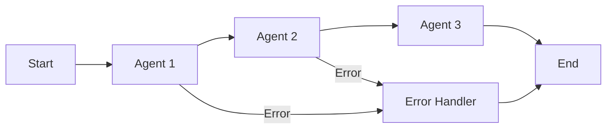

# AgentMap Fundamentals

Master the fundamental concepts of AgentMap to build powerful AI workflows. This guide covers the essential building blocks: workflows, agents, state management, and the CSV schema that ties it all together.

## 🎯 What is AgentMap?

AgentMap is a declarative orchestration framework that transforms simple CSV files into sophisticated AI agent workflows. It bridges the gap between complex AI capabilities and simple, maintainable configuration.

### Core Philosophy
- **Declarative over Imperative**: Describe what you want, not how to do it
- **CSV-First**: Configuration that's human-readable and version-control friendly
- **Clean Architecture**: Separation of concerns with dependency injection
- **AI-Native**: Built specifically for LLM and AI agent orchestration

---

## 🧩 Core Components

### 1. **Workflows (Graphs)**
A workflow is a connected series of agents that process data step by step.



**Key Characteristics**:
- **Directed Graph**: Clear flow from start to end
- **Error Handling**: Every step can handle failures gracefully
- **State Passing**: Data flows between agents automatically
- **Parallel Execution**: Support for branching and parallel paths

### 2. **Agents**
Agents are the building blocks that perform specific tasks within workflows.

**Agent Categories**:
- **Input Agents**: Collect user input or external data
- **LLM Agents**: Process data using language models (OpenAI, Anthropic, Google)
- **Custom Agents**: Your business logic and external integrations
- **Utility Agents**: Formatting, validation, and data transformation

### 3. **State Management**
State is the data that flows between agents throughout workflow execution.

```python
# Example state evolution
initial_state = {"user_input": "What's the weather in London?"}

# After location extraction agent
state = {
    "user_input": "What's the weather in London?",
    "location": "London",
    "last_action_success": True
}

# After weather API agent
state = {
    "user_input": "What's the weather in London?",
    "location": "London",
    "weather_data": {"temp": 18, "condition": "cloudy"},
    "last_action_success": True
}
```

---

## 📝 CSV Schema Fundamentals

AgentMap workflows are defined using a simple CSV format with 10 core columns:

| Column | Purpose | Example |
|--------|---------|---------|
| `GraphName` | Workflow identifier | `WeatherBot` |
| `Node` | Agent name | `GetWeather` |
| `Edge` | Connection definition | `GetWeather->GenerateReport` |
| `Context` | Agent configuration | `{"api_key": "weather_api"}` |
| `AgentType` | Type of agent | `custom:WeatherAPI` |
| `Success_Next` | Next agent on success | `GenerateReport` |
| `Failure_Next` | Next agent on failure | `ErrorHandler` |
| `Input_Fields` | Required state fields | `location\|api_key` |
| `Output_Field` | Field agent creates | `weather_data` |
| `Prompt` | LLM prompt template | `Weather for {location}: {weather_data}` |
| `Description` | Human-readable explanation | `Fetch current weather data` |

### Simple Example
```csv
GraphName,Node,Edge,Context,AgentType,Success_Next,Failure_Next,Input_Fields,Output_Field,Prompt,Description
WeatherBot,GetLocation,,Get user location,input,FetchWeather,Error,,location,What city?,Start workflow
WeatherBot,FetchWeather,,Fetch weather data,custom:WeatherAPI,GenerateReport,Error,location,weather_data,,Get weather
WeatherBot,GenerateReport,,Create report,llm,End,Error,weather_data|location,report,Generate weather report for {location},Create report
WeatherBot,Error,,Handle errors,echo,End,,error,error_msg,,Error handling
WeatherBot,End,,Complete,echo,,,report|error_msg,result,,Finish
```

---

## 🔄 Workflow Execution Flow

### 1. **Initialization**
```bash
agentmap run --graph WeatherBot --csv weather.csv
```

### 2. **Graph Building**
- AgentMap parses the CSV file
- Creates a directed graph of connected agents
- Validates all connections and dependencies
- Initializes the dependency injection container

### 3. **Execution**
- Starts with the first agent (no dependencies)
- Each agent processes the current state
- State is updated with agent outputs
- Flow continues to the next agent based on success/failure

### 4. **Completion**
- Execution continues until reaching an end node
- Final state contains all accumulated data
- Cleanup and resource release occurs automatically

---

## 🎛️ Agent Types Deep Dive

### Built-in Agent Types

#### **Input Agents**
Collect data from users or external sources:
```csv
UserInput,GetQuery,,Collect user query,input,ProcessQuery,,input_text,user_query,What can I help you with?,
```

#### **LLM Agents**
Process data using language models:
```csv
Assistant,Respond,,Generate response,openai,End,,user_query,response,"You are a helpful assistant. User: {user_query}",
```

#### **Custom Agents**
Your business logic:
```csv
Weather,FetchAPI,,Get weather data,custom:WeatherAPI,Success,Error,location,weather_data,,
```

#### **Utility Agents**
Data transformation and formatting:
```csv
Format,CleanData,,Clean response,echo,End,,raw_data,clean_data,,
```

### Agent Configuration
Agents can be configured using the Context column:

```csv
# Simple configuration
LLMBot,Chat,,"{'temperature': 0.7, 'max_tokens': 150}",openai,End,,query,response,

# Complex configuration with multiple options
APIBot,CallService,,"{'timeout': 30, 'retries': 3, 'base_url': 'https://api.example.com'}",custom:APIClient,Success,Error,
```

---

## 📊 State Management Patterns

### Input Field Specification
Use the `Input_Fields` column to specify what data an agent needs:

```csv
# Single field
Node1,Agent1,,,custom,Next,Error,location,result,,

# Multiple fields separated by |
Node2,Agent2,,,custom,Next,Error,location|api_key|timeout,result,,

# All available state (rarely needed)
Node3,Agent3,,,custom,Next,Error,*,result,,
```

### Output Field Management
The `Output_Field` specifies what new data the agent adds to state:

```csv
# Agent adds 'weather_data' to state
WeatherAPI,GetWeather,,,custom:Weather,Next,Error,location,weather_data,,

# Agent adds 'summary' to state
Summarizer,CreateSummary,,,openai,Next,Error,weather_data,summary,"Summarize: {weather_data}",
```

### State Evolution Example
```python
# Initial state
{"location": "London"}

# After weather agent
{"location": "London", "weather_data": {"temp": 18}}

# After summary agent  
{"location": "London", "weather_data": {"temp": 18}, "summary": "Currently 18°C in London"}
```

---

## 🚀 Getting Started Checklist

### 1. **Environment Setup**
- [ ] Python 3.8+ installed
- [ ] AgentMap installed (`pip install agentmap`)
- [ ] Required API keys configured (OpenAI, etc.)

### 2. **First Workflow**
- [ ] Create simple CSV file with 3-5 agents
- [ ] Test with `agentmap run` command
- [ ] Verify output and debug any issues

### 3. **Expand Gradually**
- [ ] Add error handling to all paths
- [ ] Implement custom agents for your use case
- [ ] Add LLM agents for AI processing
- [ ] Test with various inputs and edge cases

---

## 📚 Next Steps

### **Continue Learning**
1. **[Understanding Workflows](./workflows)** - Deep dive into workflow patterns
2. **[State Management](/docs/guides/learning-paths/core/state-management)** - Advanced state handling techniques
3. **[CSV Schema Deep Dive](./csv-schema)** - Complete CSV format understanding

### **Build Something Real**
1. **[Weather Bot Tutorial](/docs/tutorials/weather-bot)** - Your first complete workflow
2. **[Data Pipeline Tutorial](/docs/tutorials/data-processing-pipeline)** - Data transformation patterns
3. **[Customer Support Bot](/docs/tutorials/customer-support-bot)** - Multi-agent coordination

### **Advanced Topics**
1. **[Custom Agent Development](/docs/guides/development/agents/custom-agents)** - Build your own agents
2. **[Memory Management](/docs/guides/development/agent-memory/memory-management)** - Conversational AI
3. **[Service Integration](/docs/contributing/service-injection)** - Enterprise integration patterns

---

## 💡 Pro Tips

### **Workflow Design**
- Start simple and add complexity incrementally
- Always include error handling paths
- Use meaningful agent names that describe their function
- Test each agent individually before building complex workflows

### **Debugging**
- Use the CLI graph inspector to visualize workflows
- Add logging agents to debug state changes
- Test with simple inputs before complex scenarios
- Use echo agents to verify state at checkpoints

### **Performance**
- Minimize state size by only passing needed fields
- Use caching for expensive operations
- Consider parallel execution for independent tasks
- Monitor execution time and optimize bottlenecks

---

## 🤝 Community Resources

- **[GitHub Repository](https://github.com/jwwelbor/AgentMap)** - Source code and issues
- **[Example Workflows](https://github.com/jwwelbor/AgentMap-Examples)** - Real-world examples
- **[Community Discord](https://discord.gg/agentmap)** - Get help and share ideas
- **[Discussions](https://github.com/jwwelbor/AgentMap/discussions)** - Q&A and feature requests

---

*Ready to build your first workflow? Start with our [Quick Start Guide](/docs/getting-started) or dive into the [Weather Bot Tutorial](/docs/tutorials/weather-bot)!*

**Last updated: June 28, 2025**
