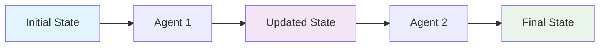

# State Management & Data Flow

State management is at the heart of AgentMap workflows. Understanding how data flows between agents and evolves throughout workflow execution is essential for building effective AI workflows.

## What is State?

**State** is the data container that flows through your workflow, carrying information from one agent to the next. Think of it as a shared notebook that each agent can read from and write to.

```python
# Initial state - simple input
state = {"user_input": "What's the weather in London?"}

# State after location extraction
state = {
    "user_input": "What's the weather in London?",
    "location": "London",
    "last_action_success": True
}

# State after weather API call
state = {
    "user_input": "What's the weather in London?",
    "location": "London", 
    "weather_data": {"temp": 18, "condition": "cloudy"},
    "last_action_success": True
}

# Final state after response generation
state = {
    "user_input": "What's the weather in London?",
    "location": "London",
    "weather_data": {"temp": 18, "condition": "cloudy"},
    "response": "It's currently 18°C and cloudy in London.",
    "last_action_success": True
}
```

---

## State Structure

### Core State Fields

Every AgentMap state includes these system fields:

- **`last_action_success`**: Boolean indicating if the last agent succeeded
- **User Data**: Fields created by your agents (inputs, outputs, processed data)
- **Error Information**: When agents fail, error details are stored

### State Evolution Pattern



State grows as it moves through the workflow - each agent adds new information while preserving existing data.

---

## Input and Output Fields

### Controlling Data Flow

Use CSV columns to control what data flows between agents:

| CSV Column | Purpose | Example |
|------------|---------|---------|
| `Input_Fields` | What data this agent can access | `location\|weather_data` |
| `Output_Field` | Where this agent stores its result | `summary` |

### Input Field Specification

```csv
# Agent can access only 'location' field
WeatherBot,GetWeather,,,weather_api,Success,Error,location,weather_data,,

# Agent can access multiple fields
WeatherBot,CreateReport,,,openai,End,Error,location|weather_data,report,,

# Agent can access all available state (use sparingly)
WeatherBot,FullProcessor,,,custom,End,Error,*,result,,
```

### Output Field Management

Each agent should specify where it stores its result:

```csv
GraphName,Node,Context,AgentType,Success_Next,Failure_Next,Input_Fields,Output_Field,Prompt
WeatherBot,GetLocation,Get user location,input,FetchWeather,Error,,location,Enter city name:
WeatherBot,FetchWeather,Get weather data,weather_api,CreateSummary,Error,location,weather_data,
WeatherBot,CreateSummary,Summarize weather,openai,End,Error,location|weather_data,summary,Create weather summary
```

---

## Data Flow Patterns

### 1. **Linear Data Flow**
Data flows sequentially through agents:

```
Input → Process → Transform → Output
```

**Example:**
```csv
Pipeline,GetData,,,input,ProcessData,Error,,raw_data,Enter data:
Pipeline,ProcessData,,,transformer,FormatData,Error,raw_data,processed_data,
Pipeline,FormatData,,,formatter,End,Error,processed_data,formatted_data,
```

### 2. **Data Accumulation**
Each agent adds more information:

```
Base Data → + Feature A → + Feature B → + Feature C → Complete Dataset
```

**Example:**
```csv
Enrichment,GetUser,,,input,AddProfile,Error,,user_id,Enter user ID:
Enrichment,AddProfile,,,profile_service,AddPreferences,Error,user_id,profile_data,
Enrichment,AddPreferences,,,preference_service,AddHistory,Error,user_id,preferences,
Enrichment,AddHistory,,,history_service,End,Error,user_id,history,
```

### 3. **Data Branching**
Different agents process different aspects:

```
Input → Split → Process A | Process B → Merge → Output
```

**Example:**
```csv
Analysis,SplitData,,,splitter,AnalyzeA|AnalyzeB,Error,input,split_data,
Analysis,AnalyzeA,,,analyzer_a,Merge,Error,split_data,result_a,
Analysis,AnalyzeB,,,analyzer_b,Merge,Error,split_data,result_b,
Analysis,Merge,,,merger,End,Error,result_a|result_b,final_result,
```

### 4. **Conditional Processing**
Data flow depends on content or results:

```
Input → Classify → Route to Specialist → Process → Output
```

**Example:**
```csv
Support,ClassifyRequest,,,classifier,RouteRequest,Error,user_request,request_type,
Support,RouteRequest,,,branching,Technical|Billing|General,Error,request_type,routing,
Support,Technical,,,tech_specialist,End,Error,user_request,tech_response,
Support,Billing,,,billing_specialist,End,Error,user_request,billing_response,
Support,General,,,general_specialist,End,Error,user_request,general_response,
```

---

## State Management Best Practices

### ✅ **Do This**

1. **Use Descriptive Field Names**: Make state fields self-documenting
   ```python
   # Good
   state = {"user_question": "...", "weather_data": "...", "formatted_response": "..."}
   
   # Bad  
   state = {"input": "...", "data": "...", "output": "..."}
   ```

2. **Minimize State Size**: Only include necessary data
   ```csv
   # Good - specific fields
   Node1,Agent1,,,custom,Next,Error,location|api_key,weather_data,
   
   # Bad - everything (unless truly needed)
   Node1,Agent1,,,custom,Next,Error,*,weather_data,
   ```

3. **Plan Data Evolution**: Design how state grows through your workflow
   ```
   user_input → location → weather_data → summary → response
   ```

4. **Handle Missing Data**: Provide defaults for optional fields
   ```python
   location = state.get("location", "Unknown")
   temperature = state.get("temperature", "N/A")
   ```

### ❌ **Avoid This**

1. **Overwriting Important Data**: Don't reuse field names carelessly
2. **Undefined Field References**: Don't reference fields that might not exist
3. **Circular Dependencies**: Don't create loops in data dependencies
4. **Massive State Objects**: Keep state focused and relevant

---

## State in Different Agent Types

### Input Agents
Create initial state fields:
```csv
ChatBot,GetUserInput,,,input,ProcessInput,Error,,user_message,What can I help you with?
```
**State After**: `{"user_message": "Hello!"}`

### LLM Agents  
Process existing fields and create new ones:
```csv
ChatBot,GenerateResponse,,,openai,End,Error,user_message,ai_response,Respond to: {user_message}
```
**State After**: `{"user_message": "Hello!", "ai_response": "Hi there!"}`

### Custom Agents
Transform or enrich data:
```csv
Weather,FetchWeather,,,custom:WeatherAPI,Format,Error,location,weather_data,
```
**State After**: `{"location": "London", "weather_data": {"temp": 18, "condition": "cloudy"}}`

### Echo Agents
Pass through or format existing data:
```csv
Output,FormatResponse,,,echo,End,Error,ai_response,formatted_response,
```
**State After**: (formats existing `ai_response` field)

---

## Error Handling in State

### Error State Management

When agents encounter errors:

1. **Error Information**: Error details are added to state
2. **Success Flag**: `last_action_success` is set to `False`
3. **Failure Routing**: Workflow follows `Failure_Next` path
4. **Recovery Options**: Error handlers can process error information

### Error Handling Example

```csv
GraphName,Node,Context,AgentType,Success_Next,Failure_Next,Input_Fields,Output_Field,Prompt
SafeBot,ProcessData,,,processor,Success,HandleError,raw_data,processed_data,
SafeBot,HandleError,,,error_handler,Retry,FinalError,error,recovery_plan,
SafeBot,Retry,,,processor,Success,FinalError,raw_data,processed_data,
SafeBot,Success,,,echo,End,,processed_data,final_result,
SafeBot,FinalError,,,echo,End,,error,error_message,
```

### Error State Evolution

```python
# Normal execution
state = {"raw_data": "input", "processed_data": "result", "last_action_success": True}

# After error
state = {
    "raw_data": "input",
    "error": "Processing failed: Invalid format",
    "last_action_success": False
}

# After error handling
state = {
    "raw_data": "input", 
    "error": "Processing failed: Invalid format",
    "recovery_plan": "Retry with different format",
    "last_action_success": True
}
```

---

## Memory and Conversational State

### Memory in LLM Agents

For conversational workflows, AgentMap can manage memory:

```csv
ChatBot,Chat,,"{'memory_type': 'buffer'}",openai,Continue,Error,user_input,response,You are a helpful assistant
```

### Memory State Structure

```python
state = {
    "user_input": "What's the weather?",
    "response": "I'd be happy to help! What city?", 
    "chat_memory": {
        "_type": "langchain_memory",
        "memory_type": "buffer",
        "messages": [
            {"type": "human", "content": "What's the weather?"},
            {"type": "ai", "content": "I'd be happy to help! What city?"}
        ]
    }
}
```

### Memory Best Practices

1. **Memory Field Naming**: Use consistent field names like `chat_memory`
2. **Memory Serialization**: Memory is automatically serialized/deserialized
3. **Memory Lifecycle**: Memory persists across conversation turns
4. **Memory Cleanup**: Clear memory when conversations end

---

## Debugging State Flow

### Common State Issues

1. **Missing Fields**: Agent expects field that doesn't exist
2. **Type Mismatches**: Field contains unexpected data type
3. **State Bloat**: State becomes too large and slow
4. **Field Overwrites**: Important data gets accidentally overwritten

### Debugging Techniques

1. **Add Echo Agents**: Use echo agents to inspect state at checkpoints
   ```csv
   Debug,CheckState,,,echo,Continue,Error,*,debug_output,Current state: {*}
   ```

2. **Enable Execution Tracking**: Monitor state changes during execution
   ```bash
   agentmap run --csv workflow.csv --track-state
   ```

3. **Log State Changes**: Add logging in custom agents
   ```python
   def process(self, inputs):
       self.logger.info(f"Agent received: {inputs}")
       result = self.do_processing(inputs)
       self.logger.info(f"Agent produced: {result}")
       return result
   ```

4. **Validate State Schema**: Ensure consistent state structure
   ```python
   # In custom agents
   assert "required_field" in inputs, "Missing required field"
   assert isinstance(inputs["temperature"], (int, float)), "Invalid temperature type"
   ```

---

## Performance Considerations

### Optimizing State Performance

1. **Minimize State Size**: Only include necessary data
2. **Avoid Deep Copying**: Reuse immutable data when possible
3. **Clean Up Temporary Data**: Remove intermediate processing fields
4. **Use Efficient Data Types**: Choose appropriate data structures

### Example: State Cleanup Pattern

```csv
Pipeline,ProcessData,,,processor,CleanupState,Error,raw_data,processed_data,
Pipeline,CleanupState,,,cleaner,Continue,Error,processed_data,final_data,
Pipeline,Continue,,,next_step,End,Error,final_data,result,
```

Where the cleaner agent removes unnecessary intermediate fields:

```python
class StateCleanerAgent(BaseAgent):
    def process(self, inputs):
        # Keep only essential fields
        return {
            "final_data": inputs["processed_data"],
            # Remove raw_data, intermediate_results, etc.
        }
```

---

## Related Documentation

### **Core Concepts**
- **[Fundamentals](./fundamentals)** - Basic AgentMap concepts
- **[Workflows](./workflows)** - Workflow design patterns
- **[CSV Schema](./csv-schema)** - Complete CSV format guide

### **Development**
- **[Custom Agents](/docs/guides/development/agents/custom-agents)** - Building agents that work with state
- **[Memory Management](/docs/guides/development/agent-memory/memory-management)** - Advanced conversational state
- **[Service Integration](/docs/contributing/service-injection)** - Enterprise state patterns

### **Operations**  
- **[Execution Tracking](/docs/guides/deploying/monitoring)** - Monitoring state evolution
- **[Performance Optimization](/docs/guides/deploying/monitoring)** - Optimizing state performance
- **[Testing Strategies](/docs/guides/development/testing)** - Testing state management

---

*💡 **Remember**: State is the backbone of your workflow. Design it thoughtfully, keep it clean, and your agents will work together seamlessly!*

**Last updated: June 28, 2025**
