# Lesson 2: Custom Prompts

Building on your success from Lesson 1, you'll now learn the art and science of prompt engineering to create more intelligent, context-aware AI workflows. We'll enhance your Personal Goal Tracker with sophisticated prompting techniques.

## Learning Objectives

By the end of this lesson, you will:
- ✅ Master prompt engineering fundamentals
- ✅ Use dynamic prompt templates with variables
- ✅ Configure AI behavior through context parameters
- ✅ Implement domain-specific AI assistants
- ✅ Optimize AI responses for different use cases

## Overview: What We're Building

We'll enhance the Personal Goal Tracker with:
1. **Smart Goal Detection**: AI identifies goal categories automatically
2. **Specialized Coaches**: Different AI personalities for different goal types
3. **Dynamic Prompting**: Prompts that adapt based on goal content
4. **Advanced Configuration**: Fine-tuned AI parameters for optimal results

```mermaid
flowchart LR
    A[👤 User Goal] --> B[🎯 Goal Classification<br/>AI categorizes goal]
    B --> C{Goal Type?}
    C -->|Health| D[💪 Fitness Coach<br/>Specialized prompts]
    C -->|Career| E[💼 Career Advisor<br/>Professional guidance]
    C -->|Learning| F[📚 Education Mentor<br/>Learning strategies]
    C -->|Other| G[🎯 General Coach<br/>Holistic approach]
    D --> H[💾 Enhanced Analysis<br/>Contextual insights]
    E --> H
    F --> H
    G --> H
    
    style A fill:#e1f5fe
    style B fill:#f3e5f5
    style C fill:#fff3e0
    style H fill:#e8f5e8
```



## Step 1: Download the Enhanced Workflow

Let's get the upgraded workflow file that demonstrates advanced prompting techniques.

import DownloadButton from '@site/src/components/DownloadButton';

<DownloadButton 
  filename="lesson2.csv"
  content={`workflow,node,description,type,next_node,error_node,input_fields,output_field,prompt,context
SmartGoals,GetGoal,Collect user's personal goal,input,ClassifyGoal,ErrorHandler,,goal,What goal would you like to achieve? Please describe it in detail with any relevant context about your situation:,
SmartGoals,ClassifyGoal,AI classifies the goal category,llm,RouteToCoach,ErrorHandler,goal,goal_category,"You are a goal classification expert. Analyze this goal and classify it into ONE category: HEALTH (fitness nutrition mental-health), CAREER (professional job business), LEARNING (education skills knowledge), FINANCIAL (money investment savings), PERSONAL (relationships hobbies lifestyle), or OTHER.

Respond with ONLY the category name. Goal: {goal}","{""provider"": ""anthropic"", ""model"": ""claude-3-sonnet-20240229"", ""temperature"": 0.1}"
SmartGoals,RouteToCoach,Route to specialized coach based on category,orchestrator,HealthCoach,ErrorHandler,"goal,goal_category",coach_selection,,"{""nodes"": ""HealthCoach|CareerCoach|LearningCoach|GeneralCoach""}"
SmartGoals,HealthCoach,Specialized health and fitness coaching,llm,SaveAnalysis,ErrorHandler,"goal,goal_category",detailed_analysis,"🏃‍♀️ **FITNESS & WELLNESS COACH**

I'm your personal fitness and wellness coach! Let me help you achieve your health goal with evidence-based strategies.

**Your Goal**: {goal}

## 🎯 Goal Analysis
**Why this matters**: [Explain health benefits and importance]

## 📋 Your Action Plan
**Week 1-2**: [Specific fitness/nutrition steps]
**Week 3-4**: [Progressive advancement]
**Month 2**: [Intermediate milestones]
**Month 3+**: [Long-term sustainability]

## 🔥 Motivation Boosters
- [Specific motivational strategies]
- [Progress tracking methods]
- [Community/accountability suggestions]

## ⚠️ Common Obstacles & Solutions
**Challenge**: [Likely obstacle]
**Solution**: [Specific strategy to overcome]

## 📊 Success Metrics
[Specific, measurable indicators of progress]

Remember: Small consistent actions compound into extraordinary results! 💪","{""provider"": ""anthropic"", ""model"": ""claude-3-sonnet-20240229"", ""temperature"": 0.4}"
SmartGoals,CareerCoach,Specialized career and professional coaching,llm,SaveAnalysis,ErrorHandler,"goal,goal_category",detailed_analysis,"💼 **CAREER ADVANCEMENT COACH**

I'm your career development strategist! Let's turn your professional aspirations into a strategic action plan.

**Your Goal**: {goal}

## 🎯 Strategic Assessment
**Market Value**: [Why this goal advances your career]
**Industry Context**: [Relevant market/industry insights]

## 🚀 Professional Action Plan
**Immediate (30 days)**: [Quick wins and foundational steps]
**Short-term (90 days)**: [Skill building and networking]
**Medium-term (6 months)**: [Major milestones and achievements]
**Long-term (1 year+)**: [Career positioning and growth]

## 🤝 Networking Strategy
- [Specific networking opportunities]
- [Industry events and communities]
- [Mentorship recommendations]

## 📈 Skill Development
**Core Skills**: [Essential capabilities to develop]
**Supporting Skills**: [Complementary abilities]
**Learning Resources**: [Specific courses, books, platforms]

## 🧗‍♀️ Potential Challenges
**Challenge**: [Professional obstacle]
**Mitigation**: [Strategic solution]

## 📊 Success Indicators
[Concrete metrics for career progress]

Your career is a marathon, not a sprint - let's build sustainable momentum! 🚀","{""provider"": ""anthropic"", ""model"": ""claude-3-sonnet-20240229"", ""temperature"": 0.3}"
SmartGoals,LearningCoach,Specialized education and learning coaching,llm,SaveAnalysis,ErrorHandler,"goal,goal_category",detailed_analysis,"📚 **LEARNING & EDUCATION MENTOR**

I'm your learning optimization specialist! Let's design a personalized education strategy that maximizes retention and application.

**Your Goal**: {goal}

## 🧠 Learning Strategy Analysis
**Learning Style Assessment**: [Recommended approach based on goal]
**Complexity Level**: [Skill level and prerequisites]

## 📖 Structured Learning Path
**Foundation Phase (Week 1-2)**: [Core concepts and basics]
**Building Phase (Week 3-6)**: [Intermediate skills and practice]
**Application Phase (Week 7-10)**: [Real-world projects and implementation]
**Mastery Phase (Week 11+)**: [Advanced concepts and teaching others]

## 🛠️ Learning Tools & Resources
**Primary Resources**: [Main learning materials]
**Practice Platforms**: [Hands-on learning opportunities]
**Community Learning**: [Study groups, forums, mentors]

## 🎯 Active Learning Techniques
- [Specific study methods for this subject]
- [Retention strategies and spaced repetition]
- [Application exercises and projects]

## 🚧 Learning Obstacles & Solutions
**Challenge**: [Common learning difficulties]
**Solution**: [Evidence-based learning strategies]

## 📊 Progress Tracking
[Specific milestones and assessment methods]

Remember: The best learning happens when you actively apply what you're studying! 🎓","{""provider"": ""anthropic"", ""model"": ""claude-3-sonnet-20240229"", ""temperature"": 0.3}"
SmartGoals,GeneralCoach,General purpose life coaching,llm,SaveAnalysis,ErrorHandler,"goal,goal_category",detailed_analysis,"🌟 **HOLISTIC LIFE COACH**

I'm your personal development guide! Let's create a comprehensive approach to achieving your goal that integrates all aspects of your life.

**Your Goal**: {goal}
**Category**: {goal_category}

## 🎯 Holistic Goal Analysis
**Life Impact**: [How this goal affects different life areas]
**Value Alignment**: [Connection to your deeper values and purpose]

## 🏗️ Integrated Action Plan
**Mindset Foundation**: [Mental and emotional preparation]
**Practical Steps**: [Concrete actions and behaviors]
**Environment Design**: [Optimizing your surroundings for success]
**Habit Integration**: [Building sustainable routines]

## ⚖️ Life Balance Considerations
**Time Management**: [How to fit this goal into your life]
**Energy Management**: [Sustainable effort allocation]
**Relationship Impact**: [How this goal affects important relationships]

## 🔄 Systems Thinking
**Supporting Systems**: [What structures need to be in place]
**Feedback Loops**: [How you'll monitor and adjust]
**Contingency Planning**: [Backup plans and flexibility]

## 🌱 Growth Mindset Development
**Challenge Reframing**: [How to view obstacles as opportunities]
**Learning Integration**: [Extracting lessons from setbacks]

## 📊 Holistic Success Metrics
[Multi-dimensional progress indicators]

Your goal is part of your larger life story - let's make it a chapter worth writing! ✨","{""provider"": ""anthropic"", ""model"": ""claude-3-sonnet-20240229"", ""temperature"": 0.5}"
SmartGoals,SaveAnalysis,Save goal analysis to specialized database,csv_writer,ThankUser,ErrorHandler,"goal,goal_category,detailed_analysis",save_result,data/smart_goals_analysis.csv,"{""format"": ""records"", ""mode"": ""append""}"
SmartGoals,ThankUser,Provide completion summary,echo,End,,"save_result",final_message,"🎉 **Goal Analysis Complete!**

Your {goal_category} goal has been analyzed by our specialized coach and saved to your personal database.

✅ **What's Been Created**:
- Detailed action plan tailored to your goal type
- Specific strategies and techniques
- Progress tracking framework
- Obstacle anticipation and solutions

📁 **Find Your Analysis**: data/smart_goals_analysis.csv

🚀 **Next Steps**: Review your personalized action plan and start with the first recommended step!",
SmartGoals,ErrorHandler,Handle workflow errors gracefully,echo,End,,error,error_message,❌ **Error Occurred**: {error} - Please check your setup and try again.,
SmartGoals,End,Workflow completion,echo,,,final_message,completion,✨ Workflow completed successfully!,`}
/>

## Step 2: Understanding Advanced Prompting

### Prompt Engineering Fundamentals

**What Makes a Great Prompt?**
1. **Clear Role Definition**: "You are a fitness coach..."
2. **Specific Instructions**: Exact format and content requirements
3. **Context Awareness**: Using input variables like `{goal}`
4. **Output Structure**: Defined sections and formatting
5. **Personality**: Tone and style that matches the use case

### Dynamic Prompt Templates

Notice how our prompts use variables to create dynamic content:

```
Your Goal: {goal}
Category: {goal_category}
```

This allows one prompt template to work with any user input while maintaining personalization.

### Temperature Settings Explained

| Temperature | Use Case | Example |
|-------------|----------|---------|
| **0.1** | Classification, precise answers | Goal categorization |
| **0.3** | Professional advice, structured responses | Career coaching |
| **0.4** | Creative but focused content | Health coaching |
| **0.5** | Balanced creativity and structure | General life coaching |
| **0.7+** | Creative writing, brainstorming | (Not used in this lesson) |

## Step 3: Advanced Agent Configuration

### Goal Classification Agent
```csv
SmartGoals,ClassifyGoal,AI classifies the goal category,llm,RouteToCoach,ErrorHandler,goal,goal_category,"You are a goal classification expert...","{""provider"": ""anthropic"", ""model"": ""claude-3-sonnet-20240229"", ""temperature"": 0.1}"
```

**Why Temperature 0.1?**
- Classification needs consistency
- We want the same goal to always get the same category
- Low temperature reduces randomness

### Specialized Coach Agents

Each coach has a unique personality and approach:

**Health Coach**:
- Emoji: 🏃‍♀️ (energetic fitness vibe)
- Temperature: 0.4 (creative but structured)
- Focus: Evidence-based fitness strategies

**Career Coach**:
- Emoji: 💼 (professional)
- Temperature: 0.3 (structured professional advice)
- Focus: Strategic career advancement

**Learning Coach**:
- Emoji: 📚 (educational)
- Temperature: 0.3 (methodical learning approaches)
- Focus: Learning optimization techniques

**General Coach**:
- Emoji: 🌟 (inspirational)
- Temperature: 0.5 (balanced and holistic)
- Focus: Life integration and systems thinking

## Step 4: The Orchestrator Agent

### Intelligent Routing

```csv
SmartGoals,RouteToCoach,Route to specialized coach based on category,orchestrator,HealthCoach,ErrorHandler,"goal,goal_category",coach_selection,,"{""nodes"": ""HealthCoach|CareerCoach|LearningCoach|GeneralCoach""}"
```

The **OrchestratorAgent** automatically routes to the appropriate coach based on the goal category:

- `HEALTH` → HealthCoach
- `CAREER` → CareerCoach  
- `LEARNING` → LearningCoach
- All others → GeneralCoach

## Step 5: Running the Enhanced Workflow

### Setup and Execution

```bash
# Make sure you have your API key set
export ANTHROPIC_API_KEY="your-api-key-here"

# Save lesson2.csv to your project directory
# Run the enhanced workflow
agentmap run lesson2.csv
```

### Example Interaction

```
What goal would you like to achieve? Please describe it in detail with any relevant context about your situation:
> I want to lose 20 pounds in 6 months and build a sustainable exercise routine because I've been feeling low energy lately

[AI classifies as HEALTH goal...]
[Routes to HealthCoach...]
[Generates detailed fitness plan...]

🎉 Goal Analysis Complete!

Your HEALTH goal has been analyzed by our specialized coach and saved to your personal database.

✅ What's Been Created:
- Detailed action plan tailored to your goal type
- Specific strategies and techniques  
- Progress tracking framework
- Obstacle anticipation and solutions

📁 Find Your Analysis: data/smart_goals_analysis.csv
```

## Step 6: Examining the Enhanced Output

Check your detailed analysis:

```bash
cat data/smart_goals_analysis.csv
```

You'll see structured output with:
- Goal classification
- Specialized coaching advice
- Action plans with timelines
- Specific strategies and techniques
- Progress tracking methods

## Step 7: Prompt Engineering Exercises

### Exercise 1: Create a Finance Coach

Add a specialized finance coach by modifying the workflow:

```csv
SmartGoals,FinanceCoach,Specialized financial planning coaching,llm,SaveAnalysis,ErrorHandler,"goal,goal_category",detailed_analysis,"💰 **FINANCIAL PLANNING ADVISOR**

I'm your personal finance strategist! Let's turn your financial goal into a concrete action plan.

**Your Goal**: {goal}

## 💡 Financial Strategy Analysis
**Goal Type**: [Investment, saving, debt reduction, etc.]
**Risk Assessment**: [Conservative, moderate, aggressive approach]

## 📊 Financial Action Plan
**Month 1**: [Immediate financial steps]
**Months 2-3**: [Building momentum]
**Months 4-6**: [Milestone achievements]
**Long-term**: [Sustained financial health]

## 🎯 Specific Recommendations
- [Concrete financial actions]
- [Tools and apps to use]
- [Tracking and budgeting methods]

## ⚠️ Risk Management
**Potential Pitfalls**: [Common financial mistakes]
**Protection Strategies**: [How to avoid setbacks]

## 📈 Success Metrics
[Specific financial KPIs to track]

Remember: Building wealth is about consistent, smart decisions over time! 💪","{""provider"": ""anthropic"", ""model"": ""claude-3-sonnet-20240229"", ""temperature"": 0.3}"
```

### Exercise 2: Modify Classification Logic

Update the ClassifyGoal prompt to include FINANCIAL as a category:

```
You are a goal classification expert. Analyze this goal and classify it into ONE category: HEALTH (fitness nutrition mental-health), CAREER (professional job business), LEARNING (education skills knowledge), FINANCIAL (money investment savings budgeting), PERSONAL (relationships hobbies lifestyle), or OTHER.
```

### Exercise 3: Experiment with Temperature

Try different temperature settings for the coaches:

**More Creative Health Coach** (temperature 0.6):
```json
{"provider": "anthropic", "model": "claude-3-sonnet-20240229", "temperature": 0.6}
```

**More Precise Career Coach** (temperature 0.2):
```json
{"provider": "anthropic", "model": "claude-3-sonnet-20240229", "temperature": 0.2}
```

## Step 8: Advanced Prompting Techniques

### 1. **Structured Output Formatting**

Use markdown and emojis to create visually appealing responses:
```
## 🎯 Goal Analysis
**Why this matters**: [explanation]

## 📋 Action Plan
**Week 1**: [specific tasks]
```

### 2. **Role-Based Prompting**

Define clear expertise areas:
```
You are a certified fitness trainer with 10 years of experience specializing in sustainable weight loss...
```

### 3. **Context-Aware Prompting**

Use multiple input variables:
```
Your Goal: {goal}
Category: {goal_category}
Current Situation: {context}
```

### 4. **Output Constraints**

Specify format requirements:
```
Respond with exactly 3 bullet points, each starting with an action verb...
```

## Key Concepts Learned

### 1. **Prompt Engineering Principles**
- Clear role definition creates better AI responses
- Structured output formatting improves readability
- Variable injection enables dynamic personalization
- Temperature controls creativity vs. consistency

### 2. **Specialized AI Assistants**
- Different domains need different approaches
- Personality and tone matter for user experience
- Context-specific knowledge improves relevance
- Template reusability across similar use cases

### 3. **Intelligent Workflow Routing**
- OrchestratorAgent enables smart routing decisions
- Classification enables specialized processing
- Multi-path workflows handle diverse inputs
- Error handling maintains workflow robustness

### 4. **Configuration Optimization**
- Temperature settings affect response style
- Model selection impacts capability and cost
- Provider choice depends on specific needs
- Context parameters fine-tune behavior

## Troubleshooting

### Issue: Classification is inconsistent
**Solution**: Lower the temperature for the classification agent:
```json
{"temperature": 0.1}
```

### Issue: Coach responses are too generic
**Solution**: Add more specific role definition and examples in prompts.

### Issue: Routing doesn't work correctly
**Solution**: Check that node names in orchestrator context match actual node names.

## Best Practices Learned

### 1. **Prompt Design**
- Start with role definition
- Provide specific instructions
- Use structured output formatting
- Include examples when helpful

### 2. **Temperature Selection**
- Use low temperature (0.1-0.2) for classification
- Use medium temperature (0.3-0.4) for structured advice
- Use higher temperature (0.5+) for creative content

### 3. **Workflow Design**
- Separate classification from processing
- Use specialized agents for different domains
- Implement error handling at each step
- Provide clear user feedback

## Next Steps

Outstanding work! You've mastered:
- ✅ Advanced prompt engineering techniques
- ✅ Dynamic template creation with variables
- ✅ AI behavior configuration through context
- ✅ Intelligent workflow routing with orchestration
- ✅ Domain-specific AI assistant creation

In Lesson 3, we'll take the next major step: creating your own custom agent by extending the BaseAgent class and implementing custom business logic.

**[Continue to Lesson 3: Custom Agent Development →](./03-custom-agent)**

---

## Additional Resources

- **[Prompt Engineering Guide](/docs/guides/development/prompt-management)**
- **[LLMAgent Configuration](/docs/reference/services/llm-service)**
- **[OrchestratorAgent Reference](/docs/reference/agents/custom-agents#orchestratoragent)**
- **[AI Provider Setup](/docs/deployment/configuration)**

---

*💡 **Pro Tip**: Save examples of effective prompts you create - they become valuable templates for future workflows! Also, experiment with different personalities and tones to see how they affect user engagement.*
