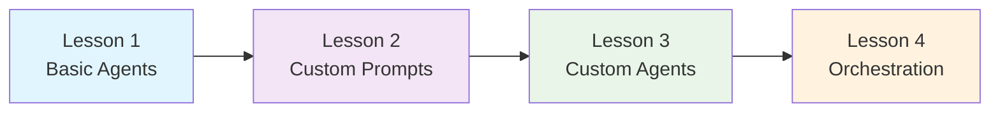

# AgentMap Learning Guide

Welcome to the comprehensive AgentMap Learning Guide! This hands-on tutorial series takes you from basic workflow creation to advanced multi-agent orchestration through four progressive lessons.

## Learning Path Overview

Each lesson builds upon the previous one, introducing new concepts while reinforcing what you've learned. You'll work with real code examples and downloadable CSV files throughout the journey.

### 🎯 What You'll Learn

- **Agent Fundamentals**: Creating workflows with built-in agents
- **Prompt Engineering**: Customizing AI behavior through effective prompting
- **Custom Agent Development**: Building your own specialized agents
- **Multi-Agent Orchestration**: Coordinating multiple agents intelligently

### 📈 Learning Progression



## Lesson Overview

### Lesson 1: Basic Agents
**Duration**: 30-45 minutes | **Difficulty**: Beginner

Learn the fundamentals by creating a simple workflow that collects user input, processes it with AI, and saves the results to a CSV file.

**Key Concepts**:
- InputAgent for user interaction
- LLMAgent for AI processing
- CSVWriterAgent for data persistence
- Basic workflow structure

**What You'll Build**: A simple data collection and processing pipeline

---

### Lesson 2: Custom Prompts  
**Duration**: 45-60 minutes | **Difficulty**: Beginner-Intermediate

Enhance your workflow by customizing AI behavior through prompt engineering and context parameters.

**Key Concepts**:
- Prompt template design
- Context parameters for LLMAgent
- Temperature and model selection
- Prompt optimization techniques

**What You'll Build**: An enhanced version of Lesson 1 with intelligent prompt customization

---

### Lesson 3: Custom Agent Development
**Duration**: 60-90 minutes | **Difficulty**: Intermediate

Create your own specialized agent by extending BaseAgent and implementing custom business logic.

**Key Concepts**:
- BaseAgent inheritance patterns
- Custom process() method implementation
- CapableAgent protocols
- Agent scaffold generation
- Error handling and logging

**What You'll Build**: A custom validation agent with specialized processing logic

---

### Lesson 4: Multi-Agent Orchestration
**Duration**: 90-120 minutes | **Difficulty**: Intermediate-Advanced

Build a sophisticated workflow that intelligently routes requests between multiple specialized agents.

**Key Concepts**:
- OrchestratorAgent usage
- Keyword-based routing
- Multiple custom agents
- Advanced workflow patterns
- Agent coordination strategies

**What You'll Build**: An intelligent routing system with multiple specialized processing agents

## Prerequisites

### Technical Requirements
- Python 3.8 or higher
- Basic Python programming knowledge
- Text editor or IDE (VS Code recommended)
- Terminal/command line familiarity

### AgentMap Setup
Ensure you have AgentMap installed and configured:

```bash
pip install agentmap
agentmap --version
```

### Recommended Knowledge
- Basic understanding of CSV files
- Familiarity with JSON syntax
- Basic command line usage
- Understanding of Python dictionaries

## Learning Resources

### Documentation Links
- [Quick Start Guide](/docs/getting-started)
- [Agent Reference](/docs/reference/agents/custom-agents)
- [CSV Schema Guide](/docs/reference/csv-schema)
- [Configuration Reference](/docs/deployment/configuration)

### Code Examples Repository
All lesson files are available for download throughout the guide. Each lesson includes:
- Complete CSV workflow files
- Python agent code (where applicable)
- Configuration examples
- Test data samples

## Getting Help

### Community Support
- **GitHub Issues**: Report bugs or ask technical questions
- **Documentation**: Comprehensive reference materials
- **Examples**: Real-world workflow patterns

### Best Practices
- **Start Simple**: Complete each lesson in order
- **Experiment**: Modify examples to understand concepts
- **Test Frequently**: Run workflows after each change
- **Save Work**: Keep your lesson files for reference

## Success Tips

### 1. **Follow the Progression**
Each lesson builds on the previous one. Don't skip ahead - the concepts are designed to scaffold your learning.

### 2. **Practice Variations**
Once you complete a lesson, try modifying the examples to deepen your understanding.

### 3. **Use Real Data**
Replace sample data with your own use cases to make the learning more relevant.

### 4. **Join the Community**
Share your progress and get help from other learners in the AgentMap community.

---

## Ready to Start?

Your learning journey begins with understanding the fundamentals. In Lesson 1, you'll create your first AgentMap workflow and see the power of chaining simple agents together.

**[Begin with Lesson 1: Basic Agents →](./01-basic-agents)**

---

*💡 **Pro Tip**: Keep a notebook handy to jot down insights and questions as you work through each lesson. The concepts you learn here will form the foundation for building sophisticated AI workflows.*
