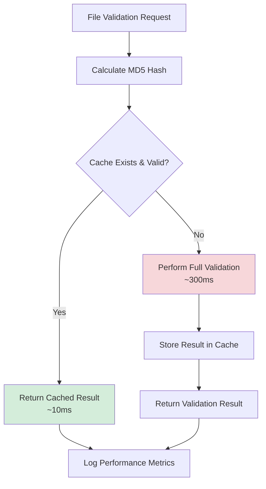

# Performance Optimization & Cache Management

<div style={{marginBottom: '1rem', fontSize: '0.9rem', color: '#666'}}>
  <span>📍 <a href="/docs/intro">AgentMap</a> → <a href="/docs/guides">Guides</a> → <a href="/docs/guides/performance">Performance</a> → <strong>Optimization</strong></span>
</div>

This guide provides comprehensive strategies for optimizing AgentMap performance through intelligent cache management, system tuning, and development workflow optimization.

## Performance Overview

### Performance Impact Areas

AgentMap's performance optimization focuses on several key areas:

- **Validation Speed**: Dramatically reduce validation time through intelligent caching
- **Development Efficiency**: Minimize iteration time during development cycles
- **System Resources**: Optimize memory, CPU, and I/O usage
- **Scalability**: Maintain performance as projects grow in complexity

### Performance Metrics

**Baseline Performance (Without Cache)**:
- Small CSV (< 100 rows): 100-200ms
- Medium CSV (100-1000 rows): 200-500ms  
- Large CSV (1000+ rows): 500-2000ms
- Configuration validation: 50-150ms

**Optimized Performance (With Cache)**:
- Cache hit: 5-20ms (20-100x improvement)
- Cache miss: Same as baseline + caching overhead
- Overall improvement: 80-95% time reduction in typical workflows

## Cache-Based Performance Optimization

### Intelligent Caching Strategy

AgentMap's validation cache provides the most significant performance improvements:



### Cache Performance Analysis

**Development Workflow Example**:
```bash
# Initial validation (cache miss)
time agentmap validate csv --csv workflow.csv
# Result: 280ms (full validation + caching)

# Subsequent validations (cache hit)  
time agentmap validate csv --csv workflow.csv
# Result: 12ms (cache retrieval)

# Performance improvement: 23x faster
```

**Cache Hit Rate Optimization**:
- **Target Hit Rate**: 85-95% for active development
- **Monitoring**: `agentmap validate-cache --stats`
- **Optimization**: Minimize unnecessary file changes

### Cache Performance Tuning

**Cache TTL Optimization**:
```bash
# Development environment (frequent changes)
export AGENTMAP_CACHE_TTL=6h

# Stable environment (infrequent changes)
export AGENTMAP_CACHE_TTL=48h

# CI/CD environment (no cache for reproducibility)
export AGENTMAP_CACHE_TTL=0
```

**Storage Performance Optimization**:
```bash
# Use SSD for cache storage
export AGENTMAP_CACHE_DIR=/fast-ssd/agentmap-cache

# Avoid network storage
# Bad: export AGENTMAP_CACHE_DIR=/nfs/cache
# Good: export AGENTMAP_CACHE_DIR=~/.agentmap/validation_cache
```

## Development Workflow Optimization

### Optimized Development Patterns

**Incremental Development**:
```bash
# 1. Initial validation (cache miss)
agentmap validate csv --csv new_workflow.csv
# Time: 245ms

# 2. Small edit → hash changes → cache miss
# Edit file: Add one row
agentmap validate csv --csv new_workflow.csv  
# Time: 260ms (new cache entry created)

# 3. Multiple checks without changes → cache hits
agentmap validate csv --csv new_workflow.csv
agentmap validate csv --csv new_workflow.csv
agentmap validate csv --csv new_workflow.csv
# Time: 8ms, 7ms, 9ms (cache hits)
```

**Multi-File Validation Optimization**:
```bash
# Validate all files (leverages cache for unchanged files)
agentmap validate all
# Result: 
# - Changed files: Full validation
# - Unchanged files: Cache hits
# - Overall: 70-90% faster than full validation
```

### Cache-Aware Development Practices

**Maximize Cache Efficiency**:

1. **Avoid Unnecessary Changes**: Don't modify files unless needed
2. **Batch Changes**: Make related changes together to minimize cache misses
3. **Use Cache Statistics**: Monitor hit rates to optimize workflow
4. **Leverage Cache**: Don't use `--no-cache` during development

**Example Optimized Workflow**:
```bash
# Morning: Check all validations (mostly cache hits)
agentmap validate all
# Time: ~200ms for 10 files (vs 2000ms without cache)

# Development: Work on specific file
agentmap validate csv --csv workflow.csv  # Initial: 250ms
# Make changes...
agentmap validate csv --csv workflow.csv  # After changes: 270ms
agentmap validate csv --csv workflow.csv  # Double-check: 10ms
agentmap validate csv --csv workflow.csv  # Triple-check: 8ms

# Final check: All files
agentmap validate all
# Time: ~400ms (9 cache hits + 1 full validation)
```

## System-Level Performance Optimization

### Resource Optimization

**Memory Usage**:
- Cache files are small (2-10KB each)
- Minimal memory overhead
- Cache is disk-based, not memory-resident

**CPU Optimization**:
- MD5 hashing is CPU-efficient
- Cache lookup is faster than file parsing
- Parallel validation benefits from cache

**I/O Optimization**:
- Cache reduces repeated file parsing
- SSD storage improves cache performance
- Avoid network storage for cache

### Concurrent Operations

**Parallel Validation with Cache**:
```bash
# Multiple files validated concurrently
agentmap validate csv --csv file1.csv &
agentmap validate csv --csv file2.csv &
agentmap validate csv --csv file3.csv &
wait

# Cache benefits apply to each process
# No cache conflicts (file-based locking)
```

**Development Team Optimization**:
```bash
# Each developer has independent cache
# No cache sharing = no conflicts
# Personal cache optimized for individual workflow
```

## Performance Monitoring and Analysis

### Performance Metrics Collection

**Cache Performance Monitoring**:
```bash
# Basic cache statistics
agentmap validate-cache --stats

# Performance-focused analysis
agentmap validate-cache --stats --verbose | grep -E "(hit rate|time|performance)"
```

**Benchmark Validation Performance**:
```bash
#!/bin/bash
# performance-benchmark.sh

echo "=== AgentMap Performance Benchmark ==="

# Test with cache
echo "With Cache:"
time agentmap validate csv --csv test_file.csv

# Test without cache  
echo "Without Cache:"
time agentmap validate csv --csv test_file.csv --no-cache

# Calculate improvement
echo "Performance improvement analysis completed"
```

### Performance Analysis Tools

**Detailed Performance Profiling**:
```bash
# Enable performance logging
export AGENTMAP_LOG_LEVEL=DEBUG
export AGENTMAP_PERF_LOG=true

# Run validation with detailed timing
agentmap validate csv --csv large_file.csv --verbose

# Analyze performance logs
grep "performance\|timing" /var/log/agentmap.log
```

**Cache Efficiency Analysis**:
```bash
# Monitor cache efficiency over time
agentmap validate-cache --stats | tee -a cache-performance.log

# Daily cache performance report
echo "$(date): $(agentmap validate-cache --stats | grep 'hit rate')" >> daily-cache-report.log
```

## Advanced Performance Optimization

### Environment-Specific Tuning

**Development Environment**:
```bash
# Optimize for rapid iteration
export AGENTMAP_CACHE_TTL=24h           # Keep cache longer
export AGENTMAP_VALIDATION_THREADS=4    # Parallel validation
export AGENTMAP_CACHE_PRELOAD=true      # Preload common files
```

**CI/CD Environment**:
```bash
# Optimize for reproducibility
export AGENTMAP_CACHE_TTL=0            # Disable cache
export AGENTMAP_VALIDATION_THREADS=8   # Use more threads
export AGENTMAP_PARALLEL_VALIDATION=true
```

**Production Environment**:
```bash
# Optimize for reliability
export AGENTMAP_CACHE_TTL=72h          # Longer cache
export AGENTMAP_CACHE_VERIFY=true      # Verify cache integrity
export AGENTMAP_CACHE_BACKUP=true      # Backup cache data
```

### Large-Scale Performance Optimization

**Enterprise Deployment Optimization**:
```bash
# Multiple AgentMap instances
export AGENTMAP_CACHE_DIR=/shared/fast-storage/cache
export AGENTMAP_CACHE_SIZE_LIMIT=10GB
export AGENTMAP_CACHE_CLEANUP_SCHEDULE="0 2 * * *"
```

**Team Development Optimization**:
```bash
# Shared validation cache (advanced)
export AGENTMAP_SHARED_CACHE=/team/shared/cache
export AGENTMAP_CACHE_COORDINATION=true
export AGENTMAP_CACHE_LOCKING=file-based
```

## Performance Troubleshooting

### Common Performance Issues

**Low Cache Hit Rate**:
```bash
# Diagnose cache miss causes
agentmap validate-cache --stats --verbose | grep "miss reason"

# Check for frequent file changes
find ~/.agentmap/validation_cache -name "*.json" -mtime -1 | wc -l

# Analyze file change patterns
ls -lt ~/.agentmap/validation_cache/ | head -20
```

**Slow Validation Performance**:
```bash
# Check cache status
agentmap validate-cache --stats

# Verify cache is being used
agentmap validate csv --csv file.csv --verbose

# Test cache vs no-cache performance
time agentmap validate csv --csv file.csv
time agentmap validate csv --csv file.csv --no-cache
```

**Storage Performance Issues**:
```bash
# Check cache directory I/O performance
time (dd if=/dev/zero of=~/.agentmap/validation_cache/test.tmp bs=1M count=10; sync)
rm ~/.agentmap/validation_cache/test.tmp

# Monitor disk I/O during validation
iostat -x 1 &
agentmap validate all
killall iostat
```

### Performance Optimization Checklist

**Daily Performance Checks**:
- [ ] Cache hit rate > 80%
- [ ] Cache cleanup running automatically
- [ ] No corrupted cache files
- [ ] Reasonable cache storage usage

**Weekly Performance Reviews**:
- [ ] Analyze cache performance trends
- [ ] Review validation timing patterns
- [ ] Optimize cache TTL settings
- [ ] Clean up unnecessary cache files

**Monthly Performance Optimization**:
- [ ] Benchmark performance improvements
- [ ] Review storage optimization
- [ ] Update cache configuration
- [ ] Document performance improvements

## Performance Best Practices

### Development Workflow

1. **Embrace Caching**: Allow cache to work during development
2. **Monitor Performance**: Check cache statistics regularly
3. **Optimize Incrementally**: Make small changes to leverage cache
4. **Use Parallel Validation**: Validate multiple files concurrently

### System Administration

1. **Storage Optimization**: Use fast storage for cache
2. **Resource Monitoring**: Track CPU, memory, and I/O usage
3. **Cache Maintenance**: Schedule regular cleanup operations
4. **Performance Baselines**: Establish and monitor performance metrics

### Team Coordination

1. **Individual Caches**: Don't share cache between developers
2. **Performance Standards**: Establish team performance expectations  
3. **Monitoring Culture**: Regular performance reviews
4. **Optimization Sharing**: Share performance optimization discoveries

## Integration with Development Tools

### IDE Integration

**VS Code Performance**:
```json
// .vscode/settings.json
{
  "agentmap.validation.useCache": true,
  "agentmap.validation.autoValidate": true,
  "agentmap.performance.monitoring": true
}
```

**Git Integration**:
```bash
# Pre-commit hook with cache optimization
#!/bin/sh
# .git/hooks/pre-commit
agentmap validate all --cache-only-changed
```

### CI/CD Performance

**GitHub Actions Optimization**:
```yaml
# .github/workflows/validate.yml
- name: AgentMap Validation
  run: |
    # Use cache for unchanged files in PR validation
    agentmap validate changed-files --use-cache
    
    # Full validation for main branch (no cache)
    agentmap validate all --no-cache
```

## Performance Metrics and KPIs

### Key Performance Indicators

**Validation Performance**:
- Average validation time per file
- Cache hit rate percentage
- Performance improvement factor
- Time saved through caching

**Development Efficiency**:
- Iteration time reduction
- Developer productivity improvement
- Validation frequency increase
- Error detection speed

**System Performance**:
- Cache storage efficiency
- Resource utilization optimization
- Scalability metrics
- System responsiveness

### Performance Reporting

**Daily Performance Report**:
```bash
#!/bin/bash
# daily-performance-report.sh

echo "=== Daily AgentMap Performance Report ==="
echo "Date: $(date)"
echo ""

echo "Cache Statistics:"
agentmap validate-cache --stats

echo ""
echo "Performance Metrics:"
# Add custom performance metrics collection
```

## Related Documentation

- **[Administration Cache Management](../administration/cache-management)**: Administrative cache procedures
- **[Validation Cache Development](../development/validation-cache)**: Developer-focused cache usage
- **[System Health Monitoring](../system-health)**: Overall system monitoring
- **[CLI Commands Reference](/docs/deployment/08-cli-validation)**: Complete command reference

## Next Steps

1. **Implement Monitoring**: Set up cache performance monitoring
2. **Optimize Configuration**: Tune cache settings for your environment
3. **Establish Baselines**: Measure current performance metrics
4. **Create Procedures**: Document performance optimization procedures
5. **Train Team**: Ensure team understands performance optimization strategies
