# Lesson 1: Basic Agents

Welcome to your first AgentMap lesson! You'll learn the fundamentals by building a simple but powerful workflow that collects user input, processes it with AI, and saves results to a CSV file.

## Learning Objectives

By the end of this lesson, you will:
- ✅ Understand the basic AgentMap workflow structure
- ✅ Use InputAgent to collect user data
- ✅ Process data with LLMAgent (AI)
- ✅ Save results with CSVWriterAgent
- ✅ Run your first complete workflow

## Overview: What We're Building

We'll create a **Personal Goal Tracker** that:
1. **Collects** a personal goal from the user
2. **Analyzes** the goal using AI to provide insights and suggestions
3. **Saves** the goal and AI analysis to a CSV file for tracking

```mermaid
flowchart LR
    A[👤 User Input<br/>Personal Goal] --> B[🧠 AI Analysis<br/>Insights & Tips]
    B --> C[💾 Save to CSV<br/>Goal Database]
    
    style A fill:#e1f5fe
    style B fill:#f3e5f5  
    style C fill:#e8f5e8
```



## Step 1: Download the Workflow File

First, let's get the pre-built workflow file for this lesson.

import DownloadButton from '@site/src/components/DownloadButton';

<DownloadButton 
  filename="lesson1.csv"
  content={`graph_name,node_name,description,agent_type,next_node,error_node,input_fields,output_field,prompt,context
PersonalGoals,GetGoal,Collect user's personal goal,input,AnalyzeGoal,ErrorHandler,,goal,What personal goal would you like to work on this year? Please be specific:,
PersonalGoals,AnalyzeGoal,AI analysis of the goal,llm,SaveGoal,ErrorHandler,goal,analysis,"You are a personal development coach. Analyze this goal and provide: 1) Why this goal is valuable 2) Three specific action steps 3) One potential challenge and how to overcome it. Goal: {goal}","{""provider"": ""anthropic"", ""model"": ""claude-3-5-sonnet-20241022"", ""temperature"": 0.3}"
PersonalGoals,SaveGoal,Save goal and analysis to CSV,csv_writer,ThankUser,ErrorHandler,"goal,analysis",save_result,data/personal_goals.csv,"{""format"": ""records"", ""mode"": ""append""}"
PersonalGoals,ThankUser,Thank user and show summary,echo,End,,"save_result",final_message,Thank you! Your goal and AI analysis have been saved. You can view your goals database at data/personal_goals.csv,
PersonalGoals,ErrorHandler,Handle any errors,echo,End,,error,error_message,Sorry there was an error: {error},
PersonalGoals,End,Workflow complete,echo,,,final_message,completion,Workflow completed successfully!,`}
/>

## Step 2: Understanding the Workflow Structure

Let's examine each part of our workflow:

### CSV File Structure
Every AgentMap workflow is defined in a CSV file with these columns:

| Column | Purpose | Example |
|--------|---------|---------|
| `workflow` | Workflow name | `PersonalGoals` |
| `node` | Node name | `GetGoal` |
| `description` | Human-readable description | `Collect user's personal goal` |
| `type` | Agent type | `input`, `llm`, `csv_writer`, `echo` |
| `next_node` | Success path | `AnalyzeGoal` |
| `error_node` | Error path | `ErrorHandler` |
| `input_fields` | Expected inputs | `goal` |
| `output_field` | Output field name | `analysis` |
| `prompt` | Agent prompt/instruction | AI prompt text |
| `context` | Agent configuration | JSON with agent settings |

### Workflow Flow

1. **GetGoal (InputAgent)**: Prompts user for their personal goal
2. **AnalyzeGoal (LLMAgent)**: AI analyzes the goal and provides insights
3. **SaveGoal (CSVWriterAgent)**: Saves both goal and analysis to CSV
4. **ThankUser (Echo)**: Confirms successful save
5. **ErrorHandler**: Handles any errors gracefully

## Step 3: Agent Deep Dive

### InputAgent
```csv
PersonalGoals,GetGoal,Collect user's personal goal,input,AnalyzeGoal,ErrorHandler,,goal,What personal goal would you like to work on this year? Please be specific:,
```

**Purpose**: Collects user input interactively
- **Prompt**: What users see when prompted for input
- **Output**: Stores user response in the `goal` field

### LLMAgent  
```csv
PersonalGoals,AnalyzeGoal,AI analysis of the goal,llm,SaveGoal,ErrorHandler,goal,analysis,"You are a personal development coach...","{""provider"": ""anthropic"", ""model"": ""claude-3-5-sonnet-20241022"", ""temperature"": 0.3}"
```

**Purpose**: Uses AI to analyze and provide insights
- **Input**: Takes the `goal` from previous step
- **Prompt**: Detailed instructions for the AI
- **Context**: Configuration using **Python dict syntax**
  - `provider`: Which AI service (`anthropic`, `openai`, `google`)
  - `model`: Specific AI model to use
  - `temperature`: Creativity level (0.0-1.0)

### CSVWriterAgent
```csv
PersonalGoals,SaveGoal,Save goal and analysis to CSV,csv_writer,ThankUser,ErrorHandler,"goal,analysis",save_result,data/personal_goals.csv,"{""format"": ""records"", ""mode"": ""append""}"
```

**Purpose**: Saves data to CSV file
- **Input**: Both `goal` and `analysis` fields
- **Prompt**: File path where data will be saved
- **Context**: Configuration for CSV writing
  - `format`: How to structure the data (`records` for rows)
  - `mode`: How to write (`append` to add new rows)

## Step 4: Running Your Workflow

### Prerequisites Setup
Make sure you have an AI provider configured. For this lesson, we'll use Anthropic (Claude):

```bash
# Set your API key (required for LLMAgent)
export ANTHROPIC_API_KEY="your-api-key-here"
```

### Create Project Directory
```bash
# Create a workspace for your lessons
mkdir agentmap-learning
cd agentmap-learning

# Create data directory for CSV outputs
mkdir data
```

### Save and Run the Workflow
1. Save the downloaded `lesson1.csv` file in your project directory
2. Run the workflow:

```bash
agentmap run lesson1.csv
```

### Expected Interaction
```
What personal goal would you like to work on this year? Please be specific:
> I want to learn Python programming and build 3 projects by year-end

[AI processes your goal...]

Thank you! Your goal and AI analysis have been saved. 
You can view your goals database at data/personal_goals.csv
```

## Step 5: Examining the Results

After running the workflow, check your output file:

```bash
# View the saved data
cat data/personal_goals.csv
```

You should see something like:
```csv
goal,analysis
"I want to learn Python programming and build 3 projects by year-end","This is an excellent SMART goal! Here's my analysis:

1) Why this goal is valuable: Learning Python opens doors to web development, data science, automation, and AI. Building projects demonstrates practical application and creates a portfolio.

2) Three specific action steps:
   - Week 1-4: Complete Python basics course (variables, functions, classes)
   - Week 5-8: Start project 1 (simple calculator or to-do app)
   - Month 3-4: Build project 2 (web scraper or data analysis tool)

3) Potential challenge: Time management and staying motivated during difficult concepts. Overcome by: Set daily 30-minute coding blocks, join Python community for support, and celebrate small wins."
```

## Step 6: Exercises and Experimentation

### Exercise 1: Modify the AI Prompt
Try changing the LLMAgent prompt to focus on different aspects:

**Business Goals Focus**:
```
You are a business advisor. Analyze this goal for: 1) Market potential 2) Required resources 3) Success metrics. Goal: {goal}
```

**Health Goals Focus**:
```
You are a fitness coach. For this goal provide: 1) Health benefits 2) Weekly action plan 3) Progress tracking methods. Goal: {goal}
```

### Exercise 2: Adjust AI Settings
Experiment with the context parameters:

**More Creative Analysis** (higher temperature):
```json
{"provider": "anthropic", "model": "claude-3-5-sonnet-20241022", "temperature": 0.8}
```

**More Focused Analysis** (lower temperature):
```json
{"provider": "anthropic", "model": "claude-3-5-sonnet-20241022", "temperature": 0.1}
```

### Exercise 3: Change the Output File
Modify the CSVWriterAgent to save to different files:
- `data/business_goals.csv`
- `data/health_goals.csv`
- `data/learning_goals.csv`

## Key Concepts Learned

### 1. **Workflow Definition**
- AgentMap workflows are defined in CSV files
- Each row represents a node (agent) in the workflow
- Nodes are connected through `next_node` and `error_node`

### 2. **Agent Types**
- **InputAgent**: Collects user input interactively
- **LLMAgent**: Processes data using AI/language models
- **CSVWriterAgent**: Saves data to CSV files
- **Echo**: Displays messages to users

### 3. **Context Configuration**
- Uses Python dictionary syntax: `{"key": "value"}`
- Different agents accept different context parameters
- Context controls agent behavior and capabilities

### 4. **Data Flow**
- Data flows through the workflow via named fields
- Each agent can use outputs from previous agents
- Input/output field names connect the workflow

## Troubleshooting Common Issues

### Issue: "Provider not configured"
**Solution**: Make sure your API key is set:
```bash
export ANTHROPIC_API_KEY="your-key"
# or
export OPENAI_API_KEY="your-key"
```

### Issue: "File not found" error for CSV writing
**Solution**: Create the data directory:
```bash
mkdir data
```

### Issue: Workflow doesn't start
**Solution**: Check your CSV file syntax:
- No missing commas
- Proper quotes around text with commas
- All required columns present

## Next Steps

Congratulations! You've successfully:
- ✅ Created your first AgentMap workflow
- ✅ Used three fundamental agent types
- ✅ Configured AI behavior through context parameters
- ✅ Saved workflow results to a CSV file

You now understand the basic building blocks of AgentMap. In the next lesson, we'll enhance this workflow by diving deeper into prompt engineering and customization.

**[Continue to Lesson 2: Custom Prompts →](./custom-prompts)**

---

## Additional Resources

- **[Built-in Agents Guide](/docs/agents/built-in-agents)**
- **[Custom Agents Guide](/docs/agents/custom-agents)**
- **[Features & Capabilities](/docs/reference/features)**
- **[API Reference](/docs/reference/api)**

---

*💡 **Pro Tip**: Save your working lesson1.csv file - you'll enhance it in the next lesson! Also, try running the workflow multiple times with different goals to see how the AI adapts its analysis.*
