# Lesson 4: Multi-Agent Orchestration

Welcome to the pinnacle of AgentMap development! In this advanced lesson, you'll learn to orchestrate multiple specialized agents, create intelligent routing systems, and build sophisticated multi-agent workflows that can handle complex business processes.

## Learning Objectives

By the end of this lesson, you will:
- ✅ Design multi-agent workflows with intelligent routing
- ✅ Use OrchestratorAgent for dynamic agent selection
- ✅ Implement keyword-based and AI-based routing strategies
- ✅ Coordinate multiple custom agents effectively
- ✅ Build fault-tolerant, scalable agent systems
- ✅ Apply advanced workflow patterns and best practices

## Overview: What We're Building

We'll create an **Intelligent Document Processing System** that:
1. **Analyzes** incoming documents to determine type and priority
2. **Routes** documents to specialized processing agents
3. **Coordinates** multiple AI specialists for different document types
4. **Consolidates** results into comprehensive reports
5. **Handles** errors and exceptions gracefully

```mermaid
flowchart TD
    A[📄 Document Input<br/>Various Types] --> B[🧠 Document Classifier<br/>AI Analysis]
    B --> C{🎯 Router<br/>OrchestratorAgent}
    
    C -->|Contract| D[📋 Contract Analyst<br/>Legal Review]
    C -->|Invoice| E[💰 Invoice Processor<br/>Financial Analysis]
    C -->|Report| F[📊 Report Analyzer<br/>Data Extraction]
    C -->|Email| G[📧 Email Processor<br/>Communication Analysis]
    C -->|Unknown| H[🔍 General Processor<br/>Generic Analysis]
    
    D --> I[📋 Results Consolidator<br/>Final Report]
    E --> I
    F --> I
    G --> I
    H --> I
    
    I --> J[💾 Archive & Notify<br/>Storage & Alerts]
    
    style A fill:#e1f5fe
    style B fill:#f3e5f5
    style C fill:#fff3e0
    style I fill:#e8f5e8
    style J fill:#f1f8e9
```



## Step 1: Download the Complete System

Let's get all the files for our multi-agent orchestration system:

import DownloadButton from '@site/src/components/DownloadButton';

### Main Workflow File
<DownloadButton 
  filename="lesson4.csv"
  content={`workflow,node,description,type,next_node,error_node,input_fields,output_field,prompt,context
DocumentProcessing,LoadDocument,Load document for processing,file_reader,ClassifyDocument,ErrorHandler,,document_content,data/sample_document.txt,"{""format"": ""structured""}"
DocumentProcessing,ClassifyDocument,AI-powered document classification,llm,RouteToProcessor,ErrorHandler,document_content,classification_result,"You are a document classification expert. Analyze this document and classify it into ONE of these categories:

- CONTRACT: Legal agreements, terms of service, NDAs, partnerships
- INVOICE: Bills, receipts, purchase orders, financial documents  
- REPORT: Business reports, analytics, research documents, presentations
- EMAIL: Email communications, correspondence, messages
- RESUME: CVs, job applications, professional profiles
- OTHER: Any document that doesn't fit the above categories

Also determine the urgency level (HIGH, MEDIUM, LOW) and extract key metadata.

Document content: {document_content}

Respond in this exact JSON format:
{
  ""category"": ""[CATEGORY]"",
  ""confidence"": [0.0-1.0],
  ""urgency"": ""[HIGH/MEDIUM/LOW]"",
  ""key_topics"": [""topic1"", ""topic2"", ""topic3""],
  ""estimated_processing_time"": ""[time estimate]"",
  ""summary"": ""[brief document summary]""
}","{""provider"": ""anthropic"", ""model"": ""claude-sonnet-4-6"", ""temperature"": 0.2}"
DocumentProcessing,RouteToProcessor,Route to specialized processor based on document type,orchestrator,ContractProcessor,ErrorHandler,"document_content,classification_result",processor_selection,,"{""nodes"": ""ContractProcessor|InvoiceProcessor|ReportProcessor|EmailProcessor|GeneralProcessor""}"
DocumentProcessing,ContractProcessor,Specialized contract analysis,contract_analyzer,ConsolidateResults,ErrorHandler,"document_content,classification_result",contract_analysis,,"{""analysis_depth"": ""detailed"", ""legal_focus"": true, ""risk_assessment"": true}"
DocumentProcessing,InvoiceProcessor,Specialized invoice processing,invoice_analyzer,ConsolidateResults,ErrorHandler,"document_content,classification_result",invoice_analysis,,"{""extract_amounts"": true, ""validate_data"": true, ""tax_analysis"": true}"
DocumentProcessing,ReportProcessor,Specialized report analysis,report_analyzer,ConsolidateResults,ErrorHandler,"document_content,classification_result",report_analysis,,"{""extract_metrics"": true, ""trend_analysis"": true, ""insights_generation"": true}"
DocumentProcessing,EmailProcessor,Specialized email processing,email_analyzer,ConsolidateResults,ErrorHandler,"document_content,classification_result",email_analysis,,"{""sentiment_analysis"": true, ""action_items"": true, ""priority_detection"": true}"
DocumentProcessing,GeneralProcessor,General purpose document analysis,llm,ConsolidateResults,ErrorHandler,"document_content,classification_result",general_analysis,"You are a document analysis expert. Provide a comprehensive analysis of this document:

Document Classification: {classification_result}
Document Content: {document_content}

Provide analysis in this format:

## 📄 Document Summary
[Concise overview of the document]

## 🎯 Key Findings
- [Important finding 1]
- [Important finding 2]
- [Important finding 3]

## 📊 Structure Analysis
- **Type**: [Document type and format]
- **Length**: [Approximate word/page count]
- **Complexity**: [Simple/Medium/Complex]

## 🔍 Content Insights
[Detailed analysis of content, themes, and important elements]

## ⚠️ Flags & Concerns
[Any issues, inconsistencies, or areas requiring attention]

## 📋 Recommended Actions
[Specific next steps or recommendations]","{""provider"": ""anthropic"", ""model"": ""claude-sonnet-4-6"", ""temperature"": 0.4}"
DocumentProcessing,ConsolidateResults,Combine all analysis results,results_consolidator,GenerateFinalReport,ErrorHandler,"contract_analysis,invoice_analysis,report_analysis,email_analysis,general_analysis,classification_result",consolidated_results,,"{""include_metadata"": true, ""generate_summary"": true}"
DocumentProcessing,GenerateFinalReport,Generate comprehensive final report,llm,SaveResults,ErrorHandler,consolidated_results,final_report,"You are a senior analyst creating a comprehensive document processing report. 

Analysis Results: {consolidated_results}

Create a professional executive report in this format:

# 📋 DOCUMENT PROCESSING REPORT

## Executive Summary
[High-level overview and key conclusions]

## 📊 Processing Details
- **Document Type**: [Type and confidence level]
- **Processing Time**: [Estimated time]
- **Urgency Level**: [Priority assessment]

## 🔍 Detailed Analysis
[Comprehensive analysis from specialist processors]

## 📈 Key Insights & Findings
[Most important discoveries and insights]

## ⚠️ Risk Assessment
[Potential issues, concerns, or red flags]

## 📋 Recommended Actions
[Specific, actionable next steps]

## 🎯 Conclusion
[Final assessment and overall recommendation]

---
*Report generated by AgentMap Document Processing System*","{""provider"": ""anthropic"", ""model"": ""claude-sonnet-4-6"", ""temperature"": 0.3}"
DocumentProcessing,SaveResults,Save all results and notify completion,file_writer,NotifyCompletion,ErrorHandler,final_report,save_result,data/processing_report.md,"{""mode"": ""write""}"
DocumentProcessing,NotifyCompletion,Send completion notification,echo,End,,"save_result",notification,"🎉 **Document Processing Complete!**

Your document has been successfully processed through our multi-agent analysis system.

📄 **Processing Summary**:
- Document successfully classified and routed
- Specialized analysis completed
- Comprehensive report generated

📁 **Results Location**: data/processing_report.md

🚀 **Next Steps**: Review the detailed analysis report for insights and recommendations.",
DocumentProcessing,ErrorHandler,Handle processing errors with detailed logging,echo,End,,error,error_message,"❌ **Processing Error**

Error Details: {error}

🔧 **Troubleshooting Tips**:
1. Check that all agent files are present
2. Verify document format and content
3. Ensure all dependencies are installed
4. Review agent configurations

Please resolve the error and try again.",
DocumentProcessing,End,Workflow completion,echo,,,notification,completion,✨ Multi-agent document processing completed successfully!,`}
/>

### Sample Document for Testing
<DownloadButton 
  filename="sample_document.txt"
  content={`SOFTWARE DEVELOPMENT SERVICES AGREEMENT

This Software Development Services Agreement ("Agreement") is entered into on January 15, 2024, between TechCorp Solutions LLC, a Delaware limited liability company ("Company"), and Digital Innovations Inc., a California corporation ("Contractor").

1. SCOPE OF WORK
Contractor agrees to develop a custom customer relationship management (CRM) system according to the specifications outlined in Exhibit A (attached). The project includes:
- User authentication and authorization system
- Customer database management
- Reporting and analytics dashboard
- API integration with existing systems
- Mobile responsive web interface

2. TIMELINE AND DELIVERABLES
Project Timeline: 16 weeks from contract execution
Key Milestones:
- Week 4: User authentication system completion
- Week 8: Database and core functionality completion  
- Week 12: Dashboard and reporting features completion
- Week 16: Final testing, deployment, and handover

3. COMPENSATION
Total project cost: $125,000 USD
Payment Schedule:
- 25% ($31,250) upon contract signing
- 25% ($31,250) upon Week 4 milestone completion
- 25% ($31,250) upon Week 12 milestone completion
- 25% ($31,250) upon final delivery and acceptance

4. INTELLECTUAL PROPERTY
All custom software developed under this Agreement shall be the exclusive property of Company. Contractor retains rights to general methodologies, techniques, and knowledge gained during the project.

5. CONFIDENTIALITY
Both parties agree to maintain confidentiality of all proprietary information shared during the project duration and for 2 years following completion.

6. TERMINATION
Either party may terminate this Agreement with 30 days written notice. In case of termination, Company shall pay for all work completed up to the termination date.

7. WARRANTIES
Contractor warrants that all delivered software will be free from defects for 90 days following delivery. Any defects will be corrected at no additional cost to Company.

This Agreement constitutes the entire agreement between the parties and supersedes all prior negotiations, representations, or agreements relating to the subject matter herein.

Signatures:
_________________________        _________________________
John Smith, CEO                   Sarah Johnson, President
TechCorp Solutions LLC            Digital Innovations Inc.

Date: January 15, 2024           Date: January 15, 2024`}
/>

### Custom Agent 1: Contract Analyzer
<DownloadButton 
  filename="contract_analyzer.py"
  content={`"""
Contract Analyzer Agent

Specialized agent for analyzing legal contracts and agreements.
Extracts key terms, identifies risks, and provides legal insights.
"""

from agentmap.agents.base_agent import BaseAgent
from typing import Dict, Any, List
import re
from datetime import datetime


class ContractAnalyzerAgent(BaseAgent):
    """
    Specialized agent for contract analysis and legal document processing.
    
    Analyzes contracts for:
    - Key terms and conditions
    - Financial obligations
    - Risk factors
    - Compliance requirements
    - Timeline and deliverables
    """
    
    def __init__(self, name: str, prompt: str, context: Dict[str, Any] = None, **kwargs):
        super().__init__(name, prompt, context, **kwargs)
        
        self.analysis_depth = self.context.get('analysis_depth', 'standard')
        self.legal_focus = self.context.get('legal_focus', True)
        self.risk_assessment = self.context.get('risk_assessment', True)
        
        self.log_info(f"ContractAnalyzer initialized with depth: {self.analysis_depth}")
    
    def process(self, inputs: Dict[str, Any]) -> Any:
        """
        Analyze contract document for legal terms, risks, and key provisions.
        
        Args:
            inputs: Contains document_content and classification_result
            
        Returns:
            Dict: Comprehensive contract analysis
        """
        try:
            document_content = inputs.get('document_content', '')
            classification = inputs.get('classification_result', {})
            
            if not document_content:
                return {"error": "No document content provided for contract analysis"}
            
            self.log_info("Starting contract analysis")
            
            analysis = {
                'contract_type': self._identify_contract_type(document_content),
                'parties': self._extract_parties(document_content),
                'key_terms': self._extract_key_terms(document_content),
                'financial_terms': self._extract_financial_terms(document_content),
                'timeline_analysis': self._analyze_timeline(document_content),
                'risk_assessment': self._assess_risks(document_content) if self.risk_assessment else {},
                'compliance_check': self._check_compliance(document_content),
                'recommendations': self._generate_recommendations(document_content),
                'metadata': {
                    'analysis_date': datetime.now().isoformat(),
                    'confidence_score': classification.get('confidence', 0.0),
                    'analysis_depth': self.analysis_depth
                }
            }
            
            self.log_info("Contract analysis completed successfully")
            return analysis
            
        except Exception as e:
            error_msg = f"Contract analysis failed: {str(e)}"
            self.log_error(error_msg)
            return {"error": error_msg}
    
    def _identify_contract_type(self, content: str) -> Dict[str, Any]:
        """Identify the specific type of contract."""
        content_lower = content.lower()
        
        contract_types = {
            'service_agreement': ['service agreement', 'services agreement', 'consulting agreement'],
            'software_development': ['software development', 'development services', 'programming services'],
            'nda': ['non-disclosure agreement', 'confidentiality agreement', 'nda'],
            'employment': ['employment agreement', 'employment contract', 'job offer'],
            'lease': ['lease agreement', 'rental agreement', 'tenancy agreement'],
            'purchase': ['purchase agreement', 'sales agreement', 'buy-sell agreement']
        }
        
        detected_types = []
        for contract_type, keywords in contract_types.items():
            for keyword in keywords:
                if keyword in content_lower:
                    detected_types.append(contract_type)
                    break
        
        return {
            'primary_type': detected_types[0] if detected_types else 'unknown',
            'all_detected_types': detected_types,
            'confidence': 0.9 if detected_types else 0.3
        }
    
    def _extract_parties(self, content: str) -> Dict[str, Any]:
        """Extract contracting parties information."""
        parties = {
            'party_1': {'name': '', 'type': '', 'location': ''},
            'party_2': {'name': '', 'type': '', 'location': ''},
            'signatures': []
        }
        
        # Look for common party identification patterns
        party_patterns = [
            r'between\\s+([^,]+),\\s+a\\s+([^,]+)\\s+([^(]+)\\("([^"]+)"\\)',
            r'([A-Z][a-z]+\\s+[A-Z][a-z]+\\s+(?:LLC|Inc|Corp|Corporation))',
            r'"([^"]+)"\\s*\\((?:the\\s+)?"([^"]+)"\\)'
        ]
        
        found_parties = []
        for pattern in party_patterns:
            matches = re.findall(pattern, content)
            found_parties.extend(matches)
        
        # Extract signatures
        signature_pattern = r'([A-Z][a-z]+\\s+[A-Z][a-z]+),\\s*([A-Z][a-z]+)'
        signatures = re.findall(signature_pattern, content)
        
        return {
            'extracted_entities': found_parties[:10],  # Limit to prevent overflow
            'signatures': signatures,
            'party_count': len(found_parties)
        }
    
    def _extract_key_terms(self, content: str) -> Dict[str, Any]:
        """Extract key contractual terms and conditions."""
        key_terms = {
            'termination_clause': self._find_termination_terms(content),
            'confidentiality': self._find_confidentiality_terms(content),
            'intellectual_property': self._find_ip_terms(content),
            'warranties': self._find_warranty_terms(content),
            'limitations': self._find_limitation_terms(content)
        }
        
        return key_terms
    
    def _extract_financial_terms(self, content: str) -> Dict[str, Any]:
        """Extract financial obligations and payment terms."""
        # Look for monetary amounts
        money_pattern = r'\\$([0-9,]+(?:\\.[0-9]{2})?)'
        amounts = re.findall(money_pattern, content)
        
        # Look for payment schedules
        payment_terms = {
            'amounts_found': amounts,
            'payment_schedule': self._extract_payment_schedule(content),
            'total_value': self._calculate_total_value(amounts),
            'currency': 'USD'  # Default assumption
        }
        
        return payment_terms
    
    def _analyze_timeline(self, content: str) -> Dict[str, Any]:
        """Analyze project timeline and milestones."""
        # Look for dates and time periods
        date_patterns = [
            r'\\b(\\d{1,2}/\\d{1,2}/\\d{4})\\b',
            r'\\b([A-Z][a-z]+\\s+\\d{1,2},\\s+\\d{4})\\b',
            r'\\b(\\d{1,2})\\s+weeks?\\b',
            r'\\b(\\d{1,2})\\s+months?\\b'
        ]
        
        timeline_info = {
            'dates_found': [],
            'duration_mentions': [],
            'milestones': self._extract_milestones(content)
        }
        
        for pattern in date_patterns:
            matches = re.findall(pattern, content, re.IGNORECASE)
            timeline_info['dates_found'].extend(matches)
        
        return timeline_info
    
    def _assess_risks(self, content: str) -> Dict[str, Any]:
        """Assess potential legal and business risks."""
        risk_indicators = {
            'high_risk_terms': [],
            'missing_clauses': [],
            'unusual_terms': [],
            'risk_score': 0.0
        }
        
        # Check for high-risk terms
        high_risk_keywords = [
            'unlimited liability', 'no warranty', 'as-is', 'without recourse',
            'sole discretion', 'may terminate immediately', 'no compensation'
        ]
        
        content_lower = content.lower()
        for risk_term in high_risk_keywords:
            if risk_term in content_lower:
                risk_indicators['high_risk_terms'].append(risk_term)
        
        # Calculate risk score
        risk_score = min(len(risk_indicators['high_risk_terms']) * 0.2, 1.0)
        risk_indicators['risk_score'] = risk_score
        
        return risk_indicators
    
    def _check_compliance(self, content: str) -> Dict[str, Any]:
        """Check for standard compliance requirements."""
        compliance = {
            'required_clauses_present': [],
            'missing_standard_clauses': [],
            'compliance_score': 0.0
        }
        
        standard_clauses = [
            'confidentiality', 'termination', 'warranty', 'limitation of liability',
            'governing law', 'entire agreement'
        ]
        
        content_lower = content.lower()
        for clause in standard_clauses:
            if clause in content_lower:
                compliance['required_clauses_present'].append(clause)
            else:
                compliance['missing_standard_clauses'].append(clause)
        
        compliance['compliance_score'] = len(compliance['required_clauses_present']) / len(standard_clauses)
        
        return compliance
    
    def _generate_recommendations(self, content: str) -> List[str]:
        """Generate actionable recommendations for the contract."""
        recommendations = []
        
        content_lower = content.lower()
        
        # Check for common issues
        if 'unlimited liability' in content_lower:
            recommendations.append("Consider limiting liability to avoid excessive risk exposure")
        
        if 'termination' not in content_lower:
            recommendations.append("Add clear termination clauses and notice requirements")
        
        if 'governing law' not in content_lower:
            recommendations.append("Specify governing law and jurisdiction for dispute resolution")
        
        if not re.search(r'\\$[0-9,]+', content):
            recommendations.append("Clarify all financial terms and payment schedules")
        
        if len(recommendations) == 0:
            recommendations.append("Contract appears well-structured; recommend legal review before signing")
        
        return recommendations
    
    # Helper methods for specific term extraction
    def _find_termination_terms(self, content: str) -> str:
        termination_section = re.search(r'(termination.*?(?=\\n\\n|\\n[0-9]+\\.|$))', content, re.IGNORECASE | re.DOTALL)
        return termination_section.group(1) if termination_section else ""
    
    def _find_confidentiality_terms(self, content: str) -> str:
        confidentiality_section = re.search(r'(confidentiality.*?(?=\\n\\n|\\n[0-9]+\\.|$))', content, re.IGNORECASE | re.DOTALL)
        return confidentiality_section.group(1) if confidentiality_section else ""
    
    def _find_ip_terms(self, content: str) -> str:
        ip_section = re.search(r'(intellectual property.*?(?=\\n\\n|\\n[0-9]+\\.|$))', content, re.IGNORECASE | re.DOTALL)
        return ip_section.group(1) if ip_section else ""
    
    def _find_warranty_terms(self, content: str) -> str:
        warranty_section = re.search(r'(warrant.*?(?=\\n\\n|\\n[0-9]+\\.|$))', content, re.IGNORECASE | re.DOTALL)
        return warranty_section.group(1) if warranty_section else ""
    
    def _find_limitation_terms(self, content: str) -> str:
        limitation_section = re.search(r'(limitation.*?(?=\\n\\n|\\n[0-9]+\\.|$))', content, re.IGNORECASE | re.DOTALL)
        return limitation_section.group(1) if limitation_section else ""
    
    def _extract_payment_schedule(self, content: str) -> List[str]:
        payment_pattern = r'([0-9]+%.*?(?=\\n|$))'
        return re.findall(payment_pattern, content)
    
    def _calculate_total_value(self, amounts: List[str]) -> float:
        total = 0.0
        for amount in amounts:
            try:
                # Remove commas and convert to float
                clean_amount = amount.replace(',', '')
                total += float(clean_amount)
            except ValueError:
                continue
        return total
    
    def _extract_milestones(self, content: str) -> List[str]:
        milestone_pattern = r'(Week \\d+:.*?(?=\\n|$))'
        return re.findall(milestone_pattern, content)


def create_contract_analyzer_agent(name: str, prompt: str, context: Dict[str, Any] = None, **kwargs) -> ContractAnalyzerAgent:
    """Factory function to create ContractAnalyzerAgent instances."""
    return ContractAnalyzerAgent(name, prompt, context, **kwargs)


__all__ = ['ContractAnalyzerAgent', 'create_contract_analyzer_agent']
`}
/>

### Custom Agent 2: Results Consolidator
<DownloadButton 
  filename="results_consolidator.py"
  content={`"""
Results Consolidator Agent

Combines and synthesizes results from multiple specialized agents
into a unified, coherent analysis report.
"""

from agentmap.agents.base_agent import BaseAgent
from typing import Dict, Any, List, Optional
from datetime import datetime
import json


class ResultsConsolidatorAgent(BaseAgent):
    """
    Consolidates results from multiple analysis agents into unified reports.
    
    Features:
    - Intelligent result merging
    - Conflict resolution
    - Metadata aggregation
    - Summary generation
    """
    
    def __init__(self, name: str, prompt: str, context: Dict[str, Any] = None, **kwargs):
        super().__init__(name, prompt, context, **kwargs)
        
        self.include_metadata = self.context.get('include_metadata', True)
        self.generate_summary = self.context.get('generate_summary', True)
        self.merge_strategy = self.context.get('merge_strategy', 'comprehensive')
        
        self.log_info(f"ResultsConsolidator initialized with strategy: {self.merge_strategy}")
    
    def process(self, inputs: Dict[str, Any]) -> Any:
        """
        Consolidate results from multiple specialized agents.
        
        Args:
            inputs: Dictionary containing results from various agents
            
        Returns:
            Dict: Unified analysis with consolidated insights
        """
        try:
            self.log_info("Starting results consolidation")
            
            # Extract all analysis results
            analysis_results = self._extract_analysis_results(inputs)
            
            if not analysis_results:
                return {"error": "No analysis results found to consolidate"}
            
            # Build consolidated report
            consolidated = {
                'consolidation_metadata': self._generate_metadata(),
                'source_analyses': analysis_results,
                'unified_insights': self._generate_unified_insights(analysis_results),
                'cross_analysis_findings': self._perform_cross_analysis(analysis_results),
                'confidence_assessment': self._assess_overall_confidence(analysis_results),
                'summary': self._generate_executive_summary(analysis_results) if self.generate_summary else {}
            }
            
            if self.include_metadata:
                consolidated['processing_stats'] = self._generate_processing_stats(analysis_results)
            
            self.log_info(f"Consolidated {len(analysis_results)} analysis results")
            return consolidated
            
        except Exception as e:
            error_msg = f"Results consolidation failed: {str(e)}"
            self.log_error(error_msg)
            return {"error": error_msg}
    
    def _extract_analysis_results(self, inputs: Dict[str, Any]) -> Dict[str, Any]:
        """Extract all available analysis results from inputs."""
        analysis_results = {}
        
        # Known analysis types to look for
        analysis_types = [
            'contract_analysis',
            'invoice_analysis', 
            'report_analysis',
            'email_analysis',
            'general_analysis',
            'classification_result'
        ]
        
        for analysis_type in analysis_types:
            if analysis_type in inputs and inputs[analysis_type]:
                analysis_results[analysis_type] = inputs[analysis_type]
        
        # Also check for any other keys that might contain analysis data
        for key, value in inputs.items():
            if key not in analysis_results and self._looks_like_analysis(value):
                analysis_results[key] = value
        
        return analysis_results
    
    def _looks_like_analysis(self, value: Any) -> bool:
        """Determine if a value looks like analysis results."""
        if not isinstance(value, dict):
            return False
        
        # Check for common analysis indicators
        analysis_indicators = [
            'confidence', 'score', 'analysis', 'findings', 
            'summary', 'insights', 'recommendations'
        ]
        
        return any(indicator in str(value).lower() for indicator in analysis_indicators)
    
    def _generate_metadata(self) -> Dict[str, Any]:
        """Generate consolidation metadata."""
        return {
            'consolidation_timestamp': datetime.now().isoformat(),
            'consolidator_version': '1.0',
            'merge_strategy': self.merge_strategy,
            'processing_agent': self.name
        }
    
    def _generate_unified_insights(self, analyses: Dict[str, Any]) -> Dict[str, Any]:
        """Generate unified insights from all analyses."""
        unified = {
            'key_themes': [],
            'common_findings': [],
            'conflicting_assessments': [],
            'overall_assessment': {}
        }
        
        # Extract themes and patterns
        all_findings = []
        confidence_scores = []
        
        for analysis_type, analysis_data in analyses.items():
            if isinstance(analysis_data, dict):
                # Extract confidence scores
                if 'confidence' in analysis_data:
                    confidence_scores.append(analysis_data['confidence'])
                
                # Extract key findings
                findings = self._extract_findings_from_analysis(analysis_data)
                all_findings.extend(findings)
        
        # Identify common themes
        unified['key_themes'] = self._identify_common_themes(all_findings)
        unified['overall_assessment'] = {
            'average_confidence': sum(confidence_scores) / len(confidence_scores) if confidence_scores else 0.0,
            'analysis_count': len(analyses),
            'data_quality': self._assess_data_quality(analyses)
        }
        
        return unified
    
    def _perform_cross_analysis(self, analyses: Dict[str, Any]) -> Dict[str, Any]:
        """Perform cross-analysis to identify correlations and conflicts."""
        cross_analysis = {
            'correlations': [],
            'conflicts': [],
            'data_consistency': {},
            'validation_checks': []
        }
        
        # Check for data consistency across analyses
        cross_analysis['data_consistency'] = self._check_data_consistency(analyses)
        
        # Identify potential conflicts
        cross_analysis['conflicts'] = self._identify_conflicts(analyses)
        
        # Look for correlations
        cross_analysis['correlations'] = self._find_correlations(analyses)
        
        return cross_analysis
    
    def _assess_overall_confidence(self, analyses: Dict[str, Any]) -> Dict[str, Any]:
        """Assess overall confidence in the consolidated results."""
        confidence_assessment = {
            'individual_confidences': {},
            'weighted_average': 0.0,
            'confidence_distribution': {},
            'reliability_factors': []
        }
        
        confidences = []
        for analysis_type, analysis_data in analyses.items():
            if isinstance(analysis_data, dict) and 'confidence' in analysis_data:
                conf = analysis_data['confidence']
                confidence_assessment['individual_confidences'][analysis_type] = conf
                confidences.append(conf)
        
        if confidences:
            confidence_assessment['weighted_average'] = sum(confidences) / len(confidences)
            confidence_assessment['confidence_distribution'] = {
                'high': len([c for c in confidences if c >= 0.8]),
                'medium': len([c for c in confidences if 0.5 <= c < 0.8]),
                'low': len([c for c in confidences if c < 0.5])
            }
        
        return confidence_assessment
    
    def _generate_executive_summary(self, analyses: Dict[str, Any]) -> Dict[str, Any]:
        """Generate executive summary of all analyses."""
        summary = {
            'document_type': self._determine_primary_document_type(analyses),
            'processing_overview': {
                'analyses_performed': list(analyses.keys()),
                'primary_findings': [],
                'key_metrics': {},
                'recommendations': []
            },
            'risk_assessment': self._consolidate_risk_assessments(analyses),
            'next_steps': self._generate_next_steps(analyses)
        }
        
        return summary
    
    def _generate_processing_stats(self, analyses: Dict[str, Any]) -> Dict[str, Any]:
        """Generate detailed processing statistics."""
        stats = {
            'analysis_count': len(analyses),
            'data_points_processed': 0,
            'processing_coverage': {},
            'quality_metrics': {}
        }
        
        for analysis_type, analysis_data in analyses.items():
            if isinstance(analysis_data, dict):
                # Count data points in each analysis
                data_points = self._count_data_points(analysis_data)
                stats['data_points_processed'] += data_points
                stats['processing_coverage'][analysis_type] = data_points
        
        return stats
    
    # Helper methods for specific analysis tasks
    def _extract_findings_from_analysis(self, analysis: Dict[str, Any]) -> List[str]:
        """Extract key findings from an analysis result."""
        findings = []
        
        # Look for common finding fields
        finding_fields = ['findings', 'insights', 'key_points', 'summary', 'analysis']
        
        for field in finding_fields:
            if field in analysis:
                value = analysis[field]
                if isinstance(value, str):
                    findings.append(value)
                elif isinstance(value, list):
                    findings.extend([str(item) for item in value])
        
        return findings
    
    def _identify_common_themes(self, findings: List[str]) -> List[str]:
        """Identify common themes across all findings."""
        # Simple keyword frequency analysis
        common_words = {}
        
        for finding in findings:
            words = finding.lower().split()
            for word in words:
                if len(word) > 3:  # Filter short words
                    common_words[word] = common_words.get(word, 0) + 1
        
        # Return most common themes
        sorted_themes = sorted(common_words.items(), key=lambda x: x[1], reverse=True)
        return [theme[0] for theme in sorted_themes[:10]]  # Top 10 themes
    
    def _assess_data_quality(self, analyses: Dict[str, Any]) -> str:
        """Assess overall data quality across analyses."""
        quality_indicators = 0
        total_checks = 0
        
        for analysis in analyses.values():
            if isinstance(analysis, dict):
                total_checks += 1
                # Check for completeness
                if 'error' not in analysis:
                    quality_indicators += 1
        
        if total_checks == 0:
            return "unknown"
        
        quality_ratio = quality_indicators / total_checks
        
        if quality_ratio >= 0.9:
            return "high"
        elif quality_ratio >= 0.7:
            return "medium"
        else:
            return "low"
    
    def _check_data_consistency(self, analyses: Dict[str, Any]) -> Dict[str, Any]:
        """Check for data consistency across different analyses."""
        consistency = {
            'timestamp_alignment': True,
            'data_format_consistency': True,
            'cross_reference_validity': True
        }
        
        # This is a simplified check - in practice, you'd have more sophisticated validation
        
        return consistency
    
    def _identify_conflicts(self, analyses: Dict[str, Any]) -> List[str]:
        """Identify potential conflicts between different analyses."""
        conflicts = []
        
        # Look for contradictory confidence scores or assessments
        confidences = []
        for analysis in analyses.values():
            if isinstance(analysis, dict) and 'confidence' in analysis:
                confidences.append(analysis['confidence'])
        
        if confidences and max(confidences) - min(confidences) > 0.5:
            conflicts.append("Significant variance in confidence scores across analyses")
        
        return conflicts
    
    def _find_correlations(self, analyses: Dict[str, Any]) -> List[str]:
        """Find correlations between different analyses."""
        correlations = []
        
        # Simple correlation detection
        if 'contract_analysis' in analyses and 'invoice_analysis' in analyses:
            correlations.append("Contract and financial analysis available for cross-validation")
        
        return correlations
    
    def _determine_primary_document_type(self, analyses: Dict[str, Any]) -> str:
        """Determine the primary document type from classification results."""
        if 'classification_result' in analyses:
            classification = analyses['classification_result']
            if isinstance(classification, dict) and 'category' in classification:
                return classification['category']
        
        return "unknown"
    
    def _consolidate_risk_assessments(self, analyses: Dict[str, Any]) -> Dict[str, Any]:
        """Consolidate risk assessments from different analyses."""
        risk_assessment = {
            'overall_risk_level': 'medium',
            'risk_factors': [],
            'mitigation_strategies': []
        }
        
        # Extract risk information from analyses
        for analysis in analyses.values():
            if isinstance(analysis, dict):
                if 'risk_assessment' in analysis:
                    risk_data = analysis['risk_assessment']
                    if isinstance(risk_data, dict):
                        risk_assessment['risk_factors'].extend(
                            risk_data.get('high_risk_terms', [])
                        )
        
        return risk_assessment
    
    def _generate_next_steps(self, analyses: Dict[str, Any]) -> List[str]:
        """Generate consolidated next steps recommendations."""
        next_steps = []
        
        # Extract recommendations from all analyses
        for analysis in analyses.values():
            if isinstance(analysis, dict):
                if 'recommendations' in analysis:
                    recs = analysis['recommendations']
                    if isinstance(recs, list):
                        next_steps.extend(recs)
                    elif isinstance(recs, str):
                        next_steps.append(recs)
        
        # Remove duplicates and limit
        unique_steps = list(set(next_steps))
        return unique_steps[:10]  # Limit to top 10
    
    def _count_data_points(self, analysis: Dict[str, Any]) -> int:
        """Count the number of data points in an analysis."""
        count = 0
        
        def count_recursive(obj):
            nonlocal count
            if isinstance(obj, dict):
                count += len(obj)
                for value in obj.values():
                    count_recursive(value)
            elif isinstance(obj, list):
                count += len(obj)
                for item in obj:
                    count_recursive(item)
        
        count_recursive(analysis)
        return count


def create_results_consolidator_agent(name: str, prompt: str, context: Dict[str, Any] = None, **kwargs) -> ResultsConsolidatorAgent:
    """Factory function to create ResultsConsolidatorAgent instances."""
    return ResultsConsolidatorAgent(name, prompt, context, **kwargs)


__all__ = ['ResultsConsolidatorAgent', 'create_results_consolidator_agent']
`}
/>

## Step 2: Understanding Multi-Agent Architecture

### Orchestration Patterns

Our system demonstrates several advanced orchestration patterns:

#### 1. **Classification-Based Routing**


#### 2. **Parallel Processing**
Multiple agents can process the same document simultaneously for different aspects.

#### 3. **Results Consolidation**
A specialized agent combines outputs from multiple processors.

#### 4. **Error Handling**
Each agent has independent error handling with graceful degradation.

### Agent Coordination Strategies

1. **Sequential Processing**: One agent passes results to the next
2. **Parallel Processing**: Multiple agents work simultaneously  
3. **Conditional Routing**: Route based on content or metadata
4. **Result Merging**: Combine outputs intelligently

## Step 3: The OrchestratorAgent Deep Dive

### How OrchestratorAgent Works

```csv
RouteToProcessor,Route to specialized processor based on document type,orchestrator,ContractProcessor,ErrorHandler,"document_content,classification_result",processor_selection,,"{""nodes"": ""ContractProcessor|InvoiceProcessor|ReportProcessor|EmailProcessor|GeneralProcessor""}"
```

**Key Configuration**:
- `nodes`: Pipe-separated list of possible destinations
- Routing Logic: Based on classification_result category
- Fallback: Default to first node if no match

### Routing Decision Logic

The orchestrator uses this logic:
1. **Extract Category**: From classification_result.category
2. **Map to Agent**: 
   - `CONTRACT` → ContractProcessor
   - `INVOICE` → InvoiceProcessor  
   - `REPORT` → ReportProcessor
   - `EMAIL` → EmailProcessor
   - Default → GeneralProcessor

### Advanced Routing Strategies

#### Keyword-Based Routing
```json
{
  "routing_strategy": "keywords",
  "routes": {
    "ContractProcessor": ["contract", "agreement", "terms"],
    "InvoiceProcessor": ["invoice", "bill", "$", "payment"],
    "ReportProcessor": ["report", "analysis", "data", "metrics"]
  }
}
```

#### Confidence-Based Routing
```json
{
  "routing_strategy": "confidence",
  "confidence_threshold": 0.8,
  "fallback_node": "GeneralProcessor"
}
```

## Step 4: Running the Complete System

### Setup Steps

1. **Create Directory Structure**:
```bash
mkdir -p agentmap-learning/data
cd agentmap-learning
```

2. **Download All Files**:
   - lesson4.csv (main workflow)
   - sample_document.txt (test document)
   - contract_analyzer.py (specialized agent)
   - results_consolidator.py (consolidation agent)

3. **Set API Keys**:
```bash
export ANTHROPIC_API_KEY="your-api-key"
```

4. **Run the Workflow**:
```bash
agentmap run lesson4.csv
```

### Expected Execution Flow

```
📄 Loading document...
🧠 Classifying document type...
🎯 Routing to ContractProcessor...
⚖️ Analyzing contract terms...
📊 Consolidating results...
📋 Generating final report...
💾 Saving results...
✅ Processing complete!
```

## Step 5: Examining Multi-Agent Results

### Check the Final Report

```bash
cat data/processing_report.md
```

You'll see a comprehensive report with:

```markdown
# 📋 DOCUMENT PROCESSING REPORT

## Executive Summary
The document has been classified as a SOFTWARE DEVELOPMENT SERVICES AGREEMENT 
with high confidence (0.95). Specialized contract analysis has been performed, 
revealing key terms, financial obligations, and risk factors.

## 📊 Processing Details
- **Document Type**: CONTRACT (95% confidence)
- **Processing Time**: ~45 seconds
- **Urgency Level**: MEDIUM

## 🔍 Detailed Analysis
### Contract Analysis
- **Contract Type**: Software Development Services Agreement
- **Total Value**: $125,000 USD
- **Timeline**: 16 weeks with 4 milestone payments
- **Risk Assessment**: Medium risk with standard terms
- **Compliance**: 85% standard clauses present

## 📈 Key Insights & Findings
- Well-structured milestone-based payment schedule
- Comprehensive IP and confidentiality clauses
- Standard termination and warranty provisions
- Clear scope of work and deliverables

## ⚠️ Risk Assessment
- **Low Risk**: Standard commercial terms
- **Considerations**: Ensure milestone acceptance criteria are clear
- **Recommendations**: Legal review recommended before signing

## 📋 Recommended Actions
1. Review milestone acceptance criteria with technical team
2. Confirm intellectual property ownership terms
3. Validate scope against internal requirements
4. Legal review before execution

## 🎯 Conclusion
This appears to be a well-structured software development agreement with 
standard commercial terms. Recommend proceeding with legal review.
```

## Step 6: Advanced Multi-Agent Patterns

### Pattern 1: Hierarchical Processing


### Pattern 2: Consensus Building

Multiple agents analyze the same content and vote on the result:

```python
class ConsensusAgent(BaseAgent):
    def process(self, inputs):
        results = inputs.get('agent_results', [])
        
        # Collect votes from different agents
        votes = {}
        for result in results:
            category = result.get('category')
            confidence = result.get('confidence', 0.0)
            
            if category not in votes:
                votes[category] = []
            votes[category].append(confidence)
        
        # Calculate weighted consensus
        consensus = {}
        for category, confidences in votes.items():
            consensus[category] = sum(confidences) / len(confidences)
        
        # Return highest confidence category
        winner = max(consensus.items(), key=lambda x: x[1])
        return {
            'consensus_category': winner[0],
            'consensus_confidence': winner[1],
            'all_votes': votes
        }
```

### Pattern 3: Pipeline Processing

Sequential processing where each agent enriches the data:

```csv
Pipeline,Step1,Normalize data,data_normalizer,Step2,Error,raw_data,normalized_data,,
Pipeline,Step2,Extract features,feature_extractor,Step3,Error,normalized_data,features,,
Pipeline,Step3,Classify content,classifier,Step4,Error,features,classification,,
Pipeline,Step4,Generate insights,insight_generator,End,Error,classification,insights,,
```

## Step 7: Building Your Own Multi-Agent System

### Exercise 1: Add New Specialist Agents

Create additional specialist agents:

#### Invoice Analyzer Agent
```python
class InvoiceAnalyzerAgent(BaseAgent):
    def process(self, inputs):
        # Extract invoice-specific information
        invoice_analysis = {
            'invoice_number': self._extract_invoice_number(content),
            'amounts': self._extract_amounts(content),
            'tax_analysis': self._analyze_taxes(content),
            'vendor_info': self._extract_vendor_info(content),
            'payment_terms': self._extract_payment_terms(content)
        }
        return invoice_analysis
```

#### Email Analyzer Agent
```python
class EmailAnalyzerAgent(BaseAgent):
    def process(self, inputs):
        # Analyze email-specific features
        email_analysis = {
            'sentiment': self._analyze_sentiment(content),
            'action_items': self._extract_action_items(content),
            'urgency': self._assess_urgency(content),
            'recipients': self._extract_recipients(content),
            'thread_analysis': self._analyze_thread(content)
        }
        return email_analysis
```

### Exercise 2: Implement Advanced Routing

Create a smart router that uses multiple criteria:

```python
class SmartRouterAgent(BaseAgent):
    def process(self, inputs):
        classification = inputs.get('classification_result', {})
        content = inputs.get('document_content', '')
        
        # Multi-criteria routing
        routing_score = {}
        
        # Factor 1: Classification confidence
        category = classification.get('category', '')
        confidence = classification.get('confidence', 0.0)
        
        # Factor 2: Content complexity
        complexity = self._assess_complexity(content)
        
        # Factor 3: Urgency level
        urgency = classification.get('urgency', 'MEDIUM')
        
        # Route based on combined score
        if category == 'CONTRACT' and confidence > 0.8:
            return {'route': 'ContractProcessor', 'priority': 'HIGH'}
        elif complexity > 0.7:
            return {'route': 'AdvancedProcessor', 'priority': 'HIGH'}
        else:
            return {'route': 'GeneralProcessor', 'priority': 'MEDIUM'}
```

### Exercise 3: Add Quality Assurance

Implement a QA agent that validates other agents' outputs:

```python
class QualityAssuranceAgent(BaseAgent):
    def process(self, inputs):
        analyses = inputs.get('all_analyses', {})
        
        qa_report = {
            'consistency_check': self._check_consistency(analyses),
            'completeness_check': self._check_completeness(analyses),
            'accuracy_assessment': self._assess_accuracy(analyses),
            'quality_score': 0.0,
            'recommendations': []
        }
        
        # Calculate overall quality score
        qa_report['quality_score'] = self._calculate_quality_score(qa_report)
        
        return qa_report
```

## Step 8: Performance and Scalability

### Optimizing Multi-Agent Workflows

#### 1. **Parallel Processing**
Run independent agents simultaneously:
```python
import asyncio

async def run_parallel_agents(document, agents):
    tasks = []
    for agent in agents:
        task = asyncio.create_task(agent.process_async(document))
        tasks.append(task)
    
    results = await asyncio.gather(*tasks)
    return results
```

#### 2. **Caching Results**
Cache expensive operations:
```python
from functools import lru_cache

class CachingAgent(BaseAgent):
    @lru_cache(maxsize=128)
    def _cached_analysis(self, content_hash):
        # Expensive analysis here
        return analysis_result
```

#### 3. **Load Balancing**
Distribute work across multiple instances:
```python
class LoadBalancedRouter(BaseAgent):
    def __init__(self, *args, **kwargs):
        super().__init__(*args, **kwargs)
        self.agent_pool = self._initialize_agent_pool()
        self.current_index = 0
    
    def process(self, inputs):
        # Round-robin agent selection
        selected_agent = self.agent_pool[self.current_index]
        self.current_index = (self.current_index + 1) % len(self.agent_pool)
        
        return selected_agent.process(inputs)
```

## Key Concepts Mastered

### 1. **Multi-Agent Architecture**
- Orchestration patterns for complex workflows
- Agent specialization and coordination
- Intelligent routing and decision making
- Results consolidation and synthesis

### 2. **Advanced Orchestration**
- OrchestratorAgent configuration and usage
- Multiple routing strategies (classification, keywords, confidence)
- Error handling in distributed systems
- Workflow fault tolerance

### 3. **Agent Coordination**
- Sequential vs. parallel processing patterns
- Data flow between specialized agents
- Conflict resolution and consensus building
- Quality assurance and validation

### 4. **Scalability Patterns**
- Performance optimization techniques
- Caching and load balancing strategies
- Async processing capabilities
- Resource management

## Best Practices for Multi-Agent Systems

### 1. **Design Principles**
- Single responsibility for each agent
- Clear interfaces between agents
- Fault tolerance at every level
- Comprehensive logging and monitoring

### 2. **Error Handling**
- Graceful degradation when agents fail
- Circuit breaker patterns for unstable agents
- Retry logic with exponential backoff
- Comprehensive error reporting

### 3. **Performance**
- Profile and optimize bottleneck agents
- Use async processing where appropriate
- Implement intelligent caching strategies
- Monitor resource usage

### 4. **Maintainability**
- Modular agent design for easy updates
- Comprehensive testing strategies
- Clear documentation and examples
- Version management for agent updates

## Troubleshooting Multi-Agent Systems

### Common Issues and Solutions

#### Issue: Agent routing failures
**Solution**: 
- Check orchestrator node names match actual agents
- Verify classification output format
- Add fallback routing logic

#### Issue: Results consolidation errors
**Solution**:
- Ensure all agents return structured data
- Add input validation in consolidator
- Handle missing or malformed results

#### Issue: Performance bottlenecks
**Solution**:
- Profile individual agent performance
- Implement parallel processing where possible
- Add caching for expensive operations

#### Issue: Inconsistent results
**Solution**:
- Add quality assurance agents
- Implement consensus mechanisms
- Validate agent outputs

## Congratulations!

You've completed the AgentMap Learning Guide! You now have mastery over:

- ✅ **Basic Workflow Creation** - Building fundamental agent chains
- ✅ **Advanced Prompt Engineering** - Creating intelligent, adaptive AI
- ✅ **Custom Agent Development** - Building specialized business logic
- ✅ **Multi-Agent Orchestration** - Coordinating complex agent systems

### What You Can Build Now

With these skills, you can create:
- **Intelligent Document Processing Systems**
- **Multi-Stage Data Pipelines** 
- **AI-Powered Business Process Automation**
- **Complex Decision Support Systems**
- **Adaptive Workflow Orchestration**

### Next Steps in Your Journey

#### Advanced Topics to Explore
- **[Architecture Overview](/docs/reference/architecture)** - Stream processing and event-driven workflows
- **[Built-in Agents Guide](/docs/agents/built-in-agents)** - Connecting to databases, APIs, and cloud services
- **[Production Deployment](/docs/deployment/)** - Scaling and deploying AgentMap systems
- **[Architecture Overview](/docs/reference/architecture)** - Join the community and contribute

#### Advanced Patterns and Examples
- **[Custom Agents Guide](/docs/agents/custom-agents)** - Build sophisticated conversational AI
- **[Configuration Examples](/docs/configuration/examples)** - Coordinate multiple agents
- **[Deployment Guide](/docs/deployment/index)** - Connect external services

---

## Additional Resources

- **[API Reference](/docs/reference/api)**
- **[Features & Capabilities](/docs/reference/features)**
- **[Configuration Guide](/docs/configuration/main-config)**
- **[Production Best Practices](/docs/deployment)**

---

*🎉 **Congratulations on completing the AgentMap Learning Guide!** You've journeyed from basic agent usage to sophisticated multi-agent orchestration. The patterns and techniques you've learned will serve as the foundation for building powerful, intelligent automation systems. Welcome to the AgentMap community of builders!*

**Join the Community**:
- Share your projects and get feedback
- Contribute to the open-source project
- Help other learners on their journey
- Stay updated with the latest features and patterns

*The future of intelligent automation is in your hands - now go build something amazing!* 🚀
