# Lesson 5: Human Interaction & Summary Generation

Ready to make your AI workflows truly interactive? In this lesson, you'll learn to build workflows that seamlessly integrate human input with AI processing, creating collaborative systems that leverage both human intelligence and AI capabilities.

## Learning Objectives

By the end of this lesson, you will:
- ✅ Integrate human interaction points into AI workflows
- ✅ Build intelligent summary generation systems
- ✅ Create interactive approval and feedback mechanisms
- ✅ Design human-in-the-loop quality assurance
- ✅ Master the HumanAgent and SummaryAgent
- ✅ Build adaptive workflows that learn from human input

## Overview: What We're Building

We'll create an **Interactive Content Review System** that:
1. **Analyzes** documents and extracts key information
2. **Summarizes** findings for human review
3. **Requests** human feedback and approval
4. **Adapts** based on human input
5. **Generates** final reports incorporating human insights

```mermaid
flowchart TD
    A[📄 Input Documents<br/>Multiple Sources] --> B[🔍 Content Analyzer<br/>AI Processing]
    B --> C[📋 Summary Generator<br/>Intelligent Synthesis]
    C --> D[👤 Human Reviewer<br/>Interactive Feedback]
    
    D --> E{🎯 Review Decision}
    E -->|Approve| F[✅ Generate Final Report<br/>Complete Processing]
    E -->|Revise| G[📝 Revision Request<br/>Specific Changes]
    E -->|Reject| H[❌ Alternative Analysis<br/>Different Approach]
    
    G --> I[🔄 Enhanced Analyzer<br/>Human-Guided AI]
    H --> I
    I --> C
    
    F --> J[💾 Archive & Distribute<br/>Final Delivery]
    
    style D fill:#fff3cd
    style E fill:#d4edda
    style F fill:#d1ecf1
    style G fill:#f8d7da
    style H fill:#f8d7da
```



## Step 1: Download the Interactive System

Let's get all the files for our human-AI collaborative workflow:

import DownloadButton from '@site/src/components/DownloadButton';

### Main Workflow File
<DownloadButton 
  filename="lesson5.csv"
  content={`workflow,node,description,type,next_node,error_node,input_fields,output_field,prompt,context
InteractiveReview,LoadContent,Load multiple documents for review,file_reader,InitialAnalysis,ErrorHandler,,content_data,data/review_content.txt,"{""format"": ""structured""}"
InteractiveReview,InitialAnalysis,Comprehensive content analysis with AI,llm,GenerateSummary,ErrorHandler,content_data,analysis_result,"You are an expert content analyst. Analyze the provided content comprehensively for key themes, important details, potential issues, and actionable insights.

Content to analyze: {content_data}

Provide analysis in this structured format:

## 📊 Content Overview
- **Type**: [Document/content type]
- **Length**: [Word count/size estimate]
- **Complexity**: [Simple/Medium/Complex]
- **Quality**: [High/Medium/Low quality assessment]

## 🎯 Key Themes & Topics
- [Primary theme 1 with details]
- [Primary theme 2 with details]
- [Primary theme 3 with details]

## 📈 Important Findings
- [Critical finding 1]
- [Critical finding 2]
- [Critical finding 3]

## ⚠️ Potential Issues
- [Issue 1 if any]
- [Issue 2 if any]
- [Concerns or red flags]

## 💡 Actionable Insights
- [Insight 1 with recommendation]
- [Insight 2 with recommendation]
- [Strategic recommendations]

## 🔍 Areas Requiring Review
- [Areas needing human expertise]
- [Ambiguous sections]
- [Critical decision points]

Focus on being thorough but concise. Highlight areas where human judgment would be most valuable.","{""provider"": ""anthropic"", ""model"": ""claude-3-5-sonnet-20241022"", ""temperature"": 0.3}"
InteractiveReview,GenerateSummary,Generate executive summary for human review,summary_agent,RequestHumanReview,ErrorHandler,analysis_result,executive_summary,,"{""summary_type"": ""executive"", ""focus_areas"": [""key_findings"", ""recommendations"", ""risks""], ""max_length"": 500}"
InteractiveReview,RequestHumanReview,Get human feedback on analysis and summary,human,ProcessFeedback,ErrorHandler,"analysis_result,executive_summary",human_feedback,"Please review the AI analysis and summary below:

## 🤖 AI Analysis Results
{analysis_result}

## 📋 Executive Summary
{executive_summary}

**Please provide your feedback:**

1. **Accuracy Assessment** (1-10): How accurate is the AI analysis?

2. **Completeness Review**: What important points did the AI miss?

3. **Priority Ranking**: Which findings are most/least important?

4. **Action Items**: What specific actions should be taken?

5. **Additional Context**: What context should be added?

6. **Approval Decision**: 
   - APPROVE: Analysis is ready for final report
   - REVISE: Specific changes needed (please specify)
   - REJECT: Significant issues, needs different approach

Please be specific in your feedback to help improve the final output.","{""timeout"": 300, ""required_fields"": [""accuracy_assessment"", ""approval_decision""]}"
InteractiveReview,ProcessFeedback,Process human feedback and determine next steps,llm,RouteBasedOnFeedback,ErrorHandler,"human_feedback,analysis_result,executive_summary",feedback_analysis,"You are a workflow coordinator processing human feedback on AI analysis.

Original AI Analysis: {analysis_result}
Executive Summary: {executive_summary}
Human Feedback: {human_feedback}

Analyze the human feedback and determine the appropriate next action:

## 📊 Feedback Analysis
- **Accuracy Score**: [Extract from feedback]
- **Approval Status**: [APPROVE/REVISE/REJECT from feedback]
- **Key Concerns**: [List main issues raised]
- **Suggested Improvements**: [Extract specific suggestions]

## 🎯 Next Action Required
Based on the feedback, determine:
- **Decision**: [APPROVE/REVISE/REJECT]
- **Reasoning**: [Why this decision]
- **Specific Changes**: [If revisions needed, what exactly]

## 📋 Integration Instructions
If proceeding to final report:
- **Human Insights to Include**: [Key points from human review]
- **Prioritization Changes**: [Any priority adjustments]
- **Additional Context**: [Context to add from human feedback]

Respond in JSON format:
{
  ""decision"": ""[APPROVE/REVISE/REJECT]"",
  ""reasoning"": ""[explanation]"",
  ""changes_needed"": [""list of specific changes""],
  ""human_insights"": [""insights to incorporate""],
  ""confidence"": [0.0-1.0]
}","{""provider"": ""anthropic"", ""model"": ""claude-3-5-sonnet-20241022"", ""temperature"": 0.2}"
InteractiveReview,RouteBasedOnFeedback,Route workflow based on human feedback decision,router,GenerateFinalReport,ErrorHandler,feedback_analysis,routing_decision,,"{""decision_field"": ""decision"", ""routes"": {""APPROVE"": ""GenerateFinalReport"", ""REVISE"": ""EnhancedAnalysis"", ""REJECT"": ""AlternativeAnalysis""}}"
InteractiveReview,EnhancedAnalysis,Enhanced analysis incorporating human feedback,llm,GenerateSummary,ErrorHandler,"content_data,human_feedback,feedback_analysis",enhanced_analysis,"You are an AI analyst creating an enhanced analysis incorporating human expert feedback.

Original Content: {content_data}
Human Feedback: {human_feedback}
Feedback Analysis: {feedback_analysis}

Create an improved analysis that addresses all human concerns and incorporates their insights:

## 🔄 Enhanced Analysis (Human-Guided)

### Accuracy Improvements
[Address any accuracy concerns raised by human reviewer]

### Completeness Additions
[Include points the human noted were missing]

### Priority Adjustments
[Reflect human priority ranking in the analysis]

### Additional Context Integration
[Incorporate human-provided context]

### Refined Key Findings
- [Finding 1 - incorporating human insights]
- [Finding 2 - incorporating human insights]
- [Finding 3 - incorporating human insights]

### Human Expert Insights
[Explicitly highlight insights provided by human reviewer]

### Collaborative Recommendations
[Recommendations that combine AI analysis with human judgment]

This enhanced analysis should address all feedback while maintaining analytical rigor.","{""provider"": ""anthropic"", ""model"": ""claude-3-5-sonnet-20241022"", ""temperature"": 0.3}"
InteractiveReview,AlternativeAnalysis,Alternative analysis approach based on rejection feedback,llm,GenerateSummary,ErrorHandler,"content_data,human_feedback,feedback_analysis",alternative_analysis,"You are an AI analyst taking a completely different approach based on human feedback that rejected the initial analysis.

Original Content: {content_data}
Human Rejection Feedback: {human_feedback}
Feedback Analysis: {feedback_analysis}

Create a fundamentally different analysis approach that addresses the reasons for rejection:

## 🔍 Alternative Analysis Approach

### Why the Previous Approach Failed
[Address the specific reasons for rejection]

### New Analytical Framework
[Describe the different approach being taken]

### Alternative Perspective
[Present a different viewpoint on the content]

### Different Focus Areas
- [Focus area 1 - different from original]
- [Focus area 2 - different from original]
- [Focus area 3 - different from original]

### Reframed Findings
[Present findings from this new perspective]

### Human-Suggested Direction
[Incorporate any alternative direction suggested by human]

### Revised Recommendations
[Recommendations aligned with the new approach]

This alternative analysis should demonstrate responsiveness to human expertise and flexibility in analytical approach.","{""provider"": ""anthropic"", ""model"": ""claude-3-5-sonnet-20241022"", ""temperature"": 0.4}"
InteractiveReview,GenerateFinalReport,Generate comprehensive final report with human insights,llm,SaveAndNotify,ErrorHandler,"executive_summary,feedback_analysis,human_feedback",final_report,"You are creating a comprehensive final report that seamlessly integrates AI analysis with human expert insights.

Executive Summary: {executive_summary}
Feedback Analysis: {feedback_analysis}
Human Feedback: {human_feedback}

Create a professional report that showcases human-AI collaboration:

# 📋 COLLABORATIVE ANALYSIS REPORT

## Executive Summary
[Refined summary incorporating human feedback]

## 🤝 Methodology: Human-AI Collaboration
This report represents a collaborative effort between AI analysis and human expert review, combining:
- **AI Capabilities**: Comprehensive data processing, pattern recognition, and systematic analysis
- **Human Expertise**: Domain knowledge, contextual understanding, and strategic insight
- **Iterative Refinement**: Multiple review cycles ensuring accuracy and relevance

## 🔍 Comprehensive Analysis
[Full analysis incorporating all feedback and revisions]

## 👤 Human Expert Insights
[Dedicated section highlighting human contributions]

## 🎯 Key Findings (AI + Human Validated)
[Findings that have been reviewed and confirmed by human expert]

## 📊 Collaborative Recommendations
[Recommendations that combine AI analysis with human judgment]

## 🔄 Process Notes
- **AI Analysis Accuracy**: [Score from human feedback]
- **Revision Cycles**: [Number of iterations]
- **Human Value-Add**: [Specific contributions from human reviewer]

## ✅ Final Approval
This report has been reviewed and approved by human experts, ensuring:
- Accuracy of analysis
- Completeness of findings
- Relevance of recommendations
- Practical applicability

---
*Report generated through Human-AI Collaborative Process*
*AI Engine: Claude-3 | Human Expert: Domain Specialist*","{""provider"": ""anthropic"", ""model"": ""claude-3-5-sonnet-20241022"", ""temperature"": 0.3}"
InteractiveReview,SaveAndNotify,Save final report and notify completion,file_writer,HumanNotification,ErrorHandler,final_report,save_result,data/collaborative_report.md,"{""mode"": ""write""}"
InteractiveReview,HumanNotification,Notify human of completion with summary,human,End,,"save_result",completion_feedback,"🎉 **Collaborative Analysis Complete!**

Your human-AI collaborative analysis has been successfully completed!

## 📊 Process Summary
- ✅ AI analysis performed and refined
- ✅ Human expert review incorporated
- ✅ Final report generated with your insights
- ✅ Report saved to: data/collaborative_report.md

## 🤝 Collaboration Benefits Achieved
- Enhanced accuracy through human validation
- Contextual insights only humans can provide
- Quality assurance through expert review
- Practical recommendations grounded in experience

**Would you like to:**
1. Review the final report
2. Provide additional feedback
3. Suggest process improvements
4. Archive this collaboration

Please let us know how this human-AI collaboration worked for you!","{""timeout"": 60, ""required_fields"": []}"
InteractiveReview,ErrorHandler,Handle processing errors with detailed logging,echo,End,,error,error_message,"❌ **Interactive Review Error**

Error Details: {error}

🔧 **Troubleshooting Human-AI Workflows**:
1. Check that human input timeouts are reasonable
2. Verify summary generation configuration
3. Ensure feedback processing logic is correct
4. Confirm routing decisions are properly configured

💡 **Human Interaction Tips**:
- Provide clear instructions to human reviewers
- Set appropriate timeouts for human input
- Handle missing or incomplete human feedback gracefully
- Design flexible routing based on human decisions

Please resolve the error and restart the collaborative process.",
InteractiveReview,End,Workflow completion,echo,,,completion_feedback,completion,✨ Human-AI collaborative analysis completed successfully!,`}
/>

### Sample Content for Review
<DownloadButton 
  filename="review_content.txt"
  content={`QUARTERLY BUSINESS REVIEW: Q4 2024 PERFORMANCE ANALYSIS

Executive Summary
Our Q4 2024 performance reflects significant growth momentum with strategic challenges requiring immediate attention. Revenue increased 34% year-over-year to $2.8M, driven primarily by enterprise client acquisitions and product expansion.

Key Performance Indicators

Financial Metrics:
- Total Revenue: $2,847,500 (vs. $2,125,000 Q4 2023)
- Gross Margin: 68% (vs. 64% Q4 2023)
- Operating Expense: $1,456,000 (vs. $1,234,000 Q4 2023)
- Net Profit: $482,300 (vs. $296,400 Q4 2023)
- Cash Flow: +$387,000 (vs. +$198,000 Q4 2023)

Customer Metrics:
- New Customer Acquisitions: 47 enterprise, 156 SMB
- Customer Retention Rate: 92% (industry average: 89%)
- Average Contract Value: $12,400 (up from $9,800)
- Customer Satisfaction Score: 4.2/5.0

Product Development:
- Feature Releases: 23 major features, 67 improvements
- Bug Resolution Time: Average 2.3 days (target: &lt;3 days)
- API Uptime: 99.7% (target: 99.5%)
- Mobile App Downloads: 34,000 (up 67% from Q3)

Strategic Achievements

1. Enterprise Market Penetration
Successfully acquired three Fortune 500 clients: TechCorp International, Global Manufacturing Inc., and Premier Financial Services. These partnerships represent $890,000 in committed annual recurring revenue.

2. Product Innovation Leadership
Launched the AI-powered analytics dashboard, resulting in 23% increase in user engagement and 31% improvement in customer workflow efficiency. The feature received industry recognition from TechReview Magazine.

3. Geographic Expansion
Established operations in the European market with offices in London and Berlin. Initial revenue from EU market: $142,000 in Q4, with projected growth to $500,000 in Q1 2025.

Critical Challenges Identified

1. Scaling Operations
Rapid growth has strained our operational capacity. Current team of 45 employees is handling workload designed for 65+ employees. Key pain points:
- Customer support response time increased to 18 hours (target: 6 hours)
- Development velocity decreased 15% due to coordination overhead
- Quality assurance coverage dropped to 78% (target: 95%)

2. Market Competition Intensification
Three new competitors entered our market space in Q4, including a well-funded startup ($50M Series B) with similar product offerings. Competitive pressure observed:
- 12% price reduction requests from existing clients
- Longer sales cycles (average 89 days vs. 62 days in Q3)
- Feature parity pressure requiring accelerated development

3. Technical Infrastructure Limitations
Current infrastructure showing stress signs with user base growth:
- Database query performance degraded 23%
- Peak-hour system slowdowns affecting 15% of users
- Storage costs increased 156% year-over-year
- Security audit identified 7 medium-priority vulnerabilities

Strategic Recommendations

Immediate Actions (Q1 2025):
1. Accelerate hiring plan: Add 12 key positions including 4 developers, 3 customer success managers, 2 security engineers, and 3 operations specialists
2. Infrastructure upgrade: Migrate to cloud-native architecture with auto-scaling capabilities
3. Competitive analysis: Comprehensive review of competitor strategies and feature gaps

Medium-term Initiatives (Q1-Q2 2025):
1. Implement customer success automation to improve support response times
2. Launch enterprise security certification program (SOC 2, ISO 27001)
3. Develop strategic partnerships with complementary service providers

Long-term Strategic Goals (2025-2026):
1. Achieve $15M annual recurring revenue by end of 2025
2. Establish market leadership position in AI-powered business analytics
3. Explore acquisition opportunities for complementary technologies

Risk Assessment

High-Priority Risks:
- Customer churn risk due to operational scaling challenges
- Competitive displacement in key market segments
- Security incident potential due to rapid growth

Medium-Priority Risks:
- Key employee retention during rapid scaling
- Technology infrastructure bottlenecks
- European market regulatory compliance

Risk Mitigation Strategies:
- Proactive customer communication about scaling investments
- Enhanced employee retention programs and equity incentives
- Dedicated compliance team for international operations

Financial Projections Q1 2025

Conservative Scenario:
- Revenue: $3,200,000 (+13% quarter-over-quarter)
- New Customer Acquisitions: 35 enterprise, 140 SMB
- Operating Expenses: $1,680,000 (increased hiring and infrastructure)

Optimistic Scenario:
- Revenue: $3,650,000 (+28% quarter-over-quarter)
- New Customer Acquisitions: 52 enterprise, 200 SMB
- Market expansion revenue: $380,000

Conclusion

Q4 2024 demonstrates strong business momentum with clear pathways for continued growth. Success in Q1 2025 depends on our ability to scale operations effectively while maintaining product quality and customer satisfaction. The identified challenges are manageable with proper resource allocation and strategic focus.

Key success factors:
1. Operational excellence through strategic hiring
2. Infrastructure investments for scalability
3. Competitive differentiation through innovation
4. Customer success focus during rapid growth

Our market position remains strong, and with proper execution of outlined strategies, we are well-positioned for continued success in 2025.

Appendices:
- Detailed Financial Statements
- Customer Feedback Analysis
- Competitive Landscape Report
- Technical Infrastructure Assessment
- Employee Satisfaction Survey Results`}
/>

### Custom Agent: Summary Agent
<DownloadButton 
  filename="summary_agent.py"
  content={`"""
Summary Agent

Specialized agent for generating intelligent summaries from complex content.
Provides configurable summarization with different focus areas and lengths.
"""

from agentmap.agents.base_agent import BaseAgent
from typing import Dict, Any, List, Optional
import re
from datetime import datetime


class SummaryAgent(BaseAgent):
    """
    Intelligent summary generation agent with configurable parameters.
    
    Features:
    - Multiple summary types (executive, technical, bullet-point)
    - Configurable length and focus areas
    - Key insight extraction
    - Structured output formatting
    """
    
    def __init__(self, name: str, prompt: str, context: Dict[str, Any] = None, **kwargs):
        super().__init__(name, prompt, context, **kwargs)
        
        self.summary_type = self.context.get('summary_type', 'standard')
        self.focus_areas = self.context.get('focus_areas', ['key_points'])
        self.max_length = self.context.get('max_length', 300)
        self.include_metrics = self.context.get('include_metrics', True)
        
        self.log_info(f"SummaryAgent initialized: type={self.summary_type}, max_length={self.max_length}")
    
    def process(self, inputs: Dict[str, Any]) -> Any:
        """
        Generate intelligent summary from input content.
        
        Args:
            inputs: Contains content to summarize (analysis_result, content_data, etc.)
            
        Returns:
            Dict: Generated summary with metadata
        """
        try:
            # Extract content to summarize
            content_to_summarize = self._extract_content(inputs)
            
            if not content_to_summarize:
                return {"error": "No content provided for summarization"}
            
            self.log_info(f"Generating {self.summary_type} summary")
            
            summary_result = {
                'summary_type': self.summary_type,
                'focus_areas': self.focus_areas,
                'content_length': len(content_to_summarize),
                'summary': self._generate_summary(content_to_summarize),
                'key_insights': self._extract_key_insights(content_to_summarize),
                'metadata': {
                    'generation_time': datetime.now().isoformat(),
                    'word_count': self._count_words(content_to_summarize),
                    'compression_ratio': 0.0  # Will be calculated
                }
            }
            
            # Calculate compression ratio
            if summary_result['metadata']['word_count'] > 0:
                summary_words = self._count_words(summary_result['summary'])
                summary_result['metadata']['compression_ratio'] = summary_words / summary_result['metadata']['word_count']
            
            if self.include_metrics:
                summary_result['content_metrics'] = self._analyze_content_metrics(content_to_summarize)
            
            self.log_info("Summary generation completed successfully")
            return summary_result
            
        except Exception as e:
            error_msg = f"Summary generation failed: {str(e)}"
            self.log_error(error_msg)
            return {"error": error_msg}
    
    def _extract_content(self, inputs: Dict[str, Any]) -> str:
        """Extract content to summarize from various input fields."""
        content_fields = [
            'analysis_result',
            'content_data', 
            'document_content',
            'text_content',
            'data'
        ]
        
        content_parts = []
        
        for field in content_fields:
            if field in inputs and inputs[field]:
                value = inputs[field]
                if isinstance(value, str):
                    content_parts.append(value)
                elif isinstance(value, dict):
                    # Convert dict to readable text
                    content_parts.append(self._dict_to_text(value))
        
        return "\n\n".join(content_parts)
    
    def _dict_to_text(self, data: Dict[str, Any]) -> str:
        """Convert dictionary to readable text format."""
        text_parts = []
        
        for key, value in data.items():
            if isinstance(value, (str, int, float)):
                text_parts.append(f"{key}: {value}")
            elif isinstance(value, list):
                text_parts.append(f"{key}: {', '.join(str(item) for item in value)}")
            elif isinstance(value, dict):
                # Recursive handling for nested dicts
                nested_text = self._dict_to_text(value)
                text_parts.append(f"{key}: {nested_text}")
        
        return "; ".join(text_parts)
    
    def _generate_summary(self, content: str) -> str:
        """Generate summary based on configuration."""
        if self.summary_type == 'executive':
            return self._generate_executive_summary(content)
        elif self.summary_type == 'technical':
            return self._generate_technical_summary(content)
        elif self.summary_type == 'bullet_points':
            return self._generate_bullet_summary(content)
        else:
            return self._generate_standard_summary(content)
    
    def _generate_executive_summary(self, content: str) -> str:
        """Generate executive-level summary focusing on strategic insights."""
        key_elements = self._extract_executive_elements(content)
        
        summary_parts = []
        
        # Start with overall assessment
        if 'performance' in self.focus_areas:
            performance_info = self._extract_performance_info(content)
            if performance_info:
                summary_parts.append(f"Performance: {performance_info}")
        
        # Key findings
        if 'key_findings' in self.focus_areas:
            findings = self._extract_key_findings(content)
            if findings:
                summary_parts.append(f"Key Findings: {'; '.join(findings[:3])}")
        
        # Strategic recommendations
        if 'recommendations' in self.focus_areas:
            recommendations = self._extract_recommendations(content)
            if recommendations:
                summary_parts.append(f"Strategic Recommendations: {'; '.join(recommendations[:2])}")
        
        # Risk assessment
        if 'risks' in self.focus_areas:
            risks = self._extract_risks(content)
            if risks:
                summary_parts.append(f"Key Risks: {'; '.join(risks[:2])}")
        
        summary = ". ".join(summary_parts)
        return self._ensure_length_limit(summary)
    
    def _generate_technical_summary(self, content: str) -> str:
        """Generate technical summary focusing on implementation details."""
        technical_elements = []
        
        # Technical metrics
        metrics = self._extract_metrics(content)
        if metrics:
            technical_elements.append(f"Metrics: {'; '.join(metrics[:3])}")
        
        # System information
        system_info = self._extract_system_info(content)
        if system_info:
            technical_elements.append(f"System Details: {system_info}")
        
        # Technical issues
        issues = self._extract_technical_issues(content)
        if issues:
            technical_elements.append(f"Technical Issues: {'; '.join(issues[:2])}")
        
        summary = ". ".join(technical_elements)
        return self._ensure_length_limit(summary)
    
    def _generate_bullet_summary(self, content: str) -> str:
        """Generate bullet-point style summary."""
        key_points = self._extract_key_points(content)
        
        bullet_points = []
        for i, point in enumerate(key_points[:5], 1):
            bullet_points.append(f"• {point}")
        
        return "\n".join(bullet_points)
    
    def _generate_standard_summary(self, content: str) -> str:
        """Generate standard summary with balanced focus."""
        # Extract most important sentences
        important_sentences = self._extract_important_sentences(content)
        
        # Combine and ensure length limit
        summary = ". ".join(important_sentences[:4])
        return self._ensure_length_limit(summary)
    
    def _extract_key_insights(self, content: str) -> List[str]:
        """Extract key insights from content."""
        insights = []
        
        # Look for insight indicators
        insight_patterns = [
            r'key insight[s]?:(.+?)(?=\n|$)',
            r'important[ly]?:(.+?)(?=\n|$)',
            r'significant[ly]?:(.+?)(?=\n|$)',
            r'critical[ly]?:(.+?)(?=\n|$)'
        ]
        
        for pattern in insight_patterns:
            matches = re.findall(pattern, content, re.IGNORECASE | re.DOTALL)
            insights.extend([match.strip() for match in matches])
        
        # Extract numeric insights
        numeric_insights = self._extract_numeric_insights(content)
        insights.extend(numeric_insights)
        
        return list(set(insights))[:5]  # Remove duplicates and limit
    
    def _analyze_content_metrics(self, content: str) -> Dict[str, Any]:
        """Analyze various metrics about the content."""
        metrics = {
            'word_count': self._count_words(content),
            'sentence_count': len(re.findall(r'[.!?]+', content)),
            'paragraph_count': len(content.split('\n\n')),
            'numeric_mentions': len(re.findall(r'\d+', content)),
            'percentage_mentions': len(re.findall(r'\d+%', content)),
            'currency_mentions': len(re.findall(r'\$[\d,]+', content)),
            'readability_score': self._calculate_readability(content)
        }
        
        return metrics
    
    # Helper methods for content extraction
    def _extract_executive_elements(self, content: str) -> Dict[str, List[str]]:
        """Extract elements relevant for executive summary."""
        elements = {
            'achievements': [],
            'challenges': [],
            'metrics': [],
            'decisions': []
        }
        
        # This is a simplified extraction - in practice, you'd use more sophisticated NLP
        lines = content.split('\n')
        for line in lines:
            line_lower = line.lower()
            if any(word in line_lower for word in ['achieved', 'success', 'growth', 'increased']):
                elements['achievements'].append(line.strip())
            elif any(word in line_lower for word in ['challenge', 'issue', 'problem', 'risk']):
                elements['challenges'].append(line.strip())
            elif any(word in line_lower for word in ['%', '$', 'revenue', 'profit', 'cost']):
                elements['metrics'].append(line.strip())
        
        return elements
    
    def _extract_performance_info(self, content: str) -> str:
        """Extract performance-related information."""
        performance_indicators = re.findall(
            r'(revenue|profit|growth|performance).{0,50}(\d+%|\$[\d,]+)',
            content, re.IGNORECASE
        )
        
        if performance_indicators:
            return f"{performance_indicators[0][0]} {performance_indicators[0][1]}"
        return ""
    
    def _extract_key_findings(self, content: str) -> List[str]:
        """Extract key findings from content."""
        findings = []
        
        # Look for findings sections
        findings_section = re.search(
            r'(key findings?|main findings?|important findings?)(.+?)(?=\n\n|\n[A-Z]|$)',
            content, re.IGNORECASE | re.DOTALL
        )
        
        if findings_section:
            findings_text = findings_section.group(2)
            # Split by bullet points or numbers
            finding_items = re.split(r'[•\-\*]|\d+\.', findings_text)
            findings = [item.strip() for item in finding_items if item.strip()]
        
        return findings[:3]
    
    def _extract_recommendations(self, content: str) -> List[str]:
        """Extract recommendations from content."""
        recommendations = []
        
        rec_section = re.search(
            r'(recommendation[s]?|suggest[ions]?|should)(.+?)(?=\n\n|\n[A-Z]|$)',
            content, re.IGNORECASE | re.DOTALL
        )
        
        if rec_section:
            rec_text = rec_section.group(2)
            rec_items = re.split(r'[•\-\*]|\d+\.', rec_text)
            recommendations = [item.strip() for item in rec_items if item.strip()]
        
        return recommendations[:2]
    
    def _extract_risks(self, content: str) -> List[str]:
        """Extract risk information from content."""
        risks = []
        
        risk_patterns = [
            r'risk[s]?:(.+?)(?=\n|$)',
            r'concern[s]?:(.+?)(?=\n|$)',
            r'challenge[s]?:(.+?)(?=\n|$)'
        ]
        
        for pattern in risk_patterns:
            matches = re.findall(pattern, content, re.IGNORECASE)
            risks.extend([match.strip() for match in matches])
        
        return risks[:2]
    
    def _extract_metrics(self, content: str) -> List[str]:
        """Extract technical metrics from content."""
        metrics = []
        
        # Extract percentage and numeric metrics
        percent_metrics = re.findall(r'[\w\s]+:\s*\d+%', content)
        numeric_metrics = re.findall(r'[\w\s]+:\s*[\d,]+(?:\.\d+)?', content)
        
        metrics.extend(percent_metrics[:2])
        metrics.extend(numeric_metrics[:2])
        
        return metrics
    
    def _extract_system_info(self, content: str) -> str:
        """Extract system-related information."""
        system_keywords = ['uptime', 'performance', 'latency', 'throughput', 'availability']
        
        for keyword in system_keywords:
            pattern = f'{keyword}.{{0,30}}'
            match = re.search(pattern, content, re.IGNORECASE)
            if match:
                return match.group(0)
        
        return ""
    
    def _extract_technical_issues(self, content: str) -> List[str]:
        """Extract technical issues from content."""
        issues = []
        
        issue_patterns = [
            r'(bug|error|issue|problem).{0,50}',
            r'(failed|failure|down|outage).{0,50}'
        ]
        
        for pattern in issue_patterns:
            matches = re.findall(pattern, content, re.IGNORECASE)
            issues.extend(matches)
        
        return [issue[0] if isinstance(issue, tuple) else issue for issue in issues[:2]]
    
    def _extract_key_points(self, content: str) -> List[str]:
        """Extract key points for bullet summary."""
        sentences = re.split(r'[.!?]+', content)
        
        # Score sentences based on importance indicators
        scored_sentences = []
        for sentence in sentences:
            if len(sentence.strip()) < 10:  # Skip very short sentences
                continue
                
            score = 0
            sentence_lower = sentence.lower()
            
            # Score based on importance indicators
            if any(word in sentence_lower for word in ['key', 'important', 'significant', 'critical']):
                score += 3
            if any(word in sentence_lower for word in ['%', '$', 'increase', 'decrease']):
                score += 2
            if any(word in sentence_lower for word in ['recommend', 'should', 'must']):
                score += 2
            
            scored_sentences.append((score, sentence.strip()))
        
        # Sort by score and return top sentences
        scored_sentences.sort(key=lambda x: x[0], reverse=True)
        return [sentence for score, sentence in scored_sentences[:5]]
    
    def _extract_important_sentences(self, content: str) -> List[str]:
        """Extract most important sentences for standard summary."""
        sentences = re.split(r'[.!?]+', content)
        
        # Filter and score sentences
        important_sentences = []
        for sentence in sentences:
            sentence = sentence.strip()
            if len(sentence) > 20:  # Minimum length threshold
                importance_score = self._calculate_sentence_importance(sentence)
                if importance_score > 0:
                    important_sentences.append((importance_score, sentence))
        
        # Sort by importance and return top sentences
        important_sentences.sort(key=lambda x: x[0], reverse=True)
        return [sentence for score, sentence in important_sentences[:4]]
    
    def _calculate_sentence_importance(self, sentence: str) -> int:
        """Calculate importance score for a sentence."""
        score = 0
        sentence_lower = sentence.lower()
        
        # Keyword-based scoring
        important_keywords = ['key', 'important', 'significant', 'critical', 'major']
        metric_keywords = ['%', '$', 'revenue', 'profit', 'cost', 'growth']
        action_keywords = ['recommend', 'should', 'must', 'need', 'require']
        
        for keyword in important_keywords:
            if keyword in sentence_lower:
                score += 2
        
        for keyword in metric_keywords:
            if keyword in sentence_lower:
                score += 1
        
        for keyword in action_keywords:
            if keyword in sentence_lower:
                score += 1
        
        return score
    
    def _extract_numeric_insights(self, content: str) -> List[str]:
        """Extract insights that include numeric data."""
        numeric_insights = []
        
        # Find sentences with significant numeric data
        sentences = re.split(r'[.!?]+', content)
        for sentence in sentences:
            if re.search(r'\d+%|\$[\d,]+|\d+x|\d+\.?\d*[kmb]', sentence, re.IGNORECASE):
                if len(sentence.strip()) > 20:
                    numeric_insights.append(sentence.strip())
        
        return numeric_insights[:3]
    
    def _count_words(self, text: str) -> int:
        """Count words in text."""
        return len(text.split())
    
    def _calculate_readability(self, content: str) -> float:
        """Calculate simple readability score."""
        sentences = len(re.findall(r'[.!?]+', content))
        words = self._count_words(content)
        
        if sentences == 0:
            return 0.0
        
        avg_sentence_length = words / sentences
        
        # Simple readability score (lower is more readable)
        # Based on average sentence length
        if avg_sentence_length <= 15:
            return 0.9  # Very readable
        elif avg_sentence_length <= 20:
            return 0.7  # Readable
        elif avg_sentence_length <= 25:
            return 0.5  # Moderate
        else:
            return 0.3  # Complex
    
    def _ensure_length_limit(self, summary: str) -> str:
        """Ensure summary doesn't exceed maximum length."""
        words = summary.split()
        if len(words) <= self.max_length:
            return summary
        
        # Truncate to max length and ensure it ends with complete sentence
        truncated = " ".join(words[:self.max_length])
        
        # Find last complete sentence
        last_sentence_end = max(
            truncated.rfind('.'),
            truncated.rfind('!'),
            truncated.rfind('?')
        )
        
        if last_sentence_end > len(truncated) * 0.7:  # If we're not losing too much
            return truncated[:last_sentence_end + 1]
        else:
            return truncated + "..."


def create_summary_agent(name: str, prompt: str, context: Dict[str, Any] = None, **kwargs) -> SummaryAgent:
    """Factory function to create SummaryAgent instances."""
    return SummaryAgent(name, prompt, context, **kwargs)


__all__ = ['SummaryAgent', 'create_summary_agent']
`}
/>

## Step 2: Understanding Human-AI Collaboration

### The HumanAgent

The `HumanAgent` is a special agent type that pauses workflow execution to request human input:

```csv
RequestHumanReview,Get human feedback on analysis and summary,human,ProcessFeedback,ErrorHandler,"analysis_result,executive_summary",human_feedback,"[prompt for human]","{""timeout"": 300, ""required_fields"": [""accuracy_assessment"", ""approval_decision""]}"
```

**Key Configuration Options**:
- `timeout`: Maximum wait time for human response (seconds)
- `required_fields`: Fields that must be provided by human
- `optional_fields`: Additional fields human can provide
- `validation_rules`: Rules for validating human input

### The SummaryAgent

Our custom `SummaryAgent` provides intelligent summarization:

**Configuration Options**:
```json
{
  "summary_type": "executive|technical|bullet_points|standard",
  "focus_areas": ["key_findings", "recommendations", "risks"],
  "max_length": 500,
  "include_metrics": true
}
```

**Summary Types**:
- **Executive**: Strategic insights for leadership
- **Technical**: Implementation details for developers
- **Bullet Points**: Quick scan format
- **Standard**: Balanced overview

## Step 3: Interactive Workflow Patterns

### Pattern 1: Approval Workflow


### Pattern 2: Iterative Refinement


### Pattern 3: Quality Assurance

Human reviewers act as quality gates:
- **Accuracy Validation**: Verify AI analysis accuracy
- **Completeness Check**: Ensure nothing important is missed
- **Context Addition**: Provide domain expertise
- **Priority Adjustment**: Rerank importance based on business needs

## Step 4: Running the Interactive System

### Setup and Execution

1. **Create Working Directory**:
```bash
mkdir -p human-ai-collaboration/data
cd human-ai-collaboration
```

2. **Download All Files**:
   - lesson5.csv (interactive workflow)
   - review_content.txt (sample business review)
   - summary_agent.py (custom summary agent)

3. **Set Environment**:
```bash
export ANTHROPIC_API_KEY="your-api-key"
```

4. **Run Interactive Workflow**:
```bash
agentmap run lesson5.csv
```

### What to Expect

The workflow will:
1. **Analyze** the business review content with AI
2. **Generate** an executive summary
3. **Pause** and ask for your feedback
4. **Wait** for your input on accuracy and approval decision
5. **Adapt** based on your feedback
6. **Generate** final report incorporating your insights

### Sample Human Interaction

When the workflow pauses, you'll see:

```
Please review the AI analysis and summary below:

## 🤖 AI Analysis Results
[Comprehensive analysis of the business review]

## 📋 Executive Summary
[Generated executive summary]

**Please provide your feedback:**

1. **Accuracy Assessment** (1-10): How accurate is the AI analysis?
2. **Completeness Review**: What important points did the AI miss?
3. **Priority Ranking**: Which findings are most/least important?
4. **Action Items**: What specific actions should be taken?
5. **Additional Context**: What context should be added?
6. **Approval Decision**: APPROVE/REVISE/REJECT

Enter your response:
```

### Sample Human Response

```
Accuracy Assessment: 8
The AI correctly identified most key metrics and trends.

Completeness Review: 
- Missing analysis of competitive threats from the new $50M funded startup
- Should emphasize the critical nature of the hiring plan
- Infrastructure costs scaling faster than revenue is a bigger concern

Priority Ranking:
- HIGHEST: Operational scaling challenges (affects customer satisfaction)
- HIGH: Infrastructure limitations (affects all users) 
- MEDIUM: Competitive pressure (manageable with differentiation)

Action Items:
1. Emergency hiring committee to accelerate the 12-person hiring plan
2. Immediate infrastructure assessment and upgrade timeline
3. Customer communication plan about improvements underway

Additional Context:
This is our first quarter showing operational strain. Previous quarters managed growth smoothly. The 18-hour support response time is already affecting customer satisfaction scores.

Approval Decision: REVISE
Need to emphasize operational urgency and adjust priority ranking
```

## Step 5: Advanced Human-AI Patterns

### Dynamic Routing Based on Human Input

```python
def route_based_on_human_feedback(feedback):
    decision = feedback.get('approval_decision', 'REVISE')
    
    if decision == 'APPROVE':
        return 'GenerateFinalReport'
    elif decision == 'REVISE':
        return 'EnhancedAnalysis'
    elif decision == 'REJECT':
        return 'AlternativeAnalysis'
    else:
        return 'RequestClarification'
```

### Confidence-Adjusted Processing

```python
def adjust_processing_based_on_confidence(ai_confidence, human_confidence):
    """Adjust workflow based on confidence levels."""
    
    if ai_confidence > 0.9 and human_confidence > 8:
        return 'fast_track'  # Both AI and human are confident
    elif ai_confidence < 0.6 or human_confidence < 5:
        return 'detailed_review'  # Low confidence, need thorough review
    else:
        return 'standard_review'  # Normal processing
```

### Learning from Human Feedback

```python
class LearningWorkflow:
    def __init__(self):
        self.feedback_history = []
    
    def process_human_feedback(self, feedback):
        # Store feedback for learning
        self.feedback_history.append({
            'timestamp': datetime.now(),
            'feedback': feedback,
            'ai_confidence': self.last_ai_confidence,
            'outcome': 'success' if feedback.get('approval_decision') == 'APPROVE' else 'revision'
        })
        
        # Adjust future processing based on patterns
        self.update_processing_parameters()
    
    def update_processing_parameters(self):
        """Update AI processing based on human feedback patterns."""
        recent_feedback = self.feedback_history[-10:]  # Last 10 interactions
        
        # Analyze patterns
        common_missing_areas = self.analyze_missed_areas(recent_feedback)
        common_priority_adjustments = self.analyze_priority_patterns(recent_feedback)
        
        # Update processing focus
        self.adjust_analysis_focus(common_missing_areas)
        self.adjust_priority_weights(common_priority_adjustments)
```

## Step 6: Building Custom Interactive Agents

### Exercise 1: Create Validation Agent

Build an agent that validates AI output before human review:

```python
class ValidationAgent(BaseAgent):
    def process(self, inputs):
        ai_analysis = inputs.get('analysis_result', {})
        
        validation_results = {
            'completeness_score': self._check_completeness(ai_analysis),
            'consistency_score': self._check_consistency(ai_analysis),
            'confidence_assessment': self._assess_confidence(ai_analysis),
            'flagged_areas': self._identify_concerns(ai_analysis),
            'validation_passed': False
        }
        
        # Overall validation decision
        if (validation_results['completeness_score'] > 0.7 and 
            validation_results['consistency_score'] > 0.8 and
            len(validation_results['flagged_areas']) < 3):
            validation_results['validation_passed'] = True
        
        return validation_results
```

### Exercise 2: Implement Feedback Learning

Create a system that learns from human feedback:

```python
class FeedbackLearningAgent(BaseAgent):
    def __init__(self, *args, **kwargs):
        super().__init__(*args, **kwargs)
        self.feedback_db = {}  # In practice, use proper database
        
    def process(self, inputs):
        human_feedback = inputs.get('human_feedback', {})
        ai_analysis = inputs.get('analysis_result', {})
        
        # Analyze feedback patterns
        feedback_insights = {
            'accuracy_trend': self._calculate_accuracy_trend(),
            'common_gaps': self._identify_common_gaps(),
            'priority_misalignments': self._find_priority_issues(),
            'improvement_suggestions': self._generate_improvements()
        }
        
        # Store for future learning
        self._store_feedback_data(human_feedback, ai_analysis)
        
        return feedback_insights
    
    def _calculate_accuracy_trend(self):
        """Calculate accuracy improvement over time."""
        recent_scores = [feedback.get('accuracy_assessment', 5) 
                        for feedback in self.feedback_db.values()]
        
        if len(recent_scores) >= 2:
            return {
                'current_average': sum(recent_scores) / len(recent_scores),
                'trend': 'improving' if recent_scores[-1] > recent_scores[-2] else 'declining'
            }
        return {'current_average': 5, 'trend': 'insufficient_data'}
```

### Exercise 3: Multi-Human Consensus

Build a workflow that gets input from multiple humans:

```csv
workflow,node,description,type,next_node,error_node,input_fields,output_field,prompt,context
MultiReview,GetReviewer1,Get feedback from first reviewer,human,GetReviewer2,Error,analysis,reviewer1_feedback,"Review as Domain Expert...","{""timeout"": 300}"
MultiReview,GetReviewer2,Get feedback from second reviewer,human,GetReviewer3,Error,analysis,reviewer2_feedback,"Review as Business Stakeholder...","{""timeout"": 300}"
MultiReview,GetReviewer3,Get feedback from third reviewer,human,BuildConsensus,Error,analysis,reviewer3_feedback,"Review as Technical Lead...","{""timeout"": 300}"
MultiReview,BuildConsensus,Build consensus from multiple reviews,consensus_builder,FinalDecision,Error,"reviewer1_feedback,reviewer2_feedback,reviewer3_feedback",consensus_result,,
```

## Step 7: Best Practices for Human-AI Collaboration

### Design Principles

#### 1. **Clear Human Instructions**
- Provide specific questions rather than open-ended requests
- Use structured input formats for consistency
- Include examples of good feedback

#### 2. **Appropriate Timeout Settings**
- Complex reviews: 10-30 minutes (600-1800 seconds)
- Simple approvals: 2-5 minutes (120-300 seconds)
- Emergency decisions: 30-60 seconds

#### 3. **Graceful Fallbacks**
- Default actions when humans don't respond
- Alternative workflows for different response types
- Clear error messages and recovery options

#### 4. **Context Preservation**
- Maintain conversation history
- Show relevant previous decisions
- Preserve human preferences across sessions

### Common Pitfalls and Solutions

#### Pitfall 1: Information Overload
**Problem**: Presenting too much information to human reviewers
**Solution**: Use progressive disclosure and focused summaries

#### Pitfall 2: Unclear Decision Points
**Problem**: Humans unsure what decision is needed
**Solution**: Provide clear decision frameworks and examples

#### Pitfall 3: Lost Context
**Problem**: Humans lose track of workflow state
**Solution**: Include workflow progress indicators and relevant history

#### Pitfall 4: Inconsistent Feedback
**Problem**: Different humans provide conflicting guidance
**Solution**: Implement consensus mechanisms and feedback validation

### Performance Optimization

#### 1. **Async Human Input**
```python
async def handle_human_input_async(workflow_id, prompt, timeout=300):
    """Handle human input asynchronously."""
    
    # Store prompt and create notification
    await store_human_request(workflow_id, prompt)
    await notify_human_reviewer(workflow_id)
    
    # Wait for response with timeout
    response = await wait_for_human_response(workflow_id, timeout)
    
    if response:
        return response
    else:
        return await handle_timeout(workflow_id)
```

#### 2. **Intelligent Batching**
```python
def batch_human_requests(pending_requests):
    """Batch multiple requests for efficiency."""
    
    # Group by reviewer type
    batched = {}
    for request in pending_requests:
        reviewer_type = request.get('reviewer_type', 'general')
        if reviewer_type not in batched:
            batched[reviewer_type] = []
        batched[reviewer_type].append(request)
    
    return batched
```

#### 3. **Smart Routing**
```python
def route_to_appropriate_human(task_complexity, domain, urgency):
    """Route tasks to humans based on expertise and availability."""
    
    if urgency == 'HIGH':
        return get_available_expert(domain)
    elif task_complexity > 0.8:
        return get_senior_reviewer(domain)
    else:
        return get_available_reviewer()
```

## Key Concepts Mastered

### 1. **Human-AI Collaboration Patterns**
- Interactive approval workflows
- Iterative refinement processes
- Quality assurance integration
- Consensus building mechanisms

### 2. **Smart Summary Generation**
- Configurable summary types and lengths
- Focus area customization
- Content metrics analysis
- Adaptive compression ratios

### 3. **Workflow Adaptation**
- Dynamic routing based on human input
- Confidence-adjusted processing
- Learning from feedback patterns
- Context-aware decision making

### 4. **Interaction Design**
- Clear human instruction patterns
- Structured feedback collection
- Timeout and fallback handling
- Progress indication and context preservation

## Troubleshooting Human-AI Workflows

### Common Issues

#### Issue: Human input timeouts
**Symptoms**: Workflows hanging waiting for human response
**Solutions**:
- Set reasonable timeout values
- Implement automatic fallback actions
- Send reminders before timeout
- Provide easy response interfaces

#### Issue: Inconsistent human feedback
**Symptoms**: Different humans giving conflicting guidance
**Solutions**:
- Provide clear feedback frameworks
- Use structured input formats
- Implement consensus mechanisms
- Train reviewers on consistent standards

#### Issue: Low human engagement
**Symptoms**: Humans not providing detailed feedback
**Solutions**:
- Make feedback requests specific and actionable
- Show impact of human input on final results
- Provide easy-to-use interfaces
- Recognize valuable human contributions

## Congratulations!

You've mastered human-AI collaboration! You can now build workflows that:

- ✅ **Integrate Human Expertise** - Seamlessly incorporate human knowledge
- ✅ **Generate Intelligent Summaries** - Create focused, actionable summaries
- ✅ **Adapt Based on Feedback** - Learn and improve from human input
- ✅ **Handle Complex Interactions** - Manage approval, revision, and consensus processes

### What's Next?

Ready for more advanced topics? Let's explore:
- **[Built-in Agents Guide](/docs/agents/built-in-agents)** - Connect to APIs and external systems
- **[FastAPI Standalone Deployment](/docs/deployment/fastapi-standalone)** - Deploy as standalone web services
- **[FastAPI Integration Guide](/docs/deployment/fastapi-integration)** - Integrate into existing applications

---

*🤝 **Human-AI collaboration represents the future of intelligent automation** - combining the analytical power of AI with human wisdom, creativity, and domain expertise. You're now ready to build systems that are truly collaborative!*
