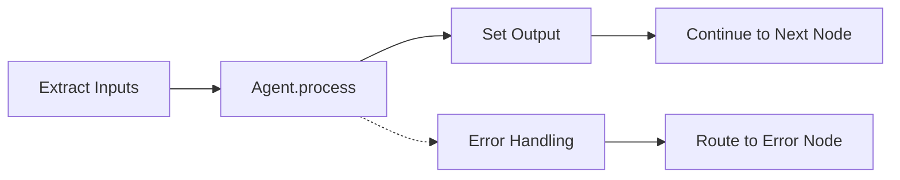

import AgentCatalog from '@site/src/components/AgentCatalog';

# Built-in Agents

AgentMap provides a comprehensive set of built-in agents for common workflow tasks. All agents inherit from `BaseAgent` and implement a `process()` method for data transformation.

## Agent Architecture

### BaseAgent Foundation

Every AgentMap agent follows the same architectural pattern:

```python
class BaseAgent:
    def __init__(self, name: str, prompt: str, context: Dict[str, Any] = None):
        self.name = name
        self.prompt = prompt
        self.context = context or {}
        self.input_fields = self.context.get("input_fields", [])
        self.output_field = self.context.get("output_field", None)
    
    def process(self, inputs: Dict[str, Any]) -> Any:
        """Transform inputs to output - implemented by each agent type"""
        raise NotImplementedError("Subclasses must implement process()")
```

**Key Principles**:
- **Single Responsibility**: Each agent has one clear purpose
- **Data Flow**: Input fields → `process()` method → output field  
- **Error Handling**: Built-in exception handling and error routing
- **Service Injection**: Optional services (LLM, storage) injected via protocols

### Agent Execution Flow



1. **Input Extraction**: System extracts values from state using `input_fields`
2. **Processing**: Agent's `process()` method transforms inputs
3. **Output Integration**: Result stored in state using `output_field`
4. **Flow Control**: Success routes to `next_node`, errors to `error_node`

## Agent Categories

### 🧠 LLM Agents
AI-powered agents using language models for reasoning and generation:

| Agent Type | Purpose | Key Features |
|------------|---------|--------------|
| **llm** | General LLM processing | Multi-provider support, routing, memory |
| **summary** | Text summarization | Configurable length, format options |
| **classification** | Content classification | Custom categories, confidence scoring |

### 💾 Storage Agents
Data persistence and retrieval from various storage systems:

| Agent Type | Purpose | Key Features |
|------------|---------|--------------|
| **csv_reader** | Read CSV files | Collection-based access, format options |
| **csv_writer** | Write CSV data | Append/overwrite modes, validation |
| **json_reader** | Read JSON documents | Path-based access, collection support |
| **json_writer** | Write JSON data | Document management, nested paths |

### 📁 File Agents
File system operations for document processing:

| Agent Type | Purpose | Key Features |
|------------|---------|--------------|
| **file_reader** | Read file contents | Multiple formats, encoding detection |
| **file_writer** | Write file contents | Path creation, backup options |
| **directory_list** | List directory contents | Filtering, recursive scanning |

### 🔧 Control Flow Agents
Workflow orchestration and routing logic:

| Agent Type | Purpose | Key Features |
|------------|---------|--------------|
| **orchestrator** | Intelligent routing | Multi-strategy node selection |
| **router** | Conditional routing | Rule-based decision making |
| **parallel** | Parallel execution | Concurrent processing, synchronization |

### 🏗️ Core Agents
Basic building blocks for data flow and workflow control:

| Agent Type | Purpose | Key Features |
|------------|---------|--------------|
| **input** | User input collection | Interactive prompts, validation |
| **echo** | Data passthrough | State inspection, debugging |
| **default** | Custom processing | Placeholder for custom logic |

## Interactive Agent Catalog

Explore all available agents with examples and configuration options:

<AgentCatalog />

## Agent Implementation Examples

### LLM Agent with Process Method

```python
class LLMAgent(BaseAgent, LLMCapableAgent):
    """LLM agent demonstrating process() method implementation"""
    
    def configure_llm_service(self, llm_service: LLMServiceProtocol):
        self._llm_service = llm_service
    
    def process(self, inputs: Dict[str, Any]) -> Any:
        # Extract input data
        user_query = inputs.get('query', '')
        context = inputs.get('context', '')
        
        # Build messages for LLM
        messages = [
            {"role": "system", "content": self.prompt},
            {"role": "user", "content": f"Query: {user_query}\nContext: {context}"}
        ]
        
        # Call LLM service
        response = self.llm_service.call_llm(
            provider="anthropic",
            messages=messages,
            model="claude-3-5-sonnet-20241022"
        )
        
        return response
```

### Storage Agent with Process Method

```python
class CSVReaderAgent(BaseAgent, StorageCapableAgent):
    """CSV reader agent with storage service injection"""
    
    def configure_storage_service(self, storage_service: StorageServiceProtocol):
        self._storage_service = storage_service
    
    def process(self, inputs: Dict[str, Any]) -> Any:
        # Extract input parameters
        collection = inputs.get('collection', 'default')
        document_id = inputs.get('document_id')
        format_type = self.context.get('format', 'records')
        
        # Read data using storage service
        data = self.storage_service.read(
            collection=collection,
            document_id=document_id,
            format=format_type
        )
        
        return data
```

### Custom Agent Example

```python
class WeatherAgent(BaseAgent):
    """Custom weather agent showing process() method pattern"""
    
    def process(self, inputs: Dict[str, Any]) -> Any:
        location = inputs.get('location', 'Unknown')
        
        # Simulate weather API call
        weather_data = {
            'location': location,
            'temperature': '72°F',
            'conditions': 'Sunny',
            'humidity': '45%'
        }
        
        # Format response based on prompt
        if 'brief' in self.prompt.lower():
            return f"{weather_data['conditions']}, {weather_data['temperature']}"
        else:
            return weather_data
```

## CSV Configuration Patterns

### Basic Agent Configuration

```csv
workflow,node,description,type,next_node,error_node,input_fields,output_field,prompt
MyFlow,Process,Process user input,llm,End,Error,user_input,ai_response,Answer this question: {user_input}
```

### Agent with Context Configuration

```csv
workflow,node,description,type,next_node,error_node,input_fields,output_field,prompt,context
MyFlow,Classify,Classify content,llm,Route,Error,content,category,Classify this content,"{""provider"": ""openai"", ""temperature"": 0.1}"
```

### Memory-Enabled Agent

```csv
workflow,node,description,type,next_node,error_node,input_fields,output_field,prompt,context
ChatBot,Respond,Generate response,llm,Listen,Error,user_input|conversation,response,You are a helpful assistant,"{""memory_key"": ""conversation"", ""max_memory_messages"": 10}"
```

## Service Integration

### Protocol-Based Service Injection

Agents that need business services implement specific protocols:

```python
# LLM-capable agents
class MyAgent(BaseAgent, LLMCapableAgent):
    def configure_llm_service(self, llm_service: LLMServiceProtocol):
        self._llm_service = llm_service

# Storage-capable agents  
class MyAgent(BaseAgent, StorageCapableAgent):
    def configure_storage_service(self, storage_service: StorageServiceProtocol):
        self._storage_service = storage_service

# Multiple capabilities
class MyAgent(BaseAgent, LLMCapableAgent, StorageCapableAgent):
    def configure_llm_service(self, llm_service: LLMServiceProtocol):
        self._llm_service = llm_service
    
    def configure_storage_service(self, storage_service: StorageServiceProtocol):
        self._storage_service = storage_service
```

### Infrastructure Service Access

All agents have access to infrastructure services:

```python
def process(self, inputs: Dict[str, Any]) -> Any:
    # Logging
    self.logger.info(f"Processing inputs: {list(inputs.keys())}")
    
    # Execution tracking
    self.execution_tracker_service.record_node_start(self.name, inputs)
    
    # State operations
    current_state = self.state_adapter_service.get_current_state()
    
    # Your processing logic
    result = self.custom_processing(inputs)
    
    return result
```

## Error Handling Patterns

### Built-in Error Handling

```python
def process(self, inputs: Dict[str, Any]) -> Any:
    try:
        # Processing logic
        return self.do_processing(inputs)
    except Exception as e:
        # Errors are automatically caught and routed to error_node
        self.logger.error(f"Processing failed: {e}")
        raise  # Re-raise for proper error routing
```

### Graceful Degradation

```python
def process(self, inputs: Dict[str, Any]) -> Any:
    # Try primary method
    if self._llm_service:
        try:
            return self._llm_service.call_llm(messages=messages)
        except Exception as e:
            self.logger.warning(f"LLM failed, using fallback: {e}")
    
    # Fallback method
    return self.simple_text_processing(inputs)
```

## Best Practices

### Agent Design

1. **Single Purpose**: Each agent should have one clear responsibility
2. **Stateless Processing**: Avoid storing state in agent instances
3. **Error Resilient**: Handle exceptions gracefully with clear error messages
4. **Service Optional**: Design agents to work with or without optional services

### Process Method Guidelines

1. **Input Validation**: Validate required inputs at the start
2. **Clear Returns**: Return simple values that can be JSON serialized
3. **Logging**: Log key processing steps for debugging
4. **Documentation**: Include docstrings explaining input/output contracts

### Configuration Patterns

1. **Use Context**: Store configuration in the `context` field
2. **Default Values**: Provide sensible defaults for optional parameters
3. **Input Fields**: Explicitly declare required input fields
4. **Output Field**: Always specify the output field name

## Next Steps

- **[Custom Agent Development](./custom-agents)** - Build your own agent types
- **[Agent Types Reference](/docs/reference/agent-types)** - Complete built-in agent specifications  
- **[CSV Schema](/docs/reference/csv-schema)** - Complete workflow definition format
- **[Agent Development Guide](/docs/guides/development/agents/agent-development)** - Step-by-step agent development
