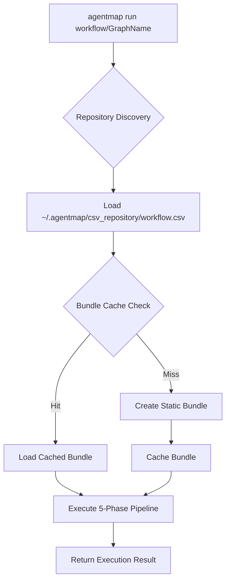
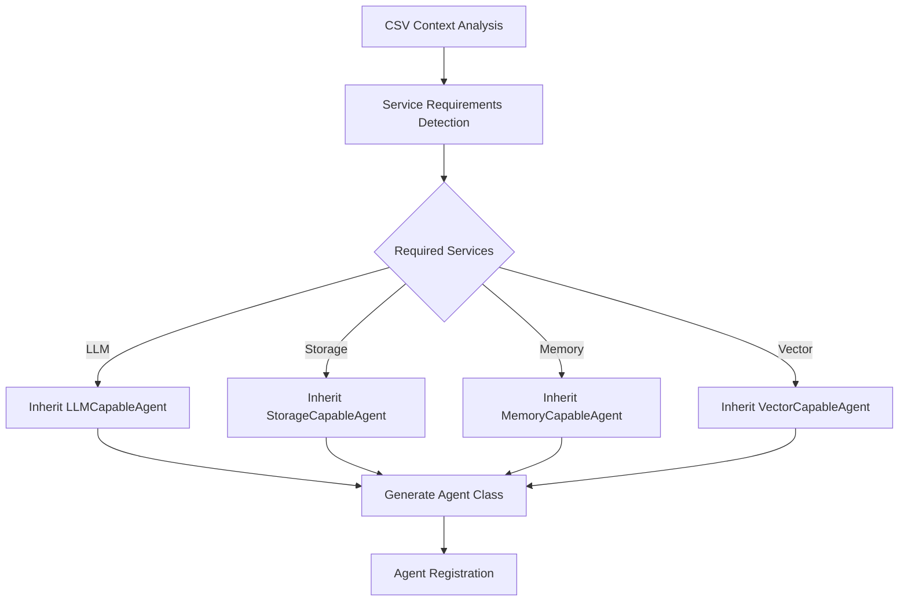
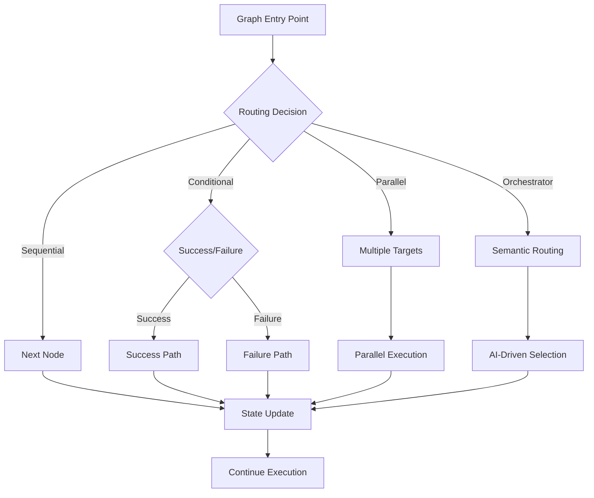

# AgentMap Architecture Overview

AgentMap is built as a **sophisticated service-oriented AI orchestration platform** that transforms simple CSV definitions into high-performance autonomous multi-agent systems. This document provides a comprehensive overview of the architectural decisions, service design, and performance optimizations that make AgentMap both powerful and scalable.

## 🏗️ Architectural Philosophy

### Service-Oriented Design Principles
- **Clean Separation of Concerns**: Each service has a single, well-defined responsibility
- **Protocol-Based Interfaces**: Services communicate through abstract protocols, not concrete implementations  
- **Dependency Injection**: All services are injected and configurable for testing and extensibility
- **Graceful Degradation**: Optional services fail gracefully, maintaining core functionality
- **Performance First**: Architecture optimized for minimal overhead and maximum throughput

### Key Architectural Decisions
- **Bundle-Based Execution**: Pre-compiled graph metadata eliminates runtime overhead
- **Static Analysis**: Declaration-based bundling provides 10x performance improvement
- **Repository Workflows**: Direct execution from workflow repositories without local files
- **Service Auto-Discovery**: Automatic service dependency resolution and load ordering
- **Immutable State Flow**: Functional programming principles for predictable data flow

## 🔄 5-Phase Execution Pipeline

AgentMap orchestrates graph execution through a sophisticated 5-phase pipeline managed by `GraphRunnerService`:

### Phase 1: Bootstrap (Conditional)
```
🔄 Direct Import Mode (Default)
├── Skip agent class registration
├── Use direct agent instantiation
└── Eliminate circular dependency issues
```
### Phase 2: Execution Tracking Setup
```
📊 Tracker Creation
├── Create unique execution tracker per run
├── Configure tracking policies (minimal/detailed)
├── Link subgraph trackers to parent trackers
└── Initialize performance monitoring
```

**Key Features**:
- **Two-tier tracking**: Minimal (always on) vs Detailed (optional)
- **Subgraph support**: Hierarchical tracking for nested graph execution
- **Policy-based evaluation**: Multiple success strategies (all nodes, final node, critical nodes)

### Phase 3: Agent Instantiation
```
🤖 Agent Creation & Configuration
├── Load agent instances from bundle metadata
├── Inject required services (LLM, Storage, Memory)
├── Configure agent-specific contexts and prompts
├── Validate service dependencies
└── Prepare agent registry for orchestrators
```

**Service Integration**:
- **Automatic Protocol Detection**: Agents automatically inherit required service protocols
- **Service Injection**: LLM, Storage, Memory services injected based on agent requirements
- **Context Configuration**: Agent contexts parsed and configured from CSV definitions

### Phase 4: Graph Assembly
```
🔗 Executable Graph Construction
├── Transform Node objects to executable graph structure
├── Resolve edge targets and routing functions
├── Configure conditional branching logic
├── Prepare orchestrator node registry
└── Validate graph connectivity
```

**Advanced Routing**:
- **Conditional Edges**: Success/failure routing with custom logic
- **Function-Based Routing**: Dynamic routing using custom functions
- **Multi-Target Routing**: Parallel processing with multiple targets
- **Orchestrator Integration**: Intelligent routing based on semantic analysis

### Phase 5: Graph Execution
```
⚡ High-Performance Execution
├── Initialize execution state
├── Execute nodes according to routing logic
├── Track execution path and timing
├── Handle errors and recovery
└── Generate execution summary
```

**Execution Features**:
- **Immutable State Transitions**: Functional state management prevents side effects
- **Error Recovery**: Configurable error handling and retry logic
- **Real-time Monitoring**: Live execution tracking with performance metrics
- **Subgraph Support**: Recursive execution for nested workflows

## 📦 Bundle System Architecture

The bundle system is AgentMap's **key performance innovation**, providing intelligent caching and pre-compilation for lightning-fast execution.

### Bundle Types & Performance

| Bundle Type | Creation Time | Use Case | Performance Gain |
|-------------|---------------|----------|------------------|
| **Static Bundle** | ~10ms | Production execution | **10x faster** |
| **Dynamic Bundle** | ~100ms | Development/debugging | Baseline |
| **Metadata Bundle** | ~5ms | Cached execution | **20x faster** |

### Static Analysis Engine

```
🔬 Declaration-Based Analysis (StaticBundleAnalyzer)
├── Parse CSV structure without loading implementations
├── Extract agent type requirements from declarations
├── Resolve service dependencies through protocol analysis
├── Generate complete bundle metadata
└── Cache for instant execution
```

**Key Innovations**:
- **No Implementation Loading**: Analyzes code structure, not runtime behavior
- **Protocol-Based Requirements**: Determines service needs from type signatures
- **Circular Dependency Elimination**: Declaration analysis prevents dependency cycles
- **Intelligent Caching**: Composite keys (csv_hash + graph_name) for precise cache management

### Bundle Caching Strategy

```
🗄️ Composite Key Caching (GraphRegistryService)
├── Primary Key: CSV Content Hash (SHA-256)
├── Secondary Key: Graph Name
├── Cache Location: ~/.agentmap/cache/bundles/
├── Invalidation: Automatic when CSV content changes
└── Registry: Persistent bundle metadata registry
```

**Cache Benefits**:
- **Instant Startup**: Cached bundles load in ~1ms
- **Content-Aware**: Changes to CSV automatically invalidate cache
- **Multi-Graph Support**: Single CSV with multiple graphs cached separately
- **Persistent Registry**: Bundle metadata survives application restarts

### Repository Workflow System

AgentMap supports sophisticated repository-based workflow execution:

```bash
# Direct repository execution
agentmap run workflow/GraphName

# Repository with CSV file  
agentmap run workflows/hello_world.csv --graph HelloWorld

# Traditional file execution
agentmap run path/to/workflow.csv --graph GraphName
```

**Repository Features**:
- **Auto-Discovery**: Automatic location of workflow files in configured repository
- **Shorthand Syntax**: Simple `workflow/GraphName` execution pattern
- **Bundle Integration**: Repository workflows use same caching system
- **Configuration Integration**: Repository path configurable in `agentmap_config.yaml`

## 🏭 Dependency Injection Container

AgentMap uses a sophisticated DI container (`ApplicationContainer`) that provides service management, auto-discovery, and configuration.

### Service Auto-Discovery

```
🔍 Configuration Discovery Pipeline
├── 1. Explicit config file parameter (highest priority)
├── 2. agentmap_config.yaml in current working directory
├── 3. System defaults (lowest priority)
└── 🎯 Result: Fully configured ApplicationContainer
```

### Service Dependency Resolution

```
📊 Dependency Analysis (DeclarationRegistryService)
├── Extract service requirements from agent protocols
├── Build complete dependency graph
├── Calculate optimal service load order
├── Resolve circular dependencies
└── Prepare services for injection
```

**Advanced Features**:
- **Protocol-Based Analysis**: Services auto-detected from protocol implementations
- **Load Order Optimization**: Services started in dependency order for stability
- **Circular Dependency Detection**: Prevents container initialization failures
- **Graceful Degradation**: Optional services fail gracefully without crashing application

### Service Lifecycle Management

```
⚙️ Service Management Strategy
├── Lazy Initialization: Services created only when needed
├── Singleton Pattern: One service instance per container
├── Scoped Services: Different lifetimes for different service types
├── Proxy Services: Optional services wrapped in safe proxies
└── Health Checking: Service availability monitoring
```

## 🚀 Performance Optimizations

### Bundle Creation Performance

| Metric | Dynamic Bundle | Static Bundle | Improvement |
|--------|----------------|---------------|-------------|
| **Creation Time** | ~100ms | ~10ms | **10x faster** |
| **Dependencies Loaded** | All implementations | Declarations only | **90% reduction** |
| **Memory Usage** | ~50MB | ~5MB | **90% reduction** |
| **Circular Dependencies** | Possible | Eliminated | **100% reliable** |

### Execution Performance

```
⚡ Runtime Optimizations
├── Pre-compiled Bundles: No runtime graph analysis
├── Service Injection: Dependencies resolved at build time
├── Immutable States: Zero-copy state transitions
├── Edge Caching: Route decisions cached per execution
└── Parallel Opportunities: Multi-target routing for concurrent execution
```

### Memory Management

```
🧠 Memory Optimization Strategy
├── Metadata-Only Bundles: Node instances created only during execution
├── Service Reuse: Single service instances across multiple graphs
├── State Streaming: Large states processed in chunks
├── Garbage Collection: Automatic cleanup of completed executions
└── Resource Pooling: Agent instance reuse where possible
```

## 🔌 Service Integration Architecture

### Protocol-Based Service Design

AgentMap uses abstract protocols to define service contracts:

```python
# Example: LLM Service Protocol
class LLMCapableAgent(BaseAgent):
    """Protocol for agents requiring LLM services"""
    llm_service: LLMService
    
    def __init__(self, llm_service: LLMService):
        self.llm_service = llm_service
```

**Protocol Benefits**:
- **Loose Coupling**: Agents depend on protocols, not implementations
- **Easy Testing**: Mock services can implement same protocols
- **Service Swapping**: Different implementations without code changes
- **Auto-Detection**: Requirements analysis detects needed protocols automatically

### Service Registry Architecture

```
🏪 Service Registry (SystemServiceRegistry)
├── LLM Services: OpenAI, Anthropic, Google integrations
├── Storage Services: CSV, JSON, File, Vector, Memory management
├── Infrastructure Services: Logging, Configuration, Path resolution
├── Graph Services: Bundle, Execution, Assembly, Tracking
└── Agent Services: Factory, Instantiation, Protocol analysis
```

### Service Load Order Calculation

The system automatically calculates optimal service startup order:

```
📊 Load Order Example
1. logging_service (no dependencies)
2. app_config_service (requires logging)
3. file_path_service (requires config)
4. json_storage_service (requires file path)
5. llm_service (requires config + logging)
6. graph_bundle_service (requires multiple services)
7. graph_runner_service (requires bundle service)
```

## 🎯 Execution Patterns

### Repository Workflow Execution



### Service-Aware Agent Scaffolding



### Multi-Agent Coordination



## 🔧 Configuration & Extensibility

### Configuration Architecture

AgentMap uses a hierarchical configuration system:

```yaml
# agentmap_config.yaml example
execution:
  use_direct_import_agents: true
  default_success_policy: "all_nodes"
  
storage:
  cache_folder: "~/.agentmap/cache"
  csv_repository_path: "~/.agentmap/csv_repository"
  
logging:
  level: "INFO"
  format: "structured"
  
performance:
  bundle_cache_enabled: true
  static_analysis_enabled: true
```

### Extension Points

```
🔌 Extensibility Architecture
├── Custom Agents: Inherit from BaseAgent with protocol mixins
├── Custom Services: Implement service protocols and register in DI
├── Custom Storage: Extend storage service with new providers
├── Custom LLMs: Implement LLMService interface
├── Custom Routing: Function-based routing with custom logic
└── Custom Policies: Success policies and execution strategies
```

## 🎭 Architecture Benefits

### Developer Experience
- **Fast Iteration**: Static bundles provide instant feedback loops
- **Service-Aware Scaffolding**: Automatic code generation with proper service integration
- **Hot Reloading**: Bundle invalidation enables rapid development cycles
- **Rich Debugging**: Detailed execution tracking and error reporting

### Operational Excellence  
- **High Performance**: 10x faster execution through static analysis and caching
- **Scalability**: Service-oriented design supports horizontal scaling
- **Reliability**: Graceful degradation and error recovery mechanisms
- **Observability**: Comprehensive logging, tracking, and performance monitoring

### Enterprise Readiness
- **Configuration Management**: Hierarchical config with environment overrides
- **Security**: Service isolation and controlled dependency injection
- **Testing**: Mock-friendly architecture with protocol-based design
- **Deployment**: Container-friendly with minimal external dependencies

## 🔮 Next Steps & Evolution

AgentMap's architecture is designed for continuous evolution:

- **Microservices Support**: Service isolation enables distributed deployment
- **Performance Scaling**: Bundle system ready for distributed caching
- **AI Enhancement**: Orchestrator services can leverage more sophisticated AI routing
- **Integration Expansion**: Protocol-based design makes new service integration straightforward

This architecture provides the foundation for AgentMap to scale from simple CSV workflows to enterprise-grade AI orchestration platforms while maintaining developer productivity and system performance.

## Related Documentation

- **[Features & Capabilities](/docs/reference/features)**: Feature overview with architectural context
- **[Agent Development](/docs/guides/development/agents/agent-development)**: Creating custom agents within the architecture
- **[Service Development](/docs/guides/development/services/)**: Extending the service layer
- **[Configuration Reference](/docs/reference/configuration)**: Complete configuration options
- **[Performance Guide](/docs/guides/performance/)**: Optimization strategies and benchmarks
