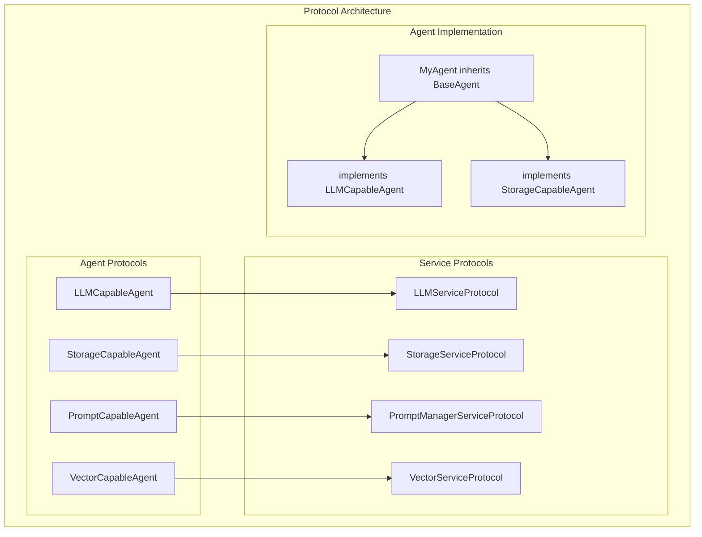

# Capability Protocols

AgentMap uses Python protocols to define agent capabilities and enable type-safe service injection. This system provides clean separation between agent logic and service dependencies while maintaining flexibility and testability.

import CapabilityBrowser from '@site/src/components/CapabilityBrowser';

<CapabilityBrowser />

## Protocol System Overview

### Why Protocols?

Protocols provide several advantages over traditional inheritance:

- **Type Safety**: Clear contracts for service injection
- **Flexibility**: Agents can implement multiple capabilities  
- **Testability**: Easy mocking of service dependencies
- **Separation of Concerns**: Business logic separate from infrastructure

### Protocol Architecture



## Core Capability Protocols

### LLMCapableAgent Protocol

**Purpose**: Enables agents to use language model services

**Service Interface**: `LLMServiceProtocol`

```python
from typing import Protocol
from agentmap.services.protocols import LLMServiceProtocol

class LLMCapableAgent(Protocol):
    """Protocol for agents that can use LLM services"""
    
    def configure_llm_service(self, llm_service: LLMServiceProtocol) -> None:
        """Configure LLM service for this agent"""
        ...
```

**Implementation Pattern**:
```python
class MyLLMAgent(BaseAgent, LLMCapableAgent):
    """Agent with LLM capabilities"""
    
    def __init__(self, name: str, prompt: str, context: Dict[str, Any] = None, **kwargs):
        super().__init__(name, prompt, context, **kwargs)
        self._llm_service: Optional[LLMServiceProtocol] = None
    
    def configure_llm_service(self, llm_service: LLMServiceProtocol) -> None:
        """Configure LLM service for this agent"""
        self._llm_service = llm_service
        self.log_debug("LLM service configured")
    
    @property
    def llm_service(self) -> LLMServiceProtocol:
        """Get LLM service, raising clear error if not configured"""
        if self._llm_service is None:
            raise ValueError(f"LLM service not configured for agent '{self.name}'")
        return self._llm_service
    
    def process(self, inputs: Dict[str, Any]) -> Any:
        # Use LLM service
        messages = [{"role": "user", "content": inputs.get("query", "")}]
        response = self.llm_service.call_llm(
            provider="anthropic",
            messages=messages,
            model="claude-3-5-sonnet-20241022"
        )
        return response
```

**Context Configuration**:
```python
# CSV context field
context = {
    'provider': 'anthropic',
    'model': 'claude-3-5-sonnet-20241022',
    'temperature': 0.3,
    'memory_key': 'conversation',
    'max_memory_messages': 10,
    'routing_enabled': True
}
```

---

### StorageCapableAgent Protocol

**Purpose**: Enables agents to use storage services for data persistence

**Service Interface**: `StorageServiceProtocol`

```python
class StorageCapableAgent(Protocol):
    """Protocol for agents that can use storage services"""
    
    def configure_storage_service(self, storage_service: StorageServiceProtocol) -> None:
        """Configure storage service for this agent"""
        ...
```

**Implementation Pattern**:
```python
class MyStorageAgent(BaseAgent, StorageCapableAgent):
    """Agent with storage capabilities"""
    
    def __init__(self, name: str, prompt: str, context: Dict[str, Any] = None, **kwargs):
        super().__init__(name, prompt, context, **kwargs)
        self._storage_service: Optional[StorageServiceProtocol] = None
    
    def configure_storage_service(self, storage_service: StorageServiceProtocol) -> None:
        """Configure storage service for this agent"""
        self._storage_service = storage_service
        self.log_debug("Storage service configured")
    
    @property
    def storage_service(self) -> StorageServiceProtocol:
        """Get storage service, raising clear error if not configured"""
        if self._storage_service is None:
            raise ValueError(f"Storage service not configured for agent '{self.name}'")
        return self._storage_service
    
    def process(self, inputs: Dict[str, Any]) -> Any:
        # Use storage service
        collection = inputs.get("collection", "default")
        data = self.storage_service.read(collection, format="records")
        
        # Process data
        processed = self.transform_data(data)
        
        # Save results
        result = self.storage_service.write(collection, processed, mode="append")
        return result
```

**Context Configuration**:
```python
# CSV context field
context = {
    'format': 'records',
    'provider': 'local',
    'encoding': 'utf-8',
    'mode': 'write',
    'id_field': 'customer_id'
}
```

---

### PromptCapableAgent Protocol

**Purpose**: Enables agents to use prompt manager services for template resolution

**Service Interface**: `PromptManagerServiceProtocol`

```python
class PromptCapableAgent(Protocol):
    """Protocol for agents that can use prompt manager services"""
    
    def configure_prompt_service(self, prompt_service: PromptManagerServiceProtocol) -> None:
        """Configure prompt manager service for this agent"""
        ...
```

**Implementation Pattern**:
```python
class MyPromptAgent(BaseAgent, PromptCapableAgent):
    """Agent with prompt management capabilities"""
    
    def __init__(self, name: str, prompt: str, context: Dict[str, Any] = None, **kwargs):
        super().__init__(name, prompt, context, **kwargs)
        self._prompt_manager_service: Optional[PromptManagerServiceProtocol] = None
        self.resolved_prompt = prompt
    
    def configure_prompt_service(self, prompt_service: PromptManagerServiceProtocol) -> None:
        """Configure prompt manager service for this agent"""
        self._prompt_manager_service = prompt_service
        # Re-resolve prompt with the new service
        self.resolved_prompt = self._resolve_prompt(self.prompt)
        self.log_debug("Prompt service configured")
    
    def _resolve_prompt(self, prompt: str) -> str:
        """Resolve prompt using prompt manager service if available"""
        if self._prompt_manager_service:
            return self._prompt_manager_service.resolve_prompt(prompt, self.context)
        return prompt
    
    def process(self, inputs: Dict[str, Any]) -> Any:
        # Use resolved prompt
        formatted_prompt = self.resolved_prompt.format(**inputs)
        return self.process_with_prompt(formatted_prompt)
```

**Context Configuration**:
```python
# CSV context field
context = {
    'template': 'analysis_template',
    'variables': {'domain': 'finance'},
    'format': 'markdown',
    'max_length': 2000
}
```

---

### VectorCapableAgent Protocol

**Purpose**: Enables agents to use vector database services for semantic search

**Service Interface**: `VectorServiceProtocol`

```python
class VectorCapableAgent(Protocol):
    """Protocol for agents that can use vector services"""
    
    def configure_vector_service(self, vector_service: VectorServiceProtocol) -> None:
        """Configure vector service for this agent"""
        ...
```

**Implementation Pattern**:
```python
class MyVectorAgent(BaseAgent, VectorCapableAgent):
    """Agent with vector database capabilities"""
    
    def __init__(self, name: str, prompt: str, context: Dict[str, Any] = None, **kwargs):
        super().__init__(name, prompt, context, **kwargs)
        self._vector_service: Optional[VectorServiceProtocol] = None
    
    def configure_vector_service(self, vector_service: VectorServiceProtocol) -> None:
        """Configure vector service for this agent"""
        self._vector_service = vector_service
        self.log_debug("Vector service configured")
    
    @property
    def vector_service(self) -> VectorServiceProtocol:
        """Get vector service, raising clear error if not configured"""
        if self._vector_service is None:
            raise ValueError(f"Vector service not configured for agent '{self.name}'")
        return self._vector_service
    
    def process(self, inputs: Dict[str, Any]) -> Any:
        # Use vector service for semantic search
        query = inputs.get("query", "")
        results = self.vector_service.similarity_search(
            query=query,
            collection=inputs.get("collection", "default"),
            max_results=self.context.get("max_results", 5),
            similarity_threshold=self.context.get("similarity_threshold", 0.8)
        )
        return results
```

**Context Configuration**:
```python
# CSV context field
context = {
    'provider': 'chroma',
    'embedding_model': 'text-embedding-ada-002',
    'similarity_threshold': 0.8,
    'max_results': 5,
    'collection_name': 'documents'
}
```

## Multi-Capability Agents

### Combining Multiple Protocols

Agents can implement multiple capability protocols for complex functionality:

```python
class AdvancedRAGAgent(BaseAgent, LLMCapableAgent, StorageCapableAgent, VectorCapableAgent):
    """Agent combining LLM, storage, and vector capabilities for RAG implementation"""
    
    def __init__(self, name: str, prompt: str, context: Dict[str, Any] = None, **kwargs):
        super().__init__(name, prompt, context, **kwargs)
        self._llm_service: Optional[LLMServiceProtocol] = None
        self._storage_service: Optional[StorageServiceProtocol] = None
        self._vector_service: Optional[VectorServiceProtocol] = None
    
    # Implement all protocol methods
    def configure_llm_service(self, llm_service: LLMServiceProtocol) -> None:
        self._llm_service = llm_service
        
    def configure_storage_service(self, storage_service: StorageServiceProtocol) -> None:
        self._storage_service = storage_service
        
    def configure_vector_service(self, vector_service: VectorServiceProtocol) -> None:
        self._vector_service = vector_service
    
    def process(self, inputs: Dict[str, Any]) -> Any:
        # RAG workflow combining all services
        query = inputs.get("query", "")
        
        # 1. Vector search for relevant documents
        relevant_docs = self.vector_service.similarity_search(
            query=query,
            max_results=5
        )
        
        # 2. Load additional context from storage
        context_data = self.storage_service.read("context", format="dict")
        
        # 3. Generate response with LLM
        messages = [
            {"role": "system", "content": f"Context: {relevant_docs}"},
            {"role": "user", "content": query}
        ]
        response = self.llm_service.call_llm("anthropic", messages)
        
        # 4. Store conversation for future reference
        conversation = {
            "query": query,
            "context": relevant_docs,
            "response": response,
            "timestamp": datetime.now().isoformat()
        }
        self.storage_service.write("conversations", conversation, mode="append")
        
        return response
```

**CSV Configuration for Multi-Capability Agent**:
```csv
workflow,node,description,type,next_node,error_node,input_fields,output_field,prompt,context
RAGBot,Ask,Ask a question,input,Answer,Error,,query,Enter your question:,
RAGBot,Answer,Answer with RAG,advanced_rag,Ask,Error,query,response,Answer using relevant context: {query},"{""provider"": ""anthropic"", ""similarity_threshold"": 0.8, ""max_results"": 5}"
```

## Service Protocols Reference

### LLMServiceProtocol

```python
class LLMServiceProtocol(Protocol):
    """Protocol for LLM service implementations"""
    
    def call_llm(
        self,
        provider: str,
        messages: List[Dict[str, Any]],
        model: Optional[str] = None,
        temperature: float = 0.7,
        max_tokens: Optional[int] = None,
        **kwargs
    ) -> str:
        """Call LLM with messages and return response"""
        ...
    
    def get_available_providers(self) -> List[str]:
        """Get list of configured providers"""
        ...
    
    def get_provider_models(self, provider: str) -> List[str]:
        """Get available models for provider"""
        ...
```

### StorageServiceProtocol

```python
class StorageServiceProtocol(Protocol):
    """Protocol for storage service implementations"""
    
    def read(
        self,
        collection: str,
        document_id: Optional[str] = None,
        format: str = "records",
        **kwargs
    ) -> Any:
        """Read data from storage"""
        ...
    
    def write(
        self,
        collection: str,
        data: Any,
        document_id: Optional[str] = None,
        mode: str = "write",
        **kwargs
    ) -> Any:
        """Write data to storage"""
        ...
    
    def list_collections(self) -> List[str]:
        """List available collections"""
        ...
```

### PromptManagerServiceProtocol

```python
class PromptManagerServiceProtocol(Protocol):
    """Protocol for prompt manager service implementations"""
    
    def resolve_prompt(
        self,
        prompt: str,
        context: Optional[Dict[str, Any]] = None
    ) -> str:
        """Resolve template variables in prompt"""
        ...
    
    def register_template(self, name: str, template: str) -> None:
        """Register reusable template"""
        ...
    
    def get_template(self, name: str) -> Optional[str]:
        """Get registered template"""
        ...
```

### VectorServiceProtocol

```python
class VectorServiceProtocol(Protocol):
    """Protocol for vector service implementations"""
    
    def similarity_search(
        self,
        query: str,
        collection: str = "default",
        max_results: int = 5,
        similarity_threshold: float = 0.8,
        **kwargs
    ) -> List[Dict[str, Any]]:
        """Perform similarity search"""
        ...
    
    def embed_and_store(
        self,
        documents: List[str],
        collection: str = "default",
        metadata: Optional[List[Dict]] = None,
        **kwargs
    ) -> Any:
        """Embed documents and store in vector database"""
        ...
```

## Protocol Testing Patterns

### Unit Testing with Mocks

```python
def test_llm_capable_agent():
    from unittest.mock import Mock
    
    # Create mock LLM service
    mock_llm = Mock()
    mock_llm.call_llm.return_value = "Test response"
    
    # Create agent
    agent = MyLLMAgent("TestAgent", "Test prompt")
    
    # Configure service
    agent.configure_llm_service(mock_llm)
    
    # Test functionality
    result = agent.process({"query": "test"})
    assert result == "Test response"
    
    # Verify service was called correctly
    mock_llm.call_llm.assert_called_once()
```

### Integration Testing

```python
def test_multi_capability_agent_integration():
    from agentmap.di.containers import Container
    
    # Use real container with real services
    container = Container()
    
    # Get real services
    llm_service = container.llm_service()
    storage_service = container.storage_manager().get_service("json")
    
    # Create and configure agent
    agent = AdvancedRAGAgent("RAGAgent", "Answer questions")
    agent.configure_llm_service(llm_service)
    agent.configure_storage_service(storage_service)
    
    # Test with real services
    result = agent.process({"query": "What is the capital of France?"})
    assert "Paris" in result
```

### Protocol Compliance Testing

```python
def test_protocol_compliance():
    """Test that agent correctly implements protocols"""
    agent = MyLLMAgent("TestAgent", "Test prompt")
    
    # Check protocol implementation
    assert isinstance(agent, LLMCapableAgent)
    assert hasattr(agent, 'configure_llm_service')
    
    # Test configuration
    mock_service = Mock()
    agent.configure_llm_service(mock_service)
    
    # Verify service is accessible
    assert agent._llm_service is mock_service
```

## Best Practices

### Protocol Design

1. **Single Responsibility**: Each protocol should represent one clear capability
2. **Method Clarity**: Protocol methods should have clear, descriptive names
3. **Type Hints**: Always use comprehensive type hints for clarity
4. **Documentation**: Include docstrings explaining expected behavior

### Agent Implementation

1. **Protocol Properties**: Use properties for safe service access
2. **Error Handling**: Raise clear errors when services aren't configured
3. **Service Validation**: Check service availability before use
4. **Graceful Degradation**: Handle missing optional services gracefully

### Service Configuration

1. **Context-Driven**: Use context field for service-specific configuration
2. **Reasonable Defaults**: Provide sensible defaults for optional parameters
3. **Validation**: Validate configuration parameters when possible
4. **Documentation**: Document all available context options

### Testing Strategy

1. **Mock Dependencies**: Use mocks for unit testing
2. **Real Services**: Use real services for integration testing
3. **Protocol Compliance**: Test that agents implement protocols correctly
4. **Error Scenarios**: Test behavior when services are unavailable

## Custom Protocol Development

### Creating New Protocols

```python
# 1. Define service protocol
class CustomServiceProtocol(Protocol):
    def custom_operation(self, data: str) -> str:
        """Perform custom operation"""
        ...

# 2. Define capability protocol
class CustomCapableAgent(Protocol):
    def configure_custom_service(self, service: CustomServiceProtocol) -> None:
        """Configure custom service"""
        ...

# 3. Implement in agent
class MyCustomAgent(BaseAgent, CustomCapableAgent):
    def configure_custom_service(self, service: CustomServiceProtocol) -> None:
        self._custom_service = service
    
    def process(self, inputs: Dict[str, Any]) -> Any:
        return self._custom_service.custom_operation(inputs.get("data", ""))
```

### Service Registration

```python
# Register in DI container
class Container:
    def custom_service(self) -> Optional[CustomServiceProtocol]:
        return self._get_or_create('_custom_service', CustomService)
    
    def agent_factory_service(self) -> AgentFactoryService:
        # Factory will automatically inject custom service if agent implements protocol
        return self._get_or_create('_agent_factory_service', 
            lambda: AgentFactoryService(
                custom_service=self.custom_service(),
                # ... other services
            )
        )
```

## Next Steps

- **[Service Reference](../services/service-reference)** - Complete service documentation
- **[Custom Agent Development](../agents/custom-agents)** - Build agents with protocols
- **[Service Injection Patterns](/docs/contributing/service-injection)** - Advanced injection patterns
- **[Built-in Agents](../agents/built-in-agents)** - See protocol implementations in practice
