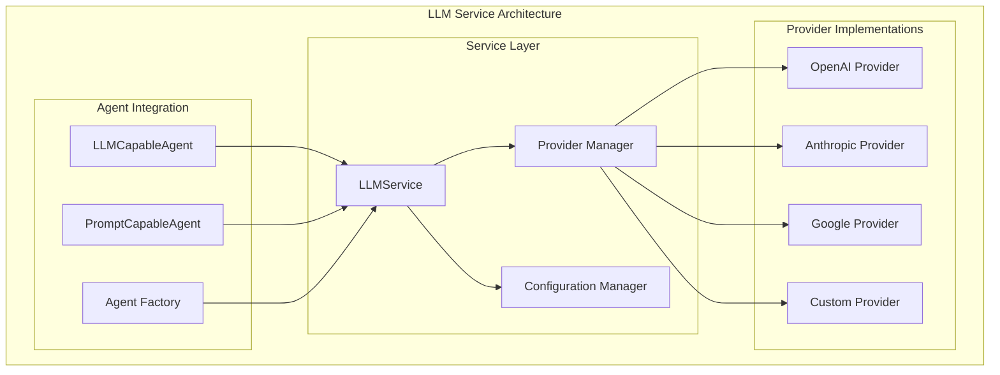

# LLM Service

The LLM Service provides unified access to multiple language model providers through a consistent interface, enabling seamless switching between OpenAI, Anthropic, Google, and other LLM providers.

## Service Architecture



## Supported Providers

### OpenAI
**Models**: GPT-4, GPT-3.5-turbo, GPT-4-turbo
**Features**: Chat completions, function calling, streaming
**Configuration**: API key, organization ID

```python
openai_config = {
    'provider': 'openai',
    'model': 'gpt-4',
    'temperature': 0.7,
    'max_tokens': 2000,
    'api_key': 'your-api-key'
}
```

### Anthropic
**Models**: Claude-3 Opus, Sonnet, Haiku
**Features**: Long context, safety features
**Configuration**: API key, model selection

```python
anthropic_config = {
    'provider': 'anthropic',
    'model': 'claude-3-5-sonnet-20241022',
    'temperature': 0.3,
    'max_tokens': 4096,
    'api_key': 'your-api-key'
}
```

### Google
**Models**: Gemini Pro, Gemini Ultra
**Features**: Multimodal capabilities, code generation
**Configuration**: API key, project settings

```python
google_config = {
    'provider': 'google',
    'model': 'gemini-1.0-pro',
    'temperature': 0.5,
    'max_tokens': 1024,
    'api_key': 'your-api-key'
}
```

## Service Interface

### Core Methods

#### call_llm()
**Purpose**: Make LLM requests with provider abstraction

```python
def call_llm(
    self,
    provider: str,
    messages: List[Dict[str, Any]],
    model: Optional[str] = None,
    temperature: float = 0.7,
    max_tokens: Optional[int] = None,
    **kwargs
) -> str:
    """
    Call LLM with standardized interface
    
    Args:
        provider: LLM provider name ('openai', 'anthropic', 'google')
        messages: List of message dictionaries
        model: Specific model to use (optional)
        temperature: Response randomness (0.0-1.0)
        max_tokens: Maximum response length
        **kwargs: Provider-specific parameters
    
    Returns:
        str: LLM response text
    
    Raises:
        ValueError: If provider not configured
        APIError: If LLM request fails
    """
```

**Usage Examples**:
```python
# Basic usage
response = llm_service.call_llm(
    provider="anthropic",
    messages=[{"role": "user", "content": "Explain quantum physics"}]
)

# With configuration
response = llm_service.call_llm(
    provider="openai",
    messages=[{"role": "user", "content": "Write a Python function"}],
    model="gpt-4",
    temperature=0.2,
    max_tokens=500
)

# With conversation context
messages = [
    {"role": "system", "content": "You are a helpful assistant"},
    {"role": "user", "content": "What is 2+2?"},
    {"role": "assistant", "content": "2+2 equals 4"},
    {"role": "user", "content": "What about 3+3?"}
]
response = llm_service.call_llm("anthropic", messages)
```

#### get_available_providers()
**Purpose**: List configured providers

```python
def get_available_providers(self) -> List[str]:
    """Get list of available LLM providers"""
    
# Usage
providers = llm_service.get_available_providers()
# Returns: ['openai', 'anthropic', 'google']
```

#### get_provider_models()
**Purpose**: Get available models for a provider

```python
def get_provider_models(self, provider: str) -> List[str]:
    """Get available models for specific provider"""

# Usage
models = llm_service.get_provider_models("openai")
# Returns: ['gpt-4', 'gpt-3.5-turbo', 'gpt-4-turbo']
```

## Configuration Management

### Environment Variables
```bash
# OpenAI
OPENAI_API_KEY=your-openai-key
OPENAI_ORGANIZATION=your-org-id

# Anthropic
ANTHROPIC_API_KEY=your-anthropic-key

# Google
GOOGLE_API_KEY=your-google-key
GOOGLE_PROJECT_ID=your-project-id
```

### Configuration File
```yaml
# config/llm.yml
llm:
  default_provider: "anthropic"
  providers:
    openai:
      api_key: "${OPENAI_API_KEY}"
      default_model: "gpt-4"
      timeout: 30
    anthropic:
      api_key: "${ANTHROPIC_API_KEY}"
      default_model: "claude-3-5-sonnet-20241022"
      timeout: 30
    google:
      api_key: "${GOOGLE_API_KEY}"
      default_model: "gemini-1.0-pro"
      timeout: 30
```

### Dynamic Configuration
```python
# Runtime configuration
llm_service.configure_provider("openai", {
    "api_key": "new-key",
    "default_model": "gpt-4-turbo",
    "temperature": 0.5
})
```

## Agent Integration

### LLMCapableAgent Protocol

Agents implement the `LLMCapableAgent` protocol to use LLM services:

```python
class MyLLMAgent(BaseAgent, LLMCapableAgent):
    def configure_llm_service(self, llm_service: LLMServiceProtocol) -> None:
        """Configure LLM service for this agent"""
        self._llm_service = llm_service
        self.log_debug("LLM service configured")
    
    @property
    def llm_service(self) -> LLMServiceProtocol:
        """Get LLM service with error checking"""
        if self._llm_service is None:
            raise ValueError(f"LLM service not configured for agent '{self.name}'")
        return self._llm_service
    
    def process(self, inputs: Dict[str, Any]) -> Any:
        # Extract query from inputs
        query = inputs.get("query", inputs.get("message", ""))
        
        # Get provider from context or use default
        provider = self.context.get("provider", "anthropic")
        model = self.context.get("model")
        
        # Build messages
        messages = self._build_messages(query, inputs)
        
        # Call LLM
        response = self.llm_service.call_llm(
            provider=provider,
            messages=messages,
            model=model,
            temperature=self.context.get("temperature", 0.7)
        )
        
        return response
    
    def _build_messages(self, query: str, inputs: Dict[str, Any]) -> List[Dict[str, Any]]:
        """Build message list for LLM"""
        messages = []
        
        # Add system message if prompt exists
        if self.prompt:
            messages.append({"role": "system", "content": self.prompt})
        
        # Add conversation history if available
        history = inputs.get("conversation_history", [])
        messages.extend(history)
        
        # Add current query
        messages.append({"role": "user", "content": query})
        
        return messages
```

### CSV Configuration

```csv
workflow,node,description,type,next_node,error_node,input_fields,output_field,prompt,context
ChatBot,Welcome,Welcome message,input,Chat,Error,,message,Welcome! Ask me anything:,
ChatBot,Chat,Chat with AI,llm,Chat,Error,message,response,You are a helpful assistant,"{""provider"": ""anthropic"", ""model"": ""claude-3-5-sonnet-20241022"", ""temperature"": 0.7}"
```

## Advanced Features

### Memory Management

The LLM service supports conversation memory:

```python
class MemoryLLMAgent(BaseAgent, LLMCapableAgent):
    def __init__(self, *args, **kwargs):
        super().__init__(*args, **kwargs)
        self.conversation_memory = []
        self.max_memory_messages = self.context.get("max_memory_messages", 10)
    
    def process(self, inputs: Dict[str, Any]) -> Any:
        query = inputs.get("query", "")
        
        # Build messages with memory
        messages = self._build_messages_with_memory(query)
        
        # Call LLM
        response = self.llm_service.call_llm(
            provider=self.context.get("provider", "anthropic"),
            messages=messages
        )
        
        # Update memory
        self._update_memory(query, response)
        
        return response
    
    def _build_messages_with_memory(self, query: str) -> List[Dict[str, Any]]:
        messages = []
        
        # System message
        if self.prompt:
            messages.append({"role": "system", "content": self.prompt})
        
        # Recent conversation history
        messages.extend(self.conversation_memory[-self.max_memory_messages:])
        
        # Current query
        messages.append({"role": "user", "content": query})
        
        return messages
    
    def _update_memory(self, query: str, response: str):
        """Update conversation memory"""
        self.conversation_memory.extend([
            {"role": "user", "content": query},
            {"role": "assistant", "content": response}
        ])
        
        # Trim memory if too long
        if len(self.conversation_memory) > self.max_memory_messages * 2:
            self.conversation_memory = self.conversation_memory[-self.max_memory_messages * 2:]
```

### Function Calling

For providers that support function calling:

```python
class FunctionLLMAgent(BaseAgent, LLMCapableAgent):
    def process(self, inputs: Dict[str, Any]) -> Any:
        query = inputs.get("query", "")
        
        # Define available functions
        functions = [
            {
                "name": "get_weather",
                "description": "Get current weather for a location",
                "parameters": {
                    "type": "object",
                    "properties": {
                        "location": {"type": "string", "description": "City name"}
                    },
                    "required": ["location"]
                }
            }
        ]
        
        # Call LLM with functions
        response = self.llm_service.call_llm(
            provider="openai",
            messages=[{"role": "user", "content": query}],
            functions=functions,
            function_call="auto"
        )
        
        return response
```

### Streaming Responses

For real-time applications:

```python
class StreamingLLMAgent(BaseAgent, LLMCapableAgent):
    def process(self, inputs: Dict[str, Any]) -> Any:
        query = inputs.get("query", "")
        
        # Stream response
        response_stream = self.llm_service.call_llm_stream(
            provider=self.context.get("provider", "openai"),
            messages=[{"role": "user", "content": query}]
        )
        
        # Process stream
        full_response = ""
        for chunk in response_stream:
            full_response += chunk
            # Optional: emit partial response
            self.emit_partial_response(chunk)
        
        return full_response
```

## Error Handling

### Common Error Patterns

```python
try:
    response = llm_service.call_llm(provider, messages)
except ProviderNotConfiguredError:
    # Handle missing provider configuration
    fallback_response = self.get_fallback_response()
except APIKeyError:
    # Handle authentication issues
    self.log_error("LLM API key invalid or missing")
    raise
except RateLimitError:
    # Handle rate limiting
    time.sleep(60)  # Wait before retry
    response = llm_service.call_llm(provider, messages)
except ModelNotFoundError:
    # Handle model availability issues
    response = llm_service.call_llm(provider, messages, model="default")
except Exception as e:
    # Handle unexpected errors
    self.log_error(f"LLM service error: {e}")
    raise
```

### Graceful Degradation

```python
class RobustLLMAgent(BaseAgent, LLMCapableAgent):
    def process(self, inputs: Dict[str, Any]) -> Any:
        query = inputs.get("query", "")
        providers = ["anthropic", "openai", "google"]  # Fallback order
        
        for provider in providers:
            try:
                response = self.llm_service.call_llm(
                    provider=provider,
                    messages=[{"role": "user", "content": query}]
                )
                return response
            except Exception as e:
                self.log_warning(f"Provider {provider} failed: {e}")
                continue
        
        # All providers failed
        return "I'm sorry, I'm currently unable to process your request."
```

## Performance Optimization

### Caching Responses

```python
from functools import lru_cache
import hashlib

class CachedLLMAgent(BaseAgent, LLMCapableAgent):
    @lru_cache(maxsize=128)
    def _cached_llm_call(self, messages_hash: str, provider: str) -> str:
        """Cache LLM responses based on message content"""
        # Note: This is a simplified example
        # In practice, you'd want more sophisticated caching
        pass
    
    def process(self, inputs: Dict[str, Any]) -> Any:
        query = inputs.get("query", "")
        messages = [{"role": "user", "content": query}]
        
        # Create hash for caching
        messages_str = str(messages)
        messages_hash = hashlib.md5(messages_str.encode()).hexdigest()
        
        try:
            return self._cached_llm_call(messages_hash, "anthropic")
        except:
            # Cache miss or error, make fresh call
            return self.llm_service.call_llm("anthropic", messages)
```

### Batch Processing

```python
class BatchLLMAgent(BaseAgent, LLMCapableAgent):
    def process(self, inputs: Dict[str, Any]) -> Any:
        queries = inputs.get("queries", [])
        
        # Process multiple queries efficiently
        responses = []
        for query in queries:
            response = self.llm_service.call_llm(
                provider="anthropic",
                messages=[{"role": "user", "content": query}]
            )
            responses.append(response)
        
        return responses
```

## Testing

### Unit Testing with Mocks

```python
def test_llm_agent():
    from unittest.mock import Mock
    
    # Create mock LLM service
    mock_llm = Mock()
    mock_llm.call_llm.return_value = "Test response"
    
    # Create agent
    agent = MyLLMAgent("TestAgent", "Test prompt")
    agent.configure_llm_service(mock_llm)
    
    # Test
    result = agent.process({"query": "test question"})
    assert result == "Test response"
    
    # Verify call
    mock_llm.call_llm.assert_called_once_with(
        provider="anthropic",
        messages=[
            {"role": "system", "content": "Test prompt"},
            {"role": "user", "content": "test question"}
        ],
        model=None,
        temperature=0.7
    )
```

### Integration Testing

```python
def test_llm_service_integration():
    from agentmap.di.containers import Container
    
    # Use real container
    container = Container()
    llm_service = container.llm_service()
    
    if llm_service:  # Only test if configured
        response = llm_service.call_llm(
            provider="anthropic",
            messages=[{"role": "user", "content": "Hello"}]
        )
        assert isinstance(response, str)
        assert len(response) > 0
```

## Best Practices

### 1. Provider Selection
- Use Anthropic for safety-critical applications
- Use OpenAI for function calling and structured outputs
- Use Google for multimodal and code generation tasks

### 2. Configuration Management
- Store API keys in environment variables
- Use configuration files for non-sensitive settings
- Implement fallback providers for reliability

### 3. Context Management
- Keep conversation history reasonable (10-20 messages)
- Use system messages for consistent behavior
- Implement memory trimming for long conversations

### 4. Error Handling
- Always implement graceful degradation
- Log errors with sufficient context
- Use retry logic for transient failures

### 5. Cost Optimization
- Cache repeated queries when appropriate
- Use cheaper models for simple tasks
- Implement token counting for cost tracking

## Troubleshooting

### Common Issues

**Provider Not Configured**
```python
# Error: Provider 'openai' not configured
# Solution: Check API key and configuration
container.app_config_service().get_llm_config("openai")
```

**Model Not Available**
```python
# Error: Model 'gpt-5' not found
# Solution: Check available models
llm_service.get_provider_models("openai")
```

**Rate Limiting**
```python
# Error: Rate limit exceeded
# Solution: Implement backoff and retry
import time
time.sleep(60)  # Wait before retry
```

**Authentication Failed**
```python
# Error: Invalid API key
# Solution: Verify environment variables
import os
print(os.getenv("ANTHROPIC_API_KEY"))
```

## Next Steps

- **[Storage Services](./storage-services-overview)** - Learn about data persistence
- **[Capability Protocols](../capabilities/)** - Understand agent protocols
- **[Agent Development](../agents/custom-agents)** - Build custom LLM agents
- **[Service Integration](/docs/contributing/service-injection)** - Advanced patterns
