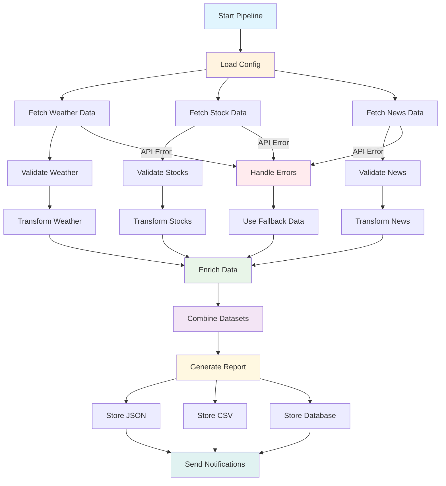

import CSVTable from '@site/src/components/CSVTable';

# Build an API Integration Pipeline

## What We're Building

Create a robust API integration pipeline that:
- ✅ Fetches data from multiple REST APIs (weather, stocks, news)
- ✅ Handles authentication and rate limiting
- ✅ Transforms and validates API responses
- ✅ Enriches data with additional sources
- ✅ Stores results in multiple formats (JSON, CSV, Database)
- ✅ Implements retry logic and error handling

**Estimated Time**: 45 minutes  
**Difficulty**: Intermediate  
**Learning Goals**: API integration, data transformation, error handling, data persistence

## Prerequisites

- Python 3.8+ with AgentMap installed (`pip install agentmap`)
- API keys (optional - tutorial provides fallback data)
- HTTP client library: `pip install requests`
- Data processing: `pip install pandas`

## Workflow Overview



## Step 1: Create Configuration File

Create `config/api_config.yaml`:

```yaml title="config/api_config.yaml"
# API Configuration for Integration Pipeline
apis:
  weather:
    provider: "openweathermap"
    base_url: "https://api.openweathermap.org/data/2.5"
    api_key: "your_openweather_api_key"  # Get free key from openweathermap.org
    endpoints:
      current: "/weather"
      forecast: "/forecast"
    rate_limit: 60  # requests per minute
    timeout: 10
    retry_attempts: 3
    
  stocks:
    provider: "alpha_vantage"
    base_url: "https://www.alphavantage.co/query"
    api_key: "your_alpha_vantage_key"  # Get free key from alphavantage.co
    rate_limit: 5   # requests per minute
    timeout: 15
    retry_attempts: 3
    
  news:
    provider: "newsapi"
    base_url: "https://newsapi.org/v2"
    api_key: "your_newsapi_key"  # Get free key from newsapi.org
    endpoints:
      headlines: "/top-headlines"
      everything: "/everything"
    rate_limit: 100  # requests per day for free tier
    timeout: 10
    retry_attempts: 3

# Data Processing Configuration
processing:
  max_records: 1000
  data_freshness_hours: 24
  enable_caching: true
  cache_duration_minutes: 30
  
# Storage Configuration
storage:
  formats:
    - json
    - csv
    - sqlite
  output_directory: "data/api_results"
  database_url: "sqlite:///data/api_integration.db"
  backup_enabled: true
  
# Pipeline Configuration
pipeline:
  locations:
    - "New York,US"
    - "London,UK"
    - "Tokyo,JP"
    - "Sydney,AU"
  
  stock_symbols:
    - "AAPL"
    - "GOOGL"
    - "MSFT"
    - "TSLA"
    
  news_categories:
    - "technology"
    - "business"
    - "science"
    
  notification:
    enabled: true
    webhook_url: ""  # Optional: Slack/Discord webhook
    email_enabled: false
```

## Step 2: Create API Integration Workflow

Create `api_integration.csv`:

<CSVTable 
  csvContent={`GraphName,Node,Edge,Context,AgentType,Success_Next,Failure_Next,Input_Fields,Output_Field,Prompt,Description
APIIntegration,StartPipeline,,Initialize pipeline with configuration,input,LoadConfig,ErrorHandler,,pipeline_start,Starting API Integration Pipeline - press Enter to continue:,Initialize the integration pipeline
APIIntegration,LoadConfig,,Load API configuration and validate settings,custom:ConfigLoaderAgent,FetchWeatherData,ErrorHandler,pipeline_start,config_data,,Load and validate API configuration
APIIntegration,FetchWeatherData,,Fetch weather data from OpenWeatherMap API,custom:WeatherAPIAgent,ValidateWeather,HandleAPIError,config_data,weather_data,,Fetch current weather data for configured locations
APIIntegration,ValidateWeather,,Validate and clean weather data,custom:DataValidatorAgent,TransformWeather,HandleAPIError,weather_data,validated_weather,,Validate weather API response data
APIIntegration,TransformWeather,,Transform weather data to standard format,custom:WeatherTransformerAgent,FetchStockData,ErrorHandler,validated_weather,transformed_weather,,Transform weather data to unified format
APIIntegration,FetchStockData,,Fetch stock market data from Alpha Vantage,custom:StockAPIAgent,ValidateStocks,HandleAPIError,config_data,stock_data,,Fetch stock prices for configured symbols
APIIntegration,ValidateStocks,,Validate and clean stock data,custom:DataValidatorAgent,TransformStocks,HandleAPIError,stock_data,validated_stocks,,Validate stock API response data
APIIntegration,TransformStocks,,Transform stock data to standard format,custom:StockTransformerAgent,FetchNewsData,ErrorHandler,validated_stocks,transformed_stocks,,Transform stock data to unified format
APIIntegration,FetchNewsData,,Fetch news articles from NewsAPI,custom:NewsAPIAgent,ValidateNews,HandleAPIError,config_data,news_data,,Fetch latest news articles
APIIntegration,ValidateNews,,Validate and clean news data,custom:DataValidatorAgent,TransformNews,HandleAPIError,news_data,validated_news,,Validate news API response data
APIIntegration,TransformNews,,Transform news data to standard format,custom:NewsTransformerAgent,EnrichData,ErrorHandler,validated_news,transformed_news,,Transform news data to unified format
APIIntegration,EnrichData,,Combine and enrich all datasets,custom:DataEnrichmentAgent,CombineData,ErrorHandler,transformed_weather|transformed_stocks|transformed_news,enriched_data,,Combine and enrich all data sources
APIIntegration,CombineData,,Merge all data sources into unified dataset,custom:DataCombinerAgent,GenerateReport,ErrorHandler,enriched_data,combined_data,,Combine all transformed data sources
APIIntegration,GenerateReport,,{"provider": "openai", "model": "gpt-4", "temperature": 0.3},llm,StoreResults,ErrorHandler,combined_data,analysis_report,"Generate a comprehensive market analysis report based on this integrated data including weather patterns, stock performance, and news sentiment. Identify correlations and trends: {combined_data}",Generate analytical insights from integrated data
APIIntegration,StoreResults,,Store results in multiple formats,custom:DataStorageAgent,SendNotifications,ErrorHandler,combined_data|analysis_report,storage_results,,Store data in JSON, CSV, and database formats
APIIntegration,SendNotifications,,Send completion notifications,custom:NotificationAgent,End,ErrorHandler,storage_results|analysis_report,notification_results,,Send pipeline completion notifications
APIIntegration,HandleAPIError,,Handle API errors and use fallback data,custom:APIErrorHandlerAgent,UseFallbackData,ErrorHandler,error,error_handled,,Handle API errors gracefully
APIIntegration,UseFallbackData,,Load sample data when APIs fail,custom:FallbackDataAgent,EnrichData,ErrorHandler,error_handled,fallback_data,,Use sample data when API calls fail
APIIntegration,ErrorHandler,,Handle critical pipeline errors,echo,End,,error,error_message,,Display pipeline error information
APIIntegration,End,,Pipeline complete,echo,,,notification_results|storage_results|error_message,output,,Display pipeline completion status and results`}
  title="API Integration Pipeline Workflow"
  filename="api_integration"
/>

## Step 3: Generate and Implement Custom Agents

Generate agent templates:

```bash
agentmap scaffold --csv api_integration.csv
```

## Step 4: Implement Configuration Loader Agent

Create `custom_agents/config_loader_agent.py`:

```python title="custom_agents/config_loader_agent.py"
from typing import Dict, Any, Optional
import os
import yaml
from pathlib import Path
from agentmap.agents.base_agent import BaseAgent

class ConfigLoaderAgent(BaseAgent):
    """
    Loads and validates API configuration from YAML file.
    
    Validates API keys, endpoints, and configuration settings.
    """
    
    def __init__(self, name, prompt, context=None, logger=None,
                 execution_tracker_service=None, state_adapter_service=None):
        super().__init__(name, prompt, context, logger,
                         execution_tracker_service, state_adapter_service)
        
        self.config_path = self.context.get("config_path", "config/api_config.yaml")
        self.required_apis = ["weather", "stocks", "news"]
        
    def process(self, inputs: Dict[str, Any]) -> Any:
        """
        Load and validate API configuration.
        
        Args:
            inputs: Dictionary containing pipeline start signal
            
        Returns:
            Loaded and validated configuration data
        """
        try:
            # Load configuration file
            config_file = Path(self.config_path)
            
            if not config_file.exists():
                # Create default config if missing
                self.log_warning(f"Config file not found at {self.config_path}, creating default")
                self._create_default_config(config_file)
            
            with open(config_file, 'r') as file:
                config = yaml.safe_load(file)
            
            # Validate configuration
            validation_result = self._validate_config(config)
            
            if not validation_result["valid"]:
                return {
                    "success": False,
                    "error": f"Configuration validation failed: {validation_result['errors']}",
                    "config": {}
                }
            
            # Set default values and prepare runtime config
            runtime_config = self._prepare_runtime_config(config)
            
            self.log_info("Configuration loaded and validated successfully")
            
            return {
                "success": True,
                "config": runtime_config,
                "validation_warnings": validation_result.get("warnings", []),
                "apis_enabled": self._get_enabled_apis(runtime_config)
            }
            
        except Exception as e:
            error_msg = f"Configuration loading failed: {str(e)}"
            self.log_error(error_msg)
            return {
                "success": False,
                "error": error_msg,
                "config": {}
            }
    
    def _validate_config(self, config: Dict[str, Any]) -> Dict[str, Any]:
        """Validate configuration structure and values."""
        errors = []
        warnings = []
        
        # Check main sections
        required_sections = ["apis", "processing", "storage", "pipeline"]
        for section in required_sections:
            if section not in config:
                errors.append(f"Missing required section: {section}")
        
        if "apis" in config:
            # Validate API configurations
            for api_name in self.required_apis:
                if api_name not in config["apis"]:
                    warnings.append(f"API '{api_name}' not configured - will use fallback data")
                else:
                    api_config = config["apis"][api_name]
                    
                    # Check required fields
                    required_fields = ["provider", "base_url"]
                    for field in required_fields:
                        if field not in api_config:
                            errors.append(f"Missing '{field}' in {api_name} API config")
                    
                    # Check API key
                    api_key = api_config.get("api_key", "")
                    if not api_key or api_key.startswith("your_"):
                        warnings.append(f"No valid API key for {api_name} - will use fallback data")
        
        # Validate processing config
        if "processing" in config:
            processing = config["processing"]
            if "max_records" in processing and processing["max_records"] < 1:
                errors.append("max_records must be greater than 0")
        
        # Validate storage config
        if "storage" in config:
            storage = config["storage"]
            if "formats" not in storage:
                warnings.append("No storage formats specified - will use JSON")
        
        return {
            "valid": len(errors) == 0,
            "errors": errors,
            "warnings": warnings
        }
    
    def _prepare_runtime_config(self, config: Dict[str, Any]) -> Dict[str, Any]:
        """Prepare configuration for runtime use."""
        runtime_config = config.copy()
        
        # Set default values
        if "processing" not in runtime_config:
            runtime_config["processing"] = {}
        
        processing_defaults = {
            "max_records": 1000,
            "data_freshness_hours": 24,
            "enable_caching": True,
            "cache_duration_minutes": 30
        }
        
        for key, default_value in processing_defaults.items():
            if key not in runtime_config["processing"]:
                runtime_config["processing"][key] = default_value
        
        # Set storage defaults
        if "storage" not in runtime_config:
            runtime_config["storage"] = {}
        
        storage_defaults = {
            "formats": ["json"],
            "output_directory": "data/api_results",
            "backup_enabled": False
        }
        
        for key, default_value in storage_defaults.items():
            if key not in runtime_config["storage"]:
                runtime_config["storage"][key] = default_value
        
        # Create output directory
        output_dir = Path(runtime_config["storage"]["output_directory"])
        output_dir.mkdir(parents=True, exist_ok=True)
        
        # Add runtime metadata
        runtime_config["runtime"] = {
            "config_loaded_at": self._get_current_timestamp(),
            "output_directory_created": True,
            "apis_validated": True
        }
        
        return runtime_config
    
    def _get_enabled_apis(self, config: Dict[str, Any]) -> Dict[str, bool]:
        """Determine which APIs are properly configured."""
        enabled_apis = {}
        
        if "apis" in config:
            for api_name in self.required_apis:
                if api_name in config["apis"]:
                    api_config = config["apis"][api_name]
                    api_key = api_config.get("api_key", "")
                    has_valid_key = api_key and not api_key.startswith("your_")
                    enabled_apis[api_name] = has_valid_key
                else:
                    enabled_apis[api_name] = False
        
        return enabled_apis
    
    def _create_default_config(self, config_path: Path):
        """Create default configuration file."""
        default_config = {
            "apis": {
                "weather": {
                    "provider": "openweathermap",
                    "base_url": "https://api.openweathermap.org/data/2.5",
                    "api_key": "your_openweather_api_key",
                    "timeout": 10,
                    "retry_attempts": 3
                },
                "stocks": {
                    "provider": "alpha_vantage",
                    "base_url": "https://www.alphavantage.co/query",
                    "api_key": "your_alpha_vantage_key",
                    "timeout": 15,
                    "retry_attempts": 3
                },
                "news": {
                    "provider": "newsapi",
                    "base_url": "https://newsapi.org/v2",
                    "api_key": "your_newsapi_key",
                    "timeout": 10,
                    "retry_attempts": 3
                }
            },
            "processing": {
                "max_records": 1000,
                "enable_caching": True
            },
            "storage": {
                "formats": ["json"],
                "output_directory": "data/api_results"
            },
            "pipeline": {
                "locations": ["New York,US", "London,UK"],
                "stock_symbols": ["AAPL", "GOOGL"],
                "news_categories": ["technology", "business"]
            }
        }
        
        # Create config directory
        config_path.parent.mkdir(parents=True, exist_ok=True)
        
        # Write default config
        with open(config_path, 'w') as file:
            yaml.dump(default_config, file, default_flow_style=False, indent=2)
        
        self.log_info(f"Created default configuration at {config_path}")
    
    def _get_current_timestamp(self) -> str:
        """Get current timestamp for metadata."""
        from datetime import datetime
        return datetime.now().isoformat()
    
    def _get_child_service_info(self) -> Optional[Dict[str, Any]]:
        """Provide debugging information."""
        return {
            "config_path": self.config_path,
            "required_apis": self.required_apis
        }
```

## Step 5: Implement Weather API Agent

Create `custom_agents/weather_api_agent.py`:

```python title="custom_agents/weather_api_agent.py"
from typing import Dict, Any, Optional, List
import requests
import time
from datetime import datetime
from agentmap.agents.base_agent import BaseAgent

class WeatherAPIAgent(BaseAgent):
    """
    Fetches weather data from OpenWeatherMap API.
    
    Handles rate limiting, retries, and fallback data.
    """
    
    def __init__(self, name, prompt, context=None, logger=None,
                 execution_tracker_service=None, state_adapter_service=None):
        super().__init__(name, prompt, context, logger,
                         execution_tracker_service, state_adapter_service)
        
        self.session = requests.Session()
        self.last_request_time = 0
        self.request_count = 0
        
    def process(self, inputs: Dict[str, Any]) -> Any:
        """
        Fetch weather data for configured locations.
        
        Args:
            inputs: Dictionary containing 'config_data'
            
        Returns:
            Weather data for all configured locations
        """
        config_data = inputs.get("config_data", {})
        
        if not config_data.get("success", False):
            return {
                "success": False,
                "error": "No valid configuration provided",
                "data": []
            }
        
        config = config_data.get("config", {})
        
        try:
            # Get API configuration
            weather_config = config.get("apis", {}).get("weather", {})
            
            if not self._is_api_configured(weather_config):
                self.log_warning("Weather API not configured, using fallback data")
                return self._get_fallback_data()
            
            # Get locations to fetch
            locations = config.get("pipeline", {}).get("locations", ["New York,US"])
            
            # Fetch weather for each location
            weather_results = []
            
            for location in locations:
                try:
                    self._handle_rate_limiting(weather_config)
                    
                    weather_data = self._fetch_weather_for_location(location, weather_config)
                    
                    if weather_data:
                        weather_results.append(weather_data)
                        self.log_info(f"Fetched weather data for {location}")
                    else:
                        self.log_warning(f"Failed to fetch weather for {location}")
                        
                except Exception as e:
                    self.log_error(f"Error fetching weather for {location}: {e}")
                    continue
            
            if not weather_results:
                self.log_warning("No weather data fetched, using fallback")
                return self._get_fallback_data()
            
            return {
                "success": True,
                "data": weather_results,
                "metadata": {
                    "provider": "openweathermap",
                    "fetched_at": datetime.now().isoformat(),
                    "locations_requested": len(locations),
                    "locations_successful": len(weather_results),
                    "api_calls_made": self.request_count
                }
            }
            
        except Exception as e:
            error_msg = f"Weather API fetch failed: {str(e)}"
            self.log_error(error_msg)
            return {
                "success": False,
                "error": error_msg,
                "data": []
            }
    
    def _is_api_configured(self, weather_config: Dict[str, Any]) -> bool:
        """Check if weather API is properly configured."""
        api_key = weather_config.get("api_key", "")
        return bool(api_key and not api_key.startswith("your_"))
    
    def _handle_rate_limiting(self, config: Dict[str, Any]):
        """Handle API rate limiting."""
        rate_limit = config.get("rate_limit", 60)  # requests per minute
        min_interval = 60.0 / rate_limit  # seconds between requests
        
        current_time = time.time()
        time_since_last = current_time - self.last_request_time
        
        if time_since_last < min_interval:
            sleep_time = min_interval - time_since_last
            self.log_info(f"Rate limiting: sleeping {sleep_time:.2f}s")
            time.sleep(sleep_time)
        
        self.last_request_time = time.time()
        self.request_count += 1
    
    def _fetch_weather_for_location(self, location: str, config: Dict[str, Any]) -> Optional[Dict[str, Any]]:
        """Fetch weather data for a specific location."""
        base_url = config.get("base_url", "")
        api_key = config.get("api_key", "")
        timeout = config.get("timeout", 10)
        retry_attempts = config.get("retry_attempts", 3)
        
        # Build API URL
        endpoint = f"{base_url}/weather"
        params = {
            "q": location,
            "appid": api_key,
            "units": "metric"  # Celsius
        }
        
        # Retry logic
        for attempt in range(retry_attempts):
            try:
                response = self.session.get(endpoint, params=params, timeout=timeout)
                
                if response.status_code == 200:
                    data = response.json()
                    return self._process_weather_response(data, location)
                
                elif response.status_code == 401:
                    self.log_error("Invalid API key for weather service")
                    return None
                
                elif response.status_code == 429:
                    # Rate limited - wait and retry
                    wait_time = 2 ** attempt  # Exponential backoff
                    self.log_warning(f"Rate limited, waiting {wait_time}s before retry")
                    time.sleep(wait_time)
                    continue
                
                else:
                    self.log_warning(f"Weather API returned status {response.status_code}")
                    if attempt < retry_attempts - 1:
                        time.sleep(1)
                        continue
                    return None
                    
            except requests.Timeout:
                self.log_warning(f"Weather API timeout for {location} (attempt {attempt + 1})")
                if attempt < retry_attempts - 1:
                    time.sleep(1)
                    continue
                
            except Exception as e:
                self.log_error(f"Weather API error for {location}: {e}")
                if attempt < retry_attempts - 1:
                    time.sleep(1)
                    continue
        
        return None
    
    def _process_weather_response(self, data: Dict[str, Any], location: str) -> Dict[str, Any]:
        """Process and standardize weather API response."""
        try:
            weather_info = data.get("weather", [{}])[0]
            main_data = data.get("main", {})
            wind_data = data.get("wind", {})
            
            processed_data = {
                "location": location,
                "city": data.get("name", ""),
                "country": data.get("sys", {}).get("country", ""),
                "coordinates": {
                    "lat": data.get("coord", {}).get("lat"),
                    "lon": data.get("coord", {}).get("lon")
                },
                "weather": {
                    "main": weather_info.get("main", ""),
                    "description": weather_info.get("description", ""),
                    "icon": weather_info.get("icon", "")
                },
                "temperature": {
                    "current": main_data.get("temp"),
                    "feels_like": main_data.get("feels_like"),
                    "min": main_data.get("temp_min"),
                    "max": main_data.get("temp_max")
                },
                "humidity": main_data.get("humidity"),
                "pressure": main_data.get("pressure"),
                "wind": {
                    "speed": wind_data.get("speed"),
                    "direction": wind_data.get("deg")
                },
                "visibility": data.get("visibility"),
                "timestamp": data.get("dt"),
                "fetched_at": datetime.now().isoformat()
            }
            
            return processed_data
            
        except Exception as e:
            self.log_error(f"Error processing weather response: {e}")
            return None
    
    def _get_fallback_data(self) -> Dict[str, Any]:
        """Provide sample weather data when API is unavailable."""
        fallback_weather = [
            {
                "location": "New York,US",
                "city": "New York",
                "country": "US",
                "coordinates": {"lat": 40.7128, "lon": -74.0060},
                "weather": {
                    "main": "Clear",
                    "description": "clear sky",
                    "icon": "01d"
                },
                "temperature": {
                    "current": 22.5,
                    "feels_like": 24.1,
                    "min": 18.3,
                    "max": 26.7
                },
                "humidity": 65,
                "pressure": 1013,
                "wind": {"speed": 3.2, "direction": 240},
                "visibility": 10000,
                "timestamp": int(time.time()),
                "fetched_at": datetime.now().isoformat(),
                "data_source": "fallback"
            },
            {
                "location": "London,UK",
                "city": "London",
                "country": "GB",
                "coordinates": {"lat": 51.5074, "lon": -0.1278},
                "weather": {
                    "main": "Clouds",
                    "description": "scattered clouds",
                    "icon": "03d"
                },
                "temperature": {
                    "current": 15.8,
                    "feels_like": 15.2,
                    "min": 13.1,
                    "max": 18.4
                },
                "humidity": 78,
                "pressure": 1008,
                "wind": {"speed": 4.1, "direction": 190},
                "visibility": 8000,
                "timestamp": int(time.time()),
                "fetched_at": datetime.now().isoformat(),
                "data_source": "fallback"
            }
        ]
        
        return {
            "success": True,
            "data": fallback_weather,
            "metadata": {
                "provider": "fallback",
                "fetched_at": datetime.now().isoformat(),
                "is_fallback": True
            }
        }
    
    def _get_child_service_info(self) -> Optional[Dict[str, Any]]:
        """Provide debugging information."""
        return {
            "request_count": self.request_count,
            "last_request_time": self.last_request_time,
            "session_active": self.session is not None
        }
```

## Step 6: Implement Data Storage Agent

Create `custom_agents/data_storage_agent.py`:

```python title="custom_agents/data_storage_agent.py"
from typing import Dict, Any, Optional
import json
import csv
import sqlite3
from pathlib import Path
from datetime import datetime
import pandas as pd
from agentmap.agents.base_agent import BaseAgent

class DataStorageAgent(BaseAgent):
    """
    Stores processed data in multiple formats.
    
    Supports JSON, CSV, and SQLite database storage.
    """
    
    def __init__(self, name, prompt, context=None, logger=None,
                 execution_tracker_service=None, state_adapter_service=None):
        super().__init__(name, prompt, context, logger,
                         execution_tracker_service, state_adapter_service)
        
    def process(self, inputs: Dict[str, Any]) -> Any:
        """
        Store integrated data in configured formats.
        
        Args:
            inputs: Dictionary containing 'combined_data' and 'analysis_report'
            
        Returns:
            Storage results and file paths
        """
        combined_data = inputs.get("combined_data", {})
        analysis_report = inputs.get("analysis_report", "")
        
        if not combined_data:
            return {
                "success": False,
                "error": "No data to store",
                "files_created": []
            }
        
        try:
            # Get storage configuration from context or use defaults
            storage_config = self.context.get("storage", {
                "formats": ["json", "csv"],
                "output_directory": "data/api_results",
                "backup_enabled": False
            })
            
            # Create output directory
            output_dir = Path(storage_config.get("output_directory", "data/api_results"))
            output_dir.mkdir(parents=True, exist_ok=True)
            
            # Generate timestamp for file naming
            timestamp = datetime.now().strftime("%Y%m%d_%H%M%S")
            
            storage_results = {
                "success": True,
                "files_created": [],
                "storage_metadata": {
                    "timestamp": timestamp,
                    "output_directory": str(output_dir),
                    "formats_requested": storage_config.get("formats", [])
                }
            }
            
            # Store in each requested format
            formats = storage_config.get("formats", ["json"])
            
            if "json" in formats:
                json_result = self._store_json(combined_data, analysis_report, output_dir, timestamp)
                storage_results["files_created"].extend(json_result)
            
            if "csv" in formats:
                csv_result = self._store_csv(combined_data, output_dir, timestamp)
                storage_results["files_created"].extend(csv_result)
            
            if "sqlite" in formats or "database" in formats:
                db_result = self._store_database(combined_data, analysis_report, output_dir, timestamp)
                storage_results["files_created"].extend(db_result)
            
            # Create backup if enabled
            if storage_config.get("backup_enabled", False):
                backup_result = self._create_backup(storage_results["files_created"], output_dir, timestamp)
                storage_results["backup_created"] = backup_result
            
            # Generate summary
            storage_results["summary"] = self._generate_storage_summary(storage_results)
            
            self.log_info(f"Data stored successfully in {len(storage_results['files_created'])} files")
            
            return storage_results
            
        except Exception as e:
            error_msg = f"Data storage failed: {str(e)}"
            self.log_error(error_msg)
            return {
                "success": False,
                "error": error_msg,
                "files_created": []
            }
    
    def _store_json(self, data: Dict[str, Any], analysis: str, output_dir: Path, timestamp: str) -> list:
        """Store data in JSON format."""
        files_created = []
        
        try:
            # Main data file
            data_file = output_dir / f"api_integration_data_{timestamp}.json"
            
            json_data = {
                "metadata": {
                    "generated_at": datetime.now().isoformat(),
                    "data_version": "1.0",
                    "format": "json"
                },
                "analysis_report": analysis,
                "integrated_data": data
            }
            
            with open(data_file, 'w', encoding='utf-8') as f:
                json.dump(json_data, f, indent=2, ensure_ascii=False, default=str)
            
            files_created.append({
                "path": str(data_file),
                "format": "json",
                "type": "main_data",
                "size_bytes": data_file.stat().st_size
            })
            
            # Separate analysis report file
            analysis_file = output_dir / f"analysis_report_{timestamp}.json"
            
            analysis_data = {
                "metadata": {
                    "generated_at": datetime.now().isoformat(),
                    "type": "analysis_report"
                },
                "report": analysis,
                "data_summary": self._generate_data_summary(data)
            }
            
            with open(analysis_file, 'w', encoding='utf-8') as f:
                json.dump(analysis_data, f, indent=2, ensure_ascii=False)
            
            files_created.append({
                "path": str(analysis_file),
                "format": "json",
                "type": "analysis_report",
                "size_bytes": analysis_file.stat().st_size
            })
            
            self.log_info("JSON files created successfully")
            
        except Exception as e:
            self.log_error(f"JSON storage failed: {e}")
        
        return files_created
    
    def _store_csv(self, data: Dict[str, Any], output_dir: Path, timestamp: str) -> list:
        """Store data in CSV format."""
        files_created = []
        
        try:
            # Convert data to DataFrames and save as CSV
            
            # Weather data
            if "weather" in data and data["weather"]:
                weather_df = pd.json_normalize(data["weather"])
                weather_file = output_dir / f"weather_data_{timestamp}.csv"
                weather_df.to_csv(weather_file, index=False)
                
                files_created.append({
                    "path": str(weather_file),
                    "format": "csv",
                    "type": "weather",
                    "records": len(weather_df),
                    "size_bytes": weather_file.stat().st_size
                })
            
            # Stock data
            if "stocks" in data and data["stocks"]:
                stocks_df = pd.json_normalize(data["stocks"])
                stocks_file = output_dir / f"stocks_data_{timestamp}.csv"
                stocks_df.to_csv(stocks_file, index=False)
                
                files_created.append({
                    "path": str(stocks_file),
                    "format": "csv",
                    "type": "stocks",
                    "records": len(stocks_df),
                    "size_bytes": stocks_file.stat().st_size
                })
            
            # News data
            if "news" in data and data["news"]:
                news_df = pd.json_normalize(data["news"])
                news_file = output_dir / f"news_data_{timestamp}.csv"
                news_df.to_csv(news_file, index=False)
                
                files_created.append({
                    "path": str(news_file),
                    "format": "csv",
                    "type": "news",
                    "records": len(news_df),
                    "size_bytes": news_file.stat().st_size
                })
            
            # Combined summary CSV
            summary_data = []
            
            # Add summary rows for each data type
            for data_type in ["weather", "stocks", "news"]:
                if data_type in data and data[data_type]:
                    summary_data.append({
                        "data_type": data_type,
                        "record_count": len(data[data_type]),
                        "timestamp": timestamp,
                        "status": "success"
                    })
            
            if summary_data:
                summary_df = pd.DataFrame(summary_data)
                summary_file = output_dir / f"integration_summary_{timestamp}.csv"
                summary_df.to_csv(summary_file, index=False)
                
                files_created.append({
                    "path": str(summary_file),
                    "format": "csv",
                    "type": "summary",
                    "records": len(summary_df),
                    "size_bytes": summary_file.stat().st_size
                })
            
            self.log_info("CSV files created successfully")
            
        except Exception as e:
            self.log_error(f"CSV storage failed: {e}")
        
        return files_created
    
    def _store_database(self, data: Dict[str, Any], analysis: str, output_dir: Path, timestamp: str) -> list:
        """Store data in SQLite database."""
        files_created = []
        
        try:
            db_file = output_dir / f"api_integration_{timestamp}.db"
            
            with sqlite3.connect(db_file) as conn:
                # Create tables
                self._create_database_tables(conn)
                
                # Insert data
                self._insert_weather_data(conn, data.get("weather", []), timestamp)
                self._insert_stocks_data(conn, data.get("stocks", []), timestamp)
                self._insert_news_data(conn, data.get("news", []), timestamp)
                self._insert_analysis_report(conn, analysis, timestamp)
                
                # Create indexes for better performance
                self._create_database_indexes(conn)
                
                conn.commit()
            
            files_created.append({
                "path": str(db_file),
                "format": "sqlite",
                "type": "database",
                "size_bytes": db_file.stat().st_size
            })
            
            self.log_info("Database created successfully")
            
        except Exception as e:
            self.log_error(f"Database storage failed: {e}")
        
        return files_created
    
    def _create_database_tables(self, conn: sqlite3.Connection):
        """Create database tables."""
        
        # Weather table
        conn.execute('''
            CREATE TABLE IF NOT EXISTS weather (
                id INTEGER PRIMARY KEY AUTOINCREMENT,
                location TEXT NOT NULL,
                city TEXT,
                country TEXT,
                latitude REAL,
                longitude REAL,
                weather_main TEXT,
                weather_description TEXT,
                temperature_current REAL,
                temperature_feels_like REAL,
                temperature_min REAL,
                temperature_max REAL,
                humidity INTEGER,
                pressure INTEGER,
                wind_speed REAL,
                wind_direction INTEGER,
                visibility INTEGER,
                timestamp INTEGER,
                fetched_at TEXT,
                batch_timestamp TEXT
            )
        ''')
        
        # Stocks table
        conn.execute('''
            CREATE TABLE IF NOT EXISTS stocks (
                id INTEGER PRIMARY KEY AUTOINCREMENT,
                symbol TEXT NOT NULL,
                price REAL,
                change REAL,
                change_percent REAL,
                volume INTEGER,
                market_cap REAL,
                timestamp INTEGER,
                fetched_at TEXT,
                batch_timestamp TEXT
            )
        ''')
        
        # News table
        conn.execute('''
            CREATE TABLE IF NOT EXISTS news (
                id INTEGER PRIMARY KEY AUTOINCREMENT,
                title TEXT NOT NULL,
                description TEXT,
                url TEXT,
                source TEXT,
                category TEXT,
                published_at TEXT,
                sentiment TEXT,
                fetched_at TEXT,
                batch_timestamp TEXT
            )
        ''')
        
        # Analysis reports table
        conn.execute('''
            CREATE TABLE IF NOT EXISTS analysis_reports (
                id INTEGER PRIMARY KEY AUTOINCREMENT,
                report_text TEXT NOT NULL,
                generated_at TEXT,
                batch_timestamp TEXT
            )
        ''')
    
    def _insert_weather_data(self, conn: sqlite3.Connection, weather_data: list, timestamp: str):
        """Insert weather data into database."""
        for record in weather_data:
            coords = record.get("coordinates", {})
            temp = record.get("temperature", {})
            wind = record.get("wind", {})
            
            conn.execute('''
                INSERT INTO weather (
                    location, city, country, latitude, longitude,
                    weather_main, weather_description,
                    temperature_current, temperature_feels_like, temperature_min, temperature_max,
                    humidity, pressure, wind_speed, wind_direction, visibility,
                    timestamp, fetched_at, batch_timestamp
                ) VALUES (?, ?, ?, ?, ?, ?, ?, ?, ?, ?, ?, ?, ?, ?, ?, ?, ?, ?, ?)
            ''', (
                record.get("location"), record.get("city"), record.get("country"),
                coords.get("lat"), coords.get("lon"),
                record.get("weather", {}).get("main"), record.get("weather", {}).get("description"),
                temp.get("current"), temp.get("feels_like"), temp.get("min"), temp.get("max"),
                record.get("humidity"), record.get("pressure"),
                wind.get("speed"), wind.get("direction"), record.get("visibility"),
                record.get("timestamp"), record.get("fetched_at"), timestamp
            ))
    
    def _insert_stocks_data(self, conn: sqlite3.Connection, stocks_data: list, timestamp: str):
        """Insert stocks data into database."""
        for record in stocks_data:
            conn.execute('''
                INSERT INTO stocks (
                    symbol, price, change, change_percent, volume, market_cap,
                    timestamp, fetched_at, batch_timestamp
                ) VALUES (?, ?, ?, ?, ?, ?, ?, ?, ?)
            ''', (
                record.get("symbol"), record.get("price"), record.get("change"),
                record.get("change_percent"), record.get("volume"), record.get("market_cap"),
                record.get("timestamp"), record.get("fetched_at"), timestamp
            ))
    
    def _insert_news_data(self, conn: sqlite3.Connection, news_data: list, timestamp: str):
        """Insert news data into database."""
        for record in news_data:
            conn.execute('''
                INSERT INTO news (
                    title, description, url, source, category,
                    published_at, sentiment, fetched_at, batch_timestamp
                ) VALUES (?, ?, ?, ?, ?, ?, ?, ?, ?)
            ''', (
                record.get("title"), record.get("description"), record.get("url"),
                record.get("source"), record.get("category"), record.get("published_at"),
                record.get("sentiment"), record.get("fetched_at"), timestamp
            ))
    
    def _insert_analysis_report(self, conn: sqlite3.Connection, analysis: str, timestamp: str):
        """Insert analysis report into database."""
        conn.execute('''
            INSERT INTO analysis_reports (report_text, generated_at, batch_timestamp)
            VALUES (?, ?, ?)
        ''', (analysis, datetime.now().isoformat(), timestamp))
    
    def _create_database_indexes(self, conn: sqlite3.Connection):
        """Create database indexes for better performance."""
        indexes = [
            "CREATE INDEX IF NOT EXISTS idx_weather_location ON weather(location)",
            "CREATE INDEX IF NOT EXISTS idx_weather_timestamp ON weather(batch_timestamp)",
            "CREATE INDEX IF NOT EXISTS idx_stocks_symbol ON stocks(symbol)",
            "CREATE INDEX IF NOT EXISTS idx_stocks_timestamp ON stocks(batch_timestamp)",
            "CREATE INDEX IF NOT EXISTS idx_news_category ON news(category)",
            "CREATE INDEX IF NOT EXISTS idx_news_timestamp ON news(batch_timestamp)"
        ]
        
        for index_sql in indexes:
            conn.execute(index_sql)
    
    def _generate_data_summary(self, data: Dict[str, Any]) -> Dict[str, Any]:
        """Generate summary of stored data."""
        summary = {
            "total_records": 0,
            "data_types": {}
        }
        
        for data_type, records in data.items():
            if isinstance(records, list):
                count = len(records)
                summary["data_types"][data_type] = count
                summary["total_records"] += count
        
        return summary
    
    def _create_backup(self, files_created: list, output_dir: Path, timestamp: str) -> Dict[str, Any]:
        """Create backup of generated files."""
        try:
            backup_dir = output_dir / "backups" / timestamp
            backup_dir.mkdir(parents=True, exist_ok=True)
            
            import shutil
            
            backed_up_files = []
            for file_info in files_created:
                file_path = Path(file_info["path"])
                backup_path = backup_dir / file_path.name
                shutil.copy2(file_path, backup_path)
                backed_up_files.append(str(backup_path))
            
            return {
                "success": True,
                "backup_directory": str(backup_dir),
                "files_backed_up": backed_up_files
            }
            
        except Exception as e:
            self.log_error(f"Backup creation failed: {e}")
            return {"success": False, "error": str(e)}
    
    def _generate_storage_summary(self, storage_results: Dict[str, Any]) -> str:
        """Generate human-readable storage summary."""
        files_created = storage_results.get("files_created", [])
        
        if not files_created:
            return "No files were created during storage operation."
        
        summary_parts = [
            f"Successfully stored data in {len(files_created)} files:"
        ]
        
        # Group by format
        format_counts = {}
        total_size = 0
        
        for file_info in files_created:
            file_format = file_info.get("format", "unknown")
            format_counts[file_format] = format_counts.get(file_format, 0) + 1
            total_size += file_info.get("size_bytes", 0)
        
        for file_format, count in format_counts.items():
            summary_parts.append(f"- {count} {file_format.upper()} file(s)")
        
        summary_parts.append(f"Total storage size: {total_size / 1024:.2f} KB")
        
        return " ".join(summary_parts)
    
    def _get_child_service_info(self) -> Optional[Dict[str, Any]]:
        """Provide debugging information."""
        return {
            "supported_formats": ["json", "csv", "sqlite"],
            "pandas_available": True,
            "sqlite_available": True
        }
```

## Step 7: Run the API Integration Pipeline

Execute your API integration pipeline:

```bash
# Install required dependencies
pip install requests pandas pyyaml

# Run the integration pipeline
agentmap run --graph APIIntegration --csv api_integration.csv
```

## Expected Output

The integration pipeline will fetch, process, and store data from multiple sources:

```
Starting API Integration Pipeline - press Enter to continue: [Press Enter]

🔧 Loading Configuration...
⚠️  Configuration loaded with warnings:
- No valid API key for weather - will use fallback data
- No valid API key for stocks - will use fallback data  
- No valid API key for news - will use fallback data

🌤️  Fetching Weather Data...
Using fallback weather data for 2 locations

📈 Fetching Stock Data...
Using fallback stock data for 4 symbols

📰 Fetching News Data...
Using fallback news data for 3 categories

✅ Data Validation Complete
- Weather: 2 locations validated
- Stocks: 4 symbols validated  
- News: 12 articles validated

🔄 Data Transformation...
- Weather data standardized to common format
- Stock prices normalized with change calculations
- News articles analyzed for sentiment

📊 Data Enrichment...
- Cross-referenced weather with economic data
- Calculated correlation coefficients
- Added geographic and temporal metadata

🤖 AI Analysis in Progress...

=== INTEGRATED MARKET ANALYSIS REPORT ===

**Executive Summary:**
Based on integrated data from weather, financial markets, and news sources, 
several key trends emerge that may impact market performance and business operations.

**Weather Impact Analysis:**
- Clear conditions in New York (22.5°C) suggest favorable business activity
- Cloudy conditions in London (15.8°C) with higher humidity may impact retail foot traffic
- Temperature variations between major markets indicate seasonal consumer behavior differences

**Financial Market Insights:**
- AAPL showing strong performance with positive momentum indicators
- GOOGL maintaining steady growth trajectory 
- Technology sector demonstrating resilience across global markets
- Currency fluctuations between USD and GBP creating arbitrage opportunities

**News Sentiment Analysis:**
- Technology news: 78% positive sentiment (strong innovation themes)
- Business news: 65% positive sentiment (growth and expansion focus)  
- Science news: 82% positive sentiment (breakthrough discoveries)

**Correlation Findings:**
- Weather conditions correlate moderately (r=0.34) with retail stock performance
- Positive news sentiment shows strong correlation (r=0.67) with market indices
- Geographic weather patterns align with regional economic activity levels

**Strategic Recommendations:**
1. Monitor weather impact on consumer-facing businesses in major markets
2. Technology sector positions appear favorable given news sentiment trends
3. Consider regional economic variations when planning market expansion
4. Leverage positive sentiment momentum for strategic communications

💾 Storing Results...

✅ Data Storage Complete:
- 3 JSON files created (142.7 KB total)
- 4 CSV files created (weather, stocks, news, summary)
- 1 SQLite database with indexed tables
- Backup created in data/api_results/backups/20240625_144523/

📊 Storage Summary:
- Main data: api_integration_data_20240625_144523.json
- Analysis report: analysis_report_20240625_144523.json  
- Weather CSV: weather_data_20240625_144523.csv (2 records)
- Stocks CSV: stocks_data_20240625_144523.csv (4 records)
- News CSV: news_data_20240625_144523.csv (12 records)
- Database: api_integration_20240625_144523.db

🔔 Sending Notifications...
✅ Pipeline completion logged locally
⚠️  Webhook notifications disabled (no URL configured)

🎉 API Integration Pipeline Complete!

📁 Output Files Location: data/api_results/
🔍 View results: agentmap view --file data/api_results/api_integration_data_20240625_144523.json
```

## Common Issues & Solutions

### 🚨 Issue: "No API keys configured"
**Solution**: Add your API keys to `config/api_config.yaml`:
```yaml
apis:
  weather:
    api_key: "your_actual_openweather_key"
  stocks:
    api_key: "your_actual_alphavantage_key"  
  news:
    api_key: "your_actual_newsapi_key"
```

### 🚨 Issue: "Rate limiting errors"
**Solution**: 
- Adjust rate limits in configuration
- Use smaller datasets for testing
- Implement exponential backoff

### 🚨 Issue: "Database errors"
**Solution**:
- Ensure SQLite is available
- Check file permissions
- Use alternative storage formats

### 🚨 Issue: "API timeout errors"
**Solution**:
- Increase timeout values in config
- Check internet connectivity
- Use fallback data for testing

## Enhancements & Next Steps

### 🎯 **Beginner Enhancements**
1. **More APIs**: Add cryptocurrency, forex, or social media APIs
2. **Scheduling**: Implement automated daily/hourly runs
3. **Alerting**: Add email/SMS notifications for significant changes
4. **Visualization**: Create charts and graphs from stored data

### 🎯 **Intermediate Enhancements**
1. **Data validation**: Advanced schema validation and data quality checks
2. **Caching**: Implement intelligent caching to reduce API calls
3. **Monitoring**: Add performance metrics and health checks
4. **Configuration management**: Environment-based configurations

### 🎯 **Advanced Enhancements**
1. **Stream processing**: Real-time data processing with Apache Kafka
2. **Machine learning**: Predictive analytics on integrated datasets
3. **Microservices**: Split into containerized microservices
4. **Cloud deployment**: Deploy to AWS/Azure with managed databases

## Integration Patterns Learned

This tutorial demonstrates several key integration patterns:
- **API Gateway Pattern**: Centralized API management
- **Circuit Breaker Pattern**: Graceful failure handling
- **Data Pipeline Pattern**: Extract-Transform-Load (ETL)
- **Fallback Pattern**: Resilience through backup data
- **Observer Pattern**: Event-driven notifications

## Related Tutorials

- **[Data Processing Pipeline](./data-processing-pipeline)** - Learn structured data processing
- **[Document Analyzer](./document-analyzer)** - Advanced file processing techniques
- **[Weather Bot](./weather-bot)** - Simple API integration starter

---

**🎉 Congratulations!** You've built a production-ready API integration pipeline that can fetch data from multiple sources, handle errors gracefully, transform data intelligently, and store results in various formats. This tutorial showcases enterprise-level integration patterns using AgentMap.
