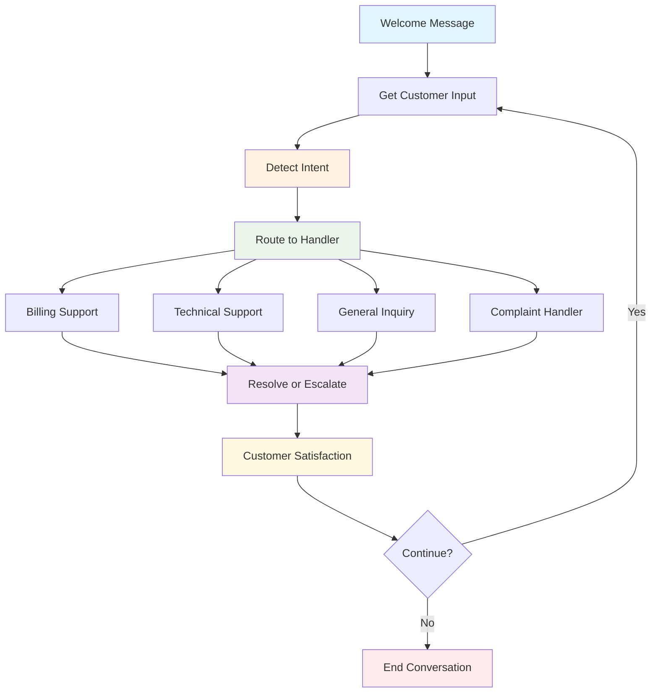

# Build a Customer Support Bot

## What We're Building

Create an intelligent customer support bot that:
- ✅ Understands customer intents and routes conversations
- ✅ Maintains conversation context and memory
- ✅ Provides personalized responses based on customer data
- ✅ Escalates complex issues to human agents
- ✅ Tracks conversation history and satisfaction

**Estimated Time**: 40 minutes  
**Difficulty**: Intermediate  
**Learning Goals**: Conversational AI, intent detection, routing logic, memory management

## Prerequisites

- Python 3.8+ with AgentMap installed (`pip install agentmap`)
- OpenAI or Anthropic API key for conversation AI
- Basic understanding of customer service workflows
- JSON file handling knowledge

## Workflow Overview



## Step 1: Create Customer Database

First, let's create a simple customer database:

```json title="data/customers.json"
{
  "customers": {
    "john.doe@email.com": {
      "name": "John Doe",
      "customer_id": "CUST_001",
      "plan": "Premium",
      "account_status": "Active",
      "last_payment": "2024-06-01",
      "support_history": [
        {
          "date": "2024-05-15",
          "issue": "Billing question",
          "status": "Resolved"
        }
      ],
      "preferences": {
        "language": "en",
        "contact_method": "email"
      }
    },
    "jane.smith@email.com": {
      "name": "Jane Smith",
      "customer_id": "CUST_002",
      "plan": "Basic",
      "account_status": "Active",
      "last_payment": "2024-06-10",
      "support_history": [],
      "preferences": {
        "language": "en",
        "contact_method": "chat"
      }
    },
    "mike.wilson@email.com": {
      "name": "Mike Wilson",
      "customer_id": "CUST_003",
      "plan": "Enterprise",
      "account_status": "Suspended",
      "last_payment": "2024-04-01",
      "support_history": [
        {
          "date": "2024-04-15",
          "issue": "Account suspension",
          "status": "Pending"
        }
      ],
      "preferences": {
        "language": "en",
        "contact_method": "phone"
      }
    }
  }
}
```

## Step 2: Create Support Bot Workflow

Create `support_bot.csv`:

```csv
GraphName,Node,Edge,Context,AgentType,Success_Next,Failure_Next,Input_Fields,Output_Field,Prompt,Description
SupportBot,Welcome,,Display welcome message,default,GetCustomerInfo,End,,welcome_message,🤖 Welcome to Customer Support! I'm here to help you today.,Welcome customers to support chat
SupportBot,GetCustomerInfo,,Get customer identification,input,LoadCustomerData,GetCustomerInfo,,customer_email,Please enter your email address:,Request customer email for lookup
SupportBot,LoadCustomerData,,Load customer information,custom:CustomerLookupAgent,StartConversation,CustomerNotFound,customer_email,customer_data,,Look up customer in database
SupportBot,CustomerNotFound,,Handle unregistered customers,echo,GetBasicInfo,End,customer_email,error_message,Customer not found. Please contact admin.,Handle customers not in system
SupportBot,GetBasicInfo,,Get basic customer info,input,StartConversation,End,,basic_info,Please provide your name and describe your issue:,Collect basic info for new customers
SupportBot,StartConversation,,{"memory_key": "conversation_history", "max_memory_messages": 20},default,GetUserInput,End,customer_data|basic_info|welcome_message,conversation_start,Great! I have your information. How can I help you today?,Start main conversation with context
SupportBot,GetUserInput,,Get customer message,input,DetectIntent,EndConversation,,user_message,What can I help you with? (type 'quit' to end):,Get customer's message or issue
SupportBot,DetectIntent,,Analyze customer intent,custom:IntentDetectionAgent,RouteToHandler,GetUserInput,user_message|conversation_history,detected_intent,,Analyze customer message for intent
SupportBot,RouteToHandler,,Route to appropriate handler,custom:ConversationRouterAgent,ProcessRequest,GetUserInput,detected_intent|user_message|customer_data,selected_handler,,Route conversation to right department
SupportBot,ProcessRequest,,Process customer request,custom:SupportResponseAgent,CheckSatisfaction,EscalateToHuman,user_message|detected_intent|customer_data|conversation_history,support_response,,Handle customer request with personalized response
SupportBot,EscalateToHuman,,Handle complex issues,echo,CheckSatisfaction,End,user_message|customer_data,escalation_message,This issue requires human assistance. A specialist will contact you within 24 hours.,Escalate complex issues to human agents
SupportBot,CheckSatisfaction,,{"memory_key": "conversation_history", "max_memory_messages": 20, "provider": "openai", "temperature": 0.7},llm,ContinueConversation,End,support_response|escalation_message|conversation_history,satisfaction_check,Rate your experience (1-5) and let me know if there's anything else I can help with today: {support_response},Check customer satisfaction and offer continued help
SupportBot,ContinueConversation,,Determine if conversation continues,custom:ConversationControlAgent,GetUserInput,LogConversation,satisfaction_check|user_message,continue_conversation,,Check if customer wants to continue
SupportBot,LogConversation,,Log conversation for analysis,custom:ConversationLoggerAgent,EndConversation,End,customer_data|conversation_history|satisfaction_check,log_result,,Save conversation details for improvement
SupportBot,EndConversation,,End conversation gracefully,echo,End,,log_result|customer_data,final_message,Thank you for contacting support! Have a great day.,Thank customer and end conversation
SupportBot,End,,Conversation complete,echo,,,final_message,output,,Final output node
```

## Step 3: Generate and Implement Custom Agents

Generate agent templates:

```bash
agentmap scaffold --csv support_bot.csv
```

## Step 4: Implement Customer Lookup Agent

Create `custom_agents/customer_lookup_agent.py`:

```python title="custom_agents/customer_lookup_agent.py"
from typing import Dict, Any, Optional
import json
import os
from agentmap.agents.base_agent import BaseAgent

class CustomerLookupAgent(BaseAgent):
    """
    Looks up customer information from database.
    
    Retrieves customer data including account status, plan details,
    support history, and preferences for personalized service.
    """
    
    def __init__(self, name, prompt, context=None, logger=None,
                 execution_tracker_service=None, state_adapter_service=None):
        super().__init__(name, prompt, context, logger,
                         execution_tracker_service, state_adapter_service)
        
        # Configuration
        self.database_path = self.context.get("database_path", "data/customers.json")
        self.cache_enabled = self.context.get("cache_enabled", True)
        self._customer_cache = {} if self.cache_enabled else None
    
    def process(self, inputs: Dict[str, Any]) -> Any:
        """
        Look up customer by email address.
        
        Args:
            inputs: Dictionary containing 'customer_email'
            
        Returns:
            Customer data or error information
        """
        customer_email = inputs.get("customer_email", "").strip().lower()
        
        if not customer_email:
            self.log_warning("No customer email provided")
            return {
                "found": False,
                "error": "Email address required for lookup",
                "customer_data": {}
            }
        
        # Validate email format
        if "@" not in customer_email or "." not in customer_email:
            self.log_warning(f"Invalid email format: {customer_email}")
            return {
                "found": False,
                "error": "Invalid email format",
                "customer_data": {}
            }
        
        try:
            # Check cache first
            if self.cache_enabled and customer_email in self._customer_cache:
                self.log_info(f"Customer found in cache: {customer_email}")
                return {
                    "found": True,
                    "customer_data": self._customer_cache[customer_email],
                    "source": "cache"
                }
            
            # Load customer database
            customer_data = self._load_customer_database()
            
            if customer_email in customer_data.get("customers", {}):
                customer_info = customer_data["customers"][customer_email]
                
                # Add email to customer data
                customer_info["email"] = customer_email
                
                # Enhance with computed fields
                enhanced_data = self._enhance_customer_data(customer_info)
                
                # Cache the result
                if self.cache_enabled:
                    self._customer_cache[customer_email] = enhanced_data
                
                self.log_info(f"Customer found: {enhanced_data.get('name', 'Unknown')} ({customer_email})")
                
                return {
                    "found": True,
                    "customer_data": enhanced_data,
                    "source": "database"
                }
            
            else:
                self.log_info(f"Customer not found: {customer_email}")
                return {
                    "found": False,
                    "error": f"No account found for {customer_email}",
                    "customer_data": {},
                    "suggestion": "Please check your email address or contact admin to create an account"
                }
                
        except Exception as e:
            error_msg = f"Customer lookup failed: {str(e)}"
            self.log_error(error_msg)
            return {
                "found": False,
                "error": error_msg,
                "customer_data": {}
            }
    
    def _load_customer_database(self) -> Dict[str, Any]:
        """Load customer database from JSON file."""
        try:
            if not os.path.exists(self.database_path):
                self.log_error(f"Customer database not found: {self.database_path}")
                return {"customers": {}}
            
            with open(self.database_path, 'r', encoding='utf-8') as f:
                return json.load(f)
                
        except json.JSONDecodeError as e:
            self.log_error(f"Invalid JSON in customer database: {e}")
            return {"customers": {}}
        except Exception as e:
            self.log_error(f"Error loading customer database: {e}")
            return {"customers": {}}
    
    def _enhance_customer_data(self, customer_info: Dict[str, Any]) -> Dict[str, Any]:
        """Enhance customer data with computed fields."""
        enhanced = customer_info.copy()
        
        # Calculate account age (simplified)
        support_history = customer_info.get("support_history", [])
        enhanced["total_support_tickets"] = len(support_history)
        
        # Determine customer tier based on plan and history
        plan = customer_info.get("plan", "Basic")
        if plan == "Enterprise":
            enhanced["customer_tier"] = "VIP"
        elif plan == "Premium":
            enhanced["customer_tier"] = "Premium"
        else:
            enhanced["customer_tier"] = "Standard"
        
        # Check if account needs attention
        account_status = customer_info.get("account_status", "Active")
        if account_status != "Active":
            enhanced["needs_attention"] = True
            enhanced["attention_reason"] = f"Account status: {account_status}"
        else:
            enhanced["needs_attention"] = False
        
        # Support priority level
        if enhanced["customer_tier"] == "VIP":
            enhanced["support_priority"] = "High"
        elif len(support_history) > 3:
            enhanced["support_priority"] = "High"  # Frequent support users
        else:
            enhanced["support_priority"] = "Normal"
        
        return enhanced
    
    def _get_child_service_info(self) -> Optional[Dict[str, Any]]:
        """Provide debugging information."""
        return {
            "database_path": self.database_path,
            "cache_enabled": self.cache_enabled,
            "cached_customers": len(self._customer_cache) if self._customer_cache else 0
        }
```

## Step 5: Implement Intent Detection Agent

Create `custom_agents/intent_detection_agent.py`:

```python title="custom_agents/intent_detection_agent.py"
from typing import Dict, Any, Optional, List
import re
from agentmap.agents.base_agent import BaseAgent

class IntentDetectionAgent(BaseAgent):
    """
    Detects customer intent from their message.
    
    Analyzes customer messages to determine the type of support needed
    and routes to appropriate handlers.
    """
    
    def __init__(self, name, prompt, context=None, logger=None,
                 execution_tracker_service=None, state_adapter_service=None):
        super().__init__(name, prompt, context, logger,
                         execution_tracker_service, state_adapter_service)
        
        # Intent patterns and keywords
        self.intent_patterns = {
            "billing": {
                "keywords": ["bill", "billing", "charge", "payment", "invoice", "refund", "subscription", "plan", "cost", "price", "fee"],
                "patterns": [
                    r"\\b(bill|billing|charge|payment|invoice)\\b",
                    r"\\b(refund|money|cost|price|fee)\\b",
                    r"\\b(subscription|plan|upgrade|downgrade)\\b"
                ],
                "confidence_threshold": 0.6
            },
            "technical": {
                "keywords": ["error", "bug", "issue", "problem", "not working", "broken", "crash", "slow", "login", "password", "access"],
                "patterns": [
                    r"\\b(error|bug|issue|problem)\\b",
                    r"\\b(not working|broken|crash|slow)\\b",
                    r"\\b(login|password|access|connect)\\b"
                ],
                "confidence_threshold": 0.6
            },
            "account": {
                "keywords": ["account", "profile", "settings", "information", "update", "change", "delete", "cancel"],
                "patterns": [
                    r"\\b(account|profile|settings)\\b",
                    r"\\b(update|change|modify)\\b",
                    r"\\b(delete|cancel|close)\\b"
                ],
                "confidence_threshold": 0.6
            },
            "complaint": {
                "keywords": ["complaint", "unhappy", "dissatisfied", "angry", "frustrated", "terrible", "awful", "horrible"],
                "patterns": [
                    r"\\b(complaint|unhappy|dissatisfied)\\b",
                    r"\\b(angry|frustrated|annoyed)\\b",
                    r"\\b(terrible|awful|horrible|worst)\\b"
                ],
                "confidence_threshold": 0.7
            },
            "information": {
                "keywords": ["how", "what", "when", "where", "info", "information", "help", "guide", "tutorial"],
                "patterns": [
                    r"\\b(how|what|when|where)\\b",
                    r"\\b(info|information|help)\\b",
                    r"\\b(guide|tutorial|documentation)\\b"
                ],
                "confidence_threshold": 0.5
            }
        }
        
        # Sentiment indicators
        self.sentiment_patterns = {
            "positive": ["thank", "thanks", "great", "good", "excellent", "happy", "satisfied"],
            "negative": ["bad", "terrible", "awful", "hate", "angry", "frustrated", "disappointed"],
            "urgent": ["urgent", "asap", "immediately", "emergency", "critical", "important"]
        }
    
    def process(self, inputs: Dict[str, Any]) -> Any:
        """
        Detect intent from user message.
        
        Args:
            inputs: Dictionary containing 'user_message' and optional 'conversation_history'
            
        Returns:
            Intent classification with confidence scores and routing information
        """
        user_message = inputs.get("user_message", "").strip()
        conversation_history = inputs.get("conversation_history", [])
        
        if not user_message:
            return {
                "primary_intent": "unknown",
                "confidence": 0.0,
                "all_intents": {},
                "sentiment": "neutral",
                "urgency": "normal",
                "routing_suggestion": "general"
            }
        
        try:
            # Normalize message for analysis
            normalized_message = user_message.lower()
            
            # Calculate intent scores
            intent_scores = self._calculate_intent_scores(normalized_message)
            
            # Determine primary intent
            primary_intent = max(intent_scores, key=intent_scores.get) if intent_scores else "unknown"
            primary_confidence = intent_scores.get(primary_intent, 0.0)
            
            # Analyze sentiment and urgency
            sentiment = self._analyze_sentiment(normalized_message)
            urgency = self._analyze_urgency(normalized_message)
            
            # Consider conversation context
            context_adjustment = self._analyze_conversation_context(conversation_history)
            adjusted_confidence = min(1.0, primary_confidence + context_adjustment)
            
            # Generate routing suggestion
            routing_suggestion = self._determine_routing(primary_intent, sentiment, urgency, adjusted_confidence)
            
            # Prepare response
            detection_result = {
                "primary_intent": primary_intent,
                "confidence": round(adjusted_confidence, 2),
                "all_intents": {k: round(v, 2) for k, v in intent_scores.items()},
                "sentiment": sentiment,
                "urgency": urgency,
                "routing_suggestion": routing_suggestion,
                "original_message": user_message,
                "analysis_metadata": {
                    "message_length": len(user_message),
                    "context_boost": context_adjustment,
                    "keyword_matches": self._get_keyword_matches(normalized_message, primary_intent)
                }
            }
            
            self.log_info(f"Intent detected: {primary_intent} (confidence: {adjusted_confidence:.2f})")
            
            return detection_result
            
        except Exception as e:
            error_msg = f"Intent detection failed: {str(e)}"
            self.log_error(error_msg)
            return {
                "primary_intent": "error",
                "confidence": 0.0,
                "all_intents": {},
                "sentiment": "neutral",
                "urgency": "normal",
                "routing_suggestion": "general",
                "error": error_msg
            }
    
    def _calculate_intent_scores(self, message: str) -> Dict[str, float]:
        """Calculate confidence scores for each intent."""
        intent_scores = {}
        
        for intent_name, intent_config in self.intent_patterns.items():
            score = 0.0
            total_possible = 0
            
            # Keyword matching
            keywords = intent_config["keywords"]
            keyword_matches = sum(1 for keyword in keywords if keyword in message)
            keyword_score = keyword_matches / len(keywords) if keywords else 0
            
            # Pattern matching
            patterns = intent_config["patterns"]
            pattern_matches = sum(1 for pattern in patterns if re.search(pattern, message, re.IGNORECASE))
            pattern_score = pattern_matches / len(patterns) if patterns else 0
            
            # Combined score
            combined_score = (keyword_score * 0.7) + (pattern_score * 0.3)
            
            # Apply threshold
            threshold = intent_config.get("confidence_threshold", 0.5)
            if combined_score >= threshold:
                intent_scores[intent_name] = combined_score
            else:
                intent_scores[intent_name] = combined_score * 0.5  # Reduce score for below-threshold
        
        return intent_scores
    
    def _analyze_sentiment(self, message: str) -> str:
        """Analyze message sentiment."""
        positive_count = sum(1 for word in self.sentiment_patterns["positive"] if word in message)
        negative_count = sum(1 for word in self.sentiment_patterns["negative"] if word in message)
        
        if negative_count > positive_count and negative_count > 0:
            return "negative"
        elif positive_count > negative_count and positive_count > 0:
            return "positive"
        else:
            return "neutral"
    
    def _analyze_urgency(self, message: str) -> str:
        """Analyze message urgency."""
        urgent_indicators = sum(1 for word in self.sentiment_patterns["urgent"] if word in message)
        
        # Check for caps lock (indicates urgency/shouting)
        caps_ratio = sum(1 for c in message if c.isupper()) / len(message) if message else 0
        
        if urgent_indicators > 0 or caps_ratio > 0.5:
            return "high"
        elif "please" in message or "when possible" in message:
            return "low"
        else:
            return "normal"
    
    def _analyze_conversation_context(self, conversation_history: List[Dict]) -> float:
        """Analyze conversation context for intent adjustment."""
        if not conversation_history:
            return 0.0
        
        # Simple context boost based on recent messages
        recent_messages = conversation_history[-3:] if len(conversation_history) >= 3 else conversation_history
        
        # If customer has been asking similar questions, boost confidence
        context_boost = 0.1 * len(recent_messages)
        
        return min(0.2, context_boost)  # Cap at 0.2 boost
    
    def _determine_routing(self, intent: str, sentiment: str, urgency: str, confidence: float) -> str:
        """Determine routing suggestion based on analysis."""
        # High confidence routing
        if confidence >= 0.8:
            if intent == "billing":
                return "billing_specialist"
            elif intent == "technical":
                return "technical_support"
            elif intent == "complaint":
                return "customer_relations"
            elif intent == "account":
                return "account_management"
        
        # Urgency-based routing
        if urgency == "high" or sentiment == "negative":
            return "priority_queue"
        
        # Default routing
        if confidence >= 0.6:
            return f"{intent}_support"
        else:
            return "general_support"
    
    def _get_keyword_matches(self, message: str, intent: str) -> List[str]:
        """Get list of matched keywords for debugging."""
        if intent not in self.intent_patterns:
            return []
        
        keywords = self.intent_patterns[intent]["keywords"]
        return [keyword for keyword in keywords if keyword in message]
    
    def _get_child_service_info(self) -> Optional[Dict[str, Any]]:
        """Provide debugging information."""
        return {
            "total_intents": len(self.intent_patterns),
            "intent_types": list(self.intent_patterns.keys()),
            "sentiment_indicators": len(self.sentiment_patterns["positive"]) + len(self.sentiment_patterns["negative"])
        }
```

## Step 6: Implement Conversation Router Agent

Create `custom_agents/conversation_router_agent.py`:

```python title="custom_agents/conversation_router_agent.py"
from typing import Dict, Any, Optional
from agentmap.agents.base_agent import BaseAgent

class ConversationRouterAgent(BaseAgent):
    """
    Routes conversations to appropriate handlers based on intent and customer data.
    """
    
    def process(self, inputs: Dict[str, Any]) -> Any:
        """
        Route conversation based on detected intent and customer information.
        
        Args:
            inputs: Dictionary containing 'detected_intent', 'user_message', 'customer_data'
            
        Returns:
            Routing decision with handler assignment and priority
        """
        detected_intent = inputs.get("detected_intent", {})
        user_message = inputs.get("user_message", "")
        customer_data = inputs.get("customer_data", {})
        
        # Extract intent information
        primary_intent = detected_intent.get("primary_intent", "unknown")
        confidence = detected_intent.get("confidence", 0.0)
        sentiment = detected_intent.get("sentiment", "neutral")
        urgency = detected_intent.get("urgency", "normal")
        
        # Customer priority factors
        customer_tier = customer_data.get("customer_tier", "Standard")
        support_priority = customer_data.get("support_priority", "Normal")
        needs_attention = customer_data.get("needs_attention", False)
        
        try:
            # Determine handler and priority
            routing_decision = self._make_routing_decision(
                primary_intent, confidence, sentiment, urgency,
                customer_tier, support_priority, needs_attention
            )
            
            # Add customer context to routing
            routing_decision.update({
                "customer_context": {
                    "name": customer_data.get("name", "Customer"),
                    "tier": customer_tier,
                    "plan": customer_data.get("plan", "Basic"),
                    "needs_attention": needs_attention
                },
                "conversation_metadata": {
                    "intent": primary_intent,
                    "confidence": confidence,
                    "sentiment": sentiment,
                    "urgency": urgency
                }
            })
            
            self.log_info(f"Routed to {routing_decision['handler']} with {routing_decision['priority']} priority")
            
            return routing_decision
            
        except Exception as e:
            error_msg = f"Routing failed: {str(e)}"
            self.log_error(error_msg)
            return {
                "handler": "general_support",
                "priority": "normal",
                "escalation_required": False,
                "error": error_msg
            }
    
    def _make_routing_decision(self, intent: str, confidence: float, sentiment: str, 
                             urgency: str, customer_tier: str, support_priority: str, 
                             needs_attention: bool) -> Dict[str, Any]:
        """Make routing decision based on all factors."""
        
        # Base handler assignment
        handler_map = {
            "billing": "billing_support",
            "technical": "technical_support", 
            "account": "account_management",
            "complaint": "customer_relations",
            "information": "general_support"
        }
        
        base_handler = handler_map.get(intent, "general_support")
        
        # Determine priority level
        priority_score = self._calculate_priority_score(
            confidence, sentiment, urgency, customer_tier, support_priority, needs_attention
        )
        
        # Priority mapping
        if priority_score >= 8:
            priority = "critical"
        elif priority_score >= 6:
            priority = "high"
        elif priority_score >= 4:
            priority = "medium"
        else:
            priority = "normal"
        
        # Escalation conditions
        escalation_required = (
            priority in ["critical", "high"] and sentiment == "negative"
        ) or (
            customer_tier == "VIP" and urgency == "high"
        ) or (
            needs_attention and intent == "complaint"
        )
        
        # Special routing for VIP customers
        if customer_tier == "VIP":
            base_handler = f"vip_{base_handler}"
        
        # Queue assignment
        if escalation_required:
            queue = "escalation_queue"
        elif priority == "critical":
            queue = "priority_queue" 
        else:
            queue = f"{base_handler}_queue"
        
        return {
            "handler": base_handler,
            "priority": priority,
            "queue": queue,
            "escalation_required": escalation_required,
            "estimated_wait_time": self._estimate_wait_time(priority, queue),
            "routing_reason": self._generate_routing_reason(intent, priority, customer_tier),
            "priority_score": priority_score
        }
    
    def _calculate_priority_score(self, confidence: float, sentiment: str, urgency: str,
                                customer_tier: str, support_priority: str, needs_attention: bool) -> int:
        """Calculate priority score from 1-10."""
        score = 3  # Base score
        
        # Intent confidence boost
        if confidence >= 0.8:
            score += 2
        elif confidence >= 0.6:
            score += 1
        
        # Sentiment adjustment
        if sentiment == "negative":
            score += 2
        elif sentiment == "positive":
            score -= 1
        
        # Urgency boost
        urgency_boost = {"low": 0, "normal": 1, "high": 3}
        score += urgency_boost.get(urgency, 1)
        
        # Customer tier boost
        tier_boost = {"Standard": 0, "Premium": 1, "VIP": 2}
        score += tier_boost.get(customer_tier, 0)
        
        # Support priority boost
        if support_priority == "High":
            score += 1
        
        # Account attention boost
        if needs_attention:
            score += 2
        
        return min(10, max(1, score))
    
    def _estimate_wait_time(self, priority: str, queue: str) -> str:
        """Estimate wait time based on priority and queue."""
        wait_times = {
            "critical": "< 2 minutes",
            "high": "< 5 minutes", 
            "medium": "< 15 minutes",
            "normal": "< 30 minutes"
        }
        
        # VIP queues get faster service
        if "vip_" in queue:
            return wait_times.get(priority, "< 10 minutes").replace("<", "< 1/2 of")
        
        return wait_times.get(priority, "< 30 minutes")
    
    def _generate_routing_reason(self, intent: str, priority: str, customer_tier: str) -> str:
        """Generate human-readable routing reason."""
        reasons = []
        
        if customer_tier == "VIP":
            reasons.append("VIP customer")
        
        if priority in ["critical", "high"]:
            reasons.append(f"{priority} priority issue")
        
        if intent != "unknown":
            reasons.append(f"{intent} inquiry")
        
        if not reasons:
            reasons.append("general support request")
        
        return ", ".join(reasons)
```

## Step 7: Implement Support Response Agent

Create `custom_agents/support_response_agent.py`:

```python title="custom_agents/support_response_agent.py"
from typing import Dict, Any, Optional
import json
from datetime import datetime
from agentmap.agents.base_agent import BaseAgent

class SupportResponseAgent(BaseAgent):
    """
    Generates personalized support responses based on customer data and intent.
    """
    
    def __init__(self, name, prompt, context=None, logger=None,
                 execution_tracker_service=None, state_adapter_service=None):
        super().__init__(name, prompt, context, logger,
                         execution_tracker_service, state_adapter_service)
        
        # Response templates
        self.response_templates = {
            "billing": {
                "greeting": "I'll be happy to help you with your billing question, {name}.",
                "account_info": "I can see you're on our {plan} plan with account status: {account_status}.",
                "solutions": [
                    "Let me check your recent charges and payment history.",
                    "I can explain any charges on your account.",
                    "Would you like me to review your current plan options?",
                    "I can help process any refunds if applicable."
                ]
            },
            "technical": {
                "greeting": "I'm here to help resolve your technical issue, {name}.",
                "account_info": "I see you're using our {plan} plan services.",
                "solutions": [
                    "Let me walk you through some troubleshooting steps.",
                    "I can check if there are any known issues in your area.",
                    "Would you like me to run a diagnostic on your account?",
                    "I can escalate this to our technical team if needed."
                ]
            },
            "account": {
                "greeting": "I can help you with your account settings, {name}.",
                "account_info": "Your account is currently {account_status} on the {plan} plan.",
                "solutions": [
                    "I can help you update your account information.",
                    "Would you like to review your plan options?",
                    "I can assist with password resets or security settings.",
                    "Let me know what specific changes you'd like to make."
                ]
            },
            "complaint": {
                "greeting": "I understand your frustration, {name}, and I want to make this right.",
                "account_info": "I see you're a valued {plan} customer, and I take your concerns seriously.",
                "solutions": [
                    "Let me review what happened and find a solution.",
                    "I want to understand exactly what went wrong.",
                    "I can escalate this to ensure it's resolved quickly.",
                    "Your feedback helps us improve our service."
                ]
            },
            "information": {
                "greeting": "I'm happy to provide information to help you, {name}.",
                "account_info": "Based on your {plan} plan, here's what I can tell you:",
                "solutions": [
                    "I can explain how our services work.",
                    "Would you like me to send you detailed documentation?",
                    "I can guide you through any processes step-by-step.",
                    "Let me know if you need clarification on anything."
                ]
            }
        }
        
        # Common issues and solutions
        self.common_solutions = {
            "login": "For login issues, try resetting your password or clearing your browser cache.",
            "payment": "Payment issues can often be resolved by updating your payment method or contacting your bank.",
            "slow": "Performance issues might be due to high traffic or connectivity. Let me check our system status.",
            "error": "Error messages help us diagnose the problem. Can you share the exact error you're seeing?"
        }
    
    def process(self, inputs: Dict[str, Any]) -> Any:
        """
        Generate personalized support response.
        
        Args:
            inputs: Dictionary containing 'user_message', 'detected_intent', 'customer_data', 'conversation_history'
            
        Returns:
            Personalized support response with next steps
        """
        user_message = inputs.get("user_message", "")
        detected_intent = inputs.get("detected_intent", {})
        customer_data = inputs.get("customer_data", {})
        conversation_history = inputs.get("conversation_history", [])
        
        # Extract key information
        primary_intent = detected_intent.get("primary_intent", "information")
        sentiment = detected_intent.get("sentiment", "neutral")
        urgency = detected_intent.get("urgency", "normal")
        
        customer_name = customer_data.get("name", "Customer")
        customer_plan = customer_data.get("plan", "Basic")
        account_status = customer_data.get("account_status", "Active")
        customer_tier = customer_data.get("customer_tier", "Standard")
        
        try:
            # Generate personalized response
            response_components = self._generate_response_components(
                primary_intent, user_message, customer_name, customer_plan, 
                account_status, customer_tier, sentiment, urgency
            )
            
            # Combine components into full response
            full_response = self._assemble_response(response_components)
            
            # Add follow-up actions
            follow_up = self._generate_follow_up_actions(primary_intent, customer_tier, urgency)
            
            # Prepare response data
            response_data = {
                "response_text": full_response,
                "follow_up_actions": follow_up,
                "response_metadata": {
                    "intent": primary_intent,
                    "customer_tier": customer_tier,
                    "sentiment": sentiment,
                    "urgency": urgency,
                    "personalization_used": True,
                    "response_type": "generated",
                    "timestamp": datetime.now().isoformat()
                }
            }
            
            self.log_info(f"Generated {primary_intent} response for {customer_tier} customer")
            
            return response_data
            
        except Exception as e:
            error_msg = f"Response generation failed: {str(e)}"
            self.log_error(error_msg)
            
            # Fallback response
            return {
                "response_text": f"Thank you for contacting support, {customer_name}. I'm having trouble processing your request right now, but I'll connect you with a specialist who can help you immediately.",
                "follow_up_actions": ["escalate_to_human"],
                "response_metadata": {
                    "response_type": "fallback",
                    "error": error_msg
                }
            }
    
    def _generate_response_components(self, intent: str, message: str, name: str, 
                                    plan: str, status: str, tier: str, 
                                    sentiment: str, urgency: str) -> Dict[str, str]:
        """Generate response components."""
        
        # Get template for intent
        template = self.response_templates.get(intent, self.response_templates["information"])
        
        # Generate greeting
        greeting = template["greeting"].format(
            name=name, plan=plan, account_status=status
        )
        
        # Generate account context
        account_info = template["account_info"].format(
            name=name, plan=plan, account_status=status
        )
        
        # Select appropriate solution
        solutions = template["solutions"]
        
        # Customize based on message content
        relevant_solution = self._select_relevant_solution(message, solutions)
        
        # Add urgency-appropriate language
        if urgency == "high":
            greeting = f"I understand this is urgent. {greeting}"
        
        # Add sentiment-appropriate language
        if sentiment == "negative":
            greeting = greeting.replace("I'll be happy", "I understand your concern and I'll")
        
        return {
            "greeting": greeting,
            "account_info": account_info,
            "solution": relevant_solution,
            "tier_message": self._get_tier_message(tier)
        }
    
    def _select_relevant_solution(self, message: str, solutions: list) -> str:
        """Select most relevant solution based on message content."""
        message_lower = message.lower()
        
        # Check for common keywords and return relevant solution
        for keyword, solution in self.common_solutions.items():
            if keyword in message_lower:
                return solution
        
        # Default to first solution in template
        return solutions[0] if solutions else "I'll help you resolve this issue."
    
    def _get_tier_message(self, tier: str) -> str:
        """Get tier-appropriate message."""
        if tier == "VIP":
            return "As a VIP customer, you have priority support and I'll ensure this is resolved quickly."
        elif tier == "Premium":
            return "As a Premium customer, I'll make sure you get the support you need."
        else:
            return "I'm committed to helping you resolve this issue."
    
    def _assemble_response(self, components: Dict[str, str]) -> str:
        """Assemble final response from components."""
        response_parts = [
            components["greeting"],
            components["account_info"],
            components["solution"],
            components["tier_message"]
        ]
        
        # Filter out empty components and join
        return "\\n\\n".join(part for part in response_parts if part.strip())
    
    def _generate_follow_up_actions(self, intent: str, tier: str, urgency: str) -> list:
        """Generate appropriate follow-up actions."""
        actions = []
        
        # Intent-specific actions
        if intent == "billing":
            actions.extend(["review_billing_history", "check_payment_methods"])
        elif intent == "technical":
            actions.extend(["run_diagnostics", "check_system_status"])
        elif intent == "complaint":
            actions.extend(["escalate_to_supervisor", "schedule_follow_up"])
        
        # Tier-specific actions
        if tier == "VIP":
            actions.append("vip_priority_handling")
        
        # Urgency-specific actions
        if urgency == "high":
            actions.append("expedite_resolution")
        
        return actions
    
    def _get_child_service_info(self) -> Optional[Dict[str, Any]]:
        """Provide debugging information."""
        return {
            "available_templates": list(self.response_templates.keys()),
            "common_solutions": len(self.common_solutions)
        }
```

## Step 8: Implement Additional Support Agents

Let me create the remaining agents. Create `custom_agents/conversation_control_agent.py`:

```python title="custom_agents/conversation_control_agent.py"
from typing import Dict, Any, Optional
from agentmap.agents.base_agent import BaseAgent

class ConversationControlAgent(BaseAgent):
    """
    Controls conversation flow and determines when to continue or end.
    """
    
    def process(self, inputs: Dict[str, Any]) -> Any:
        """
        Determine if conversation should continue.
        
        Args:
            inputs: Dictionary containing 'satisfaction_check' and 'user_message'
            
        Returns:
            Decision about continuing conversation
        """
        satisfaction_check = inputs.get("satisfaction_check", "")
        user_message = inputs.get("user_message", "")
        
        # Check for explicit exit commands
        exit_commands = ["quit", "exit", "bye", "goodbye", "done", "finished", "end"]
        message_lower = user_message.lower().strip()
        
        if any(cmd in message_lower for cmd in exit_commands):
            return {
                "continue": False,
                "reason": "User requested to end conversation",
                "final_message": "Thank you for using our support service!"
            }
        
        # Check satisfaction rating
        if satisfaction_check:
            try:
                # Look for rating numbers
                rating_found = False
                for char in satisfaction_check:
                    if char.isdigit():
                        rating = int(char)
                        rating_found = True
                        break
                
                if rating_found and rating >= 4:
                    # High satisfaction, check if they need more help
                    if any(phrase in satisfaction_check.lower() for phrase in ["more help", "another", "also", "plus"]):
                        return {
                            "continue": True,
                            "reason": "Customer satisfied but needs additional help"
                        }
                    else:
                        return {
                            "continue": False,
                            "reason": "Customer satisfied and no additional help needed"
                        }
                elif rating_found and rating < 4:
                    return {
                        "continue": True,
                        "reason": "Low satisfaction, continue to improve experience"
                    }
            except:
                pass
        
        # Default: continue if unclear
        return {
            "continue": True,
            "reason": "Continuing conversation for additional assistance"
        }
```

Create `custom_agents/conversation_logger_agent.py`:

```python title="custom_agents/conversation_logger_agent.py"
from typing import Dict, Any, Optional
import json
import os
from datetime import datetime
from agentmap.agents.base_agent import BaseAgent

class ConversationLoggerAgent(BaseAgent):
    """
    Logs conversation details for analysis and improvement.
    """
    
    def process(self, inputs: Dict[str, Any]) -> Any:
        """
        Log conversation data.
        
        Args:
            inputs: Dictionary containing conversation data
            
        Returns:
            Logging result
        """
        customer_data = inputs.get("customer_data", {})
        conversation_history = inputs.get("conversation_history", [])
        satisfaction_check = inputs.get("satisfaction_check", "")
        
        # Prepare log entry
        log_entry = {
            "timestamp": datetime.now().isoformat(),
            "customer_id": customer_data.get("customer_id", "unknown"),
            "customer_email": customer_data.get("email", "unknown"),
            "customer_tier": customer_data.get("customer_tier", "Standard"),
            "conversation_length": len(conversation_history),
            "satisfaction_rating": self._extract_rating(satisfaction_check),
            "session_id": f"session_{datetime.now().strftime('%Y%m%d_%H%M%S')}"
        }
        
        # Save to log file
        log_dir = "logs"
        os.makedirs(log_dir, exist_ok=True)
        
        log_file = os.path.join(log_dir, f"support_conversations_{datetime.now().strftime('%Y%m%d')}.jsonl")
        
        try:
            with open(log_file, 'a', encoding='utf-8') as f:
                f.write(json.dumps(log_entry) + '\\n')
            
            return {
                "logged": True,
                "log_file": log_file,
                "session_id": log_entry["session_id"]
            }
        except Exception as e:
            self.log_error(f"Failed to log conversation: {e}")
            return {
                "logged": False,
                "error": str(e)
            }
    
    def _extract_rating(self, satisfaction_text: str) -> Optional[int]:
        """Extract numeric rating from satisfaction text."""
        if not satisfaction_text:
            return None
        
        for char in satisfaction_text:
            if char.isdigit():
                rating = int(char)
                if 1 <= rating <= 5:
                    return rating
        return None
```

## Step 9: Run the Support Bot

Execute your customer support bot:

```bash
# Ensure your customer database exists
mkdir -p data
# Copy the customers.json file to data/ directory

# Run the support bot
agentmap run --graph SupportBot --csv support_bot.csv
```

## Expected Output

Here's what a typical conversation might look like:

```
🤖 Welcome to Customer Support! I'm here to help you today.

Please enter your email address: john.doe@email.com

Great! I have your information. How can I help you today?

What can I help you with? (type 'quit' to end): I'm having trouble with my bill. There's a charge I don't recognize.

I'll be happy to help you with your billing question, John.

I can see you're on our Premium plan with account status: Active.

Let me check your recent charges and payment history.

As a Premium customer, I'll make sure you get the support you need.

Rate your experience (1-5) and let me know if there's anything else I can help with today: That was very helpful! 5 stars. I think I understand the charge now.

Thank you for contacting support! Have a great day.

Conversation complete - logged to logs/support_conversations_20240625.jsonl
```

## Common Issues & Solutions

### 🚨 Issue: "Customer not found"
**Solution**: 
- Check email format in customers.json
- Ensure data/customers.json exists and is properly formatted
- Verify email addresses are lowercase in the database

### 🚨 Issue: "Intent detection not working"
**Solution**:
- Check that keywords match expected patterns
- Verify message preprocessing is working
- Test with clear, simple messages first

### 🚨 Issue: "Memory not persisting"
**Solution**:
- Ensure memory_key is configured correctly
- Check that conversation_history is being passed between nodes
- Verify max_memory_messages setting

### 🚨 Issue: "Agent routing errors"
**Solution**:
- Verify all custom agents are properly generated and saved
- Check agent file naming matches CSV expectations
- Ensure all required inputs are being passed

## Enhancements & Next Steps

### 🎯 **Beginner Enhancements**
1. **Add more intents**: Support for orders, shipping, returns
2. **Improve responses**: Add more personalized response templates
3. **Basic analytics**: Track common issues and resolution times
4. **Multi-language**: Add basic language detection and responses

### 🎯 **Intermediate Enhancements**  
1. **Integration**: Connect to real customer database (SQL, CRM)
2. **Escalation**: Implement actual human handoff system
3. **Knowledge base**: Add FAQ lookup and search
4. **Sentiment tracking**: Monitor conversation sentiment over time

### 🎯 **Advanced Enhancements**
1. **ML improvements**: Train custom intent classification models
2. **Omnichannel**: Support multiple channels (email, chat, voice)
3. **Predictive**: Anticipate customer needs based on history
4. **Real-time**: Add live chat capabilities with WebSocket

## Related Tutorials

- **[Weather Bot](./weather-bot)** - Learn API integration and error handling
- **[Data Processing Pipeline](./data-processing-pipeline)** - Build data analysis workflows
- **[Document Analyzer](./document-analyzer)** - Process unstructured content

---

**🎉 Congratulations!** You've built an intelligent customer support bot with intent detection, personalized responses, conversation memory, and comprehensive logging. This tutorial demonstrates advanced AgentMap concepts like conversational AI, routing logic, and state management.
