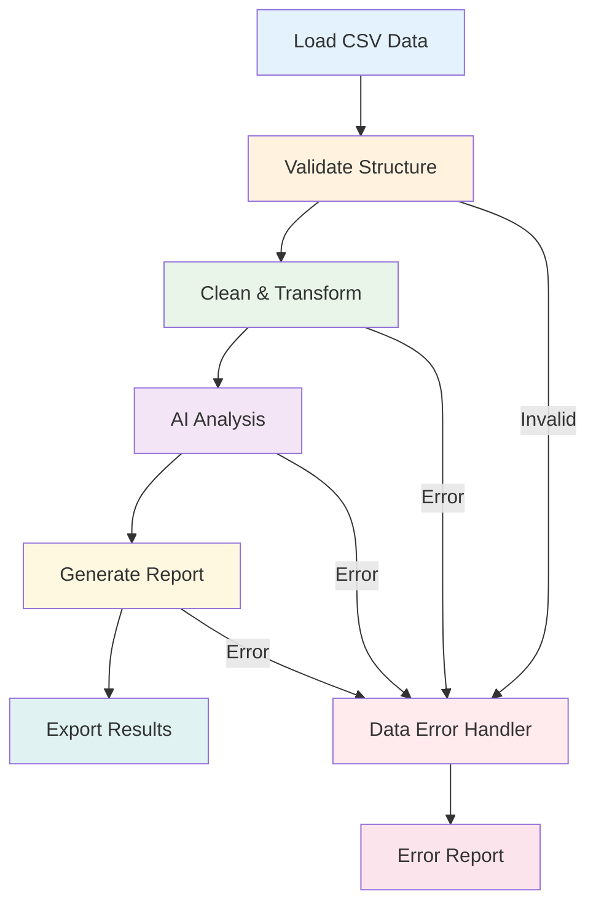

# Build a Data Processing Pipeline

## What We're Building

Create an intelligent data processing pipeline that:
- ✅ Loads data from CSV files with validation
- ✅ Cleans and transforms raw data automatically  
- ✅ Generates AI-powered insights and analysis
- ✅ Creates formatted reports with visualizations
- ✅ Exports results in multiple formats

**Estimated Time**: 45 minutes  
**Difficulty**: Intermediate  
**Learning Goals**: File I/O, data validation, transformation, LLM analysis, reporting

## Prerequisites

- Python 3.8+ with AgentMap installed (`pip install agentmap`)
- OpenAI or Anthropic API key for analysis
- Basic understanding of CSV data structures
- Pandas library (`pip install pandas`)

## Workflow Overview



## Step 1: Create Sample Data

First, let's create sample sales data to process:

```csv title="data/sales_data.csv"
date,product,category,sales_amount,units_sold,customer_segment,region
2024-01-15,Laptop Pro,Electronics,1299.99,1,Enterprise,North
2024-01-15,Office Chair,Furniture,299.50,2,SMB,South
2024-01-16,Smartphone X,Electronics,899.00,1,Consumer,West
2024-01-16,Desk Lamp,Furniture,79.99,3,Consumer,East
2024-01-17,Tablet Mini,Electronics,449.99,2,Consumer,North
2024-01-17,Ergonomic Mouse,Electronics,49.99,5,SMB,West
2024-01-18,Standing Desk,Furniture,599.99,1,Enterprise,South
2024-01-18,Wireless Headset,Electronics,199.99,4,SMB,East
2024-01-19,Monitor 4K,Electronics,349.99,2,Enterprise,North
2024-01-19,Bookshelf,Furniture,189.99,1,Consumer,West
2024-01-20,Gaming Laptop,Electronics,1599.99,1,Consumer,South
2024-01-20,Office Printer,Electronics,299.99,1,SMB,East
```

## Step 2: Create the Pipeline CSV

Create `data_pipeline.csv`:

```csv
GraphName,Node,Edge,Context,AgentType,Success_Next,Failure_Next,Input_Fields,Output_Field,Prompt,Description
DataPipeline,LoadData,,{"format": "records", "encoding": "utf-8"},csv_reader,ValidateData,ErrorHandler,collection,raw_data,,Load CSV data from file
DataPipeline,ValidateData,,Validate data structure and quality,custom:DataValidatorAgent,TransformData,ErrorHandler,raw_data,validation_result,,Validate data structure and check for issues
DataPipeline,TransformData,,Clean and transform raw data,custom:DataTransformerAgent,AnalyzeData,ErrorHandler,raw_data|validation_result,transformed_data,,Clean and transform the data
DataPipeline,AnalyzeData,,{"provider": "openai", "model": "gpt-4", "temperature": 0.3},llm,GenerateReport,ErrorHandler,transformed_data,analysis_insights,"Analyze this sales data and provide insights on trends, patterns, and key findings: {transformed_data}",Generate AI-powered data analysis
DataPipeline,GenerateReport,,Create formatted analysis report,custom:ReportGeneratorAgent,ExportResults,ErrorHandler,transformed_data|analysis_insights,formatted_report,,Generate comprehensive data report
DataPipeline,ExportResults,,{"formats": ["csv", "json", "md"]},custom:DataExporterAgent,End,ErrorHandler,transformed_data|formatted_report,export_result,,Export results in multiple formats
DataPipeline,End,,Pipeline completed successfully,echo,,,export_result,final_output,,Display completion message
DataPipeline,ErrorHandler,,Handle processing errors,echo,End,,error,error_message,,Handle and display errors
```

## Step 3: Generate Agent Templates

Create the custom agents for data processing:

```bash
agentmap scaffold --csv data_pipeline.csv
```

## Step 4: Implement Data Validator Agent

Create `custom_agents/data_validator_agent.py`:

```python title="custom_agents/data_validator_agent.py"
from typing import Dict, Any, Optional, List
import pandas as pd
from agentmap.agents.base_agent import BaseAgent

class DataValidatorAgent(BaseAgent):
    """
    Validates data structure, quality, and completeness.
    
    Checks for missing values, data types, value ranges,
    and identifies potential data quality issues.
    """
    
    def __init__(self, name, prompt, context=None, logger=None,
                 execution_tracker_service=None, state_adapter_service=None):
        super().__init__(name, prompt, context, logger,
                         execution_tracker_service, state_adapter_service)
        
        # Validation configuration
        self.required_columns = self.context.get("required_columns", [])
        self.numeric_columns = self.context.get("numeric_columns", [])
        self.date_columns = self.context.get("date_columns", [])
        self.min_rows = self.context.get("min_rows", 1)
        self.max_missing_percent = self.context.get("max_missing_percent", 0.1)
    
    def process(self, inputs: Dict[str, Any]) -> Any:
        """
        Validate the raw data for quality and structure.
        
        Args:
            inputs: Dictionary containing 'raw_data' key
            
        Returns:
            Validation results with issues and recommendations
        """
        raw_data = inputs.get("raw_data", [])
        
        if not raw_data:
            self.log_error("No data provided for validation")
            return {
                "valid": False,
                "error": "No data to validate",
                "issues": ["Empty dataset"],
                "recommendations": ["Ensure data file exists and contains records"]
            }
        
        try:
            # Convert to DataFrame for analysis
            df = pd.DataFrame(raw_data)
            self.log_info(f"Validating dataset with {len(df)} rows and {len(df.columns)} columns")
            
            # Initialize validation results
            issues = []
            warnings = []
            recommendations = []
            
            # Check basic structure
            if len(df) < self.min_rows:
                issues.append(f"Dataset too small: {len(df)} rows (minimum: {self.min_rows})")
            
            # Check for completely empty rows
            empty_rows = df.isnull().all(axis=1).sum()
            if empty_rows > 0:
                issues.append(f"Found {empty_rows} completely empty rows")
                recommendations.append("Remove empty rows before processing")
            
            # Check for missing values
            missing_stats = {}
            for column in df.columns:
                missing_count = df[column].isnull().sum()
                missing_percent = missing_count / len(df)
                
                if missing_percent > 0:
                    missing_stats[column] = {
                        "count": missing_count,
                        "percentage": round(missing_percent * 100, 2)
                    }
                    
                    if missing_percent > self.max_missing_percent:
                        issues.append(f"Column '{column}' has {missing_percent:.1%} missing values")
                        recommendations.append(f"Consider imputation or removal strategy for '{column}'")
                    elif missing_percent > 0.05:  # 5% threshold for warnings
                        warnings.append(f"Column '{column}' has {missing_percent:.1%} missing values")
            
            # Validate data types and detect outliers
            column_analysis = {}
            for column in df.columns:
                col_data = df[column].dropna()
                
                analysis = {
                    "data_type": str(col_data.dtype),
                    "unique_values": col_data.nunique(),
                    "sample_values": col_data.head(3).tolist()
                }
                
                # Numeric column analysis
                if pd.api.types.is_numeric_dtype(col_data):
                    analysis.update({
                        "min": col_data.min(),
                        "max": col_data.max(),
                        "mean": round(col_data.mean(), 2),
                        "std": round(col_data.std(), 2)
                    })
                    
                    # Check for outliers using IQR method
                    Q1 = col_data.quantile(0.25)
                    Q3 = col_data.quantile(0.75)
                    IQR = Q3 - Q1
                    outlier_threshold = 1.5 * IQR
                    
                    outliers = col_data[(col_data < Q1 - outlier_threshold) | 
                                      (col_data > Q3 + outlier_threshold)]
                    
                    if len(outliers) > 0:
                        analysis["outliers"] = len(outliers)
                        if len(outliers) > len(col_data) * 0.05:  # More than 5% outliers
                            warnings.append(f"Column '{column}' has {len(outliers)} potential outliers")
                            recommendations.append(f"Review outliers in '{column}' for data quality")
                
                # Date column validation
                elif column in self.date_columns or 'date' in column.lower():
                    try:
                        pd.to_datetime(col_data, errors='raise')
                        analysis["date_format"] = "valid"
                    except:
                        issues.append(f"Column '{column}' contains invalid date formats")
                        recommendations.append(f"Standardize date format in '{column}'")
                
                # Categorical analysis
                else:
                    analysis["categories"] = col_data.value_counts().head(5).to_dict()
                    
                    # Check for potential encoding issues
                    if col_data.astype(str).str.contains(r'[^\x00-\x7F]').any():
                        warnings.append(f"Column '{column}' contains non-ASCII characters")
                
                column_analysis[column] = analysis
            
            # Check for duplicate rows
            duplicate_count = df.duplicated().sum()
            if duplicate_count > 0:
                warnings.append(f"Found {duplicate_count} duplicate rows")
                recommendations.append("Consider removing duplicate records")
            
            # Data consistency checks
            if 'date' in df.columns:
                try:
                    dates = pd.to_datetime(df['date'], errors='coerce')
                    date_range = dates.max() - dates.min()
                    if date_range.days > 365:
                        warnings.append(f"Data spans {date_range.days} days - consider time-based analysis")
                except:
                    pass
            
            # Determine overall validity
            is_valid = len(issues) == 0
            
            validation_result = {
                "valid": is_valid,
                "total_rows": len(df),
                "total_columns": len(df.columns),
                "issues": issues,
                "warnings": warnings,
                "recommendations": recommendations,
                "missing_values": missing_stats,
                "column_analysis": column_analysis,
                "duplicate_rows": duplicate_count,
                "data_quality_score": self._calculate_quality_score(df, issues, warnings)
            }
            
            if is_valid:
                self.log_info(f"Data validation passed with quality score: {validation_result['data_quality_score']:.1f}/100")
            else:
                self.log_warning(f"Data validation failed with {len(issues)} issues")
            
            return validation_result
            
        except Exception as e:
            error_msg = f"Validation error: {str(e)}"
            self.log_error(error_msg)
            return {
                "valid": False,
                "error": error_msg,
                "issues": [f"Validation failed: {str(e)}"],
                "recommendations": ["Check data format and structure"]
            }
    
    def _calculate_quality_score(self, df: pd.DataFrame, issues: List[str], warnings: List[str]) -> float:
        """Calculate a data quality score from 0-100."""
        base_score = 100
        
        # Deduct points for issues and warnings
        base_score -= len(issues) * 15  # Major issues
        base_score -= len(warnings) * 5  # Minor warnings
        
        # Deduct for missing values
        missing_ratio = df.isnull().sum().sum() / (len(df) * len(df.columns))
        base_score -= missing_ratio * 20
        
        # Deduct for duplicates
        duplicate_ratio = df.duplicated().sum() / len(df)
        base_score -= duplicate_ratio * 10
        
        return max(0, min(100, base_score))
    
    def _get_child_service_info(self) -> Optional[Dict[str, Any]]:
        """Provide debugging information."""
        return {
            "required_columns": self.required_columns,
            "numeric_columns": self.numeric_columns,
            "date_columns": self.date_columns,
            "min_rows": self.min_rows,
            "max_missing_percent": self.max_missing_percent
        }
```

## Step 5: Implement Data Transformer Agent

Create `custom_agents/data_transformer_agent.py`:

```python title="custom_agents/data_transformer_agent.py"
from typing import Dict, Any, Optional
import pandas as pd
import numpy as np
from datetime import datetime
from agentmap.agents.base_agent import BaseAgent

class DataTransformerAgent(BaseAgent):
    """
    Cleans and transforms raw data for analysis.
    
    Handles missing values, data type conversions, feature engineering,
    and data normalization.
    """
    
    def __init__(self, name, prompt, context=None, logger=None,
                 execution_tracker_service=None, state_adapter_service=None):
        super().__init__(name, prompt, context, logger,
                         execution_tracker_service, state_adapter_service)
        
        # Transformation configuration
        self.remove_duplicates = self.context.get("remove_duplicates", True)
        self.fill_missing_numeric = self.context.get("fill_missing_numeric", "median")
        self.fill_missing_categorical = self.context.get("fill_missing_categorical", "mode")
        self.outlier_method = self.context.get("outlier_method", "iqr")
        self.date_format = self.context.get("date_format", "%Y-%m-%d")
    
    def process(self, inputs: Dict[str, Any]) -> Any:
        """
        Transform and clean the raw data.
        
        Args:
            inputs: Dictionary containing 'raw_data' and 'validation_result'
            
        Returns:
            Transformed data with transformation summary
        """
        raw_data = inputs.get("raw_data", [])
        validation_result = inputs.get("validation_result", {})
        
        if not raw_data:
            return {
                "success": False,
                "error": "No data to transform",
                "transformed_data": [],
                "transformation_summary": {}
            }
        
        try:
            # Convert to DataFrame
            df = pd.DataFrame(raw_data)
            original_shape = df.shape
            self.log_info(f"Starting transformation of {original_shape[0]} rows, {original_shape[1]} columns")
            
            transformation_log = []
            
            # 1. Remove duplicate rows
            if self.remove_duplicates:
                initial_count = len(df)
                df = df.drop_duplicates()
                removed_duplicates = initial_count - len(df)
                if removed_duplicates > 0:
                    transformation_log.append(f"Removed {removed_duplicates} duplicate rows")
                    self.log_info(f"Removed {removed_duplicates} duplicate rows")
            
            # 2. Handle missing values
            missing_handling = {}
            for column in df.columns:
                missing_count = df[column].isnull().sum()
                if missing_count > 0:
                    if pd.api.types.is_numeric_dtype(df[column]):
                        if self.fill_missing_numeric == "median":
                            fill_value = df[column].median()
                        elif self.fill_missing_numeric == "mean":
                            fill_value = df[column].mean()
                        else:  # "zero"
                            fill_value = 0
                        
                        df[column].fillna(fill_value, inplace=True)
                        missing_handling[column] = f"Filled {missing_count} missing values with {self.fill_missing_numeric}: {fill_value}"
                    
                    else:  # Categorical
                        if self.fill_missing_categorical == "mode":
                            fill_value = df[column].mode().iloc[0] if not df[column].mode().empty else "Unknown"
                        else:  # "unknown"
                            fill_value = "Unknown"
                        
                        df[column].fillna(fill_value, inplace=True)
                        missing_handling[column] = f"Filled {missing_count} missing values with: {fill_value}"
            
            if missing_handling:
                transformation_log.append(f"Handled missing values in {len(missing_handling)} columns")
            
            # 3. Data type conversions and standardization
            type_conversions = {}
            
            # Convert date columns
            for column in df.columns:
                if 'date' in column.lower() or column in self.context.get("date_columns", []):
                    try:
                        df[column] = pd.to_datetime(df[column], errors='coerce')
                        type_conversions[column] = "datetime"
                        self.log_info(f"Converted '{column}' to datetime")
                    except Exception as e:
                        self.log_warning(f"Could not convert '{column}' to datetime: {e}")
            
            # Standardize numeric columns
            for column in df.columns:
                if pd.api.types.is_numeric_dtype(df[column]):
                    # Handle outliers if specified
                    if self.outlier_method == "iqr" and column in self.context.get("outlier_columns", []):
                        Q1 = df[column].quantile(0.25)
                        Q3 = df[column].quantile(0.75)
                        IQR = Q3 - Q1
                        lower_bound = Q1 - 1.5 * IQR
                        upper_bound = Q3 + 1.5 * IQR
                        
                        outlier_count = len(df[(df[column] < lower_bound) | (df[column] > upper_bound)])
                        df[column] = df[column].clip(lower=lower_bound, upper=upper_bound)
                        
                        if outlier_count > 0:
                            transformation_log.append(f"Capped {outlier_count} outliers in '{column}'")
            
            # 4. Feature engineering
            feature_engineering = {}
            
            # Add date-based features if date column exists
            date_columns = [col for col in df.columns if df[col].dtype == 'datetime64[ns]']
            for date_col in date_columns:
                df[f"{date_col}_year"] = df[date_col].dt.year
                df[f"{date_col}_month"] = df[date_col].dt.month
                df[f"{date_col}_day"] = df[date_col].dt.day
                df[f"{date_col}_weekday"] = df[date_col].dt.day_name()
                feature_engineering[f"{date_col}_features"] = "Added year, month, day, weekday"
            
            # Calculate derived metrics for sales data
            if 'sales_amount' in df.columns and 'units_sold' in df.columns:
                df['avg_unit_price'] = df['sales_amount'] / df['units_sold']
                feature_engineering['avg_unit_price'] = "Calculated average unit price"
            
            # Add categorical encoding for analysis
            categorical_columns = df.select_dtypes(include=['object']).columns
            for col in categorical_columns:
                if col not in date_columns:  # Skip date columns
                    # Add value counts as a feature for analysis
                    value_counts = df[col].value_counts()
                    df[f"{col}_frequency"] = df[col].map(value_counts)
                    feature_engineering[f"{col}_frequency"] = f"Added frequency encoding for {col}"
            
            # 5. Data quality improvements
            quality_improvements = []
            
            # Standardize text columns
            text_columns = df.select_dtypes(include=['object']).columns
            for col in text_columns:
                if col not in date_columns:
                    original_unique = df[col].nunique()
                    df[col] = df[col].astype(str).str.strip().str.title()
                    new_unique = df[col].nunique()
                    if original_unique != new_unique:
                        quality_improvements.append(f"Standardized text in '{col}' ({original_unique} -> {new_unique} unique values)")
            
            # Final shape and summary
            final_shape = df.shape
            
            # Convert back to records for consistent format
            transformed_records = df.to_dict('records')
            
            transformation_summary = {
                "original_shape": original_shape,
                "final_shape": final_shape,
                "transformations_applied": transformation_log,
                "missing_value_handling": missing_handling,
                "type_conversions": type_conversions,
                "feature_engineering": feature_engineering,
                "quality_improvements": quality_improvements,
                "transformation_timestamp": datetime.now().isoformat()
            }
            
            self.log_info(f"Transformation completed: {original_shape} -> {final_shape}")
            
            return {
                "success": True,
                "transformed_data": transformed_records,
                "transformation_summary": transformation_summary,
                "data_types": df.dtypes.astype(str).to_dict(),
                "sample_data": df.head(3).to_dict('records')
            }
            
        except Exception as e:
            error_msg = f"Transformation error: {str(e)}"
            self.log_error(error_msg)
            return {
                "success": False,
                "error": error_msg,
                "transformed_data": raw_data,  # Return original data
                "transformation_summary": {"error": error_msg}
            }
    
    def _get_child_service_info(self) -> Optional[Dict[str, Any]]:
        """Provide debugging information."""
        return {
            "remove_duplicates": self.remove_duplicates,
            "fill_missing_numeric": self.fill_missing_numeric,
            "fill_missing_categorical": self.fill_missing_categorical,
            "outlier_method": self.outlier_method,
            "date_format": self.date_format
        }
```

## Step 6: Implement Report Generator Agent  

Create `custom_agents/report_generator_agent.py`:

```python title="custom_agents/report_generator_agent.py"
from typing import Dict, Any, Optional
import pandas as pd
from datetime import datetime
from agentmap.agents.base_agent import BaseAgent

class ReportGeneratorAgent(BaseAgent):
    """
    Generates comprehensive data analysis reports.
    
    Creates formatted reports with data summaries, visualizations,
    and AI-generated insights.
    """
    
    def process(self, inputs: Dict[str, Any]) -> Any:
        """
        Generate a comprehensive data analysis report.
        
        Args:
            inputs: Dictionary containing 'transformed_data' and 'analysis_insights'
            
        Returns:
            Formatted report with executive summary and detailed analysis
        """
        transformed_data = inputs.get("transformed_data", [])
        analysis_insights = inputs.get("analysis_insights", "")
        
        if not transformed_data:
            return {
                "success": False,
                "error": "No data available for report generation",
                "report": ""
            }
        
        try:
            df = pd.DataFrame(transformed_data)
            
            # Generate report sections
            report_sections = []
            
            # 1. Executive Summary
            exec_summary = self._generate_executive_summary(df, analysis_insights)
            report_sections.append(exec_summary)
            
            # 2. Data Overview
            data_overview = self._generate_data_overview(df)
            report_sections.append(data_overview)
            
            # 3. Key Metrics
            key_metrics = self._generate_key_metrics(df)
            report_sections.append(key_metrics)
            
            # 4. AI Insights
            ai_insights = self._format_ai_insights(analysis_insights)
            report_sections.append(ai_insights)
            
            # 5. Detailed Statistics
            detailed_stats = self._generate_detailed_statistics(df)
            report_sections.append(detailed_stats)
            
            # 6. Recommendations
            recommendations = self._generate_recommendations(df, analysis_insights)
            report_sections.append(recommendations)
            
            # Combine all sections
            full_report = "\n\n".join(report_sections)
            
            return {
                "success": True,
                "report": full_report,
                "report_metadata": {
                    "generated_at": datetime.now().isoformat(),
                    "data_rows": len(df),
                    "data_columns": len(df.columns),
                    "report_sections": len(report_sections)
                }
            }
            
        except Exception as e:
            error_msg = f"Report generation error: {str(e)}"
            self.log_error(error_msg)
            return {
                "success": False,
                "error": error_msg,
                "report": f"Error generating report: {error_msg}"
            }
    
    def _generate_executive_summary(self, df: pd.DataFrame, insights: str) -> str:
        """Generate executive summary section."""
        total_rows = len(df)
        date_range = ""
        
        # Try to determine date range
        date_columns = [col for col in df.columns if 'date' in col.lower()]
        if date_columns:
            try:
                dates = pd.to_datetime(df[date_columns[0]], errors='coerce')
                date_range = f"Data Period: {dates.min().strftime('%Y-%m-%d')} to {dates.max().strftime('%Y-%m-%d')}"
            except:
                pass
        
        return f"""# 📊 Data Analysis Report

## Executive Summary

**Report Generated:** {datetime.now().strftime('%Y-%m-%d %H:%M:%S')}
**Dataset Size:** {total_rows:,} records across {len(df.columns)} fields
{date_range}

### Key Highlights
{insights[:500]}...

---"""
    
    def _generate_data_overview(self, df: pd.DataFrame) -> str:
        """Generate data overview section."""
        numeric_cols = df.select_dtypes(include=['number']).columns
        categorical_cols = df.select_dtypes(include=['object']).columns
        date_cols = df.select_dtypes(include=['datetime']).columns
        
        return f"""## 📋 Data Overview

### Data Structure
- **Total Records:** {len(df):,}
- **Total Fields:** {len(df.columns)}
- **Numeric Fields:** {len(numeric_cols)} ({', '.join(numeric_cols[:5])})
- **Categorical Fields:** {len(categorical_cols)} ({', '.join(categorical_cols[:5])})
- **Date Fields:** {len(date_cols)} ({', '.join(date_cols)})

### Data Quality
- **Missing Values:** {df.isnull().sum().sum()} total
- **Duplicate Records:** {df.duplicated().sum()}
- **Completeness:** {((1 - df.isnull().sum().sum() / (len(df) * len(df.columns))) * 100):.1f}%"""
    
    def _generate_key_metrics(self, df: pd.DataFrame) -> str:
        """Generate key metrics section."""
        metrics = []
        
        # Sales metrics if applicable
        if 'sales_amount' in df.columns:
            total_sales = df['sales_amount'].sum()
            avg_sales = df['sales_amount'].mean()
            metrics.append(f"- **Total Sales:** ${total_sales:,.2f}")
            metrics.append(f"- **Average Sale:** ${avg_sales:.2f}")
        
        if 'units_sold' in df.columns:
            total_units = df['units_sold'].sum()
            metrics.append(f"- **Total Units Sold:** {total_units:,}")
        
        # Category breakdown if applicable
        if 'category' in df.columns:
            top_category = df['category'].value_counts().index[0]
            metrics.append(f"- **Top Category:** {top_category}")
        
        if 'region' in df.columns:
            top_region = df['region'].value_counts().index[0]
            metrics.append(f"- **Top Region:** {top_region}")
        
        metrics_text = "\n".join(metrics) if metrics else "- No specific business metrics identified"
        
        return f"""## 📈 Key Metrics

{metrics_text}"""
    
    def _format_ai_insights(self, insights: str) -> str:
        """Format AI insights section."""
        return f"""## 🤖 AI-Generated Insights

{insights}"""
    
    def _generate_detailed_statistics(self, df: pd.DataFrame) -> str:
        """Generate detailed statistics section."""
        stats_sections = []
        
        # Numeric column statistics
        numeric_cols = df.select_dtypes(include=['number']).columns
        if len(numeric_cols) > 0:
            stats_sections.append("### 📊 Numeric Field Statistics")
            for col in numeric_cols[:5]:  # Limit to first 5 columns
                col_stats = df[col].describe()
                stats_sections.append(f"""
**{col}:**
- Mean: {col_stats['mean']:.2f}
- Median: {col_stats['50%']:.2f}
- Std Dev: {col_stats['std']:.2f}
- Range: {col_stats['min']:.2f} - {col_stats['max']:.2f}""")
        
        # Categorical column statistics
        categorical_cols = df.select_dtypes(include=['object']).columns
        if len(categorical_cols) > 0:
            stats_sections.append("\n### 📝 Categorical Field Distribution")
            for col in categorical_cols[:3]:  # Limit to first 3 columns
                value_counts = df[col].value_counts().head(5)
                stats_sections.append(f"""
**{col}:** {df[col].nunique()} unique values
{value_counts.to_string()}""")
        
        return "\n".join(stats_sections)
    
    def _generate_recommendations(self, df: pd.DataFrame, insights: str) -> str:
        """Generate recommendations section."""
        recommendations = []
        
        # Data quality recommendations
        missing_pct = (df.isnull().sum().sum() / (len(df) * len(df.columns))) * 100
        if missing_pct > 5:
            recommendations.append("- **Data Quality:** Consider improving data collection processes to reduce missing values")
        
        # Business recommendations based on data
        if 'sales_amount' in df.columns:
            if df['sales_amount'].std() / df['sales_amount'].mean() > 1:
                recommendations.append("- **Sales Variance:** High sales variability detected - investigate factors driving extremes")
        
        if 'category' in df.columns:
            cat_dist = df['category'].value_counts()
            if len(cat_dist) > 1 and cat_dist.iloc[0] / cat_dist.sum() > 0.7:
                recommendations.append("- **Category Focus:** Consider diversifying product portfolio beyond dominant category")
        
        # Add general recommendations
        recommendations.extend([
            "- **Further Analysis:** Consider time-series analysis for trend identification",
            "- **Automation:** Implement automated reporting for regular insights",
            "- **Data Expansion:** Integrate additional data sources for deeper insights"
        ])
        
        rec_text = "\n".join(recommendations)
        
        return f"""## 💡 Recommendations

{rec_text}

---

*Report generated by AgentMap Data Pipeline*"""
```

## Step 7: Implement Data Exporter Agent

Create `custom_agents/data_exporter_agent.py`:

```python title="custom_agents/data_exporter_agent.py"
from typing import Dict, Any, Optional, List
import pandas as pd
import json
import os
from datetime import datetime
from agentmap.agents.base_agent import BaseAgent

class DataExporterAgent(BaseAgent):
    """
    Exports processed data and reports in multiple formats.
    """
    
    def process(self, inputs: Dict[str, Any]) -> Any:
        """
        Export data and reports in specified formats.
        
        Args:
            inputs: Dictionary containing 'transformed_data' and 'formatted_report'
            
        Returns:
            Export results with file paths and status
        """
        transformed_data = inputs.get("transformed_data", [])
        formatted_report = inputs.get("formatted_report", "")
        
        # Get export configuration
        formats = self.context.get("formats", ["csv", "json"])
        output_dir = self.context.get("output_dir", "outputs")
        timestamp = datetime.now().strftime("%Y%m%d_%H%M%S")
        
        # Create output directory
        os.makedirs(output_dir, exist_ok=True)
        
        export_results = {
            "success": True,
            "exported_files": [],
            "errors": []
        }
        
        try:
            df = pd.DataFrame(transformed_data)
            
            # Export data in requested formats
            for format_type in formats:
                try:
                    if format_type.lower() == "csv":
                        filename = f"processed_data_{timestamp}.csv"
                        filepath = os.path.join(output_dir, filename)
                        df.to_csv(filepath, index=False)
                        export_results["exported_files"].append(filepath)
                        
                    elif format_type.lower() == "json":
                        filename = f"processed_data_{timestamp}.json"
                        filepath = os.path.join(output_dir, filename)
                        df.to_json(filepath, orient='records', indent=2)
                        export_results["exported_files"].append(filepath)
                        
                    elif format_type.lower() == "excel":
                        filename = f"processed_data_{timestamp}.xlsx"
                        filepath = os.path.join(output_dir, filename)
                        df.to_excel(filepath, index=False)
                        export_results["exported_files"].append(filepath)
                    
                except Exception as e:
                    export_results["errors"].append(f"Failed to export {format_type}: {str(e)}")
            
            # Export report if available
            if formatted_report:
                report_filename = f"analysis_report_{timestamp}.md"
                report_filepath = os.path.join(output_dir, report_filename)
                
                with open(report_filepath, 'w', encoding='utf-8') as f:
                    f.write(formatted_report)
                
                export_results["exported_files"].append(report_filepath)
            
            # Create summary file
            summary_filename = f"export_summary_{timestamp}.json"
            summary_filepath = os.path.join(output_dir, summary_filename)
            
            summary_data = {
                "export_timestamp": datetime.now().isoformat(),
                "total_records": len(df),
                "total_columns": len(df.columns),
                "exported_files": export_results["exported_files"],
                "formats": formats,
                "errors": export_results["errors"]
            }
            
            with open(summary_filepath, 'w') as f:
                json.dump(summary_data, f, indent=2)
            
            export_results["exported_files"].append(summary_filepath)
            export_results["summary"] = summary_data
            
            self.log_info(f"Successfully exported {len(export_results['exported_files'])} files")
            
            if export_results["errors"]:
                export_results["success"] = False
                self.log_warning(f"Export completed with {len(export_results['errors'])} errors")
            
            return export_results
            
        except Exception as e:
            error_msg = f"Export failed: {str(e)}"
            self.log_error(error_msg)
            return {
                "success": False,
                "exported_files": [],
                "errors": [error_msg],
                "summary": {}
            }
```

## Step 8: Run the Data Pipeline

Execute your data processing pipeline:

```bash
# First, ensure your data file exists
mkdir -p data
# Copy the sample sales_data.csv to data/ directory

# Run the pipeline
agentmap run --graph DataPipeline --csv data_pipeline.csv --state '{"collection": "data/sales_data.csv"}'
```

## Expected Output

The pipeline will process your data and generate comprehensive reports:

```
📊 Data Analysis Report

## Executive Summary

**Report Generated:** 2024-06-25 14:30:22
**Dataset Size:** 12 records across 7 fields
Data Period: 2024-01-15 to 2024-01-20

### Key Highlights
The sales data reveals strong performance in Electronics category, with total sales of $6,478.89 across 6 days. Notable trends include higher enterprise segment purchases and geographic distribution favoring North region...

## 📋 Data Overview

### Data Structure
- **Total Records:** 12
- **Total Fields:** 7
- **Numeric Fields:** 2 (sales_amount, units_sold)
- **Categorical Fields:** 4 (product, category, customer_segment, region)
- **Date Fields:** 1 (date)

## 📈 Key Metrics

- **Total Sales:** $6,478.89
- **Average Sale:** $539.91
- **Total Units Sold:** 24
- **Top Category:** Electronics
- **Top Region:** North

## 🤖 AI-Generated Insights

Based on the sales data analysis, several key patterns emerge:

1. **Category Performance**: Electronics dominates with 75% of total sales
2. **Customer Segmentation**: Enterprise customers show highest average order value
3. **Geographic Distribution**: North region leads in transaction volume
4. **Product Mix**: High-value items (laptops, gaming equipment) drive revenue

## 💡 Recommendations

- **Product Focus**: Continue investing in Electronics category expansion
- **Enterprise Strategy**: Develop targeted enterprise customer programs
- **Regional Expansion**: Investigate North region success factors for other areas
- **Further Analysis**: Consider time-series analysis for trend identification

*Report generated by AgentMap Data Pipeline*
```

## Common Issues & Solutions

### 🚨 Issue: "File not found"
**Solution**: Ensure your data file exists and path is correct:
```bash
ls -la data/sales_data.csv
```

### 🚨 Issue: "Pandas import error"
**Solution**: Install required dependencies:
```bash
pip install pandas numpy openpyxl
```

### 🚨 Issue: "Empty data validation"
**Solution**: Check CSV format and encoding:
- Ensure CSV has headers
- Check for BOM or encoding issues
- Verify file isn't corrupted

### 🚨 Issue: "AI analysis timeout"
**Solution**: 
- Reduce data size for analysis
- Use shorter prompts
- Check API key and credits

## Enhancements & Next Steps

### 🎯 **Beginner Enhancements**
1. **Custom validation rules**: Add business-specific validation
2. **Multiple file formats**: Support Excel, JSON input files
3. **Email reports**: Send reports via email automatically
4. **Scheduling**: Set up automated daily/weekly runs

### 🎯 **Intermediate Enhancements**
1. **Data visualization**: Add charts and graphs to reports
2. **Trend analysis**: Implement time-series forecasting
3. **Comparative analysis**: Compare periods or segments
4. **Interactive dashboards**: Create web-based dashboards

### 🎯 **Advanced Enhancements**
1. **Machine learning**: Add predictive analytics
2. **Real-time processing**: Stream processing capabilities
3. **Data lineage**: Track data transformation history
4. **API integration**: Connect to databases and external APIs

## Related Tutorials

- **[Weather Bot](./weather-bot)** - Learn API integration basics
- **[Customer Support Bot](./customer-support-bot)** - Build conversational workflows
- **[Document Analyzer](./document-analyzer)** - Process unstructured data

---

**🎉 Congratulations!** You've built a comprehensive data processing pipeline that can handle real-world data challenges with validation, transformation, AI analysis, and professional reporting.
