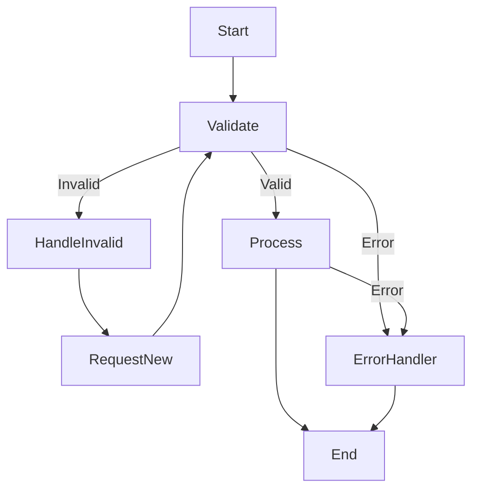

# Example Workflows

This document provides a comprehensive collection of AgentMap workflow patterns with downloadable examples, interactive demonstrations, and detailed explanations. Each workflow includes step-by-step breakdowns and troubleshooting guidance.

import Tabs from '@theme/Tabs';
import TabItem from '@theme/TabItem';
import CodeBlock from '@theme/CodeBlock';

:::tip Try the Interactive Playground
🎮 **Want to experiment with these workflows?** Use our [Interactive Playground](/docs/playground) to edit, test, and visualize these workflows in real-time!
:::

## Quick Reference

| Pattern | Complexity | Use Case | Key Features |
|---------|------------|----------|--------------|
| [Linear Workflow](#simple-linear-workflow) | ⭐ | Sequential processing | Error handling, basic flow |
| [Branching Workflow](#branching-workflow-with-error-handling) | ⭐⭐ | Conditional logic | Validation, error recovery |
| [Conversational Bot](#llm-chain-with-memory) | ⭐⭐⭐ | Chat applications | Memory, continuous interaction |
| [Document Processing](#document-processing-workflow) | ⭐⭐⭐ | File automation | PDF processing, summarization |
| [Data Pipeline](#data-processing-pipeline) | ⭐⭐⭐⭐ | Analytics workflows | CSV processing, analysis |
| [API Integration](#integration-with-external-services) | ⭐⭐⭐⭐ | Service integration | REST APIs, external data |
| [Parallel Processing](#parallel-processing-with-join) | ⭐⭐⭐⭐⭐ | High-performance | Concurrent execution, synchronization |

---

## Simple Linear Workflow

**Pattern**: Sequential node execution with basic error handling  
**Best For**: Learning AgentMap basics, simple automation tasks  
**Estimated Time**: 5 minutes to implement

### Overview

A basic workflow where nodes execute in sequence, perfect for understanding AgentMap fundamentals.

<Tabs>
<TabItem value="csv" label="CSV Workflow" default>

```csv title="workflows/linear_workflow.csv"
GraphName,Node,Edge,Context,AgentType,Success_Next,Failure_Next,Input_Fields,Output_Field,Prompt
LinearFlow,Start,,Starting node,echo,Process,ErrorHandler,input,initial_data,
LinearFlow,Process,,Processing node,default,End,ErrorHandler,initial_data,processed_data,Processing: {initial_data}
LinearFlow,End,,Final node,echo,,ErrorHandler,processed_data,final_output,
LinearFlow,ErrorHandler,,Handle errors,echo,,,error,error_message,Error occurred: {error}
```

</TabItem>
<TabItem value="step-by-step" label="Step-by-Step Guide">

### Implementation Steps

1. **Create the CSV file**: Save the above CSV as `linear_workflow.csv`
2. **Run the workflow**:
   ```bash
   agentmap run --graph LinearFlow --csv linear_workflow.csv
   ```
3. **Expected behavior**:
   - Input is echoed to `initial_data`
   - Data is processed and formatted
   - Final output is displayed
   - Errors are caught and handled

### Node Breakdown

- **Start**: Captures initial input using echo agent
- **Process**: Transforms data using default agent with template
- **End**: Outputs final result
- **ErrorHandler**: Catches any processing errors

</TabItem>
<TabItem value="troubleshooting" label="Troubleshooting">

### Common Issues

**Issue**: "Node not found" error  
**Solution**: Ensure all node names in Success_Next/Failure_Next match exactly

**Issue**: Empty output  
**Solution**: Check that Input_Fields reference existing data keys

**Issue**: Workflow stops unexpectedly  
**Solution**: Verify all nodes have proper Success_Next routing

### Debugging Tips

- Use `--log-level DEBUG` to see detailed execution
- Add echo agents to debug data flow
- Check state values between nodes

</TabItem>
</Tabs>

---

## Branching Workflow with Error Handling

**Pattern**: Conditional execution with comprehensive error recovery  
**Best For**: Validation workflows, quality control processes  
**Estimated Time**: 10 minutes to implement

### Overview

This workflow demonstrates conditional branching based on validation results, with robust error handling patterns.

<Tabs>
<TabItem value="csv" label="CSV Workflow" default>

```csv title="workflows/branching_workflow.csv"
GraphName,Node,Edge,Context,AgentType,Success_Next,Failure_Next,Input_Fields,Output_Field,Prompt
BranchFlow,Start,,Starting node,echo,Validate,ErrorHandler,input,initial_data,
BranchFlow,Validate,,{"validation_rules": ["required", "min_length:5"]},default,Process,HandleInvalid,initial_data,validation_result,Validating: {initial_data}
BranchFlow,Process,,Process valid data,default,End,ErrorHandler,initial_data,processed_data,Processing valid data: {initial_data}
BranchFlow,HandleInvalid,,Handle invalid input,default,RequestNew,ErrorHandler,initial_data,error_context,Invalid input: {initial_data}
BranchFlow,RequestNew,,Request new input,input,Validate,ErrorHandler,,new_input,Please provide valid input (min 5 characters):
BranchFlow,End,,Completion node,echo,,ErrorHandler,processed_data,final_output,
BranchFlow,ErrorHandler,,Handle system errors,echo,End,,error,error_message,System error: {error}
```

</TabItem>
<TabItem value="implementation" label="Implementation Guide">

### Advanced Features

1. **Custom Validation**: Add validation rules in Context field
2. **Recovery Loops**: Invalid input triggers re-entry
3. **Error Classification**: Separate handling for validation vs system errors

### Configuration Options

```yaml title="agentmap_config.yaml"
validation:
  rules:
    required: true
    min_length: 5
    max_length: 100
  retry_limit: 3
```

### Python Custom Validator

```python title="custom_agents/validator_agent.py"
from agentmap.agents.base_agent import BaseAgent

class ValidatorAgent(BaseAgent):
    def process(self, inputs):
        data = inputs.get("initial_data", "")
        rules = self.context.get("validation_rules", [])
        
        for rule in rules:
            if rule == "required" and not data:
                return {"valid": False, "error": "Required field missing"}
            if rule.startswith("min_length:"):
                min_len = int(rule.split(":")[1])
                if len(data) < min_len:
                    return {"valid": False, "error": f"Minimum length {min_len}"}
        
        return {"valid": True, "data": data}
```

</TabItem>
<TabItem value="testing" label="Testing Scenarios">

### Test Cases

1. **Valid Input**: "Hello World" → Should process successfully
2. **Empty Input**: "" → Should request new input
3. **Short Input**: "Hi" → Should trigger validation error
4. **System Error**: Malformed CSV → Should route to ErrorHandler

### Expected Flows



</TabItem>
</Tabs>

---

## LLM Chain with Memory

**Pattern**: Conversational AI with persistent memory  
**Best For**: Chatbots, interactive assistants, customer support  
**Estimated Time**: 15 minutes to implement

### Overview

A sophisticated conversational workflow that maintains context across multiple interactions using AgentMap's memory system.

<Tabs>
<TabItem value="csv" label="CSV Workflow" default>

```csv title="workflows/chat_workflow.csv"
GraphName,Node,Edge,Context,AgentType,Success_Next,Failure_Next,Input_Fields,Output_Field,Prompt
ChatFlow,UserInput,,{"memory_key":"chat_memory","max_memory_messages":10},input,Process,ErrorHandler,,user_message,💬 You: 
ChatFlow,Process,,{"preserve_context": true},echo,Respond,ErrorHandler,user_message|chat_memory,processed_input,
ChatFlow,Respond,,{"provider": "openai", "model": "gpt-4", "temperature": 0.7},llm,UpdateMemory,ErrorHandler,processed_input|chat_memory,ai_response,You are a helpful and friendly assistant. Previous conversation: {chat_memory}\n\nUser: {processed_input}
ChatFlow,UpdateMemory,,{"memory_key":"chat_memory","append_format":"User: {user_message}\nAssistant: {ai_response}"},memory,Format,ErrorHandler,user_message|ai_response|chat_memory,updated_memory,
ChatFlow,Format,,Format the response,default,UserInput,ErrorHandler,ai_response|updated_memory,formatted_response,🤖 Assistant: {ai_response}
ChatFlow,ErrorHandler,,Handle conversation errors,echo,UserInput,,error,error_message,❌ Error: {error}
```

</TabItem>
<TabItem value="features" label="Advanced Features">

### Memory Configuration

```yaml title="Memory settings in agentmap_config.yaml"
memory:
  chat_memory:
    type: "sliding_window"
    max_messages: 10
    include_system: false
    format: "User: {user}\nAssistant: {assistant}"
  
  long_term_memory:
    type: "vector_store"
    provider: "chroma"
    collection: "conversations"
```

### Enhanced Context Handling

```python title="Enhanced context preservation"
# In your agent implementation
class ConversationAgent(BaseAgent):
    def process(self, inputs):
        memory = inputs.get("chat_memory", [])
        current_input = inputs.get("user_message", "")
        
        # Extract context from memory
        context = self.extract_context(memory)
        
        # Generate contextual response
        response = self.generate_response(current_input, context)
        
        return response
```

### Personality Configuration

```csv title="Different personality configurations"
# Formal Assistant
ChatFlow,Respond,,{"provider": "openai", "temperature": 0.3},llm,UpdateMemory,ErrorHandler,processed_input|chat_memory,ai_response,You are a professional business assistant. Be formal and concise.

# Creative Assistant  
ChatFlow,Respond,,{"provider": "openai", "temperature": 0.9},llm,UpdateMemory,ErrorHandler,processed_input|chat_memory,ai_response,You are a creative writing assistant. Be imaginative and inspiring.

# Technical Assistant
ChatFlow,Respond,,{"provider": "openai", "temperature": 0.1},llm,UpdateMemory,ErrorHandler,processed_input|chat_memory,ai_response,You are a technical expert. Provide accurate, detailed technical explanations.
```

</TabItem>
<TabItem value="examples" label="Usage Examples">

### Example Conversations

**Business Assistant**:
```
You: What's the best way to structure a quarterly report?
🤖 Assistant: A quarterly report should include: Executive Summary, Financial Performance, Key Metrics, Market Analysis, and Future Outlook.

You: Can you elaborate on the Financial Performance section?
🤖 Assistant: The Financial Performance section should detail revenue growth, profit margins, cash flow analysis, and year-over-year comparisons with explanations for significant variances.
```

**Creative Assistant**:
```
You: Help me write a story about a robot discovering emotions
🤖 Assistant: Here's a beginning: "Circuit by circuit, X-47 felt something new coursing through its neural networks—not electricity, but something warmer, more complex..."

You: Continue that story
🤖 Assistant: Building on our robot X-47's emotional awakening: "The first emotion was curiosity. Why did the sunset's colors trigger cascading responses in its visual processors? Why did the child's laughter create harmonic resonances in its audio systems?"
```

### Integration Patterns

```csv title="Integration with external services"
# Add web search capability
ChatFlow,SearchWeb,,{"provider": "tavily", "max_results": 3},web_search,Respond,ErrorHandler,processed_input,search_results,

# Add knowledge base lookup
ChatFlow,QueryKB,,{"collection": "company_docs", "k": 5},vector_reader,Respond,ErrorHandler,processed_input,kb_results,

# Add image generation
ChatFlow,GenerateImage,,{"provider": "dalle", "size": "1024x1024"},image_generator,Respond,ErrorHandler,processed_input,generated_image,
```

</TabItem>
</Tabs>

---

## Document Processing Workflow

**Pattern**: Automated document analysis and summarization  
**Best For**: Content processing, research assistance, report generation  
**Estimated Time**: 20 minutes to implement

### Overview

A comprehensive workflow for processing documents with AI-powered analysis, supporting multiple file formats and output options.

<Tabs>
<TabItem value="csv" label="CSV Workflow" default>

```csv title="workflows/document_processor.csv"
GraphName,Node,Edge,Context,AgentType,Success_Next,Failure_Next,Input_Fields,Output_Field,Prompt
DocFlow,GetFile,,Get document path,input,ValidateFile,ErrorHandler,,file_path,📄 Enter the path to your document:
DocFlow,ValidateFile,,{"allowed_types": ["pdf", "docx", "txt", "md"]},file_validator,ReadFile,ErrorHandler,file_path,validation_result,
DocFlow,ReadFile,,{"should_split": true, "chunk_size": 1000, "overlap": 200},file_reader,ExtractMetadata,ErrorHandler,file_path,documents,
DocFlow,ExtractMetadata,,Extract document metadata,default,AnalyzeContent,ErrorHandler,documents,metadata,Extracting metadata from {documents}
DocFlow,AnalyzeContent,,{"provider": "anthropic", "model": "claude-3-sonnet-20240229", "temperature": 0.3},llm,GenerateSummary,ErrorHandler,documents|metadata,content_analysis,Analyze this document content for key themes, main arguments, and important information: {documents}
DocFlow,GenerateSummary,,{"provider": "openai", "model": "gpt-4", "temperature": 0.5},llm,CreateReport,ErrorHandler,documents|content_analysis,executive_summary,Create a comprehensive executive summary based on this analysis: {content_analysis}. Include key findings, recommendations, and action items.
DocFlow,CreateReport,,{"template": "document_report", "format": "markdown"},report_generator,SaveReport,ErrorHandler,executive_summary|content_analysis|metadata,formatted_report,
DocFlow,SaveReport,,{"output_dir": "outputs/reports", "timestamp": true},file_writer,NotifyComplete,ErrorHandler,formatted_report|file_path,save_result,
DocFlow,NotifyComplete,,Notify completion,echo,End,ErrorHandler,save_result,completion_message,✅ Document analysis complete! Report saved to: {save_result}
DocFlow,End,,Workflow complete,echo,,,completion_message,final_output,
DocFlow,ErrorHandler,,Handle processing errors,echo,End,,error,error_message,❌ Error processing document: {error}
```

</TabItem>
<TabItem value="customization" label="Customization Options">

### File Type Support

```python title="custom_agents/file_validator.py"
from agentmap.agents.base_agent import BaseAgent
import os

class FileValidatorAgent(BaseAgent):
    def process(self, inputs):
        file_path = inputs.get("file_path", "")
        allowed_types = self.context.get("allowed_types", ["pdf", "txt"])
        
        if not os.path.exists(file_path):
            return {"valid": False, "error": "File not found"}
        
        ext = os.path.splitext(file_path)[1].lower().lstrip('.')
        if ext not in allowed_types:
            return {"valid": False, "error": f"Unsupported file type: {ext}"}
        
        return {"valid": True, "file_type": ext, "size": os.path.getsize(file_path)}
```

### Custom Report Templates

```python title="templates/document_report.md"
# Document Analysis Report

**File**: {metadata.filename}  
**Date**: {metadata.analysis_date}  
**Size**: {metadata.file_size}  

## Executive Summary

{executive_summary}

## Detailed Analysis

{content_analysis}

## Key Findings

{findings}

## Recommendations

{recommendations}

---
*Generated by AgentMap Document Processor*
```

### Processing Configuration

```yaml title="Document processing settings"
document_processing:
  chunking:
    strategy: "semantic"  # or "fixed", "paragraph"
    chunk_size: 1000
    overlap: 200
    
  analysis:
    extract_entities: true
    sentiment_analysis: true
    topic_modeling: true
    
  output:
    formats: ["markdown", "pdf", "html"]
    include_source_refs: true
    generate_toc: true
```

</TabItem>
<TabItem value="examples" label="Real-World Examples">

### Example: Research Paper Analysis

**Input**: Scientific paper PDF  
**Output**: Structured analysis with methodology, findings, and implications

```markdown
# Research Paper Analysis: "AI in Healthcare"

## Executive Summary
This paper presents a comprehensive review of AI applications in healthcare, 
focusing on diagnostic imaging and patient outcome prediction. Key findings 
suggest 23% improvement in diagnostic accuracy when AI is integrated with 
traditional methods.

## Methodology
- Systematic literature review of 150 studies
- Meta-analysis of diagnostic performance metrics
- Case studies from 5 major hospitals

## Key Findings
1. **Diagnostic Accuracy**: AI-assisted diagnosis shows 92.3% accuracy vs 87.1% traditional
2. **Processing Speed**: 67% reduction in analysis time
3. **Cost Impact**: $2.3M annual savings per hospital
```

### Example: Business Document Processing

**Input**: Contract or proposal document  
**Output**: Risk analysis and recommendation summary

```markdown
# Contract Analysis: Software License Agreement

## Risk Assessment: Medium-High ⚠️

## Critical Issues Identified
1. **Liability Cap**: Set at $10K, recommend increasing to $100K
2. **Termination Clause**: 30-day notice insufficient for enterprise use
3. **Data Rights**: Unclear ownership of processed data

## Recommendations
- [ ] Negotiate higher liability limits
- [ ] Extend termination notice to 90 days
- [ ] Clarify data ownership and portability rights
```

### Batch Processing Setup

```csv title="workflows/batch_document_processor.csv"
# Process multiple documents in sequence
BatchDocFlow,GetDirectory,,Get directory of documents,input,ListFiles,ErrorHandler,,doc_directory,📁 Enter directory path:
BatchDocFlow,ListFiles,,{"pattern": "*.pdf,*.docx", "recursive": true},directory_scanner,ProcessNext,ErrorHandler,doc_directory,file_list,
BatchDocFlow,ProcessNext,,Process next document,iterator,AnalyzeDocument,Complete,file_list,current_file,
BatchDocFlow,AnalyzeDocument,,Process single document,subworkflow:DocFlow,ProcessNext,ErrorHandler,current_file,analysis_result,
BatchDocFlow,Complete,,All documents processed,summary,End,ErrorHandler,analysis_result,batch_summary,
```

</TabItem>
</Tabs>

---

## Data Processing Pipeline

**Pattern**: Extract, Transform, Load (ETL) workflows  
**Best For**: Business intelligence, data analytics, reporting automation  
**Estimated Time**: 25 minutes to implement

### Overview

A sophisticated data processing pipeline that handles CSV data extraction, transformation, analysis, and automated reporting.

<Tabs>
<TabItem value="csv" label="CSV Workflow" default>

```csv title="workflows/data_pipeline.csv"
GraphName,Node,Edge,Context,AgentType,Success_Next,Failure_Next,Input_Fields,Output_Field,Prompt
DataFlow,LoadData,,{"file_type": "csv", "headers": true, "encoding": "utf-8"},file_reader,ValidateSchema,ErrorHandler,file_path,raw_data,
DataFlow,ValidateSchema,,{"required_columns": ["id", "date", "value"], "data_types": {"id": "int", "value": "float"}},schema_validator,CleanData,ErrorHandler,raw_data,validation_result,
DataFlow,CleanData,,{"operations": ["remove_nulls", "standardize_dates", "normalize_values"]},data_cleaner,TransformData,ErrorHandler,raw_data,clean_data,
DataFlow,TransformData,,{"aggregations": ["sum", "mean", "count"], "group_by": ["category", "date"]},data_transformer,AnalyzeData,ErrorHandler,clean_data,transformed_data,
DataFlow,AnalyzeData,,{"provider": "openai", "model": "gpt-4", "temperature": 0.2},llm,GenerateInsights,ErrorHandler,transformed_data,statistical_analysis,Analyze this dataset and provide statistical insights, trends, and anomalies: {transformed_data}
DataFlow,GenerateInsights,,{"provider": "anthropic", "model": "claude-3-sonnet-20240229", "temperature": 0.4},llm,CreateVisualizations,ErrorHandler,statistical_analysis|transformed_data,business_insights,Based on this statistical analysis: {statistical_analysis}, generate actionable business insights and recommendations for the data: {transformed_data}
DataFlow,CreateVisualizations,,{"chart_types": ["line", "bar", "scatter"], "output_format": "png"},chart_generator,GenerateReport,ErrorHandler,transformed_data|business_insights,charts,
DataFlow,GenerateReport,,{"template": "business_report", "include_charts": true},report_generator,SaveResults,ErrorHandler,business_insights|statistical_analysis|charts,final_report,
DataFlow,SaveResults,,{"formats": ["csv", "excel", "pdf"], "output_dir": "outputs/analytics"},multi_format_writer,NotifyStakeholders,ErrorHandler,final_report|transformed_data,save_results,
DataFlow,NotifyStakeholders,,{"recipients": ["analytics@company.com"], "template": "data_pipeline_complete"},email_notifier,End,ErrorHandler,save_results|final_report,notification_result,
DataFlow,End,,Pipeline complete,echo,,,notification_result,completion_status,
DataFlow,ErrorHandler,,Handle processing errors,echo,End,,error,error_message,Pipeline failed: {error}
```

</TabItem>
<TabItem value="custom-agents" label="Custom Agents">

### Data Validation Agent

```python title="custom_agents/schema_validator.py"
import pandas as pd
from agentmap.agents.base_agent import BaseAgent

class SchemaValidatorAgent(BaseAgent):
    def process(self, inputs):
        raw_data = inputs.get("raw_data", [])
        required_columns = self.context.get("required_columns", [])
        data_types = self.context.get("data_types", {})
        
        try:
            # Convert to DataFrame for validation
            df = pd.DataFrame(raw_data)
            
            # Check required columns
            missing_cols = [col for col in required_columns if col not in df.columns]
            if missing_cols:
                return {"valid": False, "error": f"Missing columns: {missing_cols}"}
            
            # Validate data types
            type_errors = []
            for col, expected_type in data_types.items():
                if col in df.columns:
                    try:
                        if expected_type == "int":
                            pd.to_numeric(df[col], errors='raise')
                        elif expected_type == "float":
                            pd.to_numeric(df[col], errors='raise')
                        elif expected_type == "date":
                            pd.to_datetime(df[col], errors='raise')
                    except Exception:
                        type_errors.append(f"{col}: expected {expected_type}")
            
            if type_errors:
                return {"valid": False, "error": f"Type errors: {type_errors}"}
            
            return {
                "valid": True, 
                "schema": {
                    "columns": list(df.columns),
                    "shape": df.shape,
                    "dtypes": df.dtypes.to_dict()
                }
            }
            
        except Exception as e:
            return {"valid": False, "error": f"Validation error: {str(e)}"}
```

### Data Transformation Agent

```python title="custom_agents/data_transformer.py"
import pandas as pd
import numpy as np
from agentmap.agents.base_agent import BaseAgent

class DataTransformerAgent(BaseAgent):
    def process(self, inputs):
        clean_data = inputs.get("clean_data", [])
        aggregations = self.context.get("aggregations", ["sum"])
        group_by = self.context.get("group_by", [])
        
        try:
            df = pd.DataFrame(clean_data)
            results = {}
            
            # Perform aggregations
            if group_by:
                grouped = df.groupby(group_by)
                for agg in aggregations:
                    if agg == "sum":
                        results[f"{agg}_by_group"] = grouped.sum().to_dict()
                    elif agg == "mean":
                        results[f"{agg}_by_group"] = grouped.mean().to_dict()
                    elif agg == "count":
                        results[f"{agg}_by_group"] = grouped.count().to_dict()
            else:
                # Global aggregations
                numeric_cols = df.select_dtypes(include=[np.number]).columns
                for agg in aggregations:
                    if agg == "sum":
                        results[agg] = df[numeric_cols].sum().to_dict()
                    elif agg == "mean":
                        results[agg] = df[numeric_cols].mean().to_dict()
                    elif agg == "count":
                        results[agg] = len(df)
            
            # Add trend analysis
            if 'date' in df.columns and 'value' in df.columns:
                df['date'] = pd.to_datetime(df['date'])
                df_sorted = df.sort_values('date')
                
                # Calculate moving averages
                results['trends'] = {
                    'moving_avg_7d': df_sorted['value'].rolling(window=7).mean().dropna().tolist(),
                    'growth_rate': ((df_sorted['value'].iloc[-1] / df_sorted['value'].iloc[0]) - 1) * 100
                }
            
            return results
            
        except Exception as e:
            self.log_error(f"Transformation error: {str(e)}")
            return {"error": str(e)}
```

### Chart Generation Agent

```python title="custom_agents/chart_generator.py"
import matplotlib.pyplot as plt
import seaborn as sns
import pandas as pd
import os
from agentmap.agents.base_agent import BaseAgent

class ChartGeneratorAgent(BaseAgent):
    def process(self, inputs):
        transformed_data = inputs.get("transformed_data", {})
        chart_types = self.context.get("chart_types", ["bar"])
        output_format = self.context.get("output_format", "png")
        
        charts_created = []
        
        try:
            # Set style
            sns.set_style("whitegrid")
            plt.style.use('seaborn-v0_8')
            
            # Create output directory
            output_dir = "outputs/charts"
            os.makedirs(output_dir, exist_ok=True)
            
            # Generate different chart types
            for chart_type in chart_types:
                if chart_type == "bar" and "sum_by_group" in transformed_data:
                    self._create_bar_chart(transformed_data["sum_by_group"], output_dir)
                    charts_created.append(f"{output_dir}/bar_chart.{output_format}")
                
                elif chart_type == "line" and "trends" in transformed_data:
                    self._create_line_chart(transformed_data["trends"], output_dir)
                    charts_created.append(f"{output_dir}/trend_chart.{output_format}")
                
                elif chart_type == "scatter":
                    self._create_scatter_plot(transformed_data, output_dir)
                    charts_created.append(f"{output_dir}/scatter_plot.{output_format}")
            
            return {"charts": charts_created, "count": len(charts_created)}
            
        except Exception as e:
            self.log_error(f"Chart generation error: {str(e)}")
            return {"error": str(e), "charts": []}
    
    def _create_bar_chart(self, data, output_dir):
        plt.figure(figsize=(10, 6))
        # Extract first numeric column for plotting
        if isinstance(data, dict) and data:
            keys = list(data.keys())
            values = list(data.values())
            plt.bar(keys, values)
            plt.title("Data Summary by Category")
            plt.xticks(rotation=45)
            plt.tight_layout()
            plt.savefig(f"{output_dir}/bar_chart.png", dpi=300, bbox_inches='tight')
            plt.close()
    
    def _create_line_chart(self, trends_data, output_dir):
        plt.figure(figsize=(12, 6))
        if "moving_avg_7d" in trends_data:
            plt.plot(trends_data["moving_avg_7d"], label="7-Day Moving Average")
            plt.title(f"Trend Analysis (Growth Rate: {trends_data.get('growth_rate', 0):.2f}%)")
            plt.xlabel("Time Period")
            plt.ylabel("Value")
            plt.legend()
            plt.tight_layout()
            plt.savefig(f"{output_dir}/trend_chart.png", dpi=300, bbox_inches='tight')
            plt.close()
```

</TabItem>
<TabItem value="deployment" label="Production Deployment">

### Automated Scheduling

```yaml title="docker-compose.yml"
version: '3.8'
services:
  data-pipeline:
    image: agentmap:latest
    environment:
      - OPENAI_API_KEY=${OPENAI_API_KEY}
      - ANTHROPIC_API_KEY=${ANTHROPIC_API_KEY}
    volumes:
      - ./data:/app/data
      - ./outputs:/app/outputs
      - ./workflows:/app/workflows
    command: >
      bash -c "
        while true; do
          agentmap run --graph DataFlow --csv data_pipeline.csv --input data/daily_sales.csv
          sleep 86400  # Run daily
        done
      "
```

### CI/CD Integration

```yaml title=".github/workflows/data-pipeline.yml"
name: Daily Data Pipeline
on:
  schedule:
    - cron: '0 6 * * *'  # Run at 6 AM daily
  workflow_dispatch:

jobs:
  run-pipeline:
    runs-on: ubuntu-latest
    steps:
      - uses: actions/checkout@v3
      
      - name: Setup Python
        uses: actions/setup-python@v4
        with:
          python-version: '3.9'
      
      - name: Install AgentMap
        run: pip install agentmap
      
      - name: Run Data Pipeline
        env:
          OPENAI_API_KEY: ${{ secrets.OPENAI_API_KEY }}
          ANTHROPIC_API_KEY: ${{ secrets.ANTHROPIC_API_KEY }}
        run: |
          agentmap run --graph DataFlow --csv workflows/data_pipeline.csv --input data/daily_sales.csv
      
      - name: Upload Results
        uses: actions/upload-artifact@v3
        with:
          name: pipeline-results
          path: outputs/
```

### Monitoring and Alerting

```python title="monitoring/pipeline_monitor.py"
import logging
from agentmap.monitoring import PipelineMonitor

class DataPipelineMonitor(PipelineMonitor):
    def on_pipeline_start(self, pipeline_id):
        self.logger.info(f"Pipeline {pipeline_id} started")
        self.send_slack_notification(f"🚀 Data pipeline started: {pipeline_id}")
    
    def on_pipeline_complete(self, pipeline_id, results):
        self.logger.info(f"Pipeline {pipeline_id} completed successfully")
        self.send_slack_notification(f"✅ Pipeline complete: {pipeline_id}")
        
        # Send email report to stakeholders
        self.send_email_report(results)
    
    def on_pipeline_error(self, pipeline_id, error):
        self.logger.error(f"Pipeline {pipeline_id} failed: {error}")
        self.send_slack_notification(f"❌ Pipeline failed: {pipeline_id}\nError: {error}")
        
        # Alert on-call engineer
        self.send_pagerduty_alert(error)
```

</TabItem>
</Tabs>

---

## Integration with External Services

**Pattern**: API-driven workflows with external service integration  
**Best For**: Third-party integrations, data synchronization, automated workflows  
**Estimated Time**: 30 minutes to implement

<Tabs>
<TabItem value="csv" label="CSV Workflow" default>

```csv title="workflows/api_integration.csv"
GraphName,Node,Edge,Context,AgentType,Success_Next,Failure_Next,Input_Fields,Output_Field,Prompt
APIFlow,GetQuery,,Get search query,input,PrepareRequest,ErrorHandler,,search_query,🔍 Enter your search query:
APIFlow,PrepareRequest,,{"api_version": "v1", "timeout": 30},request_builder,MakeRequest,ErrorHandler,search_query,api_params,
APIFlow,MakeRequest,,{"url": "https://api.example.com/search", "method": "GET", "headers": {"Authorization": "Bearer ${API_TOKEN}"}},rest_client,ProcessResponse,RetryRequest,api_params,api_response,
APIFlow,RetryRequest,,{"max_retries": 3, "backoff": "exponential"},retry_handler,MakeRequest,ErrorHandler,api_params,retry_context,
APIFlow,ProcessResponse,,Extract and validate response,response_processor,EnrichData,ErrorHandler,api_response,processed_data,
APIFlow,EnrichData,,{"provider": "openai", "temperature": 0.3},llm,FormatResults,ErrorHandler,processed_data,enriched_data,Analyze and enhance this API response data with additional insights: {processed_data}
APIFlow,FormatResults,,{"output_format": "structured", "include_metadata": true},formatter,CacheResults,ErrorHandler,enriched_data,formatted_results,
APIFlow,CacheResults,,{"ttl": 3600, "key_prefix": "api_results"},cache_writer,NotifyWebhook,ErrorHandler,formatted_results|search_query,cache_result,
APIFlow,NotifyWebhook,,{"webhook_url": "${WEBHOOK_URL}", "method": "POST"},webhook_client,End,ErrorHandler,formatted_results,notification_result,
APIFlow,End,,Display final results,echo,,,formatted_results,display_output,
APIFlow,ErrorHandler,,Handle API errors,echo,End,,error,error_message,🚨 API Error: {error}
```

</TabItem>
<TabItem value="custom-clients" label="Custom API Clients">

### REST Client Agent

```python title="custom_agents/rest_client.py"
import requests
import time
import json
from typing import Dict, Any
from agentmap.agents.base_agent import BaseAgent

class RestClientAgent(BaseAgent):
    def __init__(self, name, prompt, context=None, logger=None,
                 execution_tracker_service=None, state_adapter_service=None):
        super().__init__(name, prompt, context, logger,
                         execution_tracker_service, state_adapter_service)
        
        self.base_url = self.context.get("url", "")
        self.method = self.context.get("method", "GET").upper()
        self.headers = self.context.get("headers", {})
        self.timeout = self.context.get("timeout", 30)
        
        # Support environment variable substitution
        self.headers = self._substitute_env_vars(self.headers)
    
    def process(self, inputs: Dict[str, Any]) -> Any:
        api_params = inputs.get("api_params", {})
        
        try:
            # Build request parameters
            request_params = {
                "url": self.base_url,
                "method": self.method,
                "headers": self.headers,
                "timeout": self.timeout
            }
            
            # Add query parameters for GET requests
            if self.method == "GET":
                request_params["params"] = api_params
            else:
                request_params["json"] = api_params
            
            self.log_info(f"Making {self.method} request to {self.base_url}")
            
            # Make the request
            response = requests.request(**request_params)
            
            # Check for success
            if response.status_code >= 200 and response.status_code < 300:
                try:
                    data = response.json()
                except json.JSONDecodeError:
                    data = {"content": response.text}
                
                return {
                    "success": True,
                    "status_code": response.status_code,
                    "data": data,
                    "headers": dict(response.headers),
                    "response_time": response.elapsed.total_seconds()
                }
            else:
                return {
                    "success": False,
                    "status_code": response.status_code,
                    "error": response.text,
                    "headers": dict(response.headers)
                }
                
        except requests.exceptions.Timeout:
            return {"success": False, "error": "Request timeout"}
        except requests.exceptions.ConnectionError:
            return {"success": False, "error": "Connection error"}
        except Exception as e:
            return {"success": False, "error": str(e)}
    
    def _substitute_env_vars(self, data):
        """Replace ${VAR} patterns with environment variables."""
        import os
        import re
        
        if isinstance(data, str):
            return re.sub(r'\$\{([^}]+)\}', lambda m: os.getenv(m.group(1), ''), data)
        elif isinstance(data, dict):
            return {k: self._substitute_env_vars(v) for k, v in data.items()}
        elif isinstance(data, list):
            return [self._substitute_env_vars(item) for item in data]
        return data
```

### Webhook Client Agent

```python title="custom_agents/webhook_client.py"
import requests
import json
import hashlib
import hmac
from agentmap.agents.base_agent import BaseAgent

class WebhookClientAgent(BaseAgent):
    def process(self, inputs):
        webhook_url = self.context.get("webhook_url", "")
        method = self.context.get("method", "POST")
        secret = self.context.get("secret", "")
        
        payload = inputs.get("formatted_results", {})
        
        try:
            # Prepare webhook payload
            webhook_data = {
                "timestamp": time.time(),
                "source": "agentmap",
                "workflow": "api_integration",
                "data": payload
            }
            
            headers = {"Content-Type": "application/json"}
            
            # Add signature if secret is provided
            if secret:
                signature = self._generate_signature(json.dumps(webhook_data), secret)
                headers["X-Signature"] = signature
            
            # Send webhook
            response = requests.request(
                method=method,
                url=webhook_url,
                json=webhook_data,
                headers=headers,
                timeout=10
            )
            
            return {
                "success": response.status_code < 400,
                "status_code": response.status_code,
                "response": response.text
            }
            
        except Exception as e:
            return {"success": False, "error": str(e)}
    
    def _generate_signature(self, payload, secret):
        """Generate HMAC signature for webhook security."""
        return hmac.new(
            secret.encode(),
            payload.encode(),
            hashlib.sha256
        ).hexdigest()
```

### Cache Writer Agent

```python title="custom_agents/cache_writer.py"
import redis
import json
import pickle
from agentmap.agents.base_agent import BaseAgent

class CacheWriterAgent(BaseAgent):
    def __init__(self, name, prompt, context=None, logger=None,
                 execution_tracker_service=None, state_adapter_service=None):
        super().__init__(name, prompt, context, logger,
                         execution_tracker_service, state_adapter_service)
        
        # Redis connection
        redis_host = self.context.get("redis_host", "localhost")
        redis_port = self.context.get("redis_port", 6379)
        redis_db = self.context.get("redis_db", 0)
        
        self.redis_client = redis.Redis(
            host=redis_host,
            port=redis_port,
            db=redis_db,
            decode_responses=False
        )
        
        self.ttl = self.context.get("ttl", 3600)  # 1 hour default
        self.key_prefix = self.context.get("key_prefix", "agentmap")
    
    def process(self, inputs):
        formatted_results = inputs.get("formatted_results", {})
        search_query = inputs.get("search_query", "")
        
        try:
            # Generate cache key
            cache_key = f"{self.key_prefix}:{hashlib.md5(search_query.encode()).hexdigest()}"
            
            # Serialize data
            serialized_data = pickle.dumps(formatted_results)
            
            # Store in Redis with TTL
            self.redis_client.setex(cache_key, self.ttl, serialized_data)
            
            return {
                "success": True,
                "cache_key": cache_key,
                "ttl": self.ttl,
                "size": len(serialized_data)
            }
            
        except Exception as e:
            self.log_error(f"Cache write error: {str(e)}")
            return {"success": False, "error": str(e)}
```

</TabItem>
<TabItem value="examples" label="Real-World Examples">

### Example 1: News Aggregation API

```csv title="workflows/news_aggregator_api.csv"
NewsAPI,GetTopic,,Get news topic,input,SearchNews,ErrorHandler,,topic,📰 Enter news topic:
NewsAPI,SearchNews,,{"url": "https://newsapi.org/v2/everything", "headers": {"X-API-Key": "${NEWS_API_KEY}"}},rest_client,FilterResults,ErrorHandler,topic,news_data,
NewsAPI,FilterResults,,{"min_score": 0.7, "max_articles": 10},content_filter,SummarizeNews,ErrorHandler,news_data,filtered_articles,
NewsAPI,SummarizeNews,,{"provider": "anthropic", "temperature": 0.3},llm,FormatNewsletter,ErrorHandler,filtered_articles,news_summary,Create a concise news summary highlighting the most important developments about {topic}: {filtered_articles}
NewsAPI,FormatNewsletter,,{"template": "newsletter", "include_sources": true},newsletter_formatter,SendNewsletter,ErrorHandler,news_summary|filtered_articles,formatted_newsletter,
NewsAPI,SendNewsletter,,{"smtp_server": "smtp.gmail.com", "recipients": ["subscribers@company.com"]},email_sender,End,ErrorHandler,formatted_newsletter,send_result,
```

### Example 2: CRM Integration

```csv title="workflows/crm_sync.csv"
CRMSync,GetContacts,,{"url": "https://api.hubspot.com/crm/v3/objects/contacts", "headers": {"Authorization": "Bearer ${HUBSPOT_TOKEN}"}},rest_client,ProcessContacts,ErrorHandler,,contacts_data,
CRMSync,ProcessContacts,,Normalize contact data,contact_processor,EnrichContacts,ErrorHandler,contacts_data,normalized_contacts,
CRMSync,EnrichContacts,,{"provider": "clearbit", "api_key": "${CLEARBIT_KEY}"},enrichment_service,UpdateCRM,ErrorHandler,normalized_contacts,enriched_contacts,
CRMSync,UpdateCRM,,{"url": "https://api.hubspot.com/crm/v3/objects/contacts/batch/update", "method": "POST"},rest_client,NotifyTeam,ErrorHandler,enriched_contacts,update_result,
CRMSync,NotifyTeam,,{"webhook_url": "${SLACK_WEBHOOK}"},webhook_client,End,ErrorHandler,update_result,notification_sent,
```

### Example 3: E-commerce Order Processing

```csv title="workflows/order_processing.csv"
OrderFlow,ReceiveOrder,,{"webhook_endpoint": "/orders", "auth": "api_key"},webhook_receiver,ValidateOrder,ErrorHandler,,order_data,
OrderFlow,ValidateOrder,,Validate order structure,order_validator,CheckInventory,ErrorHandler,order_data,validation_result,
OrderFlow,CheckInventory,,{"url": "https://api.inventory.com/check", "headers": {"API-Key": "${INVENTORY_KEY}"}},rest_client,ProcessPayment,BackorderItem,validation_result,inventory_status,
OrderFlow,ProcessPayment,,{"url": "https://api.stripe.com/v1/charges", "headers": {"Authorization": "Bearer ${STRIPE_KEY}"}},rest_client,CreateShipment,RefundOrder,order_data,payment_result,
OrderFlow,CreateShipment,,{"url": "https://api.shipstation.com/shipments", "headers": {"Authorization": "Basic ${SHIPSTATION_AUTH}"}},rest_client,SendConfirmation,ErrorHandler,order_data|payment_result,shipment_created,
OrderFlow,SendConfirmation,,{"template": "order_confirmation", "provider": "sendgrid"},email_sender,End,ErrorHandler,order_data|shipment_created,confirmation_sent,
OrderFlow,BackorderItem,,Handle backorder scenario,backorder_processor,NotifyCustomer,ErrorHandler,order_data,backorder_result,
OrderFlow,RefundOrder,,Process refund,refund_processor,NotifyCustomer,ErrorHandler,payment_result,refund_result,
OrderFlow,NotifyCustomer,,Send customer notification,customer_notifier,End,ErrorHandler,backorder_result|refund_result,customer_notified,
```

</TabItem>
</Tabs>

---

## Parallel Processing with Join

**Pattern**: High-performance concurrent execution with synchronization  
**Best For**: Performance-critical workflows, bulk processing, independent task execution  
**Estimated Time**: 35 minutes to implement

<Tabs>
<TabItem value="csv" label="CSV Workflow" default>

```csv title="workflows/parallel_processing.csv"
GraphName,Node,Edge,Context,AgentType,Success_Next,Failure_Next,Input_Fields,Output_Field,Prompt
ParallelFlow,Start,,Initialize workflow,echo,SplitTasks,ErrorHandler,input,initial_data,
ParallelFlow,SplitTasks,,{"split_strategy": "round_robin", "worker_count": 3},task_splitter,ProcessA|ProcessB|ProcessC,ErrorHandler,initial_data,task_batches,
ParallelFlow,ProcessA,,{"worker_id": "A", "timeout": 60},parallel_processor,CollectA,ErrorHandler,task_batches,result_a,
ParallelFlow,ProcessB,,{"worker_id": "B", "timeout": 60},parallel_processor,CollectB,ErrorHandler,task_batches,result_b,
ParallelFlow,ProcessC,,{"worker_id": "C", "timeout": 60},parallel_processor,CollectC,ErrorHandler,task_batches,result_c,
ParallelFlow,CollectA,,Collect results from A,result_collector,WaitForAll,ErrorHandler,result_a,collected_a,
ParallelFlow,CollectB,,Collect results from B,result_collector,WaitForAll,ErrorHandler,result_b,collected_b,
ParallelFlow,CollectC,,Collect results from C,result_collector,WaitForAll,ErrorHandler,result_c,collected_c,
ParallelFlow,WaitForAll,,{"timeout": 300, "required_results": ["collected_a", "collected_b", "collected_c"]},synchronizer,MergeResults,ErrorHandler,collected_a|collected_b|collected_c,sync_result,
ParallelFlow,MergeResults,,{"merge_strategy": "concatenate", "preserve_order": true},result_merger,AnalyzeCombined,ErrorHandler,sync_result,merged_results,
ParallelFlow,AnalyzeCombined,,{"provider": "openai", "temperature": 0.2},llm,GenerateReport,ErrorHandler,merged_results,analysis_result,Analyze these parallel processing results and provide insights on performance and outcomes: {merged_results}
ParallelFlow,GenerateReport,,{"template": "parallel_execution_report"},report_generator,End,ErrorHandler,analysis_result|merged_results,final_report,
ParallelFlow,End,,Workflow complete,echo,,,final_report,completion_status,
ParallelFlow,ErrorHandler,,Handle processing errors,echo,End,,error,error_message,Parallel processing failed: {error}
```

</TabItem>
<TabItem value="implementation" label="Custom Implementation">

### Task Splitter Agent

```python title="custom_agents/task_splitter.py"
import math
from typing import Dict, Any, List
from agentmap.agents.base_agent import BaseAgent

class TaskSplitterAgent(BaseAgent):
    def process(self, inputs: Dict[str, Any]) -> Any:
        initial_data = inputs.get("initial_data", [])
        split_strategy = self.context.get("split_strategy", "round_robin")
        worker_count = self.context.get("worker_count", 3)
        
        if not isinstance(initial_data, list):
            initial_data = [initial_data]
        
        try:
            if split_strategy == "round_robin":
                batches = self._round_robin_split(initial_data, worker_count)
            elif split_strategy == "chunk":
                batches = self._chunk_split(initial_data, worker_count)
            elif split_strategy == "balanced":
                batches = self._balanced_split(initial_data, worker_count)
            else:
                # Default to equal chunks
                batches = self._chunk_split(initial_data, worker_count)
            
            return {
                "batch_a": batches[0] if len(batches) > 0 else [],
                "batch_b": batches[1] if len(batches) > 1 else [],
                "batch_c": batches[2] if len(batches) > 2 else [],
                "total_items": len(initial_data),
                "batch_sizes": [len(batch) for batch in batches]
            }
            
        except Exception as e:
            self.log_error(f"Task splitting error: {str(e)}")
            return {"error": str(e)}
    
    def _round_robin_split(self, data: List, worker_count: int) -> List[List]:
        """Distribute items in round-robin fashion."""
        batches = [[] for _ in range(worker_count)]
        for i, item in enumerate(data):
            batches[i % worker_count].append(item)
        return batches
    
    def _chunk_split(self, data: List, worker_count: int) -> List[List]:
        """Split data into equal-sized chunks."""
        chunk_size = math.ceil(len(data) / worker_count)
        return [data[i:i + chunk_size] for i in range(0, len(data), chunk_size)]
    
    def _balanced_split(self, data: List, worker_count: int) -> List[List]:
        """Create balanced batches considering item complexity."""
        # Simple implementation - can be enhanced with complexity scoring
        return self._round_robin_split(data, worker_count)
```

### Parallel Processor Agent

```python title="custom_agents/parallel_processor.py"
import concurrent.futures
import time
import threading
from typing import Dict, Any, List
from agentmap.agents.base_agent import BaseAgent

class ParallelProcessorAgent(BaseAgent):
    def __init__(self, name, prompt, context=None, logger=None,
                 execution_tracker_service=None, state_adapter_service=None):
        super().__init__(name, prompt, context, logger,
                         execution_tracker_service, state_adapter_service)
        
        self.worker_id = self.context.get("worker_id", "unknown")
        self.timeout = self.context.get("timeout", 60)
        self.max_workers = self.context.get("max_workers", 5)
    
    def process(self, inputs: Dict[str, Any]) -> Any:
        task_batches = inputs.get("task_batches", {})
        
        # Get the batch for this worker
        batch_key = f"batch_{self.worker_id.lower()}"
        batch = task_batches.get(batch_key, [])
        
        if not batch:
            return {"worker": self.worker_id, "results": [], "status": "no_tasks"}
        
        try:
            start_time = time.time()
            results = []
            
            # Process tasks in parallel using ThreadPoolExecutor
            with concurrent.futures.ThreadPoolExecutor(max_workers=self.max_workers) as executor:
                # Submit all tasks
                future_to_task = {
                    executor.submit(self._process_single_task, task): task 
                    for task in batch
                }
                
                # Collect results as they complete
                for future in concurrent.futures.as_completed(future_to_task, timeout=self.timeout):
                    task = future_to_task[future]
                    try:
                        result = future.result()
                        results.append({
                            "task": task,
                            "result": result,
                            "status": "success"
                        })
                    except Exception as e:
                        self.log_error(f"Task {task} failed: {str(e)}")
                        results.append({
                            "task": task,
                            "error": str(e),
                            "status": "failed"
                        })
            
            end_time = time.time()
            
            return {
                "worker": self.worker_id,
                "results": results,
                "status": "completed",
                "execution_time": end_time - start_time,
                "tasks_processed": len(batch),
                "success_count": len([r for r in results if r["status"] == "success"]),
                "failure_count": len([r for r in results if r["status"] == "failed"])
            }
            
        except concurrent.futures.TimeoutError:
            return {
                "worker": self.worker_id,
                "status": "timeout",
                "error": f"Processing timeout after {self.timeout} seconds"
            }
        except Exception as e:
            self.log_error(f"Worker {self.worker_id} error: {str(e)}")
            return {
                "worker": self.worker_id,
                "status": "error",
                "error": str(e)
            }
    
    def _process_single_task(self, task):
        """Process a single task - override this method for specific processing logic."""
        # Example processing - transform the task data
        if isinstance(task, dict):
            # Simulate some processing time
            time.sleep(0.1)
            
            # Example transformation
            processed = {
                "original": task,
                "processed_at": time.time(),
                "worker": self.worker_id,
                "transform": self._apply_transformation(task)
            }
            return processed
        else:
            # Handle non-dict tasks
            return {
                "original": task,
                "processed_at": time.time(),
                "worker": self.worker_id,
                "type": type(task).__name__
            }
    
    def _apply_transformation(self, task_data):
        """Apply specific transformation logic to task data."""
        # Example transformation logic
        if "value" in task_data:
            return task_data["value"] * 2
        elif "text" in task_data:
            return task_data["text"].upper()
        else:
            return str(task_data)
```

### Synchronizer Agent

```python title="custom_agents/synchronizer.py"
import time
from typing import Dict, Any
from agentmap.agents.base_agent import BaseAgent

class SynchronizerAgent(BaseAgent):
    def process(self, inputs: Dict[str, Any]) -> Any:
        required_results = self.context.get("required_results", [])
        timeout = self.context.get("timeout", 300)
        
        start_time = time.time()
        collected_results = {}
        
        # Check which results are available
        for result_key in required_results:
            if result_key in inputs and inputs[result_key] is not None:
                collected_results[result_key] = inputs[result_key]
        
        # Verify all required results are present
        missing_results = [key for key in required_results if key not in collected_results]
        
        if missing_results:
            return {
                "synchronized": False,
                "missing_results": missing_results,
                "available_results": list(collected_results.keys()),
                "error": f"Missing results: {missing_results}"
            }
        
        # Calculate synchronization metrics
        total_tasks = 0
        total_successes = 0
        total_failures = 0
        total_execution_time = 0
        
        for result in collected_results.values():
            if isinstance(result, dict):
                total_tasks += result.get("tasks_processed", 0)
                total_successes += result.get("success_count", 0)
                total_failures += result.get("failure_count", 0)
                total_execution_time += result.get("execution_time", 0)
        
        avg_execution_time = total_execution_time / len(collected_results) if collected_results else 0
        
        return {
            "synchronized": True,
            "results": collected_results,
            "summary": {
                "total_workers": len(collected_results),
                "total_tasks": total_tasks,
                "total_successes": total_successes,
                "total_failures": total_failures,
                "success_rate": (total_successes / total_tasks * 100) if total_tasks > 0 else 0,
                "avg_execution_time": avg_execution_time,
                "sync_time": time.time() - start_time
            }
        }
```

</TabItem>
<TabItem value="performance" label="Performance Optimization">

### Performance Monitoring

```python title="monitoring/parallel_monitor.py"
import psutil
import threading
import time
from collections import defaultdict

class ParallelProcessingMonitor:
    def __init__(self):
        self.metrics = defaultdict(list)
        self.monitoring = False
        self.monitor_thread = None
    
    def start_monitoring(self):
        """Start monitoring system resources during parallel execution."""
        self.monitoring = True
        self.monitor_thread = threading.Thread(target=self._monitor_loop)
        self.monitor_thread.daemon = True
        self.monitor_thread.start()
    
    def stop_monitoring(self):
        """Stop monitoring and return collected metrics."""
        self.monitoring = False
        if self.monitor_thread:
            self.monitor_thread.join()
        return dict(self.metrics)
    
    def _monitor_loop(self):
        """Monitor system resources in a separate thread."""
        while self.monitoring:
            timestamp = time.time()
            
            # CPU and Memory metrics
            self.metrics['cpu_percent'].append({
                'timestamp': timestamp,
                'value': psutil.cpu_percent()
            })
            
            memory = psutil.virtual_memory()
            self.metrics['memory_percent'].append({
                'timestamp': timestamp,
                'value': memory.percent
            })
            
            # Process-specific metrics
            process = psutil.Process()
            self.metrics['process_memory'].append({
                'timestamp': timestamp,
                'value': process.memory_info().rss / 1024 / 1024  # MB
            })
            
            self.metrics['thread_count'].append({
                'timestamp': timestamp,
                'value': process.num_threads()
            })
            
            time.sleep(1)  # Monitor every second
```

### Optimized Workflow Configuration

```csv title="workflows/optimized_parallel.csv"
OptimalFlow,Start,,Initialize with resource monitoring,resource_monitor,AdaptiveSplit,ErrorHandler,input,initial_data,
OptimalFlow,AdaptiveSplit,,{"strategy": "adaptive", "cpu_threshold": 80, "memory_threshold": 70},adaptive_splitter,ProcessOptimal,ErrorHandler,initial_data,optimized_batches,
OptimalFlow,ProcessOptimal,,{"worker_count": "auto", "batch_size": "auto", "priority": "high"},optimized_processor,MonitorProgress,ErrorHandler,optimized_batches,results,
OptimalFlow,MonitorProgress,,{"check_interval": 5, "performance_threshold": 0.8},progress_monitor,ContinueProcessing,AdjustParameters,results,progress_status,
OptimalFlow,AdjustParameters,,{"adjustment_strategy": "dynamic"},parameter_adjuster,ProcessOptimal,ErrorHandler,progress_status,adjusted_params,
OptimalFlow,ContinueProcessing,,Continue with current parameters,echo,FinalizeResults,ErrorHandler,results,continued_results,
OptimalFlow,FinalizeResults,,{"include_metrics": true, "generate_report": true},result_finalizer,End,ErrorHandler,continued_results,final_results,
```

### Load Balancing Configuration

```yaml title="parallel_config.yaml"
parallel_processing:
  workers:
    min_count: 2
    max_count: 8
    auto_scale: true
    
  resource_limits:
    cpu_threshold: 80      # Percentage
    memory_threshold: 70   # Percentage
    max_execution_time: 300 # Seconds
    
  load_balancing:
    strategy: "least_loaded"  # Options: round_robin, least_loaded, weighted
    health_check_interval: 10
    retry_failed_tasks: true
    max_retries: 3
    
  monitoring:
    enable_metrics: true
    log_performance: true
    alert_on_failure: true
    dashboard_enabled: true
```

</TabItem>
</Tabs>

---

## Best Practices and Troubleshooting

### Design Principles

1. **Error Handling**: Always include error handling nodes with descriptive messages
2. **Logging**: Use structured logging with appropriate levels (DEBUG, INFO, ERROR)
3. **Modularity**: Design reusable components that can be combined in different workflows
4. **Testing**: Test individual nodes before combining into complex workflows
5. **Documentation**: Use Context fields to document node purposes and requirements

### Common Patterns

<Tabs>
<TabItem value="error-recovery" label="Error Recovery">

```csv title="Error recovery patterns"
# Retry Pattern
Flow,Process,,{"max_retries": 3, "backoff": "exponential"},processor,Success,RetryHandler,data,result,
Flow,RetryHandler,,Check retry count,retry_checker,Process,FinalError,data|retry_count,retry_decision,
Flow,FinalError,,Handle final failure,error_handler,End,,error,final_error,

# Circuit Breaker Pattern  
Flow,CheckHealth,,{"failure_threshold": 5, "timeout": 60},circuit_breaker,Process,Fallback,data,health_status,
Flow,Process,,Main processing,processor,Success,Fallback,data,result,
Flow,Fallback,,{"strategy": "cached_response"},fallback_handler,Success,,data,fallback_result,

# Graceful Degradation
Flow,TryPrimary,,Primary service call,primary_service,Success,TrySecondary,data,primary_result,
Flow,TrySecondary,,Secondary service call,secondary_service,Success,BasicResponse,data,secondary_result,
Flow,BasicResponse,,Basic fallback response,basic_handler,Success,,data,basic_result,
```

</TabItem>
<TabItem value="testing" label="Testing Strategies">

```csv title="Testing workflow components"
# Unit Test Workflow
TestFlow,SetupTest,,{"test_data": "sample.json"},test_setup,RunTest,TestError,test_config,test_data,
TestFlow,RunTest,,Run the component under test,component_under_test,ValidateResult,TestError,test_data,test_result,
TestFlow,ValidateResult,,{"expected": "expected_result.json"},result_validator,TestPass,TestFail,test_result,validation_result,
TestFlow,TestPass,,Test passed,echo,End,,validation_result,pass_message,
TestFlow,TestFail,,Test failed,echo,End,,validation_result,fail_message,
TestFlow,TestError,,Test error occurred,echo,End,,error,error_message,

# Integration Test Workflow
IntegrationTest,SetupEnvironment,,Setup test environment,environment_setup,RunIntegrationTest,TestError,,env_config,
IntegrationTest,RunIntegrationTest,,Run full workflow,workflow_runner,ValidateIntegration,TestError,env_config,integration_result,
IntegrationTest,ValidateIntegration,,Validate end-to-end result,integration_validator,Cleanup,TestError,integration_result,validation_result,
IntegrationTest,Cleanup,,Cleanup test environment,environment_cleanup,End,TestError,env_config,cleanup_result,
```

</TabItem>
<TabItem value="monitoring" label="Monitoring & Observability">

```csv title="Monitoring and observability patterns"
# Performance Monitoring
MonitorFlow,StartMonitoring,,{"metrics": ["latency", "throughput", "errors"]},performance_monitor,ProcessWithMetrics,ErrorHandler,,monitor_config,
MonitorFlow,ProcessWithMetrics,,Process with metrics collection,instrumented_processor,AnalyzeMetrics,ErrorHandler,data|monitor_config,process_result,
MonitorFlow,AnalyzeMetrics,,{"thresholds": {"latency": 1000, "error_rate": 0.05}},metrics_analyzer,GenerateAlerts,End,process_result,metrics_analysis,
MonitorFlow,GenerateAlerts,,Generate alerts for threshold violations,alert_generator,End,,metrics_analysis,alerts_sent,

# Health Check Workflow
HealthCheck,CheckDependencies,,Check external dependencies,dependency_checker,CheckResources,HealthError,,health_config,
HealthCheck,CheckResources,,Check system resources,resource_checker,ReportHealth,HealthError,health_config,resource_status,
HealthCheck,ReportHealth,,{"format": "json", "include_details": true},health_reporter,End,,dependency_status|resource_status,health_report,
HealthCheck,HealthError,,Handle health check failures,error_handler,End,,error,health_error,
```

</TabItem>
</Tabs>

### Common Issues and Solutions

<Tabs>
<TabItem value="debugging" label="Debugging Guide">

### Issue: Workflow stops unexpectedly

**Symptoms**: Workflow execution halts without clear error message

**Solutions**:
1. Enable debug logging: `agentmap run --log-level DEBUG`
2. Add echo agents between nodes to trace data flow
3. Check that all nodes have valid Success_Next/Failure_Next routing
4. Verify agent types are correctly specified

```bash
# Debug command with verbose output
agentmap run --graph MyFlow --csv my_workflow.csv --log-level DEBUG --verbose
```

### Issue: Agent not found error

**Symptoms**: "Agent type 'custom:MyAgent' not found"

**Solutions**:
1. Verify custom agent is in the configured directory
2. Check agent class name matches filename (CamelCase)
3. Ensure agent inherits from BaseAgent
4. Validate agent registration in config

```python
# Correct agent structure
class MyCustomAgent(BaseAgent):
    def process(self, inputs):
        # Your processing logic
        return result
```

### Issue: Memory leaks in long-running workflows

**Symptoms**: Increasing memory usage over time

**Solutions**:
1. Limit memory buffer size in LLM agents
2. Clear large data objects after processing
3. Use streaming for large file processing
4. Monitor memory usage with system agents

```csv
# Memory-optimized LLM configuration
Flow,Process,,{"memory_key": "chat", "max_memory_messages": 10, "clear_after": 100},llm,Next,,input,output,
```

</TabItem>
<TabItem value="performance" label="Performance Optimization">

### Optimization Strategies

1. **Parallel Processing**: Use parallel patterns for independent tasks
2. **Caching**: Cache expensive operations and API responses
3. **Batch Processing**: Group similar operations together
4. **Resource Limits**: Set appropriate timeouts and memory limits
5. **Connection Pooling**: Reuse database and API connections

### Performance Monitoring

```python title="performance_monitoring.py"
import time
import psutil
from agentmap.agents.base_agent import BaseAgent

class PerformanceMonitoringAgent(BaseAgent):
    def process(self, inputs):
        start_time = time.time()
        start_memory = psutil.virtual_memory().percent
        
        # Your processing logic here
        result = self.perform_work(inputs)
        
        end_time = time.time()
        end_memory = psutil.virtual_memory().percent
        
        metrics = {
            "execution_time": end_time - start_time,
            "memory_usage": end_memory - start_memory,
            "result": result
        }
        
        self.log_info(f"Performance metrics: {metrics}")
        return metrics
```

### Caching Strategies

```csv title="Caching workflow pattern"
CachedFlow,CheckCache,,{"cache_key": "{input_hash}", "ttl": 3600},cache_reader,ProcessData,CacheProcess,,cache_key,
CachedFlow,ProcessData,,Return cached result,echo,End,,cached_data,final_result,
CachedFlow,CacheProcess,,Process and cache result,expensive_processor,StoreCache,ErrorHandler,input,processed_data,
CachedFlow,StoreCache,,{"cache_key": "{input_hash}", "ttl": 3600},cache_writer,End,ErrorHandler,processed_data,cache_stored,
```

</TabItem>
<TabItem value="security" label="Security Considerations">

### Security Best Practices

1. **API Key Management**: Store sensitive data in environment variables
2. **Input Validation**: Validate all user inputs and API responses
3. **Error Handling**: Don't expose sensitive information in error messages
4. **Access Control**: Implement proper authentication and authorization
5. **Audit Logging**: Log all security-relevant events

### Secure Configuration

```yaml title="secure_config.yaml"
security:
  api_keys:
    storage: "environment"  # Don't hardcode in files
    rotation_enabled: true
    
  input_validation:
    sanitize_inputs: true
    max_input_size: 10000
    allowed_file_types: ["csv", "txt", "json"]
    
  logging:
    log_level: "INFO"  # Don't log sensitive data in DEBUG
    audit_enabled: true
    sensitive_fields: ["api_key", "password", "token"]
    
  network:
    timeout: 30
    retry_limit: 3
    use_https: true
```

### Input Sanitization

```python title="security/input_sanitizer.py"
import re
from agentmap.agents.base_agent import BaseAgent

class InputSanitizerAgent(BaseAgent):
    def process(self, inputs):
        user_input = inputs.get("user_input", "")
        
        # Remove potentially dangerous patterns
        sanitized = re.sub(r'[<>"\']', '', user_input)
        
        # Limit length
        max_length = self.context.get("max_length", 1000)
        sanitized = sanitized[:max_length]
        
        # Validate against whitelist if provided
        allowed_pattern = self.context.get("allowed_pattern")
        if allowed_pattern and not re.match(allowed_pattern, sanitized):
            return {"error": "Input contains invalid characters"}
        
        return {"sanitized_input": sanitized, "original_length": len(user_input)}
```

</TabItem>
</Tabs>

---

## Download Examples

All the workflows in this guide are available as downloadable files:

import DownloadButton from '@site/src/components/DownloadButton';

<div className="download-section">

### Individual Workflows

<DownloadButton 
  filename="linear_workflow.csv" 
  content={`GraphName,Node,Edge,Context,AgentType,Success_Next,Failure_Next,Input_Fields,Output_Field,Prompt
LinearFlow,Start,,Starting node,echo,Process,ErrorHandler,input,initial_data,
LinearFlow,Process,,Processing node,default,End,ErrorHandler,initial_data,processed_data,Processing: {initial_data}
LinearFlow,End,,Final node,echo,,ErrorHandler,processed_data,final_output,
LinearFlow,ErrorHandler,,Handle errors,echo,,,error,error_message,Error occurred: {error}`}>
  📄 Linear Workflow
</DownloadButton>

<DownloadButton 
  filename="branching_workflow.csv" 
  content={`GraphName,Node,Edge,Context,AgentType,Success_Next,Failure_Next,Input_Fields,Output_Field,Prompt
BranchFlow,Start,,Starting node,echo,Validate,ErrorHandler,input,initial_data,
BranchFlow,Validate,,{"validation_rules": ["required", "min_length:5"]},default,Process,HandleInvalid,initial_data,validation_result,Validating: {initial_data}
BranchFlow,Process,,Process valid data,default,End,ErrorHandler,initial_data,processed_data,Processing valid data: {initial_data}
BranchFlow,HandleInvalid,,Handle invalid input,default,RequestNew,ErrorHandler,initial_data,error_context,Invalid input: {initial_data}
BranchFlow,RequestNew,,Request new input,input,Validate,ErrorHandler,,new_input,Please provide valid input (min 5 characters):
BranchFlow,End,,Completion node,echo,,ErrorHandler,processed_data,final_output,
BranchFlow,ErrorHandler,,Handle system errors,echo,End,,error,error_message,System error: {error}`}>
  🔀 Branching Workflow
</DownloadButton>

<DownloadButton 
  filename="chat_workflow.csv" 
  content={`GraphName,Node,Edge,Context,AgentType,Success_Next,Failure_Next,Input_Fields,Output_Field,Prompt
ChatFlow,UserInput,,{"memory_key":"chat_memory","max_memory_messages":10},input,Process,ErrorHandler,,user_message,💬 You: 
ChatFlow,Process,,{"preserve_context": true},echo,Respond,ErrorHandler,user_message|chat_memory,processed_input,
ChatFlow,Respond,,{"provider": "openai", "model": "gpt-4", "temperature": 0.7},llm,UpdateMemory,ErrorHandler,processed_input|chat_memory,ai_response,You are a helpful and friendly assistant. Previous conversation: {chat_memory}\n\nUser: {processed_input}
ChatFlow,UpdateMemory,,{"memory_key":"chat_memory","append_format":"User: {user_message}\nAssistant: {ai_response}"},memory,Format,ErrorHandler,user_message|ai_response|chat_memory,updated_memory,
ChatFlow,Format,,Format the response,default,UserInput,ErrorHandler,ai_response|updated_memory,formatted_response,🤖 Assistant: {ai_response}
ChatFlow,ErrorHandler,,Handle conversation errors,echo,UserInput,,error,error_message,❌ Error: {error}`}>
  💬 Chat Workflow
</DownloadButton>

### Complete Workflow Package

<DownloadButton 
  filename="agentmap_example_workflows.zip" 
  content="ZIP_PLACEHOLDER"
  isZip={true}>
  📦 All Example Workflows (ZIP)
</DownloadButton>

</div>

---

## Next Steps

After working through these examples, explore these advanced topics:

- **[Advanced Agent Types](../reference/agent-types.md)**: Learn about specialized agents
- **[CSV Schema Reference](../reference/csv-schema.md)**: Master the CSV format
- **[Testing Patterns](../guides/advanced/testing-patterns.md)**: Test your workflows
- **[Performance Optimization](../guides/advanced/performance.md)**: Scale your workflows
- **[Interactive Playground](/docs/playground)**: Experiment with these patterns

:::tip Get Help
💬 **Need assistance?** Join our [Discord community](https://discord.gg/agentmap) or check the [troubleshooting guide](../guides/troubleshooting.md) for common issues and solutions.
:::
