# AgentMap Tutorials

Master the art of building **autonomous multi-agent AI systems** with our comprehensive tutorial collection. Learn how to create powerful AI workflows that solve real business problems, from simple automation to sophisticated autonomous systems.

import Tabs from '@theme/Tabs';
import TabItem from '@theme/TabItem';
import CodeBlock from '@theme/CodeBlock';

:::tip Start with the Interactive Playground
🎮 **New to AgentMap?** Try our [Interactive Playground](/docs/playground) first to get hands-on experience with workflows, or jump directly to the [Quick Start Guide](../getting-started/quick-start) to build your first workflow in 5 minutes!
:::

---

## What Can You Build with AgentMap? {#what-can-i-build}

AgentMap empowers you to create **intelligent automation systems** that solve real business problems. Here's what our community is building:

### 🏢 **Business Operations**
- **Customer Support Automation** - Multi-agent systems handling 80% of customer inquiries
- **Document Processing Pipelines** - Automated contract analysis and compliance checking
- **Sales Lead Qualification** - AI-powered lead scoring and nurturing workflows
- **Inventory Management** - Predictive restocking and supplier coordination
- **HR Onboarding Systems** - Automated employee setup and training coordination

### 📊 **Data & Analytics**
- **Real-time Data Pipelines** - ETL workflows with intelligent error handling
- **Business Intelligence Dashboards** - Automated report generation and distribution
- **Financial Analysis Systems** - Budget monitoring and expense categorization
- **Market Research Automation** - Competitor analysis and trend detection
- **Quality Assurance Testing** - Automated testing and bug report generation

### 🌐 **Content & Communication**
- **Content Moderation Systems** - AI-powered content review and approval workflows
- **Social Media Management** - Automated posting and engagement monitoring
- **Email Marketing Automation** - Personalized campaign management
- **Technical Documentation** - Automated API docs and user guide generation
- **Multi-language Translation** - Real-time content localization pipelines

### 🚀 **Advanced AI Applications**
- **Recommendation Engines** - Personalized product and content suggestions
- **Fraud Detection Systems** - Multi-layer security and anomaly detection
- **Predictive Maintenance** - IoT data analysis and maintenance scheduling
- **Healthcare Workflow Automation** - Patient data processing and care coordination
- **Smart Home Integration** - Automated device management and optimization

**💡 The AgentMap Advantage:**
- **No-Code AI Workflows**: Build complex automation without programming expertise
- **Infinite Scalability**: From simple 3-step workflows to 100+ agent orchestrations
- **Production-Ready**: Deploy immediately with built-in error handling and monitoring
- **Cost-Effective**: Reduce operational costs by 60-80% through intelligent automation
- **Future-Proof**: Easily adapt workflows as your business needs evolve

---

## Quick Reference Guide

| Tutorial | Difficulty | Time | Key Concepts | Business Impact |
|----------|------------|------|--------------|-----------------|
| [Weather Bot](#weather-bot-api-integration) | ⭐ | 30 min | Custom agents, API integration, error handling | Learn foundational patterns |
| [Customer Support Bot](#multi-agent-customer-support) | ⭐⭐⭐ | 45 min | Multi-agent orchestration, intent detection, routing | 60% reduction in support costs |
| [Data Processing Pipeline](#intelligent-data-pipelines) | ⭐⭐ | 35 min | ETL workflows, data transformation, AI analysis | Automated business intelligence |
| [Document Analyzer](#ai-document-processing) | ⭐⭐ | 40 min | File processing, content extraction, AI summarization | Document automation |
| [API Integration](#advanced-api-orchestration) | ⭐⭐⭐ | 50 min | Service orchestration, external APIs, failover | System integration |
| [RAG Chatbot](#rag-ai-with-vector-search) | ⭐⭐⭐⭐ | 60 min | Vector databases, retrieval-augmented generation | Knowledge-aware AI systems |
| [Multi-Agent Research](#autonomous-research-system) | ⭐⭐⭐⭐⭐ | 75 min | Autonomous agents, research coordination, synthesis | Intelligent content generation |

---

## Tutorial Categories

### 🚀 **Beginner Tutorials** - Build Your First AI Workflows
Perfect for developers new to AgentMap who want to understand core concepts through hands-on practice.

### 🎯 **Intermediate Tutorials** - Real-World Applications  
Tackle common business scenarios with sophisticated multi-agent coordination and advanced features.

### 🧠 **Advanced Tutorials** - Enterprise-Grade Systems
Build production-ready systems with complex orchestration, specialized agents, and autonomous decision-making.

---

## 🚀 Beginner Tutorials

### Weather Bot: API Integration & Custom Agents {#weather-bot-api-integration}

**Build an intelligent weather reporting system** that demonstrates fundamental AgentMap patterns including custom agent development, API integration, and LLM workflows.

<Tabs>
<TabItem value="overview" label="Tutorial Overview" default>

**What You'll Build**: An AI-powered weather bot that fetches real-time data and generates natural language reports.

**Key Learning Objectives**:
- ✅ Create your first custom agent from scratch
- ✅ Integrate external APIs with error handling
- ✅ Use LLMs to transform data into natural language
- ✅ Implement robust workflow orchestration
- ✅ Handle errors gracefully with user feedback

**Business Applications**:
- **IoT Dashboards**: Intelligent data reporting from sensors
- **News Aggregation**: Automated content generation from data feeds
- **Financial Reports**: AI-generated market summaries
- **System Monitoring**: Natural language alerts from system metrics

```mermaid
graph TD
    A[🏛️ User Input] --> B[🌤️ WeatherAPI Agent]
    B --> C[🤖 LLM Report Generator]
    C --> D[📝 Format Output]
    D --> E[✅ Display Result]
    
    B -->|API Error| F[🚨 Error Handler]
    C -->|LLM Error| F
    F --> E
    
    style A fill:#e1f5fe
    style B fill:#fff3e0
    style C fill:#e8f5e8
    style D fill:#f3e5f5
    style E fill:#fff8e1
    style F fill:#ffebee
```

</TabItem>
<TabItem value="architecture" label="System Architecture">



**Agent Coordination**:
- **Input Agent**: Captures user location request
- **WeatherAPI Agent**: Custom agent for external API integration
- **LLM Agent**: Transforms structured data into conversational reports
- **Format Agent**: Ensures consistent output presentation
- **Error Handler**: Provides graceful degradation for all failure modes

</TabItem>
<TabItem value="getting-started" label="Getting Started">

### Prerequisites
- Python 3.8+ with AgentMap installed
- OpenWeatherMap API key ([Get free key](https://openweathermap.org/api))
- OpenAI API key ([Get key](https://platform.openai.com/api-keys))

### Quick Start Commands
```bash
# Generate custom agent template
agentmap scaffold --csv weather_bot.csv

# Set up environment
export OPENWEATHER_API_KEY="your_api_key"
export OPENAI_API_KEY="your_openai_key"

# Run the weather bot
agentmap run --graph WeatherFlow --csv weather_bot.csv
```

### Expected Output
```
Enter the city name: London

🌤️ Weather Report for London, GB

Good afternoon! Here's your current weather report for London:
- Temperature: 18°C (feels like 17°C)
- Weather: Partly cloudy skies
- Wind: Light breeze from the southwest

Perfect day for outdoor activities! 🇬🇧
```

**[📖 Complete Weather Bot Tutorial →](./weather-bot)**

</TabItem>
</Tabs>

---

## 🎯 Intermediate Tutorials

### Multi-Agent Customer Support System {#multi-agent-customer-support}

**Build an enterprise-grade customer support system** with 6 specialized AI agents working in coordination to deliver intelligent, personalized customer service.

<Tabs>
<TabItem value="overview" label="System Overview" default>

**What You'll Build**: A sophisticated multi-agent support system with real-time intent classification, customer profiling, and dynamic routing.

**Multi-Agent Architecture**:
- 🔍 **CustomerLookupAgent**: Database integration & customer profiling
- 🧠 **IntentDetectionAgent**: Advanced NLP for understanding customer needs
- 🎭 **OrchestratorAgent**: Built-in multi-agent routing and workflow coordination
- 💬 **SupportResponseAgent**: Personalized response generation
- 🔄 **ConversationControlAgent**: Flow control and session management
- 📊 **ConversationLoggerAgent**: Analytics and continuous improvement

**Business Impact Metrics**:
- 90%+ intent classification accuracy
- 40% reduction in human escalations
- 60% faster resolution times
- 25% higher customer satisfaction

```mermaid
graph TD
    A[👋 Welcome] --> B[🔍 CustomerLookupAgent]
    B --> C[🧠 IntentDetectionAgent]
    C --> D[🎭 OrchestratorAgent]
    
    D --> E[💰 Billing Support]
    D --> F[🔧 Technical Support]
    D --> G[👤 Account Management]
    D --> H[😤 Complaint Handling]
    
    E --> I[💬 SupportResponseAgent]
    F --> I
    G --> I
    H --> I
    
    I --> J[🔄 ConversationControlAgent]
    J --> K{Continue?}
    K -->|Yes| C
    K -->|No| L[📊 ConversationLoggerAgent]
    
    style D fill:#e8f5e8,stroke:#388e3c,stroke-width:3px
    style I fill:#f3e5f5,stroke:#7b1fa2,stroke-width:2px
```

</TabItem>
<TabItem value="multi-agent-flow" label="Agent Coordination">



**Why Multi-Agent Architecture?**
- **Specialized Expertise**: Each agent optimized for specific tasks
- **Scalable Coordination**: Easy to add new support categories
- **Rich Analytics**: Detailed insights from each interaction stage
- **Fault Tolerance**: Graceful degradation when individual agents fail

</TabItem>
<TabItem value="example-conversation" label="Example Conversation">

```
🤖 Welcome to Customer Support! I'm here to help you today.

Please enter your email: john.doe@email.com
[CustomerLookupAgent: Found Premium customer, VIP tier]

Great! I have your information. How can I help you today?

User: I'm having trouble with my bill. There's a charge I don't recognize.
[IntentDetectionAgent: Intent=billing, Confidence=0.95, Sentiment=neutral]
[OrchestratorAgent: Route to billing specialist]

I'll be happy to help you with your billing question, John.

I can see you're on our Premium plan with account status: Active.
As a VIP customer, you have priority support and I'll ensure this 
is resolved quickly.

Let me check your recent charges and payment history...
[SupportResponseAgent: Generated personalized response with VIP treatment]

Rate your experience (1-5): That was very helpful! 5 stars.
[ConversationControlAgent: High satisfaction, end conversation]
[ConversationLoggerAgent: Logged successful resolution]

Thank you for contacting support! Have a great day.
```

**[📖 Complete Multi-Agent Support Tutorial →](./customer-support-bot)**

</TabItem>
</Tabs>

---

### Intelligent Data Processing Pipelines {#intelligent-data-pipelines}

**Build AI-powered ETL workflows** that automatically process, analyze, and generate insights from business data with intelligent quality assessment and automated reporting.

<Tabs>
<TabItem value="overview" label="Pipeline Overview" default>

**What You'll Build**: An intelligent data pipeline that transforms raw business data into actionable insights with AI-powered analysis.

**Key Capabilities**:
- ✅ Automated data validation and cleaning
- ✅ AI-powered data analysis and trend detection
- ✅ Natural language insight generation
- ✅ Multi-format output (CSV, Excel, PDF reports)
- ✅ Automated stakeholder notifications

**Business Applications**:
- **Sales Analytics**: Automated monthly sales reports with AI insights
- **Financial Reporting**: Intelligent P&L analysis with trend detection
- **Operational Metrics**: Real-time dashboard data with anomaly detection
- **Customer Analytics**: Behavioral analysis with predictive recommendations

```mermaid
graph TD
    A[📁 Data Input] --> B[✅ Schema Validation]
    B --> C[🧹 Data Cleaning]
    C --> D[🔄 Data Transformation]
    D --> E[🤖 AI Analysis]
    E --> F[📊 Insight Generation]
    F --> G[📈 Visualization Creation]
    G --> H[📧 Report Distribution]
    
    style E fill:#e8f5e8,stroke:#388e3c,stroke-width:2px
    style F fill:#f3e5f5,stroke:#7b1fa2,stroke-width:2px
```

</TabItem>
<TabItem value="pipeline-flow" label="Processing Flow">



**Intelligence Features**:
- **Smart Data Quality**: AI detects anomalies and suggests corrections
- **Trend Analysis**: Automatic pattern recognition in time series data
- **Predictive Insights**: Forward-looking recommendations based on historical patterns
- **Natural Language Reports**: Business-friendly explanations of technical findings

</TabItem>
<TabItem value="sample-output" label="Sample Output">

### AI-Generated Business Report

```markdown
# Sales Performance Analysis - Q2 2024

## Executive Summary
Revenue increased 23% quarter-over-quarter, driven primarily by 
enterprise customer growth. However, customer acquisition costs 
rose 15%, suggesting need for optimization.

## Key Findings
- **Revenue Growth**: $2.3M (+23% QoQ)
- **Customer Acquisition**: 450 new customers (+31%)
- **Average Deal Size**: $5,100 (+8%)
- **Churn Rate**: 2.1% (-0.3% improvement)

## AI Insights
The data reveals a strong correlation between marketing spend 
and enterprise customer acquisition. Recommend focusing budget 
on LinkedIn campaigns which show 3x better conversion rates.

## Recommendations
1. Increase enterprise marketing budget by 20%
2. Optimize mid-market acquisition funnel
3. Implement customer success program for accounts >$10K
```

**[📖 Complete Data Pipeline Tutorial →](./data-processing-pipeline)**

</TabItem>
</Tabs>

---

### AI Document Processing & Analysis {#ai-document-processing}

**Build intelligent document processing workflows** that extract, analyze, and summarize content from multiple file formats using advanced AI techniques.

<Tabs>
<TabItem value="overview" label="Processing Overview" default>

**What You'll Build**: An AI-powered document processing system that handles PDFs, Word docs, and text files with intelligent content extraction and analysis.

**Core Features**:
- ✅ Multi-format file support (PDF, DOCX, TXT, MD)
- ✅ Intelligent content extraction and chunking
- ✅ AI-powered summarization and analysis
- ✅ Automated report generation
- ✅ Metadata extraction and tagging

**Real-World Applications**:
- **Legal Document Review**: Contract analysis and risk assessment
- **Research Processing**: Academic paper summarization and synthesis
- **Business Intelligence**: Automated processing of reports and presentations
- **Compliance Monitoring**: Policy document analysis and gap identification

```mermaid
graph TD
    A[📄 Document Input] --> B[🔍 File Validation]
    B --> C[📖 Content Extraction]
    C --> D[✂️ Smart Chunking]
    D --> E[🤖 AI Analysis]
    E --> F[📝 Summary Generation]
    F --> G[📊 Report Creation]
    G --> H[💾 Output Delivery]
    
    style E fill:#e8f5e8,stroke:#388e3c,stroke-width:2px
    style F fill:#f3e5f5,stroke:#7b1fa2,stroke-width:2px
```

</TabItem>
<TabItem value="processing-pipeline" label="Processing Pipeline">



**Advanced Capabilities**:
- **Semantic Chunking**: Context-aware document segmentation
- **Multi-Model Analysis**: Combine different AI models for comprehensive analysis
- **Hierarchical Summarization**: Executive, detailed, and technical summary levels
- **Cross-Document Analysis**: Compare and synthesize multiple documents

</TabItem>
<TabItem value="example-analysis" label="Example Analysis">

### Sample Document Analysis Output

```markdown
# Document Analysis: "AI in Healthcare - Research Paper"

## Executive Summary
This research paper presents compelling evidence for AI's 
transformative impact in healthcare, with diagnostic accuracy 
improvements of 23% and cost reductions of $2.3M annually 
per hospital implementation.

## Key Findings
- **Diagnostic Accuracy**: 92.3% with AI vs 87.1% traditional methods
- **Processing Speed**: 67% reduction in analysis time
- **Cost Impact**: $2.3M annual savings per hospital
- **Patient Outcomes**: 15% improvement in early detection rates

## Methodology Assessment
The study employs robust statistical methods with a sample 
size of 10,000+ patients across 5 hospitals. The meta-analysis 
approach strengthens the validity of findings.

## Business Implications
Healthcare organizations should prioritize AI implementation 
in diagnostic workflows, with ROI achieved within 18 months 
based on the cost-benefit analysis presented.
```

**[📖 Complete Document Processing Tutorial →](./document-analyzer)**

</TabItem>
</Tabs>

---

### Advanced API Orchestration {#advanced-api-orchestration}

**Master complex service integration** with intelligent routing, failover mechanisms, and real-time data synchronization across multiple external services.

<Tabs>
<TabItem value="overview" label="Integration Overview" default>

**What You'll Build**: A sophisticated API orchestration system that manages complex interactions with multiple external services, handles failures gracefully, and provides real-time monitoring.

**Advanced Features**:
- ✅ Multi-service coordination with intelligent routing
- ✅ Automatic failover and circuit breaker patterns
- ✅ Real-time caching and performance optimization
- ✅ Webhook handling and event-driven workflows
- ✅ Comprehensive logging and monitoring

**Enterprise Applications**:
- **E-commerce Integration**: Order processing across payment, inventory, and shipping APIs
- **CRM Synchronization**: Real-time data sync between sales, marketing, and support systems
- **Financial Services**: Multi-bank API coordination for payment processing
- **Healthcare Systems**: Patient data synchronization across multiple providers

```mermaid
graph TD
    A[🔍 API Request] --> B[🛡️ Authentication]
    B --> C[🔄 Load Balancer]
    C --> D[🚦 Circuit Breaker]
    D --> E[📡 Primary Service]
    D --> F[📡 Backup Service]
    E --> G[💾 Cache Layer]
    F --> G
    G --> H[📊 Response Aggregation]
    H --> I[🔔 Webhook Notification]
    
    D -->|Failure| J[🔄 Retry Handler]
    J --> F
    
    style D fill:#fff3e0,stroke:#f57c00,stroke-width:2px
    style G fill:#e8f5e8,stroke:#388e3c,stroke-width:2px
```

</TabItem>
<TabItem value="orchestration-flow" label="Orchestration Flow">



**Reliability Patterns**:
- **Circuit Breaker**: Prevents cascade failures across services
- **Retry Logic**: Exponential backoff with jitter for optimal performance
- **Timeout Management**: Service-specific timeout configurations
- **Health Checks**: Continuous monitoring of service availability

</TabItem>
<TabItem value="real-world-example" label="Real-World Example">

### E-commerce Order Processing

```csv
OrderFlow,ReceiveOrder,,Webhook order receiver,webhook_receiver,ValidateOrder,ErrorHandler,,order_data,
OrderFlow,ValidateOrder,,Order validation logic,order_validator,CheckInventory,ErrorHandler,order_data,validation_result,
OrderFlow,CheckInventory,,Inventory API call with failover,rest_client,ProcessPayment,BackorderItem,validation_result,inventory_status,
OrderFlow,ProcessPayment,,Stripe payment processing,rest_client,CreateShipment,RefundOrder,order_data,payment_result,
OrderFlow,CreateShipment,,ShipStation integration,rest_client,SendConfirmation,ErrorHandler,order_data|payment_result,shipment_created,
OrderFlow,SendConfirmation,,Customer notification,email_sender,End,ErrorHandler,order_data|shipment_created,confirmation_sent,
```

**Multi-Service Coordination**:
- **Payment Processing**: Stripe API with bank verification
- **Inventory Management**: Real-time stock checking across warehouses
- **Shipping**: Automated label generation and tracking
- **Customer Communication**: Multi-channel notifications (email, SMS, app)

**[📖 Complete API Integration Tutorial →](./api-integration)**

</TabItem>
</Tabs>

---

## 🧠 Advanced Tutorials

### RAG AI with Vector Search {#rag-ai-with-vector-search}

**Build knowledge-aware AI systems** that combine retrieval-augmented generation with vector databases for contextual, accurate responses based on your data.

<Tabs>
<TabItem value="overview" label="RAG Overview" default>

**What You'll Build**: A sophisticated RAG system that ingests documents, creates vector embeddings, and provides contextual AI responses based on your knowledge base.

**Advanced RAG Features**:
- ✅ Multiple vector database support (Chroma, FAISS, Pinecone)
- ✅ Intelligent document chunking and embedding strategies
- ✅ Hybrid search combining semantic and keyword matching
- ✅ Multi-hop reasoning for complex questions
- ✅ Source attribution and confidence scoring

**Enterprise Applications**:
- **Customer Support**: Knowledge base powered by product documentation
- **Research Assistance**: Scientific literature search and synthesis
- **Legal Research**: Case law and regulation analysis
- **Technical Documentation**: Interactive developer guides and API references

```mermaid
graph TD
    A[📚 Knowledge Base] --> B[✂️ Document Chunking]
    B --> C[🧮 Vector Embeddings]
    C --> D[💾 Vector Database]
    
    E[❓ User Query] --> F[🔍 Query Embedding]
    F --> G[🎯 Similarity Search]
    G --> D
    D --> H[📑 Retrieved Context]
    H --> I[🤖 LLM + Context]
    I --> J[💬 Contextual Response]
    
    style D fill:#e3f2fd,stroke:#1976d2,stroke-width:2px
    style I fill:#e8f5e8,stroke:#388e3c,stroke-width:2px
```

</TabItem>
<TabItem value="rag-architecture" label="RAG Architecture">



**Advanced Techniques**:
- **Semantic Chunking**: Context-aware document segmentation
- **Multi-Vector Retrieval**: Different embeddings for different content types
- **Reranking**: AI-powered relevance scoring of retrieved chunks
- **Query Expansion**: Automatic query enhancement for better retrieval

</TabItem>
<TabItem value="coming-soon" label="Tutorial Status">

### 🚧 Coming Soon

This comprehensive RAG tutorial is currently in development and will cover:

**Module 1: Vector Database Setup**
- Setting up Chroma, FAISS, and Pinecone
- Embedding model selection and optimization
- Index configuration and performance tuning

**Module 2: Document Processing Pipeline**
- Intelligent chunking strategies
- Metadata extraction and tagging
- Batch processing and incremental updates

**Module 3: Advanced Retrieval**
- Hybrid search implementations
- Query preprocessing and expansion
- Multi-hop reasoning workflows

**Module 4: Production Deployment**
- Scaling vector databases
- Caching and performance optimization
- Monitoring and analytics

**Expected Release**: Coming in next update  
**Estimated Completion Time**: 60 minutes  
**Difficulty**: Advanced (⭐⭐⭐⭐)

📧 **Get Notified**: Subscribe to our newsletter for tutorial release announcements!

</TabItem>
</Tabs>

---

### Autonomous Research System {#autonomous-research-system}

**Build truly autonomous multi-agent systems** that research topics independently, synthesize information from multiple sources, and generate comprehensive reports without human intervention.

<Tabs>
<TabItem value="overview" label="System Overview" default>

**What You'll Build**: A fully autonomous research system with specialized agents that gather information, analyze sources, fact-check claims, and synthesize comprehensive research reports.

**Autonomous Agent Network**:
- 🔍 **SearchAgent**: Intelligent web search and source discovery
- 📊 **AnalysisAgent**: Statistical analysis and trend identification
- 🔬 **FactCheckerAgent**: Source verification and credibility assessment
- 📝 **SynthesisAgent**: Multi-source information integration
- 📖 **ReportAgent**: Structured report generation with citations
- 🎯 **CoordinatorAgent**: Research workflow orchestration

**True Autonomy Features**:
- **Self-Directed Research**: Agents determine their own research paths
- **Dynamic Collaboration**: Agents request assistance from each other
- **Quality Assessment**: Autonomous evaluation of source credibility
- **Iterative Refinement**: Agents improve research based on findings

```mermaid
graph TD
    A[🎯 Research Topic] --> B[🧠 CoordinatorAgent]
    B --> C[🔍 SearchAgent]
    B --> D[📊 AnalysisAgent]
    B --> E[🔬 FactCheckerAgent]
    
    C --> F[📑 Source Collection]
    D --> G[📈 Data Analysis]
    E --> H[✅ Verification Results]
    
    F --> I[📝 SynthesisAgent]
    G --> I
    H --> I
    
    I --> J[📖 ReportAgent]
    J --> K[📋 Research Report]
    
    I -.->|Need More Data| C
    E -.->|Verification Failed| C
    J -.->|Quality Check| I
    
    style B fill:#e8f5e8,stroke:#388e3c,stroke-width:3px
    style I fill:#f3e5f5,stroke:#7b1fa2,stroke-width:2px
```

</TabItem>
<TabItem value="autonomous-flow" label="Autonomous Workflow">



**Agent Autonomy Capabilities**:
- **Dynamic Planning**: Agents create and modify research plans in real-time
- **Self-Assessment**: Quality evaluation and iterative improvement
- **Peer Review**: Agents validate each other's work
- **Resource Optimization**: Intelligent allocation of research efforts

</TabItem>
<TabItem value="coming-soon" label="Tutorial Status">

### 🚧 Advanced Tutorial in Development

This cutting-edge tutorial is being developed to showcase AgentMap's most sophisticated capabilities:

**Module 1: Agent Autonomy Fundamentals**
- Designing self-directed agent behaviors
- Inter-agent communication protocols
- Dynamic workflow adaptation

**Module 2: Research Orchestration**
- Intelligent search strategy development
- Multi-source information synthesis
- Quality assessment and validation

**Module 3: Advanced Coordination**
- Peer review and fact-checking workflows
- Adaptive resource allocation
- Collaborative decision making

**Module 4: Production-Grade Autonomy**
- Monitoring autonomous agent behavior
- Safety constraints and guardrails
- Performance optimization

**Expected Release**: Coming in next major update  
**Estimated Completion Time**: 75 minutes  
**Difficulty**: Expert (⭐⭐⭐⭐⭐)

🔬 **Early Access**: Join our beta testing program for early access to advanced tutorials!

</TabItem>
</Tabs>

---

## 🎓 Learning Path Recommendations

### **For New AgentMap Developers**
1. **[Weather Bot](./weather-bot)** - Learn basic patterns and custom agents
2. **[Data Pipeline](./data-processing-pipeline)** - Understand data transformation workflows  
3. **[Customer Support Bot](./customer-support-bot)** - Master multi-agent coordination

### **For Building Business Solutions**
1. **[Customer Support Bot](./customer-support-bot)** - Customer service automation
2. **[Document Analyzer](./document-analyzer)** - Content processing workflows
3. **[API Integration](./api-integration)** - System integration patterns

### **For Advanced AI Systems**
1. **[Multi-Agent Support](./customer-support-bot)** - Complex agent orchestration
2. **[RAG Chatbot](#rag-ai-with-vector-search)** - Knowledge-aware AI systems *(coming soon)*
3. **[Research System](#autonomous-research-system)** - Autonomous agent networks *(coming soon)*

---

## 🛠️ Core Learning Resources

### **📖 Fundamentals**
- **[Understanding Workflows](../guides/understanding-workflows)** - Interactive workflow concepts
- **[CSV Schema Reference](../reference/csv-schema)** - Complete CSV format guide
- **[State Management](../guides/state-management)** - Data flow between agents

### **🤖 Agent Development**
- **[Agent Types Reference](../reference/agent-types)** - Complete agent documentation
- **[Advanced Agent Types](../guides/advanced/advanced-agent-types)** - Custom agent development
- **[Agent Development Contract](../guides/advanced/agent-development-contract)** - Agent interface requirements

### **🔧 Tools & Debugging**
- **[Interactive Playground](../playground)** - Try building workflows live
- **[CLI Commands](../reference/cli-commands)** - Command-line interface reference
- **[CLI Graph Inspector](../reference/cli-graph-inspector)** - Debug and analyze workflows

### **🏗️ Advanced Topics**
- **[Service Injection Patterns](../guides/advanced/service-injection-patterns)** - Dependency injection
- **[Memory Management](../guides/advanced/memory-and-orchestration/memory-management)** - Persistent state
- **[Host Service Integration](../guides/advanced/host-service-integration)** - Custom services

---

## Download Tutorial Resources

All tutorial starter files and examples are available in our GitHub repository:

### Quick Start Packages

- 🌤️ **[Weather Bot Starter Files](https://github.com/jwwelbor/AgentMap-Examples/tree/main/weather-bot)** - Complete weather bot implementation with custom agent
- 🤖 **[Support Bot Multi-Agent System](https://github.com/jwwelbor/AgentMap-Examples/tree/main/support-bot)** - 6-agent customer support system
- 📊 **[Data Pipeline Templates](https://github.com/jwwelbor/AgentMap-Examples/tree/main/data-pipeline)** - AI-powered ETL workflow examples
- 📄 **[Document Processing Examples](https://github.com/jwwelbor/AgentMap-Examples/tree/main/document-analyzer)** - Multi-format document analysis workflows
- 🔗 **[API Integration Patterns](https://github.com/jwwelbor/AgentMap-Examples/tree/main/api-integration)** - Service orchestration examples

### Complete Tutorial Collection

📦 **[Clone All Examples](https://github.com/jwwelbor/AgentMap-Examples.git)** - Complete repository with all tutorial resources

```bash
git clone https://github.com/jwwelbor/AgentMap-Examples.git
cd AgentMap-Examples
```

---

## Next Steps After Tutorials

Once you've completed these tutorials, explore these advanced topics:

### **📚 Deep Dive Documentation**
- **[Agent Development Contract](../guides/advanced/agent-development-contract)** - Master custom agent creation
- **[Memory Management](../guides/advanced/memory-and-orchestration/memory-management)** - Build conversational AI systems
- **[Service Injection Patterns](../guides/advanced/service-injection-patterns)** - Enterprise-grade dependency injection

### **🛠️ Development Tools**
- **[CLI Graph Inspector](../reference/cli-graph-inspector)** - Debug and optimize your workflows
- **[Testing Patterns](../guides/operations/testing-patterns)** - Ensure production reliability
- **[Performance Optimization](../guides/advanced/performance)** - Scale your systems efficiently

### **🏭 Production Deployment**
- **[Infrastructure Services](../guides/infrastructure/storage-services-overview)** - Enterprise storage and data management
- **[Execution Tracking](../guides/operations/execution-tracking)** - Monitor and analyze system performance
- **[Host Service Integration](../guides/advanced/host-service-integration)** - Extend AgentMap with custom services

---

## 🤝 Community & Support

### **Get Help with Tutorials**
- **[Interactive Playground](/docs/playground)** - Test concepts in your browser
- **[GitHub Discussions](https://github.com/jwwelbor/AgentMap/discussions)** - Ask questions and share your builds
- **[Community Discord](https://discord.gg/agentmap)** - Real-time help from other developers

### **Share Your Success**
Built something amazing with these tutorials? We'd love to feature your work! Share your projects in our community channels.

:::tip Ready to Build?
🚀 **Start with the fundamentals!** Try the [Weather Bot Tutorial](./weather-bot) to learn AgentMap basics, or jump directly to [Multi-Agent Customer Support](./customer-support-bot) to see the full power of coordinated AI systems.
:::

---

**🎉 Start Your AgentMap Journey!**

These tutorials will take you from AgentMap beginner to expert, with each one building on the concepts learned in previous tutorials. By the end, you'll have the skills to build sophisticated multi-agent AI systems that can transform business operations.

**Ready to start building?** Jump to the [Quick Start Guide](../getting-started/quick-start) or explore the [Interactive Playground](../playground)!

**[Begin with Weather Bot Tutorial →](./weather-bot)**
