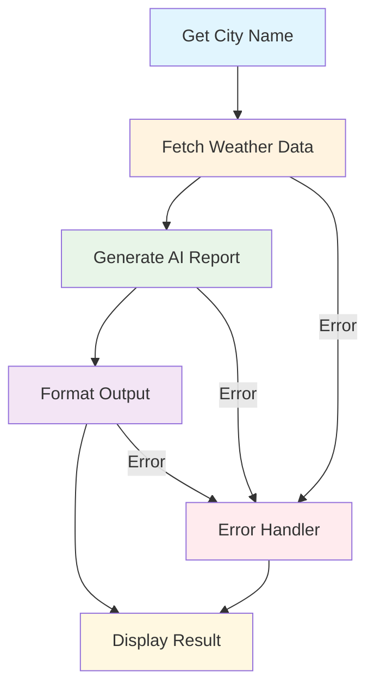

# Build a Weather Bot with AgentMap

## What We're Building

Create an intelligent weather bot that:
- ✅ Prompts users for a city name
- ✅ Fetches real weather data from OpenWeatherMap API
- ✅ Generates natural language weather reports using AI
- ✅ Handles errors gracefully
- ✅ Formats output professionally

**Estimated Time**: 30 minutes  
**Difficulty**: Beginner  
**Learning Goals**: Custom agents, API integration, LLM usage, error handling

## Prerequisites

- Python 3.8+ with AgentMap installed (`pip install agentmap`)
- OpenWeatherMap API key ([Get free key](https://openweathermap.org/api))
- OpenAI API key ([Get key](https://platform.openai.com/api-keys))
- Basic understanding of CSV files

## Workflow Overview



## Step 1: Create the Workflow CSV

Create a file called `weather_bot.csv`:

```csv
GraphName,Node,Edge,Context,AgentType,Success_Next,Failure_Next,Input_Fields,Output_Field,Prompt,Description
WeatherFlow,GetLocation,,Get user location,input,FetchWeather,ErrorHandler,,location,Enter the city name for weather report:,Prompts user for city name
WeatherFlow,FetchWeather,,Fetch weather data from API,custom:WeatherAPIAgent,GenerateReport,ErrorHandler,location,weather_data,,Fetches real weather data from OpenWeatherMap
WeatherFlow,GenerateReport,,{"provider": "openai", "model": "gpt-3.5-turbo", "temperature": 0.7},llm,FormatOutput,ErrorHandler,weather_data|location,weather_report,Generate a friendly and informative weather report for {location} based on this data: {weather_data},Creates natural language weather report
WeatherFlow,FormatOutput,,Format the final output,default,End,ErrorHandler,weather_report,final_report,✅ Weather Report Generated Successfully,Formats the final output message
WeatherFlow,ErrorHandler,,Handle any errors gracefully,echo,End,,error,error_message,,Displays error messages to user
WeatherFlow,End,,Complete workflow,echo,,,final_report|error_message,output,,Final output node
```

## Step 2: Generate Custom Agent Template

Run the scaffolding command to create the weather agent:

```bash
agentmap scaffold --csv weather_bot.csv
```

This creates `custom_agents/weather_api_agent.py` with a starter template.

## Step 3: Implement the Weather API Agent

Replace the generated file with this complete implementation:

```python title="custom_agents/weather_api_agent.py"
from typing import Dict, Any, Optional
import requests
import os
from agentmap.agents.base_agent import BaseAgent

class WeatherAPIAgent(BaseAgent):
    """
    Fetches weather data from OpenWeatherMap API.
    
    Provides comprehensive weather information including temperature,
    conditions, humidity, wind speed, and more.
    """
    
    def __init__(self, name, prompt, context=None, logger=None, 
                 execution_tracker_service=None, state_adapter_service=None):
        """Initialize WeatherAPIAgent with API configuration."""
        super().__init__(name, prompt, context, logger, 
                         execution_tracker_service, state_adapter_service)
        
        # Get API key from environment or context
        self.api_key = self.context.get("api_key", os.getenv("OPENWEATHER_API_KEY"))
        self.base_url = "https://api.openweathermap.org/data/2.5/weather"
        
        # Configuration options
        self.units = self.context.get("units", "metric")  # metric, imperial, kelvin
        self.language = self.context.get("language", "en")
        self.timeout = self.context.get("timeout", 10)
    
    def process(self, inputs: Dict[str, Any]) -> Any:
        """
        Fetch weather data for the specified location.
        
        Args:
            inputs: Dictionary containing 'location' key
            
        Returns:
            Dictionary with comprehensive weather information or error details
        """
        location = inputs.get("location", "").strip()
        
        # Validate input
        if not location:
            self.log_error("No location provided")
            return {
                "error": "Please provide a valid city name",
                "success": False,
                "location": "Unknown"
            }
        
        if not self.api_key:
            self.log_error("No API key configured")
            return {
                "error": "Weather service not configured. Please set OPENWEATHER_API_KEY environment variable.",
                "success": False,
                "location": location
            }
        
        try:
            # Prepare API request parameters
            params = {
                "q": location,
                "appid": self.api_key,
                "units": self.units,
                "lang": self.language
            }
            
            self.log_info(f"Fetching weather for: {location}")
            
            # Make API request
            response = requests.get(self.base_url, params=params, timeout=self.timeout)
            
            if response.status_code == 200:
                data = response.json()
                
                # Extract and structure weather information
                weather_info = {
                    "success": True,
                    "location": data.get("name", location),
                    "country": data.get("sys", {}).get("country", ""),
                    "coordinates": {
                        "latitude": data.get("coord", {}).get("lat", 0),
                        "longitude": data.get("coord", {}).get("lon", 0)
                    },
                    "temperature": {
                        "current": round(data.get("main", {}).get("temp", 0), 1),
                        "feels_like": round(data.get("main", {}).get("feels_like", 0), 1),
                        "min": round(data.get("main", {}).get("temp_min", 0), 1),
                        "max": round(data.get("main", {}).get("temp_max", 0), 1)
                    },
                    "weather": {
                        "main": data.get("weather", [{}])[0].get("main", ""),
                        "description": data.get("weather", [{}])[0].get("description", ""),
                        "icon": data.get("weather", [{}])[0].get("icon", "")
                    },
                    "atmosphere": {
                        "humidity": data.get("main", {}).get("humidity", 0),
                        "pressure": data.get("main", {}).get("pressure", 0),
                        "visibility": data.get("visibility", 0) / 1000  # Convert to km
                    },
                    "wind": {
                        "speed": data.get("wind", {}).get("speed", 0),
                        "direction": data.get("wind", {}).get("deg", 0),
                        "gust": data.get("wind", {}).get("gust", 0)
                    },
                    "clouds": data.get("clouds", {}).get("all", 0),
                    "timestamps": {
                        "data_time": data.get("dt", 0),
                        "sunrise": data.get("sys", {}).get("sunrise", 0),
                        "sunset": data.get("sys", {}).get("sunset", 0)
                    },
                    "units": self.units
                }
                
                self.log_info(f"Successfully fetched weather for {weather_info['location']}")
                return weather_info
                
            elif response.status_code == 404:
                error_msg = f"City '{location}' not found. Please check the spelling and try again."
                self.log_warning(error_msg)
                return {"error": error_msg, "success": False, "location": location}
                
            elif response.status_code == 401:
                error_msg = "Invalid API key. Please check your OpenWeatherMap API key."
                self.log_error(error_msg)
                return {"error": error_msg, "success": False, "location": location}
                
            else:
                error_msg = f"Weather API error: {response.status_code} - {response.text}"
                self.log_error(error_msg)
                return {"error": error_msg, "success": False, "location": location}
                
        except requests.exceptions.Timeout:
            error_msg = "Weather service timeout. Please try again."
            self.log_error(error_msg)
            return {"error": error_msg, "success": False, "location": location}
            
        except requests.exceptions.ConnectionError:
            error_msg = "Unable to connect to weather service. Check your internet connection."
            self.log_error(error_msg)
            return {"error": error_msg, "success": False, "location": location}
            
        except requests.exceptions.RequestException as e:
            error_msg = f"Network error: {str(e)}"
            self.log_error(error_msg)
            return {"error": error_msg, "success": False, "location": location}
            
        except Exception as e:
            error_msg = f"Unexpected error: {str(e)}"
            self.log_error(error_msg)
            return {"error": error_msg, "success": False, "location": location}
    
    def _get_child_service_info(self) -> Optional[Dict[str, Any]]:
        """Provide debugging information about the agent configuration."""
        return {
            "api_configured": bool(self.api_key),
            "base_url": self.base_url,
            "units": self.units,
            "language": self.language,
            "timeout": self.timeout
        }
```

## Step 4: Set Up Environment Variables

Create a `.env` file in your project directory:

```bash title=".env"
# OpenWeatherMap API Key (required)
OPENWEATHER_API_KEY=your_openweather_api_key_here

# OpenAI API Key (required)
OPENAI_API_KEY=your_openai_api_key_here

# Optional: AgentMap logging level
AGENTMAP_LOG_LEVEL=INFO
```

Alternatively, set environment variables directly:

```bash
export OPENWEATHER_API_KEY="your_openweather_api_key_here"
export OPENAI_API_KEY="your_openai_api_key_here"
```

## Step 5: Configure AgentMap

Create `agentmap_config.yaml`:

```yaml title="agentmap_config.yaml"
# AgentMap Configuration for Weather Bot
llm:
  providers:
    openai:
      api_key: ${OPENAI_API_KEY}
      models:
        - gpt-3.5-turbo
        - gpt-4
      default_model: gpt-3.5-turbo
      temperature: 0.7

paths:
  workflows: ./
  custom_agents: ./custom_agents
  functions: ./functions
  data: ./data
  outputs: ./outputs

logging:
  level: INFO
  format: "%(asctime)s - %(name)s - %(levelname)s - %(message)s"

execution:
  tracking_enabled: true
  default_timeout: 30
```

## Step 6: Run the Weather Bot

Execute your weather bot workflow:

```bash
agentmap run --graph WeatherFlow --csv weather_bot.csv
```

## Expected Output

When you run the workflow, you'll see:

```
Enter the city name for weather report: London

✅ Weather Report Generated Successfully

🌤️ Weather Report for London, GB

Good afternoon! Here's your current weather report for London:

**Current Conditions:**
- Temperature: 18°C (feels like 17°C)
- Weather: Partly cloudy skies
- Humidity: 65%
- Wind: Light breeze from the southwest at 5.2 m/s

**Additional Details:**
- Daily range: 15°C - 22°C
- Atmospheric pressure: 1013 hPa
- Visibility: 10 km
- Cloud coverage: 40%

**Perfect Day Summary:**
It's a pleasant day in London with partly cloudy conditions. The temperature 
is comfortable for outdoor activities, though you might want to keep a light 
jacket handy for the evening. The gentle breeze makes it feel quite refreshing!

Have a wonderful day in London! 🇬🇧
```

## Common Issues & Solutions

### 🚨 Issue: "No API key configured"
**Solution**: Ensure you've set the `OPENWEATHER_API_KEY` environment variable:
```bash
export OPENWEATHER_API_KEY="your_actual_api_key"
```

### 🚨 Issue: "City not found"
**Solution**: Try different city name formats:
- Use English names: "Rome" instead of "Roma"
- Include country codes: "London,GB" or "London,UK"
- Try major city names in the region

### 🚨 Issue: "OpenAI API errors"
**Solution**: 
- Verify your OpenAI API key is valid
- Check your API usage limits
- Ensure you have sufficient credits

### 🚨 Issue: "Agent not found"
**Solution**: 
- Run `agentmap scaffold --csv weather_bot.csv` to generate the agent
- Ensure the custom_agents directory is in the correct location
- Check the agent file name matches the expected pattern

### 🚨 Issue: "Timeout errors"
**Solution**: 
- Check your internet connection
- Increase timeout value in the agent context
- Try again during off-peak hours

## Enhancements & Next Steps

### 🎯 **Beginner Enhancements**
1. **Add more cities**: Modify to ask for multiple cities
2. **Different units**: Add Fahrenheit option 
3. **Weather icons**: Include emoji weather icons in output
4. **Save reports**: Add file output to save weather reports

### 🎯 **Intermediate Enhancements**
1. **5-day forecast**: Extend to show weather forecast
2. **Weather alerts**: Add severe weather warnings
3. **Location suggestions**: Implement city name auto-complete
4. **Historical data**: Compare with yesterday's weather

### 🎯 **Advanced Enhancements**
1. **Multiple providers**: Add backup weather services
2. **Caching**: Implement weather data caching
3. **Scheduling**: Set up automated daily weather reports
4. **Integration**: Connect to Slack/Discord for notifications

## Download Starter Files

```bash
# Clone the complete weather bot example
git clone https://github.com/jwwelbor/AgentMap-Examples.git
cd AgentMap-Examples/weather-bot

# Or download individual files
curl -O https://raw.githubusercontent.com/jwwelbor/AgentMap-Examples/main/weather-bot/weather_bot.csv
curl -O https://raw.githubusercontent.com/jwwelbor/AgentMap-Examples/main/weather-bot/custom_agents/weather_api_agent.py
```

## Related Tutorials

- **[Data Processing Pipeline](./data-processing-pipeline)** - Learn data transformation
- **[Customer Support Bot](./customer-support-bot)** - Build conversational agents  
- **[API Integration](./api-integration)** - Connect to external services

## Troubleshooting

Having issues? Check our [troubleshooting guide](../guides/troubleshooting) or ask for help in our [community discussions](https://github.com/jwwelbor/AgentMap/discussions).

---

**🎉 Congratulations!** You've built your first AI-powered weather bot with AgentMap. This tutorial covered custom agents, API integration, error handling, and LLM usage - foundational skills for building more complex workflows.
