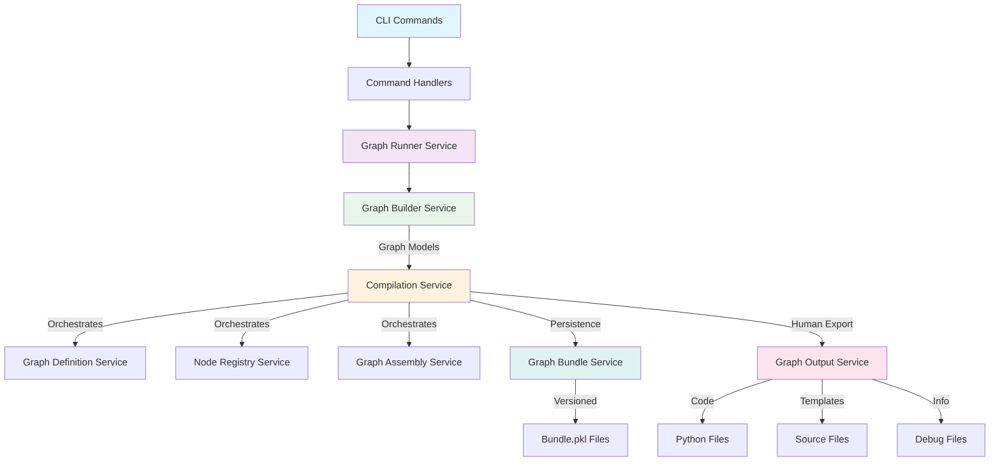

# AgentMap Service Flow Architecture

## Complete Pipeline Overview

AgentMap follows a clean architecture pattern with distinct service layers handling different aspects of graph lifecycle management. This document maps the complete flow from CLI commands through to final outputs.

## Service Architecture Layers



## Core Service Flows

### **Flow 1: CLI → Graph Compilation → Bundle Storage**

**Complete Path:** CLI → Runner → Builder → Compilation → Bundle Storage

#### **1. CLI Entry Point**
```bash
# User executes CLI command
agentmap compile my_graph

# Or via Python
python -m agentmap.cli compile my_graph
```

#### **2. CLI Command Handler**
```python
# cli/commands/compile_command.py
def handle_compile(graph_name: str):
    runner = container.get(GraphRunnerService)
    result = runner.compile_graph(graph_name)
    return result
```

#### **3. Graph Runner Service (Orchestration)**
```python
# services/graph_runner_service.py
class GraphRunnerService:
    def compile_graph(self, graph_name: str):
        # Delegates to CompilationService
        options = CompilationOptions(
            csv_path=self.config.get_csv_path(),
            output_dir=self.config.get_compiled_graphs_path()
        )
        return self.compilation_service.compile_graph(graph_name, options)
```

#### **4. Compilation Service (Central Orchestrator)**
```python
# services/compilation_service.py  
class CompilationService:
    def compile_graph(self, graph_name: str, options: CompilationOptions):
        # Step 4a: Build graph from CSV
        graph = self.graph_definition.build_from_csv(options.csv_path, graph_name)
        
        # Step 4b: Prepare node registry  
        node_registry = self.node_registry.prepare_for_assembly(graph.nodes, graph_name)
        
        # Step 4c: Assemble executable graph
        compiled_graph = self.assembly_service.assemble_graph(graph, node_registry)
        
        # Step 4d: Create versioned bundle
        with open(options.csv_path, 'r') as f:
            csv_content = f.read()
        bundle = self.bundle_service.create_bundle(compiled_graph, node_registry, csv_content)
        
        # Step 4e: Persist bundle
        output_path = Path(options.output_dir) / f"{graph_name}.pkl"
        self.bundle_service.save_bundle(bundle, output_path)
        
        return CompilationResult(success=True, output_path=output_path)
```

#### **5. Bundle Storage (Final Persistence)**
```python
# services/graph_bundle_service.py
class GraphBundleService:
    def save_bundle(self, bundle: GraphBundle, path: Path):
        data = {
            "graph": bundle.graph,           # Compiled LangGraph
            "node_registry": bundle.node_registry,  # Agent instances
            "version_hash": bundle.version_hash      # CSV versioning
        }
        with path.open("wb") as f:
            pickle.dump(data, f)
```

**Result:** `compiled/my_graph.pkl` containing versioned, executable graph bundle

### **Flow 2: CLI → Graph Execution → Results**

**Complete Path:** CLI → Runner → Bundle Loading → Execution → Results

#### **1. CLI Execution Command**
```bash
agentmap run my_graph --input "{'message': 'Hello World'}"
```

#### **2. Execution Flow**
```python
# CLI → GraphRunnerService → GraphExecutionService → Bundle Loading
def execute_graph(graph_name: str, input_state: dict):
    # Load compiled bundle
    bundle_path = Path(f"compiled/{graph_name}.pkl")
    bundle = self.bundle_service.load_bundle(bundle_path)
    
    # Execute loaded graph
    result = bundle.graph.invoke(input_state)
    return result
```

### **Flow 3: CLI → Graph Export → Human-Readable Outputs**

**Complete Path:** CLI → Runner → Builder → Output Generation

#### **1. CLI Export Command**
```bash
agentmap export my_graph --format python --output ./exports/
```

#### **2. Export Flow**
```python
# CLI → GraphRunnerService → GraphOutputService
def export_graph(graph_name: str, format: str, output_path: str):
    # Use consolidated GraphOutputService
    path = self.output_service.export_graph(graph_name, format, output_path)
    return path
```

#### **3. GraphOutputService (Human-Readable Export)**
```python
# services/graph_output_service.py
class GraphOutputService:
    def export_graph(self, graph_name: str, format: str, output_path: str):
        if format == "python":
            return self.export_as_python(graph_name, output_path)
        elif format == "debug":
            return self.export_as_debug(graph_name, output_path)
        # ... other human-readable formats
```

**Results:**
- `exports/my_graph.py` - Executable Python code
- `exports/my_graph.debug` - Debug information
- `exports/my_graph.md` - Documentation

## Detailed Service Responsibilities

### **GraphBuilderService** ✅ (Well-Designed)
```python
# Input: CSV files
# Output: Graph domain models
# Responsibility: CSV parsing and Graph object creation

def build_from_csv(self, csv_path: Path, graph_name: str) -> Graph:
    # Parse CSV rows into Node objects
    # Validate graph structure and connectivity
    # Create Graph domain model with proper entry points
    return graph
```

### **CompilationService** ✅ (Central Orchestrator)
```python
# Input: Graph name and options
# Output: CompilationResult with bundle path
# Responsibility: Orchestrate entire compilation pipeline

def compile_graph(self, graph_name: str, options: CompilationOptions) -> CompilationResult:
    # Coordinate: GraphDefinition → NodeRegistry → Assembly → Bundle
    # Handle versioning and caching
    # Provide unified compilation interface
    return result
```

### **GraphBundleService** ✅ (Persistence Specialist)
```python
# Input: Compiled graph + node registry + version hash
# Output: Persisted bundle files
# Responsibility: Versioned persistence of executable graphs

def save_bundle(self, bundle: GraphBundle, path: Path) -> None:
    # Package: compiled_graph + node_registry + version_hash
    # Persist with pickle for performance
    # Handle version verification
```

### **GraphOutputService** ✅ (NEW - Human Export Specialist)
```python
# Input: Graph name and export format
# Output: Human-readable files
# Responsibility: Generate code, documentation, debug info

def export_as_python(self, graph_name: str, output_path: str) -> Path:
    # Generate executable Python code
    # Include proper imports and setup
    # Create standalone runnable files
    
def export_as_debug(self, graph_name: str, output_path: str) -> Path:
    # Generate debug information
    # Include graph structure analysis
    # Provide troubleshooting details
```

## Example Usage Scenarios

### **Scenario 1: Developer Workflow**
```bash
# 1. Create graph definition in CSV
vim graphs/my_workflow.csv

# 2. Compile for production
agentmap compile my_workflow
# → creates compiled/my_workflow.pkl

# 3. Export for debugging  
agentmap export my_workflow --format debug
# → creates compiled/my_workflow.debug

# 4. Execute with test data
agentmap run my_workflow --input "{'task': 'process data'}"
# → returns execution results
```

### **Scenario 2: CI/CD Pipeline**
```bash
# Automated compilation in CI
agentmap compile-all --validate
# → compiles all graphs in CSV, validates structure

# Export for deployment
agentmap export-all --format python --output ./dist/
# → creates Python files for containerized deployment
```

### **Scenario 3: Development Analysis**
```bash
# Generate documentation
agentmap export my_workflow --format documentation --output ./docs/
# → creates markdown documentation

# Debug graph structure
agentmap export my_workflow --format debug
# → detailed debug information for troubleshooting
```

## Service Dependencies

### **Dependency Injection Configuration**
```python
# di/core_container.py
container.register(GraphBuilderService, [LoggingService, AppConfigService])
container.register(GraphBundleService, [LoggingService])
container.register(GraphOutputService, [AppConfigService, LoggingService, FunctionResolutionService, CompilationService])
container.register(CompilationService, [GraphDefinitionService, LoggingService, AppConfigService, NodeRegistryService, GraphBundleService, GraphAssemblyService, FunctionResolutionService])
container.register(GraphRunnerService, [CompilationService, GraphExecutionService, GraphOutputService, ...])
```

### **Service Communication Pattern**
```
CLI Layer
  ↓ (commands)
Runner Layer  
  ↓ (orchestration)
Business Layer (Compilation, Output, Bundle)
  ↓ (domain operations)
Infrastructure Layer (Logging, Config, File I/O)
```

## Architecture Benefits

### **Clear Separation of Concerns**
- **GraphBuilderService**: CSV → Graph models
- **CompilationService**: Orchestration and coordination
- **GraphBundleService**: Versioned persistence
- **GraphOutputService**: Human-readable exports
- **GraphRunnerService**: CLI integration and workflow management

### **Eliminated Redundancy**
- ✅ Removed duplicate GraphExportService/GraphSerializationService
- ✅ Single source of truth for each responsibility
- ✅ Clear boundaries between persistence and export

### **Extensibility**
- Easy to add new export formats to GraphOutputService
- Bundle versioning supports cache invalidation
- Compilation pipeline supports new graph types

### **Testability**
- Each service has focused responsibilities
- Clean dependency injection for mocking
- Isolated testing of individual components

## Migration Notes

### **Files to Update in IDE:**
1. **Remove redundant services:**
   - `src/agentmap/services/graph_export_service.py` → DELETE
   - `src/agentmap/services/graph_serialization_service.py` → DELETE

2. **Update imports across codebase:**
   ```python
   # OLD
   from agentmap.services.graph_export_service import GraphExportService
   from agentmap.services.graph_serialization_service import GraphSerializationService
   
   # NEW  
   from agentmap.services.graph_output_service import GraphOutputService
   ```

3. **Update DI container registration:**
   ```python
   # di/core_container.py
   # Replace both old services with single new service
   container.register(GraphOutputService, [...dependencies...])
   ```

4. **Update CLI command handlers:**
   ```python
   # cli/commands/export_command.py
   # Use GraphOutputService instead of GraphExportService
   ```

This consolidation eliminates the 90%+ code duplication while maintaining all functionality and improving architectural clarity.
