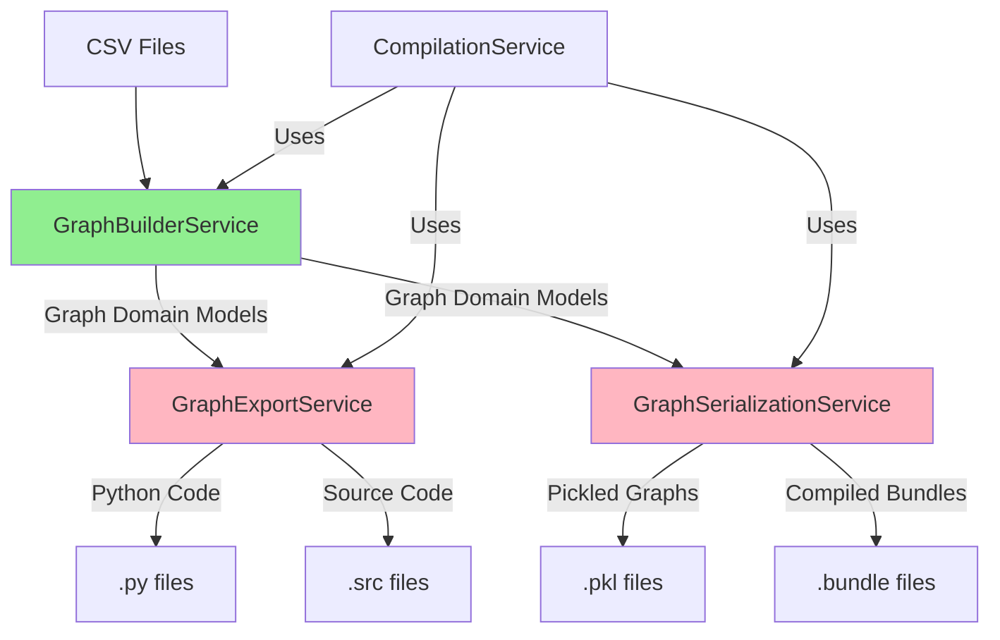

# Graph Services Architecture Documentation

## Overview

The AgentMap graph processing subsystem consists of three primary services that handle different aspects of graph lifecycle management. This document outlines their responsibilities, interactions, and architectural concerns.

## Service Responsibilities

### GraphBuilderService ✅ (Well-Designed)
**Primary Responsibility**: Building Graph domain models from CSV data sources

**Core Functions**:
- Parse CSV files containing graph definitions
- Create Node and Graph domain models
- Validate graph structure and connectivity
- Handle edge connections and entry point detection
- Provide comprehensive validation with detailed error reporting

**Key Strengths**:
- ✅ Clear single responsibility (CSV → Graph conversion)
- ✅ Proper separation of concerns between parsing and building
- ✅ Comprehensive error handling and validation
- ✅ Well-structured domain model output

### GraphExportService vs GraphSerializationService ❌ (ARCHITECTURAL ISSUE)

## **CRITICAL ISSUE: Near-Identical Services**

**Problem**: GraphExportService and GraphSerializationService are nearly identical, containing the same methods with minimal differences. This violates fundamental architectural principles:

- **Violates DRY Principle**: Massive code duplication
- **Violates SRP**: Unclear separation of responsibilities  
- **Maintenance Burden**: Changes must be made in two places
- **Testing Overhead**: Nearly identical test suites required

### Current State Analysis

**GraphExportService** (317 lines):
```python
# Methods: export_graph, _export_as_python, _export_as_pickle, _export_as_source
# Identical implementations to GraphSerializationService
```

**GraphSerializationService** (230 lines):
```python
# Methods: export_graph, _export_as_python, _export_as_pickle, _export_as_source  
# Nearly identical to GraphExportService with minor differences
```

## Proposed Architectural Solution

### Option 1: Merge Services (Recommended)
Create a single **GraphOutputService** with clear method organization:

```python
class GraphOutputService:
    """Unified service for graph export and serialization operations."""
    
    # Export Methods (human-readable formats)
    def export_as_python(self, graph_name: str, **kwargs) -> Path
    def export_as_source(self, graph_name: str, **kwargs) -> Path
    
    # Serialization Methods (binary/persistence formats)  
    def serialize_as_pickle(self, graph_name: str, **kwargs) -> Path
    def serialize_as_bundle(self, graph_name: str, **kwargs) -> Path
    
    # Unified Interface
    def export_graph(self, graph_name: str, format: str, **kwargs) -> Path
```

### Option 2: Clear Separation (Alternative)
Maintain separate services with distinct responsibilities:

**GraphExportService**: Human-readable export formats
- Python code generation
- Source code templates  
- Documentation generation
- Development tools integration

**GraphSerializationService**: Binary persistence formats
- Pickle serialization
- Bundle creation/loading
- Version management
- Cache optimization

## Service Interaction Flow



## Dependencies and Integration

### GraphBuilderService Dependencies
- **LoggingService**: For operation logging and debugging
- **AppConfigService**: For configuration and path management

### Export/Serialization Services Dependencies  
- **AppConfigService**: Path configuration and output settings
- **LoggingService**: Operation tracking and error reporting
- **FunctionResolutionService**: Function reference resolution for exports
- **CompilationService**: Integration with compilation pipeline
- **GraphBundleService**: Bundle creation and management

### Integration Points

1. **CompilationService Integration**: 
   - Uses GraphBuilderService for CSV parsing
   - Uses Export/Serialization services for output generation
   - Coordinates between all graph services

2. **GraphBundleService Integration**:
   - Works with serialization services for bundle persistence
   - Manages versioning and caching

3. **CLI Integration**:
   - Commands delegate to appropriate graph services
   - Export format selection drives service selection

## Recommended Implementation Plan

### Phase 1: Analysis and Documentation ✅
- [x] Document current service responsibilities  
- [x] Identify architectural violations
- [x] Propose solution architecture

### Phase 2: Test Creation (Current)
- [ ] Create comprehensive tests for existing services
- [ ] Test edge cases and error conditions
- [ ] Validate service interfaces

### Phase 3: Architectural Refactoring  
- [ ] Implement service consolidation or clear separation
- [ ] Update dependency injection configuration
- [ ] Migrate existing usage patterns
- [ ] Update CLI integration

### Phase 4: Validation
- [ ] Verify all tests pass with new architecture
- [ ] Performance testing and optimization
- [ ] Documentation updates

## Testing Strategy

### GraphBuilderService Testing ✅
- CSV parsing with various formats and edge cases
- Error handling for malformed data
- Graph connectivity validation
- Entry point detection accuracy

### Export/Serialization Services Testing (Current Task)
- Format-specific output validation
- Large graph performance testing  
- Error handling for compilation failures
- Integration with compilation pipeline

### Integration Testing
- End-to-end CSV → Compiled Graph workflows
- Service coordination and error propagation
- Configuration management across services

## Architecture Quality Metrics

### Current State:
- **DRY Compliance**: ❌ (90%+ code duplication)
- **SRP Compliance**: ❌ (Unclear service boundaries)  
- **Testability**: ⚠️ (Requires duplicate test suites)
- **Maintainability**: ❌ (Changes required in multiple places)

### Target State:
- **DRY Compliance**: ✅ (Eliminated duplication)
- **SRP Compliance**: ✅ (Clear service responsibilities)
- **Testability**: ✅ (Focused test suites)  
- **Maintainability**: ✅ (Single source of truth)

## Conclusion

The graph services subsystem requires architectural refactoring to eliminate the significant DRY and SRP violations between GraphExportService and GraphSerializationService. The recommended approach is to merge these services into a unified GraphOutputService with clear method organization, or establish genuine separation of concerns between export and serialization operations.

This refactoring will improve maintainability, reduce testing overhead, and provide clearer service boundaries for future development.
