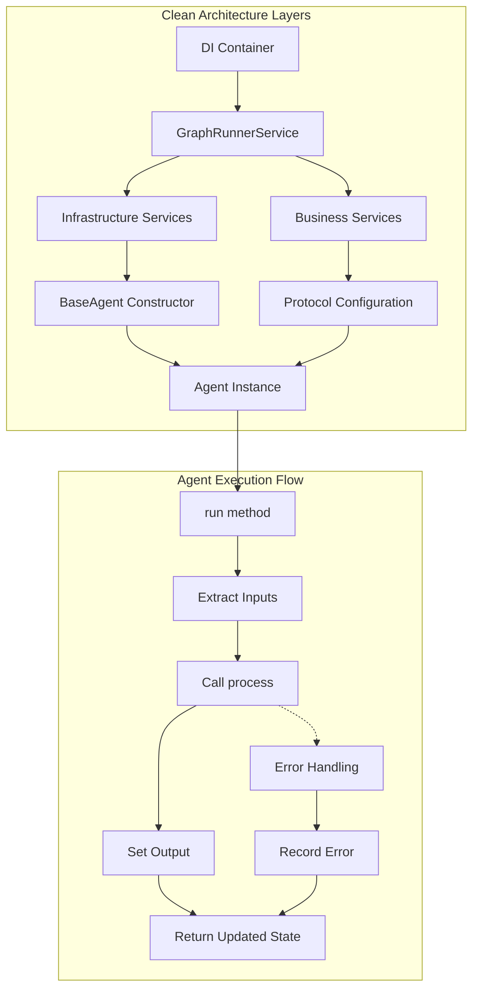
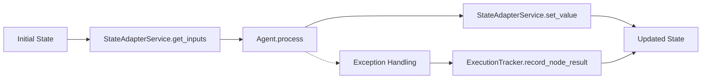

# AgentMap Agent Contract

This document defines the interface and behavior that all agents in the AgentMap ecosystem must follow. This contract ensures extensibility and configurability through a clean architecture pattern with protocol-based dependency injection.

> **Related Documentation**: 
> - [Service Injection](service_injection.md) - Complete guide to the dependency injection system
> - [Advanced Agent Types](advanced_agent_types.md) - Context configuration reference and advanced patterns
> - [AgentMap Agent Types](agentmap_agent_types.md) - Built-in agent types and basic usage

## Architecture Overview

AgentMap uses a modern clean architecture with clear separation between infrastructure services (injected via constructor) and business services (configured via protocols).



## Modern BaseAgent Architecture

### Class Definition

All agents must inherit from `BaseAgent` which uses protocol-based dependency injection:

```python
from typing import Any, Dict, Optional
import logging
from agentmap.agents.base_agent import BaseAgent
from agentmap.services.execution_tracking_service import ExecutionTrackingService
from agentmap.services.state_adapter_service import StateAdapterService
from agentmap.services.protocols import LLMCapableAgent, StorageCapableAgent, PromptCapableAgent

class BaseAgent:
    """
    Modernized base class for all agents in AgentMap.
    
    Uses protocol-based dependency injection for clean service management.
    Infrastructure services are injected via constructor, business services
    are configured post-construction via configure_*_service() methods.
    """
    
    def __init__(
        self, 
        name: str, 
        prompt: str, 
        context: Optional[Dict[str, Any]] = None,
        # Infrastructure services - core services that ALL agents need
        logger: Optional[logging.Logger] = None,
        execution_tracker_service: Optional[ExecutionTrackingService] = None,
        state_adapter_service: Optional[StateAdapterService] = None
    ):
        """
        Initialize the agent with infrastructure dependency injection.
        
        Business services (LLM, storage) are configured post-construction
        via configure_*_service() methods using protocol-based injection.
        
        Args:
            name: Name of the agent node
            prompt: Prompt or instruction for the agent
            context: Additional context including input/output configuration
            logger: Logger instance (required for proper operation)
            execution_tracker_service: ExecutionTrackingService instance (required)
            state_adapter_service: StateAdapterService instance for state operations
        """
        # Core agent configuration
        self.name = name
        self.prompt = prompt
        self.context = context or {}
        self.prompt_template = prompt
        
        # Extract input_fields and output_field from context
        self.input_fields = self.context.get("input_fields", [])
        self.output_field = self.context.get("output_field", None)
        self.description = self.context.get("description", "")
        
        # Infrastructure services (required)
        self._logger = logger
        self._execution_tracker_service = execution_tracker_service
        self._state_adapter_service = state_adapter_service
        self._log_prefix = f"[{self.__class__.__name__}:{self.name}]"
        
        # Business services (configured post-construction via protocols)
        self._llm_service: Optional[LLMServiceProtocol] = None
        self._storage_service: Optional[StorageServiceProtocol] = None
```

### Required Implementation

All agents **must** implement:

```python
def process(self, inputs: Dict[str, Any]) -> Any:
    """
    Process the inputs and return an output value.
    Subclasses must implement this method.
    
    Args:
        inputs: Dictionary of input values extracted from state
        
    Returns:
        Output value for the output_field
    """
    raise NotImplementedError("Subclasses must implement process()")
```

## Service Injection Architecture

### Infrastructure Services (Constructor Injection)

These core services are injected via the constructor and are required for all agents:

```python
# Service Access Properties (with error handling)
@property
def logger(self) -> logging.Logger:
    """Get logger instance, raising if not available."""
    if self._logger is None:
        raise ValueError(f"Logger not provided to agent '{self.name}'")
    return self._logger

@property
def execution_tracker_service(self) -> ExecutionTrackingService:
    """Get execution tracker instance, raising if not available."""
    if self._execution_tracker_service is None:
        raise ValueError(f"ExecutionTracker not provided to agent '{self.name}'")
    return self._execution_tracker_service

@property
def state_adapter_service(self) -> StateAdapterService:
    """Get state adapter service."""
    return self._state_adapter_service
```

### Business Services (Protocol-Based Configuration)

Business services are configured post-construction using protocols:

#### LLM Service Configuration

```python
from agentmap.services.protocols import LLMCapableAgent, LLMServiceProtocol

class MyLLMAgent(BaseAgent, LLMCapableAgent):
    """Agent that uses LLM services."""
    
    def configure_llm_service(self, llm_service: LLMServiceProtocol) -> None:
        """Configure LLM service for this agent."""
        self._llm_service = llm_service
        self.log_debug("LLM service configured")
    
    @property
    def llm_service(self) -> LLMServiceProtocol:
        """Get LLM service, raising clear error if not configured."""
        if self._llm_service is None:
            raise ValueError(f"LLM service not configured for agent '{self.name}'")
        return self._llm_service
    
    def process(self, inputs: Dict[str, Any]) -> Any:
        # Use LLM service
        messages = [{"role": "user", "content": inputs.get("query", "")}]
        response = self.llm_service.call_llm(
            provider="anthropic",
            messages=messages,
            model="claude-3-sonnet-20240229"
        )
        return response
```

#### Storage Service Configuration

```python
from agentmap.services.protocols import StorageCapableAgent, StorageServiceProtocol

class MyStorageAgent(BaseAgent, StorageCapableAgent):
    """Agent that uses storage services."""
    
    def configure_storage_service(self, storage_service: StorageServiceProtocol) -> None:
        """Configure storage service for this agent."""
        self._storage_service = storage_service
        self.log_debug("Storage service configured")
    
    @property
    def storage_service(self) -> StorageServiceProtocol:
        """Get storage service, raising clear error if not configured."""
        if self._storage_service is None:
            raise ValueError(f"Storage service not configured for agent '{self.name}'")
        return self._storage_service
    
    def process(self, inputs: Dict[str, Any]) -> Any:
        # Use storage service
        collection = inputs.get("collection", "default")
        data = self.storage_service.read(collection)
        return data
```

#### Prompt Service Configuration

```python
from agentmap.services.protocols import PromptCapableAgent, PromptManagerServiceProtocol

class MyPromptAgent(BaseAgent, PromptCapableAgent):
    """Agent that uses prompt manager services."""
    
    def configure_prompt_service(self, prompt_service: PromptManagerServiceProtocol) -> None:
        """Configure prompt manager service for this agent."""
        self._prompt_manager_service = prompt_service
        # Re-resolve prompt with the new service
        self.resolved_prompt = self._resolve_prompt(self.prompt)
        self.log_debug("Prompt service configured")
```

## State Management

### Modern State Lifecycle



State flows through the system using injected services:

1. **Input Extraction**: `state_adapter_service.get_inputs(state, input_fields)` extracts relevant fields
2. **Agent Processing**: The agent's `process()` method transforms inputs to output
3. **Output Integration**: `state_adapter_service.set_value(state, output_field, output)` integrates output
4. **Success/Failure Tracking**: `execution_tracker_service.record_node_result()` tracks execution status

### Modern Agent Execution Flow

```python
def run(self, state: Any) -> Dict[str, Any]:
    """
    Run the agent and return the updated state.
    
    Uses dependency-injected services for clean execution flow.
    """
    # Generate execution ID for tracking
    execution_id = str(uuid.uuid4())[:8]
    
    # Get required services (will raise if not available)
    tracker = self.execution_tracker_service
    
    # Extract inputs using state adapter
    inputs = self.state_adapter_service.get_inputs(state, self.input_fields)
    
    # Record node start
    tracker.record_node_start(self.name, inputs)
    
    try:
        # Pre-processing hook for subclasses
        state, inputs = self._pre_process(state, inputs)
        
        # Process inputs to get output
        output = self.process(inputs)
        
        # Post-processing hook for subclasses
        state, output = self._post_process(state, inputs, output)
        
        # Record success
        tracker.record_node_result(self.name, True, result=output)
        
        # Set the final output if we have an output field
        if self.output_field and output is not None:
            state = self.state_adapter_service.set_value(state, self.output_field, output)
        
        return state
        
    except Exception as e:
        # Handle errors with proper tracking
        error_msg = f"Error in {self.name}: {str(e)}"
        self.log_error(error_msg)
        
        tracker.record_node_result(self.name, False, error=error_msg)
        
        return state
```

## Agent Debugging and Introspection

### Service Information Hook

The modern BaseAgent provides debugging capabilities through service information methods:

```python
def get_service_info(self) -> Dict[str, Any]:
    """Get information about injected services for debugging."""
    base_info = {
        "agent_name": self.name,
        "agent_type": self.__class__.__name__,
        "services": {
            "logger_available": self._logger is not None,
            "execution_tracker_available": self._execution_tracker_service is not None,
            "state_adapter_available": self._state_adapter_service is not None,
            "llm_service_configured": self._llm_service is not None,
            "storage_service_configured": self._storage_service is not None
        },
        "protocols": {
            "implements_llm_capable": isinstance(self, LLMCapableAgent),
            "implements_storage_capable": isinstance(self, StorageCapableAgent)
        },
        "configuration": {
            "input_fields": self.input_fields,
            "output_field": self.output_field,
            "description": self.description
        }
    }
    
    # Allow child classes to extend service info
    child_info = self._get_child_service_info()
    if child_info:
        # Merge child-specific service info
        for key, value in child_info.items():
            if key in base_info:
                base_info[key].update(value)
            else:
                base_info[key] = value
    
    return base_info

def _get_child_service_info(self) -> Optional[Dict[str, Any]]:
    """
    Hook for child classes to provide their specific service information.
    
    Child classes should override this method to provide information about
    their specialized services and capabilities.
    """
    return None
```

### Custom Agent Service Information

```python
class MyCustomAgent(BaseAgent, LLMCapableAgent):
    """Custom agent with specialized service reporting."""
    
    def _get_child_service_info(self) -> Optional[Dict[str, Any]]:
        """Provide custom agent-specific service information."""
        return {
            "services": {
                "api_service_available": hasattr(self, 'api_service'),
                "custom_cache_enabled": getattr(self, 'cache_enabled', False)
            },
            "protocols": {
                "implements_custom_protocol": True
            },
            "custom_configuration": {
                "max_retries": getattr(self, 'max_retries', 3),
                "timeout": getattr(self, 'timeout', 30)
            }
        }
```

## Complete Example Implementation

Here's a complete example of a modern agent implementation:

```python
from typing import Dict, Any, Optional
import logging
from agentmap.agents.base_agent import BaseAgent
from agentmap.services.execution_tracking_service import ExecutionTrackingService
from agentmap.services.state_adapter_service import StateAdapterService
from agentmap.services.protocols import LLMCapableAgent, LLMServiceProtocol

class ModernEchoAgent(BaseAgent, LLMCapableAgent):
    """
    Modern echo agent demonstrating clean architecture patterns.
    
    Shows proper constructor with infrastructure services, protocol implementation
    for business services, and debugging capabilities.
    """
    
    def __init__(
        self, 
        name: str, 
        prompt: str, 
        context: Optional[Dict[str, Any]] = None,
        # Infrastructure services
        logger: Optional[logging.Logger] = None,
        execution_tracker_service: Optional[ExecutionTrackingService] = None,
        state_adapter_service: Optional[StateAdapterService] = None
    ):
        """Initialize with modern constructor pattern."""
        super().__init__(
            name=name,
            prompt=prompt,
            context=context,
            logger=logger,
            execution_tracker_service=execution_tracker_service,
            state_adapter_service=state_adapter_service
        )
        
        # Custom configuration
        self.echo_prefix = self.context.get("echo_prefix", "[ECHO]")
    
    # Protocol implementation for LLM service configuration
    def configure_llm_service(self, llm_service: LLMServiceProtocol) -> None:
        """Configure LLM service for this agent."""
        self._llm_service = llm_service
        self.log_debug("LLM service configured for ModernEchoAgent")
    
    def process(self, inputs: Dict[str, Any]) -> Any:
        """
        Echo back the input data with optional LLM enhancement.
        
        Args:
            inputs: Dictionary containing input values from input_fields
            
        Returns:
            Echoed input data, potentially enhanced by LLM
        """
        self.log_info(f"Processing inputs with echo prefix: {self.echo_prefix}")
        
        if inputs:
            # Basic echo functionality
            echoed_data = {f"{self.echo_prefix}_{key}": value for key, value in inputs.items()}
            
            # Optional LLM enhancement if service is configured
            if self._llm_service is not None and self.prompt:
                try:
                    messages = [{"role": "user", "content": f"Echo and enhance: {inputs}"}]
                    enhanced_response = self.llm_service.call_llm(
                        provider="anthropic", 
                        messages=messages
                    )
                    echoed_data["llm_enhanced"] = enhanced_response
                except Exception as e:
                    self.log_warning(f"LLM enhancement failed: {e}")
            
            return echoed_data
        
        return f"{self.echo_prefix} No input provided to echo"
    
    def _get_child_service_info(self) -> Optional[Dict[str, Any]]:
        """Provide ModernEchoAgent-specific service information."""
        return {
            "services": {
                "llm_enhancement_available": self._llm_service is not None
            },
            "configuration": {
                "echo_prefix": self.echo_prefix,
                "supports_llm_enhancement": True
            },
            "capabilities": {
                "basic_echo": True,
                "llm_enhanced_echo": self._llm_service is not None,
                "debugging_info": True
            }
        }
```

## Agent Testing with Modern Patterns

```python
def test_modern_echo_agent():
    """Test agent with proper dependency injection."""
    from unittest.mock import Mock
    
    # Create mock services
    mock_logger = Mock()
    mock_tracker = Mock()
    mock_state_adapter = Mock()
    mock_llm_service = Mock()
    
    # Configure mock behaviors
    mock_state_adapter.get_inputs.return_value = {"input": "Hello, world!"}
    mock_state_adapter.set_value.return_value = {"output": "processed"}
    mock_llm_service.call_llm.return_value = "Enhanced: Hello, world!"
    
    # Create agent with infrastructure services
    agent = ModernEchoAgent(
        name="TestEcho",
        prompt="Echo the input",
        context={"input_fields": ["input"], "output_field": "output"},
        logger=mock_logger,
        execution_tracker_service=mock_tracker,
        state_adapter_service=mock_state_adapter
    )
    
    # Configure business services
    agent.configure_llm_service(mock_llm_service)
    
    # Test process method directly
    inputs = {"input": "Hello, world!"}
    result = agent.process(inputs)
    
    # Verify results
    assert "[ECHO]_input" in result
    assert result["[ECHO]_input"] == "Hello, world!"
    assert result["llm_enhanced"] == "Enhanced: Hello, world!"
    
    # Test service info debugging
    service_info = agent.get_service_info()
    assert service_info["services"]["llm_service_configured"] == True
    assert service_info["protocols"]["implements_llm_capable"] == True
```

## Migration from Legacy Patterns

### Old Pattern (Deprecated)
```python
# OLD: Simple constructor, no service injection
agent = EchoAgent("Echo", "prompt", {"input_fields": ["input"]})
```

### Modern Pattern (Recommended)
```python
# NEW: Infrastructure services via constructor, business services via protocols
agent = ModernEchoAgent(
    name="Echo",
    prompt="prompt", 
    context={"input_fields": ["input"]},
    logger=logger,
    execution_tracker_service=tracker_service,
    state_adapter_service=state_adapter_service
)
# Business services configured post-construction
agent.configure_llm_service(llm_service)
```

## Framework Integration Summary

| Component | Infrastructure Services | Business Services |
|-----------|------------------------|-------------------|
| **Injection Method** | Constructor | Protocol-based post-construction |
| **Required For** | All agents | Only agents needing specific capabilities |
| **Examples** | Logger, ExecutionTracker, StateAdapter | LLM, Storage, Prompt Manager |
| **Configuration** | GraphRunnerService provides via DI | configure_*_service() methods |
| **Error Handling** | Raises ValueError if missing | Raises ValueError if not configured |
| **Testing** | Mock in constructor | Mock and configure separately |

The modern AgentMap architecture provides clean separation of concerns, type-safe dependency injection, and comprehensive debugging capabilities while maintaining backward compatibility through migration patterns.

## Next Steps

After understanding the agent contract:

1. **Deep Dive into Service Injection**: Read [Service Injection](service_injection.md) for comprehensive dependency injection examples
2. **Explore Context Configuration**: Check [Advanced Agent Types](advanced_agent_types.md) for detailed context configuration options
3. **Study Built-in Implementations**: Review [AgentMap Agent Types](agentmap_agent_types.md) for practical examples
4. **Custom Agent Development**: See `custom_agents/README.md` for modern development patterns and examples
