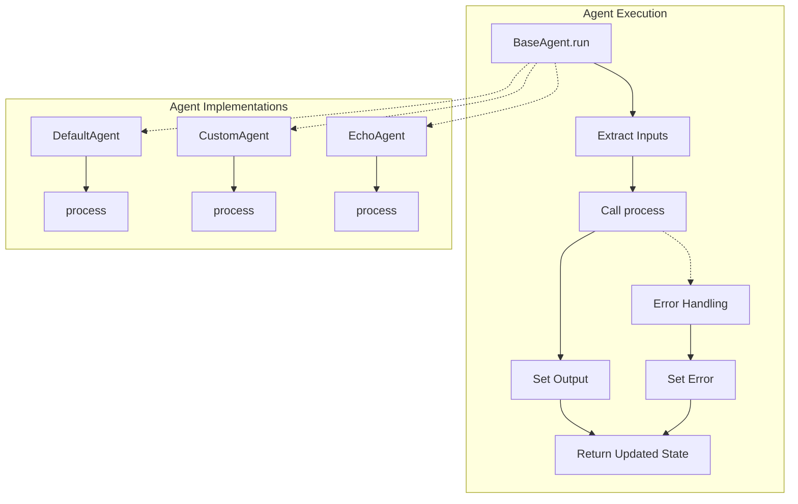
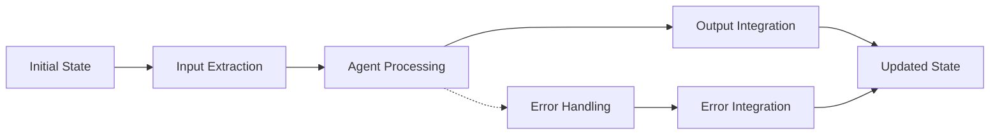
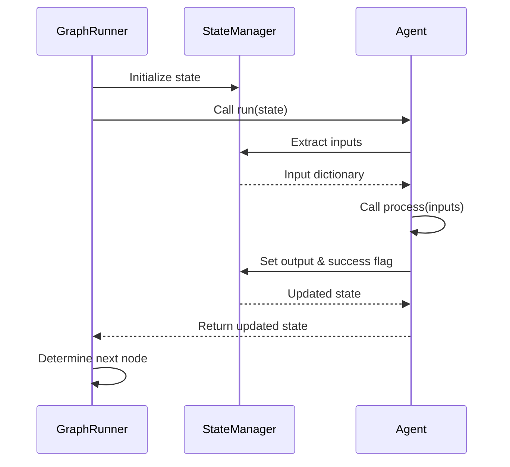

# AgentMap Agent Contract

This document defines the interface and behavior that all agents in the AgentMap ecosystem must follow. This contract ensures extensibility and configurability without enforcing domain-specific implementation details.

## Architecture Overview



## Base Requirements

### Class Definition
All agents must inherit from `BaseAgent` which defines the common interface:

```python
class BaseAgent:
    def __init__(self, name: str, prompt: str, context: dict = None, 
                 logger: logging.Logger = None, execution_tracker: ExecutionTracker = None):
        self.name = name
        self.prompt = prompt
        self.context = context or {}
        self.prompt_template = prompt
        
        # Extract input_fields and output_field from context if available
        self.input_fields = self.context.get("input_fields", [])
        self.output_field = self.context.get("output_field", "output")
        self.description = self.context.get("description", "")
        
        # Store logger and tracker - these can be None initially
        self._logger = logger
        self._execution_tracker = execution_tracker
        self._log_prefix = f"[{self.__class__.__name__}:{self.name}]"
        
    def log(self, level: str, message: str, *args, **kwargs):
        """Log a message with the specified level and proper agent context."""
        if self._logger is None:
            raise ValueError(
                f"Logger not provided to agent '{self.name}'. "
                "Please inject logger dependency using DI fixtures in tests or provide logger in constructor."
            )
        logger_method = getattr(self._logger, level, self._logger.info)
        logger_method(f"{self._log_prefix} {message}", *args, **kwargs)
    
    def log_debug(self, message: str, *args, **kwargs):
        """Log a debug message with agent context."""
        self.log("debug", message, *args, **kwargs)
        
    def log_info(self, message: str, *args, **kwargs):
        """Log an info message with agent context."""
        self.log("info", message, *args, **kwargs)
        
    def log_warning(self, message: str, *args, **kwargs):
        """Log a warning message with agent context."""
        self.log("warning", message, *args, **kwargs)
        
    def log_error(self, message: str, *args, **kwargs):
        """Log an error message with agent context."""
        self.log("error", message, *args, **kwargs)
        
    def log_trace(self, message: str, *args, **kwargs):
        """Log a trace message with agent context."""
        self.log("trace", message, *args, **kwargs)
 
    def process(self, inputs: Dict[str, Any]) -> Any:
        """
        Process the inputs and return an output value.
        Subclasses must implement this method.
        
        Args:
            inputs: Dictionary of input values
            
        Returns:
            Output value for the output_field
        """
        raise NotImplementedError("Subclasses must implement process()")
    
    def _pre_process(self, state: Any, inputs: Dict[str, Any]) -> Tuple[Any, Any]:
        """
        Pre-processing hook that can be overridden by subclasses.
        
        Args:
            state: Current state
            inputs: Extracted input values
            
        Returns:
            Tuple of (state, processed_inputs)
        """
        return state, inputs
    
    def _post_process(self, state: Any, inputs: Dict[str, Any], output: Any) -> Tuple[Any, Any]:
        """
        Post-processing hook that can be overridden by subclasses.
        
        Args:
            state: The current state
            inputs: The input values
            output: The output value from the process method
            
        Returns:
            Tuple of (state, modified_output)
        """
        return state, output
 
    def run(self, state: Any) -> Any:
        """
        Run the agent and return only the fields that need updating.
        This method returns a partial state update instead of the full state.
        Works with dynamic state schemas.

        Args:
            state: Current state object

        Returns:
            Dictionary with only the fields that need to be updated
            
        Raises:
            ValueError: When execution_tracker is not provided to agent
        """
        # Generate a unique execution ID
        execution_id = str(uuid.uuid4())[:8]
        start_time = time.time()

        self.log_trace(f"\n*** AGENT {self.name} RUN START [{execution_id}] at {start_time} ***")

        # Get execution tracker - must be provided via DI
        if self._execution_tracker is None:
            raise ValueError(
                f"ExecutionTracker not provided to agent '{self.name}'. "
                "Please inject execution_tracker dependency using DI fixtures in tests or provide execution_tracker in constructor."
            )
        tracker = self._execution_tracker

        # Extract inputs
        inputs = StateAdapter.get_inputs(state, self.input_fields)

        # Record node start
        tracker.record_node_start(self.name, inputs)

        try:
            # Pre-processing hook for subclasses
            state, inputs = self._pre_process(state, inputs)
            
            # Process inputs to get output
            output = self.process(inputs)

            # Post-processing hook for subclasses
            state, output = self._post_process(state, inputs, output)

            # Get final success status
            tracker.record_node_result(self.name, success=True, result=output)

            # Set the final output if we have an output field
            if self.output_field and output is not None:
                state = StateAdapter.set_value(state, self.output_field, output)
                self.log_debug(f"Set output field '{self.output_field}' = {output}")

            end_time = time.time()
            duration = end_time - start_time
            self.log_trace(f"\n*** AGENT {self.name} RUN COMPLETED [{execution_id}] in {duration:.4f}s ***")
            
            return state

        except Exception as e:
            # Handle errors
            error_msg = f"Error in {self.name}: {str(e)}"
            self.log_error(error_msg)

            # Record failure
            tracker.record_node_result(self.name, False, error=error_msg)
            graph_success = tracker.update_graph_success()

            # Prepare error updates - only the fields that changed
            error_updates = {
                "graph_success": graph_success,
                "last_action_success": False,
                "errors": [error_msg]  # This will be added to existing errors
            }

            # Try to run post-process
            try:
                state, output = self._post_process(state, inputs, error_updates)

            except Exception as post_error:
                self.log_error(f"Error in post-processing: {str(post_error)}")

            end_time = time.time()
            duration = end_time - start_time
            self.log_trace(f"\n*** AGENT {self.name} RUN FAILED [{execution_id}] in {duration:.4f}s ***")
            
            # Return the updated state
            return state
    
    def invoke(self, state: Any) -> Dict[str, Any]:
        """Alias for run() to maintain compatibility with LangGraph."""
        return self.run(state)
```

### Required Implementation

All agents **must** implement:
```python
def process(self, inputs: Dict[str, Any]) -> Any:
    """Process the inputs and return a result."""
```

This method takes a dictionary of extracted inputs and returns a value (or structure) that will be stored in the agent's output field.

## State Management

### State Lifecycle



State flows through the system as follows:

1. **Input Extraction**: The `state_manager.get_inputs()` method extracts relevant fields from the state
2. **Agent Processing**: The agent's `process()` method transforms inputs to an output
3. **Output Integration**: The `state_manager.set_output()` method integrates the output into the state
4. **Success/Failure Handling**: The `last_action_success` flag is set based on processing outcome

### State Components

The state dictionary typically contains:
- Input fields from the initial state
- Output fields from each node's execution
- System fields like `last_action_success`
- Optional memory fields for stateful agents
- Error information when exceptions occur

## Configuration

### Constructor Parameters

- `name`: Node name from the graph
- `prompt`: A text prompt, which may be templated
- `context`: Additional configuration and settings

### Context Dictionary

The context dictionary can be used to provide configuration options:

- `input_fields`: List of input field names to extract from state
- `output_field`: Field name to store the agent's output
- Agent-specific configuration parameters

Example context:
```python
context = {
    "input_fields": ["query", "history"],
    "output_field": "response",
    "model": "gpt-3.5-turbo",
    "temperature": 0.7,
    "memory_key": "chat_history",
    "max_memory_messages": 10
}
```

## Example Implementation

Here's a complete example of a simple agent implementation:

```python
class EchoAgent(BaseAgent):
    """Echo agent that simply returns input data unchanged."""
    
    def process(self, inputs: Dict[str, Any]) -> Any:
        """
        Echo back the input data unchanged.
        
        Args:
            inputs: Dictionary containing input values from input_fields
            
        Returns:
            The input data unchanged
        """
        self.log_info(f"[EchoAgent] '{self.name}' received inputs: {inputs} and prompt: '{self.prompt}'")
        
        # If there are inputs, return the first one
        if inputs:
            # Return all inputs as a dictionary to maintain structure
            return inputs
        
        # Default return if no inputs
        return "No input provided to echo"
```

## Do Not:

- Do **not** override the `run` method unless you have a very specific reason
- Do **not** assume any specific keys exist in the `state`
- Do **not** modify `context` during execution
- Do **not** hardcode any data that could come from CSV or config
- Do **not** persist state between executions unless specifically implementing a memory module

## Testability Tip

To test an agent, provide a minimal `context` and test the `process` method directly:

```python
def test_echo_agent():
    # Set up
    agent = EchoAgent("Echo", "{input}", {"input_fields": ["input"], "output_field": "echoed"})
    inputs = {"input": "Hello, world!"}
    
    # Test process method directly
    result = agent.process(inputs)
    
    # Verify
    assert result["input"] == "Hello, world!"
```

## Integration Flow



The framework is responsible for:
1. Initializing the state
2. Passing state to the agent's `run` method
3. Determining the next node based on the agent's result

The agent is responsible for:
1. Extracting inputs from state
2. Processing inputs to generate an output
3. Integrating the output back into the state
4. Setting success/failure flags appropriately

## Framework Compliance Summary

| Component | Required By Agent | Provided By Framework |
|-----------|-------------------|------------------------|
| `name: str` | ✓ | ✓ from CSV |
| `prompt: str` | ✓ | ✓ from CSV |
| `context: dict` | ✓ | ✓ from loader/init |
| `state: dict` | ✓ | ✓ from graph runtime |
| `process()` implementation | ✓ | ✗ |
| `run()` implementation | ✗ | ✓ from BaseAgent |
| State management | ✗ | ✓ from StateManager |
| Error handling | ✗ | ✓ from BaseAgent |
| Logging methods | ✗ | ✓ from BaseAgent |
| Execution tracking | ✗ | ✓ from BaseAgent |
