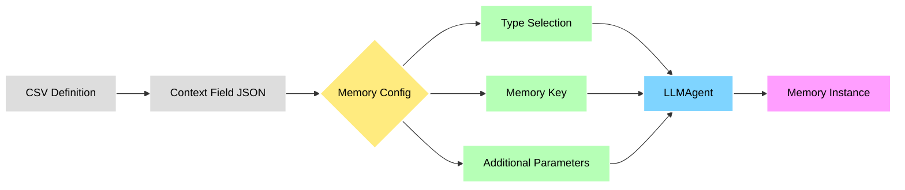
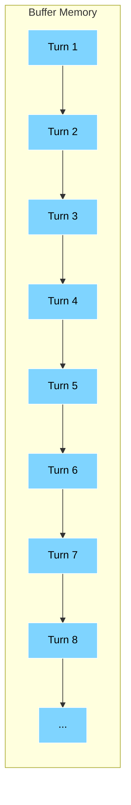
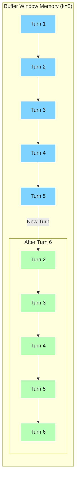
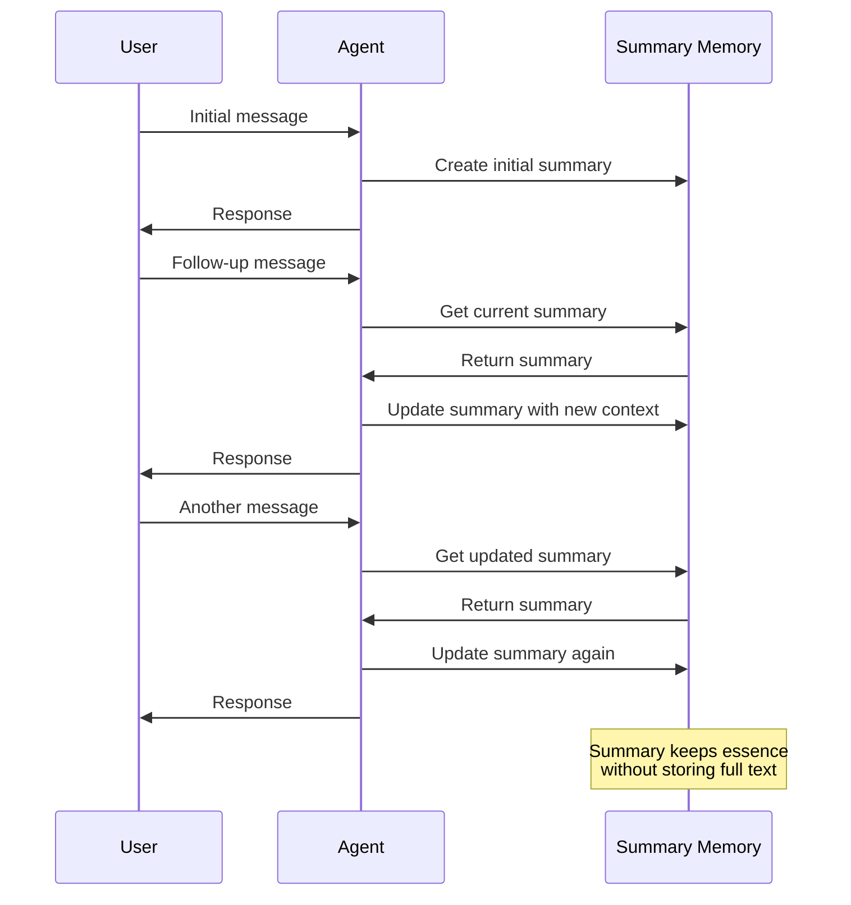
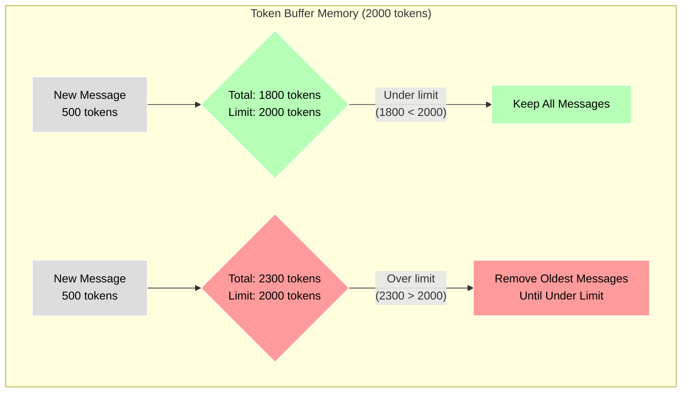
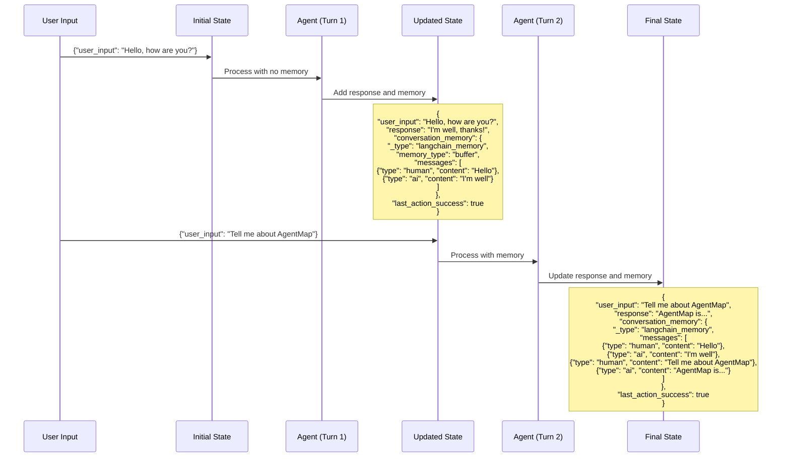

# LangChain Memory in AgentMap: Implementation Guide

## Introduction

Memory capabilities are essential for creating conversational and context-aware agents within AgentMap workflows. This guide explains how AgentMap integrates LangChain memory components, how to configure them declaratively, and when to use different memory types.

## Memory Architecture Overview

AgentMap implements memory as an optional feature for LLM-based agents (OpenAI, Anthropic, Google), allowing workflows to maintain conversation history and context between interactions without persisting data outside of workflow execution.

### Memory Flow Visualization

```mermaid
flowchart TD
    subgraph "Memory Components"
        A[LLMAgent Base] --> B[Memory Initialization]
        B --> C{Memory Type}
        C -->|Buffer| D[ConversationBufferMemory]
        C -->|Window| E[ConversationBufferWindowMemory]
        C -->|Summary| F[ConversationSummaryMemory]
        C -->|Token| G[ConversationTokenBufferMemory]
    end
    
    subgraph "Execution Flow"
        AA[Initial State] --> BB[Node 1 Execution]
        BB --> CC[Memory Serialization]
        CC --> DD[Updated State]
        DD --> EE[Node 2 Execution]
        EE --> FF[Memory Deserialization]
        FF --> GG[Memory Update]
        GG --> HH[Memory Serialization]
        HH --> II[Updated State]
    end
    
    subgraph "Agent Memory Process"
        AAA[Extract State] --> BBB[Deserialize Memory]
        BBB --> CCC[Generate Response]
        CCC --> DDD[Save to Memory]
        DDD --> EEE[Serialize Memory]
        EEE --> FFF[Update State]
    end
    
    style A fill:#FF9EFF,stroke:#FFFFFF,stroke-width:2px,color:#000000
    style B fill:#FF9EFF,stroke:#FFFFFF,stroke-width:1px,color:#000000
    style C fill:#FFEB7F,stroke:#FFFFFF,stroke-width:2px,color:#000000
    style D fill:#7FD4FF,stroke:#FFFFFF,stroke-width:1px,color:#000000
    style E fill:#7FD4FF,stroke:#FFFFFF,stroke-width:1px,color:#000000
    style F fill:#7FD4FF,stroke:#FFFFFF,stroke-width:1px,color:#000000
    style G fill:#7FD4FF,stroke:#FFFFFF,stroke-width:1px,color:#000000
    style AA fill:#DDDDDD,stroke:#FFFFFF,stroke-width:1px,color:#000000
    style BB fill:#DDDDDD,stroke:#FFFFFF,stroke-width:1px,color:#000000
    style CC fill:#FF9B9B,stroke:#FFFFFF,stroke-width:2px,color:#000000
    style DD fill:#DDDDDD,stroke:#FFFFFF,stroke-width:1px,color:#000000
    style EE fill:#DDDDDD,stroke:#FFFFFF,stroke-width:1px,color:#000000
    style FF fill:#FF9B9B,stroke:#FFFFFF,stroke-width:2px,color:#000000
    style GG fill:#DDDDDD,stroke:#FFFFFF,stroke-width:1px,color:#000000
    style HH fill:#FF9B9B,stroke:#FFFFFF,stroke-width:2px,color:#000000
    style II fill:#DDDDDD,stroke:#FFFFFF,stroke-width:1px,color:#000000
    style AAA fill:#B6FFB6,stroke:#FFFFFF,stroke-width:1px,color:#000000
    style BBB fill:#B6FFB6,stroke:#FFFFFF,stroke-width:1px,color:#000000
    style CCC fill:#B6FFB6,stroke:#FFFFFF,stroke-width:1px,color:#000000
    style DDD fill:#B6FFB6,stroke:#FFFFFF,stroke-width:1px,color:#000000
    style EEE fill:#B6FFB6,stroke:#FFFFFF,stroke-width:1px,color:#000000
    style FFF fill:#B6FFB6,stroke:#FFFFFF,stroke-width:1px,color:#000000
```



### Key Components

1. **LLMAgent Base Class**: Provides memory initialization and management
2. **Memory Serialization Utilities**: Enable memory to be passed between nodes
3. **State Adapter Integration**: Special handling for memory objects
4. **Declarative Configuration**: CSV-based configuration through Context field

## Declarative Memory Configuration

Memory is configured declaratively through the Context field in your CSV workflow definition:

```csv
GraphName,Node,Edge,Context,AgentType,Success_Next,Failure_Next,Input_Fields,Output_Field,Prompt
ChatBot,Conversation,{"memory":{"type":"buffer","memory_key":"chat_history"}},Chat with memory,claude,Next,Error,user_input|chat_history,response,Human: {user_input}
```

### Memory Configuration Flow



### Basic Configuration Structure

```json
{
  "memory": {
    "type": "buffer",
    "memory_key": "conversation_memory"
  }
}
```

### Configuration Parameters

| Parameter | Description | Default | Options |
|-----------|-------------|---------|---------|
| `type` | Memory type to use | `"buffer"` | `"buffer"`, `"buffer_window"`, `"summary"`, `"token_buffer"` |
| `memory_key` | State field to store memory | `"conversation_memory"` | Any valid field name |
| `k` | Window size (for buffer_window) | `5` | Any positive integer |
| `max_token_limit` | Token limit (for token_buffer) | `2000` | Any positive integer |

## Memory Types and When to Use Them

AgentMap supports several memory types, each with specific use cases:

### 1. Buffer Memory (`"type": "buffer"`)

**Description**: Stores the complete conversation history without limitations.

**Memory Growth Visualization**:



**When to use**:
- For short conversations where all context is needed
- When testing conversation workflows
- For simple applications with limited interactions

**Example configuration**:
```json
{
  "memory": {
    "type": "buffer"
  }
}
```

### 2. Buffer Window Memory (`"type": "buffer_window"`)

**Description**: Keeps only the most recent `k` interactions.

**Memory Window Visualization**:



**When to use**:
- For longer conversations where older context becomes less relevant
- To limit token usage in large workflows
- When recent context is more important than full history

**Example configuration**:
```json
{
  "memory": {
    "type": "buffer_window",
    "k": 10
  }
}
```

### 3. Summary Memory (`"type": "summary"`)

**Description**: Maintains a running summary of the conversation instead of storing all exchanges.

**Summary Process Visualization**:



**When to use**:
- For very long conversations
- When overall context matters more than specific details
- To significantly reduce token usage while retaining meaning

**Example configuration**:
```json
{
  "memory": {
    "type": "summary"
  }
}
```

### 4. Token Buffer Memory (`"type": "token_buffer"`)

**Description**: Limits memory based on token count rather than number of exchanges.

**Token Limit Visualization**:



**When to use**:
- For precise control over token usage
- When exchanges vary significantly in length
- To optimize for cost while maximizing context

**Example configuration**:
```json
{
  "memory": {
    "type": "token_buffer",
    "max_token_limit": 4000
  }
}
```

## Default Configuration

The minimal configuration to enable memory is simply:

```json
{
  "memory": {}
}
```

When you use this minimal configuration or omit specific parameters, AgentMap applies these defaults:

| Parameter | Default Value | Description |
|-----------|--------------|-------------|
| `type` | `"buffer"` | Uses `ConversationBufferMemory` which stores all messages without limits |
| `memory_key` | `"conversation_memory"` | Field in state where memory is stored |
| `k` | `5` | For buffer_window type, default window size |
| `max_token_limit` | `2000` | For token_buffer type, default token limit |

Example with default memory configuration:
```csv
ChatBot,Response,,{"memory":{}},claude,Next,Error,user_input|conversation_memory,response,"Human: {user_input}"
```

**Important**: Remember that you must include the memory_key (default: `conversation_memory`) in your agent's `Input_Fields` for memory to work properly.


## Memory Flow in Multi-Agent Workflows

```mermaid
flowchart TD
    subgraph "Multi-Agent Workflow"
        A[Initial State] --> B[Agent 1]
        
        B -->|"Process with<br>Memory A"| C[Memory<br>Serialization]
        C --> D[Updated State]
        
        D --> E[Agent 2]
        E -->|"Process with<br>Memory A"| F[Memory<br>Deserialization]
        F --> G[Memory<br>Update]
        G --> H[Memory<br>Serialization]
        H --> I[Updated State]
        
        I --> J[Agent 3]
        J -->|"Process with<br>Memory A"| K[Memory<br>Deserialization]
        K --> L[Memory<br>Update]
        L --> M[Memory<br>Serialization]
        M --> N[Final State]
    end
    
    style A fill:#DDDDDD,stroke:#FFFFFF,stroke-width:1px,color:#000000
    style B fill:#FF9EFF,stroke:#FFFFFF,stroke-width:1px,color:#000000
    style C fill:#FF9B9B,stroke:#FFFFFF,stroke-width:2px,color:#000000
    style D fill:#DDDDDD,stroke:#FFFFFF,stroke-width:1px,color:#000000
    style E fill:#FF9EFF,stroke:#FFFFFF,stroke-width:1px,color:#000000
    style F fill:#FF9B9B,stroke:#FFFFFF,stroke-width:2px,color:#000000
    style G fill:#7FD4FF,stroke:#FFFFFF,stroke-width:1px,color:#000000
    style H fill:#FF9B9B,stroke:#FFFFFF,stroke-width:2px,color:#000000
    style I fill:#DDDDDD,stroke:#FFFFFF,stroke-width:1px,color:#000000
    style J fill:#FF9EFF,stroke:#FFFFFF,stroke-width:1px,color:#000000
    style K fill:#FF9B9B,stroke:#FFFFFF,stroke-width:2px,color:#000000
    style L fill:#7FD4FF,stroke:#FFFFFF,stroke-width:1px,color:#000000
    style M fill:#FF9B9B,stroke:#FFFFFF,stroke-width:2px,color:#000000
    style N fill:#DDDDDD,stroke:#FFFFFF,stroke-width:1px,color:#000000
```



## Memory Implementation Examples

### Basic Chatbot with Memory

```csv
ChatBot,GetInput,,Get user input,Input,Respond,,message,user_input,What can I help you with?
ChatBot,Respond,{"memory":{"type":"buffer"}},Generate response,OpenAI,GetInput,,user_input|conversation_memory,response,"You are a helpful assistant. User: {user_input}"
```

### Multi-Agent Workflow with Shared Memory

```csv
Support,GetQuery,,Get user query,Input,Classify,,query,user_query,How can we help you today?
Support,Classify,{"memory":{"type":"buffer_window","k":3}},Classify query intent,Claude,RouteQuery,,user_query|conversation_memory,query_type,Classify this query: {user_query}
Support,RouteQuery,,Route to specialist,Branching,ProductSpecialist|TechSupport,,query_type,routing_decision,
Support,ProductSpecialist,{"memory":{"type":"buffer_window","k":3}},Product specialist,OpenAI,GetQuery,,user_query|conversation_memory,response,"You are a product specialist. User: {user_query}"
Support,TechSupport,{"memory":{"type":"buffer_window","k":3}},Technical support,OpenAI,GetQuery,,user_query|conversation_memory,response,"You are a technical support agent. User: {user_query}"
```

### Multi-Turn Conversation with Token Limitation

```csv
Interview,Welcome,,Welcome user,Default,GetQuestion,,user,welcome_message,Welcome to the interview!
Interview,GetQuestion,{"memory":{"type":"token_buffer","max_token_limit":1500}},Ask interview question,Claude,GetAnswer,,question_number|conversation_memory,current_question,"You are an interviewer. Ask question #{question_number}."
Interview,GetAnswer,,Get user answer,Input,EvaluateAnswer,,current_question,user_answer,
Interview,EvaluateAnswer,{"memory":{"type":"token_buffer","max_token_limit":1500}},Evaluate answer,Claude,GetQuestion,,user_answer|conversation_memory,evaluation,"Evaluate this interview answer: {user_answer}"
```

## State Evolution with Memory



## Best Practices

1. **Be Explicit About Memory Keys**: Always specify a memory_key that makes semantic sense for your workflow
   ```json
   {"memory": {"type": "buffer", "memory_key": "customer_interaction_history"}}
   ```

2. **Choose Memory Type Based on Use Case**:
   - Use `buffer` for short conversations
   - Use `buffer_window` for most general cases
   - Use `token_buffer` for optimizing token usage
   - Use `summary` for very long conversations

3. **Share Memory Between Related Agents**: Use the same memory_key for agents that should share context
   ```csv
   SupportFlow,Classifier,{"memory":{"type":"buffer","memory_key":"support_history"}},Classify query,Claude,...
   SupportFlow,Responder,{"memory":{"type":"buffer","memory_key":"support_history"}},Generate response,Claude,...
   ```

4. **Consider Memory Scope**: Memory persists only during a single graph execution; implement your own persistence if needed between runs

5. **Monitor Memory Size**: For long-running workflows, prefer memory types with built-in limitations

## Troubleshooting

| Issue | Possible Solution |
|-------|-------------------|
| Memory not persisting between nodes | Ensure memory_key is consistent and included in Input_Fields |
| LangChain import errors | Install optional dependencies with `pip install agentmap[llm]` |
| Memory serialization failures | Check for complex objects or custom memory types |
| Growing response times | Switch to a memory type with size limitations |
| Incorrect memory content | Verify memory field is properly included in agent input fields |

## Advanced Memory Configurations

### Custom Memory Format

For specialized applications, you can customize how memory appears in prompts:

```json
{
  "memory": {
    "type": "buffer",
    "memory_key": "chat_history",
    "format": "Previous conversation:\n{chat_history}\n\nCurrent query: {query}"
  }
}
```

### Memory with System Instructions

Combine memory with system instructions for more consistent agent behavior:

```csv
Assistant,Respond,{"memory":{"type":"buffer"}},Assistant with memory,Claude,Next,,user_input|conversation_memory,response,"prompt:system_instructions\n\nHuman: {user_input}"
```

### Memory for Specialized Workflows

Configure memory for specific scenarios like summarization workflows:

```csv
DocumentFlow,Summarize,{"memory":{"type":"summary"}},Incremental summarization,OpenAI,Next,,document_chunk|conversation_memory,summary,"Incrementally summarize this document section: {document_chunk}"
```

## Conclusion

AgentMap's integration with LangChain memory provides a powerful yet flexible way to create stateful agent workflows. By using declarative configuration, you can easily implement conversational agents that maintain context across interactions without complexity.

Memory is designed to enhance agent capabilities within the boundaries of AgentMap's orchestration framework, providing just enough statefulness for effective conversations while respecting the separation between workflow orchestration and application state management.