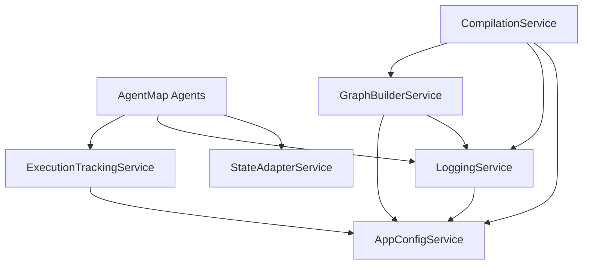

# Import Analysis Results - AgentMap Migration

**Generated:** Task 1 - Analyze Import Errors and Map File Movements  
**Date:** Monday, June 02, 2025  
**Status:** ✅ COMPLETE - Analysis identified major import issues

## Executive Summary

**Import Issues Found:** ~40+ files with import problems  
**Primary Issue:** Old imports pointing to moved/refactored modules  
**Architecture:** Clean architecture migration requires dependency injection patterns

## Major Import Issues Identified

### 1. ExecutionTracker Import Issues

**OLD Import (BROKEN):**
```python
from agentmap.logging.tracking.execution_tracker import ExecutionTracker
```

**NEW Import (CORRECT):**
```python
from agentmap.services.execution_tracking_service import ExecutionTracker
```

**Affected Files:**
- `src/agentmap/agents/base_agent.py`
- `src/agentmap/agents/builtins/default_agent.py`
- `src/agentmap/agents/builtins/llm/anthropic_agent.py`
- `src/agentmap/agents/builtins/llm/openai_agent.py`
- `src/agentmap/agents/builtins/llm/google_agent.py`
- `src/agentmap/agents/builtins/llm/llm_agent.py`
- All other agent files in `agents/builtins/` directory

### 2. StateAdapter Import Issues

**OLD Import (BROKEN):**
```python
from agentmap.state.adapter import StateAdapter
```

**NEW Import (CORRECT):**
```python
from agentmap.services.state_adapter_service import StateAdapter
```

**Affected Files:**
- `src/agentmap/agents/base_agent.py`
- All agent files that handle state

### 3. Configuration Import Issues

**OLD Import Pattern:**
```python
from agentmap.config.base import Configuration
```

**NEW Import Pattern:**
```python
from agentmap.services.config.config_service import ConfigService
```

### 4. Graph Module Import Issues

**OLD Import Patterns:**
```python
from agentmap.graph.builder import GraphBuilder
from agentmap.graph.assembler import GraphAssembler  
from agentmap.graph.bundle import GraphBundle
```

**NEW Import Patterns:**
```python
from agentmap.services.graph_builder_service import GraphBuilderService
from agentmap.services.compilation_service import CompilationService
from agentmap.services.graph_bundle_service import GraphBundleService
```

### 5. Validation Import Issues

**OLD Import Patterns:**
```python
from agentmap.validation.csv_validator import CSVValidator
from agentmap.validation.models import ValidationModel
```

**NEW Import Patterns:**
```python
from agentmap.services.validation.csv_validation_service import CSVValidationService
from agentmap.models.validation.validation_models import ValidationModel
```

## Critical Architecture Change

### Dependency Injection Required

The migration introduces **dependency injection patterns**. Agents now require services to be injected rather than imported directly.

**OLD Agent Pattern:**
```python
class MyAgent(BaseAgent):
    def __init__(self, name, prompt):
        super().__init__(name, prompt)
        self.tracker = ExecutionTracker()  # Direct instantiation
```

**NEW Agent Pattern:**
```python
class MyAgent(BaseAgent):
    def __init__(self, name, prompt, logger, execution_tracker):
        super().__init__(name, prompt, logger=logger, execution_tracker=execution_tracker)
        # Services injected via constructor
```

## Import Categories Analysis

### ✅ Files That Work (No Issues)
- `src/agentmap/services/graph_builder_service.py` 
- `src/agentmap/services/compilation_service.py`
- `src/agentmap/core/cli/main_cli.py`
- Most files in `src/agentmap/models/`
- Most files in `src/agentmap/services/`

### 🔄 Files Needing Import Updates (40+ files)
- All files in `src/agentmap/agents/` directory
- Files referencing old `agentmap.logging.tracking.*` imports
- Files referencing old `agentmap.state.*` imports
- Files referencing old `agentmap.graph.*` imports  
- Files referencing old `agentmap.validation.*` imports

### ❌ Deprecated Import Paths (No Longer Exist)
- `agentmap.logging.tracking.execution_tracker`
- `agentmap.state.adapter`
- `agentmap.graph.builder`
- `agentmap.graph.assembler`
- `agentmap.validation.csv_validator`

## Test File Import Issues

### Test Files Using Old Paths
Based on `test_runner_validation.py`, many test files expect:
- `agentmap.agents.builtins.default_agent.DefaultAgent`
- `agentmap.agents.builtins.echo_agent.EchoAgent`
- Legacy agent constructor signatures

### Required Test Updates
Tests need to be updated to:
1. Use dependency injection for logger and execution_tracker
2. Mock services properly
3. Use new import paths

## Migration Utils Status

The `migration_utils.py` file provides compatibility shims:
- Mock services for testing
- Protocol definitions for type safety
- Compatibility imports where possible

**However:** Many imports still fail because they reference completely moved modules.

## Service Dependencies Map



## Priority Order for Fixes

### 🚨 **CRITICAL** - Breaks All Agent Functionality
1. **ExecutionTracker imports** (40+ files)
2. **StateAdapter imports** (20+ files)
3. **BaseAgent dependencies** (Core agent functionality)

### ⚠️ **HIGH** - Breaks Major Features  
4. **Graph service imports** (15+ files)
5. **Configuration service imports** (10+ files)
6. **Validation service imports** (8+ files)

### 📝 **MEDIUM** - Missing Standard Imports
7. **Standard library imports** (pathlib, typing, etc.)
8. **Type hint imports** (Union, Optional, etc.)

## Next Steps for Task 2

**Task 2** should focus on:
1. Audit all files in `agents/` directory for old import patterns
2. Map specific old imports to new service imports
3. Document dependency injection requirements
4. Create import replacement mapping for automated fixes

## Architecture Benefits

✅ **Clean Architecture**: Clear separation of domain models and services  
✅ **Dependency Injection**: Testable and modular code  
✅ **Service Layer**: Business logic properly encapsulated  
✅ **Domain Models**: Pure data objects without business logic

## Files Requiring Manual Review

Some imports may require **collaborative decisions**:
- Complex service orchestration patterns
- Breaking changes to public APIs
- Test framework integration patterns
- Legacy compatibility requirements

---

**Next Task:** Audit `models/` and `services/` directories for refactored functionality mapping.
